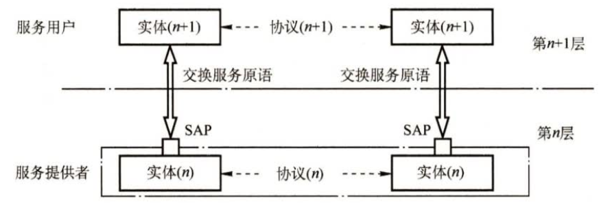
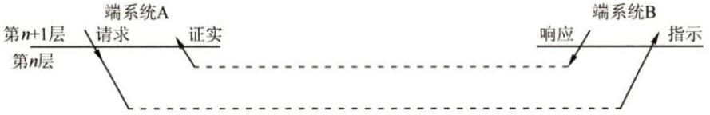
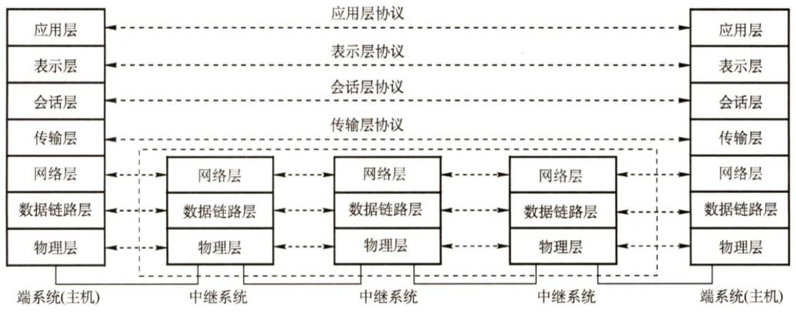
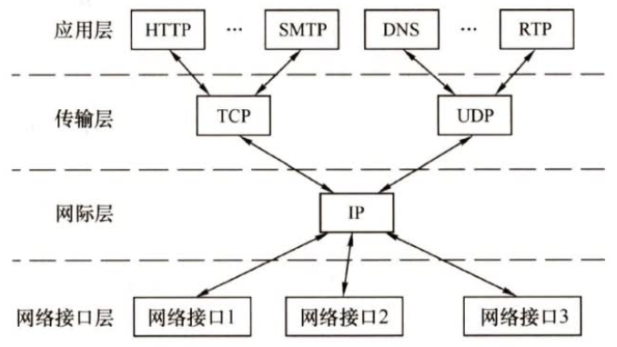
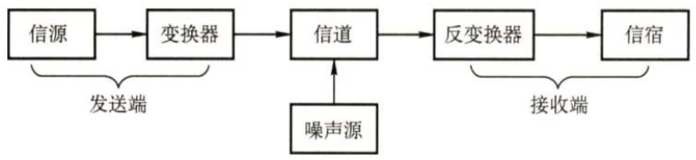
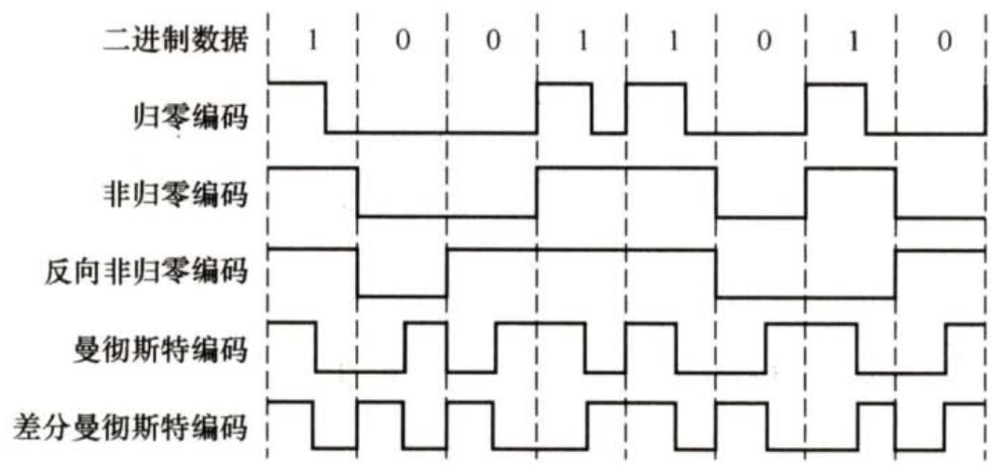
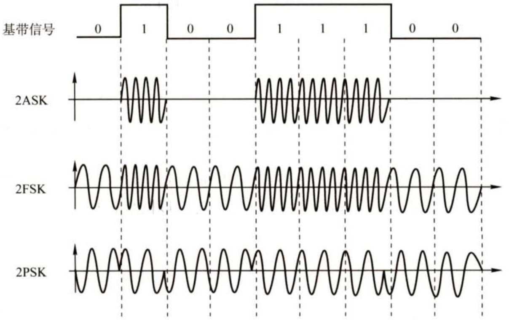

# 计算机网络

## 第一章 计算机网络体系结构

### 1.1 计算机网络概述

#### 1.1.1 计算机网络的概念

**1.广义**

能实现远程信息处理的系统

或进一步能达到资源共享的系统

**2.资源共享观点**

1. 目的：资源共享

2. 组成单元：分布在不同地理位置

3. 规则：网络协议

**3.用户透明性观点**

网络对用户透明

用户好像在使用一台很大的计算机

#### 1.1.2 计算机网络的组成

**1.从组成部分上看**

1. 硬件

2. 软件

3. 协议

**2.从工作方式上看**

1. 边缘部分

2. 核心部分

**3.从功能组成上看**

1. 通信子网

2. 资源子网

#### 1.1.3 计算机网络的功能

1. 数据通信

2. 资源共享（硬件、软件、数据）

3. 分布式处理

4. 提高可靠性

5. 负载均衡

#### 1.1.4 计算机网络的分类

**1.按分布范围**

1. 广域网 WAM（交换技术）

2. 城域网 MAN

3. 局域网 WAN（广播技术）

4. 个人区域网 PAN

**2.按传输技术分类**

1. 广播式网络

2. 点对点网络

**3.按拓扑结构分类**

1. 总线

    优点：建网容易，增减结点方便，节省线路

    缺点：重负载时通信效率不高，总线任意一处对故障敏感

2. 星型

    缺点：成本高，中央设备对故障敏感

3. 环型

4. 网状

    优点：可靠性高

    缺点：控制复杂，成本高

    网状多用于广域网，其他多用于局域网

**4.按使用者分类**

1. 公用网

2. 专用网

**5.按交换技术分类**

1. 电路交换

2. 报文交换

3. 分组交换

    详见 [>> 2.1.4 电路交换、报文交换与分组交换](#214-电路交换报文交换与分组交换)

**6.按传输介质分类**

1. 有线网络

    双绞线网络

    同轴电缆网络

2. 无线网络

    蓝牙

    微波

    无线电

#### 1.1.5 计算机网络的标准化工作

RCF（Request For Comments）因特网标准形式

+ 因特网草案（Internet Draft）

+ 建议标准（Proposed Standard）

+ 草案标准（Draft Standard）

+ 因特网标准（Internet Standard）

相关组织

+ 国际标准化组织 ISO：OSI、HDLC

+ 国际电信联盟 ITU：制定通信规则

+ 国际电气电子工程师协会 IEEE：IEEE802

+ 因特网工程任务组 IETF：因特网标准制定

> 计算机网路与分布式计算机系统的主要区别是什么？
> 
> 分布式系统最主要的特点是，整个系统中的各个计算机对用户都是透明的。用户通过输入命令就可以运行程序，但用户并不知道是哪台计算机在为它运行程序。操作系统为用户选择一台最合适的计算机来运行其程序，并将运行结果传送到合适的地方。
> 
> 计算机网络则与之不同，用户必须先登录欲运行程序的计算机，然后按照计算机的地址，将程序通过计算机网络传送到该计算机上运行，然后根据用户的命令将结果传送到指定的计算机。二者的区别主要是软件的不同。

#### 1.1.6 计算机网络的性能指标

**1.带宽**

网络中某点到另外一点所能通过的**最高数据率**，单位是 b/s 等

即网络设备发送的极限最高速率约束

**2.时延**

是数据从网络的一端传送到另一端锁需要的时间，单位为 s

时延 = 发送（传输）时延 + 传播时延 + 排队时延 + 处理时延

+ 发送时延：从发送分组的第一个比特开始到最后一个比特发送完毕的时间。发送时延 = 数据长度\信道带宽（发送速率）

+ 传播时延：数据在信道上传播的时间。传播时延 = 信道长度\电磁波传播速率

+ 排队时延：等待输入与输出链路可用的时间

+ 处理时延：检错数据与查找转发出口的时间

> 做题时，排队时延和处理时延一般可忽略不计（除非题目另有说明）
>
> 高速链路提高的只是数据发送速率，减少的只是发送时延而不是传播时延

**3.时延带宽积**

时延带宽积 = 传播时延×带宽，单位为 bit

表示是以比特为单位的链路长度，即链路当前的数据比特容量

**4.往返时延RTT**

从发送方发送数据开始，到发送方收到接收方的确认（假如收到数据立刻返回确认）总共经历的时延

RTT 越大，在收到确认前可以发送的数据越多

RTT = 往返传播时延（中间结点的处理时延、排队时延、转发数据时的发送时延） + 末端处理时延

**5.吞吐量**

单位时间内通过某网络或信道接口的数据量，单位是 b/s 等

这是网络实际的平均速率。吞吐量受网络带宽的限制

**6.速率**

数据传输率或比特率。是主机在数字信道上传输数据位数的额定理想速度

**7.利用率**

+ 信道利用率：有数据通过时间\（有+无）数据通过时间

+ 网络利用率：信道利用率加权平均值

[例题]

1.计算机网路的资源主要是指（）

A. 服务器、路由器、通信线路与用户计算机

B. 计算机操作系统、数据库与应用软件

C. Web 服务器、数据库服务器与文件服务器

D. 计算机硬件、软件与数据

答案：D

A、C 属于硬件，B 属于软件

只有 D 最全面

计算机资源包括：硬件、软件、数据

2.下列关于广播式网络的说法中，错误的是（）

A. 可以共享广播信道

B. 不存在路由选择问题

C. 可以不要网络层

D. 不需要服务访问点

答案：D

广播式共享广播信道，通常是局域网的一种通信方式

局域网工作在数据链路层，因此不需要网络层，因而不存在路由选择问题

但数据链路层使用物理层的服务必须通过服务访问点实现

### 1.2 计算机网络体系结构与参考模型

#### 1.2.1 计算机网络分层结构

**1.分层原因**

1. 发起通信的计算机必须将数据通信的通路进行激活

2. 要告诉网络如何识别目的主机

3. 发起通信的计算机要查明目的主机是否开机，并且与网络连接正常

4. 发起通信的计算机要弄清楚，对方计算机中文件管理程序是否已经做好准备工作

5. 确保差错和意外可以解决

**2.分层基本原则**

1. 各层功能相对独立

2. 各层之间界面清晰

3. 定义独立于方法（或者说定义分层但不定义每层具体的实现方法）

4. 上层单向使用下层服务

5. 促进标准化

#### 1.2.3 计算机网络协议、接口、服务的概念

**1.实体**

第 n 层中的活动元素称为 n 层实体。同一层的实体就是对等实体

**2.协议**

为进行网络中的对等实体数据交换而建立的规则、标准或约定。是水平方向的

+ 语法：传输数据的格式

+ 语义：所要完成的功能

+ 同步：各种操作的顺序

**3.接口（访问服务点 SAP）**

上层使用下层服务的入口

接口连接的是相邻层次

n 层的 SAP 提供给 n + 1 层用

**4.服务**

下层为相邻上层提供的功能调用。是垂直方向的

+ 上层使用下层提供的服务

    为了使用下层提供的服务，上下两层之间需要交换命令

    OSI 中称为服务原语

    1. 请求

    2. 指示

    3. 响应

    4. 证实

+ 第 n 层向 n + 1 层提供服务时，不仅包括第 n 层本身的功能，还包括下面所有层次所提供的所有功能

+ 本层所提供服务细节对上一层完全屏蔽

+ 两个主机通信时，对等层在逻辑上有一条直接信道

+ 服务类型

    + 面向连接和无连接

    + 可靠和不可靠

        即是否有纠错、检错、应答

    + 有应答和无应答

**5.数据单位**

在每层，报文都分为两个部分

1. 包头 控制信息部分 协议控制信息 PCI

2. 正文 数据部分 服务数据单元 SDU

它们共同组成协议数据单元 PDU

n + 1 层的 PDU 作为第 n 层的 SDU，在加上本层的 PCI 就变成了本层的 PDU，然后交给 n - 1 层
    
所以 SDUn + PCIn = PDUn = SDUn - 1

物理层的 PDU 为比特，数据链路层的 SDU 为帧，网络层的 SDU 为分组，传输层的 PDU 为报文段

#### 1.2.3 ISO/OSI 参考模型和 TCP/IP 模型

**1.OSI 参考模型**

|名称|英文名|任务|功能|传输单位|用例|
| :--------: | :----------------: | :------------: |:---:|:---:|:---:|
|应用层|Application Layer|用户与网络的界面|直接为用户的应用进程（例如电子邮件、文件传输和终端仿真）提供服务||HTTP、SMTP、FTP、DNS|
|表示层|Presentation Layer|规范交换信息的表示方式|数据格式转换 加密和解密 数据压缩和恢复||JPEG、ASCII |
|会话层|Session Layer|负责在数据传输中建立和维护计算机网络中两台计算机之间的通信连接（会话）|使用校验点同步（SYN）或恢复通信||ADSP、ASP |
|传输层|Transport Layer| 负责端到端通讯|可靠传输，不可靠传输  差错控制 流量控制 复用分用|报文段（TCP）或用户数据报（UDP）|TCP、UDP |
|网络层|Network Layer| 传输分组|路由选择 流量控制 差错控制 规划IP地址(ipv4 和 ipv6 变化只会影响网络层) 拥塞控制 网际互联|数据报或分组|IP、ICP、IGMP、ARP、RARP、OSPF  |
|数据链路层|Data Link Layer|负责点到点通讯 将数据报组装成帧|成帧（帧的开始和结束） 透明传输 差错校验(一般丢弃，纠错由传输层解决) 流量控制 访问（接入）控制（控制信道的控制）|帧|SDLC、HDLC、PPP、STP|
|物理层|Physical Layer| 简单将数据转变为物理电信号，在物理媒体上实现比特流的透明传输|定义接口特性 定义传输模式（单工、半双工、双工） 定义传输速率 比特同步 比特编码|比特|Rj45、802.3 |

端系统一般都是七层，而中间系统如路由器等最多只有三层。上面四层是端到端的通信，而下面三层是点到点的通信

**2.TCP/IP 模型**

先有协议栈才有参考模型

|OSI|TCP/IP|各层主要协议|
|:---:|:---:|:---:|
|应用层|应用层 + 表示层 + 会话层|HTTP、FTP、DNS|
|传输层|传输层|TCP、UDP|
|网际层|网络层|IP|
|网络接口层|数据链路层 + 物理层|Ethernet、ATM、Frame Relay|

**3.TCP/IP 模型与 OSI 参考模型的比较**

||OSI 参考模型|TCP/IP 模型|
|:----:|:---:|:---:|
| 传输层 | 面向连接  | 无连接+面向连接 |
| 网络层 | 无连接+面向连接 |认为可靠性是端到端的问题 无连接|

五层参考模型：应用层、传输层、网络层、数据链路层、物理层

> 为什么一个网络协议必须考虑到各种不利的情况？
> 
> 因为网络协议如果不全面考虑不利的情况
>
> 那么当情况发生变化时，协议双方却仍然保持理想状态，无法改变当前的情况，会一直等下去

> 因特网使用的 IP 协议是无连接的，因此其传输是不可靠的。这样容易使人们感到因特网很不可靠。那么为什么当初不把因特网的传输设计为可靠的呢
> 
> 传统电信网的主要用途是电话通信，并且普通电话机不是智能的，因此电信公司必须花费巨大的代价把电信网设计的非常好，以保证用户的通信质量
>
> 设计 ARPAnet 时，就在讨论谁应负责数据传输的可靠性
>
> 一方认为应该像传统电信网那样，由通信网络负责数据传输的可靠性
>
> 另一种意见则是坚决主张由用户的主机负责数据传输的可靠性，理由是这样可使计算机网络便宜、灵活
>
> 计算机网络的先驱认为，计算机网络和电信网的一个重大区别是终端设备的性能差别很大，于是采用了后者的意见

> 端到端通信和点到点通信有什么区别？
>
> 从本质上说，由物理层、数据链路层和网络层组成的通信子网为网络环境中的主机提供点到点的服务，而传输层为网络中的主机提供端到端的通信
>
> 直接相连的结点之间的通信称为点到点通信，它只提供一台机器到另一台机器之间的通信，不涉及程序或进程的概念。同时，点到点通信并不能保证数据传输的可靠性，也不能说明源主机与目标主机之间是哪两个进程在通信，这些工作都是由传输层来完成的
>
> 端到端通信建立在点到点通信的基础上，它是由一段段的点到点通信信道构成的，是比点到点通信更高一级的通信方式，以完成应用程序（进程）之间的通信。“端”是指用户程序的端口，端口号标识了应用层中不同的进程

[例题]

1.在 OSI 参考模型中，当两台计算机进行文件传输时，为防止中间出现网络故障而重传整个文件的情况，可通过在文件中插入同步点来解决，这个动作发生在（）

A. 表示层

B. 会话层

C. 网络层

D. 应用层

答案：B

会话层的任务：会话管理与同步

2.数据链路层在分组上仅增加了源物理地址和目的物理地址（）

答案：x

添加到包头的除了本层的地址还有本层的控制信息

## 第二章 物理层

物理层需要考虑如何传输比特流，而不关心到底使用何种媒体传输数据。具体传输数据的层次是第 0 层

### 2.1 通信基础

#### 2.1.1 基本概念

**1.数据、信号与码元**

数据是指传送信息的实体

信号是数据的电气或电磁表现

数据/信号可分为模拟（连续）和数字（离散）

码元：对于二进制，符号大小为 n bit，其中一个 bit 表示一个二进制码元

同理对于 m 进制，某符号大小为 n 位，其中一位表示一个 m 进制码元

**2.新源、信道与信宿**

**1)概念**

+ 信源：发送数据的源头

+ 信宿：接受数据的终点

+ 信道：信号的传输媒介

    + 模拟信道、数字信道

    + 有线信道、无线信道

    信道 != 电路

    信道可以视为电路的一个逻辑部件，一个用来表示向某个方向传送信息的介质

    因此一条通信线路往往包含一条发送信道和一条接收信道de

    信道的极限容量是指信道的信息传输速率或码元传输速率（下面有介绍）

**2)通信方式**

+ 单工通信：只能单方面通信，只需一条信道

+ 半双工通信：能发送和接受，但是不能同时发送接收，需要两条信道

+ 全双工通信：都能发送与接受，需要两条信道

**3)传输方式**

+ 串行：速度慢、费用低、适合远距离

+ 并行：速度快、费用高、适合近距离

**4)信号类型**

+ 基带传输

  + 将数字信号 10 直接用两种不同的电压表示，不用调制，直接送到数字信道上传输

  + 是来自信源的信号，如计算机输出的表示文字或多媒体的数据信号，即发出的直接表达了要传输的信息的信号

  + 传输媒体整个带宽都被基带信号占用

  + 近距离，通常用于局域网

  + 1010 使用高低高低电平表示

+ 频带传输

  + 将基带信号对特定频率的载波进行调制后进行的频分复用模拟信号，再传输到模拟信道上传输

  + 将低频的基带信号进行载波调制后将信号的频率范围移动到较高频段以便在信道中传输

  + 远距离，与无线传输

  + 不仅解决电话系统传输数字信号问题，还可以实现多路复用

  + 传输一个码元 A 就相当于 1010

+ 宽带传输

  + 基于频带传输，使用频分复用等技术将链路容量分解为两个或多个信道，每个信道可以携带不同的信号

  + 信道直接互不干扰，提高效率

**3.速率、波特与带宽**

**1)波特 Baud**

指一秒可以传输多少个码元（电平）

1 波特  = 1 码元/秒

比特率 = 波特率*log2(码元的进制数 M)

**2)速率**

分为信息传输速率与码元传输速率

信息传输速率 单位 b/s，就是我们平常说的网速

码元传输速率 单位 码元/秒 = 波特

= 波特率

码元所带信息量（比特数）= log2(码元的进制数 M)

**3)带宽 Band Width**

信道带宽原指信道最高通过频率与最低通过频率之差，单位为 Hz

后值网络中从一点到达另一点的最高数据率，单位为 b/s

#### 2.1.2 奈奎斯特定理与香农定理

**1.奈奎斯特定理 Nyquist**

**1)背景**

信道能通过的频率范围是有限的

信号的高频分量往往不能通过信道，导致信号衰减，接收端接收到的信号波形失去码元之间的清晰界限

这种现象称为码间串扰

**2)公式**

奈氏准则规定避免码间串扰的低通信道最高码元传输速率

最高码元传输速率 = 2*信道带宽，单位为波特 = 2W

**3)结论**

1. 由于码元的传输速率受奈氏准则的制约，所以要提高数据的传输速率，就必须设法使每个码元能携带更多的个比特量的信息，这就需要多元制的调制方法

2. 信道频带越宽，即能通过的信号高频分量越多，就可以用更高速率进行码元的有效传输

**2.香农定理 Shannon**

**1)背景**

信噪比 = 10 lg(信号的平均功率 S/噪声的平均功率 N) = 10lg(S/N)，单位是分贝 dB

采用分贝表示的原因是很多时候，信号要比噪声强得多，比如信号比噪声强 10 亿倍，如果用数值表示的话，那么 1 后面有 9 个 0，很容易丢失一个 0。如果用分贝表示只为 $90dB$，要简单得多，而且不容易出错。分贝对于表示特别大或特别小的数值极为有利，这种表示方式在电子通信领域用途很广

**2)公式**

香农定理规定带宽首先且高斯噪声条件下最高数据传输速率

在带宽受限且有噪声的信道中，为了不产生误差，信息的数据传输速率有上限值

极限数据传输速率 = 信道带宽*log2(1 + 信噪比) = Wlog2(1+S/N)

**3)结论**

1. 只要信息的传输速率低于信道的极限传输速率，就一定能找到某种方式来实现无差错传输

2. 奈奎斯特定理考虑码间串扰，得出码元的传输速率是有上限的，于是想尽量提高码元的进制数

    香农定理又考虑到噪声，说明码元的传输速率达到上限后，码元的进制数也是有限的

> 当没有给信噪比的条件就只能使用奈氏准则，而如果当给出了信噪比与码元种数时，就需要同时使用奈氏准则与香农定理，然后取较小值作为答案

#### 2.1.3 编码与调制

调制：数据 -> 模拟信号

编码：数据 -> 数字信号

数字数据/模拟数据 -> 数字信号/模拟信号的四种搭配：

**1.数字数据编码为数字信号**

1. 归零编码 RZ

    高电平代表 1，否则代表 0

    每个时钟周期的中间均跳变到低电平（归零）

    接收方根据该跳变调整本方的时钟基准，为传输双方提供了自同步机制

    归零要占用一部分带宽，因而传输效率受到了一定的影响

2. 非归零编码 NRZ

    与 RZ 的区别在于不用归零

    无法传递时钟信号，双方难以同步，需要各自带有时钟线

3. 反向非归零编码 NRZI

    与 NRZ 的区别在于用信号的翻转代表 0，用信号的不变代表 1

    集成了前两种编码的优点

    1. 既能传输时钟信号

    2. 又能尽量不损失系统带宽

    用例：USB 2.0

4. 曼彻斯特编码 Manchester Encoding

    “将一个码元分为两个相等的间隔”

    前一个间隔为高电平，后一个间隔为低电平表示 1，相反则代表 0

    也可以使用相反的规定

    每个码元的中间出现跳变

    该跳变既作为时钟信号，用于同步，也作为数据信号

    所占的频带宽度是基带宽度的两倍

    用例：以太网

5. 差分曼彻斯特编码

    将一个码元分为两个相等的间隔

    前半个码元的电平与上一个码元的后半个码元电平相同表示 1，相反则代表 0

    每个码元的中间出现跳变

    该跳变既作为时钟信号，用于同步

    抗干扰性也强于曼彻斯特编码

    用例：局域网

6. 4B/5B编码

    数据流的每 4 位作为一组，编成 5 位码

    编成的 5 位码中的 16 种组合用于表示原来的 4 位码，剩余 16 种组合作为控制码

**2.数字数据调制为模拟信号**

1. 幅移键控（调幅 ASK）。通过改变载波信号的振幅来表示数字信号 1 和 0，而载波的频率和相位都不改变。比较容易实现，但抗干扰能力差

2. 频移键控（调频 FSK）。通过改变载波信号的频率来表示数字信号 1 和 0，而载波的振幅和相位都不改变。容易实现，抗干扰能力强，目前应用较为广泛

3. 相移键控（调相 PSK）。通过改变载波信号的相位来表示数字信号 1 和 0，而载波的振幅和频率都不改变。它又分为绝对调相和相对调相

4. 正交振幅调制（QAM）。在频率相同的前提下，将 ASK 与 PSK 结合起来，形成叠加信号

    设波特率为 B，采用 m 个相位，每个相位有 n 种振幅，码元类型=相位数×振幅数
    
    则该 QAM 技术的数据传输速率 R 为 R = Blog2(mn)，即为波特率×log2(相位数×每相位振幅数)

**3.模拟数据编码为数字信号**

因为计算机内部都是二进制数据，所以需要将模拟信号通过采样、量化转换位有限个数字表示的离散序列

1. 抽样：对模拟信号周期性扫描，把时间上连续的信号变为时间上的离散信号。采样频率遵循采样定理

2. 量化：把抽样取得的电平幅值按照一定的分级标度转换位对应的数字值并取整，于是连续的电平幅值就变为离散的数字量

3. 编码：把量化结果转换为与之对应的二进制编码

**4.模拟数据调制为模拟信号**

+ 低频到高频

+ 频分复用

#### 2.1.4 电路交换、报文交换与分组交换

**1.电路交换**

源结点和目标结点之间建立专用（双方独占）的信道

中间结点不采用存储转发

优点：

+ 数据直接传送，时延小，实时性强

+ 有序传输

+ 无冲突争用

+ 适用性强，可传输模拟信号或数字信号

+ 控制简单

缺点：

+ 建立连接时间长

+ 线路独占，灵活性较差，线路利用率低，不能充分利用容量

+ 不便进行流量控制，差错控制

+ 终端有不同规格，很难标准化

**2.报文交换**

相邻结点之间转发整个报文

1. 源先根据报文加上 IP 地址，物理地址等，通过物理层发送

2. 交换机收到报文之后，先进行存储，等待链路空闲之后进行转发，但是转发的路径不是固定的，是比较随机的

3. 最后通过许多交换机最终到达目的地

优点：

+ 无需建立连接

+ 存储转发

+ 动态分配线路，提高线路可靠性

+ 充分利用线路容量

+ 方便进行传输速率转换，格式转换

+ 可以实现一对多，多对一的访问

+ 可以实现差错控制

缺点：

+ 增大了资源开销

+ 增加了缓冲时延

+ 需要额外的控制机制保证不同报文之间的顺序

+ 无法预测报文大小，因此难以管理缓冲区

所以报文交换主要用于早期电报通信网，不能应用于实时通讯，如电话，视频

**3.分组交换**

相邻结点之间转发分组（整个报文的一部分）

优点：

+ 报文交换的优点

+ 缓冲易于管理

+ 包的平均时延更小

+ 网络占用的平均缓冲区更小

+ 更易于标准化

+ 更适合应用

缺点：

+ 仍存在转发时延

+ 结点交换机需要更强的控制机制

+ 需要传递额外的信息量（组头）

+ 需要额外的控制机制保证不同报文之间的顺序

    若采用虚电路服务，虽无失序问题，但有呼叫建立、数据传输和虚电路释放三个过程

**4.比较**

||信道利用率|时延|用例|
|:---:|:---:|:---:|:---:|
|电路交换|低||传送的数据量很大，且传送时间远大于呼叫时间|
|报文交换|中|||
|分组交换|高|小于报文交换|尤其适合于计算机之间的突发式数据通信|

#### 2.1.5 数据报与虚电路

分组交换进一步分为：

1. 面向连接的虚电路

2. 无连接的数据报

> 都是面向网络层的，比如路由表根据转发表转发就是明显在网络层
>
> 不知道为什么要把这个内容放在物理层……

**1.数据报**

原理：

若主机 A 要向 B 发送分组：

1. 主机 A 发送给相连的交换结点 A

2. 交换结点 A 受到分组后，检查转发表，转发给其他相连的交换结点

3. 最终分组转发到与主机 B 相连的交换结点 B，交换结点 B 再发送给主机 B

特点：

1. 发送分组前不需要建立连接。发送方可随时发送分组，网络中的结点可随时接受分组

2. 网络尽最大努力交付

    最大努力，不保证的含义：
    
    1. 传输不保证可靠性，所以可能丢失
    
    2. 为每个分组独立地选择路由，转发路径可能不同，因而分组不一定按序到达目的结点

3. 发送的分组中要包括发送端和接受端的完整地址，以便可以独立传输

4. 分组在交换结点存储转发时，需要排队等候处理，这会带来一定的时延

    存储转发的延时一般较小，提高了网络的吞吐量
    
    但当通过交换结点的通信量较大或网络发生拥塞时，这种时延会大大增加

    交换结点还可根据情况丢弃部分分组

5. 网络具有冗余路径，当某一交换结点或一段链路出现故障时，可相应地更新转发表，寻找另一条路径转发分组，对故障的适应能力强

6. 收发双发不独占某一链路，资源利用率较高

**2.虚电路**

过程：

1. 呼叫建立

2. 数据传输

3. 虚电路释放

在虚电路方式中，端系统每次建立虚电路时，选择一个没用过的虚电路分配给该虚电路，以区别于本系统中的其他虚电路

在传送数据时，每个数据分组不仅要有分组号、检验和等控制信息，还要有它要通过的虚电路号，以区别于其他虚电路的分组

在虚电路网络中的每个结点上都维持一张虚电路表，它的每一项记录了一个打开的虚电路的信息

包括在接受链路和发送链路的虚电路号，前一结点和下一结点的标识

数据的传输是双向进行的，上述信息是在虚电路的建立过程中确定的

具体过程：

特点：

1. 需电路通信链路的建立和拆除需要时间开销

    对交互式的应用和小量的短分组情况显得浪费

    但对长时间、频繁的数据交换，则效率较高

2. 虚电路的路由选择体现在连接建立阶段，连接建立后，传输路径就确定了

3. 虚电路提供了可靠的通信功能，能保证每个分组正确且有序到达

    此外，还可以对两个数据端点的流量进行控制，当接收方来不及接受数据时，可以通知发送方暂缓发送

4. 虚电路有一个致命的弱点，即当网络中某个结点或链路出故障而彻底失效时，则所有经过该结点或链路的虚电路将遭到破坏

5. 分组首部并不包含目的地址，而是包含虚电路标识符，相对数据报方式开销小

虚电路之所以是“虚”的，是因为这条电路不是专用的

每个结点到其他结点之间的链路可能同时有若干虚电路通过，也可能与多个结点之间具有虚电路

每条虚电路支持特定的两个端系统之间的数据传输，两个端系统之间也可以有多条虚电路为不同的进程服务，这些虚电路的实际路由可能相同也可能不相同。

数据传输过程是由确认的传输（由高层实现），主机B收到分组后要发回相应分组的确认。网络中的传输是否有确认与网络层提供的两种服务没有任何关系

**3.比较**

| a         | 数据报服务                         | 虚电路服务                        |
|:---:|:---:|:---:|
| 连接的建立     | 不要                            | 必须有                          |
| 目的地址      | 每个分组都有完整的目的地址                 | 仅在建立连接阶段使用，之后每个分组使用长度较短的虚电路号 |
| 路由选择      | 每个分组独立地进行路由选择和转发              | 属于同一条虚电路的分组按照同一路由转发          |
| 分组顺序      | 不保证分组的有序到达                    | 保证分组的有序到达                    |
| 可靠性       | 不保证可靠通信，可靠性由用户主机来保证           | 可靠性由网络保证                     |
| 对网络故障的适应性 | 出故障的结点丢失分组，其他分组路径选择发生变化，可正常传输 | 所有经过故障结点的虚电路均不能正常工作          |
| 差错处理和流量控制 | 由用户主机进行流量控制，不保证数据报的可靠性        | 可由分组交换网负责，也可由用户主机负责          |

[例题]

1.测得一个以太网的数据波特率是 40 MBaud，那么其数据率是（）

A. 10 Mb/s

B. 20 Mb/s

C. 40 Mb/s

D. 80 Mb/s

答案：B

曼彻斯特编码中的“将一个码元分为两个相等的间隔”确实是“一个码元代表一位二进制数据”

也就是说，在曼彻斯特编码中，一个码元就是一次高低电平转化，也即一个码元就是 01 或 10 电平

在模拟信道中，码元可以是一段具有特定振幅和频率的波，见 [>> 2.1.3 编码与调制 数字数据调制为模拟信号](#213-编码与调制)

但是在数字信道中，一个码元就是一个 0 或 1 的电平输出

> 有的人说："码元是一个脉冲信号"，进而得出一个码元就是一个 0 或 1 的电平输出
> 
> 这是没有逻辑的，忽视了码元在不同情景下具有不同的含义

因此我们在说“以太网的数据波特率”的时候，我们默认这里的码元是数字信道的码元

这样，就出现了一个微妙的区别，这个数字信道的码元 != 曼彻斯特编码的码元

但是数据率中的“数据”是曼彻斯特编码所表示的数据

因此我们必须要进行：数字信道的码元传输速率 -> 曼彻斯特编码的码元传输速率 -> 曼彻斯特编码的数据传输速率

1. 数字信道的码元传输速率 -> 曼彻斯特编码的码元传输速率

    曼彻斯特编码中，一个码元就是 01 或 10 电平，所以数字信道的码元传输速率/2 = 曼彻斯特编码的码元传输速率

2. 曼彻斯特编码的码元传输速率 -> 曼彻斯特编码的数据传输速率

    曼彻斯特编码中，一个码元对应一位数据，所以曼彻斯特编码的码元传输速率 = 曼彻斯特编码的数据传输速率

    （好吧，暂时忽略单位不一致）

相同类型的题目：10M 802.3 LAN 使用曼彻斯特编码，它的波特率是：

答案：20 MBaud

这里“10M 802.3 LAN”指的是 LAN 的数据传输速率是 10 Mb/s，也就是曼彻斯特编码的数据传输速率

题目问的“它的波特率”指的是“LAN 的波特率”而不是“曼彻斯特编码的波特率”

因此，曼彻斯特编码的数据传输速率 = 曼彻斯特编码的码元传输速率 = 10 MBaud

则数字信道的码元传输速率 = 2*曼彻斯特编码的码元传输速率 = 20 MBaud

事情变得这么麻烦的原因就在于码元的含义是随情景而变的，而书本和网络上的分析很多还是很模糊