- [数据结构](#数据结构)

  - [第一章 绪论](#第一章-绪论)

    - [1.1 数据结构的基本概念](#11-数据结构的基本概念)

  - [1.2 算法效率的度量](#12-算法效率的度量)

  - [第二章 线性表](#第二章-线性表)

    - [2.2 线性表的顺序表示](#22-线性表的顺序表示)

  - [第三章 栈、队列和数组](#第三章-栈队列和数组)

    - [3.1 栈](#31-栈)

    - [3.2 队列](#32-队列)

    - [3.3 栈和队列的应用](#33-栈和队列的应用)

      - [3.3.2 栈在表达式求值中的应用](#332-栈在表达式求值中的应用)

      - [3.4.3 特殊矩阵的压缩存储](#343-特殊矩阵的压缩存储)

  - [第四章 串](#第四章-串)

    - [4.2 KMP](#42-kmp)

  - [第五章 树与二叉树](#第五章-树与二叉树)

    - [5.1 树的基本概念](#51-树的基本概念)

    - [5.2 二叉树的概念](#52-二叉树的概念)

    - [5.3 二叉树的遍历和线索二叉树](#53-二叉树的遍历和线索二叉树)

    - [5.4 树、森林](#54-树森林)

    - [5.5 树与二叉树的应用](#55-树与二叉树的应用)

  - [第六章 图](#第六章-图)

    - [6.1 图的基本概念](#61-图的基本概念)

    - [6.2 图的存储及基本操作](#62-图的存储及基本操作)

    - [6.3 图的遍历](#63-图的遍历)

    - [6.4 图的应用](#64-图的应用)

      - [6.4.1 最小生成树](#641-最小生成树)

      - [6.4.2 最短路径](#642-最短路径)

      - [6.4.3 有向无环图描述表达式](#643-有向无环图描述表达式)

      - [6.4.4 拓扑排序](#644-拓扑排序)

      - [6.4.5 关键路径](#645-关键路径)

  - [第七章 茶栈](#第七章-茶栈)

    - [7.1 查找的基本概念](#71-查找的基本概念)

    - [7.2 顺序查找和折半查找](#72-顺序查找和折半查找)

    - [7.3 树型查找](#73-树型查找)

      - [7.3.1 二叉排序树](#731-二叉排序树)

      - [7.3.2 平衡二叉树](#732-平衡二叉树)

      - [7.3.3 红黑树](#733-红黑树)

    - [7.4 B 树和 B+ 树](#74-b-树和-b-树)

      - [7.4.1 B 树及其基本操作](#741-b-树及其基本操作)

      - [7.4.2 B+ 树](#742-b-树)

    - [7.5 散列表](#75-散列表)

      - [7.5.2 散列函数的构造方法](#752-散列函数的构造方法)

      - [7.5.4 散列查找及性能分析](#754-散列查找及性能分析)

  - [第八章 排序](#第八章-排序)

    - [8.1 排序的基本概念](#81-排序的基本概念)

      - [8.1.1 排序的定义](#811-排序的定义)

    - [8.2 插入排序](#82-插入排序)

      - [8.2.1 直接插入排序](#821-直接插入排序)

      - [8.2.2 折半插入排序](#822-折半插入排序)

      - [8.2.3 希尔排序](#823-希尔排序)

    - [8.3 交换排序](#83-交换排序)

      - [8.3.1 冒泡排序](#831-冒泡排序)

      - [8.3.2 快速排序](#832-快速排序)

    - [8.4 选择排序](#84-选择排序)

      - [8.4.1 简单选择排序](#841-简单选择排序)

      - [8.4.2 堆排序](#842-堆排序)

    - [8.5 归并排序和基数排序](#85-归并排序和基数排序)

      - [8.5.1 归并排序](#851-归并排序)

      - [8.5.2 基数排序](#852-基数排序)

    - [8.6 外部排序算法的补充](#86-外部排序算法的补充)

      - [8.6.1 计数排序](#861-计数排序)

      - [8.6.2 桶排序](#862-桶排序)

    - [8.7 各种内部排序算法的比较及应用](#87-各种内部排序算法的比较及应用)

    - [8.8 外部排序](#88-外部排序)

      - [8.8.2 方法](#882-方法)

      - [8.8.3 多路平衡归并与败者树](#883-多路平衡归并与败者树)

      - [8.8.4 置换-选择排序](#884-置换-选择排序)

      - [8.7.5 最佳归并树](#875-最佳归并树)


# 数据结构

## 第一章 绪论

### 1.1 数据结构的基本概念

[例题]

1.以下属于逻辑结构的是（）

A.顺序表

B.哈希表

C.有序表

D.单链表

答案：C

顺序表、哈希表 、单链表 ⊆ 数据结构 = 逻辑结构 + 存储（物理）结构 + 运算

有序表 = 关键字有序的线性表 ⊆ 逻辑结构

2.以下与数据的存储结构无关的术语是（）

A.循环队列

B.链表

C.哈希表

D.栈

答案：D

循环队列是用顺序表实现的队列 ⊆ 数据结构

栈是一种抽象数据类型，可采用顺序存储或链式存储 ⊆ 逻辑结构

逻辑结构是抽象表达方式，独立于存储结构

存储结构是逻辑结构在计算机上的映射，不能独立于逻辑结构而存在

3.存储数据时，通常不仅要存储各数据元素的值，还要存储数据元素之间的关系（即数据结构）

4.链式存储设计时，结点内的存储单元地址（）

A.一定连续

B.一定不连续

C.不一定连续

D.部分连续，部分不连续

答案：A

指的是“结点内的各成员的地址”而不是“结点内的 next 成员”

5.一个算法应该是()。

A.程序

B.问题求解步骤的描述

C.要满足五个基本特性

D.A和C

答案：B

A：算法不是程序

C：是算法的特性，其不能作为算法的定义

## 1.2 算法效率的度量

**1.一般说的时间复杂度考虑最坏情况**

**2.可以说“语言级别越高，同一算法执行效率越低”**

**3.斐波那契数列**

$$
F(n) = 
\begin{cases}
1& \text{n = 0,1}\\
F(n-1)+F(n-2)& \text{n > 1}\
\end{cases}
$$

1. 递归

```c
return F(n-1)+F(n-2);
```

二叉树大约有 n-1 层，时间复杂度 o(2^n)

2. 尾递归

通过对比两式

$$
F(n) = F(n-1) + F(n-2) \\
F(n+1) = F(n) + F(n-1)
$$

得

```c
int F(int first, int second, int n){
    if(n < 3)
        return 1;
    if(n == 3)
        return first + second;
    return F(second, first + second, n-1);
}
```

时间复杂度 o(n)

3. 循环

```c
for(int i = 3; i <= N; ++i){
	ret = first + second;
	first = second;
	second = ret;
}
```

时间复杂度 o(n)

## 第二章 线性表

### 2.2 线性表的顺序表示

[例题]

1.一个线性表最常用的操作是存取任意指定序号的元素，并在最后进行插入、删除操作，则利用（）存储方式可以节省时间

A.顺序表

B.双链表

C.带头结点的双循环链表

D.单循环链表

答：A

重点在“按序号随机存取”

**2.可以说“交换值在顺序表上实现比在链表上高”**

（看上去默认链表中交换值就是互换结点位置，好蠢）

3.若长度为 n 的菲空线性表采用顺序存储结构，在表的第 i 个位置插入一个数据元素，则 i 的合法值应该是（）

A.1 <= i <= n

B.1 <= i <= n+1

C.0 <= i <= n-1

D,0 <= i <= n

答案：B

线性表元素的序号是从 1 开始，在第 n+1 个位置插入相当于在末尾追加

## 第三章 栈、队列和数组

### 3.1 栈

**1.n 个不同元素进栈，出栈元素不同排列的个数为 $\frac {1}{n+1} C^n_{2n}$**

**2.栈的指针的约定**

| 操作   | `top` 指向栈顶元素           | `top` 指向栈顶元素的下一个存储单元  |
|:---:|:---:|:---:|
| 初始化  | `S.top = -1`           | `S.top = 0`           |
| 栈顶元素 | `S.data[S.top]`        | `S.data[S.top-1]`     |
| 进栈   | `S.data[++S.top] = x`  | `S.data[S.top++] = x` |
| 出栈   | `x = S.data[S.top--]`  | `x = S.data[--S.top]` |
| 栈空条件 | `S.top == -1`          | `S.top == 0`          |
| 栈满条件 | `S.top == MaxSize - 1` | `S.top == MaxSize`    |
| 栈长   | `S.top + 1`            | `S.top`               |

[例题]

1.栈和队列具有相同的（）

A.抽象数据类型

B.逻辑结构

C.存储结构

D.运算

答案：B

栈、队列 ⊆ 线性结构 ⊆ 逻辑结构

### 3.2 队列

**1.存储**

| 数据结构   | 栈 | 队列 |
|:---:|:---:|:---:|
| 顺序存储结构 | ✓ | ✓  |
| 链式存储结构 | ✓ | ✓  |

**2.约定**

| 指针        | 对应的操作 | 约定1  | 约定2          |
|:---:|:---:|:---:|:---:|
| `S.top`   | 入栈、出栈 | 指向栈顶 | 指向栈顶的下一个存储单元 |
| `Q.front` | 出队    | 指向队头 | 指向队头的前一个存储单元 |
| `Q.rear`  | 入队    | 指向队尾 | 指向队尾的下一个存储单元 |

甚至还有约定要求“...不为空时...指针代表...”，即不同条件下指针所指元素的意义可能变化

[例题]

1.已知循环队列存储在一维数组 `A[0…n-1]`，且队列非空时，`front` 和 `rear` 分别指向队头元素和队尾元素。若初始时队列为空，且要求第一个进入队列的元素存储在 `A[0]` 处，则初始时 `front` 和 `rear` 的值分别是：

答案：0, n-1

注意是“队列非空时”，两指针才具有题中给定的意义

因此放入 `A[0]` 之后，`front == rear == 0` 且 `front` 没变动过，`rear` 已经变动完了（`rear = (++rear)%MaxSize`）

所以说，自增取模与元素赋值之间的先后顺序要根据题意，不能死记

2.设有图下图所示的火车车轨，入口到出口之间有 n 条轨道，列车的行进方向均为从左至右，列车可驶入任意一 条轨道。现有编号为 1~9 的 9 列列车，驶入的次序依次是 8,4,2,5,3,9,1,6,7。若期望驶出的次序依次为 1~9，则 n 至少是：


答案：4

高序号的车排到低序号的之后

|排列|
|:---:|
|9 8|
|5 4|
|3 2|
|1|

### 3.3 栈和队列的应用

#### 3.3.2 栈在表达式求值中的应用

**1.通过后缀表示计算表达式**

顺序扫描表达式的每一项，然后根据它的类型做：

| 项       | 对应的操作                       |
|:---:|:---:|
| 操作数     | 压入栈中                        |
| 操作符<op> | 出栈 `Y`，出栈 `X`，`X <op> Y` 入栈 |

**2.可以说“栈的应用不包括缓冲区”**

因为书中只说用队列实现缓冲区

#### 3.4.3 特殊矩阵的压缩存储

**1.对称矩阵**

| 行数  | 该行元素总数 |
|:---:|:---:|
| 1   | 1      |
| 2   | 2      |
| ... | ...    |
| i-1 | i-1    |

$$
k = 1+2+...+i-1+j-1=\frac{1}{2}i(i-1)+j-1, i>=j
$$

$$
k = 
\begin{cases}
\frac{1}{2}i(i-1)+j-1& \text{i>=j}\\
\frac{1}{2}j(j-1)+i-1& \text{i<j}\
\end{cases}
$$

**2.三角矩阵**

不是上三角或下三角全为 0，而是全为一个不一定是 0 的数，这个数是要存储的

下三角矩阵与对称矩阵同理

$$
k = 
\begin{cases}
\frac{1}{2}i(i-1)+j-1& \text{i>=j}\\
\frac{1}{2}n(n+1)& \text{i<j}\
\end{cases}
$$

上三角矩阵

| 行数  | 该行元素总数 |
|:---:|:---:|
| 1   | n      |
| 2   | n-1    |
| ... | ...    |
| i-1 | n-i+2  |

$$
k = n+n-1+...+n-i+2+j-i=\frac{1}{2}(i-1)(2n-i+2)+j-i, i>=j
$$

$$
k = 
\begin{cases}
\frac{1}{2}(i-1)(2n-i+2)+j-i& \text{i<=j}\\
\frac{1}{2}n(n+1)& \text{i>j}\
\end{cases}
$$

**3.三对角矩阵**

| 行数  | 该行元素总数 |
|:---:|:---:|
| 1   | 2      |
| 2   | 3      |
| 3   | 3      |
| ... | ...    |
| i-1 | 3      |

$$
k = 2+3(i-2)+j-i+1 = 2i+j-3
$$

$$
i = floor((k+1)/3)+1
$$

j 结合 k 和 i 算出

## 第四章 串

### 4.2 KMP

**1.概念**

前缀：除最后一个字符以外，字符串的所有头部子串

后缀：除第一个字符以外，字符串的所有尾部子串

部分匹配值：字符串的前缀和后缀的最长相等前后缀长度

**2.KMP 算法**

1. 计算模式串前 n 个字符组成的字符串的部分匹配值，得 PM 表

2. 主串与模式串开始逐字符匹配。某个字符失配时，将模式串移动“已匹配的字符数 - 失配字符前一个字符的部分匹配值”（相当于模式串指针回退），主串指针不变，然后重新匹配

**3.KMP 的改进**

找失配字符的前一个字符的部分匹配值有点麻烦

于是将 PM 表右移一位，第一位空缺的用 -1 填充，溢出的本不需要，这样，失配字符只需看自己的部分匹配值，得 next 表

**4.KMP 的再次改进**

...

**5.总结**

设子串中第 i 个字符发生失配

| KMP  | 变化                                               | 公式                           |
|:---:|:---:|:---:|
| 原    |                                                  | `Move = i - 1 - PM[i-1]`     |
| 改进   | `next` 表右移 1 位                                   | `Move = i - 1 - next[i]`     |
|      | 等价于指针回退                                          | `i = i - Move = next[i] + 1` |
|      | `next` 表整体+1                                     | `i = next[i]`                |
| 再次改进 | `P_i == P_{next[i]}` 时，`next[i] = next[next[i]]` | `i = nextval[i]`             |

## 第五章 树与二叉树

### 5.1 树的基本概念

**1.性质**

1. $\sum{n_i} = \sum{(in_i)}+1$

2. 度为 m,第 i 层至多有 $m^{i-1}$ 个结点

3. 高为 h,度为 m，总共至多有 $\frac {m^h-1}{m-1}$ 个结点

4. 共有 n 个结点，度为 m,最小高度为 $ceil(log_m(n(m-1)+1))$

**2.路径长度**

| 概念        | 内容                    |
|:---:|:---:|
| 某个路径的路径长度 | 路径上所经过的边的个数           |
| 树的路径长度    | 从树根到每个结点的路径长度的和       |
| 结点的带权路径长度 | 结点到树根之间的路径长度与该结点上权的乘积 |
| 树的带权路径长   | 定义为树中所有叶结点的带权路径长度之和   |

### 5.2 二叉树的概念

**1.性质**

1. 对于完全二叉树，结点 i 的双亲为 `floor(i/2)`，左孩 2i，右孩 2i+1（若存在）

2. 对于完全二叉树，由 $2^{h-1}-1 < n <= 2^h-1$ 推得 $h = floor(log_2n) + 1$

[例题]

**1.一棵完全二叉树上有 1001 个结点，其中叶结点的个数是**

答案：501

法1：最后一个分支结点的序号为 $floor(1001/2)=500$，故叶结点个数 = 1001 - 500 = 501

法2：对于 $n_0+n_1+n_2 = n_1 + 2n_2 + 1 = 1001$，完全二叉树中 $n_1$ 只能取 0 或 1

$n_1$ 取 1 时 $n_2$ 解得小数，出错，故 $n_1 = 0$，解得 $n_2 = 501$

法3：由总共 1001 个结点得高度 h = 10。

第 10 层若满，应有 $2^{10-1} = 2^9 = 512$ 个结点

现有 $2^10 - 1 - 1001 = 22$ 个结点不存在

即对于满二叉树而言第 10 层少了 22 个叶结点，第 9 层多了 22/2 = 11 个叶结点

叶结点总共有 512 - 22 + 11 = 501

**2.一棵有 124 个叶结点的完全二叉树，最多有多少个结点**

答案：248

法1：$n_0+n_1+n_2 = n_1 + 2n_2 + 1 => n_0 = n_2 + 1 => n_2 = 123$

又因为完全二叉树中 $n_1$ 只能为 0 或 1，所以结点最多总有 124 + 1 + 123 = 248

法2：第 8 层最多有 128 个结点，要是叶结点为 124，有两种情况

第 8 层少去 (128 - 124) * 2 = 8 个叶结点，第 7 层多出 8 - 4 = 4 个叶结点

第 8 层少去 (128 - 124) * 2 = 7 个叶结点，第 7 层多出 7 - 4 = 3 个叶结点

明显最后一层少去的叶结点数最少时总结点数最大，因此最大结点数为 $2^8 - 1 - 7 = 248$

3.对于任意一棵高度为 5 且有 10 个结点的二叉树，若采用顺序存储结构保存，每个结点占 1 个存储单元（仅存放结点的数据信息），则存放该二叉树需要的存储单元的数量至少是

答案：31

顺序存储用满二叉树

### 5.3 二叉树的遍历和线索二叉树

**1.二叉树的遍历**

| 规则 | 内容  |
|:---:|:---:|
| 先序 | 根左右 |
| 中序 | 左根右 |
| 后序 | 左右根 |

| 非递归实现 | 内容 |||
|:---:|:---:|:---:|:---:|
| 先序    | 根         | 左            | 右                                    |
|       | `visit()` | 入栈           | 左子树为空时，出栈，进入右子树                      |
| 中序    | 左         | 根            | 右                                    |
|       | 入栈        | `visit()`    | 左子树为空时，出栈，进入右子树                      |
| 后序    | 左         | 右            | 根                                    |
|       | 入栈        | 左子树为空时才进入右子树 | 右子树为空时或者应访问右子树但右子树被访问过时 `visit()` 出栈 |

**2.线索树的建立**：遍历一次二叉树

**3.线索树的遍历**

先序：

| 结点    | 该结点的后继 |
|:---:|:---:|
| 有左孩子  | 左孩子    |
| 无左孩字  | 右孩子    |
| 无左右孩子 | 右链域    |

中序：

| 结点     | 该结点的后继         |
|:---:|:---:|
| 右标志为 1 | 右链域            |
| 右标志为 0 | 遍历右子树中第一个访问的结点 |

后序：

| 结点                 | 该结点的后继             |
|:---:|:---:|
| 是二叉树的根             | 右链域                |
| 是双亲的右孩子            | 双亲                 |
| 或是其双亲的左孩子且其双亲没有右子树 |                    |
| 是双亲的左孩子，且其双亲有右子树   | 双亲的右子树中按后序遍历的第一个结点 |

[例题]

1.线索二叉树是一种（）结构

A.逻辑

B.逻辑和存储

C.物理

D.线性

答案：C

|       | 数据结构              |
|:---:|:---:|
| 二叉树   | 逻辑结构              |
| 线索二叉树 | 加上线索后的链表结构 ⊆ 存储结构 |

### 5.4 树、森林

**1.双亲表示法** 顺序存储方式

一般采用一组数组，每个结点中保存指向双亲的伪指针

查找双亲方便，但是查找孩子就只能从头遍历

| index | data | parent |
|:---:|:---:|:---:|
| 0     |      |        |
| 1     |      |        |
| ...   | ..   | ...    |

| 树的顺序存储 | 指示结点编号 | 指示结点之间的关系         |
|:---:|:---:|:---:|
| 树      | 数组元素下标 | 数组元素所存的内容(parent) |
| 二叉树    | 数组元素下标 | 数组元素下标            |


**2.孩子表示法** 顺序加链式存储方法

添加一个 `firstChild` 域，指向第一个孩子结构体的指针

孩子结构体包括元素位置索引与指向下一个孩子结构体的 `next` 指针

寻找孩子比较方便，但是寻寻找双亲需要遍历 n 个结点 n 个孩子链表


**3.孩子兄弟表示法(二叉树表示法)** 链式存储方式

定义了两个指针，分别指向第一个孩子与右兄弟，类似于二叉树，可以利用二叉树来实现对树的处理

可以将树操作转换为二叉树

查找双亲麻烦。可以为每个结点设置一个指向双亲的结点


**4.树转换为二叉树**

| 树中某一结点 | 二叉树中对应结点 |
|:---:|:---:|
| 第一个孩子  | 左孩子      |
| 相邻右兄弟  | 右孩子      |

**5.森林转化为二叉树
**
1. 森林中每棵树转化为二叉树

2. 由于各二叉树根结点必无右孩子，所以将各二叉树的根结点相连，视为兄弟关系

### 5.5 树与二叉树的应用

**1.哈夫曼树**

在含有 n 个带权结点的二叉树中，带权路径长度最小的二叉树

**2.哈夫曼树的构造**

1. 将这 n 个结点分别作为 n 棵仅含一个结点的二叉树，构成森林 F

2. 构造一个新结点，从 F 中选取两棵根结点权值最小的树作为新结点的左、右子树，并且将新结点的权值置为左、右子树上根结点的权值之和。默认树较深的在右侧

3. 从 F 中删除刚才选出的两棵树，同时将新得到的树加入 F 中

4. 重复步骤2. 和3. ，直至 F 中只剩下一棵树为止

**3.哈夫曼树的性质**

1. 每个初始结点最终都会变成叶子结点，且权值越小到根结点的路径长度越长

2. 哈夫曼树的结点总数为 $2n-1$

3. 构建哈夫曼树时，都是两个两个合在一起的，所以没有度为一的结点，即 $n_1=0$

4. 哈夫曼树不唯一，但是 WPL 必然最优

哈夫曼树适合采用顺序结构，因为哈夫曼树构造过程需要不停地修改指针，用链式存储的话很容易造成指针偏移

**4.哈夫曼编码**

将每个出现的字符当作一个独立的结点，其权值为它出现的频率，构造哈夫曼树

字符的编码解释为从根之该字符的路径上边标记的序列

其中边标记为 0 表示“转向左孩子”，1 表示“转向右孩子”

[例题]

**1.设哈夫曼编码的长度不超过 4,若已对两个字符编码为 1 和 01，则还最多可对几个字符编码**

答案：4

哈夫曼编码的长度只允许小于等于 4,则哈夫曼树的高度最高为 5

已知一个字符编码为 1，另一个字符编码为 01，这说明第二层和第三层各有一个叶子结点

为使得该树从第三层起能够对尽可能多的字符编码，余下的二叉树应该是满二叉树

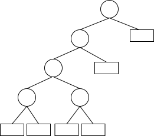

**6.并查集**

将一个集合划分为互不相交的子集。类似森林

一般用树或森林的双亲表示作为并查集的存储结构，每个子集用一个树表示

用数组元素的下标表示元素名，用根结点的下标表示子合集名，根节点的双亲结点为负数

查找，查找两个元素是否属于同一个集合

合并，如果两个元素不属于同一个集合，且所在的两个集合互不相交，则合并这两个集合

## 第六章 图

### 6.1 图的基本概念

1.线性表可以是空表，树可以是空树，图不可以是空图（顶点集一定非空，边集可以为空）

**2.集合关系**

若有 G = (V,E), G' = (V',E') 且 V' ⊆ V, E' ⊆ E，则 G' ⊆ G

然若 G = (V,E), V' ⊆ V, E' ⊆ E，则不一定有 G' = (V',E') ⊆ G

因为未知 G' = (V',E') 是否存在的条件下，E' 中存在的某些顶点可能不在 V' 中，使 G' = (V',E') 不存在

**3.概念**

| 概念   | 内容                 |
|:---:|:---:|
| 简单图  | 1.不存在重复边</br>2.不存在顶点到自身的边 |
| 简单路径 | 顶点不重复的路径           |
| 简单回路 | 除起点和终点外，顶点不重复的回路   |

| 概念    | 内容                |
|:---:|:---:|
| 完全图   | 有 n(n-1)/2 条边的无向图 |
| 有向完全图 | 有 n(n-1) 条边的有向图   |

| 概念    | 内容                                   |
|:---:|:---:|
| 连通    | 两个顶点之间有路径存在                          |
| 生成子图  | G' ⊆ G, V(G') = V(G)，则 G' 是 G 的生成子图  |
| “极大”  | 包含原图所有的边                             |
| “极小”  | 保持原图连通性的情况下使子图边数最少                   |
| 连通图   | 任意两个顶点之间连通的无向图                       |
| 连通分量  | 无向图的极大连通子图                           |
| 强连通   | 两个顶点 u,v 之间有两条从 u 到 v 和从 v 到 u 的路径存在 |
| 强连通图  | 任意两个顶点强连通的有向图                        |
| 强连通分量 | 有向图的极大强连通子图                          |
| 生成树   | 含连通图全部顶点的极小连通子图                      |
| 生成森林  | 非连通图的各连通分量的生成树构成的森林                  |

**4.特殊情况**

| 特殊情况   | 内容                          |
|:---:|:---:|
| 非连通边最多 | 由 n-1 个顶点构成一个完全图，剩余 1 个独立顶点 |
| 强连通边最少 | 至少需要 n 条边构成一个环路             |

[例题]

1.若无向图 G = (V,E) 中含有 7 个顶点，要保证图 G 在任何情况下都是连通的，则需要的边数最少是

答案：16

连通且边最少，即 n-1 个顶点全连通且这 n-1 个顶点与剩下的 1 个顶点之间只有 1 条边相连

### 6.2 图的存储及基本操作

**1.邻接矩阵**

适用于稠密图

对无向图是对称矩阵，可压缩

设图 G 的邻接矩阵为 A，$A^n$ 的元素 $A^n[i][j]$ 等于由顶点 i 到顶点 j 的长度为 n 的路径的数目

**2.邻接表**

适用于稀疏图

对无向图，每条边出现了两次

对有向图是出边表，则逆邻接表是入边表

| 顶点结点的成员  | 含义         |
|:---:|:---:|
| data     | 数据         |
| firstarc | 指向第一条出边的指针 |

| 边结点的成员  | 含义             |
|:---:|:---:|
| adjvex  | 边的终点的序号        |
| nextarc | 指向同一起点下一条出边的指针 |

**3.十字链表**

用于有向图

| 顶点结点的成员  | 含义               |
|:---:|:---:|
| data     | 数据               |
| firstin  | 指向以该结点为起点的第一个边结点 |
| firstout | 指向以该结点为终点的第一个边结点 |

| 边结点的成员  | 含义               |
|:---:|:---:|
| tailvex | 边的终点的序号          |
| headvex | 边的起点的序号          |
| hlink   | 指向边的起点相同的下一条边的指针 |
| tlink   | 指向边的终点相同的下一条边的指针 |
| info    |                  |

**4.邻接多重表**

用于无向图

| 顶点结点的成员   | 含义          |
|:---:|:---:|
| data      | 数据          |
| firstedge | 第一条依附于该顶点的边 |

| 边结点的成员 | 含义                 |
|:---:|:---:|
| mark   | 数据                 |
| ivex   | 边依附的第一个顶点的序号       |
| ilink  | 指向下一条依附于 `ivex` 的边 |
| jvex   | 边依附的第二个顶点的序号       |
| jlink  | 指向下一条依附于 `jvex` 的边 |
| info   |                    |

与邻接表相比，一条边由占用两个边结点变为只占用一个

### 6.3 图的遍历

1.`BFSTraverse()`, `DFSTraverse()` 对每个顶点进行一次 `BFS`, `DFS`

目的是保证 `visit()` 所有连通分量

**2.找某个结点的所有邻接点的写法**

```c
for(w = FirstNeighbor(G, v); w >= 0; w = NextNeighbor(G, v, w))
```

**3.对比**

| 遍历     | BFS        | DFS |
|:---:|:---:|:---:|
| 算法     | 分层         | 递归  |
| 辅助标记数组 | ✓          | ✓   |
| 辅助队列   | ✓          |     |
| 用法     | 无权图的单源最短路径 |     |

| 操作     | 邻接矩阵 | 邻接表 |
|:---:|:---:|:---:|
| 图      | 唯一   | 不唯一 |
| BFS 序列 | 唯一   | 不唯一 |
| DFS 序列 | 唯一   | 不唯一 |

| T(n) | BFS                                  | DFS                                  |
|:---:|:---:|:---:|
| 邻接矩阵 | $o({\vert V \vert}^2)$             | $o({\vert V \vert}^2)$             |
| 邻接表  | $o(\vert V \vert + \vert E \vert)$ | $o(\vert V \vert + \vert E \vert)$ |

4.一个无向图 G 是一棵树的条件：

G 必须是无回路的连通树或有 n - 1 条边的连通图

对连通的判定可以用“一次遍历是否能够遍历所有顶点”实现

即用 BFS/DFS 统计一次遍历访问到的顶点数 n 和顶点树 v，若 v = n - 1，则该图为树

[例题]

1.无向图G=(V,E),其中V={a,b,c,d,e,f},E={(a,b),(a,e),(a,c),(b,e),(c,f),(e,d)},对该图进行深度优先遍历,得到的顶点序列正确的是()

A.a,b,e,c,d,f

B.a,c,f,e,b,d

C.a,e,b,c,f,d

D.a,e,d,f,c,b

答案：D


题中未说明存储结构，因此正确的遍历序列不唯一，因此本题只能使用排除法

A.遍历到 e 时，d 与 e 相连且未被访问，故 e 之后应紧跟 d，错 

B.遍历到 f 时，d 与 f 相连且未被访问，故 f 之后应紧跟 d，错

C.遍历到 b 时，结束一层递归回到 e，d 与 e 相连且未被访问，故 b 之后应紧跟 d，错

### 6.4 图的应用

#### 6.4.1 最小生成树

**1.定义**：图 G 的所有生成树中各边权值之和最小的生成树

| 最小生成树的 |       |
|:---:|:---:|
| 树形     | 不唯一   |
| 边的权值之和 | 唯一且最小 |

**2.生成最小生成树的贪心思想**

有各边 (u, v), u ∈ U, v ∈ V - U

其中权值最小的边 ($u_i, v_i$) 必然位于一棵 G 的最小生成树中

**3.Prim**

1. 初始任取一顶点加入 `T`

2. 选择一个与当前 `T` 中顶点集合距离最近的顶点，和相应的边加入 `T`

3. 重复2. 直至所有顶点加入 `T`

**4.Krusal**

1. 初始 `n` 个顶点各自单独成为连通分量加入 `T`

2. 选择未被选过，边依附的两个顶点落在 `T` 中不同的连通分量，且权值最小的边加入 `T`

3. 重复2. 直至所有顶点加入 `T`

**5.对比**

| T(n)          | Prim                          | Krusal                                  |
|:---:|:---:|:---:|
| 每次选择权值最小的点（边） | $o(\vert V \vert)$          | 用堆存放边，$o(log(\vert E \vert))$         |
| 选择点（边）的次数     | $o(\vert V \vert)$          | 并查集描述 T，$o(\vert E \vert)$            |
| 总             | $o({\vert V \vert}^2)$      | $o(\vert E \vert log(\vert E \vert))$ |
| 适用性           | 不依赖于 $\vert E \vert$，适用于边稠密 | 适用于边稀疏而顶点较多                             |

#### 6.4.2 最短路径

**1.Dijkstra**

1. 初始化：集合 `S = {0}`，`dist[i] = arcs[0][i], i = 1, 2, ..., n-1`

2. 从顶点集合 `V-S` 中选出 $v_j$，满足 `dist[j] = min{ dist[j] | v_i ∈ V-S}`，加入 `S`，然后对所有 $v_k$ ∈ `V-S` 更新 `dist[k] = min{ dist[k], dist[j] + arcs[j][k]}`

3. 重复2. 直至所有顶点加入 `S`

**2.Floya**

1. 初始化：`A^(n)[i][j] = arcs[i][j]`

2. 考虑第 `k` 个中间顶点 `A^(k)[i][j] = min{ A^(k-1)[i][j], A^(k-1)[i][k]+A^(k-1)[k][j], k = 0, 1, ..., n-1}`

**3.对比**

| 算法                | 用处             | 边权值条件 | 回路条件         | T(n)                                                                   |
|:---:|:---:|:---:|:---:|:---:|
| BFS               | 无权图的单源最短路径     |       | 可回路          | 邻接矩阵 $o({\vert V \vert}^2)$ 邻接表 $o(\vert V \vert + \vert E \vert)$ |
| Dijkstra          | 带权图的单源最短路径     | >0    | 可回路          | $o({\vert V \vert}^2)$                                               |
| Floya             | 带权图的每对顶点间的最短路径 |       | 不可有包含负权值边的回路 | $o({\vert V \vert}^3)$                                               |
| 每个顶点作为源点 Dijkstra | 带权图的每对顶点间的最短路径 | >0    | 可回路          | $o({\vert V \vert}^3)$                                               |

求解源点到某个特定顶点的最短路径

= 求解源点到所有顶点的最短路径

#### 6.4.3 有向无环图描述表达式

**1.定义**：不存在环的有向图

可用于优化含有公共子式的表达式的存储

#### 6.4.4 拓扑排序

**1.AOV 网**

顶点表示活动

有向边 $<v_i, v_j>$ 表示活动 $v_i$ 必须先于活动 $v_j$ 进行

$v_i$ 是 $v_j$ 的直接前驱，$v_j$ 是 $v_i$ 的直接后继

任意 $v_i$ 不能将自己作为自己的前驱或后继

**2.拓扑排序**

一个有向无环图的顶点组成的序列，满足：

1. 每个顶点出现且只出现一次

2. 若顶点 A 在序列中排在顶点 B 的前面，则在图中不存在从 B 到 A 的路径

**3.对 AOV 网拓扑排序**

1. 从 AOV 网中选择一个没有前驱的顶点并输出

2. 从网中删除该顶点和所有以它为起点的有向边

3. 重复 1 2 直至当前 AOV 网为空或当前网中不存在无前驱的顶点为止，后一种情况说明有向图中必然存在环

**4.时间复杂度**

| T(n) | 邻接矩阵                     | 邻接表                                  |
|:---:|:---:|:---:|
| 拓扑排序 | $o({\vert V \vert}^2)$ | $o(\vert V \vert + \vert E \vert)$ |

**5.唯一性**

|      | 一个顶点有多个后继 | 各顶点线性有序 |
|:---:|:---:|:---:|
| 拓扑排序 | 不唯一       | 唯一      |


**6.有向无环图的邻接矩阵**

| 有向无环图的结点编号排序规则 | 未知     | 按拓扑排序排列 |
|:---:|:---:|:---:|
| 邻接矩阵           | 不一定为三角 | 一定为三角   |

#### 6.4.5 关键路径

**1.AOE 网**

以顶点表示事件

以有向图表示活动

以边上的权值表示完成该活动的开销

仅有一个入度为 0 的顶点（源点）

仅有一个出度为 0 的顶点（汇点）

**2.AOE 网的性质**

1. 只有在某顶点所代表的事件发生后，从该顶点出发的各有向边所代表的活动才能开始

2. 只有在进入某顶点的各有向边所代表的活动都已经结束时，该顶点所代表的事件才能发生

**3.AOE 中活动可并行**

**4.概念**

| 概念     | 内容                       |
|:---:|:---:|
| 关键路径   | 所有从源点到汇点的路径中，具有最大路径长度的路径 |
| 关键活动   | 关键路径上的活动                 |
| 最短完成时间 | 关键路径的长度                  |

**5.寻找关键活动**

1. 求解事件的最早发生时间 $v_e$

初始：令 $v_e[1...n] = 0$

拓扑排序输出每个顶点 $v_j$ 时，计算它所有直接后继顶点 $v_k$ 的 $v_e$ 

$v_e[k] = max\{ v_e[k], v_e[j] + w(v_j, v_k)\}$

2. 求解事件的最迟发生时间 $v_l$

初始：令 $v_l[1...n] = v_e[n]$

(拓扑排序时，增设一个栈顺序入栈拓扑排序的输出序列，排序结束后顺序出栈，得逆拓扑排序的序列)

逆拓扑排序每个顶点 $v_j$ 时，计算它所有直接前驱顶点 $v_k$ 的 $v_l$ 

$v_l[k] = min\{ v_l[k], v_l[j] - w(k, j)\}$

3. 活动的最早开始时间 e 

若边 $a_i = <v_k, v_j>$，则 $e[i] = v_e[k]$

4. 活动的最迟开始时间 l 

若边 $a_i = <v_k, v_j>$，则 $l[i] = v_l[j] - w(k, j)$

5. 活动的最迟开始时间 - 最早开始时间 d 

$d[i] = l[i] - e[i]$

$d[i] = 0$ 说明对应的 $a_i$ 为关键活动

关键路径不唯一，只有加快那些包括在所有关键路径上的关键活动才能缩短工期

每变更一次活动的权，就要重新计算一次 d ，因为关键活动可能改变

[例题]

1.若有向图的拓扑有序序列唯一，则图中每个顶点的入度和出度最多为 1？（）

答案：x


2.若一个有向图具有有序的拓扑排序序列，则它的邻接矩阵必为（）

A.对称

B.稀疏

C.三角

D.一般

答案：C

注意题中说的是“有序的”

3.下列选项中，加快其进度就可以缩短工程工期的是（）


A.c 和 e

B.d 和 c

C.f 和 d

D.f 和 h

答案：C

| 顶点      | 1 | 2  | 3 | 4  | 5  | 6  |
|:---:|:---:|:---:|:---:|:---:|:---:|:---:|
| $v_e$ | 0 | 12 | 8 | 21 | 18 | 27 |
| $v_l$ | 0 | 12 | 8 | 21 | 18 | 27 |

| 边 | a | b | c  | d | e  | f | h  | g  |
|:---:|:---:|:---:|:---:|:---:|:---:|:---:|:---:|:---:|
| e | 0 | 0 | 12 | 8 | 12 | 8 | 18 | 21 |
| l | 9 | 0 | 12 | 8 | 12 | 8 | 18 | 21 |
| d | 9 | 0 | 0  | 0 | 0  | 0 | 0  | 0  |

于是 b c d e f h g 都是关键活动

于是它们可以组成的关键路径为

bdcg

bdeh

bfh

用于加快工期的若干个关键活动中，不需要每个活动都存在于所有关键路径中

但是需要这些关键活动总共能够存在于所有关键路径中

## 第七章 茶栈

### 7.1 查找的基本概念

**1.平均查找长度**

$ASL = \sum{P_iC_i}$

$P_i$ 是查找第 i 个数据元素的概率

$C_i$ 是找到第 i 个数据元素所需的比较次数

### 7.2 顺序查找和折半查找

**1.一般线性表的顺序查找**

“哨兵”的编程习惯

顺序表的 `0` 号单元留空，`1...ST.TableLen` 号单元用于存储

```c
int Search_Seq(SSTable ST, ElemType key){
    int i;
    ST.elem[0] = key;
    for(i = ST.TableLen; ST.elem[i] != key; --i);
    return i;
}
```

**2.有序表的顺序查找**

设关键字从小到大，若发现 `ST[i] < key, ST[i+1] > key`，则可以返回失败

**3.折半查找**

1. 若 `low > high`，返回失败；否则取中间位置 `mid = low + (high - low)/2`

2. 查找成功则返回 `mid`

3. 否则

    `L.elem[mid] > key` 时，`high = mid - 1` 回到 1

    `L.elem[mid] < key` 时，`low = mid + 1` 回到 1

要求顺序存储的随机存取特性，要求有序排列

**4.分块查找**


查找表分为若干块，块内元素可无序

各块的最大关键字递增

索引表单元 = { 块的最大关键字, 块的首元素的地址}

步骤：

1. 在索引表中确定待查记录所在的块

2. 在块内顺序查找

[例题]

1.由 n 个数据元素组成的两个表：一个递增有序，一个无序。采用顺序查找算法，对有序表从头开始查找，发现当前元素已不小于待查元素时，停止查找，确定查找不成功。已知查找任意元素的概率是相同的，则在两种表中成功查找（）

A.平均时间后者小

B.平均时间两者相同

C.平均时间前者小

D.无法确定

答案：B

成功查找第 i 个元素一定要比较 i 次

2.下列二叉树中，可能成为折半查找判定树(不含外部结点)的是（）


答案：A


注意比较失败后会 `high = mid - 1` 或 `low = mid + 1`

所以在结点树中，要计算两个结点之间的 `mid` 的时候，可能需要取某结点 +1 或 -1 的值

B.如图，(4+5)/2 = 5 为向上取整，(7+8)/2 = 7 为向下取整，矛盾

C.如图，(3+4)/2 = 4 为向上取整，(6+7)/2 = 6 为向下取整，矛盾

D.如图，(2+4)/2 = 3 不可能得到 4

### 7.3 树型查找

#### 7.3.1 二叉排序树

**1.定义**

1. 若它的左子树非空，则左子树上所有结点的值均小于根结点的值

2. 若它的右子树非空，则右子树上所有结点的值均大于根结点的值

3. 左、右子树本身又各是一棵二叉排序树

由定义知 左 < 中 < 右，则中序序列递增

| 二叉排序树中某结点的 | 中序排序中的位置 | 树中的位置      | 大小        | 是否为叶结点 |
|:---:|:---:|:---:|:---:|:---:|
| 直接后继       | 该结点后一个结点 | 右子树的最左下角结点 | 右子树中的最小元素 | 不一定    |
| 直接前驱       | 该结点前一个结点 | 左子树的最右下角结点 | 左子树中的最大元素 | 不一定    |

**2.查找**

从根结点开始沿分支逐层向下

**3.插入**

1. 若原二叉排序树为空，则直接插入结点

2. 否则，若关键字小于根结点，则插入左子树，反之插入右子树

**4.构造**

各结点依次插入

**5.删除**

1. 搜索到对应值的目标结点

2. 若被删除结点 p 是叶子结点，则直接删除，不会破坏二叉查找树的结构

3. 若被删除结点只有一棵左子树或右子树，则让该结点的子树称为该结点父结点的子树，来代替其的位置

4. 若被删除结点有左子树和右子树，则让其结点的直接后继或直接前驱替代该结点，并从二叉查找树中删除该的结点直接后继、直接前驱，这就变成了第一种或第二种情况

二叉查找树删除或插入时得到的二叉查找树往往与原来的不同

**6.查找效率**

| T(n)              | 查找           | 插入删除                 | 用处   |
|:---:|:---:|:---:|:---:|
| 二分查找              | $O(\log_2n)$ | 有序顺序 $O(n)$          | 静态查找 |
| 平衡二叉树             | $O(\log_2n)$ | 查找，移动指针 $O(\log_2n)$ | 动态查找 |
| 最坏二叉查找树（顺序插入，单枝树） | $O(n)$       | 有序顺序 $O(n)$               |      |

#### 7.3.2 平衡二叉树

**1.定义**：树上任意一结点的左子树和右子树的高度之差不超过 1

**2.插入**

四种旋转方式

1. LL 旋转


2. RR 旋转


3. LR 旋转


4. RL 旋转


由此可见：

LR RL 例子中插入 C 左子树或右子树都一样

插入时是在叶结点的位置插入，但经过调整之后插入结点不一定是叶结点

**3.删除**

要删除 key

1. 用二叉排序树的删除方法用 key 的直接前驱或后继代替 key，化归为删除结点 w

2. 从结点 w 开始向上回溯，找到第一个不平衡的结点 z，使用四种旋转方式使 z 平衡

3. z 平衡后再看 z 的祖先是否平衡，如未平衡再使用四种旋转方式使之平衡……直至树的根结点平衡

**4.查找**

与二叉排序树相同

#### 7.3.3 红黑树

**1.定义**

1. 每个结点或是红色，或是黑色的

2. 根结点是黑色的

3. 叶结点（$n+1$ 个虚构的外部结点、`NULL` 结点）都是黑色的，保证红黑树的内部结点左右孩子均非空

4. 不存在两个相邻的红结点（即红结点的父结点和孩子结点均是黑色的）

5. 对每个结点，从该结点到任一叶结点的简单路径上，所含黑结点的数量相同

由定义2. ，红黑树的子树不一定是红黑树

**2.性质**

1. 从根到叶结点的最长路径不大于最短路径的两倍

    由定义 5，当从根到任一叶结点的简单路径最短时，这条路径必然全由黑结点构成

    由定义 4，当某条路径最长时，这条路径必然是由黑结点和红结点相间构成的，此时红结点和黑结点的数量相同

2. 有 n 个内部结点的红黑树的高度 $h\leqslant2\log_2(n+1)$

    若红黑树的总高度为 h，则根结点黑高 $\geqslant\dfrac{h}{2}$，所以内部结点 $n\geqslant2^{\frac{h}{2}-1}$（假设没有红结点），所以 $h\leqslant2\log2(n+1)$

3. 红黑树查找、插入、删除的时间复杂度都是 $O(\log_2n)$

    插入和删除：由于红黑树的每次操作平均要旋转一次和变换颜色，而普通二叉查找树如果平衡因子在指定范围内不会旋转（如果要旋转则可能旋转多次），所以它比普通的二叉查找树效率要低一点，不过时间复杂度仍然是 $O(\log_2n)$

    普通查询：没有使用到红黑树的性质，所以红黑树和二叉查找树的效率相同。对于平衡树而言，平衡树的效率更高。
    
    插入数据有序查询：红黑树的查询效率就比二叉搜索树要高了，因为此时二叉搜索树不是平衡树，它的时间复杂度 $O(n)$

**3.插入**

1. 用二叉排序树的插入方法，化归为插入结点 N，设为红色

2. 对以 N 的爷结点 G 为根的红黑树做调整：

情况 1：N 的叔结点 U 是黑色的，且 N 是一个左孩子


情况 2：N 的叔结点 U 是黑色的，且 N 是一个右孩子


情况 3：N 的叔结点 U 是红色的


情况 3 中 N 的爷结点 G 相当于新插入的结点，把这一轮的 G 视为新一轮的 N 重复判断三种情况

**4.删除**

<table>
    <tr>
        <td align = center>子结点状态/</br>被删结点颜色</td>
        <td align = center>无子结点</td>
        <td align = center>有一个子结点</td>
        <td align = center>有两个子结点</br>（与二叉排序树的删除操作相似）</td>
    </tr>
    <tr>
        <td align = center>红色</td>
        <td align = center>直接将结点删除</td>
        <td align = center>不可能</td>
        <td rowspan=2 align = center>找被删结点 node 的直接前驱（后继） s</br>用 s 的值替代 node 的值，颜色不改变</br>问题化归为删除 s </td>
    </tr>
    <tr>
        <td align = center>黑色</td>
        <td align = center>最复杂，另作详细讨论</td>
        <td align = center>被删结点 node 的另一个子结点 value 必然为红色</br>此时直接将 node 删掉</br>用 value 代替 node 的位置，并将 value 着黑</td>
    </tr>
</table>

被删结点有一个子结点，且被删结点为红色：

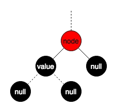

被删结点有一个子结点，且被删结点为黑色：

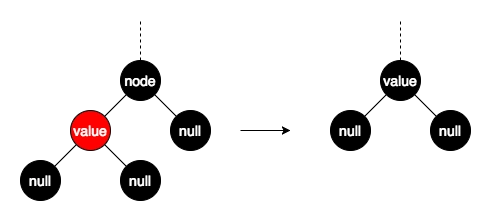

被删结点无子结点，且被删结点为黑色，详细讨论：


因为删除黑色结点会破坏红黑树的性质5. ，所以为了不破坏定义5. ，将 node 删除后用一个拥有额外黑色的 null 替代它，称之为“双黑”

之后需要消除这个双黑

<table>
    <tr>
        <td align = center>brother 子结点状态/</br>brother 颜色</td>
        <td align = center>brother 有一个与其方向一致的红色子结点 son</td>
        <td align = center>brother 有一个与其方向不一致的红色子结点 son</td>
        <td align = center>brother 无红色子结点</td>
        <td align = center>brother 有一个黑色子结点 son</td>
    </tr>
    <tr>
        <td align = center>黑色</td>
        <td align = center>情况 1. </td>
        <td align = center>情况 2. </td>
        <td align = center>情况 3. </td>
        <td align = center>brother 子树的黑高比双黑结点的黑高大 1,不可能</td>
    </tr>
    <tr>
        <td align = center>红色</td>
        <td colspan = 2 align = center>双红相邻，不可能</td>
        <td colspan = 2 align = center>father 必为黑色，情况 4. </td>
    </tr>
</table>

1. brother 为黑色，且 brother 有一个与其方向一致的红色子结点 son

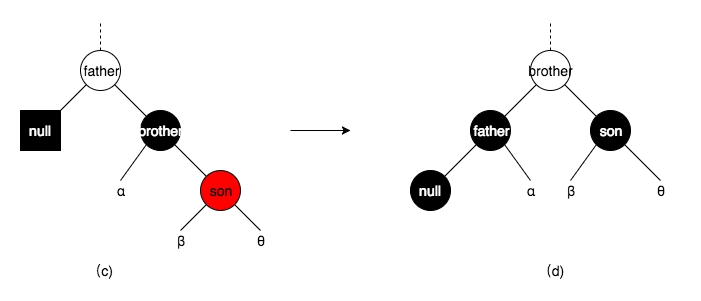

2. brother 为黑色，且 brother 有一个与其方向不一致的红色子结点 son

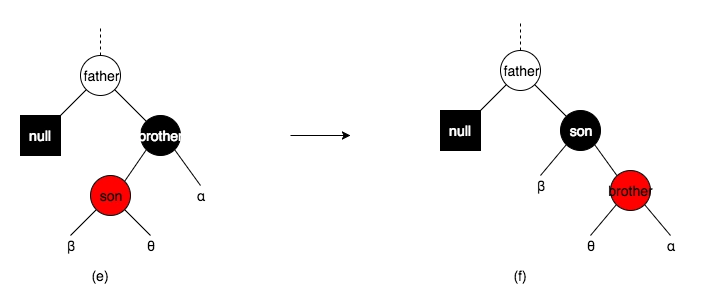

3. brother 为黑色，且 brother 无红色子结点

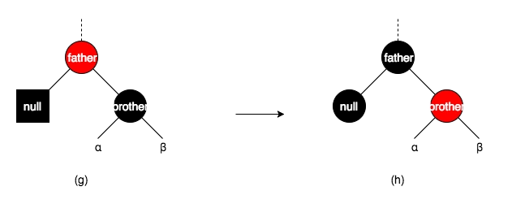

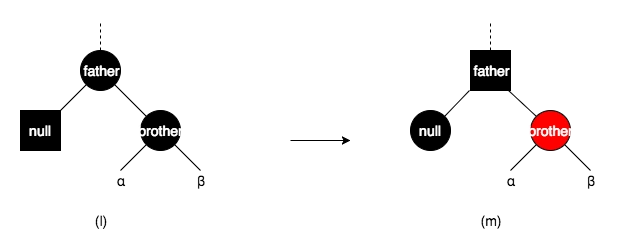

双黑和 brother 的黑色 - 1,father 的黑色 + 1,使 father 树的黑高不变

father 若变为新的黑高，则重复对黑高的判定流程

4. brother 为红色，则 father 必为黑色

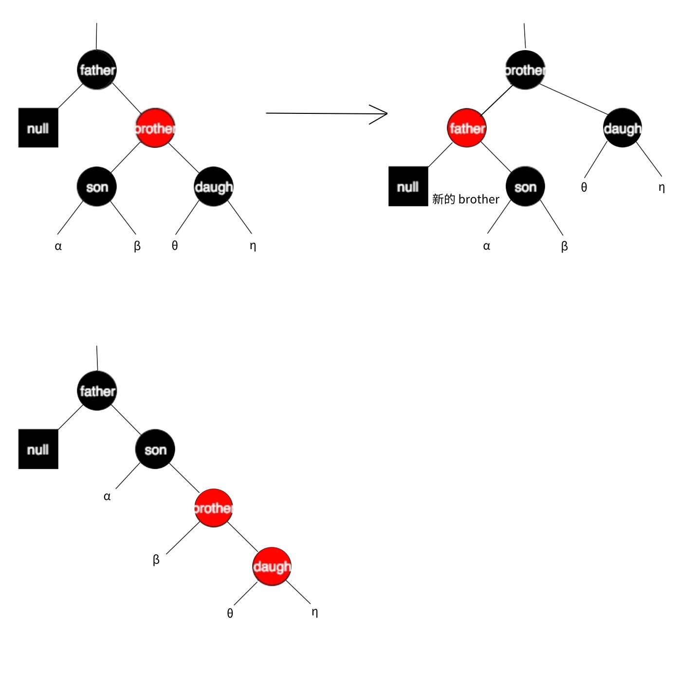

[例题]

1.含有20个结点的平衡二叉树的最大深度为（）

答案：6

所有结点的平衡因子都为 1 的平衡二叉树的结点数递推公式：

$n_0 = 0$

$n_1 = 1$

$n_2 = 2$

$n_h = 1 + n_{h-1} + n_{h-2}$

其中 h 为平衡二叉树的高度，$n_h$ 为构造此高度的平衡二叉树所需的最少结点数


### 7.4 B 树和 B+ 树

#### 7.4.1 B 树及其基本操作

对于一颗 m 阶 B 树

1.子结点数目要求：

<table>
    <tr>
        <td align = center>B 树</td>
        <td align = center>子结点最小数量</td>
        <td align = center>子结点最大数量</td>
    </tr>
    <tr>
        <td align = center>树的根结点没有关键字（B 树为空）</td>
        <td colspan = 4 align = center>0</td>
    </tr>
    <tr>
        <td align = center>树的根结点有关键字（B 树不为空）</td>
        <td align = center>2</td>
        <td rowspan = 2 align = center>m</td>
    </tr>
    <tr>
        <td align = center>除根结点外的所有非叶结点</td>
        <td align = center>⌈m/2⌉</td>
    </tr>
</table>

**2.所有非叶结点的结构**

|       |         |         |         |         |         |     |         |         |
|:---:|:---:|:---:|:---:|:---:|:---:|:---:|:---:|:---:|
| n  | $P_0$ | $K_1$ | $P_1$ | $K_2$ | $P_2$ | ... | $K_n$ | $P_n$ |
|       |         |         |         |         |         |     |         |         |

n 为结点中关键字的个数

$K_i (i = 1,2,...,n)$ 为结点的关键字，单调递增

$P_i (i = 0,1,2,...,n)$ 为指向子树根结点的指针，满足 $P_{i-1} < K_i$

**3.所有的叶结点都出现在同一层次上，并且不带信息**

实际上这些结点不存在，指向这些结点的指针为 null


B 树是所有结点的平衡因子 = 0 的多路平衡查找树

**4.高度**

定义 B 树的高度不包含叶子结点（有些地方的定义会包含）

总结点数给定时：

最小高度：所有结点的子结点数都为最大，即满 m 叉树

最大高度：所有结点的子结点数都为最小，即根结点的子结点数为 2,其他非叶结点的子结点数为 ⌈m/2⌉

**5.查找**

B 树常存在磁盘上

1. 在 B 树内找结点（在磁盘）

2. 在结点内的有序表中找关键字（在内存）

查找关键字失败则根据对应指针进到下一层结点重复 1. ，直至找到 null,返回查找失败

**6.插入**

设要插入 key

1. 先在 B 树中查找 key。由于一定没有 key，所以一定找到某个叶结点。这样就确定了最底层非叶结点 p 的插入位置

2. 插入。插入后，p 的子结点个数大于 m 时需分裂

    分裂原则：将 p 的中间位置（⌈m/2⌉）的关键字移动插入 p 的父结点 f，p 分裂为两个新结点 p1 p2，仍然以 f 为父结点，p 中的关键字以中间位置为界左右对应分配给 p1 p2


**7.删除**

要删除 key

1. 用二叉排序树的删除方法用 key 的直接前驱或后继代替 key，化归为删除结点 w

w 必落在最低层非叶结点，如下三种情况：

2. 直接删除

3. 左（或右）兄弟够借


4. 左（或右）兄弟不够借


w 与左（或右）兄弟结点及双亲结点中的关键字合并

合并过程中双亲结点的关键字 - 1，相当于新一轮的删除操作

直至某一轮 w 的双亲结点是根结点。若此时删除后根结点的关键字数量减少至 0，则直接将根结点删除，并将合并后的新结点作为根

#### 7.4.2 B+ 树

**1.对比**

<table>
    <tr>
        <td align = center></td>
        <td align = center>子结点</td>
        <td align = center>子结点最小（大）数量</td>
        <td align = center>非叶结点关键字的内容</td>
        <td align = center>头指针</td>
    </tr>
    <tr>
        <td align = center>B 树</td>
        <td align = center>两个关键字之间的指针对应一个子树</td>
        <td rowspan = 2 align = center>相同</td>
        <td align = center>信息，与叶结点中的信息不重复</td>
        <td align = center>一个指向根结点</td>
    </tr>
    <tr>
        <td align = center>B+ 树</td>
        <td align = center>一个关键字对应一个子树</td>
        <td align = center>是叶结点中的信息的索引</br>只含有对应子树的最大关键字和指向该子树的指针，不含有该关键字对应记录的存储地址</td>
        <td align = center>一个指向根结点</br>另一个指向关键字最小的叶结点</td>
    </tr>
</table>


**2.查找**

查找到非叶结点上的关键字等于给定值时并不终止，而是继续向下查找，直到找到叶结点上的关键字为止

（因为需要的是叶结点指向的记录）

所以每次查找都是一条从根结点到叶结点的路径

**3.插入，删除**

与 B 树类似

[例题]

1.下列应用中，适合使用 B+ 树的是（）

A.编译器中的词法分析

B.关系数据库系统中的索引

C.网络中的路由表快速查找

D.操作系统的磁盘空闲块管理

答案：B

B+ 树是应文件系统所需而产生的 B 树的变形，前者比后者更加适用于实际应用中的操作系统的文件索引和数据库索引

因为前者的磁盘读写代价更低，查询效率更加稳定

编译器中的词法分析使用有穷自动机和语法树

网络中的路由表快速查找主要靠高速缓存、路由表压缩技术和快速查找算法

系统一般使用空闲空间链表管理磁盘空闲块

### 7.5 散列表

#### 7.5.2 散列函数的构造方法

**1.散列函数的要求**

1. 定义域包含所有关键字

2. 值域等概率分布，以减小冲突发生

3. 简单，耗时少

**2.常用散列函数**

|       | 公式                    | 优点         | 缺点                       | 适用性                                      |
|:---:|:---:|:---:|:---:|:---:|
| 直接定址法 | $H(key) = a*key + b$ | 计算简单，不产生冲突 | 若关键字不连续，则空位较多，会造成存储空间的浪费 | 关键字的分布基本连续                               |
| 除留余数法 | $H(key) = key\%p$    |            |                          | 常用                                       |
| 数字分析法 | 取数码分布较为均匀的若干位作为散列地址   |            |                          | 已知的关键字集合                                 |
| 平方取中法 | 取关键字的平方值的中间几位作为散列地址   |            |                          | 关键字的每位的数码分布都不够均匀<\br>或关键字的位数都小于散列函数所需的位数 |

**3.处理冲突**

1) 开放定址法

可存放新表项的空闲地址既向他的同义词表项开放

又向它的非同义词表项开放

$H(key)$ 为散列函数

$i = 0,1,2,...,k (k <= m-1>)$

m  表示散列表表长

$d_i$ 为增量序列

| 开放定址法             | $H_i = (H(key) + d_i) \% m$                                                    | 优点         | 缺点                                       |
|:---:|:---:|:---:|:---:|
| 线性探测法             | $d_i = 0,1,2,...,m-1$                                                          | 计算简单，不产生冲突 | 冲突发生时顺序查看下一个单元<br />可能造成大量元素在相邻的散列地址上“堆积” |
| 平方探测法<br />(二次探测法) | $d_i = 0^2,1^2,-1^2,2^2,-2^2,...,k^2,-k^2, k<= m/2$ <br />m 必须是一个可以表示成 4k+3 的素数 | 避免出现“堆积”   | 不能探测到散列表上所有单元<br />但至少能探测到一半单元                |
| 双散列法              | $d_i = Hash_2(key)$                                                            |            |                                          |
| 伪随机数序列法           | $d_i$ 为伪随机数序列                                                                  |            |                                          |

2) 拉链法

    所有的同义词在一个表项后面


#### 7.5.4 散列查找及性能分析

**1.查找**

1. 初始化：$Addr = H(key)$ 

2. 检查 Addr 上是否有记录

    若无记录，则查找失败

    若有记录，判断 $L[Addr] == key$，若为真则查找成功

    否则 $H_i = (H(key) + d_i) \% m$，然后重复 2

**2.查找效率的影响因素**

1. 散列函数

2. 处理冲突的方法

3. 装填因子 $\alpha = \frac{表中记录数 n}{散列表长度 m}$

[例题]

1.现有长度为 11 且初始为空的散列表 HT,散列函数是 $H(key) = key\%7$，采用线性探查（线性探测再散列）法解决冲突。将关键字序列 87, 40, 330, 6, 11, 22, 98, 20 依次插入 HT 后，HT 查找失败的平均查找长度是（）

答案：6

插入之后的散列表：

| 序号 | 内容 |
|:---:|:---:|
| 0  | 98 |
| 1  | 22 |
| 2  | 30 |
| 3  | 87 |
| 4  | 11 |
| 5  | 40 |
| 6  | 6  |
| 7  | 20 |
| 8  |    |
| 9  |    |
| 10 |    |

由 %7 知，查找一共有 7 种情况，视为等概率

| key\%7 = | 确认查找失败的过程    | 确认查找失败所要查找的次数 |
|:---:|:---:|:---:|
| 0        | 从序号 0 找到序号 8 | 9             |
| 1        | ...          | 8             |
| 2        |              | 7             |
| 3        |              | 6             |
| 4        |              | 5             |
| 5        |              | 4             |
| 6        |              | 3             |

ASL = (9 + 8 + ... + 3)/7 = 7*(3 + 9)/2/7 = 6

**2.数组中有一个数字出现的次数超过了数组长度的一半，请找出这个数字**

法1：先排序，然后取 ⌊n/2⌋ 位置处的元素，时间复杂度至少 $o(nlog{n})$

法2：使用散列查找，每次删除两个不同 key 的数，直至剩下的数都为同一个 key，时间复杂度 $o(n)$

## 第八章 排序

### 8.1 排序的基本概念

#### 8.1.1 排序的定义

排序：使表中元素按关键字有序

稳定性：关键字相同的元素之间的相对位置不受排序影响，则称算法是稳定的，否则～

分类：

1. 内部排序

    排序期间元素全部存在内存

2. 外部排序

    排序期间元素在内外存移动

[例题]

1.下述排序方法中，不属于内部排序方法的是（）

A.插入排序法

B.选择排序法

C.拓扑排序法

D.归并排序法

答案：C

拓扑排序是将有向图中的所有结点排成一个线性序列

虽然也是在内存中进行的，但是不满足“使表中元素按关键字有序”的定义

所以既不是内部排序也不是外部排序

**2.对任意序列进行基于比较的排序，求最少的比较次数**

考虑最坏的情况，对任意 n 个关键字排序的比较次数至少为 $⌈log_2{n!}⌉$

上述公式证明如下：

在基于比较的排序方法中，每次比较两个关键字后，仅出现两种可能的转移

假设整个排序过程至少需要做 t 次比较，则显然会有 $2^t$ 种情况

由于 n 个记录共有 n! 种不同的排列，因而必须有 n! 种不同的比较路径

于是有 $2^t > n!$，即 $t > log_2{n!}$

### 8.2 插入排序

#### 8.2.1 直接插入排序

|                 |      |                 |
|:---:|:---:|:---:|
| 有序序列 L[1...i-1] | L[i] | 无序序列 L[i+1...n] |
|                 |      |                 |

`L[0]` 用作哨兵

1. 查找 `L[i]` 在 `L[1...i-1]` 中的插入位置 k

2. 将 `L[k...i-1]` 中的所有元素依次后移一位

3. 将 `L[i]` 复制到 `L[k]`

#### 8.2.2 折半插入排序

对直接插入排序的优化，在寻找插入位置时使用二分查找的方式

<table>
    <tr>
        <td align="center" valign=middle>算法</td>
        <td align="center" valign=middle>情况</td>
        <td align="center" valign=middle>比较与移动</td>
        <td align="center" valign=middle>查找方式</td>
        <td align="center" valign=middle>查找用时</td>
        <td align="center" valign=middle>移动方式</td>
        <td align="center" valign=middle>移动用时</td>
        <td align="center" valign=middle>稳定性</td>
    </tr>
    <tr>
        <td align="center" valign=middle rowspan=2>直接插入</td>
        <td align="center" valign=middle>最好</td>
        <td align="center" valign=middle rowspan=2>边比边移</td>
        <td align="center" valign=middle rowspan=2>顺序</td>
        <td align="center" valign=middle>o(n)</td>
        <td align="center" valign=middle rowspan=4>统一移动</br>待插入位置之后的</br>所有元素</td>
        <td align="center" valign=middle>0</td>
        <td align="center" valign=middle rowspan=4>稳定</td>
    </tr>
    <tr>
        <td align="center" valign=middle>最坏</td>
        <td align="center" valign=middle>o(n^2)</td>
        <td align="center" valign=middle>o(n^2)</td>
    </tr>
    <tr>
        <td align="center" valign=middle rowspan=2>折半插入</td>
        <td align="center" valign=middle>最好</td>
        <td align="center" valign=middle rowspan=2>比较和移动分离</br>二分查找</td>
        <td align="center" valign=middle rowspan=2>折半</td>
        <td align="center" valign=middle rowspan=2>o(nlog(n))</td>
        <td align="center" valign=middle>0</td>
    </tr>
    <tr>
        <td align="center" valign=middle>最坏</td>
        <td align="center" valign=middle>o(n^2)</td>
    </tr>
</table>

#### 8.2.3 希尔排序

**1.思路**

直接插入排序对于基本有序的序列排序效果较好，所以就希望序列能尽可能基本有序

因此希尔排序的思路是：先追求表中元素部分有序，然后逐渐逼近全局有序

又称缩小增量排序

**2.步骤**

1. 初始化增量 $d = n/2, d $ 为增量，n  为表中元素总数 

2. 待排序表分割为 n/d 个子表 $\{L[i], L[i+d], L[i+2d], ..., L[i+kd]\}, 1 <= i <= n/d$

3. 对各子表进行直接插入排序

4. $d = d/2$，然后若 $d != 0$，进入步骤 2，否则结束

**3.性质**

相同关键字被划分到不同子表中，可能改变他们的相对位置，因此不稳定

时间复杂度和增量序列的选择有关，目前无法使用属性手段证明确切的时间复杂度

最坏时间复杂度为 $o(n^2)$，在某个范围内可以达到 $o(n^{1.3})$

### 8.3 交换排序

#### 8.3.1 冒泡排序

**1.定义**

从后往前（或从前往后）两两比较相邻元素的值，若为逆序，则交换他们，直至序列比较完，称为一趟

前一趟确定的元素不再参与比较

最多做 n - 1 趟完成排序

**2.优化**

考研提到的冒泡排序没有优化，逆天

对于每行冒泡进行优化：

如果某一趟没有发生交换，说明序列已经有序，无需排序

设置一个布尔值 `flag`，初始化为 `true`

下一趟排序开始时先判断 `flag == false`，若为真，说明上一趟没有发生交换，退出排序

否则 `flag = true`，开始这趟排序，该趟若发生交换则 `flag = false`

对于每列冒泡进行优化：

第 i 趟用于两两比较的左侧的元素的索引范围为 `0...length - i`

记录某趟最后一次发生交换的元素的索引值 `lastExIndex`

该索引值之后的元素已经有序，无需排序

因此第 i 趟用于两两比较的左侧的元素的索引范围为 `0...lastExIndex`

#### 8.3.2 快速排序

**1.思路**

分治法

**2.步骤**

取待排序序列中的某个元素 `pivot` 作为基准（一般取第一个元素）

通过一趟排序，将待排元素分为左右两个子序列

左子序列元素的关键字均小于或等于基准元素的关键字，右子序列的关键字则大于基准元素的关键字，

然后分别对两个子序列继续进行快速排序，直至整个序列有序

**3.左右两个子序列的划分方法**

[Hoare’s vs Lomuto partition scheme in QuickSort](https://www.geeksforgeeks.org/hoares-vs-lomuto-partition-scheme-quicksort/)

1. 单边循环快排

lomuto 洛穆托分区

`i` 指针负责找到比 `pivot` 小的元素

`j` 指针维护小于 `pivot` 的边界

这样，`L[i+1]` 为`pivot`，`L[1...i]` 为小于 pivot 的子序列，`L[i+2...high]` 为大于 pivot 的子序列

```c++
int partition(int arr[], int low, int high)
{
    int pivot = arr[high];    // pivot
    int i = (low - 1);  // Index of smaller element
 
    for (int j = low; j <= high- 1; j++)
    {
        // If current element is smaller than or
        // equal to pivot
        if (arr[j] <= pivot)
        {
            i++;    // increment index of smaller element
            swap(arr[i], arr[j]);
        }
    }
    swap(arr[i + 1], arr[high]);
    return (i + 1);
}
```


2. 双边循环快排 

普通分区

通过初始化从两端开始的两个索引来工作

这两个索引相互靠近，直到两索引相遇

靠近的过程中，若左索引发现了大于 pivot 的值，则将其与右索引所指的值交换，若右索引发现了小于 pivot 的值，则将其与左索引所指的值交换

考研所考查的版本

```c++
int partition(int arr[], int low, int high)
{
    int pivot = arr[low];
    int i = low, j = high;
 
    while (i<j) {
        while(i<j&&arr[j]>=pivot) --j;
        arr[i] = arr[j];
        while(i<j&&arr[i]<=pivot) ++i;
        arr[j] = arr[i];
    }
    arr[i] = pivot;
    return i;
}
```

hoare 霍尔分区

通过初始化从两端开始的两个索引来工作

这两个索引相互靠近，直到找到反转（左侧的值较小，右侧的值较大）

当发现反转时，交换两个值并重复该过程

```c++
int partition(int arr[], int low, int high)
{
    int pivot = arr[low];
    int i = low - 1, j = high + 1;
 
    while (true) {
        // Find leftmost element greater than
        // or equal to pivot
        do {
            i++;
        } while (arr[i] < pivot);
 
        // Find rightmost element smaller than
        // or equal to pivot
        do {
            j--;
        } while (arr[j] > pivot);
 
        // If two pointers met.
        if (i >= j)
            return j;
 
        swap(arr[i], arr[j]);
    }
}
```

**4.时间复杂度**

最坏情况：两个子区域分别包含 n-1 个元素和 0 个元素

即基本有序或基本逆序

提高算法效率的方法：

1. 尽量选取一个可以将数据中分的 `pivot`

如从序列的头尾及中间选取三个元素，再取这三个元素的中间值

2. 或者随机地选取 `pivot`

快排是所有内部排序算法中平均性能最优的算法

不稳定

[例题]

1.对下列关键字序列用快速排序法进行排序时,速度最快的情形是()

A.{21,25,5,17,9,23,30}

B.{25,23,30,17,21,5,9}

C.{21,9,17,30,25,23,5}

D.{5,9,17,21,23,25,30}

答案：A

`pivot` 的选择越靠近中央，即左右两个子序列长度越接近，排序速度越快

21 正好是序列的正中，所以排除B，D

A经过一次排序后结果为9，17，5，（21），25，23，30

C经过一次排序后结果为5，9，17，（21），25，23，30

对于子序列 9，17，5 和 5，9，17，后者在有序状态下用快速排序方法的速度没有前者快，答案为 A

### 8.4 选择排序

**1.思想**

第 `i` 趟在后面 `n-i+1 (i = 1, 2, ..., n-1)` 个排序元素中选取 `key` 最小的元素，作为有序子序列的第 `i` 个元素，直至第 `n-1` 趟做完

#### 8.4.1 简单选择排序

与上同

#### 8.4.2 堆排序

**1.定义**

将 `n` 个关键字序列 `L[1...n]` 视为一棵完全二叉树，其中

大根堆：任意结点的值大于其左右孩子的值，即 `L[i] >= L[2i], L[i] >= L[2i+1], 1<=i<=⌊n/2⌋`

小根堆：任意结点的值小于其左右孩子的值，即 `L[i] <= L[2i], L[i] <= L[2i+1], 1<=i<=⌊n/2⌋`

**2.调整方法**

1. 自下而上 

    对于大（小）根堆，检查结点 i 是否大于（小于）左右孩子 2i 2i+1，否则将左右孩子中的较大（小）值与其交换

    交换后，化归为检查与结点 i 产生交换的父结点 ⌊i/2⌋

2. 自上而下

    对于大（小）根堆，检查结点 i 是否大于（小于）左右孩子 2i 2i+1，否则将左右孩子中的较大（小）值与其交换

    交换后，化归为检查与结点 i 产生交换的子结点 2i 或 2i+1

**3.操作**

<table>
    <tr>
        <td align="center" valign=middle>操作</td>
        <td align="center" valign=middle>内容</td>
    </tr>
    <tr>
        <td align="center" valign=middle>建立</td>
        <td align="center" valign=middle>对序号 ⌊n/2⌋ 到 1 的结点</br>分别自下而上调整</td>
    </tr>
    <tr>
        <td align="center" valign=middle>输出</td>
        <td align="center" valign=middle>输出堆顶元素，将最后一个元素置于堆顶</br>自上而下调整</td>
    </tr>
    <tr>
        <td align="center" valign=middle>插入</td>
        <td align="center" valign=middle>将新结点置于堆的末端</br>自下而上调整</td>
    </tr>
</table>

**4.时间复杂度**

构建初始堆，也就是插入 n 个结点，时间复杂度 $o(n)$

对 n 个结点堆排序，要对对序号 ⌊n/2⌋ 到 1 的结点分别自下而上调整，每次调整的时间复杂度都为 $o(h)$

堆排序总时间复杂度 $o(nlogn)$

构建初始堆 != 堆排序

[例题]

1.设线性表中每个元素有两个数据项 k1 和 k2,现对线性表按一下规则进行排序：先看数据项 k1，k1 值小的元素在前，大的在后；在 k1 值相同的情况下，再看 k2，k2 值小的在前，大的在后。满足这种要求的排序方法是（ ）

A.先按 k1 进行直接插入排序，再按 k2 进行简单选择排序

B.先按 k2 进行直接插入排序，再按 k1 进行简单选择排序

C.先按 k1 进行简单选择排序，再按 k2 进行直接插入排序

D.先按 k2 进行简单选择排序，再按 k1 进行直接插入排序

答案：D

两次排序，都是对整体过一遍

先使用不稳定的排序，再使用稳定的排序，就可以保证在排好 k1 的同时不会打乱 k2 的排序

### 8.5 归并排序和基数排序

#### 8.5.1 归并排序

**1.思想**

将两个或两个以上的有序表合成为一个新的有序表

**2.时间复杂度**

每趟归并都要所有元素线性合并，时间复杂度 $o(n)$

一共 $⌈log_2n⌉$ 趟

总时间复杂度 $nlog_2n$

#### 8.5.2 基数排序

**1.思想**

借助多关键字排序堆单逻辑关键字进行排序

**2.方法**

最高（低）位优先：按关键字位权重递减（增）依次逐层划分成若干更小的子序列，然后所有子序列依次连接形成一个有序序列

n 个待派元素的关键字 K 都转化为 r 为基数的 d 元数 $K_{(r)} = K_0K_1K_2...K_{d-1}$，$K_i$ 表示第 i 位上的值

设置 r 个空队列，第 j 个队列放置某一位上的值为 j 的元素

最高（低）位优先：

1. 分配

    第 i 趟，清空所有队列，顺序扫描待排表，将 $K_i$ （或 $K_{d-i}$）位上值为 j 的元素放入第 j 个队列

2. 收集

    将 $Q_0, Q_1, ..., Q_{r-1}$ 中的结点首尾相连得到新的待排表

**3.时间复杂度**

d 趟分配与收集

分配需要顺序扫描 时间复杂度 $o(n)$

收集需要首尾相连 r 个队列 时间复杂度 $o(r)$4

总时间复杂度 $o(d(n+r))$

稳定

[例题]

1.对 10TB 的数据文件进行排序，应使用的方法是（）

A.希尔排序

B.堆排序

C.快速排序

D.归并排序

答案：D

数据太大，需要外存，即需要使用外部排序

归并排序既可以内部也可以外部

### 8.6 外部排序算法的补充

#### 8.6.1 计数排序

**1.思路**

输入的数据必须是有确定范围的整数

**2.过程**

待排序的数组 L，计数数组 C，目标数组 T

1. 顺序遍历 L，在第 i 步，令 C[L[i]]++

2. 顺序遍历 C，在第 i 步，向 T 输入 C[i] 个 i

**3.时间复杂度**

当输入的元素是 n 个属于 $[0,k]$ 的整数时，时间复杂度是 $o(n+k)$，空间复杂度也是 $o(n+k)$

其排序速度快于任何比较排序算法

当 k 不是很大并且序列比较集中时，计数排序是一个很有效的排序算法。

计数排序是稳定的。

#### 8.6.2 桶排序

**1.思路**

桶排序是计数排序的升级版

它利用了函数的映射关系，高效与否的关键就在于这个映射函数的确定

桶排序的工作的原理：假设输入数据服从均匀分布，将数据分到有限数量的桶里，每个桶再分别排序（有可能再使用别的排序算法或是以递归方式继续使用桶排序进行排）

**2.过程**

1. 设置一个定量的数组当作空桶

2. 遍历输入数据，并且把数据一个一个放到对应的桶里去

3. 对每个不是空的桶进行排序

4. 从不是空的桶里把排好序的数据拼接起来

**3.时间复杂度**

桶排序最好情况下使用线性时间 $O(n)$

桶排序的时间复杂度，取决与对各个桶之间数据进行排序的时间复杂度，因为其它部分的时间复杂度都为 $O(n)$

桶排序的平均时间复杂度为线性的 $O(n+C)$，其中 $C=n\times(\log n-\log m)$，其中 m 代表桶划分的数量。

很显然，桶划分的越小，各个桶之间的数据越少，排序所用的时间也会越少。但相应的空间消耗就会增大。

桶排序是稳定的。

### 8.7 各种内部排序算法的比较及应用

<table>
	<tr>
		<td colspan=2 rowspan=2 align="center" valign=middle>算法</td>
		<td colspan=2 align="center" valign=middle>时间复杂度</td>
		<td rowspan=2 align="center" valign=middle>空间复杂度</td>
		<td rowspan=2 align="center" valign=middle>是否稳定</td>
		<td rowspan=2 align="center" valign=middle>每趟特征</td>
		<td rowspan=2 align="center" valign=middle>情景</td>
	</tr>
	<tr>
		<td align="center" valign=middle>最好</td>
		<td align="center" valign=middle>最坏</td>
		</tr>
	<tr>
		<td rowspan=6 align="center" valign=middle>插入排序</td>
		<td rowspan=2 align="center" valign=middle>直接插入</td>
		<td align="center" valign=middle>序列有序</td>
		<td align="center" valign=middle>序列逆序</td>
		<td rowspan=2 align="center" valign=middle>o(1)</td>
		<td rowspan=2 align="center" valign=middle>是</td>
		<td rowspan=6 align="center" valign=middle>子序列<br>局部有序</td>
		<td rowspan=4 align="center" valign=middle>元素总数不大</td>
	</tr>
	<tr>
		<td align="center" valign=middle>o(n)</td>
		<td align="center" valign=middle>o(n^2)</td>
		</tr>
	<tr>
		<td rowspan=2 align="center" valign=middle>折半插入</td>
		<td align="center" valign=middle>序列有序</td>
		<td align="center" valign=middle>序列逆序</td>
		<td rowspan=2 align="center" valign=middle>o(1)</td>
		<td rowspan=2 align="center" valign=middle>是</td>
		</tr>
	<tr>
		<td align="center" valign=middle>o(nlogn)</td>
		<td align="center" valign=middle>o(n^2)</td>
		</tr>
	<tr>
		<td rowspan=2 align="center" valign=middle>希尔</td>
		<td colspan=2 align="center" valign=middle>与增量序列的选择有关</td>
		<td rowspan=2 align="center" valign=middle>o(1)</td>
		<td rowspan=2 align="center" valign=middle>否</td>
		<td rowspan=2 align="center" valign=middle>元素总数中等</td>
	</tr>
	<tr>
		<td align="center" valign=middle>o(n^1.3)</td>
		<td align="center" valign=middle>o(n^2)</td>
		</tr>
	<tr>
		<td rowspan=4 align="center" valign=middle>交换排序</td>
		<td rowspan=2 align="center" valign=middle>冒泡</td>
		<td align="center" valign=middle>序列有序</td>
		<td align="center" valign=middle>序列逆序</td>
		<td rowspan=2 align="center" valign=middle>o(1)</td>
		<td rowspan=2 align="center" valign=middle>是</td>
		<td rowspan=2 align="center" valign=middle>子序列<br>全局有序</td>
		<td rowspan=2 align="center" valign=middle>元素总数不大</td>
	</tr>
	<tr>
		<td align="center" valign=middle>o(n)</td>
		<td align="center" valign=middle>o(n^2)</td>
		</tr>
	<tr>
		<td rowspan=2 align="center" valign=middle>快排</td>
		<td align="center" valign=middle>序列划分对称</td>
		<td align="center" valign=middle>序列划分不对称</td>
		<td rowspan=2 align="center" valign=middle>o(logn)</td>
		<td rowspan=2 align="center" valign=middle>否</td>
		<td rowspan=2 align="center" valign=middle>确定枢轴<br>最终位置</td>
		<td rowspan=2 align="center" valign=middle>元素总数较大</td>
	</tr>
	<tr>
		<td align="center" valign=middle>o(nlogn)</td>
		<td align="center" valign=middle>o(n^2)</td>
		</tr>
	<tr>
		<td rowspan=4 align="center" valign=middle>选择排序</td>
		<td rowspan=2 align="center" valign=middle>简单选择</td>
		<td colspan=2 align="center" valign=middle>与序列的初始状态无关</td>
		<td rowspan=2 align="center" valign=middle>o(1)</td>
		<td rowspan=2 align="center" valign=middle>否</td>
		<td rowspan=2 align="center" valign=middle>子序列<br>全局有序</td>
		<td rowspan=2 align="center" valign=middle>元素总数不大</td>
	</tr>
	<tr>
		<td colspan=2 align="center" valign=middle>o(n^2)</td>
		</tr>
	<tr>
		<td rowspan=2 align="center" valign=middle>堆排</td>
		<td colspan=2 align="center" valign=middle>与序列的初始状态无关</td>
		<td rowspan=2 align="center" valign=middle>o(1)</td>
		<td rowspan=2 align="center" valign=middle>否</td>
		<td rowspan=2 align="center" valign=middle>子序列<br>全局有序</td>
		<td rowspan=6 align="center" valign=middle>元素总数较大</td>
	</tr>
	<tr>
		<td colspan=2 align="center" valign=middle>o(nlogn)</td>
		</tr>
	<tr>
		<td colspan=2 rowspan=2 align="center" valign=middle>二路归并排序</td>
		<td colspan=2 align="center" valign=middle>与序列的初始状态无关</td>
		<td rowspan=2 align="center" valign=middle>o(n)</td>
		<td rowspan=2 align="center" valign=middle>是</td>
		<td rowspan=2 align="center" valign=middle>子序列<br>局部有序</td>
		</tr>
	<tr>
		<td colspan=2 align="center" valign=middle>o(nlogn)</td>
		</tr>
	<tr>
		<td colspan=2 rowspan=2 align="center" valign=middle>基数排序</td>
		<td colspan=2 align="center" valign=middle>与序列的初始状态无关<br>但关键字抽取算法受到<br>操作系统和排序元素的影响</td>
		<td rowspan=2 align="center" valign=middle>o(r)</td>
		<td rowspan=2 align="center" valign=middle>是</td>
		<td rowspan=2 align="center" valign=middle>子序列<br>在第 i 数位<br>全局有序</td>
		</tr>
	<tr>
		<td colspan=2 align="center" valign=middle>o(d(n+r))<br>d 为数位个数<br>r 为基数</td>
		</tr>
	<tr>
		<td colspan=2 rowspan=2 align="center" valign=middle>计数排序</td>
		<td colspan=2 align="center" valign=middle>与序列的初始状态无关</td>
		<td rowspan=2 align="center" valign=middle>o(n+k)</td>
		<td rowspan=2 align="center" valign=middle>是</td>
		<td rowspan=2 align="center" valign=middle><br></td>
		<td rowspan=2 align="center" valign=middle>值域不大<br>序列集中</td>
	</tr>
	<tr>
		<td colspan=2 align="center" valign=middle>o(n+k)</td>
		</tr>
	<tr>
		<td colspan=2 rowspan=2 align="center" valign=middle>桶排序</td>
		<td colspan=2 align="center" valign=middle>对各个桶之间数据进行排序的算法有关</td>
		<td rowspan=2 align="center" valign=middle>与 m 有关</td>
		<td rowspan=2 align="center" valign=middle>是</td>
		<td rowspan=2 align="center" valign=middle><br></td>
		<td rowspan=2 align="center" valign=middle>数据<br>均匀分布</td>
	</tr>
	<tr>
		<td align="center" valign=middle>o(n)</td>
		<td align="center" valign=middle>o(n+c)<br>c=n(logn-logm)<br>m 为桶的个数</td>
		</tr>
</table>

[例题]

1.若要求排序是稳定的，且关键字为实数，则在下列排序方法中应选（）

A.直接插入排序

B.选择排序

C.基数排序

D.快速排序

答案：A

考研认为，基数排序不能处理 float double

实际上肯定可以啊，傻逼

2.一般情况下，以下查找效率最低的数据结构是（）

A.有序顺序表

B.二叉排序树

C.堆

D.平衡二叉树

答案：C

堆是用于排序的，在查找时他是无序的，所以效率没有其他查找结构的高

### 8.8 外部排序

#### 8.8.2 方法

常用归并排序

外部排序的总时间 = 内部排序所需时间 + 外存信息读写的时间 + 内部归并所需的时间

外存信息读写的时间远大于另外两者，因此应着力减少 IO 次数

对 r 个初始归并段

做 k 路平衡归并

第一趟得到 $⌈r/k⌉$ 个归并段...则总共归并 $⌈log_k{r}⌉$ 次

可见，减少 r 或者增大 k 都可以减少 IO 次数

#### 8.8.3 多路平衡归并与败者树

增大 k 都可以减少 IO 次数，但内部归并时间由于 k 有关

**1.普通多路平衡归并**

对于 k 路归并，要从 k 个归并段的首元素中选出最小元素，放入新归并段

如此重复 k 个归并段的元素总数的次数

**2.普通多路平衡归并的时间复杂度**

S 为趟数

普通内部归并从 k 个记录中选择关键字最小的记录需要比较 k - 1 次

$S(n-1)(k-1) = ⌈log_k{r}⌉(n-1)(k-1) = ⌈log_2{r}⌉(n-1)(k-1)/⌈log_2{k}⌉$

$(k-1)/⌈log_2{k}⌉$ 随 k 的增长而增长

即内部归并时间随 k 的增长而增长

**3.使用败者树的多路平衡归并**

败者树可以看作一棵多了一个单个的根的完全二叉树

k 个叶结点分别是当前参加比较的元素

非叶子结点用来记忆左右子树中的失败者，而让胜者往上继续比较，一直到根结点

**4.使用败者树的多路平衡归并的时间复杂度**

败者树从 k 个记录中选择关键字最小的记录需要比较 $⌈log_2{k}⌉$ 次

$S(n-1)⌈log_2{k}⌉ = ⌈log_k{r}⌉(n-1)⌈log_2{k}⌉ = ⌈log_2{r}⌉(n-1)$

即内部归并时间与 k 无关

但 k 仍然不是越大越好

归并路数 k 增大时，相应地需要增加输入缓冲区的个数

若可供使用的内存空间不变，势必要减少每个输入缓冲区的容量

使得内存、外存交换数据的次数增大

#### 8.8.4 置换-选择排序

减少 r 可以减少 IO 次数

**1.置换-选择排序**

待排文件 FI

输出文件 FO

内存工作区 WA

1. 从待排文件 FI 输入 W 个记录到工作区 WA.

2. 从内存工作区 WA 中选出其中关键字最小的记录，记为 MINIMAX.(以后再选出关键字比它大的记录纳入本归并段，比它小的归入下一归并段)

3. 将 MINIMAX 记录输出到 FO 中去。

4. 若 FI 未读完，则从 FI 输入下一个记录到 WA 中

5. 从 WA 中所有关键字比 MINIMAX 记录的关键字大的记录中选出最小的关键字记录，作为新的 MINIMAX

6. 重复 3 ~ 5 直到在 WA 中选不出新的 MINMAX 记录为止，由此得到一个初始归并段，输出一个归并段的结束标志到FO中去

7. 重复 2 ~ 6 直到 WA 为空，由此得到全部初始归并段

在 WA 中选择 MINIMAX 记录的过程需用败者树实现

#### 8.7.5 最佳归并树

文件经过置换-选择排序后得到的归并段长度不等

**1.最佳归并树的衡量**

每个初始归并段可以看作一个叶子结点，归并树的长度作为结点权值，则归并树的带权路径长度 WPL 等于读写磁盘的次数。从而归并过程中的磁盘 I/O 次数 = 归并树的 WPL * 2

**2.最佳归并树的构造**

所以就需要一棵类似哈夫曼树来成为最佳的归并树，不断选择最小的 k 段进行归并

**3.添加虚段**

对于 k 叉归并来说，若初始归并段的数量无法构成严格的 k 叉归并树，则需要补充几个长度为 0 的虚拟段从而能保证严格 k 叉归并，再进行 k 叉哈夫曼树的构造

那么添加多少虚段呢？

叉的最佳归并树一定是一棵严格的 k 叉树，即树中只包含度为 k 和 0 的结点

设度为 k 的结点有 $n_k$ 个，度为 0 的结点有 $n_0$ 个，归并树的总结点树为 n ，则初始归并段数量+虚段数量=$n_0$

所以 $n=n_0+n_k$，$kn_k=n-1$，所以 $n_0=(k-1)n_k+1$，所以 $n_k=\dfrac{(n_0-1)}{(k-1)}$ 一定是可以整除的。如果不整除就要添加虚段