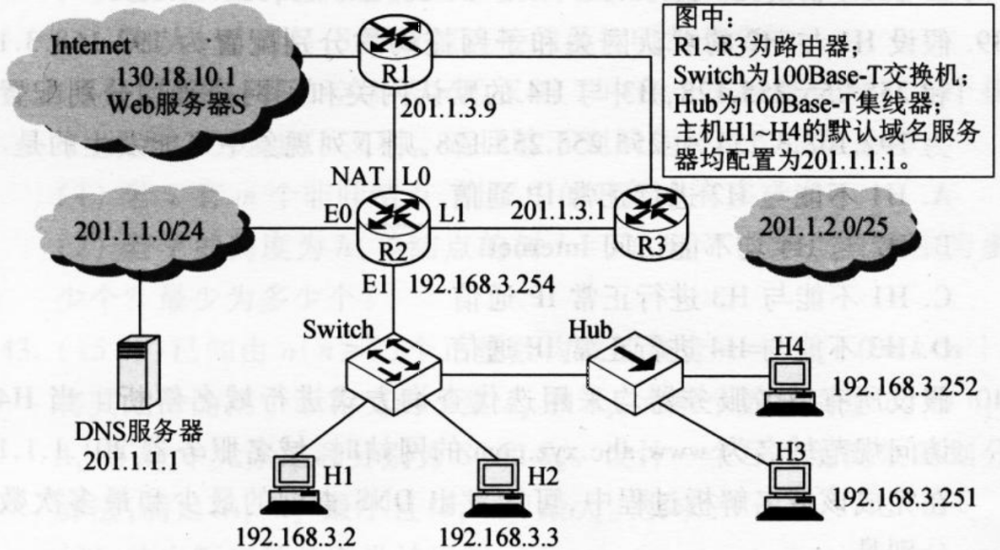

- [计算机网络](#计算机网络)
  - [第一章 计算机网络体系结构](#第一章-计算机网络体系结构)
    - [1.1 计算机网络概述](#11-计算机网络概述)
      - [1.1.1 计算机网络的概念](#111-计算机网络的概念)
      - [1.1.2 计算机网络的组成](#112-计算机网络的组成)
      - [1.1.3 计算机网络的功能](#113-计算机网络的功能)
      - [1.1.4 计算机网络的分类](#114-计算机网络的分类)
      - [1.1.5 计算机网络的标准化工作](#115-计算机网络的标准化工作)
      - [1.1.6 计算机网络的性能指标](#116-计算机网络的性能指标)
    - [1.2 计算机网络体系结构与参考模型](#12-计算机网络体系结构与参考模型)
      - [1.2.1 计算机网络分层结构](#121-计算机网络分层结构)
      - [1.2.3 计算机网络协议、接口、服务的概念](#123-计算机网络协议接口服务的概念)
      - [1.2.3 ISO/OSI 参考模型和 TCP/IP 模型](#123-isoosi-参考模型和-tcpip-模型)
  - [第二章 物理层](#第二章-物理层)
    - [2.1 通信基础](#21-通信基础)
      - [2.1.1 基本概念](#211-基本概念)
      - [2.1.2 奈奎斯特定理与香农定理](#212-奈奎斯特定理与香农定理)
      - [2.1.3 编码与调制](#213-编码与调制)
      - [2.1.4 电路交换、报文交换与分组交换](#214-电路交换报文交换与分组交换)
      - [2.1.5 数据报与虚电路](#215-数据报与虚电路)
    - [2.2 传输介质](#22-传输介质)
      - [2.2.1 双绞线、同轴电缆、光纤与无线传输介质](#221-双绞线同轴电缆光纤与无线传输介质)
      - [2.2.2 物理层接口特性](#222-物理层接口特性)
    - [2.3 物理层设备](#23-物理层设备)
      - [2.3.1 中继器（RP、repeater）](#231-中继器rprepeater)
      - [2.3.2 集线器（Hub）](#232-集线器hub)
  - [第三章 数据链路层](#第三章-数据链路层)
    - [3.1 数据链路层的功能](#31-数据链路层的功能)
      - [3.1.1 为网络层提供服务](#311-为网络层提供服务)
      - [3.1.2 链路管理](#312-链路管理)
      - [3.1.3 帧定界、帧同步与透明传输](#313-帧定界帧同步与透明传输)
      - [3.1.4 流量控制](#314-流量控制)
      - [3.1.5 差错控制](#315-差错控制)
    - [3.2 组帧（帧定界、帧同步与透明传输）](#32-组帧帧定界帧同步与透明传输)
      - [3.2.1 字符计数法](#321-字符计数法)
      - [3.2.2 字符填充法](#322-字符填充法)
      - [3.2.3 零比特填充法](#323-零比特填充法)
      - [3.2.4 违规编码法](#324-违规编码法)
    - [3.3 差错控制](#33-差错控制)
      - [3.3.1 检错编码](#331-检错编码)
      - [3.3.2 纠错编码](#332-纠错编码)
    - [3.4 流量控制与可靠传输机制](#34-流量控制与可靠传输机制)
      - [3.4.2 停止等待协议（Stop-and-Wait）](#342-停止等待协议stop-and-wait)
      - [3.4.3 后退 N 帧协议（GBN）](#343-后退-n-帧协议gbn)
      - [3.4.3 选择重传协议（SR）](#343-选择重传协议sr)
    - [3.5 介质访问控制](#35-介质访问控制)
      - [3.5.1 信道划分介质访问控制](#351-信道划分介质访问控制)
      - [3.5.2 随机访问介质访问控制](#352-随机访问介质访问控制)
      - [p-坚持 CSMA](#p-坚持-csma)
      - [3.5.3 轮询访问介质访问控制](#353-轮询访问介质访问控制)
    - [3.6 局域网](#36-局域网)
      - [3.6.1 局域网的基本概念和体系结构](#361-局域网的基本概念和体系结构)
      - [3.6.2 以太网和 IEEE 802.3](#362-以太网和-ieee-8023)
      - [3.6.3 IEEE 802.11 无线局域网](#363-ieee-80211-无线局域网)
      - [3.6.4 VLAN 基本概念与基本原理](#364-vlan-基本概念与基本原理)
    - [3.7 广域网（WAN）](#37-广域网wan)
      - [3.7.2 PPP 协议](#372-ppp-协议)
      - [3.7.3 HDLC 协议](#373-hdlc-协议)
    - [3.8 数据链路层设备](#38-数据链路层设备)
      - [3.8.1 网桥的基本概念](#381-网桥的基本概念)
      - [3.8.2 局域网交换机（Switch）](#382-局域网交换机switch)
    - [3.9 冲突域与广播域](#39-冲突域与广播域)
  - [第四章 网络层](#第四章-网络层)
    - [4.1 网络层的功能](#41-网络层的功能)
      - [4.1.1 异构网络互联](#411-异构网络互联)
      - [4.1.2 路由与转发](#412-路由与转发)
      - [4.1.3 SDN 的基本概念](#413-sdn-的基本概念)
      - [4.1.4 拥塞控制](#414-拥塞控制)
    - [4.2 路由算法](#42-路由算法)
      - [4.2.1 静态路由与动态路由](#421-静态路由与动态路由)
      - [4.2.2 自洽系统](#422-自洽系统)
      - [4.2.3 层次路由/域内路由与域间路由](#423-层次路由域内路由与域间路由)
      - [4.2.4 距离-向量路由算法](#424-距离-向量路由算法)
      - [4.2.5 链路状态路由算法](#425-链路状态路由算法)
      - [4.2.6 BGP 协议](#426-bgp-协议)
      - [4.2.7 三种协议的比较](#427-三种协议的比较)
    - [4.3 IPv4](#43-ipv4)
      - [4.3.1 IPv4 分组](#431-ipv4-分组)
      - [4.3.2 IPv4 地址](#432-ipv4-地址)
      - [4.3.3 子网划分与子网掩码、CIDR](#433-子网划分与子网掩码cidr)
      - [4.3.4 ARP、DHCP 与 ICMP](#434-arpdhcp-与-icmp)
    - [4.4 IPv6](#44-ipv6)
      - [4.4.1 IPv6](#441-ipv6)
      - [4.4.2 IPv6 地址](#442-ipv6-地址)
    - [4.5 IP 组播（多播）](#45-ip-组播多播)
      - [4.5.1 组播的概念](#451-组播的概念)
      - [4.5.2 IP 组播地址](#452-ip-组播地址)
      - [4.5.3 IGMP 与组播路由算法](#453-igmp-与组播路由算法)
    - [4.6 移动 IP](#46-移动-ip)
      - [4.6.1 移动 IP 的概念](#461-移动-ip-的概念)
      - [4.6.2 移动 IP 通信的过程](#462-移动-ip-通信的过程)
    - [4.7 互联网连接问题](#47-互联网连接问题)
    - [4.8 网络层设备](#48-网络层设备)
      - [4.8.1 冲突域与广播域](#481-冲突域与广播域)
      - [4.8.2 路由器的组成和功能](#482-路由器的组成和功能)
      - [4.8.3 路由表与路由转发](#483-路由表与路由转发)
  - [第五章 传输层](#第五章-传输层)
    - [5.1 传输层提供的服务](#51-传输层提供的服务)
      - [5.1.1 传输层的功能](#511-传输层的功能)
      - [5.1.2 传输层的寻址与端口](#512-传输层的寻址与端口)
      - [5.1.3 无连接服务与面向连接服务](#513-无连接服务与面向连接服务)
    - [5.2 UDP 协议](#52-udp-协议)
      - [5.2.1 UDP 数据报](#521-udp-数据报)
    - [5.3 TCP 协议](#53-tcp-协议)
      - [5.3.1 TCP 协议的特点](#531-tcp-协议的特点)
      - [5.3.2 TCP 报文段](#532-tcp-报文段)
      - [5.3.3 TCP 连接管理](#533-tcp-连接管理)
      - [5.3.4 TCP 可靠传输](#534-tcp-可靠传输)
      - [5.3.5 TCP 流量控制](#535-tcp-流量控制)
      - [5.3.6 TCP 拥塞控制](#536-tcp-拥塞控制)
  - [第六章 应用层](#第六章-应用层)
    - [6.1 网络应用模型](#61-网络应用模型)
      - [6.1.1 客户/服务器模型](#611-客户服务器模型)
      - [6.1.2 P2P模型](#612-p2p模型)
    - [6.2 域名系统（DNS）](#62-域名系统dns)
      - [6.2.1 层次域名空间](#621-层次域名空间)
      - [6.2.2 域名服务器](#622-域名服务器)
      - [6.2.3 域名解析过程](#623-域名解析过程)
    - [6.3 文件传输协议 FTP](#63-文件传输协议-ftp)
      - [6.3.1 FTP 的工作原理](#631-ftp-的工作原理)
      - [6.3.2 控制连接与数据连接](#632-控制连接与数据连接)
      - [6.3.3 FTP 协议传输模式](#633-ftp-协议传输模式)
      - [6.3.4 TFTP 协议](#634-tftp-协议)
    - [6.4 TELNET 协议](#64-telnet-协议)
    - [6.5 电子邮件](#65-电子邮件)
      - [6.5.1 电子邮件系统组成结构](#651-电子邮件系统组成结构)
      - [6.5.2 电子邮件格式](#652-电子邮件格式)
      - [6.5.3 SMTP、MIME、POP3 和 IMAP](#653-smtpmimepop3-和-imap)
      - [6.5.4 万维网邮件](#654-万维网邮件)
    - [6.6 万维网（WWW）](#66-万维网www)
      - [6.6.1 WWW 的概念与组成结构](#661-www-的概念与组成结构)
      - [6.6.2 超文本传输协议 HTTP](#662-超文本传输协议-http)
    - [6.7 DHCP 协议](#67-dhcp-协议)

# 计算机网络

## 第一章 计算机网络体系结构

### 1.1 计算机网络概述

#### 1.1.1 计算机网络的概念

**1.广义**

能实现远程信息处理的系统

或进一步能达到资源共享的系统

**2.资源共享观点**

1. 目的：资源共享

2. 组成单元：分布在不同地理位置

3. 规则：网络协议

**3.用户透明性观点**

网络对用户透明

用户好像在使用一台很大的计算机

#### 1.1.2 计算机网络的组成

**1.从组成部分上看**

1. 硬件

2. 软件

3. 协议

**2.从工作方式上看**

1. 边缘部分

2. 核心部分

**3.从功能组成上看**

1. 通信子网

2. 资源子网

#### 1.1.3 计算机网络的功能

1. 数据通信

2. 资源共享（硬件、软件、数据）

3. 分布式处理

4. 提高可靠性

5. 负载均衡

#### 1.1.4 计算机网络的分类

**1.按分布范围**

1. 广域网 WAM（交换技术）

2. 城域网 MAN

3. 局域网 WAN（广播技术）

4. 个人区域网 PAN

**2.按传输技术分类**

1. 广播式网络

2. 点对点网络

**3.按拓扑结构分类**

1. 总线

    优点：建网容易，增减结点方便，节省线路

    缺点：重负载时通信效率不高，总线任意一处对故障敏感

2. 星型

    缺点：成本高，中央设备对故障敏感

3. 环型

4. 网状

    优点：可靠性高

    缺点：控制复杂，成本高

    网状多用于广域网，其他多用于局域网

**4.按使用者分类**

1. 公用网

2. 专用网

**5.按交换技术分类**

1. 电路交换

2. 报文交换

3. 分组交换

    详见 [>> 2.1.4 电路交换、报文交换与分组交换](#214-电路交换报文交换与分组交换)

**6.按传输介质分类**

1. 有线网络

    双绞线网络

    同轴电缆网络

2. 无线网络

    蓝牙

    微波

    无线电

#### 1.1.5 计算机网络的标准化工作

RCF（Request For Comments）因特网标准形式

+ 因特网草案（Internet Draft）

+ 建议标准（Proposed Standard）

+ 草案标准（Draft Standard）

+ 因特网标准（Internet Standard）

相关组织

+ 国际标准化组织 ISO：OSI、HDLC

+ 国际电信联盟 ITU：制定通信规则

+ 国际电气电子工程师协会 IEEE：IEEE802

+ 因特网工程任务组 IETF：因特网标准制定

> 计算机网路与分布式计算机系统的主要区别是什么？
> 
> 分布式系统最主要的特点是，整个系统中的各个计算机对用户都是透明的。用户通过输入命令就可以运行程序，但用户并不知道是哪台计算机在为它运行程序。操作系统为用户选择一台最合适的计算机来运行其程序，并将运行结果传送到合适的地方。
> 
> 计算机网络则与之不同，用户必须先登录欲运行程序的计算机，然后按照计算机的地址，将程序通过计算机网络传送到该计算机上运行，然后根据用户的命令将结果传送到指定的计算机。二者的区别主要是软件的不同。

#### 1.1.6 计算机网络的性能指标

**1.带宽**

网络中某点到另外一点所能通过的**最高数据率**，单位是 b/s 等

即网络设备发送的极限最高速率约束

**2.时延**

是数据从网络的一端传送到另一端锁需要的时间，单位为 s

时延 = 发送（传输）时延 + 传播时延 + 排队时延 + 处理时延

+ 发送时延：从发送分组的第一个比特开始到最后一个比特发送完毕的时间。发送时延 = 数据长度\信道带宽（发送速率）

+ 传播时延：数据在信道上传播的时间。传播时延 = 信道长度\电磁波传播速率

+ 排队时延：等待输入与输出链路可用的时间

+ 处理时延：检错数据与查找转发出口的时间

> 数据传输速率是发送速率

> 做题时，排队时延和处理时延一般可忽略不计（除非题目另有说明）
>
> 高速链路提高的只是数据发送速率，减少的只是发送时延而不是传播时延

> 采用“存储-转发”方式的分组交换网络中，每个中间结点都必须先存储完一个分组之后，再开始一边转发一边接受下一个分组
>
> 因此除了发送时延之外，对于每个中间结点都有一个存储转发时延 = 一个分组的长度/发送速率

**3.时延带宽积**

时延带宽积 = 传播时延×带宽，单位为 bit

表示是以比特为单位的链路长度，即链路当前的数据比特容量

**4.往返时延 RTT**

从发送方发送数据开始，到发送方收到接收方的确认（假如收到数据立刻返回确认）总共经历的时延

RTT 越大，在收到确认前可以发送的数据越多

RTT = 往返传播时延（中间结点的处理时延、排队时延、转发数据时的发送时延） + 末端处理时延

端到端延时是从一方到另一方，只是往返路途的一半，即 **RTT = 2\*端到端延时**

**5.吞吐量**

单位时间内通过某网络或信道接口的数据量，单位是 b/s 等

这是网络实际的平均速率。吞吐量受网络带宽的限制

**6.速率**

数据传输率或比特率。是主机在数字信道上传输数据位数的额定理想速度

**7.利用率**

+ 信道利用率：有数据通过时间\（有+无）数据通过时间

+ 网络利用率：信道利用率加权平均值

[例题]

1.计算机网路的资源主要是指（）

A. 服务器、路由器、通信线路与用户计算机

B. 计算机操作系统、数据库与应用软件

C. Web 服务器、数据库服务器与文件服务器

D. 计算机硬件、软件与数据

答案：D

A、C 属于硬件，B 属于软件

只有 D 最全面

计算机资源包括：硬件、软件、数据

2.下列关于广播式网络的说法中，错误的是（）

A. 可以共享广播信道

B. 不存在路由选择问题

C. 可以不要网络层

D. 不需要服务访问点

答案：D

广播式共享广播信道，通常是局域网的一种通信方式

局域网工作在数据链路层，因此不需要网络层，因而不存在路由选择问题

但数据链路层使用物理层的服务必须通过服务访问点实现

### 1.2 计算机网络体系结构与参考模型

#### 1.2.1 计算机网络分层结构

**1.分层原因**

1. 发起通信的计算机必须将数据通信的通路进行激活

2. 要告诉网络如何识别目的主机

3. 发起通信的计算机要查明目的主机是否开机，并且与网络连接正常

4. 发起通信的计算机要弄清楚，对方计算机中文件管理程序是否已经做好准备工作

5. 确保差错和意外可以解决

**2.分层基本原则**

1. 各层功能相对独立

2. 各层之间界面清晰

3. 定义独立于方法（或者说定义分层但不定义每层具体的实现方法）

4. 上层单向使用下层服务

5. 促进标准化

#### 1.2.3 计算机网络协议、接口、服务的概念

**1.实体**

第 n 层中的活动元素称为 n 层实体。同一层的实体就是对等实体

**2.协议**

为进行网络中的对等实体数据交换而建立的规则、标准或约定。是水平方向的

+ 语法：传输数据的格式

+ 语义：所要完成的功能

+ 同步：各种操作的顺序

**3.接口（访问服务点 SAP）**

上层使用本层服务的入口

接口连接的是相邻层次

n 层的 SAP 提供给 n + 1 层用

就比如我 IP 在网络层，那我的 IP 地址就是我本层的 SAP，提供给 TCP 这种运输层上层用的

**4.服务**

下层为相邻上层提供的功能调用。是垂直方向的

+ 上层使用下层提供的服务

    为了使用下层提供的服务，上下两层之间需要交换命令

    OSI 中称为服务原语

    1. 请求

    2. 指示

    3. 响应

    4. 证实

+ 第 n 层向 n + 1 层提供服务时，不仅包括第 n 层本身的功能，还包括下面所有层次所提供的所有功能

+ 本层所提供服务细节对上一层完全屏蔽

+ 两个主机通信时，对等层在逻辑上有一条直接信道

+ 服务类型

    + 面向连接和无连接

    + 可靠和不可靠

        即是否有纠错、检错、应答

    + 有应答和无应答

通信|途径
:---:|:---:
不同网络的对等层之间通信|对等层协议
上层使用下层的服务|服务原语

**5.数据单位**

在每层，报文都分为两个部分

1. 包头 控制信息部分 协议控制信息 PCI

2. 正文 数据部分 服务数据单元 SDU

它们共同组成协议数据单元 PDU

n + 1 层的 PDU 作为第 n 层的 SDU，在加上本层的 PCI 就变成了本层的 PDU，然后交给 n - 1 层
    
所以 SDUn + PCIn = PDUn = SDUn - 1

物理层的 PDU 为比特，数据链路层的 SDU 为帧，网络层的 SDU 为分组，传输层的 PDU 为报文段

PDU 地址一般是目的地址

#### 1.2.3 ISO/OSI 参考模型和 TCP/IP 模型

**1.OSI 参考模型**

|名称|英文名|任务|功能|传输单位|用例|
| :--------: | :----------------: | :------------: |:---:|:---:|:---:|
|应用层|Application Layer|用户与网络的界面|直接为用户的应用进程（例如电子邮件、文件传输和终端仿真）提供服务||HTTP、SMTP、FTP、DNS|
|表示层|Presentation Layer|规范交换信息的表示方式|数据格式转换 加密和解密 数据压缩和恢复||JPEG、ASCII |
|会话层|Session Layer|负责在数据传输中建立和维护计算机网络中两台计算机之间的通信连接（会话）|使用校验点同步（SYN）或恢复通信||ADSP、ASP |
|传输层|Transport Layer| 负责端到端通讯|可靠传输，不可靠传输  差错控制 流量控制 复用分用|报文段（TCP）或用户数据报（UDP）|TCP、UDP |
|网络层|Network Layer| 传输分组|路由选择 流量控制 差错控制 规划IP地址(ipv4 和 ipv6 变化只会影响网络层) 拥塞控制 网际互联|数据报或分组|IP、ICP、IGMP、ARP、RARP、OSPF  |
|数据链路层|Data Link Layer|负责点到点通讯 将数据报组装成帧|成帧（帧的开始和结束） 透明传输 差错校验(一般丢弃，纠错由传输层解决) 流量控制 访问（接入）控制（控制信道的控制）|帧|SDLC、HDLC、PPP、STP|
|物理层|Physical Layer| 简单将数据转变为物理电信号，在物理媒体上实现比特流的透明传输|定义接口特性 定义传输模式（单工、半双工、双工） 定义传输速率 比特同步 比特编码|比特|Rj45、802.3 |

端系统一般都是七层，而中间系统如路由器等最多只有三层。上面四层是端到端的通信，而下面三层是点到点的通信

**2.TCP/IP 模型**

先有协议栈才有参考模型

|OSI|TCP/IP|各层主要协议|
|:---:|:---:|:---:|
|应用层|应用层 + 表示层 + 会话层|HTTP、FTP、DNS|
|传输层|传输层|TCP、UDP|
|网际层|网络层|IP|
|网络接口层|数据链路层 + 物理层|Ethernet、ATM、Frame Relay|

**3.TCP/IP 模型与 OSI 参考模型的比较**

||OSI 参考模型|TCP/IP 模型|
|:----:|:---:|:---:|
| 传输层 | 面向连接  | 无连接+面向连接 |
| 网络层 | 无连接+面向连接 |认为可靠性是端到端的问题 无连接|

五层参考模型：应用层、传输层、网络层、数据链路层、物理层

> 为什么一个网络协议必须考虑到各种不利的情况？
> 
> 因为网络协议如果不全面考虑不利的情况
>
> 那么当情况发生变化时，协议双方却仍然保持理想状态，无法改变当前的情况，会一直等下去

> 因特网使用的 IP 协议是无连接的，因此其传输是不可靠的。这样容易使人们感到因特网很不可靠。那么为什么当初不把因特网的传输设计为可靠的呢
> 
> 传统电信网的主要用途是电话通信，并且普通电话机不是智能的，因此电信公司必须花费巨大的代价把电信网设计的非常好，以保证用户的通信质量
>
> 设计 ARPAnet 时，就在讨论谁应负责数据传输的可靠性
>
> 一方认为应该像传统电信网那样，由通信网络负责数据传输的可靠性
>
> 另一种意见则是坚决主张由用户的主机负责数据传输的可靠性，理由是这样可使计算机网络便宜、灵活
>
> 计算机网络的先驱认为，计算机网络和电信网的一个重大区别是终端设备的性能差别很大，于是采用了后者的意见

> 端到端通信和点到点通信有什么区别？
>
> 从本质上说，由物理层、数据链路层和网络层组成的通信子网为网络环境中的主机提供点到点的服务，而传输层为网络中的主机提供端到端的通信
>
> 直接相连的结点之间的通信称为点到点通信，它只提供一台机器到另一台机器之间的通信，不涉及程序或进程的概念。同时，点到点通信并不能保证数据传输的可靠性，也不能说明源主机与目标主机之间是哪两个进程在通信，这些工作都是由传输层来完成的
>
> 端到端通信建立在点到点通信的基础上，它是由一段段的点到点通信信道构成的，是比点到点通信更高一级的通信方式，以完成应用程序（进程）之间的通信。“端”是指用户程序的端口，端口号标识了应用层中不同的进程

[例题]

1.在 OSI 参考模型中，当两台计算机进行文件传输时，为防止中间出现网络故障而重传整个文件的情况，可通过在文件中插入同步点来解决，这个动作发生在（）

A. 表示层

B. 会话层

C. 网络层

D. 应用层

答案：B

会话层的任务：会话管理与同步

2.数据链路层在分组上仅增加了源物理地址和目的物理地址（）

答案：x

添加到包头的除了本层的地址还有本层的控制信息

3.正确描述网络体系结构中的分层概念的是（）

A. 保持网络灵活且易于修改

B. 所有的网络体系结构都使用相同的层次名称和功能

C. 把相关的网络功能组合在一层中

D. 定义各层的功能以及功能的具体实现

答案：A

B D 显然错

分层应该把网络的功能划分，而不是把相关的网络功能组合在一层中，C 错误

## 第二章 物理层

物理层需要考虑如何传输比特流，而不关心到底使用何种媒体传输数据。具体传输数据的层次是第 0 层

### 2.1 通信基础

#### 2.1.1 基本概念

**1.数据、信号与码元**

数据是指传送信息的实体

信号是数据的电气或电磁表现

数据/信号可分为模拟（连续）和数字（离散）

码元：对于二进制，符号大小为 n bit，其中一个 bit 表示一个二进制码元

同理对于 m 进制，某符号大小为 n 位，其中一位表示一个 m 进制码元

**2.新源、信道与信宿**

**1)概念**

+ 信源：发送数据的源头

+ 信宿：接受数据的终点

+ 信道：信号的传输媒介

    + 模拟信道、数字信道

    + 有线信道、无线信道

    信道 != 电路

    信道可以视为电路的一个逻辑部件，一个用来表示向某个方向传送信息的介质

    因此一条通信线路往往包含一条发送信道和一条接收信道de

    信道的极限容量是指信道的信息传输速率或码元传输速率（下面有介绍）

**2)通信方式**

+ 单工通信：只能单方面通信，只需一条信道

+ 半双工通信：能发送和接受，但是不能同时发送接收，需要两条信道

+ 全双工通信：都能发送与接受，需要两条信道

**3)传输方式**

+ 串行：速度慢、费用低、适合远距离

+ 并行：速度快、费用高、适合近距离

**4)信号类型**

+ 基带传输

    + 将数字信号 1 0 直接用两种不同的电压表示，不用调制，直接送到数字信道上传输

        即**传输 0 1**

    + 是来自信源的信号，如计算机输出的表示文字或多媒体的数据信号，即发出的直接表达了要传输的信息的信号

    + 传输媒体整个带宽都被基带信号占用

    + 近距离，通常用于局域网

+ 频带传输

    + 将基带信号对特定频率的载波进行调制后进行的频分复用模拟信号，再传输到模拟信道上传输

        即**传输码元**

    + 将低频的基带信号进行载波调制后将信号的频率范围移动到较高频段以便在信道中传输

    + 远距离，与无线传输

    + 不仅解决电话系统传输数字信号问题，还可以实现多路复用

+ 宽带传输

    + 基于频带传输，使用频分复用等技术将链路容量分解为两个或多个信道，每个信道可以携带不同的信号

    + 信道直接互不干扰，提高效率

**3.速率、波特与带宽**

**1)波特 Baud**

指一秒可以传输多少个码元（电平）

1 波特  = 1 码元/秒

比特率 = 波特率*log2(码元的进制数 M)

**2)速率**

分为信息传输速率与码元传输速率

信息传输速率 单位 b/s，就是我们平常说的网速

码元传输速率 单位 码元/秒 = 波特

= 波特率

码元所带信息量（比特数）= log2(码元的进制数 M)

**3)带宽 Band Width**

信道带宽原指信道最高通过频率与最低通过频率之差，单位为 Hz

后值网络中从一点到达另一点的最高数据率，单位为 b/s

#### 2.1.2 奈奎斯特定理与香农定理

**1.奈奎斯特定理 Nyquist**

**1)背景**

信道能通过的频率范围是有限的

信号的高频分量往往不能通过信道，导致信号衰减，接收端接收到的信号波形失去码元之间的清晰界限

这种现象称为码间串扰

**2)公式**

奈氏准则规定避免码间串扰的低通信道最高码元传输速率

最高码元传输速率 = 2*信道带宽，单位为波特 = 2W

**3)结论**

1. 由于码元的传输速率受奈氏准则的制约，所以要提高数据的传输速率，就必须设法使每个码元能携带更多的个比特量的信息，这就需要多元制的调制方法

2. 信道频带越宽，即能通过的信号高频分量越多，就可以用更高速率进行码元的有效传输

**2.香农定理 Shannon**

**1)背景**

信噪比 = 10 lg(信号的平均功率 S/噪声的平均功率 N) = **10lg(S/N)**，单位是分贝 dB

采用分贝表示的原因是很多时候，信号要比噪声强得多，比如信号比噪声强 10 亿倍，如果用数值表示的话，那么 1 后面有 9 个 0，很容易丢失一个 0。如果用分贝表示只为 90 dB，要简单得多，而且不容易出错。分贝对于表示特别大或特别小的数值极为有利，这种表示方式在电子通信领域用途很广

**2)公式**

香农定理规定带宽首先且高斯噪声条件下最高数据传输速率

在带宽受限且有噪声的信道中，为了不产生误差，信息的数据传输速率有上限值

极限数据传输速率 = 信道带宽*log2(1 + 信噪比) = **Wlog2(1+S/N)**

> 注意信噪比 = **10lg(S/N)**，极限数据传输速率 = **Wlog2(1+S/N)**
>
> 这两个是不一样的 log！

**3)结论**

1. 只要信息的传输速率低于信道的极限传输速率，就一定能找到某种方式来实现无差错传输

2. 奈奎斯特定理考虑码间串扰，得出码元的传输速率是有上限的，于是想尽量提高码元的进制数

    香农定理又考虑到噪声，说明码元的传输速率达到上限后，码元的进制数也是有限的

> 当没有给信噪比的条件就只能使用奈氏准则，而如果当给出了信噪比与码元种数时，就需要同时使用奈氏准则与香农定理，然后取较小值作为答案

#### 2.1.3 编码与调制

调制：数据 -> 模拟信号

编码：数据 -> 数字信号

> 调制速率 = 每秒传输的码元的个数 Baud/s

数字数据/模拟数据 -> 数字信号/模拟信号的四种搭配：

**1.数字数据编码为数字信号**

1. 归零编码 RZ

    高电平代表 1，否则代表 0

    每个时钟周期的中间均跳变到低电平（归零）

    接收方根据该跳变调整本方的时钟基准，为传输双方提供了自同步机制

    归零要占用一部分带宽，因而传输效率受到了一定的影响

2. 非归零编码 NRZ

    与 RZ 的区别在于不用归零

    无法传递时钟信号，双方难以同步，需要各自带有时钟线

3. 反向非归零编码 NRZI

    与 NRZ 的区别在于用信号的翻转代表 0，用信号的不变代表 1

    集成了前两种编码的优点

    1. 既能传输时钟信号

    2. 又能尽量不损失系统带宽

    用例：USB 2.0

4. 曼彻斯特编码 Manchester Encoding

    “将一个码元分为两个相等的间隔”

    前一个间隔为高电平，后一个间隔为低电平表示 1，相反则代表 0

    也可以使用相反的规定

    每个码元的中间出现跳变

    该跳变既作为时钟信号，用于同步，也作为数据信号

    所占的频带宽度是基带宽度的两倍

    用例：以太网

5. 差分曼彻斯特编码

    将一个码元分为两个相等的间隔

    前半个码元的电平与上一个码元的后半个码元电平相同表示 1，相反则代表 0

    每个码元的中间出现跳变

    该跳变既作为时钟信号，用于同步

    抗干扰性也强于曼彻斯特编码

    用例：局域网

6. 4B/5B编码

    数据流的每 4 位作为一组，编成 5 位码

    编成的 5 位码中的 16 种组合用于表示原来的 4 位码，剩余 16 种组合作为控制码

**2.数字数据调制为模拟信号**

1. 幅移键控（调幅 ASK）。通过改变载波信号的振幅来表示数字信号 1 和 0，而载波的频率和相位都不改变。比较容易实现，但抗干扰能力差

2. 频移键控（调频 FSK）。通过改变载波信号的频率来表示数字信号 1 和 0，而载波的振幅和相位都不改变。容易实现，抗干扰能力强，目前应用较为广泛

3. 相移键控（调相 PSK）。通过改变载波信号的相位来表示数字信号 1 和 0，而载波的振幅和频率都不改变。它又分为绝对调相和相对调相

4. 正交振幅调制（QAM）。在频率相同的前提下，将 ASK 与 PSK 结合起来，形成叠加信号

    设波特率为 B，采用 m 个相位，每个相位有 n 种振幅，码元类型 = 相位数×振幅数
    
    则该 QAM 技术的数据传输速率 R 为 R = Blog2(mn)，即为波特率×log2(相位数×每相位振幅数)

**3.模拟数据编码为数字信号**

因为计算机内部都是二进制数据，所以需要将模拟信号通过采样、量化转换位有限个数字表示的离散序列

1. 抽样：对模拟信号周期性扫描，把时间上连续的信号变为时间上的离散信号。采样频率遵循采样定理

    采样定理：采样频率至少为带宽的 2 倍

2. 量化：把抽样取得的电平幅值按照一定的分级标度转换位对应的数字值并取整，于是连续的电平幅值就变为离散的数字量

3. 编码：把量化结果转换为与之对应的二进制编码

**4.模拟数据调制为模拟信号**

+ 低频到高频

+ 频分复用

#### 2.1.4 电路交换、报文交换与分组交换

**1.电路交换**

源结点和目标结点之间建立专用（双方独占）的信道

中间结点不采用存储转发

优点：

+ 数据直接传送，传输时延小，实时性强

+ 有序传输

+ 无冲突争用

+ 适用性强，可传输模拟信号或数字信号

+ 控制简单

缺点：

+ 建立连接时间长

+ 线路独占，灵活性较差，线路利用率**低**，不能充分利用容量

    低是因为中间不穿数据的时候也不释放连接

+ 不便进行流量控制，差错控制

+ 终端有不同规格，很难标准化

> 我一开始以为线路利用率高，因为可以一直传一直传……不是这么想的，那别的线路也可以一直传
> 
> 一直传只是考察利用率的一种情况，还有这种中途不传了的情况

**2.报文交换**

相邻结点之间转发整个报文

1. 源先根据报文加上 IP 地址，物理地址等，通过物理层发送

2. 交换机收到报文之后，先进行存储，等待链路空闲之后进行转发，但是转发的路径不是固定的，是比较随机的

3. 最后通过许多交换机最终到达目的地

优点：

+ 无需建立连接

+ 存储转发

+ 动态分配线路，提高线路可靠性

+ 充分利用线路容量

+ 方便进行传输速率转换，格式转换

+ 可以实现一对多，多对一的访问

+ 可以实现差错控制

缺点：

+ 增大了资源开销

+ 增加了缓冲时延

+ 需要额外的控制机制保证不同报文之间的顺序

+ 无法预测报文大小，因此难以管理缓冲区

所以报文交换主要用于早期电报通信网，不能应用于实时通讯，如电话，视频

**3.分组交换**

相邻结点之间转发分组（整个报文的一部分）

优点：

+ 报文交换的优点

+ 缓冲易于管理

+ 包的平均时延更小

+ 网络占用的平均缓冲区更小

+ 更易于标准化

+ 更适合应用

缺点：

+ 仍存在转发时延

+ 结点交换机需要更强的控制机制

+ 需要传递额外的信息量（组头）

+ 需要额外的控制机制保证不同报文之间的顺序

    若采用虚电路服务，虽无失序问题，但有呼叫建立、数据传输和虚电路释放三个过程

**4.比较**

||信道利用率|时延|用例|
|:---:|:---:|:---:|:---:|
|电路交换|低||传送的数据量很大，且传送时间远大于呼叫时间|
|报文交换|中|||
|分组交换|高|小于报文交换|尤其适合于计算机之间的突发式数据通信|

#### 2.1.5 数据报与虚电路

分组交换进一步分为：

1. 面向连接的虚电路

2. 无连接的数据报

> 都是面向网络层的，比如路由表根据转发表转发就是明显在网络层
>
> 不知道为什么要把这个内容放在物理层……

**1.数据报**

原理：

若主机 A 要向 B 发送分组：

1. 主机 A 发送给相连的交换结点 A

2. 交换结点 A 受到分组后，检查转发表，转发给其他相连的交换结点

3. 最终分组转发到与主机 B 相连的交换结点 B，交换结点 B 再发送给主机 B

特点：

1. 发送分组前不需要建立连接。发送方可随时发送分组，网络中的结点可随时接受分组

2. 网络尽最大努力交付

    最大努力，不保证的含义：
    
    1. 传输不保证可靠性，所以可能丢失
    
    2. 为每个分组独立地选择路由，转发路径可能不同，因而分组不一定按序到达目的结点

3. 发送的分组中要包括发送端和接受端的完整地址，以便可以独立传输

4. 分组在交换结点存储转发时，需要排队等候处理，这会带来一定的时延

    存储转发的延时一般较小，提高了网络的吞吐量
    
    但当通过交换结点的通信量较大或网络发生拥塞时，这种时延会大大增加

    交换结点还可根据情况丢弃部分分组

5. 网络具有冗余路径，当某一交换结点或一段链路出现故障时，可相应地更新转发表，寻找另一条路径转发分组，对故障的适应能力强

6. 收发双发不独占某一链路，资源利用率较高

**2.虚电路**

过程：

1. 呼叫建立

2. 数据传输

3. 虚电路释放

在虚电路方式中，端系统每次建立虚电路时，选择一个没用过的虚电路分配给该虚电路，以区别于本系统中的其他虚电路

在传送数据时，每个数据分组不仅要有分组号、检验和等控制信息，还要有它要通过的虚电路号，以区别于其他虚电路的分组

在虚电路网络中的每个结点上都维持一张虚电路表，它的每一项记录了一个打开的虚电路的信息

包括在接受链路和发送链路的虚电路号，前一结点和下一结点的标识

数据的传输是双向进行的，上述信息是在虚电路的建立过程中确定的

具体过程：

特点：

1. 需电路通信链路的建立和拆除需要时间开销

    对交互式的应用和小量的短分组情况显得浪费

    但对长时间、频繁的数据交换，则效率较高

2. 虚电路的路由选择体现在连接建立阶段，连接建立后，传输路径就确定了

3. 虚电路提供了可靠的通信功能，能保证每个分组正确且有序到达

    此外，还可以对两个数据端点的流量进行控制，当接收方来不及接受数据时，可以通知发送方暂缓发送

4. 虚电路有一个致命的弱点，即当网络中某个结点或链路出故障而彻底失效时，则所有经过该结点或链路的虚电路将遭到破坏

5. 分组首部并不包含目的地址，而是包含虚电路标识符，相对数据报方式开销小

虚电路之所以是“虚”的，是因为这条电路不是专用的

每个结点到其他结点之间的链路可能同时有若干虚电路通过，也可能与多个结点之间具有虚电路

每条虚电路支持特定的两个端系统之间的数据传输，两个端系统之间也可以有多条虚电路为不同的进程服务，这些虚电路的实际路由可能相同也可能不相同。

数据传输过程是由确认的传输（由高层实现），主机B收到分组后要发回相应分组的确认。网络中的传输是否有确认与网络层提供的两种服务没有任何关系

**3.比较**

| a         | 数据报服务                         | 虚电路服务                        |
|:---:|:---:|:---:|
| 连接的建立     | 不要                            | 必须有                          |
| 目的地址      | 每个分组都有完整的目的地址                 | 仅在建立连接阶段使用，之后每个分组使用长度较短的虚电路号 |
| 路由选择      | 每个分组独立地进行路由选择和转发              | 属于同一条虚电路的分组按照同一路由转发          |
| 分组顺序      | 不保证分组的有序到达                    | 保证分组的有序到达                    |
| 可靠性       | 不保证可靠通信，可靠性由用户主机来保证           | 可靠性由网络保证                     |
| 对网络故障的适应性 | 出故障的结点丢失分组，其他分组路径选择发生变化，可正常传输 | 所有经过故障结点的虚电路均不能正常工作          |
| 差错处理和流量控制 | 由用户主机进行流量控制，不保证数据报的可靠性        | 可由分组交换网负责，也可由用户主机负责          |

[例题]

1.传输一个数字信号的模拟信道的信号功率是 0.62 W，噪声功率是 0.02 W，频率范围是 3.5 ～ 3.9 MHz，该信道的最高数据传输速率为：

答案：2 Mbps

S/N = 31

log2(1+S/N) = log2(32) = 5

W = 3.9 - 3.5 = 0.4 MHz 注意带宽是频率范围的上限 - 下限

香农公式：Wlog2(1+S/N) = 0.4 * 5 = 2 Mbps

如果想用奈氏准则也不是不行，最高数据传输速率 = 2Wlog2V

但是题目中没有说模拟信道的码元的比特数

虽然他传输的是数字信号，但是不代表他模拟信号就是二进制码元啊

比如 1V 2V 3V 算 0，4V 5V 6V 算 1

2.测得一个以太网的数据波特率是 40 MBaud，那么其数据率是（）

A. 10 Mb/s

B. 20 Mb/s

C. 40 Mb/s

D. 80 Mb/s

答案：B

曼彻斯特编码中的“将一个码元分为两个相等的间隔”确实是“一个码元代表一位二进制数据”

也就是说，在曼彻斯特编码中，一个码元就是一次高低电平转化，也即一个码元就是 01 或 10 电平

在模拟信道中，码元可以是一段具有特定振幅和频率的波，见 [>> 2.1.3 编码与调制 数字数据调制为模拟信号](#213-编码与调制)

但是在数字信道中，一个码元就是一个 0 或 1 的电平输出

> 有的人说："码元是一个脉冲信号"，进而得出一个码元就是一个 0 或 1 的电平输出
> 
> 这是没有逻辑的，忽视了码元在不同情景下具有不同的含义

因此我们在说“以太网的数据波特率”的时候，我们默认这里的码元是数字信道的码元

这样，就出现了一个微妙的区别，这个数字信道的码元 != 曼彻斯特编码的码元

但是数据率中的“数据”是曼彻斯特编码所表示的数据

因此我们必须要进行：数字信道的码元传输速率 -> 曼彻斯特编码的码元传输速率 -> 曼彻斯特编码的数据传输速率

1. 数字信道的码元传输速率 -> 曼彻斯特编码的码元传输速率

    曼彻斯特编码中，一个码元就是 01 或 10 电平，所以数字信道的码元传输速率/2 = 曼彻斯特编码的码元传输速率

2. 曼彻斯特编码的码元传输速率 -> 曼彻斯特编码的数据传输速率

    曼彻斯特编码中，一个码元对应一位数据，所以曼彻斯特编码的码元传输速率 = 曼彻斯特编码的数据传输速率

    （好吧，暂时忽略单位不一致）

相同类型的题目：10M 802.3 LAN 使用曼彻斯特编码，它的波特率是：

答案：20 MBaud

这里“10M 802.3 LAN”指的是 LAN 的数据传输速率是 10 Mb/s，也就是曼彻斯特编码的数据传输速率

题目问的“它的波特率”指的是“LAN 的波特率”而不是“曼彻斯特编码的波特率”

因此，曼彻斯特编码的数据传输速率 = 曼彻斯特编码的码元传输速率 = 10 MBaud

则数字信道的码元传输速率 = 2*曼彻斯特编码的码元传输速率 = 20 MBaud

事情变得这么麻烦的原因就在于码元的含义是随情景而变的，而书本和网络上的分析很多还是很模糊

3.将 1 路模拟信号分别编码为数字信号后，和另外 7 路数字信号采用同步时分复用（同步 TDM）复用一条信道。1 路模拟信号的频率变化范围是 0~1 kHz，每个采样点用的编码方式是 4 位二进制数，另外 7 路数字信号的数据率均为 7.2 kb/s，复用线路中最小的通信能力是（）

答案：64 kb/s

模拟信号变数字信号，有采样定理：采样频率至少为带宽的 2 倍。因此根据带宽为 1 kHz，那么采样频率是 2 kHz.

每个采样点用的编码方式是 4 位二进制数，因此每秒得到的数据量为：2 kHz * 4b = 8 kb.

但是，信道其他 7 路的数据率是 7.2 kb/s。复用信道时，速率必须匹配，那么这里必须都为 8 kb/s

所以，就是 8 路信号需要传输，每路的速率必须达到 8 kb/s

时分复用（TDM）在时间上将信道划分为不同的时隙，在不同的时隙上间插不同的脉冲信号，依次来实现时域上多路信号的复用

传输率指的是发送速率，1 个复用线路和 8 个采样线路相连，数据经过相连处无时延转发，所以复用线路为了转发 8 个采样线路 8kb/s 的数据，其自身的发送速率必然需要是所有采样线路传输率的总和

所以复用线路发送速率 = 8*8 = 64 kb/s

4.在下图所示的采用“存储—转发”方式的分组交换网络中，所有链路的数据传输速率为 100 Mbit/s，分组大小为 1000B，其中分组头大小为 20 B。若主机 H1 向主机 H2 发送一个大小为 980000 B 的文件，则在不考虑分组拆装时间和传播延迟的情况下，从 H1 发送开始到 H2 接收完为止，需要的时间至少是（）

A. 80ms

B. 80.08ms

C. 80.16ms

D. 80.24ms

答案：C

总共要发送 1000B * 1000 = 1 MB 的数据

数据发送时延 = 1 MB/100 Mb/s = 0.08 s = 80 ms

注意每个中间结点都有一个存储转发时延 = 一个分组的长度/发送速率 = 1000 B/100 Mb/s = 0.08 ms

[>> 1.1.6 计算机网络的性能指标](#116-计算机网络的性能指标)

所以有两个中间结点时，总时延 = 80 + 0.08 * 2 = 80.16 ms

### 2.2 传输介质

传输介质：发送设备和接收设备之间的物理通路（信道是逻辑通路）

传输媒体并不是物理层

例如，传输媒体没有规定电气特性，那么它只知道传输的是信号，但是不知道传输的是 0 还是 1

+ 导向性传输介质：电磁波沿着固体媒介（铜线或光纤）被导向传播

+ 非导向性传输介质：自由空间，如空气，水等等

#### 2.2.1 双绞线、同轴电缆、光纤与无线传输介质

**1.导向型传输介质**

**1)双绞线**

+ 是两根采用规则并排校合并绝缘的铜导线组成。绞合是减少电磁干扰

+ 根据有无屏蔽层分为屏蔽双绞线（STP）和无屏蔽双绞线（UTP）。UTP 外加上金属网就是 STP

+ 通信距离为几到数十公里

+ 距离太远需要使用放大器放大模拟信号，中继器整形数字信号

**2)同轴电缆**

同轴电缆由内导体、绝缘层、网状编织屏蔽层和塑料外层构成

+ $50\Omega$：基带同轴电缆。用于局域网

+ $75\Omega$：宽带同轴电缆。用于有线电视系统

与双绞线相比，同轴电缆的**外导体屏蔽层** -> 抗干扰特性，**高带宽**，远传输距离，但价格较双绞线贵

**3)光纤**

+ 传递光脉冲，带宽大于其他传输媒体

+ 实心纤芯与包层构成

+ 分为多模光纤与单模光纤

|定义|光源|特点|外观
:--:|:--:|:--:|:--:
单模光纤|一种在横向模式直接传输光信号的管线|定向性好的激光二极管|损耗小，适合远距离传输|纤芯只有一道光的长度
多模光纤|有多种传输光信号模式的光纤|普通发光二极管|易失真，适合近距离传输|纤芯较大

光纤特点

1. 传输损耗小，中继距离长

2. 抗雷电电磁干扰性能好

3. 保密性好，无串音干扰

4. 体积小重量低

**2.非导向性传输介质**

**1)无线电波**

+ 全方向传播；

+ 穿透率较强；

+ 可远距离通信，主要用于电话通信

**2)微波**

+ 固定方向传播；

+ 频率高、频段广、数据率高；

+ 分为地面微波接力通信与卫星通信；

+ 卫星通信的优点：通信容量大、距离远、覆盖光、广播通信与多址通信；

+ 卫星通信的缺点：传播时延长、受天气干扰大、误码率高、成本高

**3)红外线与激光**

+ 固定方向传播；

    微波、红外线与激光都具有高带宽，都沿固定方向传播，有时统称为视线介质

+ 需要转换为各自的信号格式再在空间中传播

#### 2.2.2 物理层接口特性

+ 机械特性：规格、接口形状、引线数目、引脚数量、排列情况

+ 电气特性：电压范围、阻抗匹配、传输速率、距离限制

    例如：用 +10 V ～ + 15 V 表示 0，用 -10 ～ -15 表示 1

+ 功能特性：电平意义、接口部件的用途

    例如：$\overline{CS}$：芯片选择信号，选择指定芯片，低电平有效

+ 规程特性（过程特性）：工作规程和时序的关系

常用的物理层接口标准有 EIA RS-232-C、ADSL、SONET/SDH 等

[例题]

1.利用一根同轴电缆互连主机构成以太网，则主机间的通信方式为（）

A. 全双工

B. 半双工

C. 单工

D. 不确定

答案：B

传统以太网采用广播的方式发送信息，同一时间只允许一台主机发送消息，否则各主机之间就会形成冲突

因此主机间的通信方式是半双工

### 2.3 物理层设备

网段在物理层互联时要求数据传输速率相同，但是上层协议可以不同

#### 2.3.1 中继器（RP、repeater）

也称为转发器，仅作用于信号电气部分，用于对数字信号进行再生和还原，对衰减的信号进行整形、放大（不仅仅是放大）

中继器的两端

+ 网段而非子网。使用中继器连接的几个网段仍然是一个局域网

+ 类型相同

+ 网络速度相同

+ 只负责发送而不关心是否有错误或不适于网段的数据

+ 可以连不同媒体也可以连相同媒体

+ 不会存储转发所以一定要协议相同

+ 5-4-3 规则：采用粗同轴电缆的 10BASE5 以太网规范，5 是指不能超过五个网段；4 是指在这些网段中的物理层网络设备（中继器，集线器）最多不超过四个；3 是指这些网段中最多只有三个网段挂有计算机

> 若网络设备具有存储转发的功能则能连接不同的本层的协议，否则则不能
>
> 感觉他这里隐含的意思就是，每个协议对应的数据传输速率都是不同的
>
> 没有存储转发，就没有办法通过缓冲调整速率，所以不能连不同协议
>
> 但是他好歹说明一下这个隐含的假设吧……万一有两个协议真的很特别，数据传输速率一模一样呢

> 放大器和中继器都起放大作用
> 
> 只不过放大器放大的是模拟信号，原理是将衰减的信号放大，它同时也会使噪声变大，引起失真
> 
> 而中继器放大的是数字信号，原理是将衰减的信号整形再生
>
> 所以如果需要**比较长的传输距离**，那么就需要安装**中继器**

#### 2.3.2 集线器（Hub）

集线器是多端口中继器，功能类似，放大信号再转发到其他所有除输入端口外处于工作态的端口上

+ 当集线器的一个端口收到数据后立刻从除输入端口外的所有端口广播出去

+ 如果同时有两个或多个端口输入，那么输出时会发生冲突，致使这些数据都无效

+ 因此不具备信号的定向传送能力，半双工，是一个共享式设备（广播）

+ 因为是广播所以有大的冲突域，不能分割冲突域。所以多少个计算机连入集线器，同时工作时就平分集线器拥有的带宽

+ 集线器连接的网络拓扑结构上属于星型

+ 集线器主要使用双绞线

以太网上的集线器默认是 100 Base-T，即传输速率为 100 Mb/s

## 第三章 数据链路层

### 3.1 数据链路层的功能

**1.概念**

+ 结点：主机、路由器

+ 链路：网络中两个结点之间的物理通道，也可分为：

    + 物理链路：网络中两个结点之间的物理通道

    + 数据链路：网络中两个结点之间的逻辑通道

        也可记为 物理链路 + 通信协议

+ 帧：链路层的协议数据单元

**2.功能**

将物理层提供的可能出错的物理连接改造为逻辑上无差错的数据链路

对网络层表现为一条无差错的链路

更进一步划分：

1. 为网络层提供服务：无确认无连接服务、有确认无连接服务、有确认面向连接服务。面向连接就一定会确认

2. 链路管理：控制对物理传输介值访问

3. 组帧（定义数据格式）：帧定界、帧同步、透明传输。规定了帧的数据部分的长度上限——最大传送单元（MTU）

4. 流量控制：发送方的流量

5. 差错控制

#### 3.1.1 为网络层提供服务

1. 无确认无连接服务

    不用建立连接

    不需确认

    丢失的帧不负责重发，而交给上层处理

    例：以太网

> 应该不能说用例是 UDP 吧……？毕竟这是数据链路层，而 UDP 是传输层

2. 有确认无连接服务

    不用建立连接

    有确认：每一帧都要确认，若源机器在规定时间内未收到对某帧的确认，就重传该帧

    例：无线通信

3. 有确认面向连接服务

    建立连接：建立数据链路、传输帧、释放数据链路

    有确认：每一帧都要确认，若源机器在规定时间内未收到对某帧的确认，就重传该帧

    例：通信要求（可靠性、实时性）较高的场合

4. 有连接就一定要有确认，即不存在无确认的面向连接的服务

#### 3.1.2 链路管理

主要用于面向连接的服务

1. 建立维护释放连接

2. 管理共享信道

#### 3.1.3 帧定界、帧同步与透明传输

在一段数据的前后部分添加首部和尾部，构成一个帧来定界传输（由于数据链路层以上的传输单元不用直接传输所以只用添加本层首部就可以了）。接受端在收到物理层上交的比特流后就可以根据首部和尾部的标记从而识别帧的开始和结束

透明传输：通过一些措施解决现有的帧定界符与数据中相同的比特组合之间的冲突，使得不管所传数据为什么样的比特组合都能在链路上传输

（也就是数据中与帧定界符相同的比特部分对数据链路层透明）

组帧方式在下面详细介绍：[>> 3.2 组帧（帧定界、帧同步与透明传输）](#32-组帧帧定界帧同步与透明传输)

#### 3.1.4 流量控制

较高的发送速度和较低的接受能力不匹配时传输会出错

主要是限制发送方的流量，使其发送速率不超过接收方的接收能力

需要通过某种反馈机制使发送方能够知道接收方是否能跟上自己

数据链路层流量控制与传输层的流量控制的区别：

+ 数据链路层流量控制是点到点的，而传输层的流量控制是端到端的

+ 数据链路层流量控制是相邻两个结点的，而传输层的流量控制是两个主机的

+ 数据链路层流量控制是收不下就不回复确认（确认控制帧），而传输层的流量控制是接收端发送给发送端一个窗口公告

详见 [>> 3.4 流量控制与可靠传输机制](#34-流量控制与可靠传输机制)

> OSI 规定 数据链路层 流量控制
>
> TCP/IP 规定 传输层 流量控制

#### 3.1.5 差错控制

**1.噪声来源**

+ 全局噪声（热噪声，随机噪声）：产生随机差错。线路本身电气特征所产生的固有；可以通过改善传感器调高信噪比来减少

+ 局部噪声（冲击噪声）：产生突发差错。外界特定短暂的原因所产生，是产生差错的主要原因；可以通过编码计数来解决

**2.差错**

+ 位错：比特位出错，1 变为 0，0 变为 1。也称为比特差错

    位错的解决方法：

    1. 采用检错编码或者纠错编码发现位错或者纠正位错

        检错编码：奇偶校验法、循环冗余码（CRC）

        纠错编码：海明码

    2. 通过自动重传请求 ARQ 方式重传出错的帧

        使用纠错编码纠正叫做前向纠错 FEC

    详见 [>> 3.3 差错控制](#33-差错控制)

+ 帧错：有三种情况，假如发送的是 1 2 3

    1. 丢失：1 2 解决方法：计时器超时重发

    2. 重复：1 2 2 3 解决方法：帧编号机制

    3. 失序：3 1 2 解决方法：帧编号机制

物理层所说的编码是针对单个比特的调制，为了达成同步

而数据链路层所说的编码是针对一组比特，根据校验码检查一串二进制比特

[例题]

1.数据链路层的协议不包括（）

A. 定义数据格式

B. 提供结点之间的可靠传输

C. 控制对物理传输介质的访问

D. 为终端结点隐蔽物理传输的细节

答案：D

数据链路层需要组帧，包括 A

数据链路层需要差错控制，包括 B

数据链路层的介质控制访问 MAC 子层控制对物理传输介质的访问，包括 C

物理层对上层隐蔽物理传输的细节，数据链路层不包括 D

2.下述协议中，（）不是数据链路层的标准：

A. ICMP

B. HDLC

C. PPP

D. SLIP

答案：A

ICMP 属于网络层协议，其他都是数据链路层

不会背……

### 3.2 组帧（帧定界、帧同步与透明传输）

组帧是为了解决帧定界、帧同步与透明传输等问题

#### 3.2.1 字符计数法

帧首部使用一个计数字段（第一个字节，八位）表明帧内字符数。题目计算时这个计数字段也要算成一个字符

缺点：如果在某一个帧内，标记位后面的某个字节的数据丢失，那么会影响后面所有的帧

比如 3 1 1 和 4 2 2 2，如果前面的帧丢失变成 3 1，那么后面的 4 就会被补到前面变成 3 1 4 导致错误

#### 3.2.2 字符填充法

在帧的头部加一个开始标记，在帧的尾部加一个结束标记

SOH 表示帧开始，EOT 表示帧结束

透明传输的处理：设置转义字符 ESC，在数据段中与 SOH/EOT/ESC 相同的部分前加 ESC

#### 3.2.3 零比特填充法

当帧开始符和结束符一样，为 0111 1110

+ 在发送端扫描整个信息字段（不包括首尾定界符），只要有连续的五个 1，就立即在第五个 1 后加上一个 0，无论后面是 1 还是 0

+ 在接收端收到一个帧时，先找到标志字段确定边界，再用硬件对比特流进行扫描，发现连续五个 1 时就把后面的 0 删除

易于使用硬件实现，性能优于字符填充法

#### 3.2.4 违规编码法

使用帧中不会用到的编码来定帧的起始和终止

由于字节计数法的脆弱性与字符填充实现的复杂性与不兼容性，所以基本上使用零比特填充与违规编码法

### 3.3 差错控制

#### 3.3.1 检错编码

**1.奇偶校验码**

若一串数据长度为 n - 1，需要在数据**尾部**追加上一位校验码：

+ 奇校验要选校验码 1 或 0 使得 n 位的总数据里的 1 为奇数

    若接收到的数据中的 1 为奇数，无法检验出是否出错

    若接收到的数据中的 1 为偶数，说明出错

+ 偶校验要选校验码 1 或 0 使得 n 位的总数据里的 1 为偶数

    校验方法同理

可见，奇偶校验码检错能力为 50 %

**2.CRC 循环冗余码**

1. 选择生成多项式（帧检验序列 FCS），阶（阶 = 位数 - 1）为 r

2. 在原数据后面加 r 个 0，使用模二除法除以多项式，余数就是冗余码 CRC 校验码的比特序列

3. 最终发送的数据 = 原数据 + 帧检验序列

十进制：

|传输数据|  |生成多项式| 商不重要 |冗余码|
|:-----:|:-:|:-----:|:-:|:--:|
|5|÷|2|= 2|1|

最终发送的数据就是传输数据 + 冗余码：5 + 1 = 6

|接受数据|  |生成多项式| 商不重要 |余数|
|:-----:|:-:|:-----:|:-:|:--:|
|6|÷|2|= 3|0|

余数为 0，判断无错，就接受

二进制：

|传输数据|  |生成多项式| 商不重要 |冗余码|
|:-----:|:-:|:-----:|:-:|:--:|
|10 1001 追加 r 个 0 = 1 0100 1000|模 2 除|1101|= 110101|001|

最终发送的数据就是传输数据 + 冗余码：1 0100 1000 + 001 = 1 0100 1001

|接受数据|  |生成多项式| 商不重要 |余数|
|:-----:|:-:|:-----:|:-:|:--:|
|1 0100 1001|模 2 除|1101|= 110101|0|

余数为 0，判断无错，就接受

> FCS 的生成与接收端 CRC 检验都是由硬件完成，所以处理很快，因此不会延误数据的传输

> CRC 具有纠错能力，但是数据链路层只使用了其检错能力，错误就直接丢弃

#### 3.3.2 纠错编码

在每块数据上附加足够的冗余码，使接收方能够推导出发送方实际送出的比特串

这里以海明码为例

能发现双比特错，但是只能纠正单比特错

**1.海明码的概念**

||||||
:---:|:---:|:---:|:---:|:---:
海明码| = |有效信息位|插入|海明校验码
m + r 位||m 位||r 位

**2.海明校验码的计算**

1. 确定校验码位数 r

    k 位海明校验码一共可以表示 $2^k$ 种校验信息结果，其中有一种要用来表示没有出错的情况，则其余还剩 $2^k -1$ 种结果

    为了使校验结果可以指出海明码任一位出错的位置，则 r 需要满足海明不等式 $m + k <= 2^k - 1$（用这个不等式计算 k）

    一般取最小的 r

    例：对于 D4D3D2D1 = 1010，m = 4，得 r = 3

2. 确定校验码和数据的位置

    校验码 Dn 需要插入到原数据之中作为传输数据，且只能插入到海明码位号 = $2^n$ 的位置，即 1,2,4...

    然后在其他位置按需填入 Dn

    例：对于 D4D3D2D1 = 1010，r = 3，需要填入 P3P2P1

    海明码位号|7|6|5|4|3|2|1|
    :---:|:-:|:-:|:-:|:-:|:-:|:-:|:-:
    海明位|D4|D3|D2|P3|D1|P2|P1
    实际值| 1 | 0 | 1 | |0||

3. 求出校验码的值

    对海明码位号从十进制转为二进制

    海明码位号|7|6|5|4|3|2|1|
    :---:|:-:|:-:|:-:|:-:|:-:|:-:|:-:
    二进制|0111|0110|0101|0100|0011|0010|0001

    称海明码的某一位的二进制的位号为 num
    
    若 num 的第 i 位上为 1，则说明其对应的海明位属于第 i 个校验组

    海明码位号|7|6|5|4|3|2|1|
    :---:|:-:|:-:|:-:|:-:|:-:|:-:|:-:
    二进制|0111|0110|0101|0100|0011|0010|0001
    海明位|D4|D3|D2|P3|D1|P2|P1
    组别|属于第 3、2、1 组|属于第 3、2 组|...

    要求每一校验组中的所有海明位的异或 = 0

    为了求出每一组中的单独一个海明位的值，要求等价于：每一组中的某个海明位的值 = 该组其他海明位的异或

    例如 第 1 组：P1 D1 D2 D4

    有 P1 ⊕ D1 ⊕ D2 ⊕ D4 = 0 < = > P1 = D1 ⊕ D2 ⊕ D4

    如此重复计算

    海明码位号|7|6|5|4|3|2|1|
    :---:|:-:|:-:|:-:|:-:|:-:|:-:|:-:
    代码|D4|D3|D2|P3|D1|P2|P1
    实际值| 1 | 0 | 1 |0 |0|1|0

**3.海明码的校验原理**

设 Si = 第 i 个校验组中的所有海明位的异或

例如 第 1 组：P1 D1 D2 D4

则 S1 = P1 ⊕ D1 ⊕ D2 ⊕ D4

若 Sr...S2S1 = 0...00 说明无错

否则 Sr...S2S1 的值就是出错的海明位的位号，直接将该位取反，就达成了纠错的目的

> 海明码“纠错” d 位，需要码距为 2d + 1 的编码方案；“检错” d 位，则只需码距为 d + 1

[例题]

1.通过提高信噪比可以降低其影响的差错是（）

A. 随机差错
 
B. 突发差错

C. 数据丢失差错

D. 干扰差错

答案：A

没什么好说的……

只是奇怪于数据丢失差错和干扰差错到底在指什么

广义来说任何差错不都是因为有干扰所以差错了吗

唉……傻逼应试教育

### 3.4 流量控制与可靠传输机制

**1.流量控制**

基本原理：由接收方控制发送方发送数据的速率

1. 停止-等待流量控制基本原理

    发送方每发送一帧， 都要等待接收方的应答信号，之后才能发送下一帧

    接收方每接收一帧,都要反馈一个应答信号，表示可接收下一帧

    如果接收方不反馈应答信号，那么发送方必须一直等待，因而传输效率很低

2. 滑动窗口流量控制基本原理

    在任意时刻，发送方都维持一组连续的允许发送的帧的序号，称为发送窗口

    同时接收方也维持一组连续的允许接收帧的序号，称为接收窗口

    对于发送方：接收到了对发送窗口内已发送的帧的确认时，发送窗口向前滑动

    对于接收方：接收到了接收窗口内的帧时，接收窗口向前滑动

    <table>
        <tr>
            <td align = center rowspan = 2>窗口大小</td>
            <td align = center rowspan = 2>停止等待（Stop-and-Wait） ARQ</td>
            <td align = center colspan = 2>连续 ARQ</td>
        </tr>
        <tr>
            <td align = center>后退 N 帧（GBN） ARQ</td>
            <td align = center>选择重传（SR） ARQ</td>
        </tr>
        <tr>
            <td align = center>发送窗口大小</td>
            <td align = center>1</td>
            <td align = center>> 1</td>
            <td align = center>> 1</td>
        </tr>
        <tr>
            <td align = center>接收窗口大小</td>
            <td align = center>1</td>
            <td align = center>1</td>
            <td align = center>> 1</td>
        </tr>
    </table>

**2.可靠传输**

使用确认和超时重传完成

有些情况下为了提高传输效率，当一个数据帧到达的时候，接收方并不是立即发送一个单独的控制帧，而是抑制一下自己并且开始等待，直到网络层传递给它下一个分组

然后，确认信息被附在往外发送的数据帧上——帧头中的 ACK 域

实际上，确认报文搭了下一个外发数据帧的便车，称为捎带确认

> 滑动窗口可以解决流量控制和可靠传输两个部分的功能

> 数据链路层协议的滑动窗口在同一次发送与接受中都是固定的

> 现有的实际有线网络的数据链路层很少采用可靠传输（不同于 OSI 参考模型的思路）
>
> 因此大多数教材把这部分内容放在第 5 章运输层中讨论
>
> 这里按照 408 考纲，不做变动

#### 3.4.2 停止等待协议（Stop-and-Wait）

每发送完一个帧就停止发送并等待对方确认，如果收到确认就再发送下一个帧。因为是停止等待，所以只用一位以 1、0 为值来对帧编号就可以了。虽然同样是标号为 0 的帧，但是是不同的帧

**1.有差错情况**

**1)数据帧丢失/出错**

接收方没有收到数据帧，或者收到错误的数据帧后就丢弃

不论如何，接收方不会发送对应该数据帧的确认帧

发送方将接收不到对应该数据帧的确认帧，因此将会**超时重传该数据帧**

**2)确认帧丢失/出错**

发送方接收不到对应某数据帧的确认帧，一直等待

接收方已经确认收到某数据帧，也已经发送了对应该数据帧的确认帧，但一直没有收到下一数据帧，因此将会**超时重传该确认帧**

**2.要求**

1. 发送完一个帧后，必须保存其副本，传输完毕才能丢失该副本

    以方便判断是否收到了重复帧

2. 数据帧与确认帧必须编号

3. 超时计时器：每次发送一个帧就启动一个计时器

4. 超时计时器设置的重传时间应该比帧传输的平均RTT更长

**3.特点**

简单

信道利用率低

#### 3.4.3 后退 N 帧协议（GBN）

+ 发送窗口：发送方维持一组连续的允许发送的帧的序号

+ 接受窗口：接受方维持一组连续的允许接受的帧的序号

GBN 会一次性将在发送窗口内的 n 个帧一个个全部发送完，然后再移动受确认的帧的个数个窗口，如果一直收不到确认信息则一直不移动发送窗口并不断依次重传

使用累计确认模式，如果接发送方收到当前 n 号帧的确认消息，则前面的所有帧都已经确认接收到

**1.帧类型**

假设发送窗口一次一共有 N 个帧，且帧开始的索引值为 0，帧的类型分为

1. 发完被确认的帧 h：发送窗口已经发送过的且已经被接收端发送确认消息且被接受的帧个数。此时从 0 到 h - 1 都是已经发送且被确认的帧，发送窗口的开始索引为 h。已经移动发送窗口 h 次

2. 已经发送但仍等待确认的帧 n：在发送窗口中已经被发送但是因为确认信息在路上所以等待确认的，此时 h 到 h+ n - 1 都是已经发送但仍等待确认的帧

3. 还能发送的帧：即在发送窗口中还没有被发送的帧。还能发送的帧个数为 N - n 个。开始的索引为 h + n，结束的索引为 h + N - 1

4. 还不能发送的帧：在发送窗口后面的不能被发送的帧，开始的索引为 h + N

**2.发送方**

1. 上层调用：上层发送数据，发送方必须检查发送窗口是否已满，未满则产生帧并发送，若已满则先缓存数据，等窗口不满时再发送

2. 收到一个 ACK：对 n 号帧采取累积确认，偶尔捎带确认的方式，即标明接收方已经收到 n 号帧和其之前的全部帧

3. 超时事件：如果出现超时，则发送方重传所有已发送但是未被确认的帧，即超时以及**后面**的帧。接收方、发送方只按**顺序**接受帧，对于其非期待（**乱序**）的确认帧则丢弃

**3.接收方**

1. 如果正确收到 n 号帧且顺序一致，则接收方为 n 帧发送一个 ACK，并将该帧中的数据部分上交上层

2. 其余情况都丢弃帧，并为最近按序接收的帧重新发送 ACK，向发送方要重传帧。接收方无需缓存任何失序帧，只用维护下一个按序接收的帧序号

**4.窗口长度**

采用 n 个比特对帧编号，则接收窗口的尺寸 $W_T$ 应满足 $1\leqslant W_T\leqslant 2^n-1$

如果帧太大会让接收方无法区分新帧旧帧。为什么只到 $2^n-1$？因为假设最坏情况下这轮从 0 开始的所有的帧都未收到确认，由于 GBN 使用累计确认，则最大编号会空留一个编号只到 $2^n-2$，计算机就明白这里前面的还没有收到不会继续发送了，如果是全部用完编号会到 $2^n-1$，如果此时接收方收到 0 号确认，会认为前面的全部收到这是第二轮的编号从而跳过了这轮的确认环节

**5.特点**

+ 因连续发送数据帧而提高了信道利用率

+ 在重传时必须把原来已经正确传送的数据帧重传，从而令传送速率降低

#### 3.4.3 选择重传协议（SR）

累计确认会导致批量重传问题，所以 SR 为了实现只重传出错的帧，解决的办法就是设置单个确认而非累计确认，同时加大接收窗口，缓存乱序到达的帧

**1.帧类型**

发送窗口中分为已经发送被确认的帧、已经发送但等待确认的帧、还能发送的帧三种，其中这三种帧不一定是连续的，而只有发送窗口的第一个帧是已经发送被确认的帧发送窗口才能移动一格或多格

接收窗口分为希望收到但是没有收到的帧、希望收到且已收到的帧、等待接收的帧三种，其中这三种帧不一定是连续的，接收窗口中收到且确认的帧位于缓存之中，而只有接收窗口的第一个帧是希望收到且已收到的帧接收窗口才能移动一格或多格

**2.发送方**

1. 上层调用：上层发送数据，发送方必须检查发送窗口是否已满，未满则产生帧并发送，若已满则先缓存数据，等窗口不满时再发送

2. 收到一个 ACK：如果收到 ACK 对应的帧序号在窗口内，则 SR 发送方将那个被确认的帧标记为已接收。如果该帧序号是窗口的下界（最左边），在窗口向前移动到具有最小序号的未确认帧处。如果窗口移动且有序号在窗口内未发送的帧，则发送这些帧

3. 收到一个 NAK：重传 NAK 中指定的帧

4. 超时事件：每一个帧都具有自己的计时器，一个超时事件发生后只重传一个帧

**3.接收方**

1. 确认一个正确接收的帧而**不管是否按序**。失序的帧将被缓存，并返回发送方一个该帧的确认帧，直到所有比其序号更小的帧都被接收为止，这时才能将这一批帧交付上层

    （因此 Stop-and-Wait 和 GBN 的分组都是一定按序抵达，而 SR 的分组不一定按序抵达）

2. 然后向前移动接收窗口

3. 如果收到了接收窗口前的一个接收窗口长度以内的帧，就返回一个 ACK 表明发送方超时重传的帧已经得到了确认

4. 接收方若怀疑某帧出错，会主动发送一个否定帧 NAK 给发送方

5. 如果是其他情况就忽略该帧

**4.窗口长度**

发送窗口最好等于接收窗口，大于会溢出，小于意义不大

采用 n 个比特对帧编号，则窗口的尺寸 $W_T$ 应满足 $W_T = 2^{n-1}$。（即编号数量的一半）

**5.特点**

+ 对数据帧逐一确认，收到一个确认一个

+ 只用重传出错帧

+ 接收方缓存区大小等于窗口大小

+ 发送窗口与接收窗口相等

+ 全部收到后一起上传

> 相关计算：
> 
> 发送周期：从发送方开始发送数据到收到第一个确认帧为止的时间段
> 
> 信道利用率 = 数据帧长度 ÷ (数据帧长度 + 往返时延 RTT + 确认帧长度)
> 
> 有效数据发送时间 = 单位时间内发送数据的比特数 ÷ 发送方发送数据传输率
> 
> 信道利用率 = 有效数据发送时间 ÷ 发送周期
> 
> 可见，求信道利用率主要是求有效数据发送时间和发送周期
>
> 信道吞吐率 = 信道利用率 × 发送方的发送速率

> 计算还能发送的帧的数量的时候，记得检查收到确认之后发送窗口的滑动！
>
> 我总是忘记滑动

[例题]

1.对于窗口大小为 n 的滑动窗口，最多可以有（）帧已发送但没有确认

A. 0 

B. n - 1

C. n

D. n/2

答案：B

这里说的窗口不是发送窗口或者接收窗口

而是把发送窗口 + 接收窗口叫做窗口

所以给定 发送窗口 + 接收窗口 = n 的情况下，对于发送窗口数最大的后退 N 帧协议，发送窗口大小为 n - 1

2.帧序号的位数为 k，发送窗口的大小为 W，若发送窗口的上边界对应的帧序号为 U，那么发送窗口的下边界对应的帧序号为（）

A. >= (U - W + 1) mod 2^k

B. >= (U - W) mod 2^k

C. >= (U - W) mod 2^(k-1)

D. >= (U - W - 1) mod 2^(k-1)

答案：A

首先，发送窗口的长度 0 <= (U - L + 1) mod 2^k <= W

这里的除法是向负无穷取整

所以 L >= (U - W + 1) mod 2^k

关于怎么判断 mod 2^k 还是 mod 2^(k-1)：

例如 k = 3，发送窗口的帧序号是 0 1 2 3 4 5 6 7 0 1 2 3 ...

U = 0，L = 5, W = 4 时

U - W + 1 = 0 - 5 + 1 = -4

2^(k-1) = 4 那么 -4 mod 4 = 0 != W

因此合理的是 mod 2^k 即 -4 mod 8 = 4 其中除法是向负无穷取整

2.两台主机之间的数据链路层采用了后退 N 帧协议（GBN）传输数据，数据的传输速率为 16 kbps，单向传播时延为 270 ms,数据帧的长度范围是 128~512 字节，接收方总是以数据帧等长的帧进行确认（即确认帧长度与发送的帧一样大）。为使信道利用率最高，帧序列的比特数至少是（）

A. 5

B. 4

C. 3

D. 2

答案：B

数据帧的长度是不确定的，是会随着实际应用需求而变的，但是在计算最小窗口大小时，为了保证无论数据帧长度怎么变化，信道利用率都能达到最高，应以最短的帧长计算

对于最短帧长：

发送时延 = 128 B/16 kb/s = 64 ms

发送周期 = RTT + 2\*发送时延 = 2\*270 + 2\*64 = 668 ms

一个发送周期内需要不停发送数据帧，发送数据帧的个数为 668/64 = 10.4

那么窗口大小必须大于 10.4 > 8，那么有因为窗口大小不大于帧序列的长度，所以帧序列的长度也要大于 10.4

又因为帧序列的长度 = 2^k，k = 3 时 2^k = 8，小于 10.4

而当 k = 4 时，2^4 = 16 > 10.4

所以帧序列的比特数至少是 4

### 3.5 介质访问控制

+ 点对点链路：两个相邻结点通过一个链路链接，无第三者，常用于广域网。如 PPP 协议

+ 广播式链路：所有主机共享通信介质，常用于局域网。典型拓扑结构：总线型与星型

介质访问控制：采取措施使得使用同一（广播）信道的两对结点之间的通信不会互相干扰

用于决定广播信道中信道分配的协议属于数据链路层的一个子层，称为介质访问控制（MAC）子层

+ 静态划分信道：信道划分介质访问控制 MAC

    + 频分多路复用 FDM

    + 时分多路复用 TDM

    + 波分多路复用 WDM

    + 码分多路复用 CDM

+ 动态划分信道

    + 随机访问介质访问控制（所有用户可随机发送信息，可占用全部带宽）

        + ALOHA 协议

        + CSMA 协议

        + CSMA/CD 协议

        + CSMA/CA 协议

    + 轮询访问介质访问控制

        + 轮询协议

        + 令牌传递协议

#### 3.5.1 信道划分介质访问控制

使用一条共享信道，但是通过多路复用技术（多格信号组合在一条物理信道上传输使得多个终端设备共享信道资源并提高信道利用率的技术）组合进行传输，提高了信道的利用率

**1.频分多路复用 FDM**

用户在分配到一定的频带后，在通信过程中自始至终都占用这个频带。频分复用的所有用户在同样时间占用不同的频率带宽资源

+ 充分利用传输介质带宽，系统效率较高

+ 技术较成熟，实现容易

FDM 使用较少，而是使用 TDM 较多，这是因 TDM 抗干扰能力强，能逐级再生整形避免干扰累计，且数字信号易于自动转换，所以 FDM 用于传输模拟信号，TDM 用于传输数字信号

**2.时分多路复用 TDM**

将时间划分为一段段等长的时分复用帧（TDM 帧：在物理层传输的比特流所划分的帧，表明一个周期）。每一个时分复用的用户在每一个 TDM 帧中占用固定序号的时隙，所有用户轮流占用信道

+ 当用户使用率较低时会导致信道的利用率很低

+ 用户的等待时间长

分为同步时分多路复用（TDM）和异步时分多路复用（统计时分复用）（STDM）

统计时分复用 STDM：对 TDM 的改进

+ STDM 帧并不是固定分配时隙，而是按需动态分配时隙

+ 添加了一个集中器，将不同用户分散的数据集中在一起，单位时间的数据组成一个 STDM 帧，再发送

+ 每一个 STDM 帧中的时隙数小于连接在集中器上的用户数

+ 每个用户有数据就随时发送给集中器的输缓存，然后集中器按顺序依次扫描输入缓存，把缓存中的输入数据放入 STDM 帧中，一个 STDM 帧满了就发出

**3.波分多路复用 WDM**

就是光的频分多路复用，根据同一根光纤中传输多种不断波长（频率）的光信号，根据不同的波长做用波长分解复用器分解出来

光波处于频谱的高频段

**4.码分多路复用 CDM**

码分复用既共享了空间也共享了时间

码分多址（CDMA）是码分复用的一种方式

+ 一个比特分为多个码片/芯片，每一个站点被指定一个唯一的 m 位的码片序列

+ 发送 1 时站点发送码片序列，发送 0 时发送码片序列反码（一般 0 写作 -1）

+ 如何复用：多个站点同时发送数据的时候，要求各个站点码片序列相互正交

+ 如何合并：各路数据在信道中按位线性相加

+ 如何分离：合并的数据和源站码片序列规格化内积

假如站点 A 的码片序列被指派为 0001 1011，则 A 站发送 0001 1011 就表示发送比特 1，发送 1110 0100 就表示发送比特 0

为了方便，按惯例将码片中的 0 写为 -1，将 1 写为 +1，因此 A 站的码片序列是 -1-1-1+1+1-1+1+1

令向量 $\vec{S}$ 表示 A 站的码片向量，令 $\vec{T}$ 表示 B 站的码片向量。两个不同站的码片序列正交，即向量 $\vec{S}$ 和 $\vec{T}$ 的规格化内积为 0：$\vec{S}\cdot\vec{T} = \dfrac{1}{m}\sum\limits_{i = 1}^mS_i{T_i} = 0$

任何一个码片向量和该码片向量自身的规格化内积都是 1，任何一个码片向量和该码片反码的向量的规格化内积是 -1。即自己×自己 = 1 ，自己×别人 = 0 ，自己×反码 = -1

令向量 T 为 (-1 -1 +1 -1 +1 +1 +1 -1)，即 0010 1110

当 A 站向 C 站发送数据 1 时，就发送了向量 (-1 -1 -1 +1 +1 -1 +1 +1)。当 B 站向 C 站发送数据 0 时，就发送了向量 (+1 +1 -1 +1 -1 -1 -1 +1)。两个向量到了公共信道上就进行叠加，实际上就是线性相加，得到 $\vec{S}-\vec{T}$ = (0 0 -2 +2 0 -2 0 +2)

到达 C 站后，进行数据分离，如果要得到来自 A 站的数据，C 站就必须知道 A 站的码片序列，让 $\vec{S}$ 与 $\vec{S}–\vec{T}$ 进行规格化内积。根据叠加原理，其他站点的信号都在内积的结果中被过滤掉了，内积的相关项都是 0，而只剩下 A 站发送的信号。得到 $\vec{S}\cdot(\vec{S}–\vec{T}) = 1$，所以 A 站发出的数据是 1。同理，如果要得到来自 B 站的数据，那么 $\vec{T}\cdot(\vec{S}–\vec{T}) = -1$，因此从 B 站发送过来的信号向量是一个反码向量，代表 0

+ 频谱利用率高

+ 抗干扰能力强

+ 保密性强

+ 语音质量好

+ 减少投资和降低运行成本

+ 主要用于无线通信系统，特别是移动通信系统

> 由于这里涉及到了模拟信号，所以题目中问的带宽可能会真的是在问频宽，而不是数据传输速率
>
> 例如，频分复用扩展了频宽，时分复用扩展了位速率

#### 3.5.2 随机访问介质访问控制

所有用户随机地发送信息，占用信道全部速率

两个或多个用户同时发送信息时就会发生帧的冲突

为了解决碰撞，每个用户需要按照一定规则重传，直至所有用户都发送成功

这些规则就是随机访问介质访问控制协议

|介质访问控制|共享性||
|:---:|:---:|:---:|
|信道划分介质访问控制|1.共享时间 2.共享空间 3.既共享时间又共享空间||
|随机访问介质访问控制|既不共享时间又不共享空间|实质上将广播信道转化为点对点信道|

**1.ALOHA 协议**

**1)纯 ALOHA 协议**

不监听信道，不按时间槽发送，随机重发（想发就发）

+ 检测冲突：如果发送冲突，接收方就会检测到差错然后不予确认，发送方在一定时间内收不到确认就判断冲突

+ 解决冲突：超时后等待随机时间重传

假设网络负载（$T_0$ 时间内所有站点发送成功的和未成功而重传的帧数）为 G，则纯 ALOHA 网络的吞吐量利用率（$T_0$ 时间内成功发送的平均帧数）为 $S = Ge^{-2G}$。当 $G = 0.5$ 时极大，$S = 0.5e^{-1}\approx0.184$

**2)时隙 ALOHA 协议**

把时间划分为若干个相同的时间片（时间槽），所有用户只能在时间片的开始时刻同步接入网络信道，若发生冲突则必须等到接下来第 n 个时间片开始的时刻再发送

假设网络负载（$T_0$ 时间内所有站点发送成功的和未成功而重传的帧数）为 G，则间隙 ALOHA 网络的吞吐量利用率（$T_0$ 时间内成功发送的平均帧数）为 $S = Ge^{-G}$。当 $G = 1$ 时极大，$S = e^{-1}\approx0.368$

**2.CSMA协议**

载波监听多路访问协议。发送前监听信道。当信道空闲发送帧，当信道忙推迟发送

+ CS 载波监听：表示每一个站在发送数据之前都要检查一下总线上是否有其他计算机在发送数据。当几个站同时在总线上发送数据时，总线上的信号电压摆动值就增大，因为互相叠加。当一个站检测到的信号电压摆动值超过一定门限值时，就认为总线上至少两个站在同时发送数据，表明产生了碰撞

+ MA 多点接入：表示许多计算机以多点接入的方式连接在一根总线上

**1)1-坚持 CSMA**

发送信息前监听信道

当信道空闲时会直接传输，不必等待

当信道忙时会一直监听，直到空闲立刻传输

如果冲突（一段时间内未收到确认），则等待一个随机长的时间再监听

优点：只要媒体空闲站点就立马发送，避免媒体使用率的损失

缺点：若有两个或以上的站点有数据要发送，冲突就无法避免

**2)非坚持 CSMA**

发送信息前监听信道

当信道**空闲时会直接传输**，不必等待

当信道忙时会等待一个随机时间之后再进行监听

优点：采用随机的重发延迟时间可以减少冲突发生的可能性

缺点：可能存在所有站点都在延迟等待中，使得媒体空闲，降低媒体使用率

> “非坚持”指的是“在信道忙时等待随机时间，而不是一直监听到空间就传输”
>
> 它不是指“信道空闲时不坚持”，检测到**信道空闲时会直接传输**
>
> 我一直都记混了

#### p-坚持 CSMA

发送信息前监听信道

当信道空闲时以 p 概率直接传输，不必等待，概率 $1-p$ 等待到下一个时间槽再侦听，以同样的概率侦听或传输

当信道忙时会等待一个随机时间之后再进行监听

优点：既能像非坚持算法减少冲突，又能像 1-坚持算法那样减少媒体空闲时间

缺点：无法在冲突时就发现，所以发生冲突时还是坚持发送完数据帧，从而造成浪费

信道状态|1-坚持|非坚持|p-坚持
:------:|:----:|:----:|:----:
空闲|立即发送数据|立即发送数据|以概率 p 发送数据，以概率 1 - p 推迟到下一个时隙
忙|持续侦听，直至信道空闲|放弃侦听，等待一个随机的时间后再侦听|持续侦听，直至信道空闲

**3.CSMA/CD 协议**

载波监听多点接入/碰撞检测协议。是 CSMA 协议的完善，不仅先监听再发送，还可以边监听边发送，当发现碰撞就立刻停止发送，就避免了 CSMA 协议的无法在冲突时就发现，发生冲突时还是坚持发送完数据帧造成浪费的缺点

所以说明这个协议是适用于总线型或半双工网络上

**1)工作流程**

1. 适配器从网络层获得一个分组，封装成以太网帧，放入适配器的缓存，准备发送

2. 如果适配器侦听到信道空闲，那么它开始发送该帧。如果适配器侦听到信道忙，那么它持续侦听直至信道上没有信号能量，然后开始发送该帧

3. 在发送过程中，适配器持续检测信道。若一直（一个 RTT 内）未检测到碰撞，则顺利地把这个帧发送完毕。若检测到碰撞，则中止数据的发送，并发送一个拥塞信号，以让所有用户都知道

4. 在中止发送后，适配器就执行指数退避算法，等待一段随机时间后返回到步骤 2

> 至少需要两个端点之间的一个 RTT（**争用期/冲突窗口/碰撞窗口**）才会知道自己发送的数据没有和别人碰撞
>
> 所以只要该站在一个 RTT 内没有检测到碰撞，那么就可以肯定本次发送没有碰撞

> 在题目中影响 RTT 的是：
>
> 1.冲突域的最大距离
>
> 2.网络传输速率（与数据传输速率区分）

**2)截断二进制指数规避算法**

1. 确定基本退避（推迟）时间为争用期 RTT

2. 定义参数 k，其表示重传次数，但是 k 不超过 10。当重传次数不超过 10 时，k 等于重传次数，当重传次数大于 10 时，k 就一直等于 10

3. 从离散的整数集合 ${0,1,2,3,4\cdots,2^k-1}$ 之中随机取出一个数 r，重传所需要的退避的时间就是 r 倍的基本退避时间，即 r*RTT

4. 当重传达 16 次仍不能成功时，就说明网络太拥挤，认为该帧永远无法正确发出，就抛弃该帧并向高层报错

令重传时间为 t

+ 第一次重传，$k = 1$，$r\in\{0,1\}$，$t\in\{0,2\tau\}$

+ 第二次重传，$k = 2$，$r\in\{0,1,2,3\}$，$t\in\{0,2\tau,4\tau,6\tau\}$

+ 第三次重传，$k = 3$，$r\in\{0,1,2,3,4,5,6,7\}\cdots$

**注意是增量为 1 的递增序列**

**3)最小帧长**

如果帧太短，那么就很容易发送完才检测到发生碰撞，来不及停止发送。所以就需要规定一个最小的帧长

**最短帧长 = RTT 时间内发出的比特数 = RTT*数据传输速率**

< = > 帧的传输时延至少 = RTT

> 以太网规定争用期（RTT）为 $51.2\mu s$，最短帧长为 $64B = 512bit$，凡是小于则被判定为无效帧

最大帧碎片长度不得超过最小帧长

**4)最大帧长**

受限于数据链路层的 MTU

**4.CSMA/CA协议**

载波监听多点接入/碰撞避免协议。对比 CSMA/CD 协议只能检测碰撞，而 CSMA/CA 协议可以尽量减少碰撞

且 CSMA/CD 协议只能用于总线类型的以太网，而 CSMA/CA 可以用于无线局域网

原因在于：

1. 接收信号的强度往往会远小于发送信号的强度，且在无线介质上信号强度的动态变化范围很大，因此若要实现碰撞检测，则硬件上的花费就会过大

2. 在无线通信中，并非所有的站点都能够听见对方，即存在“隐蔽站”问题

**1)约定**

由于无线信道的通信质量远不如有线信道，802.11 **使用链路层确认/重传（ARQ）方案**（而 CSMA、CSMA/CD 没有确认）

为了尽量避免碰撞，802.11 规定，所有的站完成发送后，必须再等待一段很短的时间（继续监听）才能发送下一帧。这段时间称为帧间间隔（InterFrame Space，IFS）

帧间间隔的长短取决于该站要发送的帧的类型。802.11 使用了 3 种 IFS

1. SIFS（短 IFS）：最短的 IFS，用来分隔属于一次对话的各帧，使用 SIFS 的帧类型有 ACK 帧、CTS 帧、分片后的数据帧，以及所有回答 AP 探询的帧等

2. PIFS（点协调 IFS）：中等长度的 IFS，在 PCF 操作中使用

3. DIFS（分布式协调 IFS：最长的 IFS，用于异步帧竞争访问的时延

**2)工作流程**

1. 若站点最初有数据要发送（而不是发送不成功再进行重传），且检测到信道空闲，在等待时间 DIFS 后，就发送整个数据帧

2. 否则，站点执行 CSMA?CA 退避算法，选取一个随机回退值。一旦检测到信道忙，退避计时器就保持不变，只要信道空闲，退避计时器就进行倒计时

3. 当退避计时器减到 0 时（这时信道只可能是空闲的），站点就发送整个帧并等待确认

4. 发送站若收到确认，就知道已发送的帧被目的站正确接收。这时如果要发送第二帧，就要从步骤 2 开始

    若在规定时间内没有收到 ACK（由重传计时器控制），就必须重传该帧，再次使用 CSMA/CA 协议争用该信道，直到收到确认，或经过若干次重传失败后放弃发送

**3)争用信道（预约信道）**

假设实际场景为 A AP B

参考三国杀，A 和 AP，B 和 AP 之间的距离为 1

所以 A 可以监听 A 到 AP 的信道，B 可以监听 B 到 AP 的信道

A 和 B 之间距离为 2，彼此监听不到对方到 AP 的信道

所以 A 和 B 都检测到信道空闲时，都向 AP 发送数据，导致碰撞发生，这就是隐蔽站问题

为了避免该问题，发送站可以选择是否对信道进行预约：

1. 发送站发送请求发送 RTS(Request to Send) 控制帧

    它包括源地址、目的地址和这次通信（含相应的确认帧）所持续的时间

2. 若信道空闲，由接收站 AP 发送一个允许发送 CTS(Clear to Send) 控制帧

    包括这次通信（含相应的确认帧）所持续的时间（从 RTS 复制）
    
    AP 范围内的所有站点都能听到这个 CTS，因此除了发送站之外的站点都会抑制发送

CSMA/CA 协议与 CSMA/CD 协议的相同点

1. 都是需要先侦听信道

2. 冲突后都会进行有限的重传

CSMA/CA 协议与 CSMA/CD 协议的不同点

1. 传输介质不同：CSMA/CA 协议无线传输；CSMA/CD 协议有线则总线型传输

2. 载波检测方式不同：CSMA/CA 协议采用能量检测（ED）、载波检测（CS）和能量载波混合检测三种方式；CSMA/CD 协议采用电缆电压检测

3. CSMA/CA 协议尽量避免冲突；CSMA/CD 协议检测冲突

#### 3.5.3 轮询访问介质访问控制

信道划分介质访问控制协议在网络负载重时信道效率高且公平，而在负载轻时则效率低；

随机访问控制协议在网络负载重时会产生冲突开销，而负载轻时效率会比较高，单个结点可以利用信道全部带宽

轮询访问介质访问控制协议也称为轮流协议。即减少产生冲突，又尽量发送时占用全部带宽

**1.轮询协议**

主结点会轮流以发送数据帧的形式询问从属结点是否发送数据，没有被询问的从属结点无法发送数据

问题：

1. 轮询开销

2. 等待延迟

3. 单点故障

**2.令牌传递协议**

一般使用令牌环网实现，逻辑上是环型的，但是物理上是星型的

TCP 用于转发令牌。而令牌是一个特殊格式的 MAC 控制帧，不包含任何信息，在令牌环上循环，控制信道使用，只有有令牌才能发送数据，确保同一个时刻只有一个结点独占信道

每一个结点都可以在**令牌持有时间**内获得发送数据的权利，而不能无限制的持有令牌，超过时间无论是否发送完成都要归还令牌

问题：

1. 令牌开销

2. 等待延迟

3. 单点故障

采用令牌传输方式的网络基本上是负载较重，通信量较大的网络

### 3.6 局域网

#### 3.6.1 局域网的基本概念和体系结构

LAN 使用广播信道

**1.特性**

1. 覆盖范围较小

2. 采用专门的传输介质（双绞线、同轴电缆）进行联网，数据传输速率较高

3. 通信延迟时间端，误码率低，可靠性高

4. 各站平等共享信道

5. 多采用分布式控制与广播式通信，可以广播与组播

**2.拓扑结构**

+ 星型：中心结点时控制中心，任意两个结点之间的通信最多只用两步，传输速度快，且网络结构简单，建网容易，便于控制与管理，但是可靠性低，网络共享能力差，会单点故障

+ 总线型：网络可靠性高，网络结点之间响应速度快，共享资源能力强，设备投入量少，成本低，安装使用方便，当某结点故障时对整个网络系统影响小。但是总线损坏也会造成巨大影响

+ 环型：通信设备和线路比较节省，有单点故障问题，由于线路封闭，不易于拓展，系统响应延时长，且信息传输效率较低

+ 树型：易于拓展，易于隔离故障，也容易单点故障

**3.局域网介质访问控制**

1. CSMA/CD：常用于总线型局域网，也用于树型网络

2. 令牌总线：常用于总线型局域网，也用于树型网络。把总线或树型网络中的各个工作站按一定的顺序如按接口地址大小排列形成一个逻辑环，只有令牌持有者才能控制总线发送信息

3. 令牌环：用于环型局域网，如令牌环网

**4.局域网的分类**

1. 以太网：是应用最为广泛的局域网。包括标准以太网（$10Mbps$）、快速以太网（$100Mbps$）、千兆以太网（$1000Mbps$）和 $10G$ 以太网，都符合 $IEEE802.3$ 系列标准规范。逻辑拓扑总线型，物理拓扑是星型或拓展星型，使用 CSMA/CD

2. 令牌环网：物理星型，逻辑环型，基本上已经过时

3. FDDI 网：物理双环结构，逻辑环型，使用光纤，造价高，基本上没有使用到

4. ATM 网：较新的单元交换技术，用 53 字节固定长度的单元进行交换

5. 无线局域网：采用 $IEEE802.11$ 标准

**5.IEEE802 标准**

局域网与城域网技术标准，使用的范围有以太网、令牌环、无线局域网

+ $IEEE802.3$：CSMA/CD 与物理层技术规范

+ $IEEE802.5$：令牌环网 Token-Ring 的介质访问控制协议与物理层技术规范

+ $IEEE802.8$：FDDI 的光纤技术规范

+ $IEEE802.11$：无线局域网 WLAN 的介质范文控制协议与物理层技术规范

802.3 局域网简称为以太网

**6.MAC 子层与 LLC 子层**

$IEEE802$ 标准将局域网的数据链路层分为逻辑链路层 LLC 子层与介质访问控制 MAC 子层

+ LLC 逻辑链路控制

  + 建立和释放数据链路层连接、提供与高层接口、差错控制、帧加序号

  + 为网络层提供服务：无确认无连接、面向连接、带确认无连接、高速传送

+ MAC 介质访问控制

  + 组帧拆帧（根据 LLC 的序号），帧寻址和识别，竞争处理，比特差错控制等

  + 屏蔽了不同物理链路种类的差异性

现在 LLC 子层的作用已经不大，又因为以太网在局域网中处于垄断地位

所以很多网卡只有 MAC 协议而没有 LLC 协议

#### 3.6.2 以太网和 IEEE 802.3

+ Ethernet 是基带总线局域网规范，使用 CSMA/CD 技术，主要负责物理层与数据链路层的规范

+ 使用 MAC 协议，其特点是无连接，不可靠，不确认，不对帧编号

+ 传输介质由粗同轴电缆到细同轴电缆再到双绞线+集线器

+ 拓扑结构逻辑上总线型，物理上星型

**1.以太网传输**

当以太网发送一个数据，那么以太网将以广播形式发送，以太网上的**所有主机**包括发送端本身都能收到数据

简化通信的措施：

1. 无确认无连接，不对发送的数据帧编号，差错处理由高层完成

2. 通过曼彻斯特编码以中间电平跳动作为同步信号，无序其他同步操作

**2.以太网标准**

+ $DIX Ethernet V2$：第一个局域网产品（以太网）规约

+ $IEEE802.3$：IEEE 指定的第一个 IEEE 的以太网标准，帧格式有所不同

**3.以太网类型**

参数|10BASE5|10BASE2|10BASE-T|10BASE-FL
:--:|:-----:|:-----:|:------:|:-------:
传输媒体|基带同轴电缆（粗缆）|基带同轴电缆（细缆)|非屏蔽双绞线|光纤对（850nm）
编码|曼彻斯特编码|曼彻斯特编码|曼彻斯特编码|曼彻斯特编码
拓扑结构|总线形|总线形|星形|点对点
最大段长|500m|185m|100m|2000m
最多结点数目|100|30|2|2

对于 $10BASE-T$ 以太网

+ 10 表示传输速率为 $10Mb/s$，BASE 表示传输基带信号，T 代表使用双绞线。现在一般采用无屏蔽双绞线（UTP）

+ 网络拓扑物理上是星型，逻辑上是总线型，每段双绞线最长为 $100m$

+ 采用曼彻斯特编码

+ 使用 CSMA/CD 介质访问机制

+ 超过覆盖范围拓展使用中继器

当速率大于 $100Mb/s$ 时就可以称为高速以太网（快速以太网）

部分快速以太网仍然使用 CSMA/CD 协议，它采用保持最短帧长不变而将最大电缆长度减少到 $100m$ 的方法，使以太网的数据传输速率提高至 $100Mb/s$ 及以上

1. $100BAST-T$ 以太网：在双绞线上传输 $100Mb/s$ 基带信号的星型拓扑以太网，仍使用 $IEEE802.3$ 的 CSMA/CD 协议。支持全双工与半双工，可以全双工方式工作下无冲突。所以全双工方式下不使用 CSMA/CD 协议

2. 吉比特以太网：在光纤（$IEEE 802.3z$）或 4 对 $UTP5$ 双绞线（$IEEE 802.3ab$）上传送 $1Gb/s$ 信号。支持全双工与半双工，可以全双工方式工作下无冲突。所以全双工方式下不使用 CSMA/CD 协议

3. 10 吉比特以太网：在光纤上传送 $10Gb/s$ 信号。只支持全双工，无冲突，所以不使用 CSMA/CD 协议

> 一个以太网的速率从 10 Mb/s 升级到 100 Mb/s，满足 CSMA/CD 冲突条件。为使其正常工作，需做哪些调整？为什么？
>
> 帧际间隙时间：10 Mb/s 以太网是 9.6 $\mu s$（最小值），100 Mb/s 以太网是 0.96 $\mu s$（最小值）
>
> 为了维持最小分组尺寸不变，需要减小最大冲突域直径

**4.适配器与 MAC 地址**

**1)概念**

计算机与外界局域网的连接通过通信适配器完成，过去通过单独网络接口卡即网卡 NIC 实现

网卡主要工作在物理层和数据链路层

适配器上有处理器和存储器，包括 RAM 和 ROM

ROM 上有计算机硬件地址，称为介质访问控制 MAC 地址

在局域网中，硬件地址又被称为物理地址或 MAC 地址

MAC 地址是全球唯一的 48 位二进制适配器地址，即 6 个字节，一般用连字符或冒号分隔的 12 个十六进制数表示。前 24 位代表厂家（IEEE 规定），后 24 位由厂家指定

**2)功能**

网卡和局域网串行通信，网卡和计算机并行通信，因此网卡的重要功能是串并转换

网卡还具有：

1. 帧的发送与接收

2. 帧的封装与拆封

3. 介质访问控制

4. 数据的编码与解码

5. 数据缓存

等功能

**5.以太网 MAC 帧**

如以太网标准所说一共分为两种标准，最常用的是 $V2$ 的 MAC 格式

以太网帧附加信息 $18B$，规定帧最短为 $64B$，所以数据最短为 $46B$，规定数据部分最长为 $1500B$，所以以太网帧最长为 $1518B$

+ 物理层会插入前导码，用于接收端与发送端时钟同步。包括前同步码（用于快速实现 MAC 帧的比特同步）与帧开始定界符（表示后面的信息就是 MAC 帧）两个部分

+ 地址即 MAC 地址

+ 类型表示 IP 数据报的类型，表示数据应该交给哪个协议实体处理。

+ 数据最小值为 46 是因为 CSMA/CD 算法规定以太网最小帧长为 64 字节，所以数据最小就是 $64-6-6-2-4 = 46$ 字节，最长为 1500 字节。数据包括高层的协议信息

+ 填充用于帧长太短来填充到 64 字节，所以长度为 $0\sim46$ 字节

+ FCS：校验范围从目的地址到数据端末尾，采用 32 位循环冗余码 CRC，但是不用校验 MAC 帧的前导码

+ 以太网帧没有结束定界符是因为以太网采用曼彻斯特编码，如果与数据必然是电压变化的，而如果电压没有变化就代表已经结束，所以不需要结束定界符。但是 MAC 帧也要加尾部（FCS）

与 $IEEE802.3$ 的区别

1. 第三个字段是长度/类型

2. 当长度/类型字段小于 $0x0600$ 时，数据字段必须装入 LLC 子层

#### 3.6.3 IEEE 802.11 无线局域网

**1.无线局域网的组成**

**1)有固定基础设施**

用于有固定基础设施的无线局域网。使用星型拓扑。其中心位接入点 AP

无线局域网最小构建是基本服务集 BBS。一个基本服务集包括一个基站和若干移动站

BSSID（基本服务集 ID）不超过 32 字节，代表基站的 MAC 地址

一个基本服务集覆盖的地理范围称为一个基本服务区 BSA

一个 BSS 可以独立也可以通过 AP 连接到一个分配系统 DS 然后连接到另一个 BSS，构建一个扩展服务集 ESS。ESS 通过门桥为无线用户提供以太网的接入

**2)无固定基础设施**

称为自组网络，没有 AP，而是一些平等状态的移动站相互通信构成的临时网络。因此都具有路由器的功能

**2.IEEE802.11 的 MAC 帧**

|去往 AP|来自 AP|地址 1|地址 2|地址 3|地址 4|
|:---:|:---:|:---:|:---:|:---:|:---:|
|0|1|接收地址 = 目的地址|发送地址 = AP 地址|源地址||
|1|0|接收地址 = AP 地址|发送地址 = 源地址|目的地址||

接收地址和发送地址指的是一条链路中的某一段的两个端点的地址

源地址和目的地址才是整条链路的两个端点的地址

其他字段不是重点

#### 3.6.4 VLAN 基本概念与基本原理

**1.概念**

一个以太网是一个广播域，当一个以太网包含的计算机太多时，往往会导致：

1. 太多的广播帧

2. 不利于信息安全

虚拟局域网（Virtual LAN）基于交换技术按逻辑进行划分局域网。可以隔离冲突域，也可以隔离广播域

1. 有效共享网络资源

2. 简化网络管理

3. 提高网络安全性

VLAN 可以隔离冲突域也可以隔离广播域

**2.实现**

通过 $802.ac$ 标准定义。它在以太网帧中插入一个四字节的标识符（插入在源地址字段和类型字段之间)，称为 VLAN 标签，用来指明发送该帧的计算机属于哪个虚拟局域网

1. 802.1Q 标签类型 2 字节 表示这是一个 802.1Q 帧

2. 标签控制信息 2 字节

    前 4 位没有用

    VID 12 位 表示该帧属于哪个 VLAN

由于首部增加了四字节，因此以太网的最大帧长从原来的 1518 字节变为 1522 字节

虚拟局域网通过标识符实现逻辑分组和管理，不需要额外的硬件支持

VLAN 技术可以将一个物理局域网在逻辑上划分成多个广播域，即划分为多个 VLAN

VLAN 技术部署在数据链路层，用于隔离二层流量：

+ 同一个 VLAN 内的主机共享同一个广播域，它们之间可以进行二层通信

+ 而 VLAN 间的主机属于不同的广播域，不能直接实现二层互通

这样，广播报文就被限制在各个相应的 VLAN 内，并提高了网络的安全性

本质上虚拟局域网使用的是三层架构的交换技术（否则不能隔离广播域和冲突域）

[例题]

1.同一局域网中的两个设备具有相同的静态 MAC 地址时，会发生（）

A. 首次引导的设备排他地使用该地址，第二个设备不能通信

B. 最后引导的设备排他地使用该地址，另一个设备不能通信

C. 在网络上的这两个设备都不能正确通信

D. 两个设备都可以通信，因为它们可以读分组的整个内容，知道哪些分组是发给它们的，而不是发给其他站的

答案：C

在使用静态地址的系统中，如果有重复的硬件地址，那么这两个设备都不能正常通信，原因是：

1. 目的 MAC 地址等于本机 MAC 地址的帧是不会被发送到网络上去的

2. 其他设备的用户发送给一个设备的帧也会被另一个设备接收

    其中必有一个设备必须处理不属于本设备的帧，浪费了资源

3. 正确实现的 ARP 软件都会禁止把同一个 MAC 地址绑定到两个不同的 IP 地址，这就使得具有相同 MAC 地址的设备上的用户在会话时都发生时断时续的现象

### 3.7 广域网（WAN）

广域网由一些结点交换机及连接这些交换机的链路组成

> 结点交换机在单个网络中转发分组
>
> 路由器在多个网络构成的互联网中转发分组

WAN 的通信子网主要使用分组交换技术，达到资源共享的目的

&nbsp;|广域网|局域网|
:----:|:----:|:----:
覆盖范围|很广，通常跨区域|较小，通常在一个区域内
连接方式|结点之间都是点到点连接 但为了提高网络的可靠性，一个结点交换机往往与多个结点交换机相连|普遍采用多点接入技术
OSI参考模型层次|三层：物理层，数据链路层，网络层|两层：物理层，数据链路层
着重点|资源共享|数据传输

广域网不等于互联网：

+ 广域网是**单一**的网络

+ 互联网可以接入不同类型的网络，可以是局域网也可以是广域网

广域网的任务：

1. 路由选择

    路由表 -> 转发表

2. 分组转发

    根据转发表转发

#### 3.7.2 PPP 协议

点对点协议（Point-to-Point Protocol）是使用最广泛的面向字节的数据链路层协议，用户使用拨号电话接入因特网时一般使用 PPP 协议

**1.背景**

PPP 由 SLIP 发展而来

SLIP：

1. 主要完成数据报的传送

2. 没有寻址、数据校验、分组类型识别和数据压缩等功能，只能传送 IP 分组

    如果上层不是 IP 则无法传输，也不支持其他一些高层应用

3. 但是实现简单

**2.特点**

+ 简单：

    1. 对于链路层的帧，无须纠错、序号、流量控制

    2. 只支持全双工链路

    3. 差错检测：错就丢弃，只检错不纠错

    4. 无需支持多点线路：只用满足点对点就可以了

+ 封装成帧：具有帧定界符

+ 透明传输：面向字符。对于与帧定界符一样的比特组合的数据应如何处理：异步线路使用字节填充（因为按字节或字符传送），同步线路使用比特填充（因为按比特传送）（和 HDLC 的做法一样）

+ 多种网络层协议：可以采用多种协议。两端可以连接不同的网络层协议

+ 多种类型链路：串行/并行，同步/异步

+ 检测连接状态：链路是否正常工作

+ 最大传送单元：数据部分最大长度 MTU = 1500

+ 网络层地址协商：需要知道通信双方的网络层地址

+ 数据压缩协商：传输数据时需要对数据进行压缩

+ 动态分配 IP 地址：因为可用于拨号连接

+ 身份验证：支持 PAP 和 CHAP

&emsp;|PAP|CHAP
:----:|:-:|:--:
安全性|低|高
传输密码|密码明文|密码哈希值
实现方式|两次握手|三次握手
请求方式|被叫方提出，主叫方响应|主叫方提出并发送随机哈希值，被叫方返回一个包含这个哈希值的数据报，主叫方确认后发送一个连接成功的数据报连接

**3.组成**

**1)协议的组成部分**

1. 一个将 IP 数据报封装到串行链路（同步或异步）的方法

2. 链路控制协议 LCP：建立并维护数据链路连接，并进行身份验证

3. 网络控制协议 NCP：PPP 支持多种网络层协议，每个不同的网络层协议都需要一个相应的 NCP 来配置，为网络层建立和配置逻辑连接

**2)帧的格式**

+ F：表示帧定界符，用二进制表示就是 0111 1110。当数据内出现帧定界符就需要插入转义字符 $7D$：0111 101

+ A：表示 Address，未完善

+ C：表示 Control，未完善

+ 协议：表示信息部分的内容，是 IP 数据报、LCP 数据或网络层控制数据等

+ FCS：用 CRC 实现的帧检验序列

**4.状态图**

> 为什么 PPP 协议不使用帧的编号和确认机制来实现可靠传输？PPP 不使用序号和确认机制是出于以下考虑:
> 
> 若使用能够实现可靠传输的数据链路层协议（如 HDLC)，开销就会增大。当数据链路层出现差错的概率不大时，使用比较简单的 PPP 较为合理。
> 
> 在因特网环境下，PPP 的信息字段放入的数据是 IP 数据报。假定我们采用了能实现可靠传输但十分复杂的数据链路层协议，当数据帧在路由器中从数据链路层上升到网络层后，仍有可能因网络拥塞而被丢弃。因此，数据链路层的可靠传输并不能保证网络层的传输也是可靠的。
> 
> PPP 在帧格式中有帧校验序列 FCS 字段。对于每个收到的帧，PPP 都要使用硬件进行 CRC 检验。若发现有差错，则丢弃该帧（一定不能把有差错的帧交给上一层)。端到端的差错控制最后由高层协议负责。因此，PPP 可以保证无差错接收。

#### 3.7.3 HDLC 协议

高级数据链路控制（HDLC）协议是一个在同步网上传输数据、面向比特的数据链路层协议

由 ISO 根据 SDLC 协议扩展开发，不属于 TCP/IP 族

**1.特点**

+ 可以透明传输

+ 面向比特。只使用 0 比特填充法

+ 易于硬件实现

+ 只支持全双工通信

+ 所有帧采用 CRC 检验

+ 对信息帧进行顺序编号，可以防止漏收和重收，传输可靠性高

**2.站**

1. 主站：发送命令（包括数据信息）帧、接收响应帧，并负责对整个链路的控制系统的初启、流程控制、差错检测或恢复

2. 从站：接收由主站发来的命令帧，向其发送响应帧，并配合主站参与差错恢复等链路控制

3. 复合站：既能发送，又能接收命令帧和响应帧，并负责整个链路的控制

**3.数据操作方式**

1. 正常响应方式：只有经过主站同意从站才能传输数据

2. 异步平衡方式：每一个复合站都能自主传输数据

3. 异步响应方式：无需经过主站同意从站就能传输数据

**4.帧的格式**

+ F：表示帧定界符，用二进制表示就是 0111 1110。当数据内出现帧定界符就需要插入转义字符 $7D 0111 101$

+ A：表示 Address，当数据操作方式是正常响应方式或异步响应方式，都是表示从站的地址，而如果是异步平衡方式，则填充应答站的地址

+ C：表示 Control

  1. 信息帧（I）：第一位是 0，用于传输数据信息，或使用捎带技术对数据进行确认

  2. 监督帧（S）：10，用于流量控制与差错控制，执行对信息帧的确认、请求重发和请求暂停发送等功能

  3. 无编号帧（U）：11，用于提供对链路的建立、拆除等多种控制功能

**5.HDLC 协议与 PPP 协议的联系与区别**

联系

1. 都只支持全双工链路

2. 都可以实现透明传输

3. 都只检测差错而不纠正差错

区别

&nbsp;|PPP 协议|HDLC 协议
:----:|:-----:|:------:
面向对象|面向字节|面向比特|
是否拥有协议字段|2B 协议字段|没有
序号或确认机制|无|有
是否可靠|不可靠|可靠
透明传输技术|同步字符填充异步比特填充|比特填充
实现|软件|几乎硬件

> HDLC 协议是 PPP 协议的基础，HDLC 使用位填充来实现透明传输，但 PPP 协议却使用字符填充而不使用位填充，为什么？
>
> PPP 协议被明确地设计成以软件形式实现，而不像 HDLC 协议那样用硬件形式实现。对于软件实现来说，操作字节要比操作比特简单得多。此外，PPP 被设计成与调制解调器一道使用，而调制解调器是以一个字节而非一个比特为单元接受和发送数据的

[例题]

1.以下协议中，不具备流量控制功能的是（）

A. 停止 - 等待协议

B. PPP 协议

C. ARQ 协议

D. 滑动窗口协议

答案：B

三个滑动窗口协议都是 ARQ（自动重传请求）协议，具有流量控制功能

而 PPP 协议是广域网数据链路层协议，不具备流量控制功能

### 3.8 数据链路层设备

主要包含网桥与交换机

#### 3.8.1 网桥的基本概念

**1.概念**

多个以太网通过网桥连接后就形成了更大的以太网，原来的每个以太网就是一个网段

可以互联不同的物理层、不同的 MAC 子层及不同速率的以太网

网桥工作在数据链路层的 MAC 子层

当网桥收到一个帧时，不会广播此帧，而是先检测该帧的目的 MAC 地址，然后确定转发到哪一个接口或丢弃（过滤）

可以隔离冲突域，不能隔离广播域

**2.分类**

+ 透明网桥：指以太网上的站点并不知道所发送的帧将经过哪几个网桥，是一个即插即用的设备。通过自学习的方式来寻找和更新路径

+ 源路由网桥：在发送帧时，把详细的最佳路由信息（路由最少/时间最短）放在帧的首部中。源站以广播的方式向欲通信的目的站发送多个发现帧，目的站再根据每一个发现帧的路径发送响应帧，从而以枚举的方式获得最优路径

+ 使用源路由网桥可以利用最佳路由。若在两个以太网之间使用并联的源路由网桥，则还可使通信量较平均地分配给每个网桥。采用透明网桥时，只能使用生成树，而使用生成树一般并不能保证所用的路由是最佳的，也不能在不同的链路中进行负载均衡

+ 透明网桥和源路由网桥中提到的最佳路由并不是经过路由器最少的路由，而可以是发送帧往返时间最短的路由，这样才能真正地进行负载平衡，因为往返时间长说明中间某个路由器可能超载了，所以不走这条路，换个往返时间短的路走

**3.特点**

优点

1. 过滤通信量，增大吞吐量

2. 扩大了物理范围

3. 提高了可靠性

4. 可互联不同物理层、不同 MAC 子层和不同速率的以太网

缺点

1. 增加时延

2. MAC 子层没有流量控制功能（流量控制需要编号机制，而编号机制在 LLC 子层）

3. 不同 MAC 子层的网段连接需要帧格式转换

4. 适用于少数据量的局域网，否则会出现广播风暴

> 两台计算机通过计算机网络传输一个文件时，有两种可行的确认策略。第一种是由发送端将文件分割成分组，接收端逐个确认分组;但就整体而言，文件并没有得到确认。第二种策略是接收端不确认单个分组，而是当文件全部收到后，对整个文件予以接收确认。试比较这两种方式的优缺点，以及它们各自适用的场合
> 
> 在计算机网络中，数据的传输过程可能会引起数据的丢失、出错等，因此一个可靠的传输需要一定的差错控制机制,确认是实现差错控制的一个辅助手段。上面的两种确认策略都是可行的，但它们的性能取决于所应用的网络环境
> 
> 具体地说，当网络传输可靠性较低且分组容易丢失时，第一种策略即对每个分组逐一确认较好，此时仅需重传丢失或出错的分组
> 
> 如果网络的传输可靠性较高，那么在不发生差错的情况下，仅对整个文件进行一次确认，从而减少了确认的次数，节省了网络带宽和网络资源;不过，即使有单个分组丢失或出错，也需要重传整个文件

#### 3.8.2 局域网交换机（Switch）

交换机就是多接口网桥。每一个接口都是一个冲突域。可以独占传输媒体带宽

**1.分类**

直通式交换机：查完目的地址（$6B$）直接转发。延迟小，可靠性低，无法支持具有不同速率的端口的交换

存储转发式交换机：将帧放入高速缓存，并检查是否正确，正确则转发，错误则丢弃。延迟大，可靠性高，可以支持具有不同速率的端口的交换

**2.特点**

+ 以太网交换机的每个端口都直接与单台主机相连（普通网桥的端口往往连接到以太网的一个网段)，并且一般都工作在全双工方式

+ 交换机的总带宽是各端口带宽之和

+ 以太网交换机能同时连通许多对端口，使每对相互通信的主机都能像独占通信媒体那样，无碰撞地传输数据。支持多对用户同时通信

+ 以太网交换机也是一种即插即用设备（和透明网桥一样)，其内部的帧的转发表也是通过自学习算法自动地逐渐建立起来的

+ 以太网交换机由于使用了专用的交换结构芯片，因此交换速率较高。以太网交换机独占传输媒体的带宽

使用交换机后带宽总容量会变为原来的 N 倍，N 为端口数

**3.交换方式**

+ 直通式交换机

  + 只检查帧的**目的地址**（$6B$），这使得帧在接收后几乎能马上被传出去

    计算题：直通交换引入的转发延迟为 6B/数据传输速率

  + 这种方式速度快，但缺乏智能性和安全性，也无法支持具有不同速率的端口的交换

+ 存储转发式交换机

  + 先将接收到的帧缓存到高速缓存器中，并检查数据是否正确，确认无误后通过查找表转换成输出端口将该帧发送出去

  + 如果发现帧有错，那么就将其丢弃

  + 存储转发式的优点是可靠性高，并能支持不同速率端口间的转换

  + 缺点是延迟较大

**4.自学习**

+ 过滤：决定一个帧应该转发到某个接口还是应该将其丢弃

+ 转发：决定一个帧应该被移动到哪个接口

交换表表项：（MAC 地址，连通该 MAC 地址的交换机接口）

当交换机接收到帧后，查找交换表：

1. 交换表中没有帧的目的物理地址

    1. 新增一个表项（帧的源地址，该帧进入交换机的接口）

    2. 向除了该帧进入交换机的接口之外的所有接口广播这个帧

2. 交换表中有帧的目的物理地址

    从相应表项中的接口转发

交换表中的表项有一定的有效时间，过期的表项会自动删除

自学习的功能使得交换机可以即插即用

**5.交换机与网桥**

1. 网桥的端口一般连接局域网，而交换机的端口一般直接与局域网的主机相连

2. 交换机允许多对计算机同时通信，而网桥仅允许每个网段上的计算机同时通信

3. 网桥采用存储转发进行转发，而以太网交换机还可以采用直通方式进行转发，且以太网交换机采用了专用的交换结构芯片，转发速度比网桥快

### 3.9 冲突域与广播域

+ 冲突域：在以太网中，如果某个 CSMA/CD 网络上的两台计算机在同时通信时会发生冲突（即同一时间只能一台主机发送信息），那么这个 CSMA/CD 网络就是一个冲突域（$collision domain$）。如果以太网中各个网段以集线器连接，因为不能避免冲突，所以它们仍然是一个冲突域。（一个数据链路层设备的接口一个冲突域）

冲突域在第 1 层，第 1 层内的设备不能划分冲突域，第 2 层和第 3 层设备可以划分冲突域

+ 广播域：网络中能接收任一设备发出的广播帧的所有设备的集合。即如果一个站点发出一个广播信号，那么所有能接收到该信号的设备范围就是一个广播域。（一个网络层设备一个广播域）

广播域在第 2 层，第 1 层和第 2 层内的设备不能划分冲突域，第 3 层设备可以划分广播域

+ 网段：指一个计算机网络中使用同一物理层设备（传输介质、中继器、集线器等）能直接通信的一部分

一个网段就是一个冲突域，一个局域网就是一个广播域

&nbsp;||能否隔离冲突域|能否隔离广播域
:---:|:---:|:---:|:---:
物理层设备|传输介质、中继器、集线器|否|否
链路层设备|网桥、交换机|是|否
网络层设备|路由器|是|是

[例题]

1.不同网络设备传输数据的延迟时间是不同的。下面设备中，传输时延最大的是（）

A. 局域网交换机

B. 网桥

C. 路由器

D. 集线器

答案：C

路由器具有较大的传输时延，因为他需要根据所接收的每个分组报头中的 IP 地址决定是否转发分组

这种处理分组报头的任务一般由软件完成，将带来较长的处理时间，也会增加每个分组的传输时延

局域网交换机和网桥通常都由硬件进行帧的转发，而且不关心数据链路层以上的数据，因此都具有比路由器小得多的传输时延

集线器工作在物理层，一个端口收到信号后立即转发到其他端口，传输时延最小

2.对于100Mbps的以太网交换机，当输出端口无排队，以直通交换方式转发一个以太网帧（不包括前导码)时，引入的转发延迟至少是（ ）

A. 0μs

B. 0.48μs

C. 5.12μs

D. 121.44μs

答案：B

直通交换在输入端口检测到一个数据帧时，检查帧首部，获取帧的目的地址，启动内部的动态查找表转换成相应的输出端口，在输入与输出交叉处接通，把数据帧直通到相应的端口，实现交换功能

直通交换方式只检查帧的目的地址，共6B，所以最短的传输延迟是 6*8bit/100Mbps = 0.48μs

3.在 OSI 参考模型中，实现系统间二进制信息块的正确传输，为上一层提供可靠、无错误的数据信息的协议层是（）

A. 物理层

B. 数据链路层

C. 网络层

D. 传输层

答案：B

物理层是传输比特流

这是说的是二进制信息**块**，所以指的是帧

所以是数据链路层的帧

> 又是文字游戏……
>
> 不做题，根本没有这种概念上的敏感性

## 第四章 网络层

### 4.1 网络层的功能

主要任务是将分组从源端发送到目的端，为分组交换网上的不同主机提供通信服务。在任意结点间进行数据报传输，但不可靠

> “尽最大努力交付”有哪些含义
>
> 1. 不保证 IP 数据报无差错交付
>
>       IPv4 有首部检验和，检验出错的数据报会被丢弃
>
>       IPv6 没有首部检验和 
>
> 2. 不保证 IP 数据报在规定时间交付
>
> 3. 不保证 IP 数据报按发送时的顺序交付
>
> 4. 不保证 IP 数据报不会重复交付
>
> 5. 不故意丢弃 IP 数据报
>
>       丢弃 IP 数据报的情况是：路由器检测出首部检验和有错误；或出于网络中通信量过大，路由器或目的主机中的缓存已无空闲空间

#### 4.1.1 异构网络互联

网络互联：使用路由器将两个以上的计算机网络连接起来

虚拟网络互联（逻辑网络互联）：通过 IP 协议，这些连接起来的网络看上去像一个网络

网络的异构性是指传输介质、数据编码方式、链路控制协议及不同的数据单元格式和转发机制，即物理层与数据链路层均不同

路由器要求物理层、数据链路层、网络层协议不同，由于路由器无法处理上层数据所以要求上层的协议必须相同

#### 4.1.2 路由与转发

路由器的两个功能：

1. 路由选择

    网络拓扑 -> 路由表（只知道下一站路由的 IP 地址） -> 转发表

    动态维护

2. 分组转发

    转发表 -> 转发端口

与广域网的结点交换机很像，但有所不同 [>> 3.7 广域网](#37-广域网)

#### 4.1.3 SDN 的基本概念

网络层的主要任务是转发和路由选择。可以将网络层抽象地划分为数据层面（也称转发层面）和控制层面，转发是数据层面实现的功能，而路由选择是控制层面实现的功能

软件定义网络 SDN 是近年流行的一种创新网络架构，它采用集中式的控制层面和分布式的数据层面，两个层面相互分离，控制层面利用控制-数据接口对数据层面上的路由器进行集中式控制，方便软件来控制网络

在传统互联网中，每个路由器既有转发表又有路由选择软件，也就是说，既有数据层面又有控制层面

在 SDN 中不需要路由选择软件，所以不需要路由器之间交换路由信息，而是由网络的控制层面的一个逻辑上的远程控制器进行控制，其掌握主机和网络状态，分析最佳路由，通过 Openflow 协议等将转发表（流表）下发给路由器。路由器只需要收到分组、查找转发表、转发分组

特点

+ 控制和转发功能分离

+ 控制层面集中化

+ 接口开放可编程

优点

+ 全局集中式控制和分布式高速转发，既利于控制层面的全局优化，又利于高性能的网络转发

+ 灵活可编程与性能的平衡，控制和转发功能分离后，使得网络可以由专有的自动化工具以编程方式配置

+ 降低成本，控制和数据层面分离后，尤其是在使用开放的接口协议后，就实现了网络设备的制造与功能软件的开发相分离，从而有效降低了成本

缺点

+ 安全风险，集中管理容易受攻击，如果崩溃，整个网络会受到影响

+ 瓶颈问题，原本分布式的控制层面集中化后，随着网络规模扩大，控制器可能成为网络性能的瓶颈

#### 4.1.4 拥塞控制

拥塞定义

+ 如果网络负载增加，网络吞吐量明显小于正常吞吐量，则进入轻度拥塞

+ 如果网络负载增加，网络吞吐量反而下降，则进入拥塞

+ 如果网络负载增加，网络吞吐量变为零，则进入死锁

若网络所有结点都来不及接收分组，而要大量丢弃分组的话会使网络处于拥塞状态，所以就需要控制这种拥塞

开环控制：在拥塞之前就提前设计解决

闭环控制：在拥塞时自动调整解决问题

[例题]

1.在路由器互联的多个局域网中，通常要求每个局域网的( )

A．物理层协议可以不同，而数据链路层及其以上的高层协议必须相同

B．物理层协议、数据链路层可以不同，而数据链路层以上的高层协议必须相同

C．物理层协议、数据链路层、网络层可以不同，而网络层以上的高层协议必须相同

D．物理层协议、数据链路层、网络层和高层协议都可以不同

答案：C

路由器是第三层设备，像传输层及以上层次隐藏下层的具体实现，所以物理层、数据链路层、网络层协议可以不同。而网络层之上的而协议数据是路由器所不能处理的，因此网络岑广义上的高层协议必须相同。

本题容易误选 B，主要原因是在目前的互联网中广泛使用的是 TCP/IP 协议族，在网络层用的多是 IPv4，所以误认为网络层协议必须相同

而实际上，使用特定的路由器连接 IPv4 与 IPv6 网络，就是典型的网络层协议不同而实现互联的例子

> IP 路由器早期被称为 IP 网关

> 互联网 = 互连网

### 4.2 路由算法

路由算法就是让路由知道收到报文之后下一步怎么走

路由器分组是通过路由表来转发，而路由表由路由算法给出

+ 路由选择分为直接交付和间接交付

+ 当发送站与目的站在同一网段（子网号相同）内时，就使用直接交付。直接交付不涉及到路由器

+ 反之使用间接交付，间接交付最后一个路由器肯定是直接交付

#### 4.2.1 静态路由与动态路由

+ 静态路由算法（非自适应路由算法）：网络管理员手工配置路由表

    简单、开销小

    不能及时适应网络变化

    可用于简单的小型网络、高度安全的军事网络与较小的商业网络

+ 动态路由算法（自适应路由算法）：在相互连接的路由器之间交换信息，通过算法计算得到路由表

    能适应网络变化，改善网络的性能，有助于流量控制

    算法复杂，会增加网络的负担

    可能因动态变化太快引起震荡

    或者因反应太慢而影响网络路由的一致性

    全局性：所有路由器掌握完整的网络拓扑和链路费用信息；如链路状态路由算法 OSPF

    分散性：路由器只掌握物理相连的相邻路由器与链路费用；距离向量路由算法 RIP

#### 4.2.2 自洽系统

当网络规模扩大时，路由器的路由表成比例地增大。这不仅会消耗越来越多的路由器缓冲区空间，而且需要用更多 CPU 时间来扫描路由表，用更多的带宽来交换路由状态信息。因此路由选择必须按照层次的方式进行

且由于因特网规模大，而许多单位不想让外界知道自己的路由选择协议但是仍想接入因特网，所以就出现了自治系统

自治系统 AS 就是多个使用同一种内部选择路由的协议的路由器之间构成的单独的小圈子，圈子内使用自己的协议，圈子和圈子之间也需要另一种 AS 协议

#### 4.2.3 层次路由/域内路由与域间路由

路由选择协议分为内部网关协议 IGP（RIP、OSPF）与外部网关协议 EGP（BGP）

使用层次路由时，OSPF 将一个自治系统再划分为若干区域（Area），每个路由器都知道在本区域内如何把分组路由到目的地的细节，但不用知道其他区域的内部结构

采用分层次划分区域的方法虽然会使交换信息的种类增多，但也会使 OSPF 协议更加复杂。但这样做却能使每个区域内部交换路由信息的通信量大大减小，因而使 OSPF 协议能够用于规模很大的自治系统中

#### 4.2.4 距离-向量路由算法

要求网络中的每一个路由器都维护从它到其他每一个目的网络的唯一最佳路径（即一组距离）

常见的距离-向量路由算法是 RIP 算法

**1.RIP 协议**

+ 路由信息协议是一种分布式的基于距离向量的路由选择协议，最大的优点是简单

+ 距离通常指跳数，即从源端口到目的端口所经过的路由器个数，经过一个路由器跳数 +1，与路由器直接连接的网络距离为 1。RIP 允许一条路最多只能包含 15 个路由器，所以 16 表示网络不可达

+ RIP 协议只适用于小型互联网

+ 路由表由目的网络、距离、下一跳路由器三个项目构成

+ RIP 协议是应用层协议，使用 UDP 传送数据

+ 一个 RIP 报文最多只包含 25 个路由，如果超过必须再用多的 RIP 报文传送

**2.RIP 协议交换信息**

1. 仅和相邻路由器交换信息

2. 路由器交换的信息是自己的路由表，其中包括每条路径的目的地与路径代价两条信息

3. 每 $30s$ 就交换一次，如果 $180s$ 没收到相邻路由器的通告就默认这个路由器出现错误，并更新路由表

4. 最开始路由器只知道直接相连的网络，若干次更新后所有路由器都会知道到达本自治系统中任何网络的信息，即收敛

**3.距离向量算法**

1. 修改相邻路由器发来的 RIP 报文中的所有表项。对地址为 X 的相邻路由器发来的 RIP 报文，修改此报文的所有项目：把下一跳字段中的地址改为 X，并把所有的距离 +1

2. 对修改后的 RIP 报文中的每一个项目都进行以下步骤

   1. 本路由器路由表中没有该网络，则把这个项目直接填入路由表中

   2. 本路由器路由表中已经有该网络，则查看下一跳路由器地址

   3. 如果下一跳的路由器名相同，则表明距离更新了，用收到的项目替换原有项目

   4. 如果下一跳的路由器名不同，原来距离更远则更新

   5. 否则不处理

3. 若 $180s$ 超时，则把该路由器设为不可达，距离设为 16

4. 返回

**4.RIP 协议问题**

+ 限制了网络规模

+ 路由器交换完整的路由表，所以网络规模越大，开销越大

+ 当网络出现故障时，要经过较长的时间才能将此信息传送到所有的路由器，即出现路由回路问题，称为**慢收敛**。也叫做好消息传得快，坏消息传得慢

当一个网络故障时，由于坏消息传输的可能较慢，导致故障信息晚于其相邻信息传输的原来正确信息，故障信息被其原来信息覆盖，从而让双方路由器都不断认为通过对方就能达到已经坏掉的网络，直到重复了 16 次才会发现该网络不可达

例如上图：

1. 路由器 1 断开了跟 A 网络的连接，并同时跟路由器 2 与路由器 3 发送更新报文

2. 因为链路堵塞，路由器 2 并没有接受到路由器 1 的更新报文

3. 路由器 3 收到路由器 1 的更新报文之后，将 A 网络从路由表中移除

4. 由于没有接受到路由器 1 的更新报文。30s后，路由器 2 发送更新报文，告诉路由器 3 网络 A 以 2 跳距离可达

5. 路由器 3 收到路由器 2 的更新报文，更新路由表，记录网络 A 以 3 跳距离可达，并将路由表更新信息转发给路由器 1

6. 路由器 1 收到更新信息，更新路由表，网络 A 以 4 跳距离可达。并将更新报文发送给路由器 2。如此往复

解决慢收敛的方法：

+ 限制路径最大距离：超过 16 次就认为不可达不再传输

+ 分割水平线：路由器从某个接口接收到的更新信息不允许再从这个接口发回去

+ 抑制计时器法：等待足够多的时间（一般 60 秒），已确保所有的机器都收到坏消息，而不会错误的连接过时的报文。需要指出的是，参与 RIP 的机器都要遵循抑制策略，否则任依旧会发生环路。缺点是：如果发生环路，在抑制期内这些路由环路任然会维持下去

+ 毒性逆转：路由中毒是指在路由信息在路由表中失效时，先将度量值变为无穷大的数，而不是马上从路由表中删掉这条路由信息，然后再将其中毒的路由信息发布出去，这样相邻的路由器收到该中毒路由就可以通过其度量值就得知这条路由的度量值是 16，说明该路由是无效的。然后收到中毒路由信息的相邻的路由器会发送一个毒性逆转的信息，表示已经收到中毒路由信息

+ 触发刷新：正常情况下，路由器会基于计时器每 $30s$ 将路由表发送给邻居路由器，而触发更新就是立刻发送路由更新信息。也就是说检测到网络故障的路由器会直接发送一个更新信息给邻居路由器，并依次产生触发更新通知它们的邻居路由器，此过程就叫触发更新。触发更新这种方式使整个网络上的路由器在最短的时间内收到更新信息

#### 4.2.5 链路状态路由算法

要求每个参与该算法的结点都具有完全的网络拓扑信息，它们执行下列两项任务：

1. 主动测试所有邻接结点的状态

2. 定期地将链路状态传播给所有其他结点

常见的链路状态路由算法是 OSPF 算法

**1.OSPF 协议**

+ 开放最短路径优先协议的开放指 OSPF 协议是开放的，SPF 是指最短路径算法

+ 最主要的特征是使用分布式的链路状态协议

+ OSPF 协议是网络层（或传输层）协议，使用 IP 数据报传输

+ OSPF 对不同的链路可根据 IP 分组的不同服务类型（TOS）而设置成不同的代价。因此，OSPF 对于不同类型的业务可计算出不同的路由，十分灵活

+ 如果到同一个目的网络有多条相同代价的路径，那么可以将通信量分配给这几条路径。这称为**多路径间的负载平衡**

+ 所有在 OSPF 路由器之间交换的分组都具有鉴别功能，因而保证了仅在可信赖的路由器之间交换链路状态信息

+ 支持可变长度的子网划分和无分类编址 CIDR

+ 每个链路状态都带上一个 32 位的序号，序号越大，状态就越新

**2.与 RIP 协议的区别**

+ OSPF 向本自治系统中的所有路由器发送信息，这里使用的方法是洪泛法。而 RIP 仅向自己相邻的几个路由器发送信息

+ 发送的信息是与本路由器相邻的所有路由器的链路状态，但这只是路由器所知道的部分信息。“链路状态”说明本路由器和哪些路由器相邻及该链路的“度量”或代价。而在 RIP 中，发送的信息是本路由器所知道的全部信息，即整个路由表

+ 只有当链路状态发生变化时，路由器才用洪泛法向所有路由器发送此信息，并且更新过程收敛得快，不会出现 RIP“坏消息传得慢”的问题。而在 RIP 中，不管网络拓扑是否发生变化，路由器之间都会定期交换路由表的信息

+ OSPF 是网络层协议，它不使用 UDP 或 TCP，而直接用 IP 数据报传送（其 IP 数据报首部的协议字段为 89）。而 RIP 是应用层协议，它在传输层使用 UDP

**3.OSPF 协议交换信息**

1. 使用洪泛法向自治系统内所有路由器发送信息，即路由器通过输出端口向所有相邻的路由器发送信息，而每一个相邻路由器又再次将此信息发往其所有的相邻路由器。最终整个区域内所有路由器都得到了这个信息的一个副本

2. 发送的信息就是与本路由器相邻的所有路由器的链路状态（本路由器和哪些路由器相邻，以及该链路的度量/代价——费用、距离、时延、带宽等）

3. 路由器根据全网拓扑结构图使用 Dijkstra 最短路径算法计算自己到各目的网络的最优路径，构建新的路由表。（只存储下一跳）

4. 只有当链路状态发生变化时，路由器才向所有路由器洪泛发送此信息

5. 最后，所有路由器都能建立一个链路状态数据库，即全网拓扑图

**4.链路状态路由算法**

涉及到 OSPF 的分组类型

1. 每个路由器发现它的邻居结点 **HELLO 问候分组**（用于发现和维持邻站的可达性），并了解邻居节点的网络地址

2. 设置到它的每个邻居的成本度量 metric

3. 构造 **DD 数据库描述分组**，向邻站给出自己的链路状态数据库中的所有链路状态项目的摘要信息

4. 如果 DD 分组中的摘要自己都有，则邻站不做处理；如果有没有的或者是更新的，则发送 **LSR 链路状态请求分组**请求自己没有的和比自己更新的信息

5. 收到邻站的 LSR 分组后，发送 **LSU 链路状态更新分组**，使用洪泛法对全网链路进行更新

6. 更新完毕后，邻站返回一个 **LSAck 链路状态确认分组**进行确认

7. 根据 Dijkstra 算法与自己的链路状态数据库构造到其他结点之间的最短路径

8. 用 **HELLO 问候分组**分组保持与邻居的连接（不是 Keepalive）

当一个路由器的链路状态发生变化时，就会重复 5 及其之后的步骤

通常隔 10 秒相邻两个路由器就要交换一次问候分组。且还要每隔一段时间如 30 分粥就要刷新依次数据库中的链路状态

**5.OSPF协议的区域**

为了使 OSPF 能够用于规模很大的网络，OSPF 将一个自治系统再划分为若干个更小的范围，叫做**区域**。每一个区域都有一个 32 位的区域标识符（用点分十进制表示）

区域也不能太大，在一个区域内的路由器最好不超过 200 个

一个区域内的路由器只知道本区域内的完整网络拓扑

处在上层的区域位主干区域，负责连通其他下层的区域和其他自治域

路由器分为

+ 主干路由器（可以兼任）

+ 区域内部路由器

+ 区域边界路由器

+ 自治系统边界路由器

#### 4.2.6 BGP 协议

边界网关协议是外部网关协议，是应用层协议，是自治系统之间使用的，最新的版本是 $BGP-4$

**1.BGP 协议工作原理**

BGP 发言人是 AS 与 AS 之间交流信息的路由器，往往是 BGP 边界路由器

1. 每个自治系统的管理员至少选择一个路由器作为该自治系统的“BGP 发言人”

2. 一个 BGP 发言人与其他自治系统中的 BGP 发言人要交换路由信息，就要先建立 TCP 连接，即通过 TCP 传送，然后在此连接上交换 BGP 报文以建立 BGP 会话（session），利用 BGP 会话交换路由信息

3. BGP 发言人之间互相交换了网络可达性的信息后，各 BGP 发言人就根据所采用的策略从收到的路由信息中找出到达各 AS 的较好路由

4. 网络可达性信息是指到达某个网络所经过的路径（一整条），且这个路径不一定是最佳的，而是选择能到达且网络较好的

**2.BGP 协议特点**

+ 每个 BGP 发言人除必须运行 BGP 外，还必须运行该 AS 所用的内部网关协议，如 OSPF 或 RIP

+ BGP 所交换的网络可达性信息就是要到达某个网络（用网络前缀表示）所要经过的一系列 AS 路径

+ BGP 协议书寻找一条较好的**路由**，而非找一条最优路由。因为因特网规模太大，选择困难，且 AS 之间选择最优路由不现实，还必须考虑其他相关策略

+ BGP 交换路由信息的结点数量级是自治系统的数量级，要比这些自治系统中的网络数少很多

+ 每个自治系统中 BGP 发言人（或边界路由器）的数目是很少的。这样就使得自治系统之间的路由选择不致过分复杂

+ BGP 支持 CIDR，因此 BGP 的路由表也就应当包括目的网络前缀、下一跳路由器，以及到达该目的网络所要经过的各个自治系统序列

+ 在 BGP 刚刚运行时，BGP 的邻站是交换整个的 BGP 路由表。但以后只需要在发生变化时更新有变化的部分。这样做对节省网络带宽和减少路由器的处理开销都有好处

**3.BGP-4 报文类型**

1. OPEN（打开）报文：用来与相邻的另一个 BGP 发言人建立关系，并认证发送方

2. UPDATE（更新）报文：通告新路径或撤销原路径

3. KEEPALIVE（保活）报文：在无 UPDATE 时，周期性证实邻站的连通性；也作为 OPEN 的确认

4. NOTIFICATION（通知）报文：报告先前报文的差错；关闭连接

#### 4.2.7 三种协议的比较

协议|RIP|OSPF|BGP
:-:|:--:|:--:|:-:
类型|内部|内部|外部
路由算法|距离-向量|链路状态|路径-向量
传递协议|UDP|IP|TCP
层次|应用层|网络层|应用层
路径选择|跳数最少|代价最低|较好，非最佳
交换结点|和本结点相邻的路由器|网络中的所有路由器|和本结点相邻的路由器
交换内容|当前本路由器知道的全部信息，即自己的路由表|与本路由器相邻的所有路由器的链路状态|首次是整个路由表，非首次是有变化的部分

+ RIP 是一种分布式的基于距离向量的路由选择协议，它通过广播 UDP 报文来交换路由信息

+ OSPF 是一个内部网关协议，要交换的信息量较大，应使报文的长度尽量短，所以不使用传输层协议（如 UDP 或 TCP），而直接采用 IP

+ BGP 是一个外部网关协议，在不同的自治系统之间交换路由信息，由于网络环境复杂，需要保证可靠传输，所以采用 TCP

[例题]

1.在距离-向量路由协议中，（）最可能导致路由回路的问题

A. 由于网络带宽的限制，某些路由更新数据报被丢弃

B. 由于路由器不知道整个网络的拓扑结构信息，当收到一个路由更新信息时，又将该更新信息发回向自己发送该路由信息的路由器

C. 当一个路由器发现自己的一条直接相邻链路断开时，没能将这个变化报告给其他路由器

D. 慢收敛导致路由器接收了无效的路由信息

答案：D

路由回路举例见 [>> 4.2.4 距离-向量路由算法 4.RIP 协议问题](#424-距离-向量路由算法)

由该例子可知，除了数据报被丢弃，数据报出错或者其他情况也可能导致路由回路问题，故 A 错误

B 选项……不知道这在说什么，为什么要发回去……不理解，不发回去也可能导致路由回路问题，故 B 错误

由该例子可知，路由变化时，即使通知到了部分路由器，也会导致路由回路问题，故 C 错误

慢收敛是根本原因，故 D 正确

2.假设 R1，R2，R3 采用 RIP 协议交换路由信息，且均已收敛。若 R3 检测到网络 201.1.2.0/25 不可达，并向 R2 通告一次新的距离向量，则 R2 更新后，其到达该网络的距离是（）
 
A. 2

B. 3

C. 16

D. 17

答案：B

R3 只向 R2 通告了一次，没有向 R1 通告

而 R2 更新时需要和 R3 和 R1 交换路由信息

所以简单来说，R2 先和 R3 交换新信息，到不可达网络的距离变成 16，然后和 R1 交换旧信息，到不可达网络的距离变成 2

坑就在于光看题目一下子想不到这个交换信息还有先后之分的，还以为 R3 一分享就分享给所有人了

### 4.3 IPv4

网际协议是 TCP/IP 协议栈中两个最主要的协议。与之配套的还有地址解析协议 ARP，网际控制报文协议 ICMP、网际组管理协议 IGMP，还有一个逆地址解析协议 RARP 已不被使用

IP 协议使用 ARP 协议，而 ICMP 与 IGMP 使用 IP 协议

#### 4.3.1 IPv4 分组

**1.IPv4 分组的格式**

当单个 IP 数据报太长，就会被划分不同的数据部分加上 IP 首部，就是分组

固定部分 $20B = 160bit$，按照五行来展示而不是真的这样排列，一行 32 比特

名称|注释|大小
:--:|:-:|:--:
版本 Version|ipv4 或者 ipv6|4 位
首部长度 IHL|单位为 4 字节，同时因为 IP 数据报固定长度（最小值）为 20 字节，所以此处最小值为 5，即二进制的 0101|4 位
区分服务 DSCP + ECN|希望获得哪种服务，用的比较少|8 位
总长度 Total Length|**首部 + 数据**的长度，单位为 1 字节，最大为 $2^{16}-1=65535$ B，但是实际上永远不会达到该长度，因为有 MTU 的限制|16 位
标识 Identification|就是一个计数器，用来表示是哪一个数据报的分片，同一个数据报的分片标识相同|8 位
标志 Flags|3 bit，用来表示是否分片和分片是否结束；中间位 DF（Don't Fragment）为 1 表示禁止分片，如果是 0 代表允许分片；最低位 MF（More Fragment）为 1 表示后面还有分片，如果为 0 表示最后一片分片|3 位，但实际有用的只有后两位
片偏移 Fragment Offset|用来标记分片之后，该分片在原来的数据报的位置，以 8 字节为单位|13 位
生存时间 Time To Live|即 TTL，每经过一个路由器 TTL-1，等于 0 时自动放弃，根据系统不同默认的 TTL 不同，为了防止无法传输的数据报在链路中无限传输|8 位
协议 Protocol|用来标记数据部分协议名的字段值，如 ICMP：1；IGMP：2；TCP：6；EGP：8；IGP：9；UPD：17；IPv6：41；ESP：50；OSPF：89|8 位
首部检验和 Header Checksum|**检验首部**的字段是否出错，不包括数据部分，出错就丢弃此数据报|16 位
源地址 Source IP Address|发送方 ip 地址|32 位
目的地址 Destination IP Address|接收方 ip 地址|32 位
可选字段 Options|用来排错等安全检测|未知，可在 0-40 位之间
填充|将数据报对齐成 4 字节的整数倍，数值全部为 0|未知，根据可选字段来定

> 重点单位：首部长度的单位 $4bit$、总长度的单位 $1bit$、片偏移的单位 $8bit$

> 由于 IP 具有标识，所以重传的数据不能与之前的数据进行重组

> 由于片偏移为 8 的整数倍，所以分片后的数据报的数据部分长度必须在小于 MTU - 20 B 的前提下为 8 的整数倍

> 不要把协议字段和版本字段搞混了

> TCP/IP 的网络层向上只提供简单灵活的、无连接的、尽最大努力交付的数据报服务
>
> 考察 IP 首部，如果是面向链接的，那么应有用于建立连接的字段，但是没有
>
> 如果提供可靠的服务，那么至少应有序号和校验和两个字段，但是 IP 分组头中也没有（IP 首部中只是首部校验和）
>
> 通常有连接、可靠的应用是由运输层的 TCP 实现的

**2.IP 数据报分片**

注意 DF 和 MF

+ 最大传送单元 MTU，数据链路层帧可封装的数据的上限，以太网的 MTU 是 1500 字节

+ 当 IP 分组超过 MTU 时为了传输就必须要分片，而如果 IP 分组不允许分片则无法传输，会返回上层一个差错报告

+ 除了最后一个分片，每个分片的长度必然为八字节的整数倍

> MF = 0 不能确定是独立的数据报，还是分片得来的，只有当 MF = 0 且片段偏移字段 > 0 时，才能确定是分片的最后一个分片

> IP 有分片的功能，但广域网中的分组则不必分片，为什么？
>
> IP 数据报可能要经过许多个网络，而源主机事先并不知道数据报后面要经过的这些网络所能通过的分组的最大长度是多少。等到IP数据报转发到某个网络时可能才发现数据报太长了，因此在这时就必须进行分片。
>
> 但广域网能够通过的分组的最大长度是该广域网中所有主机都事先知道的。源主机不可能发送网络不支持的过长分组。因此广域网就没有必要将已经发送出的分组再进行分片

#### 4.3.2 IPv4 地址

**1.IPv4 地址**

默认指 IPv4 地址，全世界唯一的 32 位/4 字节标识符，标识路由器主机的接口。IP 地址 = {网络号,主机号}

**1)IP 地址分类**

网络号表示连接到的网络

主机号表示主机（或路由器）

其中一些 IP 地址被予以保留做特殊用途

**2)特殊 IP 地址**

+ 回送地址（Loopback Address）

    A 类地址中 127 是为回送（Loopback）接口而保留

    TCP/IP 规定：
    
    1. IP 地址127.0.0.1 是回送地址，指本地主机（Localhost）

        凡是发给 127.0.0.1 地址的数据包就会直接送到回送接口（Loopback）

        发给回送地址的数据包不会出现在网络上，只会通过软件层被发回给自己
    
        既可以作为源地址也可以作为目的地址

    2. 主机和网关不能为该地址广播任何寻址信息

+ 网络地址（Network Address）

    网络地址是指一个 IP 地址的主机地址位全为 0 的地址

+ 广播地址（Broadcast Address）

    **主机地址位全为 1** 的 IP 地址称为广播地址，它表示把消息发送到同一网络上的所有主机

    也称为直接广播地址（Direct Broadcast Address）

+ 有限广播地址（Limited Broadcast Address）

    **32 位全为 1** 的 IP 地址，用于不知道本网的网络地址时在本网内部进行广播

    路由器不会传送有限广播

+ 本网络本主机

    **32 位全为 0** 的 IP 地址表示本网络本主机

    只能作为源地址

> 当主机要给其他网络内的主机广播，目的 IP 填目的网络的网络号 + 全 1 的主机号
>
> 当主机要给本网络内的主机广播，目的 IP 可以填本网络的网络号 + 全 1 的主机号，也可以填 32 位全为 1

由于网络号不能全 0 或全 1，所以基本上可用的都要减二

网络类别|最大可指派的网络数|第一个可指派的网络号|最后一个可指派的网络号|每个网络中的最大主机数
:-:|:--:|:--:|:---:|:--:
A类|126|1|126|2^24 - 2 = 16777214
B类|16383|128.1|191.255|2^16 - 2 = 65534
C类|2097151|192.0.1|223.255.255|2^8 - 2 = 2254

**2.IP 地址特点**

+ 每个 IP 地址都由网络号和主机号两部分组成，因此 IP 地址是一种分等级的地址结构。分等级的好处是

    + IP 地址管理机构在分配 IP 地址时只分配网络号（第一级)，而主机号（第二级）则由得到该网络的单位自行分配，方便了 IP 地址的管理

    + 路由器仅根据目的主机所连接的网络号来转发分组（而不考虑目标主机号），从而减小了路由表所占的存储空间

+ IP 地址是标志一台主机（或路由器）和一条链路的接口。当一台主机同时连接到两个网络时，该主机就必须同时具有两个相应的 IP 地址，每个 IP 地址的网络号必须与所在网络的网络号相同，且这两个 IP 地址的网络号是互相**不同**的。因此 IP 网络上的一个路由器必然至少应具有两个 IP 地址（路由器每个端口必须至少分配一个 IP 地址）。不然会冲突

+ 用转发器或桥接器（网桥等）连接的若干 LAN 仍然是同一个网络（同一个广播域），因此该 LAN 中所有主机的 IP 地址的网络号必须相同，但主机号必须不同

+ 在 IP 地址中，所有分配到网络号的网络（无论是 LAN 还是 WAN）都是平等的

+ 在同一个局域网上的主机或路由器的 IP 地址中的网络号必须是一样的。路由器总是具有两个或两个以上的 IP 地址，路由器的每个端口都有一个不同网络号的 IP 地址

无分类 IP 广泛使用，传统分类 IP 已成历史

> 网络前缀指整个网络号字段

**3.网络地址转换（NAT）**

网络地址转换是指通过将专用网络地址转换为公用地址，从而对外隐藏内部管理的 IP 地址

它使得整个专用网只需要一个全球 IP 地址就可以与因特网连通

由于专用网本地 IP 地址是可重用的，所以 NAT 大大节省了 IP 地址的消耗

同时，它隐藏了内部网络结构，从而降低了内部网络受到攻击的风险

在进行 NAT 转发的时候必须保证内网地址与网络端口都一致，否则不转发

此外，为了网络安全，划出了部分 IP 地址为私有 IP 地址。私有 IP 地址只用于 LAN，不用于 WAN 连接（因此私有 IP 地址不能直接用于 Internet，必须通过网关利用 NAT 把私有 IP 地址转换为 Internet 中合法的全球 IP 地址后才能用于 Internet），并且允许私有 IP 地址被 LAN 重复使用

私有 IP 地址也叫做可重用地址，不同于一般的全球 IP 地址，这些地址可以在机构内部自行分配使用，这张网络就是专用互联网或是本地互联网，当然也无法直接用于与因特网的通信

+ 如果专用网的内部某些主机已经分配到了本地专用 IP 地址，又想无加密的跟互联网上的主机通信，就需要网络地址转换 NAT

+ 只用在专用网与因特网的路由器上按照 NAT 软件，安装了 NAT 软件的路由器就是 NAT 路由器，其至少有一个有效的外部全球 IP 地址

+ NAT 路由器就是该本地专用网的代表，负责与外部因特网联通，分发外部的数据信息，发送时一定会按 NAT 转换表改变源 IP 地址或目的 IP 地址

+ NAT 路由器维护 NAT 转换表，包含 WAN 端与 LAN 端的散列值对。每个值都包含网络号与端口号。NAT 路由器在发送和接收时都需要根据转换表更改 IP 地址

+ 普通路由器工作在网络层，而 NAT 路由器工作在网络层和传输层，因为传输时需要查看和转换端口号

**4.VPN**

当目的地址是私有（专用）IP 地址时路由器一律不转发，而如果在内网的私有 IP 地址要转发或接收本地网络其他主机的数据怎么办呢？

可以利用公用的互联网作为本地各专用网之间的通信载体，这种网络就是虚拟专用网 VPN。这种网络不同于互联网是因为它只用于本地网络的通信，但是又依靠互联网传输，所以就需要对数据进行加密

当 VPN 需要外部机构加入就是外联网 VPN；如果成员分布分散，通过某种软件建立 VPN 通道，这种 VPN 就是远程接入 VPN

#### 4.3.3 子网划分与子网掩码、CIDR

**1.子网划分**

分级 IP 地址的缺点

1. IP 地址空间利用率较低

2. 两级 IP 地址不够灵活

子网划分思路：

+ 由两级 IP 地址（网络号+主机号）变为三级 IP 地址（网络号+子网号+主机号），将原来的主机号分割出来一部分作为子网号，子网的划分由单位内部完成，但是对外仍表现一个网络，外部无法看到本单位内子网的划分

+ 子网划分的子网号可以全 0 或全 1。网络地址和主网络的网络地址是重叠的。（与 CIDR 区别）

+ 子网的标识依靠子网掩码，其中网络号和子网号的部分全部位数为 1，而主机号部分全部为 0

+ 先根据目标网络号发给目标网络中的路由器，该路由器将子网掩码与 IP 地址逐位进行与操作，就可以得到子网网络地址

> 划分子网只是把 IP 地址的主机号这部分进行再划分，而不改变 IP 地址原来的网络号
>
> 因此，从一个 IP 地址本身或 IP 数据报的首部，无法判断源主机或目的主机所连接的网络是否进行了子网划分

> RFC 950 规定，对分类的 IPv4 地址进行子网划分时，子网号不能为全 1 或全 0
>
> 但随着 CIDR 的广泛使用，现在全 1 和全 0 的子网号也可使用，但一定要谨慎使用，要弄清你的路由器所用的路由选择软件是否支持全 0 或全 1 的子网号

> 不论是分类的 IPv4 地址还是 CIDR，其子网中的主机号为全 0 或全 1 的地址都不能被指派
>
> 子网中主机号全 0 的地址为子网的网络号，主机号全 1 的地址为子网的广播地址

**2.子网掩码**

在使用子网掩码的条件下，路由表不仅要给出目的网络地址和下一跳地址外，还需要给出目的网络的子网掩码

+ A 类地址的默认子网掩码是 255.0.0.0

+ B 类地址的默认子网掩码是 255.255.0.0

+ C 类地址的默认子网掩码是 255.255.255.0

二进制|十进制
:-------:|:---:
1000 0000|128
1100 0000|192
1110 0000|224
1111 0000|240
1111 1000|248
1111 1100|252
1111 1110|254
1111 1111|255

> 由于子网可以全 0 和全 1，所以可用子网数量不用减二

**3.IP 广播**

如之前的保留地址所展示，如果需要进行广播，则包含两种广播方式

受限（有限）广播地址是 32 位全 1 的 IP 地址 $(255.255.255.255)$。受限的广播地址是255.255.255.255。该地址用于主机配置过程中 IP 数据报的目的地址，此时，主机可能还不知道它所在网络的网络掩码，甚至连它的 IP 地址也不知道。在任何情况下，路由器都不转发目的地址为受限的广播地址的数据报，这样的数据报仅出现在本地网络中

直接广播地址包含一个有效的网络号和一个全 1 的主机号，如果我们要求一个 IP 地址的直接广播地址，那么需要根据 IP 地址与子网掩码，将网络号部分与出来，然后将所有的主机号位全部置 1，从而得到的地址就是该网络地址的直接广播地址

|||
|:---:|:---:|
|数据链路层广播|对一个局域网|
|IP 广播|对一个目的网络|

**4.CIDR**

无分类域间路由选择

+ 一般子网划分在同一个单位下的子网掩码都是相同长度的，而无分类编址 CIDR 就是变长的子网掩码

+ CIDR 的子网号可以全 0 全 1。因为掩码与 IP 地址同时传送，所以可以。但是严格情况下不行

+ CIDR 构建的超网可以在单位内部根据不同部门的主机个数分配不同数量的子网 IP 地址

+ 通过 CIDR 就将子网划分的三级 IP 地址又回归为两级 IP 地址（网络前缀+主机号）

+ CIDR 记法：IP 地址后加上/，然后写上网络前缀的位数

+ 也可用使用：二进制网络前缀*

+ CIDR 把网络前缀都相同的连续的 IP 地址组成一个 CIDR 地址块

如根据 128.14.35.7/20，可以得到其二进制是 $1000\,0000\quad0000\,1110\quad0010|0011\quad0000\,0111$，所以其最小地址就是将竖线后面的位全部变为 0，最大地址就是将竖线后的位全部变为 1，即为 128.14.32.0 与 128.14.47.255，可用地址就是 $2^{12}-2$ 个，地址块就是 128.14.32.0/20

特殊路由：

+ 默认路由：如果是直连一个互联网，就直接是 0.0.0.0/0，没有指定主机，需要特别记忆

    因为全 0 掩码与任何目的地址进行按位与运算，结果必然是全 0，即必然与转发表中的 0.0.0.0/0 匹配

    只要目的网络是其他网络（不在转发表中），就一律选择默认路由

+ 主机路由：对特定目的主机 IP 地址专门制定路由，指定子网掩码为 32，表示子网掩码没有意义

> 需要注意题目中认为子网号是否需要等长
> 
> 如果出现了最大子网/最小子网这样的关键词，就说明是可以变长的
> 
> + 子网数可为 1 时
> 
>     最大子网就是不设子网号，主机号占满可用位的时候
> 
> + 子网数不为 1 时
> 
>     例如：
>
>     0 最大子网
> 
>     10
> 
>     110
> 
>     111 最小子网

**5.构成超网**

将多个子网构成一个较大的子网就是构成超网，即将网络前缀都相同的连续 IP 地址组成“CIDR 地址块”。一个 CIDR 地址块可以表示很多地址，这也就是路由聚合

方法就是将网络前缀缩短

> CIDR 的作用是把小的网络汇聚成大的超网
>
> 而不是把大的网络划分成小的子网

如有两个路由表项 206.1.0.0/17 和 206.1.128.0/17，路由器会发现这两个表项到的网络地址都是同一个，所以可以合并为一个更大的地址块 206.1.0.0/16

最长前缀匹配：使用 CIDR 时，查找路由表时可能得到多个匹配结果，应该选择具有最长网络前缀的路由，前缀越长，地址块越小，路由也越具体

**6.网络层转发分组的过程**

路由表包括

1. 目的网络地址

2. 目的网络子网掩码

3. 下一跳地址

路由器转发分组的算法

1. 提取目的 IP 地址

2. 查看是否可直接交付。若网络直连路由器则直接交付目的主机

3. 查看是否有特定主机路由（特殊地址，为了测试或安全），就直接按此路由传输

4. 检测路由表中有无合适路径，若有到达目的地址的路由，则把数据报交付给路由器指明的下一跳路由器

    具体来说：将转发表的这一行的子网掩码与目的地址按位与，若运算结果与本行的前缀匹配，则查找结束，按“下一跳”指出的进行处理（直接交付或者通过制定接口转发）

    若不匹配，则检查转发表的下一行

    若转发表以检查完，进入步骤 5

5. 该路由器找不到对应地址，若该路由器有默认路由 0.0.0.0，则发送给默认路由器，让其他路由器查看是否有该地址

    若该路由器没有默认路由，报告转发分组出错

6. 超过 TTL，丢弃并报告转发分组出错

#### 4.3.4 ARP、DHCP 与 ICMP

**1.IP 地址与硬件地址**

路由器接收到一个 IP 报：

1. 该 IP 报的目的 MAC 地址不是本路由器的 MAC 地址

    丢弃

2. 该 IP 报的目的 MAC 地址是本路由器的 MAC 地址

    1. 目的 IP 地址与自身 IP 地址处于不同网段（子网）（间接交付）

        得到下一跳路由器的 IP 地址，将该 IP 地址转换成 MAC 地址（通过 ARP）

        MAC 帧的源地址变为本路由器的 MAC 地址，目的地址变为下一跳路由器的 MAC 地址
    
    2. 目的 IP 地址与自身 IP 地址处于同一网段（子网）（直接交付）

        将目的 IP 地址转换成 MAC 地址（通过 ARP）

        MAC 帧的源地址变为本路由器的 MAC 地址，目的地址变为目的 IP 地址（主机）对应的 MAC 地址

        直接交付不涉及路由器

> 因为 MAC 地址是用于物理或逻辑第 2 层网络上的设备间进行通信，即 MAC 帧是在同一个广播域有效的
> 
> 同一个广播域内的所有网桥/交换机都知道本广播域中的所有主机的 MAC 地址（通过自学习）
> 
> 既然知道同一个广播域所有的 MAC 地址，而这个 MAC 帧又必然落在本广播域内，那么网桥/交换机就没有必要修改 MAC 帧中的源地址和目的地址了，直接查询转发表就好了
> 
> 所以网桥在转发帧时，不改变帧的源地址和目的地址
> 
> 所以可以总结为：
> 
> MAC 地址在同一个广播域传输过程中是不变的，在跨越广播域的时候会发生改变的
> 
> 而 IP 地址在传输过程中是不会改变的（除 NAT 的时候）

> 同理，如果交换机收到的 IP 帧的源 IP 地址和目的 IP 地址处于不同网段，那么这两个地址之间是无法正常通信的
>
> 因为交换机只能通过 ARP 获得本网段内的设备的 MAC 地址，而不能跨网段，所以交换机无法获得不同网段的 MAC 地址时，就无法判断到底从哪个端口转发
>
> 当然可以从默认端口转发……但是也可能有不存在默认端口的情况，所以题目中就是认为交换机不能处理不同网段

> 路由器互联多个网络，所以不仅有多个 IP 还有多个 MAC 地址

**2.地址解析协议（ARP）**

在实际网络的链路上传输数据帧时，都必须使用 MAC 地址，所以 ARP 协议就是完成主机或路由器 IP 地址到 MAC 地址的映射，从而决定下一跳的走向，维护 ARP 表

由于局域网的数据链路层只能看见 MAC 帧，所以路由器转发时会不断被解封和重新封装。数据帧的 IP 地址不变，但是源与目的 MAC 地址会在不同的路由器中发生变化。（对于网桥则不改变帧的源地址）这决定了无法用 MAC 地址来跨网络通信

**1.工作流程**

1. 检查在主机或路由器上的 ARP 高速缓存，如果有对应项就写入 MAC 帧

2. 没有对应项，就用 FF-FF-FF-FF-FF-FF 作为目的 MAC 地址，并广播 ARP 请求分组，同一个局域网内的所有主机都能收到该请求

3. 目的主机收到请求后会向源主机单播一个 ARP 响应分组，源主机收到后将该映射写入 ARP 缓存中。（$10-20min$ 更新）

4. 如果源主机将源 MAC 地址与目的 MAC 地址与操作，发现目的主机不在同一个局域网，就查询本局域网的默认网关地址并填入目的 MAC 地址，传送到其他局域网

**2.典型情况**

1. 主机 A 发送给本网络的主机 B：用 ARP 找到主机 B 的硬件地址

2. 主机 A 发送给另一网络的主机 B：用 ARP 找到本网络上一个路由器（网关）的硬件地址

3. 路由器发送给本网络的主机 A：用 ARP 找到主机 A 的硬件地址

4. 路由器发送给另一网络的主机 B：用 ARP 找到本网络上一个路由器（网关）的硬件地址

ARP 对主机用户透明

**3.动态主机配置协议（DHCP）**

用于动态分配 IP

使用 C/S 架构，所以是应用层协议

不能事先知道服务器与客户端的 IP，所以无法建立连接，所以基于 UDP

**1.工作流程**

1. DHCP 客户机广播 DHCP discover 消息

    UDP 数据报的 IP 头的源地址段是 0.0.0.0，目的地址则是 255.255.255.255

    本地网络上所有主机都能收到此广播报文，但只有 DHCP 服务器才回答此广播报文

2. DHCP 服务器收到 DHCP discover 消息后

    1. 先在其数据库中查找该计算机的配置信息

        若找到，则返回找到的信息

        若找不到，则从服务器的 IP 地址池中取一个地址分配给该计算机
    
    2. 然后广播 DHCP offer 消息，其中包括提供给 DHCP 客户机的 IP 地址

    UDP 数据报的 IP 头的源地址段是 DHCP 服务器地址，目的地址则是 255.255.255.255

3. DHCP 客户机收到 DHCP discover 消息，如果接收该 IP 地址，那么就广播 DHCP request 消息，向 DHCP 服务器请求提供该 IP 地址

    UDP 数据报的 IP 头的源地址段是 0.0.0.0，目的地址则是 255.255.255.255

4. DHCP 服务器收到 DHCP request 消息后，广播 DHCP ack 消息，确认分配

    UDP 数据报的 IP 头的源地址段是 DHCP 服务器地址，目的地址则是 255.255.255.255

过程中双方使用广播是因为不知道对方 IP

DHCP 服务器分配给 DHCP 客户的 IP 地址是临时的，因此 DHCP 客户只能在一段有限的时间内使用这个分配到的 IP 地址

DHCP 称这段时间为租用期。租用期的数值应由 DHCP 服务器自己决定，DHCP 客户也可在自己发送的报文中提出对租用期的要求，默认 8 小时

**4.网际控制报文协议（ICMP）**

网际控制报文协议支持差错报告与网络探寻。主要通过发送特定 ICMP 报文来实现

ICMP 协议是网络层的协议，ICMP 报文是作为 **IP 报文的一部分**而传输的

**1.ICMP 报文类型**

报文类型的值占四个字节

**2.ICMP差错报文**

类型|值|说明
:-:|:-:|:-:
终点不可达|3|当路由器或主机不能交付数据报时就向源点发送终点不可达报文
源点抑制|4|当路由器或主机由于拥塞而丢弃数据报时，就向源点发送源点抑制报文，使源点知道应当把数据报的发送速率放慢
改变路由(重定向) |5|路由器把改变路由报文发送给主机，让主机知道下次应将数据报发送给另外的路由器(可通过更好的路由)
时间超过|11|当路由器收到生存时间 TTL = 0 的数据报时，除丢弃该数据报外，还要向源点发送时间超过报文。当终点在预先规定的时间内不能收到一个数据报的全部数据报片时，就把已收到的数据报片都丢弃，并向源点发送时间超过报文
参数问题|12|当路由器或目的主机收到的数据报的首部中有的字段的值不正确时，就丢弃该数据报，并向源点发送参数问题报文

不应发送 ICMP 差错报文的情况

1. 对 ICMP 差错报告报文（即使差错报文本身出错也不会管）

2. 对第一个分片的数据报片之后的所有后续数据报片

3. 对具有组播地址的数据报

4. 对具有特殊地址（如 127.0.0.1 等）的数据报

**3.ICMP 询问报文**

类型|值|说明
:-:|:-:|:-:
回送请求和回答报文|8 或 0|主机或路由器向特定目的主机发出的询问，收到此报文的主机必须给源主机或路由器发送ICMP回送回答报文。测试目的站是否可达以及了解其相关状态
时间戳请求和回答报文|13 或 14|请某个主机或路由器回答当前的日期和时间。用来进行时钟同步和测量时间
地址掩码请求和回答报文|
路由器询问和通告报文|

**4.ICMP 应用**

1. ping：测试两个主机之间的连通性，使用了 ICMP 回送请求和回答报文。工作在应用层，直接使用网络层 ICMP，而未使用 TCP 或 UDP

2. traceroute：跟踪一个分组从源点到终点，使用了 ICMP 时间超过差错报告报文。工作在网络层

[例题]

1.一个网段的网络号为 198.90.10.0/27，最多可以分成（）个子网，每个子网最多具有（）个有效的 IP 地址

A. 8 30

B. 4 62 

C. 16 14

D. 32 6

答案：A

还剩 5 位可分配

因为主机号全 0 和全 1 表示本网络地址和本网络广播地址 [>> 4.3.2 IPv4 地址 2)特殊 IP 地址](#432-ipv4-地址)

所以不能让主机号只有 1 位，这样表示不了有用的主机号

所以要使子网数最多，主机号至少 2 位，则子网号为 3 位，可表示 2^3 = 8 个子网

之后问的“每个子网最多具有”不是在子网数最多的情况下问的……就很 tricky

所以子网数为 1 时，主机数最多，即主机号为 5 位，2^5 = 32，减去全 0 和全 1，一共 30 个有效的 IP 地址

2.一台主机有两个 IP 地址，一个地址是 192.168.11.25，另一个地址可能是（）

A. 192.168.11.0

B. 192.168.11.26

C. 192.168.13.25

D. 192.168.11.24

答案：C

如果一台主机有两个或两个以上的 IP 地址，那么说明这台主机属于两个或两个以上的逻辑网络

值得注意的是，在同一时刻一个合法的 IP 地址只能分配给一台主机，否则就会引起 IP 地址冲突

IP 地址 192.168.11.25 属于 C 类 IP 地址，所以 A、B、D 同属于一个逻辑网络，只有 C 的网络号不同，表明他在不同的逻辑网络

3.某子网的子网掩码为 255.255.255.224，一共给 4 台主机分配了 IP 地址，其中一台因 IP 地址分配不当而存在通信故障。这一台主机的 IP 地址是（）

A. 202.3.1.33

B. 202.3.1.65

C. 202.3.1.44

D. 202.3.1.55

答案：B

224(10) = 1110 0000(2)

因此子网号有 3 位，可以划分 2^3 - 2 = 6 个子网，分别为 001, 010, 011, 100, 101, 110

33(10) = 0010 0001(2)

65(10) = 0100 0001(2)

44(10) = 0010 1100(2)

55(10) = 0010 1101(2)

可见 202.3.1.65 与其他三个 IP 不在同一个子网，不能正常通信

4.假定一个 NAT 路由器的公网地址为 205.56.79.35，并且有如下表项

|转换端口|源 IP 地址|源端口|
|:---:|:---:|:---:|
|2056|192.168.32.56|21|
|2057|192.168.32.56|20|
|1892|192.168.48.26|80|
|2256|192.168.55.106|80|

它收到一个源 IP 地址为 192.168.32.56、源端口为 80 的分组，其动作是( )。

A. 转换地址，将源IP变为 205.56.79.35，端口变为 2056，然后发送到公网

B. 添加一个新的条目，转换IP地址及端口然后发送到公网

C. 不转发，丢弃该分组

D. 直接将分组转发到公网

答案：C

NAT 的表项需要管理员添加，这样才能控制一个内网到外网的网络连接。

题目中主机发送的分组在 NAT 表项中找不到（端口 80 从源端口而非转换端口找），所以服务器不转发该分组

> 不同子网的主机必须通过路由器转发才能通信

5.若路由器向 MTU = 800 B 的链路转发一个总长度为 1580 B 的 IP 数据报（首部长度为 20 B）时，进行了分片，且每个分片尽可能大，则第二个分片的总长度字段和 MF 标志位的值分别是（）

A. 796, 0

B. 796, 1

C. 800, 0

D. 800, 1

答案：B

因为要转发一个总长度为 1580 B 的 IP 数据报（首部长度为20B）

已知分片的最大长度为 800 B，其中有 20 B 是分片头部，因此 MTU 允许下的最大数据部分 = 780 B

因为要求分片的数据部分要能被 8 整除，而小于等于 780 且能被 8 整除的数大小为 776，所以 MTU 与分片规则共同允许下的最大数据部分 = 776 B

1580 - 20 = 1560 B 为要发送的数据长度

1560 - 776 = 784 > 776 所以第二个分片不是最后一个分片，MF = 1

所以第二个分片的总长度 = 776 + 20 = 796 B

### 4.4 IPv6

#### 4.4.1 IPv6

无论是 NAT 技术还是 CIDR 技术都无法完全解决 IPv4 地址耗尽的问题，所以就出现了 IPv6 从根本上解决地址耗尽的问题

解决的问题有

1. IP 地址不足，增加到了 128 位

2. 改进首部格式，简化 IP 地址类型，且首部长度固定

3. 快速处理/转发数据报，去掉了差错检验，不允许分片

4. 支持 QoS（服务质量指一个网络能够利用各种基础技术，为指定的网络通信提供更好的服务能力，是网络的一种安全机制，用来解决网络延迟和阻塞等问题的一种技术）

**1.IPv6 帧格式**

IPv6 帧包括 40 字节即 320 位的基本首部，再加上不超过 65535 字节的有效载荷，有效载荷中包含着多个拓展首部与数据部分

其中报头格式如下

名称|作用|位数
:--:|:-:|:---:
版本 Version|指明协议版本，此处因为是 ipv6 所以总是 6|4 位
通信量类 Traffic Class|区分数据报的类型和优先级|8 位
流标签 Flow Label|和 ipv4 标识某个数据报分片不同，这是对于一整个数据报流的标记|19 位
有效载荷长度 Payload Length|指的是扩展首部 + 数据部分的大小，和 ipv4 的总长度和首部长度都不同，ipv6的首部长度是固定的 40 字节|16 位
下一个首部（报头） Next Header|基本首部的下一个首部指的是有效载荷里标记的的扩展首部，有效载荷里的扩展首部再指向有效载荷里标记的的扩展首部，直至最后指向数据|8 位
跳数限制 Hop Limit|基本相当于 ipv4 当中的 TTL，每到一个路由器 -1.减到 0 时丢弃|7 位
源地址 Source Address|发送方 ipv6 地址|128 位
目标地址 Destination Address|接收方 ipv6 地址|128 位

**2.IPv6 与 IPv4 的区别**

1. 地址空间扩大，由 32 位变为 128 位

2. 将校验和字段彻底移除，减少每跳处理时间

3. 将可选字段移出首部，首部长度固定，变成扩展首部（丢弃了首部长度字段），更加灵活

4. 路由器一般不对扩展首部检查，提高处理效率

5. 支持即插即用，不需要 DHCP 协议

6. 首部是 8 字节的整数倍，而 IPv4 首部是 4 字节的整数倍

7. 只能在主机处分片，而 IPv4 能在主机和路由器处分片，所以 IPv6 不允许分片。（如过大在路由器会无法分片而无法传输的话，会用 ICMPv6 返回差错报文）

8. 支持资源预分配，支持实时视像等要求，保证一定的带宽和时延的应用

9. 取消了协议字段

10. 取消了总长度字段，改成有效载荷字段

11. 取消服务类型字段

#### 4.4.2 IPv6 地址

**1.IPv6 地址表示**

一般形式：冒号十六进制记法。（分为八个十六进制端）

压缩形式：一段中有连续的 0，可用一个 0 代替；把在前面的 0 全部删去；使用零压缩的方式，一串连续的 0 可用用一对冒号代替，但是只能在一个地址中使用一次

**2.IPv6基本地址类型**

名称|作用|要求
:-:|:--:|:--:
单播|一对一通信|可做源地址，目的地址
多播|一对多通信，以前的广播地址当做覆盖所有主机的多播|可做目的地址
任播|一对多当中的一个通信，看似一对多，实则一对一，一般是最近的主机|可做目的地址

**3.IPv4 和 IPv6 之间的过渡**

+ 双栈协议：在一台设备上同时启用 IPv4 协议栈和 IPv6 协议栈。这样的话，这台设备既能和 IPv4 网络通信，又能和 IPv6 网络通信。如果这台设备是一个路由器，那么这台路由器的不同接口上，分别配置了 IPv4 地址和 IPv6 地址，并很可能分别连接了 IPv4 网络和 IPv6 网络。如果这台设备是一个计算机，那么它将同时拥有 IPv4 地址和 IPv6 地址，并具备同时处理这两个协议地址的功能

+ 隧道技术：通过使用互联网络的基础设施在网络之间传递数据的方式。使用隧道传递的数据（或负载）可以是不同协议的数据帧或包。隧道协议将其它协议的数据帧或包重新封装然后通过隧道发送

### 4.5 IP 组播（多播）

#### 4.5.1 组播的概念

**1.概念**

无法一对一建立连接，所以仅用于 UDP

当网络中某些用户需要特定数据时，组播数据发送者仅发送一次数据，避免路由环路，借助组播路由协议为组播数据包建立**组播转发树**，被传输的数据到达距离用户端尽可能近的结点后才开始复制和分发

组播提高了数据传输效率，降低拥塞的可能性，组播组中的主机可以是同一个物理网络，如果有组播路由器也可以来自不同物理网络

能运行组播协议的路由器就是组播路由器

**2.背景**

1. 应用程序需要把一个分组发送给多个目的地主机（一个组）

2. 主机可以选择加入或者离开多个组

**3.实现**

因特网的组播是靠路由器来实现的，这些路由器必须增加一些能够识别组播的软件。能够运行组播协议的路由器可以是一个单独的路由器，也可以是运行组播软件的普通路由器。因特网上的组播比以太网上的组播复杂得多，因为以太网本身支持广播和组播，而因特网上当前的路由器和许多物理网络都不支持广播和组播

多个单播可以仿真组播，此时仿真的实验基本上是相同的，但是一个组播所需要的带宽小于多个单播带宽之和，此时路由器的时延变大，而处理一个组播分组的时延是比较小的

每个组有一个组播地址作为接收分组的目标地址，IPv4 中设置 D 类地址空间作为组播地址，IPv6 也有一部分地址空间用于组播

主机使用 ICMP（因特网组管理协议）通知路由器加入组

主机组播给某一组时，仅发送一份数据，只有在传送路径出现分岔时才将分组复制后转发

**4.种类**

1. 只在本地局域网上进行硬件组播

2. 在因特网的范围内进行组播

> 主机在接收一个广播帧或者组播帧时，其 CPU 所要做的事情有何区别：
>
> 在接收广播帧时，主机通过其适配器（即网络接口卡 NIC）接收每个广播帧，然后将其传递给操作系统
>
> CPU 执行协议软件，并界定是否接收和处理该帧
>
> 在接收组播帧时，CPU 要对适配器进行配置，而适配器根据特定的组播地址表来接收帧
>
> 凡是此组播地址表不匹配的帧都将被 NIC 丢弃
>
> 因此在组播的情况下，是适配器 NIC 而不是 CPU 决定是否接收一个帧

#### 4.5.2 IP 组播地址

组播地址范围是 244.0.0.0 到 239.255.255.255，一个 D 类地址表示一个组播组，只能用作目的地址，源地址必然是单播地址

1. 组播数据报由于是组播所以不是一对一，所以无法建立连接，仅能应用于 UDP，只能尽最大努力交付，不提供可靠交付，

2. 对组播数据报不产生 ICMP 差错报文

3. 并非所有 D 类地址都可以作为组播地址

    224.0.0.0～224.0.0.255 为预留的组播地址（永久组地址） 只能用于局域网中，路由器是不会转发的地址

    224.0.0.0 保留不做分配，其它地址供路由协议使用

    224.0.1.0～238.255.255.255 为用户可用的组播地址（临时组地址），可以用于 Internet

    239.0.0.0～239.255.255.255 为本地管理组播地址，仅在特定的本地范围内有效

对于硬件组播：

同单播地址一样，组播 IP 地址也需要对应的组播 MAC 地址在本地网络中实际传输帧。组播 MAC 地址以十六进制值 $01-00-5E$ 开头，即范围为 $01-00-5E-00-00-00\sim01-00-53-7F-FF-FF$，余下的六个十六进制位根据 IP 组播组地址的最后 23 位转换而成，第 9 位为 0

可能会有不同的 IP 地址对应不同组，但是映射成同样的 MAC 地址，从而数据组播时可能会出错

所以在收到多播数据报的主机，还要在 IP 层利用软件进行过滤，将不是本主机要接受的数据丢弃

#### 4.5.3 IGMP 与组播路由算法

网际组管理协议让连接在本地局域网上的多播路由器知道本局域网上是否还有主机的某个进程参加或退出了某个多播组

首部中协议字段值为 2 表示使用 IGMP 协议，可见，IGMP 被视为 IP 的一个部分

**1.工作阶段**

1. 某主机要加入组播组时，该主机向组播组的组播地址发送一个 IGMP 报文，声明自己要称为该组的成员。本地组播路由器收到 IGMP 报文后，要利用组播路由选择协议把这组成员关系发给因特网上的其他组播路由器

2. 本地组播路由器周期性探询本地局域网上的主机，以便知道这些主机是否还是组播组的成员

3. 只要有一个主机对某个组响应，那么组播路由器就认为这个组是活跃的

4. 如果经过几次探询后没有一个主机响应，组播路由器就认为本网络上的没有此组播组的主机，因此就不再把这组的成员关系发给其他的组播路由器。组播路由器知道的成员关系只是所连接的局域网中有无组播组的成员

**2.组播路由选择协议**

组播路由协议目的是找出以源主机为根节点的组播转发树

对不同的多播组对应不同的多播转发树；同一个多播组，对不同的源点也会也不同的多播转发树

**3.组播数据报方法**

1. 洪泛与剪除

2. 隧道技术

3. 基于核心的发现技术

**3.建议组播路由选择协议**

1. 距离向量多播路由选择协议 DVMRP

2. 基于核心的转发树 CBT

3. 开发最短通路优先的多播扩展 MOSPF（基于链路状态）

4. 协议无关多播-稀疏方式 PIM-SM

5. 协议无关多播-密集方式 PIM-DM

### 4.6 移动 IP

移动 IP 技术是移动结点（计算机/服务器等）以固定的网络 IP 地址，实现跨越不同网段的漫游功能，并保证了基于网络 IP 的网络权限在漫游过程中不发生任何改变。移动结点具有永久 IP 地址的移动设备

#### 4.6.1 移动 IP 的概念

+ 归属代理（本地代理）：一个移动结点的永久“居所”称为归属网络，在归属网络中代表移动节点执行，移动管理功能的实体叫做归属代理

+ 外部代理（外地代理）（外埠代理）：在外部网络中帮助移动节点完成移动管理功能的实体称为外部代理

    本地代理和外部代理又统称移动代理

+ 永久地址（归属地址/主地址）：移动站点在归属网络中的原始地址

+ 转交地址（辅地址）：移动站点在外部网络使用的临时地址

移动 IP != 移动自组网络

移动 IP != 动态 IP

#### 4.6.2 移动 IP 通信的过程

移动 IP 的基本工作过程可以分为代理发现、注册、分组路由与注销四个阶段

A 刚进入外部网络：

1. 在外部代理登记获得一个转交地址，离开时注销

2. 外地代理向本地代理登记转交地址

B 给 A 发送数据报：

1. 本地代理截获数据报

2. 本地代理再封装数据报，新的数据报目的地址是转交地址，发给外部代理（隧道）

3. 外部代理拆封数据报并发给 A

A 给 B 发送数据报：

A 用自己的主地址作为数据报源地址，用 B 的 IP 地址作为数据报的目的地址

A 移动到了下一个网络

1. 在新外部代理登记注册一个转交地址

2. 新外部代理给本地代理发送新的转交地址（覆盖旧的）

3. 通信

A 回到了归属网络：

1. A 向本地代理注销转交地址

2. 按原始方式通信

移动 IP 为移动主机设置了两个 IP 地址，即主地址和辅地址（转交地址）。移动主机在本地网时，使用的是主地址。当移动到另一个网络时，需要获得一个临时的辅地址，但此时主地址仍然不变。从外网移回本地网时，辅地址改变或撤销，而主地址仍然保持不变

[例题]

1.如果一台主机的 IP 地址为 160.80.40.20/16，那么当它移动到了另一个不属于 160.80/16 子网的网络中时，它将（）

A. 可以直接接收和直接发送分组，没有任何影响

B. 既不可以直接接收分组，也不可以直接发送分组

C. 不可以直接发送分组，但可以直接接收分组

D. 可以直接发送分组，但不可以直接接收分组

答案：B

因为所有路由器都是按照子网来安排路由的，因此所有发往主机 160.80.40.20/16 的分组都会被发送到 160.80/16 子网中，当主机离开了这个子网时，自然就不能直接接收和直接发送分组，但可以通过转交地址来间接接收和发送分组

### 4.7 互联网连接问题

计算机网络中主机不仅需要跟其他主机相联，还需要跟互联网相联

+ 当询问该网段的主机是否可以访问互联网时，要查看对应网段的默认网关地址，此时默认网关的地址必须跟连接的路由器的接口地址一致，那么可以访问互联网

+ 当主机处于不同的网段（子网号不同）则需要路由器进行连接（就是互联网连接问题，因为不同网段主机访问即使再近都要访问互联网再找到该地址）。此时默认网关的地址必须跟连接的路由器的接口地址一致，否则不能通过路由器转发，从而无法连接

+ 当一个路由表中要填写访问互联网的路径时，那么这个路径就是固定的 0.0.0.0，掩码也是 0.0.0.0。这样的话只要这个地址不与路由表中的其他所有地址匹配，那么他们都可以选择这个最终的方案通过互联网查找 IP 地址

+ 如果是要到固定的设备，如域名服务器，则必须 IP 地址全部匹配，此时子网掩码就是 255.255.255.255

### 4.8 网络层设备

一般为路由器，是一种具有多个输入端口和多个输出端口的专用计算机，其任务是根据转发表分组转发

#### 4.8.1 冲突域与广播域

[>> 3.9 冲突域与广播域](#39-冲突域与广播域)

#### 4.8.2 路由器的组成和功能

若收到 RIP/OSPF 分组等，则把分组送往路由选择处理机；若收到数据分组，则查找转发表并输出

功能为分组转发和路由计算，不进行差错检测

路由器作用于物理层、数据链路层、网络层

**1.输入端口处理**

1. 从线路接受分组

2. 物理层进行处理

3. 数据链路层进行处理

4. 网络层进行处理，首先对数据进行分组与排队，再进行查表与转发

5. 输出到交换结构中

输入端口的查找和转发功能在路由器的交换功能中最重要

**2.交换结构**

根据转发表对分组处理

+ 通过存储器进行交换

+ 通过总线进行交换

+ 通过互联网进行交换

交换结构由路由选择处理机、路由选择协议、路由表组成

**3.输出端口处理**

1. 交换结构中收到分组

2. 网络层进行处理，首先对数据进行分组与排队，速度太快需要放在缓存中并进行缓存处理

3. 数据链路层进行处理

4. 物理层进行处理

5. 向线路发送分组

若路由器处理分组的速率赶不上分组进入队列的速率，则队列的存储空间必然最终降为 0，使后面再进入队列的分组由于没有存储而被丢弃

路由器中的输入或输出队列产生溢出是造成分组丢失的主要原因

**4.三层设备的对比**

+ 路由器可以互联两个不同网络层协议的网段。面向协议，根据不同协议进行不同操作

+ 网桥可以互联两个物理层和链路层不同的网段。与高层协议无关

+ 集线器不能互联两个物理层不同的网段

#### 4.8.3 路由表与路由转发

**1.结构**

路由表由路由选择算法得到，主要用于路由选择，总由软件实现。包括四个部分：目的网络 IP 地址、子网掩码、下一跳 IP 地址、接口

其中路由表都有一个默认路由：0.0.0.0，其子网掩码为 0.0.0.0

1. 当不知道发送给谁时就发送这个默认路由，让别的路由器帮忙处理

2. 或者当表中有若干项的下一跳重复，可以将它们合并到默认项中

**2.实现**

路由表总是由软件实现

转发表由路由表而来，可以使用软件实现也可以使用特殊的硬件实现

转发表必须包含完成转发功能所必须的信息，在每一行都包含要达到的目的网络到输出端口和某些 MAC 地址信息的映射

一般默认网关地址就是路由器的 LAN 端口地址

**3.区别**

**1)转发和路由选择**

转发：路由器根据转发表转发

路由选择：各路由器根据算法构造路由表

**2)转发表与路由表**

路由表 -> 转发表

转发根据转发表查找

## 第五章 传输层

传输层只有主机才有，而路由器这种中间设备至多只有物理层、数据链路层和网络层三层架构

是面向通信的最高层，也是用户功能的最底层

### 5.1 传输层提供的服务

#### 5.1.1 传输层的功能

1. 传输层提供进程与进程之间的逻辑通信

2. 复用与分用

    复用：发送方不同的应用进程都可使用同一个传输层协议传送数据
    
    分用：接收方的传输层从网络层收到数据后交付指明的应用进程

3. 差错检测

4. 提供两种不同的协议 TCP UDP

    而网络层无法同时实现两种协议

向高层屏蔽低层网络核心的细节，如网络拓扑、路由协议等

表现为两个传输层实体之间建立了一条逻辑信道

+ 采用 TCP 时，底层服务不可靠，但是逻辑信道可靠

+ 采用 UDP 时，逻辑信道仍不可靠

#### 5.1.2 传输层的寻址与端口

**1.端口的作用**

硬件端口是不同硬件设备之间进行交互的接口

而软件端口是应用层各种协议进程与传输实体之间进行层间交互的一种地址

|层次|该层的 SAP|作用|
|:---:|:---:|:---:|
|数据链路层|MAC 地址|标识主机|
|网络层|IP 地址|标识主机|
|传输层|端口（逻辑端口/软件端口）|标识主机中的应用进程|

**2.端口号**

每一个端口有用于区分的端口号，只有本地意义，因特网中不同主机的相同端口号无联系

端口号长度为 16 bit，能标识 65536 个不同的端口号

端口号按范围划分可以分为

  + 服务端使用的端口号

    + 熟知端口号（0-1023）：给 TCP/IP 最重要的一些应用程序，让所有用户都知道

    + 登记端口号（1024-49151）：为没有熟知端口号的应用程序使用

  + 客户端使用的端口号：仅在客户进程运行时才系统动态分配

**3.套接字**

套接字 Socket = (主机 IP 地址, 端口号)。唯一标识了网络中的一个主机和它上面的一个进程

如果有新的同样套接字的连接请求建立，则建立失败，不影响原有连接

常用的端口号：

应用程序|熟知端口号
:-----:|:------:
FTP数据|20
FTP控制|21
TELNET|23
SMTP|25
DNS|53
TFTP|69
HTTP|80
POP3|110
SNMP|161
HTTPS|443

#### 5.1.3 无连接服务与面向连接服务

传输层的面向连接：保证可靠，保证顺序交付

“可靠”指使用确认机制保证传输的数据不丢失

+ TCP

    文件传输协议 FTP

    超文本传输协议 HTTP

    远程登陆 TELNET

+ UDP

    小文件传送协议 TFTP

    DNS

    SNMP

    实时传输协议 RTP

> IP 数据报和 UDP 数据报区别
> 
> IP 数据报在网络层要经过路由存储转发，而 UDP 数据报在传输层端到端的逻辑信道中传输，封装成 IP 数据报在网络层传输时对外不可见
>
> TCP 和网络层虚电路区别
>
> TCP 报文在传输层抽象的逻辑信道中传输，对路由器不可见，虚电路经过交换节点必须保存虚电路状态信息
>
> 若在网络层使用虚电路，则无法提供无连接服务，而传输层采用 TCP 不影响网络层提供无连接服务

### 5.2 UDP 协议

#### 5.2.1 UDP 数据报

**1.UDP 概述**

用户数据报（UDP）协议只在 IP 数据报服务之上添加了两个功能，即只有复用分用与差错检测功能

特点：

1. 无连接，减少开销和发送数据之前的时延

2. 使用最大努力交付，而非保证可靠交付。所以不会对报文编号

3. 面向报文（不对报文拆分，应用层给多长报文，UDP 就会照样一次发送一个完整报文），适合一次性传输少量数据的网络应用

    不能太长也不能太短

    太长，交给 IP 层会导致 IP 分片

    太短，IP 首部相对长度太大

4. 无拥塞控制，适合很多实时应用，实时应用延迟要求高，需要立即响应

5. 支持一对一、一对多、多对一、多对多的交互通信

6. 首部开销小，8 B，而 TCP 需要 20 B

因为 UDP 不保证可靠性，所以其可靠性由应用层完成

**2.UDP 数据报格式**

+ 源端口号：需要对方回应时选用，如果不需要回应，可以不填，即是全 0 的

+ 目的端口号：是必填的。分用时，如果找不到对应的目的端口号就丢弃该报文，并向发送方发送 ICMP 端口不可达差错报告报文

+ UDP 长度：整个 UDP 用户数据报的长度，首部加上数据部分。最小值为 8。以字节为单位。不包括伪首部

+ UDP 检验和：检测整个 UDP 数据报是否有错（伪首部 + 首部 + 数据，而 IP 只检测首部），错就丢弃。若不想校验则是全 0。若计算结果为全 0 则置为全 1

> UDP 首部与 TCP 首部的非共同字段：序列号

**3.UDP 协议校验和**

+ 伪首部只有在计算检验和时才出现，不向下传达也不向上提交

+ 其中的 17 代表封装 UDP 报文的 IP 数据报首部协议字段是 17

+ UDP 长度是 UDP 首部 $8B$ 加上数据长度，不包括伪首部

校验过程：

+ 发送端

    如果不使用校验和字段，则字段全部填充 0

    1. 填上 12 B 的伪首部

    2. 全 0 填充检验和字段

    3. UDP 数据报要看成许多 16 位的字符串连接一起，全 0 填充数据部分末尾，使数据报成为偶数个字节

        末尾填充的 0 与伪首部一样是不发送的

    4. 伪首部 + 首部 + 数据部分采用二进制反码求和

    5. 二进制反码运算求和再取反填入校验和字段

    6. 去掉伪首部进行发送

+ 接收端

    如果校验和字段计算结果恰好为 0，则表示错误，字段全部填充 1

    1. 填上伪首部，若不是偶数个字节还要在末尾加 0

    2. 伪首部 + 首部 + 数据部分采用二进制反码求和

    3. 如果结果全为 1 则无差错，否则出错，丢弃或交给应用层并附上出错的警告

例：

|||
:---:|:---:
1001 1001 0001 0011 | 伪首部源 IP 地址前 16 位
0000 1000 0110 1000 | 伪首部源 IP 地址后 16 位
1010 1011 0000 0011 | 伪首部目的 IP 地址前 16 位
0000 1110 0000 1011 | 伪首部目的 IP 地址后 16 位
0000 0000 0001 0001 | 伪首部 UDP 协议字段代表号 17，前面 8 位是填充 0
0000 0000 0000 1111 | 伪首部 UDP 长度字段
0000 0100 0011 1111 | UDP 头部源 IP 地址对应的进程端口号
0000 0000 0000 1101 | UDP 头部目的 IP 地址对应的进程端口号
0000 0000 0000 1111 | UDP 头部 UDP 长度字段
0000 0000 0000 0000 | UDP 头部 UDP 检验和
0101 0100 0100 0101 | 数据字段
0101 0011 0101 0100 | 数据字段
0100 1001 0100 1110 | 数据字段
0100 0111 0000 0000 | 数据字段 + 填充 0 字段
1001 0110 1110 1101 | 求和得出的结果
0110 1001 0001 0010 | 校验和

> 二进制反码运算：
>
> 0 + 0 = 10
>
> 1 + 0 = 0 + 1 = 1
>
> 1 + 1 = 0
>
> 若最高位相加后产生进位，则最后得到的结果要加 1
>
> 本质上是参加运算的两个数取反码都按位相加，若最高位相加后产生进位，则最后得到的结果要加 1

可见，伪首部不仅可以检查源端口号、目的端口号和 UDP 用户数据报的数据部分，还可以检查 IP 数据报的源 IP 地址和目的地址

### 5.3 TCP 协议

传输控制协议对比用户数据报协议更复杂

#### 5.3.1 TCP 协议的特点

1. 是面向连接（虚连接）的传输层协议

2. 每一条 TCP 连接只能有两个端点，所以连接是一对一的

    叫**端到端**而不叫点对点，意思是要强调端口

3. 提供可靠有序的服务，无差错不重复（使用确认机制）

4. 提供全双工通信，包含发送缓存（准备发送的数据与已放送但是未确认的数据）与接受缓存（按序到达但是未被读取的数据与不按序到达的数据）

5. 面向字节流。TCP 把应用程序交下来的数据看成一连串的无结构字节流

UDP 报文的长度由发送应用进程决定

TCP 报文的长度由接收方给出的窗口值和当前网络拥塞程度决定

#### 5.3.2 TCP 报文段

+ 源端口和目的端口：各 2 B

+ 序号：在一个 TCP 连接中传送的字节流中的每一个字节都按顺序编号，本字段表示本报文段所发送数据的第一个字节的序号。范围为 $0\sim2^{32}-1$

+ 确认号：期望收到对方**下一个报文段**的第一个数据**字节**的**序号**。若确认号为 N，则证明到序号 $N-1$ 为止的所有数据都已正确收到

+ 数据偏移（首部长度）：TCP 报文段的数据起始处距离 TCP 报文段的起始处有多远，即 TCP 报头的长度。以 4 B 位单位，即 1 个数值是 4 B，最大值为 15，达到 TCP 首部的最大值 60 B

+ 保留：目前为 0

还有六个控制位，除了 PSH 和 RST 位都较重要

1. 紧急位 URG：URG = 1 时，标明此报文段中有紧急数据，是高优先级的数据，应尽快传送，不用在缓存里排队。紧急数据都在数据报最前面，配合紧急指针字段使用，即数据从第一个字节到紧急指针所指字节之间的数据就是紧急数据

2. 确认位 ACK：ACK = 1 时确认号有效，在连接建立后所有传送的报文段都必须把 ACK 置为 1

3. 推送位 PSH：PSH = 1 时，接收方尽快交付接收应用进程，不再等到缓存填满再向上交付。如果没有 PSH，一般都是接收方缓存满了之后再将数据发送到主机

4. 复位 RST：RST = 1 时， 表明 TCP 连接中出现严重差错，必须释放连接，然后再重新建立传输链接

5. 同步位 SYN：SYN = 1 时，表明是一个连接请求/连接接受报文。此时若 ACK = 0 代表这是一个连接请求报文，若 ACK = 1 代表这是一个连接接收报文

6. 终止位 FIN：FIN = 1 时，表明此报文段文送方数据已发完，要求释放连接

+ 窗口：指的是发送本报文段的一方的接收窗口，即现在允许对方还可以发送的数据量，防止对方发送过多数据导致自己无法接受。占 2B，范围 $0\sim2^{16}-1$

+ 检验和：检验首部 + 数据，检验时要加上 12B 伪首部，第四个的协议字段由 17 改为 6

+ 紧急指针： URG = 1 时才有意义，指出本报文段中数据部分的紧急数据的字节数

+ 选项：最大报文段长度 MSS、窗口扩大、时间戳、选择确认……

+ 填充：当首部长度不为 4 的整数倍就由填充部分填充 0，到 4 字节的整数倍 

#### 5.3.3 TCP 连接管理

TCP 建立连接采用客户服务器方式。实际上任何一台计算机都可能做服务器也可能做客户端

**1.TCP 三次握手（建立连接）**

1. 最开始客户端与服务端都是关闭状态

2. 服务器端创建传输控制块 TCB，进入收听状态准备接受连接请求

3. 客户端创建 TCP，发送请求连接报文段，无应用层数据。然后客户端进入同步已发送状态

4. 服务端接受报文段后进入同步收到状态，服务器端为该 TCP 连接分配缓存和变量，并向客户端返回确认报文段，允许连接，无应用层数据

5. 客户端接受报文后变成已建立连接状态，为该 TCP 连接分配缓存和变量，并向服务器端返回确认的确认，可以携带数据

6. 服务端接受到报文段后变成已建立连接状态

注释：其中 seq 表示序号，指本报文的随机编号；ack 表示确认号，指期待对方发送的报文的第一个序号

若不指出为 1，则代表其值为 0

1. 第一部分

   + SYN = 1：主机 A 要建立连接了

   + seq = x（随机）：后面没有数据

2. 第二部分

   + SYN = 1：主机 B 同意主机 A 建立连接

   + ACK = 1：连接确认建立了，之后的 ACK 必须都置为 1，表示开始同步

   + seq = y（随机）：设置初始序号，后面没有数据

   + ack = x + 1：表示期待对方放松的报文段的第一个字节，之前发送方 A 说发送的是第 x 位数据（虽然发送方是任意给出的），所以主机 B 要的是 x + 1 位数据

3. 第三部分

   <!-- + SYN=0：SYN 只有在建立连接时才为 1，其他时候均设为 0。 -->
   + ACK = 1：连接建立了，之后的 ACK 必须都置为 1

   + seq = x + 1：主机 A 发送的报文段的第一个字节就是 x + 1

   + ack = y + 1：之前接收方 B 发送的是第 y 位数据（虽然接收方是任意给出的），所以主机 A 要的是 y + 1 位数，对其确认

值得注意的是，写成 x y 两个未知量的意义是，前两次握手 seq 的值是随机的，所以客户端的和服务器端的序列值可能相同。下同。

**2.SYN 洪泛攻击**

由于三次握手时服务器的资源在第二次握手时分配，客户端的资源在第三次握手时分配，可能导致反复确认与占用，产生 SYN 洪泛攻击。SYN 洪泛攻击发生在 OSI 第四层

这种方式利用 TCP 协议的特性，就是三次握手。攻击者发送 TCP 的 SYN 包，SYN 是 TCP 三次握手中的第一个数据包，即第一步，而当服务器返回 ACK 后，该攻击者不对其进行再确认，那这个 TCP 连接就处于挂起状态，也就是所谓的半连接状态，服务器收不到再确认的话，还会重复发送 ACK 给攻击者。这样更加会浪费服务器的资源。攻击者对服务器发送非常大量的这种 TCP 连接，由于每一个都没法完成三次握手，所以在服务器上，这些 TCP 连接会因为挂起状态而消耗 CPU 和内存，最后服务器可能死机，就无法为正常用户提供服务了。可以通过设置 SYN Cookies 来解决

**3.TCP 四次挥手（连接释放）**

每一条 TCP 连接的两个进程中的任何一个都能终止连接，连接结束后主机的资源将被释放

1. 最开始客户端与服务端都是已建立连接状态

2. 客户端发送连接释放报文段，停止发送数据，主动关闭 TCP 连接，进入终止等待 1 状态

3. 服务端会回送一个确认报文段，此时服务器端进入关闭等待状态，客户到服务器这个方向的连接就释放了——半关闭的状态，不允许客户端再发送数据给服务器

4. 客户端接受报文段后进入终止等待 2 状态

5. 服务器发完数据，如果没有要向服务器发送的数据，就发出释放连接报文段，主动关闭 TCP 连接，进入最后确认阶段

6. 客户端回送一个确认报文字段，服务器端接收后进入关闭状态。客户端等到时间等待计时器设置的 2MSL（最长报文段寿命）后彻底关闭连接，关闭服务器到客户这个方向，进入关闭状态

注释

1. 第一部分

   + FIN = 1：主机 A 要释放连接

   + seq = u（随机）：后面可以有数据也可以没有数据

2. 第二部分

   + ACK = 1：连接建立了，之后的 ACK 必须都置为 1

   + seq = v（随机）：v = u + 第一部分数据长度 + 1，如果第一部分的确认报文没有数据就是 v = u + 1

   + ack = u + 1：之前发送方 A 发送的是第 u 位数据，所以主机 B 要的是 u + 1 位数据（尽管此时 A 已经决定释放连接了）

3. 第三部分

   + FIN = 1：主机 B 要释放连接

   + ACK = 1：连接建立了，之后的 ACK 必须都置为 1

   + seq = w（随机）：w = v + 第二部分数据长度 + 1，如果第二部分的确认报文没有数据就是 w = v + 1

   + ack = u + 1：之前发送方 A 说发送的是第 u 位数据，所以主机 B 要的是 u + 1 位数据（因为 A 直接不发数据了，所以第二段第三段的 ack 都是 u + 1）

4. 第四部分

   + ACK = 1：连接建立了，之后的 ACK 必须都置为 1

   + seq = u + 1：之前发的数据时第 u 位数据，B 也要第 u + 1 位数据，所以我发第 u + 1 位数据

   + ack = w + 1：之前发送方 B 说发送的是第 w 位数据，所以主机 A 要的是 w + 1 位数据

可见，用于连接与释放的报文段的 ACK, SYN 一定等于 1，此外，用于释放的报文段的 FIN 一定等于 1

> 为什么释放连接时客户端的 TIME-WAIT 阶段要等待 2MSL 时间？
> 
> 1. 保证 A 发送的最后一个 ACK 报文段能发送到 B，否则 B 服务器会接收不到 A 确认的信息，而 A 已经关闭无法重发确认报文段，从而 B 无法正常关闭
> 
> 2. 防止本次连接结束后，本次连接中的旧报文段干扰下一次的新连接
> 
>     为了防止干扰，那么就看最后一次发帧的寿命
>     
>     那么乍一看，似乎只需要在客户端发送最后一次 ACK 之后，等待这个帧消失就好了，所以看上去客户端 TIME-WAIT 只需要等待一个 MSL
> 
>     客户端在发最后一次 ACK 就不会再发送帧了，但是服务器在收到最后一次 ACK 之前还可能发帧：
> 
>     服务器在接收到最后一次 ACK 之前的瞬间，可能重传了 ACK，所以还要保证服务器可能在最后发的这个帧也在网络中消失
> 
>     所以还要等一个 MSL

> 为什么不采用两次握手建立连接？
> 
> 与释放连接时客户端的 TIME-WAIT 阶段要等待 2MSL 时间的目的相同：防止出现"已失效的请求报文段"
>
> 假设客户 A 向服务器 B 发出 TCP 连接请求
>
> 第一个连接请求报文在网络的某个节点产生了错误(在某个节点滞留了很长一段时间)
>
> 等客户 A 超时之后再次向 B 发送一次 TCP 请求，第二个连接请求报文没有问题，服务器 B 收到报文开始建立连接。数据传输完成后双方断开连接
>
> 若断开连接后，第一个请求报文段突然能发了，然后被传到了服务器 B 那里
>
> 由于假设使用两次握手，这个时候服务器 B 就再次建立了一个连接等待 A 的数据传输，但是 A 没有数据要给 B 了。这就造成了服务器 B 的资源的浪费

> 为什么 TCP 在建立连接的时候不能每次都选相同的、固定的初始序号？
> 
> 1. 假定主机 A 和 B 频繁的建立连接，传送一些 TCP 报文段后，再释放连接，然后又不断地建立新的连接、传送报文段和释放连接
> 
> 2. 假定每次建立连接的时候主机 A 都选择相同的、固定的初始序号，也就是1
> 
> 3. 假定主机 A 发出的某些 TCP 报文段在网络中会滞留较长的时间，以致于主机 A 超时重传这些TCP报文段。
> 
> 4. 假定有一些在网络中滞留时间较长的 TCP 报文段最后终于到达主机 B，但是这个时候传送这个报文段的那个连接早就被释放了，而在到达主机 B 的时候，有可能被接受，就导致错误的发生(毕竟这个报文段的序号有可能正好处在新连接所用的序号范围之中)
> 
> 在这些情况下，工作在新的 TCP 连接的主机 B 就有可能会接收在旧的连接传送的、已无意义的、过时的 TCP 报文段（因为这个 TCP 报文段的序号有可能正好处在当前新连接所用的序号范围之中），结果产生错误
>
> 也就是说，为了防止上面的情况发生，我们必须让迟到的 TCP 报文段的序号不处在新连接所用的序号范围之中

#### 5.3.4 TCP 可靠传输

传输层使用的是 GBN 与 SR 的混合

**1.校验**

通过校验的方式来保证数据一致，其方式也是如 UDP 校验一样增加伪首部与校验和

**2.序号**

TCP 报文传输时每个字节都会编上序号，一个字节占用一个序号，并按报文段的形式一起发送，报文段长度不定，根据 MTU 来定

序号字段指一个报文段第一个字节的序号

序号建立在传送的字节流上，而不是报文段

虽然 TCP 面向字节，但是不是每个字节都要发回确认，而是在发送一个报文段后才发回一个确认，确认号为报文段第一个字节的序号，所以 TCP 是对**报文段**的确认机制

**3.确认**

确认号是期望收到的下一个报文段数据的第一个字节的序号

TCP 缓存中的字节流按序传输后不会立刻在缓存中清除，而会等待接收方的确认字段，可以是单独确认也可以携带确认

一般采用的是累计确认的方式。收到确认字段后就可以从缓存中清除对应报文段

**4.重传**

一般有两种情况会产生重传

1. 超时

    TCP 每发送一个报文段就会设置一次计时器，TCP 在重传时间内未收到确认就需要重传已发送的报文段

    由于 TCP 下层互联网环境复杂，每次路由选择可能变化从而带来时延方差也很大，所以采用自适应算法

    记录报文段发出时间和收到响应确认时间，称其差为报文段的往返时间 RTT

    根据 RTT 的测量值动态改变重传时间 RTTS（加权平均往返时间）

    从而超时计时器设计的超时重传时间 RTO 应该略大于 RTTS

    新估计 RTTS = (1 - $\alpha$) \* 旧 RTTS + $\alpha$ \* 新 RTT 样本, 0 < $\alpha$ < 1

2. 冗余 ACK

    为了加快发现需要重传的报文段，可以采用冗余 ACK（冗余确认/快重传），每当比期望序号大的失序报文段到达时，发送一个冗余 ACK，指明下一个期待字节的序号

    如发送方已发送 1，2，3，4，5 报文段，接收方收到 1 会返回对 1 的确认（确认号为 2 的第一个字节），如果接收方收到 3、4，都会返回对 1 的确认，发送方收到 3 个对于报文段 1 的冗余 ACK 就会认为 2 报文段丢失，从而快速重传 2 报文段

    冗余 ACK 还可以用于拥塞控制，在后面讨论

> 是否 TCP 和 UDP 都需要计算往返时间 RTT?
>
> 往返时延 RTT 只是对运输层的 TCP 协议才很重要，因为 TCP 要根据平均往返时延 RTT 的值来设置超时计时器的超时时间
> 
> UDP 没有确认和重传机制，因此 RTT 对 UDP 没有什么意义
> 
> 因此，不要笼统地说“往返时延 RTT 对运输层来说很重要”，因为只有 TCP 才需要计算 RTT，而 UDP 不需要计算 RTT

> 假定在一个互联网中，所有的链路的传输都不出现差错，所有的结点也都不会发生故障。试问在这种情况下，TCP 的“可靠交付”的功能是否就是多余的？
>
> 答：不是多余的。TCP 的“可靠交付”功能在互联网中起着至关重要的作用
> 
> 至少在以下所列举的情况下，TCP 的“可靠交付”功能是必不可少的
> 
> 1. 每个 IP 数据报独立地选择路由，因此在到达目的主机时有可能出现失序
> 
> 2. 由于路由选择的计算出现错误，导致 IP 数据报在互联网中兜圈子。最后数据报首部中的生存时间 TTL 的数值下降到零。这个数据报在中途就被丢弃了
> 
> 3. 在某个路由器突然出现很大的通信量，以致路由器来不及处理到达的数据报。因此有的数据报被丢弃
> 
> 以上列举的问题表明了：必须依靠 TCP 的“可靠交付”功能才能保证在目的主机的目的进程接收到正确的报文

#### 5.3.5 TCP 流量控制

TCP 使用滑动窗口机制来完成流量控制，与数据链路层的滑动窗口类似。单位为字节

在通信过程中，接收方会根据接收缓存的大小，动态调整发送方发送窗口的大小，即接收窗口 rwnd（接受方设置确认报文段的窗口字段，将 rwnd 通知给发送方）

发送方的发送窗口取接收窗口 rwnd 和拥塞窗口 cwnd（根据当前网络拥塞程度而由发送发确定的窗口值，与网络带宽与时延相关）的最小值

A 向 B 发送数据，连接建立时，B 告诉 A：B 的 rwnd = 400 B，设每一个报文段 100 B，报文段序号初始值为 1

B 只有处理完接收窗口中的数据才能继续接收 A 的数据，发送 A 一个 rwnd 不为 0 的报文

而如果这个告诉 A 接收窗口 rwnd 不为 0 的报文丢失了，A 就一直会等待发送，B 就会一直等待接收，从而产生死锁般的情况

TCP 为每一个连接设有一个持续计时器，只要 TCP 连接的一方收到对方的零窗口通知（即 rwnd = 0 的通知）就启动持续计时器

如果计时器设置的时间到期，A 就会发送一个零窗口探测报文段，接收方收到探测报文段就会给出现在的窗口值

如果窗口仍然是 0，那么发送方就重新设置持续计时器

|层次|流量控制的对象|窗口大小|
|:---:|:---:|:----:|
|数据链路层|两个中间的相邻结点|不能动态变化|
|传输层|两个用户端口之间|可以动态变化|

> MSS 设置得太大或太小会有什么影响？
>
> 规定最大报文段 MSS 的大小并不是考虑到接收方的缓存可能放不下 TCP 报文段。实际上，MSS 与接收窗口没有关系
>
> TCP 的报文段的数据部分，至少需要加上 40 B 的首部(TCP 首部至少 20 B，IP 首部至少 20 B)才能组装成一个IP数据报
>
> 如果选择了很小的 MSS，那么网络的利用率会很低
>
> 但是如果 MSS 很大的话，在 IP 层传输的时候可能要分解成为多个数据报片，在终端再把收集到的各个数据报片组装起来，如果其中还有数据报的丢失，那么只能等待重传，这样的话很消耗资源。
>
> 所以，MSS 的设定是基于在IP层不会出现再分片的情况下尽量大的
>
> 但是注意一点：IP 的数据报的路径是动态变化的，也就是说，在一条路径上不需要分片的报文段，可能在另一个路径内需要分片
>
> MSS 默认的值为 536，因此因特网上的所有主机都能接受的报文长度是 536 + 20 = 556B

#### 5.3.6 TCP 拥塞控制

拥塞：当网络中有许多资源同时呈现供应不足时网络性能变坏，网络吞吐量将随输入负荷增大而下降

出现拥塞条件：需求 > 可用资源

出现拥塞时，端点不了解拥塞的细节

拥塞常常表现为通信时延的增加

拥塞控制：防止过多的数据注入网络中

与流量控制不同的是它是面向全局的，是因为网络堵塞

形象来说拥塞控制就是为了控制路上堵车，而流量控制就是降低发车率

cwnd 单位为最大报文段长度 MSS

+ 接收窗口 rwnd 指接收方能接收缓存设置的值，并告知给发送方，反映接收方容量

+ 拥塞窗口 cwnd 指发送方根据自己估算的网络拥塞程度而设置的窗口值，反映网络当前容量

拥塞控制的假定

1. 数据单方向发送，而另一个方向只发送确认，而不会捎带确认

2. 接收方总是有足够大的缓存空间，因而发送窗口大小取决于拥塞程度

    实际上，发送窗口 = min(接收窗口 rwnd, 拥塞窗口 cwnd)

**1.慢开始与拥塞避免**

cwnd 初始值是 1，指一个最大报文段长度 MSS

传输轮次指发送了一批报文段并收到其确认的时间，一般指**一个往返时延 RTT**。可能一次性传输多个报文

1. 最开始是慢开始算法，一步步试探网络拥塞，开始时以 2 的指数形式增长

2. ssthresh 的意思是慢开始门限，代表从这个地方注入的报文段就比较多了，需要开始慢速增加了

3. 拥塞窗口超过慢开始门限后进行拥塞避免算法，之后一段都是线性增长，每次增加 1，直至达到网络拥塞状态

4. 当网络开始拥塞时，无论正在慢开始还是拥塞避免，都进行乘法减小，瞬间将 cwnd 设置为 1，同时调整原来的 ssthresh 的值到之前达到网络拥塞状态前值的 1/2，（这里是 24 降到 12），但是不能小于 2。这样就能让拥塞的路由器能快速把队列中积压的分组处理完

5. 重复以上步骤，但是注意此时 ssthresh 变了之后线性增长的转折点也变了。所以最后拥塞窗口会波动逼近适合当前网络拥塞状态的窗口值

> 当慢开始进行指数增长时，当 2cwnd > ssthresh 时，则一个 RTT 后 cwnd = ssthresh，不会让慢开始的拥塞窗口超过阈值

> 注意增长的是拥塞窗口！
>
> 其实我一直有一种错误的感觉，就好像拥塞窗口只在超时和三次冗余时才会变，线性增长的时候不会变，不是的
>
> 比如如果拥塞窗口为 8，指数增长到 8，传输成功后 + 1，那么拥塞窗口变为 9

**2.快重传与快恢复**

快重传（冗余 ACK）在 TCP 协议可靠传输中已经提到过

这里和上面的慢开始和拥塞避免的一开始步骤差不多，都是先指数增长再转变为线性增长

不同的点是快重传和快恢复算法是在收到连续的 ACK 确认之后执行，这里的 ACK 就是冗余 ACK，冗余 ACK 的特点是如果多次对某一段请求的数据没有被收到，达到一定数目，一般为三个冗余 ACK 之后就会立即执行重传

但是此时只是降到现在 cwnd 的一半，再重新线性增长。而不是像慢开始和拥塞避免的从头开始，这就是快恢复

一般而言 TCP 建立连接和网络超时时使用慢开始和拥塞避免算法；当发送方接收到冗余 ACK 时使用快重传和快恢复算法

> 为什么慢开始与拥塞避免中出现拥塞（超时）时设置 cwnd = 1，而快重传与快恢复中收到 3 个冗余 ACK 时设置 cwnd 减半？
>
> 认为拥塞（超时）比收到 3 个冗余 ACK，要求快速重传某帧更严重

[例题]

1.主机甲和主机乙之间已建立了一个 TCP 连接 ，TCP 最大段长度为 1000 字节。若主机甲的当前拥塞窗口为 4000 字节，在主机甲向主机乙连续发送两个最大段后，成功收到主机乙发送的第一个段的确认段，确认段中通告的接收窗口大小为 2000 字节，则此时主机甲还可以向主机乙发送的最大字节数是（ ）

A．1000

B．2000

C．3000

D．4000

答案：A

由于主机乙还未对主机甲发出第2个报文段进行确认，因此这 2000 B 的空闲缓冲区还需预留出 1000 B 用于接收第 2 个报文段，即此时主机甲还可以向主机乙发送的最大字节数只有 1000 B

也就是说这种题是不考虑超时重发的……虽然明明王道书上的附图都有写到超时重发的情况……

傻逼应试

2.一个 TCP 连接使用 256 kbps 的链路，其端到端延时为 128 ms，经测试，发现吞吐量只有 128 kbps，忽略数据封装的开销及接收方应答分组的发射时间，可以计算出窗口大小为（）

A. 1024 B

B. 8192 B

C. 10 KB

D. 128 KB

答案：B

设 W 为发送窗口，R 为发送速率，RTT 为往返时延，忽略数据封装的开销及接收方应答分组的发射时间

则实际吞吐量 = 一个传输周期内发送的数据/传输周期的时间 = W/(W/R + RTT)

代入本题条件，有 W/(W/256 kbps + 256 ms) = 128 kbps 解得 W = 2^16 b = 2^13 B = 8192 B

3.本地主机 A 的一个应用程序使用 TCP 协议与同一局域网内的另一台主机 B 通信。用 Sniffer 工具捕获本机 A 以太网发送和接收的所有通信流量，目前已经得到 8 个 IP 数据报。下表以 16 进制格式逐字节列出了这些 IP 数据报的全部内容，其中，编号 2、3、6 为主机 A 收到的 IP 数据报，其余为主机 A 发出的 IP 数据报。假定所有数据报的 IP 和 TCP 校验和均是正确的。

注：IP 分组头结构和 TCP 段头结构分别如图 1、图 2 所示

协议域为 1、6、17、89 分别对应 ICMP、TCP、LIDP、OSPF 协议

本题中窗口域描述窗口时使用的计量单位为 1 字节。请回答下列问题：

(2) 根据表中的 IP 分组，A 上的应用程序已经请求 TCP 发送的应用层数据的总字节是多少？

(3) 如果在 8 号 IP 分组之后，A 上的应用程序请求 TCP 发送新的 65495 B 的应用层数据，那么，按 TCP 协议，在 A 未能得到 B 的任何确认报文之前，TCP 可以发送到网络中的应用层数据最多是多少字节？

答案：

(2) 易知数据报 1 3 4 完成了建立链接的三次握手

又因为给出的报文是 A 收到和发出的所有报文，且给出的报文是完整的报文

因此只要将 4 5 7 8 的数据部分的长度加起来就是 A 已发送的应用层数据 = 0 + 16 + 16 + 32 = 64 B

也可以用 8 的序号减 4 的序号 + 8 的长度

> 唯独不包括 A 第一次握手时发送的报文！
>
> 如果问接收方收到的报文，也是一样唯独不包括 A 第一次握手时发送的报文

(3) B 在 6 号报文中指出自己的窗口为 2000H = 8192 B

而后 A 发送了两条序号重复的报文，因此 B 丢弃 7 号报文，接受 8 号报文，因此 B 还能接受的数据长度 = 8192 - 32 = 8160 B

4.主机 H 通过快速以太网连接 Internet，IP 地址为 192.168.0.8，服务器 S 的 IP 地址为 211.68.71.80，H 与 S 使用 TCP 通信时，在 H 上捕获的其中 5 个 IP 分组如下表所示：

（1）表 1 中的 IP 分组中，哪几个在通过以太网传输时进行了填充?

快速(高速)以太网数据帧的数据部分最小长度为 46B

根据 IP 分组的第一行“总长度”字段（分组中的第二字节），从上往下的分组为

00 30H

00 30H

00 28H

00 38H

00 28H

第 1、2、4 个分组大小分别为 48B、48B、52B，均大于最小帧长 46B，其中第 3、5 个分组 28H 表明分组大小为 40B 小于最小帧长 46B

故 3、5 分组需要填充

> 由 CSMA/CD 算法知道以太网帧的最短帧长为 64B
> 
> 而 MAC 帧的首部和尾部长度为 18B
> 
> 所以以太网帧数据部分最短为 46B

## 第六章 应用层

功能：

1. 文件传输、访问和管理

2. 电子邮件

3. 虚拟终端

4. 查询服务与远程作业登陆

### 6.1 网络应用模型

#### 6.1.1 客户/服务器模型

客户/服务器模型中服务器提供计算服务的设备，而客户指请求计算服务的主机

工作流程：

1. 服务器处于接收请求的状态

2. 客户机发出服务请求，并等待接收结果

3. 服务器收到请求后，分析请求，进行必要处理，得到结果并发给客户机

服务器的特点

1. 永久提供服务

2. 永久访问地址/域名

客户机的特点

1. 与服务器通信，使用服务器提供的服务

2. 间歇接入网络

3. 可能使用动态 IP 地址

4. 不能直接与其他客户机通信

客户机是面向用户的，服务器是面向任务的

应用：Web、FTP、电子邮件等

#### 6.1.2 P2P模型

对等模型也可以看作 C/S 模型的变形

对等模型的特点

1. 不存在永远在线的服务器

2. 每个主机既提供服务也可以提供服务

3. 任意端系统或结点之间可以直接通信

4. 结点间歇接入网络

5. 结点可能改变 IP 地址

6. 扩展性好

7. 网络健壮性强

8. 占用较多内存，影响速度

[例题]

1.服务程序在 Windows 环境下工作，并且允许该服务器程序的计算机也作为客户访问其他计算机上提供的服务。那么，这种网络应用模型属于( )

A．主从式

B．对等式

C．客户／服务器模式

D．集中式

答案：B

只能说，我本来以为他会死板地说既然区分了客户和服务器就选 C/S 模式

行吧，看来判断 C/S 模式还是 P2P 模式的依据是看计算机只能提供服务或者获取服务，还是两者兼有

### 6.2 域名系统（DNS）

域名系统将域名转换为 IP 地址。域名方便记忆。基于客户/服务器模式，运行在 UDP 上，使用 53 号端口

域名系统是一个联机分布式的数据库系统，并采用客户/服务器模式

#### 6.2.1 层次域名空间

域名从右到左级别降低，最右边的是顶级域名，如 www.baidu.com，com 就是顶级域名，baidu 就是二级域名，www 就是三级域名。其实 com 后面应该有一个点，这个点就是根

+ 标号中的英文不区分大小写

+ 标号中除连字符-外不能使用其他的标点符号

+ 每个标号不超过 63 个字符，多标号组成的完整域名最长不超过 255 个字符

+ 级别最低的域名写在最左边，级别最高的顶级域名写在最右边

顶级域名分为

+ 国家顶级域名：cn，us 等

+ 通用顶级域名：com（商业组织），net（信息服务提供机构），org（非盈利机构），gov（政府），int（国际组织），aero（航空企业），museum（博物馆），travel（旅游业）等

+ 基础结构域名/反向域名：arpa，用于反向域名解析

二级域名分为

+ 类别域名：ac（科研机构），com（盈利机构），edu（教育机构），net（信息服务提供机构），org（非盈利机构），gov（政府），mil（国防机构）

+ 行政区域名：用于省市如 bj 等

+ 自主注册域名，要求全球唯一

#### 6.2.2 域名服务器

域名到 IP 地址的解析由运行在域名服务器上的程序完成。一个服务器管辖的范围称为区

+ 根域名服务器

    + 知道所有顶级域名服务器域名与 IP 地址

    + 若本地域名服务器不能解析首先交给根域名服务器

    + 一共 13 个根域名服务器，A 到 M

    + 用来管辖顶级域，不直接进行地址转换，而是告诉本地域名服务器下一步应该找哪个顶级域名服务器进行查询

+ 顶级域名服务器：管理该顶级域名服务器注册的所有二级域名

+ 权限（授权）域名服务器

    + 负责一个区（域）的域名服务器

    + 每台主机都必须在权限域名服务器上登记

    + 权限域名服务器也可以是本地域名服务器

    + 可以将其管辖的主机名转换为 IP 地址

+ 本地域名服务器：当一个主机发出 DNS 查询请求时，这个请求报文就发送给本地域名服务器，是最近的服务器

#### 6.2.3 域名解析过程

将域名映射为 IP 地址称为正向解析，把 IP 地址映射为域名称为反向解析

需要请求时通过本机 DNS 客户端构造一个 DNS 请求报文，以 UDP 数据报方式发送给本地域名服务器

+ 递归查询：本地域名服务器查找根域名服务器，根域名服务器查找顶级域名服务器，顶级域名服务器查找权限域名服务器，最后得到的结果再由权限域名服务器到顶级域名服务器到根域名服务器到本地域名服务器最后到主机。（靠别人）

+ 迭代查询：本地域名服务器查找根域名服务器，本地域名服务器查找顶级域名服务器，本地域名服务器查找权限域名服务器。（靠自己）

一般使用递归查询结合迭代查询结合的方式

1. 客户机向其本地域名服务器发出 DNS 请求报文（递归查询）

2. 本地域名服务器收到请求后，查询本地缓存，若有则直接得到，若没有该记录，则以 DNS 客户的身份向根域名服务器发出解析请求报文（迭代查询）

3. 根域名服务器收到请求后，判断该域名属于 .com 域，将对应的顶级域名服务器 dns.com 的 IP 地址返回给本地域名服务器

4. 本地域名服务器向顶级域名服务器 dns.com 发出解析请求报文（迭代查询）

5. 顶级域名服务器 dns.com 收到请求后，判断该域名属于 abc.com 域，因此将对应的授权域名服务器 dns.abc.com 的地址返回给本地域名服务器

6. 本地域名服务器向授权域名服务器 dns.abc.com 发起解析请求报文（迭代查询)

7. 授权域名服务器 dns.abc.com 收到请求后，将查询结果返回给本地域名服务器。本地域名服务器将查询结果保存到本地缓存，同时返回给客户机

为了解决查询速度过慢，高速缓存可以存储域名与 IP 地址值

[例题]

1.假设所有域名服务器均采用迭代查询方式进行域名解析。当主机访问规范域名为 www.abc.xyz.com 的网站时，本地域名服务器在完成该域名解析过程中，可能发出 DNS 查询的最少和最多次数分别是

A. 0, 3

B. 1, 3

C. 0, 4

D. 1, 4

答案：C

最少是 0 次，如果本地域名服务器的 DNS 缓存中有，那么就不用发送 DNS 请求

最多的 4 次，分别是本地域名服务器-根域名服务器，本地域名服务器-顶级域名服务器，本地域名服务器-顶级域名服务器，顶级域名服务器-权限域名服务器

其中 本地域名服务器-顶级域名服务器 有 2 次，因为有两个二级域名

2.假设下图所示网络中的本地域名服务器只提供递归查询服务，其他域名服务器均只提供迭代查询服务;局域网内主机访问 Internet 上各服务器的往返时间（RTT）均为 10 ms，忽略其他各种时延。若主机 H 通过超链接 http∶//www.abc.com/index.html 请求浏览纯文本 Web 页 index.html，则从点击超链接开始到浏览器接收到 index.html 页面为止，所需的最短时间与最长时间分别是

A. 10ms, 40ms

B. 10ms, 50ms

C. 20ms, 40ms

D. 20ms, 50ms

答案：D

最短时间：

本地域名服务器存在域名与 IP 地址的映射关系，仅仅需要主机向本地域名服务器递归查询一次 10ms，得到超链接的 IP 地址，并且向目的 IP 地址请求数据并得到数据 10ms，共 20ms

最长时间：

本地域名服务器不存在域名与 IP 地址的映射关系，需要主机向本地域名服务器递归查询一次 10ms，迭代各级域名服务器 3 次（根域名服务器，com 顶级域名服务器，abc.com 域名服务器）从而得到目的 IP（www.abc.com）30ms，传送数据 10ms，共 50ms

### 6.3 文件传输协议 FTP

分为文件传送协议 FTP 和简单文件传送协议 TFTP

默认数据传输端口 20，控制端口 21。这些端口都是服务器上的，客户端的端口由程序自己分配

可以指明文件类型与格式，并可以给予存取权限

+ 提供异构网络之间、不同种类主机系统之间的文件传输能力

+ FTP 基于 C/S 模型。用户通过一个客户机程序连接至远程计算机上运行的服务器程序。依照 FTP 协议提供服务，进行文件传输的计算机就是 FTP 服务器，连接 FTP 服务器，遵循 FTP 协议与服务器传送文件的电脑就是 FTP 服务端

#### 6.3.1 FTP 的工作原理

+ 登录（用户名+密码或匿名登录）

+ 使用 TCP 协议提供可靠传输

+ 服务器进程：1 个主进程与 n 个从属进程提供服务

为什么有匿名登陆：对于一些公共服务器来说，增加验证阶段就是增加资源开销，减少验证阶段就可以节省资源来更好地服务，使用特殊用户名 anonymous

主进程和从属进程的区别：主进程是打开端口，让外部发送的数据可以进来，并且将这些数据逐个分配各从属进程。从属进程则是单独为这些数据服务

#### 6.3.2 控制连接与数据连接

1. 客户端和服务器端先建立 TCP 连接，端口是 21，称为控制连接。用来传输控制信息，以七位 ASCII 格式传输

2. 然后由客户端决定数据连接的形式：主动建立连接或被动建立连接

    + 主动连接 PORT 是指客户端要读取数据时，客户端随机开放一个端口，发送 PORT 命令告知服务器，服务器开放固定端口 20 和客户端进行连接

        主动连接是“服务器”连接到“客户端”

    + 被动连接 RASV 是指客户端要读取数据时，发送 RASV 命令告知服务器，服务器开放随机端口（一般大于 1024）和客户端进行连接

        被动连接是“客户端”连接到“服务端”

3. 数据传输完成之后，数据连接断开，控制连接继续保持，直至两边发送断开请求

数据连接与控制连接都属于从属进行，控制连接始终保持，数据连接只保持一会

正是因为 FTP 的控制信息是单独使用一个端口，所以称 FTP 的控制信息是带外传送（Out-of-band）的

使用 FTP 时，若要修改服务器上的文件，要先将该文件传送到本地主机，然后再将修改后的文件副本传送到原服务器，来回传送很费时间

网络文件系统 NFS 采用另一种思路，它允许进程打开一个远程文件，并能在该文件的某个特定位置开始读写数据，而不用复制整个文件

#### 6.3.3 FTP 协议传输模式

+ 文本模式：ASCII 模式，以文本序列传输数据

+ 二进制模式：Binary 模式，以二进制序列传输数据

#### 6.3.4 TFTP 协议

TFTP 协议了解即可

**1.特点**

+ 简单文件传送协议端口号为 69

+ 每次传输的数据报文中包含 512 字节，最后一次可不足 512 字节

+ 数据报按序编号，从 1 开始

+ 支持 ASCII 码或二进制传输

+ 可对文件进行读写

+ 首部简单

+ 使用 C/S 模型

+ 使用 UDP 数据报

**2.优点**

+ 适用于只支持 UDP 协议的环境，可以同时向许多机器下载

+ 占用的内存很小且很容易实现，对于小型计算机或特殊设备非常有利

**3.缺点**

+ 需要自己实现差错改正

+ 只支持文件传输而不支持交互

+ 没有很大的命令集，无法列目录，也无法用户身份鉴定

**4.TFTP 协议工作流程**

+ 客户进程发送一个读/写请求报文给 TFTP 服务器进程，端口号为 69

+ TFTP 服务器选择另一个端口和客户进程通信

+ 传输文件长度若正好是 512 的整数倍，则传输完毕后还要发送一个只含有首部而无数据的报文

+ 传输文件长度若不是 512 的整数倍，则最后一个报文数据部分不满 512 字节，正好作为文件结束标志

### 6.4 TELNET 协议

远程终端协议（终端仿真协议）让用户使用 TCP 连接登录到远地主机。其定义了数据和命令应该如何通过互联网，即网络虚拟终端 NVT

现在这个协议很少使用了

### 6.5 电子邮件

电子邮件是一种异步通信方式

#### 6.5.1 电子邮件系统组成结构

应该包括三个部分：用户代理、邮件服务器、电子邮件协议

用户代理 UA 的四个功能

+ 撰写就是给用户编辑信件的环境

+ 显示就是可以看到自己写的和自己收的信件内容

+ 处理就是对信件进行操作，包括删除，打印，转发等等

+ 通信就是可以将邮件发送到邮件服务器当中，同时可以从邮件服务器当中读取邮件

邮件服务器的功能

+ 邮件服务器端的发送和接受是指从自己的用户代理处接收邮件，之后向对面的邮件服务器发送邮件

+ 邮件服务器的报告邮件发送结果就是投递是否成功这种情况

+ 邮件服务器既可以作为客户端又可以作为服务器端，使用的是 C/S 方式

协议

+ 发邮件用的是 SMTP

+ 收邮件的是 POP3 或者 IMAP

收发过程：

1. 发信人调用用户代理写信

2. 用户代理用 SMTP 把邮件发送到接收端服务器

    1. 发送端服务器将邮件放入缓冲队列

    2. 发送段服务器的 SMTP 进程处理缓冲队列中的邮件：

        1. 对某一邮件，与接收端服务器建立 TCP 连接

        2. 发送邮件

        3. 关闭 TCP 连接

3. 接收端服务器的 SMTP 进程收到邮件后，放入收件用户的用户邮箱

4. 收件人调用用户代理，使用 POP3 或 IMAP 协议从用户邮箱中取出邮件

#### 6.5.2 电子邮件格式

**1.电子邮件格式**

+ 信封：收件人的邮箱（是必须的，关键词 To:）等

+ 内容

  + 首部：发送人的邮箱；主题（可选，关键词 Subject:）等

  + 主体：邮件内容

电子邮件地址：收件人邮箱名@邮箱所在主机的域名。如 didnelpsun@gmail.com

#### 6.5.3 SMTP、MIME、POP3 和 IMAP

**1.SMTP 协议**

简单邮件传送协议规定了两个互相通信的 SMTP 进程之间应该如何交换信息

建立在 TCP 连接上，使用的端口号为 25

使用 C/S 模型，负责发送邮件的 SMTP 进程就是 SMTP 客户，负责接收邮件的进程就是 SMTP 服务器

这里 SMTP 客户和服务器不是固定死的，可以也可以成为服务器，服务器也可以成为用户，由发送方和接收方决定，发送方就是客户，接收方就是服务器

只支持传输 7 比特 ASCII 码内容，不支持二进制文本

**2.SMTP 协议通信**

SMTP 规定了 14 条命令（几个字母）和 21 种应答信息（三位数字代码+简单文字说明）。具体的过程了解就可以

令发送方邮件服务器为 A，接收方邮件服务器为 B

1. 连接建立

   1. 发送方将邮件发送给 A（客户）的邮件缓存中

   2. 每隔一段时间 A 就会扫描缓存，如果有邮件就准备使用 SMTP 协议与 25 号发送，与 B 建立 TCP 连接

   3. B 发出应答信息：220 Service ready，表明可以发送

   4. 然后 A 向 B 发送一个 HELLO 命令并附上发送方的主机名

   5. 如果 B 有能力接收邮件，就应答：250 OK。否则就应答：421 Service not available

2. 邮件发送

   1. A 会向 B 发送一个命令：MAIL FORM:<邮件发送者地址>

   2. 如果 B 能接收，就返回：250 OK，如果不能接收，就返回不能返回的原因的数字代码和英文说明

   3. A 收到允许发送的命令后，会发送多个 RCPT 命令：RCPT TO:<邮件接收者地址>，表示发送给谁

   4. 如果 B 接收到并确认，就返回：250 OK，如果 B 不能接收，就返回：550 No such user here

   5. A 发送 B 一个 DATA 命令，表示要开始传输数据了

   6. B 返回：354 start mail input;end with\<CR\>\<LF\>.\<CR\>\<LF\>。表示 B 同意传输

   7. A 开始传输数据

   8. A 发送命令：\<CR\>\<LF\>.\<CR\>\<LF\> 表示数据传输已经结束

   9. B 返回：250 OK 表示明白传输已经结束

3. 连接释放

   1. 邮件发完，A 发送 QUIT 命令表示要释放连接

   2. B 返回：221 表示同意释放 TCP 连接

**3.MIME 协议**

SMTP 的缺点

1. 不能传送可执行文件或其他二进制对象

2. 仅限于传送 7 位 ASCII 码，不能传送其他非英语国家的文字

3. SMTP 服务器会拒绝超过一定长度的邮件

通用因特网邮件扩充协议改善 SMTP 发送数据的缺点，是 SMTP 的功能性扩展

MIME 协议已经逐渐开始应用到浏览器当中，通过对不同文件类型用不同的标识符标识，来让浏览器读取通过 MIME 的相关文件

**4.POP 协议**

邮局协议现在一般是 POP3。建立于 TCP 连接上，端口号是 110，使用 C/S 模型

工作方式

+ 下载并保存在服务器

+ 下载并删除

使用明文在传输层上传输密码，不进行加密

与 SMTP 协议一样基于 ASCII 码，只能传输 ASCII 码，如果要传输非 ASCII 码则必须使用 MIME

同一个账户可以有多个邮件接收目录

|协议|功能|对象|
|:---:|:---:|:---:|
|SMTP|推|用户代理 -> 邮件服务器、邮件服务器 -> 邮件服务器|
|POP3|拉|邮件服务器 -> 用户代理|

**5.IMAP 协议**

网际报文存取协议比 POP 协议更复杂

提供创建文件夹，移动邮件、查询邮件等连接命令，从而维护了会话用户的状态信息

当客户端打开 IMAP 服务器邮箱时，用户可以看到邮件的首部，只有打开某个邮件时才上传到用户本地计算机上。所以适用于低带宽的情况，避免取回不想取回的大数据

可以在不同地方不同的计算机上随时处理邮件，还可以只读取邮件的一部分

#### 6.5.4 万维网邮件

此外，随着万维网的流行，目前出现了很多基于万维网的电子邮件，如 Hotmail、Gmail 等。这种电子邮件的特点是，用户浏览器与 Hotmail 或 Gmail 的邮件服务器之间的邮件发送或接收使用的是 HTTP，而仅在不同邮件服务器之间传送邮件时才使用 SMTP

### 6.6 万维网（WWW）

#### 6.6.1 WWW 的概念与组成结构

**1.WWW**

+ 万维网 WWW 是一个大规模联机式的信息储藏所，是无数个网络结点与网页的集合

+ 是以 C/S 方式工作，浏览器就是客户端，文档所在的主机允许服务器程序

+ 用户可以点击超链接获取资源，是通过超文本传输协议 HTTP 传输

+ 万维网使用超文本标记语言 HTML 使得网页设计者可以从一个页面跳转到另一个页面并能显示页面

**2.URL**

统一资源定位符唯一标识资源，一般形式是：<协议>://<主机>:<端口>/<路径>

URL 不区分大小写

URL 可以使用 HTTP 也可以使用 FTP

> 互联网、因特网和万维网的区别是什么
>
> 互联网（internet）泛指多个计算机网络按照一定的通信协议相互连接而成的一个大型计算机网络
>
> 因特网（Internet）是指在 ARPA 网基础上发展而来的世界上最大的全球性互联网络。因特网和其他类似的由计算机相互连接而成的大型网络系统，都可算是“互联网”，因特网只是互联网中最大的一个
>
> 万维网是无数个网络站点和网页的集合，它们一起构成因特网的主要组成部分
>
> （因特网也包括电子邮件、Usnet 和新闻组）

#### 6.6.2 超文本传输协议 HTTP

+ 超文本传输协议定义了浏览器怎样向万维网服务器请求文档，以及服务器如何传输文档

+ 服务器监听 TCP 运行于 80 端口

+ HTTP 可以不一次性下载完页面的所有资源，可以只下载文本部分，其他音频视频等待用户下一步请求之后再传输

**1.HTTP 协议工作流程**

1. 浏览器分析 URL

2. 浏览器向 DNS 请求解析 IP 地址

3. DNS 解析出 IP 地址

4. 浏览器与服务器建立 TCP 连接

5. 浏览器发出取文件命令

6. 服务器响应

7. 释放 TCP 连接

8. 浏览器显示

**2.HTTP 协议的特点**

1. 无状态（即无法记忆用户），如果需要记忆就需要使用 Cookie，是存储在用户主机的文本协议

2. HTTP 协议采用 TCP 连接，但是 HTTP 协议本身无连接，即交换 HTTP 报文之前不需要先建立 HTTP 连接

**3.HTTP 协议的连接**

HTTP 连接包括

+ 持久连接 Keep-alive

  + 非流水线

    接收到前一个响应后才能发出下一个请求

  + 流水线

    连续发出请求

+ 非持久连接 Close

    每次需要 2RTT+ 文档接收时间

**4.HTTP协议报文**

HTTP 报文分为请求报文和响应报文，因为其面向文本，所以报文中的每一个字段都是 ASCII 码串

+ 请求报文与响应报文的第一行叫做开始行，用于互相区分。分为请求行和状态行

    + 请求报文的方法是指命令，就是对所请求的对象进行什么操作，如获取/删除等等

    + URL 就是资源标识符

    + 状态码，表明服务器当前的状态:

        + 1xx 表示通知信息的，如请求收到了或正在处理

        + 2xx 表示成功，如接受或知道了

        + 3xx 表示重定向，如要完成请求还必须采取进一步的行动

        + 4xx 表示客户的差错，如请求中有错误的语法或不能完成

        + 5xx 表示服务器的差错，如服务器失效无法完成请求

    + 版本是指使用的是什么版本的 HTTP 协议

    + CRLF 标识一行的结束，分别为回车和换行。同时，在整个首部行结束时，为了区别首部行和实体主体还会有一行单独的 CRLF

+ 首部行用于说明浏览器、服务器和报文主体的一些信息。每一行都需要回车和换行，最后还需要一个空行

+ 实体主体：请求报文一般不用，响应报文也可能没有

方法（操作）|意义|作用
:---------:|:--:|:---:
HEAD|请求读取由 URL 标识的信息的首部|服务器可对 HTTP 报文响应但不返回请求对象，用于调试
GET|请求读取由 URL 标识的信息|从服务器上获取数据
POST|给服务器添加信息（如注释）|向服务器传递数据
CONNECT|用于代理服务器|将服务器作为代理，让服务器代替用户访问其他网页返回返回给用户

### 6.7 DHCP 协议

动态主机配置协议用于动态分配 IP 地址、子网掩码与默认网关等，使用客户/服务器方式，客户端与服务端通过广播方式进行交互，基于 UDP 协议（因为没有 IP 地址所以无法建立连接）

提供即插即用机制，允许地址重用、移动用户加入网络、在用地址续租

工作流程

[>> 4.3.4 ARP、DHCP 与 ICMP 动态主机配置协议（DHCP）](#434-arpdhcp-与-icmp)

常用应用层协议

应用程序|使用协议|熟知端口号
:---:|:---:|:---:
FTP 数据连接|TCP|20
FTP 控制连接|TCP|21
TELNET|TCP|23
SMTP|TCP|25
DNS|UDP|53
TFTP|UDP|69
HTTP|TCP|80
POP3|TCP|110
SNMP|UDP|161

> 熟知端口号是服务器进程的默认端口号
>
> 客户端进程的端口号是临时指定的

[例题]

1.使用浏览器访问某大学 Web 网站主页时，不可能使用的协议是（）

A. PPP

B. ARP

C. UDP

D. SMTP

答案：D

当接入网络时可能会用到 PPP 协议，A 可能用到

而当计算机不知道某主机的 MAC 地址时，用 IP 地址查询相应的 MAC 地址时会用到 ARP 协议，B 可能用到

而当访问 Web 网站时，若 DNS 缓冲没有存储相应域名的 IP 地址，用域名查询相应的 IP 地址时要使用 DNS 协议，而 DNS 是基于 UDP 协议的，所以 C 可能用到

SMTP 只有使用邮件客户端发送邮件，或是邮件服务器向别的邮件服务器发送邮件时才会用到，单纯的访问 Web 网页不可能用到

2.下列技术中可以最有效地降低访问 WWW 服务器的时延的是（）

A. 高速传输线路

B. 高性能 WWW 服务器

C. WWW 高速缓存

D. 本地域名服务器

答案：C

WWW 高速缓存将最近的一些请求和响应暂存在本地磁盘中，当与暂存的请求相同的新请求到达时，WWW 高速缓存就将暂存的响应发送出去，从而降低了广域网的带宽
