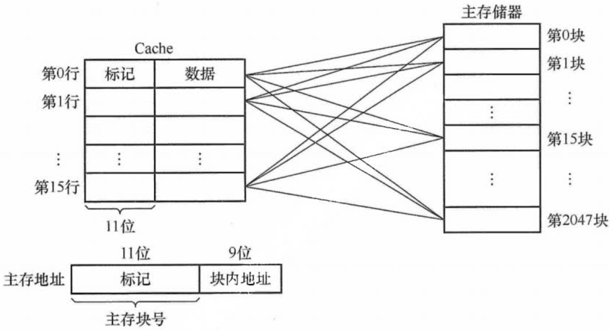

- [计算机组成原理](#计算机组成原理)
  - [幼稚错误](#幼稚错误)
    - [一、运算符号相关](#一运算符号相关)
    - [二、运算步骤相关](#二运算步骤相关)
  - [第一章 计算机系统概述](#第一章-计算机系统概述)
    - [1.1 计算机发展历程](#11-计算机发展历程)
      - [1.1.1 计算机硬件的发展](#111-计算机硬件的发展)
      - [1.1.2 计算机软件的发展](#112-计算机软件的发展)
    - [1.2 计算机系统层级结构](#12-计算机系统层级结构)
      - [1.2.1 计算机系统的组成](#121-计算机系统的组成)
      - [1.2.2 计算机硬件](#122-计算机硬件)
      - [1.2.3 计算机软件](#123-计算机软件)
      - [1.2.4 计算机系统的层次结构](#124-计算机系统的层次结构)
      - [1.2.5 计算机系统的工作原理](#125-计算机系统的工作原理)
        - [例题：完整的计算机系统](#例题完整的计算机系统)
        - [例题：CPU 区分指令和数据的依据](#例题cpu-区分指令和数据的依据)
    - [1.3 计算机的性能指标](#13-计算机的性能指标)
      - [1.3.1 计算机的主要性能指标](#131-计算机的主要性能指标)
      - [1.3.2 几个专业术语](#132-几个专业术语)
        - [例题：CPI 跟存储器存取延迟无关](#例题cpi-跟存储器存取延迟无关)
        - [例题：XX 位处理器和 XX 位操作系统](#例题xx-位处理器和-xx-位操作系统)
  - [第二章 数据的表示和运算](#第二章-数据的表示和运算)
    - [2.1 数制与编码](#21-数制与编码)
      - [2.1.1 进位计数制及其相互转换](#211-进位计数制及其相互转换)
      - [2.1.2 BCD 码](#212-bcd-码)
      - [2.1.3 定点数的编码表示](#213-定点数的编码表示)
        - [例题：模 4 补码辨析](#例题模-4-补码辨析)
      - [2.1.4 整数的表示](#214-整数的表示)
        - [例题：注意 0](#例题注意-0)
        - [例题：使用真值判断溢出](#例题使用真值判断溢出)
      - [2.1.5 ASCII 码和奇偶校验码](#215-ascii-码和奇偶校验码)
    - [2.2 运算方法和运算电路](#22-运算方法和运算电路)
      - [2.2.1 基本运算部件](#221-基本运算部件)
        - [例题：溢出判别电路](#例题溢出判别电路)
      - [2.2.2 定点数的移位运算](#222-定点数的移位运算)
      - [2.2.3 定点数的加减运算](#223-定点数的加减运算)
      - [2.2.4 定点数的乘除运算](#224-定点数的乘除运算)
      - [2.2.5 C 语言中的整数类型及类型转换](#225-c-语言中的整数类型及类型转换)
      - [2.2.6 数据的存储和排列](#226-数据的存储和排列)
        - [例题：小端方式/大端方式与数据的每个数据项之间的顺序无关](#例题小端方式大端方式与数据的每个数据项之间的顺序无关)
    - [2.3 浮点数的表示与运算](#23-浮点数的表示与运算)
      - [2.3.1 浮点数的表示](#231-浮点数的表示)
      - [2.3.2 浮点数的加减运算](#232-浮点数的加减运算)
        - [例题：有效数位越多，精度越高](#例题有效数位越多精度越高)
        - [例题：对阶和右规格化时都会发生舍入](#例题对阶和右规格化时都会发生舍入)
        - [例题：浮点数加减法和 IEEE 754 标准的浮点数的加减法辨析](#例题浮点数加减法和-ieee-754-标准的浮点数的加减法辨析)
        - [例题：阶码部件在乘除运算时只进行加、减操作](#例题阶码部件在乘除运算时只进行加减操作)
        - [例题：机器零](#例题机器零)
  - [第三章 存储系统](#第三章-存储系统)
    - [3.1 存储器概述](#31-存储器概述)
      - [3.1.1 存储器的分类](#311-存储器的分类)
      - [3.1.2 存储器的性能指标](#312-存储器的性能指标)
      - [3.1.3 多级层次的存储系统](#313-多级层次的存储系统)
    - [3.2 主存储器](#32-主存储器)
      - [3.2.1 SRAM 芯片和 DRAM 芯片](#321-sram-芯片和-dram-芯片)
      - [3.2.2 只读存储器](#322-只读存储器)
      - [3.2.3 主存结构](#323-主存结构)
      - [3.2.4 多模块存储器](#324-多模块存储器)
        - [例题：低位交叉存储器的计算](#例题低位交叉存储器的计算)
    - [3.3 主存储器与 CPU 的连接](#33-主存储器与-cpu-的连接)
      - [3.3.1 连接原理](#331-连接原理)
        - [例题：MAR 的位数跟虚存有关，跟主存无关](#例题mar-的位数跟虚存有关跟主存无关)
      - [3.3.2 主存容量的扩展](#332-主存容量的扩展)
      - [3.3.3 存储芯片的地址分配和片选](#333-存储芯片的地址分配和片选)
        - [例题：看地址线个数判断片选位数](#例题看地址线个数判断片选位数)
      - [3.3.4 存储器与 CPU 的连接](#334-存储器与-cpu-的连接)
        - [例题：DRAM 芯片中存储阵列的行数和列数](#例题dram-芯片中存储阵列的行数和列数)
    - [3.4 外部存储器](#34-外部存储器)
      - [3.4.1 磁盘存储器](#341-磁盘存储器)
      - [3.4.2 光盘存储器](#342-光盘存储器)
      - [3.4.3 固态硬盘](#343-固态硬盘)
    - [3.5 高速缓冲存储器](#35-高速缓冲存储器)
      - [3.5.1 程序访问的局部性原理](#351-程序访问的局部性原理)
      - [3.5.2 Cache 的基本工作原理](#352-cache-的基本工作原理)
      - [3.5.3 Cache 和主存的映射方式](#353-cache-和主存的映射方式)
        - [例题：根据 Cache 块的数据部分的大小对主存块分块](#例题根据-cache-块的数据部分的大小对主存块分块)
        - [例题：蒋本珊教材中的组相联映射](#例题蒋本珊教材中的组相联映射)
      - [3.5.4 Cache 中主存块的替换算法](#354-cache-中主存块的替换算法)
      - [3.5.5 Cache 写策略](#355-cache-写策略)
        - [例题：注意每次写直通至少访问一次主存](#例题注意每次写直通至少访问一次主存)
    - [3.6 虚拟存储器](#36-虚拟存储器)
      - [3.6.1 虚拟存储器的基本概念](#361-虚拟存储器的基本概念)
      - [3.6.2 页式虚拟寄存器](#362-页式虚拟寄存器)
      - [3.6.3 段式虚拟寄存器](#363-段式虚拟寄存器)
      - [3.6.4 段页式寄存器](#364-段页式寄存器)
      - [3.6.5 虚拟存储器与 Cache 的比较](#365-虚拟存储器与-cache-的比较)
  - [第四章 指令系统](#第四章-指令系统)
    - [4.1 指令格式](#41-指令格式)
      - [4.1.1 指令的基本格式](#411-指令的基本格式)
      - [4.1.2 定长操作码指令格式](#412-定长操作码指令格式)
      - [4.1.3 拓展操作码指令格式](#413-拓展操作码指令格式)
        - [例题：定长操作码需要用同一类操作码表达所有类型的指令](#例题定长操作码需要用同一类操作码表达所有类型的指令)
      - [4.1.4 指令的操作类型](#414-指令的操作类型)
        - [例题：条件转移指令的转移条件](#例题条件转移指令的转移条件)
    - [4.2 指令的寻址方式](#42-指令的寻址方式)
      - [4.2.1 指令寻址和数据寻址](#421-指令寻址和数据寻址)
      - [4.2.2 常见的数据寻址方式](#422-常见的数据寻址方式)
        - [例题：缩短指令中某个地址段的位数](#例题缩短指令中某个地址段的位数)
        - [例题：寻址方式快慢](#例题寻址方式快慢)
        - [例题：注意指令本身的长度](#例题注意指令本身的长度)
        - [例题：注意 PC/分支跳转指令的偏移量的单位](#例题注意-pc分支跳转指令的偏移量的单位)
        - [例题：分析指令的寻址方式特点](#例题分析指令的寻址方式特点)
        - [例题：注意编址单位不一定是字节](#例题注意编址单位不一定是字节)
    - [4.3 程序的机器级代码表示](#43-程序的机器级代码表示)
      - [4.3.1 常用汇编指令介绍](#431-常用汇编指令介绍)
      - [4.3.2 过程调用的机器级表示](#432-过程调用的机器级表示)
      - [4.3.3 选择语句的机器级表示](#433-选择语句的机器级表示)
      - [4.3.4 循环语句的机器级表示](#434-循环语句的机器级表示)
    - [4.4 CISC 和 RISC 的基本概念](#44-cisc-和-risc-的基本概念)
      - [4.4.1 复杂指令集计算机 CISC](#441-复杂指令集计算机-cisc)
      - [4.4.2 精简指令集计算机 RISC](#442-精简指令集计算机-risc)
        - [例题：RISC 不是为了兼容 CISC](#例题risc-不是为了兼容-cisc)
  - [第五章 中央处理器](#第五章-中央处理器)
    - [5.1 CPU 的功能和基本结构](#51-cpu-的功能和基本结构)
      - [5.1.1 CPU 的功能](#511-cpu-的功能)
      - [5.1.2 CPU 的基本结构](#512-cpu-的基本结构)
    - [5.2 指令执行过程](#52-指令执行过程)
      - [5.2.1 指令周期](#521-指令周期)
        - [例题：存取周期的定义](#例题存取周期的定义)
        - [例题：字长与周期](#例题字长与周期)
      - [5.2.2 指令周期的数据流](#522-指令周期的数据流)
        - [例题：单周期处理器](#例题单周期处理器)
      - [5.2.3 指令执行方案](#523-指令执行方案)
    - [5.3 数据通路的功能和基本结构](#53-数据通路的功能和基本结构)
      - [5.3.1 数据通路的功能](#531-数据通路的功能)
      - [5.3.2 数据通路的基本结构](#532-数据通路的基本结构)
    - [5.4 控制器的功能和工作原理](#54-控制器的功能和工作原理)
      - [5.4.1 控制器的结构和功能](#541-控制器的结构和功能)
        - [例题：取指令操作与操作码无关](#例题取指令操作与操作码无关)
      - [5.4.2 硬布线控制器](#542-硬布线控制器)
      - [5.4.3 微程序控制器](#543-微程序控制器)
        - [例题：微程序控制存储器的位置](#例题微程序控制存储器的位置)
        - [例题：用于判断外部条件的判断测试字段的位数 = 外部条件的个数](#例题用于判断外部条件的判断测试字段的位数--外部条件的个数)
    - [5.5 异常与中断机制](#55-异常与中断机制)
    - [5.6 指令流水线](#56-指令流水线)
      - [5.6.1 指令流水线的基本概念](#561-指令流水线的基本概念)
      - [5.6.2 流水线的基本实现](#562-流水线的基本实现)
      - [5.6.3 流水线的冒险与处理](#563-流水线的冒险与处理)
        - [例题：ID 被 WB 堵塞](#例题id-被-wb-堵塞)
        - [例题：下一条指令的 IF 必须和上一条指令的 ID 并行](#例题下一条指令的-if-必须和上一条指令的-id-并行)
      - [5.6.4 流水线的性能指标](#564-流水线的性能指标)
      - [5.6.5 高级流水线技术](#565-高级流水线技术)
        - [例题：动态流水线的定义](#例题动态流水线的定义)
        - [例题：并行部件](#例题并行部件)
    - [5.7 多处理器的基本概念](#57-多处理器的基本概念)
      - [5.7.1 SISD、SIMD、MIMD 的基本概念](#571-sisdsimdmimd-的基本概念)
      - [5.7.2 硬件多线程的基本概念](#572-硬件多线程的基本概念)
      - [5.7.3 多核处理器的基本概念](#573-多核处理器的基本概念)
      - [5.7.4 共享内存多处理器的基本概念](#574-共享内存多处理器的基本概念)
  - [第六章 总线](#第六章-总线)
    - [6.1 总线概述](#61-总线概述)
      - [6.1.1 总线基本概念](#611-总线基本概念)
      - [6.1.2 总线的分类](#612-总线的分类)
        - [例题：地址线的功能](#例题地址线的功能)
      - [6.1.3 系统总线的结构](#613-系统总线的结构)
        - [例题：局部总线的作用](#例题局部总线的作用)
      - [6.1.4 常见的总线标准](#614-常见的总线标准)
      - [6.1.5 总线的性能指标](#615-总线的性能指标)
        - [例题：多通道存储器的带宽的计算](#例题多通道存储器的带宽的计算)
    - [6.2 总线事务和定时](#62-总线事务和定时)
      - [6.2.1 总线事务](#621-总线事务)
      - [6.2.2 同步定时方式（同步通信）](#622-同步定时方式同步通信)
      - [6.2.3 异步定时方式（异步通信）](#623-异步定时方式异步通信)
        - [例题：请求应答就叫做按需](#例题请求应答就叫做按需)
        - [例题：猝发传输需要一个周期传送地址](#例题猝发传输需要一个周期传送地址)
        - [例题：“每次访问的初始化”是“每访问一个字的初始化”](#例题每次访问的初始化是每访问一个字的初始化)
  - [第七章 输入/输出系统](#第七章-输入输出系统)
    - [7.1 I/O 系统基本概念](#71-io-系统基本概念)
      - [7.1.2 I/O 控制方式](#712-io-控制方式)
      - [7.1.3 外部设备](#713-外部设备)
    - [7.2 I/O 接口](#72-io-接口)
      - [7.2.1 I/O 接口的功能](#721-io-接口的功能)
      - [7.2.2 I/O 接口的基本结构](#722-io-接口的基本结构)
        - [例题：磁盘驱动不是 I/O 接口](#例题磁盘驱动不是-io-接口)
        - [例题：I/O 指令实现的数据传送](#例题io-指令实现的数据传送)
      - [7.2.3 I/O 接口的类型](#723-io-接口的类型)
      - [7.2.4 I/O 端口及其编址](#724-io-端口及其编址)
        - [例题：I/O 地址的位置](#例题io-地址的位置)
    - [7.3 I/O 方式](#73-io-方式)
      - [7.3.1 程序查询方式](#731-程序查询方式)
      - [7.3.2 程序中断方式](#732-程序中断方式)
        - [例题：中断请求计算](#例题中断请求计算)
        - [例题：中断服务序列绘制](#例题中断服务序列绘制)
      - [7.3.3 DMA 方式](#733-dma-方式)

# 计算机组成原理

## 幼稚错误

### 一、运算符号相关

### 二、运算步骤相关

1.按字节编址的计算机中，某 double 型数组 A 的首地址为 2000H，使用变址寻址和循环结构访问数组 A，保存数组下标的变址寄存器初值为 0，每次循环取一个数组元素，其偏移地址为变址值乘以 sizeof(double)，取完后变址寄存器内容自动加 1。若某次循环所取元素的地址为 2100H，则进入该次循环时变址寄存器的内容是（）

A. 25

B. 32

C. 64

D. 100

答案：B

地址 2100H - 2000H = 16^2 = 256B，每个 double 是 8 个字节，所以 256/8 = 32

关键在于 100H/0008H 不是 12.5H 额啊啊啊啊

## 第一章 计算机系统概述

### 1.1 计算机发展历程

#### 1.1.1 计算机硬件的发展

发展阶段|时间|逻辑元件|速度（次/秒）|内存|外存|编程语言|操作系统
:-----:|:--:|:------:|:----------:|:--:|:--:|:--:|:--:
第一代|1946-1957|电子管|几千-几方|汞延迟线、磁鼓|穿孔卡片、纸带|纸带磁带编程</br>机器语言||
第二代|1958-1964|晶体管|几万-几干万|磁芯存储器|磁带|开始出现了高级语言 (FORTRAN)</br>及其编译程序|有了操作系统的雏形|
第三代|1964-1971|中小规模集成电路|几十万-几百万|半导体存储器|磁带、磁盘|高级语言发展迅速|开始有了分时操作系统|
第四代|1972-现在|大规模、超大规模集成电路|上千万-万亿|半导体存储器|磁盘、磁带、光盘、半导体存储器||CPU, PC 出现</br>并行、流水线、高速缓存、虚拟存储器出现|

#### 1.1.2 计算机软件的发展

+ 机器语言：唯一可以被计算机识别和执行的语言

+ 汇编语言：必须经过汇编程序的翻译

+ 高级语言：转换为汇编程序或直接翻译为机器语言

### 1.2 计算机系统层级结构

#### 1.2.1 计算机系统的组成

+ 硬件

+ 软件

对某一功能来说，其既可以用软件实现，又可以用硬件实现，则称为软硬件在逻辑上是等效的

#### 1.2.2 计算机硬件

**1.计算机的分类**

电子计算机分为

+ 电子模拟计算机

+ 电子数字计算机

  + 专用计算机

  + 通用计算机：巨型机、大型机、中型机、小型机、微型机、单片机

按指令和数据流分为

+ 单指令流和单数据流系统（SISD）

    即传统冯·诺依曼体系结构

    有些 SISD 采用指令顺序执行，有些采用指令流水线执行

+ 单指令流和多数据流系统（SIMD）

    包括阵列处理器和向量处理器系统

    每个处理单元都有自己的地址寄存器，这样每个单元就有不同的数据地址，因此可以并行处理数据

    向量处理器系统直接操作一维数组（向量）

+ 多指令流和单数据流系统（MISD）

    具有 n 个处理单元，按 n 条不同指令的要求对同一数据流及其中间结果进行不同的处理
    
    一个处理单元的输出又作为另一个处理单元的输入

    这种计算机尚不存在，近似例子为流水线结构处理同一条数据

+ 多指令流和多数据流系统（MIMD）

    包括多处理器和多计算机系统

    多处理器：多个处理器共享单一地址空间

    多计算机：多个完整计算机，通过消息传递进行通信

**2.冯·诺依曼体系结构**

1. 计算机由五大部件组成

   + 输入设备：将信息转换成机器能识别的形式

   + 存储器：存放数据和程序

   + 运算器：算术运算和逻辑运算

        包括算术逻辑单元（ALU）、累加器、状态寄存器、通用寄存器

   + 控制器：协调其他部件与解析存储器中的程序或指令

        包括程序计数器、指令寄存器、指令译码器、时序产生器和操作控制器

        基本工作方式：控制流驱动方式

   + 输出设备：将结果转换为人类熟悉的形式

2. 指令和数据以同等地位存于存储器，可按地址寻访

3. 指令和数据用二进制表示

4. 指令由操作码（指令序列号，用来表示处理的指令）和地址码（操作数据存储的地址）组成

5. 存储程序：指将指令以二进制代码的形式事先输入计算机的主存储器，然后按其在存储器中的首地址执行程序的第一条指令，以后就按该程序的规定顺序执行其他指令，直至程序执行结束

6. 以运算器为中心：输入/输出设备与存储器之间的数据传送通过运算器完成

**3.现代计算机结构**

1. 计算机由两个部分组成

   + 主机

     + CPU

       + 运算器

       + 控制器

     + 主存

   + I/O 设备

     + 辅存

     + 输入设备

     + 输出设备

2. 以存储器为中心

**4.计算机的功能部件**

+ I/O设备

    + 输入设备：将程序和数据以机器所能识别和接受的信息形式输入计算机

    + 输出设备：将计算机处理的结果以人们所能接受的形式或其他系统所要求的信息形式输出

+ 存储器

    用于存放程序和数据

    分为主存和辅存，CPU 直接访问主存，只有调入主存才能被 CPU 访问

    存储器结构：

    + 存储体
    
        存储数据的主体，按地址存取（相联存储器按内容访存）

    + MAR (Memory Address Register) 存储地址寄存器
    
        用于访存地址，经过存放地址译码后所选的存储单元
        
        MAR 位数反映存储单元个数的幂值，与PC（程序计数器）长度相等（因为都是指向内存地址），如 MAR 有 10 位，则有 2^{10}=1024个存储单元

    + MDR (Memory Data Register) 存储数据寄存器
    
        用于暂存要从存储器中读或写的信息
        
        MDR 位数 = 存储字长，一般为字节的二次幂的整数倍

        （存储字长不等于数据字长，数据字长是数据总线一次性传输的信息位数）

    + 时序控制逻辑：产生存储器操作时所需的各种时序信号

    存储器相关概念：

    + 现代 MAR 和 MDR 被划分进入了 CPU

    + 存储单元：每个存储单元存放一串二进制代码

    + 存储字（word）：存储单元中二进制代码的组合，即一个存储元存放的数据

    + 存储字长：存储单元中二进制代码的位数，为 1B 或字节的偶数倍

    + 存储元：即存储二进制的电子元件，每个存储元可存储 1bit

    寄存器和高速缓冲寄存器 Cache 都集成在 CPU上，离 CPU 越近速度越快，所以存取速度上寄存器 > Cache > 内存

    CPU 包括运算器和控制器，不包括存储器（存储器不同于寄存器）

    相联存储器既可以按地址寻址又可以**按内容（通常是某些字段）寻址**

+ 运算器

    用于算术运算和逻辑运算

    + ALU：算术逻辑单元，是核心单元，通过内部复杂的电路实现算数运算、逻辑运算

    + ACC：累加器，用于存放操作数，或运算结果

    + MQ：乘商寄存器，在乘、除运算时，用于存放操作数或运算结果

    + X：操作数寄存器，通用的操作数寄存器，用于存放操作数

    + PSW：程序状态寄存器，也称标志寄存器，用于存放ALU运算得到的一些标志信息或处理机的状态信息，如结果是否溢出、有无产生进位或借位、结果是否为负等

    + 还有变址寄存器（IX），主要用于存放存储单元在段内的偏移量，基址寄存器（BR），用来存放操作数或中间结果，以减少对存储器的访问次数的数据寄存器

    这些都不一定具备

    &nbsp;|加|减|乘|除
    :-:|:-:|:-:|:-:|:-:
    ACC|被加数、和|被减数、差|乘积高位|被除数、余数
    MQ|&nbsp;|&nbsp;|乘数、乘积低位|商
    X|加数|减数|被乘数|除数

+ 控制器

    + CU：控制单元，分析指令，给出控制信号

    + IR：指令寄存器，存放当前执行的指令，内容来自主存的 MDR

        指令中操作码 OP(IR) 送到 CU 分析指令并发出各种微操作命令序列，地址码 Ad(IR) 送到 MAR 来取操作数

    + PC：程序计数器，存放下一条要指令地址，取指后自动加 1（一条指令长度，不一定为 1）以形成下一条指令地址的功能，与主存 MAR 有直接通路


#### 1.2.3 计算机软件

**1.系统软件和应用软件**

+ 系统软件

    操作系统、数据库**管理**系统（!= 数据库系统）、语言处理程序、分布式软件系统、网络软件系统、标准库程序、服务性程序等

+ 应用软件

**2.三个级别的语言**

1. 机器语言 二进制代码语言

2. 汇编语言 单词缩写代替二进制 需要汇编程序翻译为机器语言

3. 高级语言 高级 -> 汇编 -> 机器 或直接 高级 -> 机器

+ 翻译程序：是指把高级语言源程序转换成机器语言程序（目标代码）的软件

    包括编译程序和解释程序

+ 编译程序：将高级语言编写的源程序全部语句一次全部翻译成目标机器语言程序，而后再执行机器语言程序（只需翻译一次） 如 C 和 CPP 

+ 解释程序：**翻译一句执行一句**，不会形成目标程序文件 如 JS 和 Python

    一般比编译程序慢

+ 对于 Java 既可以编译也可以解释

**3.软件和硬件的逻辑功能等价性**

#### 1.2.4 计算机系统的层次结构

|||
|:---:|:---:|
|虚拟机器 M4</br>（高级语言机器）||
|虚拟机器 M3</br>（汇编语言机器）||
|虚拟机器 M2</br>（操作系统机器）|机器语言|
|:---:|软硬件交界面</br>划分不绝对|
|传统机器 M1</br>（用机器语言的机器）|微程序|
|微程序机器 M0</br>（微指令系统）|硬件直接执行微指令|

#### 1.2.5 计算机系统的工作原理

**1.“存储程序”工作方式**

1. 把程序和数据装入主存储器

2. 将源程序转成可执行问题

3. 从可执行文件的首地址开始逐条执行指令

完成一条指令


1. 取指令 PC -> MAR -> M -> MDR -> IR，同时 PC = PC + 1

2. 将指令放入 IR ，并分析指令 OP(IR) -> CU 

3. 调用 CU 协同执行指令 Ad(IR) -> MAR -> M -> MDR -> ACC 

**2.从源程序到可执行文件**

1. 预处理

    将头文件插入程序文件（文本）

2. 编译

    生成汇编程序（文本）

3. 汇编

    生成机器语言程序（可重定位目标程序）（二进制）

4. 链接

    将多个可重定位目标文件和标准库函数合并微一个可执行目标文件（二进制）

##### 例题：完整的计算机系统

1.完整的计算机系统应包括（）

A. 运算器、存储器、控制器

B. 外部设备和主机

C. 主机和应用程序

D. 配套的硬件设备和软件系统

答案：D

A 是计算机主机的组成部分

B、C 只涉及计算机系统的部分内容，都不完整

##### 例题：CPU 区分指令和数据的依据

2.冯诺依曼计算机中指令和数据均以二进制形式存放在存储器中，CPU 区分它们的依据是（）

A. 指令操作码的译码结果

B. 指令和数据的寻址方式

C. 指令周期的不同阶段

D. 指令和数据所在的存储单元

答案：C

取指令阶段：指令

执行阶段：数据

### 1.3 计算机的性能指标

#### 1.3.1 计算机的主要性能指标

**1.字长**

计算机进行一次整数运算（定点整数运算）所能处理的二进制数据的位数

一般等于内部寄存器的大小

通常选定为字节（8 位）的整数倍

决定计算机的精度

**2.数据通路带宽**

（外部）数据总线一次所能并行传送信息的位数

与 CPU 内部数据总线宽度（内部寄存器大小）有可能不同

**3.主存容量**

主存储器所能存储信息的最大容量

通常以字节为单位

也可以表示成 **字数*字长**

**4.运算速度**

**1)吞吐量和响应时间**

+ 吞吐量

    系统在单位时间内处理请求的数量

    主要取决于主存的存取周期

+ 响应时间

    从用户发送一个请求，到系统做出响应，到系统对该请求做出响应并获得它所需要的结果的等待时间

    通常包括 CPU 时间（运行一个程序所花费的时间）与等待时间（用于磁盘访问、存储器访问、I/O 操作、操作系统开销等时间）

**2)主频和 CPU 时钟周期**

+ CPU 时钟周期

    主频的倒数

    执行指令的每个动作至少需要 1 个时钟周期

+ 主频（CPU 时钟频率）

    机器内部主时钟的频率

**3)CPI Clock cycle Per Instruction**

执行一条指令所需的时钟周期数

是一个平均值

**指令 != 操作系统的命令**

**4)CPU 执行时间**

CPU 执行时间 = CPU 时钟周期数/主频 = (指令条数*CPI)/主频

**5)IPS instruction/s**

MIPS 10e6 instruction/s

MFLOPS 10e6 float-point op/s

GFLOPS 10e9 float-point op/s

TFLOPS 10e12 float-point op/s

PFLOPS 10e15 float-point op/s

EFLOPS 10e18 float-point op/s

ZFLOPS 10e21 float-point op/s

**5.基准程序**

不一定准，因为可能对基准程序所用的短代码特殊优化

#### 1.3.2 几个专业术语

1.系列机

2.兼容

指计算机软件或硬件的通用性，通常在**同一系列不同型号**的计算机间通用

3.软件可移植性

4.固件

将程序固化在 ROM 中组成的部件成为固件

##### 例题：CPI 跟存储器存取延迟无关

1.某工作站采用时钟频率 f = 15 MHz、处理速率 = 10 MIPS 的处理机来执行一个已知混合程序。假定该混合型程序平均每条指令需要 1 次访存，且每次存储器存取为 1 周期延迟，试问此计算机的有效 CPI 是（）

A. 2.5

B. 2

C. 1.5

D. 1

答案：C

CPI colck per instruction

f colck per s

MIPS 10^6 instruction per s

所以 CPI = 15/10 = 1.5

这里的存储器延迟为干扰项

##### 例题：XX 位处理器和 XX 位操作系统

2.下列关于配备 32 位微处理器的计算机的说法中正确的是（）

A. 该机器的通用寄存器一般为 32 位

B. 该机器的地址总线宽度为 32 位

C. 该机器能支持 64 位操作系统

D. 一般来说，64 位微处理器的性能比 32 位微处理器的高

答案：A

微处理器的位数是指该 CPU 一次能够处理的数据长度，称为机器字长

机器字长通常等于通用寄存器的长度，故 A 正确

地址总线的宽度一般情况下也会和处理器的位数挂钩，但是也不一定，一些机器为了一些原因也可以把地址总线设为小于 32 位，然后分几个周期传送一次地址，故 B 错误

低位数的 CPU 不能运行高位数的操作系统，故 C 错误

微处理器的性能还与时钟频率有关，故 D 错误

> 32 位操作系统指该操作系统最多可以寻址 2^32 个地址，即 4 G 个地址，是软件的概念
>
> （由于一些原因，比如 I/O 的统一编址等，所以实际上不到 4 G，一般约为 3.7 G）
>
> 32 位处理器是指 CPU 一次可以同时处理 32 位数据，是 CPU 设计时就决定好的，是硬件的概念

> 低位数的 CPU 不能运行高位数的操作系统，高位数的 CPU 可以运行低位数的操作系统

## 第二章 数据的表示和运算

### 2.1 数制与编码

#### 2.1.1 进位计数制及其相互转换

所有信息用二进制编码

1) 用两个稳定状态的物理器件就可以表示二进制数的每一位，制造成本低

2) 1 0 与 真 假 对应，方便逻辑判断

3) 二进制的编码和运算规则简单

**1.进位计数法**

r 进制，则“逢 r 进 1”

**2.不同进制数之间的相互转换**

1. 2^r1 进制转化为 2^r2 进制

2. 任意进制数转换为十进制数

    按权展开相加法

3. 十进制数转换为任意进制数

    基数乘除法 
    
    对整数部分用除基取余法 对小数部分用乘基取整法 最后将整数部分与小数部分的转换结果拼接起来

**3.真值和机器数**

真值是机器数所代表的实际值

#### 2.1.2 BCD 码

用 4 位二进制数表示 0~10 的十进制数

一定冗余 2^4 - 10 = 6 个组合

1. 8421 码（常用）

    按权展开相加法表示十进制，权值由高到底 8, 4, 2, 1

    相加之和大于 $(1010)_2$ 即 $(10)_{10}$ 时，要加 6 修正（跳过 6 个无效码）

2. 余 3 码

    每个数都比 8421 码大 3

3. 2421 码

    按权展开相加法表示十进制，权值由高到底 2, 4, 2, 1

    大于等于 5 的 2421 码的最高位为 1，小于 5 的最高位为 0

#### 2.1.3 定点数的编码表示

**1.机器数的定点表示**

1. 定点小数（纯小数）

    小数点在符号位之后

2. 定点整数（纯整数）

    小数点在有效数值部分最低位之后

**2.原码、补码、反码、移码**

以下设字长 n+1 位

原码：(符号位, 真值) 符号位为 0 为正，1 为负

反码：符号位为 0，则为原码；符号位为 1，则为原码其余位取反

补码：符号为为 0，则为原码；符号位为 1，则为反码 + 1

移码：真值上加一个常数，一般是 2^n

变形补码（模 4 补码）：用双符号位 00 表示正，11 表示负，其余与补码相同

**3.特点**

1. 0 的表示

    原码、反码在数轴上对称，则存在 +0 和 -0 两种表示

    补码、移码在数轴上不对称，则 0 只有一种表示

2. 数的范围

    因为补码的 0 只有一种表示，就是 0.00...

    那么 1.00... 就空了出来

    为了利用这个数，定义其为最小负数，即 -2^n

##### 例题：模 4 补码辨析

1.关于模 4 补码，下列说法正确的是（）

A. 模 4 补码和模 2 补码不同，它更容易检查乘除运算中的溢出问题

B. 每个模 4 补码存储时只需一个符号位

C. 存储每个模 4 补码需要两个符号位

D. 模 4 补码，在算术与逻辑部件中为一个符号位

答案：B

模 4 补码更容易检查加减运算中的溢出问题

正确的数值的模 4 补码的两个符号位相同，因此只需要存储一个符号位

模 4 补码只在 ALU 中采用双符号位

#### 2.1.4 整数的表示

**1.无符号整数的表示**

没有符号位的二进制数

可用于表示地址，指针

**2.带符号整数的表示**

##### 例题：注意 0

1.设 x 为真值，x* 为其绝对值，满足 $[-x*]_补 = [-x]_补 $，当且仅当（）

A. x 任意

B. x 为正数

C. x 为负数

D. 以上说法都不对

答案：D

注意 0

##### 例题：使用真值判断溢出    

2.下列为 8 位移码机器数 $[x]_移 $，求 $[-x]_移 $ 时，（）将会发生溢出

A. 1111 1111

B. 0000 0000

C. 1000 0000

D. 0111 1111

答案：B

B 对应 8 位最小的值 -128 而 -x = 128 将发生溢出，因此无法表示其移码

可见，移码 = 补码 + 2^n 即移码 = 补码的符号位取反

> 计算机在字长足够的情况下能够精确地表示每个数吗？若不能，请举例
> 
> 计算机采用二进制来表示数据，在字长足够时，可以表示任何一个整数
> 
> 而二进制表示小数时只能够用 (1/2)^n 的和的任意组合表示，即使字长很长，也不可能精确表示出所有小数，只能无限接近
> 
> 例如 0.1 无法用二进制精确表示

#### 2.1.5 ASCII 码和奇偶校验码

ASCII 码 7 位

前面可以添加一位奇偶校验码：奇校验码使整个码串中 1 的个数为奇数，偶校验码使整个码串中 1 的个数为偶数

### 2.2 运算方法和运算电路

#### 2.2.1 基本运算部件

**1.一位全加器**


**2.串行进位加法器**


最长运算时间有进位信号的传递时间决定

求和延迟为次要因素

**3.并行进位加法器（全先行进位加法器）**


**1)原理**

令进位产生函数 $G_i = A_i B_i$，进位传递函数 $P_i = A_i ⊕ B_i$

则全加器的进位表达式是

$C_1 = G_1 + P_1 C_0$

$C_2 = G_2 + P_2 C_1 = G_2 + P_2 G_1 + P_2 P_1 C_0$

$C_3 = G_3 + P_3 C_2 = G_3 + P_3 G_2 + P_3 P_2 G_1 + P_3 P_2 P_1 C_0$

$C_4 = G_4 + P_4 C_3 = G_4 + P_4 G_3 + P_4 P_3 G_2 + P_4 P_3 P_2 G_1 + P_4 P_3 P_2 P_1 C_0$

可见 $C_i$ 仅与 $A_i, B_i$ 及最低进位 $C_0$ 有关

只要 $A_1 \sim A_4, B_1 \sim B_4$ 和 $C_0$ 同时到达，就可以几乎同时形成 $C_1 \sim C_4$，并同时形成 $S_1 \sim S_4$

**2)更多位数**

随着位数的增加，$C_i$ 的逻辑表达式也越来越长，因此位数较多时采用并行进位加法器是不现实的

可以将更多位数的加法分组

如一组 4 位，则组内可以使用并行进位加法；组间可以使用串行也可以并行


**4.带标志加法器**


在该图中每一位的和不再叫 $S_i$ 而是 $F_i$

零标志 ZF：所有位的和 $F_i$ 都为 0 的时候才为 1，否则为 0

溢出位 OF = $C_n ⊕ C_{n-1}$ 对无符号数运算无意义

符号位 SF = 最高位的和 $F_{n-1}$ 对无符号数运算无意义

进/借位 CF = $C_{in} ⊕ C_{out}$ 只能判断无符号数的溢出情况

为了加快加法运算的速度，实际电路一定使用多级先行进位，该图只是一种简化画法

**5.算数逻辑单元 (ALU)**


ALU 的核心是带标志加法器

加、减、乘、除运算最后都能归结为加法运算

也可以进行 与 或 非 移位

##### 例题：溢出判别电路

1.在定点运算器中，无论是采用双符号位还是采用单符号位，必须有（）

A. 译码电路，它一般用“与非”门来实现

B. 编码电路，它一般用“或非”门来实现

C. 溢出判断电路，它一般用“异或”门来实现

D. 移位电路，它一般用“与或非”门来实现

答案：C

三种溢出判别方式，均须有溢出判别电路，可用“异或”门来实现

#### 2.2.2 定点数的移位运算

**1.算术移位**

操作数视为有符号数

<table>
    <tr>
        <td align = center></td>
        <td align = center>码制</td>
        <td align = center>添补代码</td>
    </tr>
    <tr>
        <td align = center>正数</td>
        <td align = center>原码、补码、反码</td>
        <td align = center>0</td>
    </tr>
    <tr>
        <td align = center rowspan = 4>负数</td>
        <td align = center>原码</td>
        <td align = center>0</td>
    </tr>
    <tr>
        <td align = center rowspan = 2>补码</td>
        <td align = center>左移添 0</td>
    </tr>
    <tr>
        <td align = center>右移添 1</td>
    </tr>
    <tr>
        <td align = center>反码</td>
        <td align = center>1</td>
    </tr>
</table>

本质：补码由低位到高位找第一个 1，其左边与与反码相同，其右边与原码相同

**2.逻辑移位**

操作数视为无符号数

逻辑右移：高位补 0，低位舍弃

逻辑左移：低位补 0，高位舍弃

**3.循环移位**


进位位 CF：保存计算是否进位

1 代表产生进位， 0 代表未产生进位

带 CF 就是大循环，不带 CF 的就是小循环

不论带不带 CF 进行循环移位，都把 CF 记为最高位

即结构为 (CF, 数值位)

循环右移：将最低位的一位移出放到最高位，其余右移一位

循环左移：将最高位的一位移出放到最低位，其余左移一位

带进位位的循环左移：需要加上进位位数值的循环左移

带进位位的循环右移：需要加上进位位数值的循环右移

适合将数据的低字节数据和高字节数据互换

#### 2.2.3 定点数的加减运算

注意机器字长，若溢出则将溢出位丢弃

减法的减数取反转化为加法

**1.原码的加法**

同号：绝对值相加，符号不变

异号：绝对值大的减绝对值小的，符号取绝对值大的数的符号

**2.补码的加法**

直接相加

符号位也参与运算

**3.补码加减运算电路**


sub 输入到 MUX，以控制输入原码  y  还是反码 $ \overline{y} $

同时又输入到 $C_{in}$ 

这两步就实现了加法时 sub = 0，计算 x + y，减法时 sub = 1，计算 $x + \overline{y} + 1$

**4.补码加法的溢出判断**

小于最小值就是下溢

只有负数+负数才会下溢得到正数

大于最大值就是上溢

只有正数+正数才会上溢得到负数

对于小数，其绝对值小于等于 1

<table>
    <tr>
        <td align = center colspan = 2>判断方法</td>
        <td align = center colspan = 2>内容</td>
    </tr>
    <tr>
        <td align = center rowspan = 4>采用一位符号位</td>
        <td align = center rowspan = 2>根据符号位判断</td>
        <td align = center rowspan = 2>若两个操作数同号，那么：</br>若结果的符号与原操作数不同，则表明溢出</td>
        <td align = center>上溢：原操作数为正</td>
    </tr>
    <tr>
        <td align = center>下溢：原操作数为负</td>
    </tr>
    <tr>
        <td align = center rowspan = 2>根据数据位进位情况判断</td>
        <td align = center rowspan = 2>符号位的进位与最高数值位的进位不同，则表明溢出</br>与根据符号位判断的原理相同</td>
        <td align = center>上溢：符号位的进位 = 0</br>最高数值位的进位 = 1</td>
    </tr>
    <tr>
        <td align = center>下溢：符号位的进位 = 1</br>最高数值位的进位 = 0</td>
    </tr>
    <tr>
        <td align = center colspan = 2 rowspan = 2>采用双符号位</td>
        <td align = center rowspan = 2>两个加数的符号位只有一位，结果的符号位有两位</br>若两个符号位不同，则表示溢出</br>第一个符号位表示应该得到的符号位，第二个符号位代表实际得到的符号位</td>
        <td align = center>上溢：双符号位 = 01</td>
    </tr>
    <tr>
        <td align = center>下溢：双符号位 = 10</td>
    </tr>
</table>

**3.模二加减法**

不带进位借位的加减法

#### 2.2.4 定点数的乘除运算

**1.符号扩展**

防止溢出的一个方法就是将短数据扩展为长数据，把数据全部拓展为等长

（正数补码全部补 0，负数补码高位补 1 低位补 0）

<table>
    <tr>
        <td align = center></td>
        <td align = center>添加新位的位置</td>
        <td align = center colspan = 3>填充位</td>
    </tr>
    <tr>
        <td align = center rowspan = 4>整数的符号扩展</td>
        <td align = center rowspan = 4>在原符号位和数值位中间添加新位</td>
        <td align = center colspan = 2>正数</td>
        <td align = center>0</td>
    </tr>
    <tr>
        <td align = center rowspan = 3>负数</td>
        <td align = center>原码</td>
        <td align = center>0</td>
    </tr>
    <tr>
        <td align = center>反码</td>
        <td align = center>1</td>
    </tr>
    <tr>
        <td align = center>补码</td>
        <td align = center>1</td>
    </tr>
    <tr>
        <td align = center rowspan = 4>小数的符号扩展</td>
        <td align = center rowspan = 4>在最后面添加新位</td>
        <td align = center colspan = 2>正数</td>
        <td align = center>0</td>
    </tr>
    <tr>
        <td align = center rowspan = 3>负数</td>
        <td align = center>原码</td>
        <td align = center>0</td>
    </tr>
    <tr>
        <td align = center>反码</td>
        <td align = center>1</td>
    </tr>
    <tr>
        <td align = center>补码</td>
        <td align = center>0</td>
    </tr>
</table>

**2.定点数的乘法运算**

可以化归为累加和右移

部分积是乘法过程的中间结果，初值为 0

可能出现部分积大于 1 的情况，但此刻并非溢出，所以部分积和被乘数取双符号位，乘数取单符号位

设 $[X]_原 = x_s.x_1x_2...x_n, [Y]_原 = y_s.y_1y_2...y_n$

**1)原码一位乘法**

被乘数和乘数均取绝对值参加运算，看作无符号数，符号位为 $x_s ⊕ y_s$

i 从 n 到 1 循环：根据 $y_i$ 的值确定部分和的操作，然后部分积右移一位

|$y_i$|部分和|
|:---:|:---:|
|0|+ 0|
|1|+ X|

**2)无符号数乘法运算电路**


**3)补码一位乘法**

被乘数和乘数均为补码，符号位参与运算

乘数末位增设附加位 $y_{n+1} = 0$；$y_0$ 即 $y_s$

i 从 n 到 0 循环：根据 $y_i, y_{i+1}$ 的值确定部分和的操作，然后部分积右移一位

其中 i == 0 时部分积不用右移一位

|$y_i$|$y_{i+1}$|部分和|
|:---:|:---:|:---:|
|0|0|+ 0|
|0|1|+ $[X]_补 $|
|1|0|+ $[-X]_补 $|
|1|1|+ 0|

**4)补码乘法运算电路**


与无符号数乘法运算电路的区别在于补码是有符号数，不需要专门的进位位

**3.定点数的除法运算**

可以化归为累加和左移

部分余数是除法过程的中间结果，初值为 0

设 $[X]_原 = x_s.x_1x_2...x_n, [Y]_原 = y_s.y_1y_2...y_n$

要求被除数比除数小

因为如果被除数大于或等于除数，则商就大于或等于1，因而会产生溢出

判别溢出的方法是被除数减去除数，若差为正，就表示溢出

**1)手算除法**


1. 被除数比除数小，第一次上商为 0，作为符号位

2. 循环 n 步

    如果部分余数"够减" Y，那么上商为 1，否则上商为 0；商左移一位，余数右移一位

上商为 1 或 0 指的是给商的最低位赋值

**2)恢复余数法**

模仿手算除法

不知道每一次上商是 1 还是 0，也即不知道每一次是否“够减”

因此默认每一次上商都是 1，然后 `部分余数 = 部分余数 - Y`，如果得到负数，说明商在该位商不应该是 1 而应该是 0，那么补回来 `部分余数 = 部分余数 + Y`

缺点：恢复余数的步骤降低了执行速度，又使得控制电路变得复杂

**3)不恢复余数法（加减交替法）**

**3.1)原码除法运算**

> 够减的定义
> 
> 设 A, B 为原码
> 
> 计算 A - B = R，若 R 为正，则说明 A > B，即“够减”，上商为 1，否则上商为 0

计算步骤

1. 被除数减去除数（$+ [-|Y|]_补 $），若不溢出，一定得到负数的余数，故上商为 0，作为符号位，余数用于第一个循环的判断

2. 循环 n 步

    1. 若部分余数：
    
        为正，则商和部分余数都左移一位，部分余数 $+ [-|Y|]_补 $
    
        为负，则商和部分余数都左移一位，部分余数 $+ |Y|$

    2. 若所得的新的部分余数：

        为正，则上商为 1
    
        为负，则上商为 0

3. 特别地，在循环的最后一步，如果得到的新的部分余数为负，除了上商为 0 以外，还需要 $+ |Y|$ 得到正确的余数（余数余被除数同号）

    （就是说这个第 n 步循环到第二部分上商这里本来要结束了，这个 $+ |Y|$ 看上去像是第 n + 1 步循环的第一部分，但实际上没有第 n + 1 个循环了）

余数一共左移了 n 次，因此最后乘以 2^(-n) 才是真实的余数

**3.2)补码除法运算**

约定：

符号位参加运算，除数与被除数、商和余数均用补码表示

除数与被除数、余数使用双符号位，商使用单符号位

> 够减的定义
> 
> 被减数的绝对值大于减数的绝对值称为“够减”
> 
> 设 A, B 为补码
> 
> 1.若 A, B 同号，则计算 A - B = R，若 R 与 B：
> 
> 同号，则说明 |A| > |B|，即“够减”，上商为 1，下一轮仍然 - B，即计算 R - B = R_2
>
> 异号，则说明 |A| < |B|，即不“够减”，上商为 0，下一轮补回来 + B，即计算 R + B = R_2
>
> 2.若 A, B 异号，则计算 A + B = R，若 R 与 B：
> 
> 异号，则说明 |A| > |B|，即“够减”，上商为 0，下一轮仍然 + B，即计算 R + B = R_2
> 
> 同号，则说明 |A| < |B|，即不“够减”，上商为 1，下一轮补回来 - B，即计算 R - B = R_2
>
> 综上，不管 A, B 同号或异号，可以只看 R 与 B
>
> 若 R 与 B 同号，上商为 1，再计算 R - B = R_2，否则上商为 0，再计算 R + B = R_2
    
计算步骤：

1. 若被除数与除数同号，则被除数 $+ [-Y]_补 $，否则 $+ [Y]_补 $

2. 循环 n 步

    若部分余数与除数：

    同号，上商为 1，则商和部分余数都左移一位，部分余数 $+ [-Y]_补 $
    
    异号，上商为 0，商和部分余数都左移一位，部分余数 $+ [Y]_补 $

3. n 步循环上商 n 次，还少一位末位

    若对商的精度没有特殊要求，一般采用：商的末位恒置 1

余数一共左移了 n 次，因此最后乘以 2^(-n) 才是真实的余数

**4)除法运算电路**


#### 2.2.5 C 语言中的整数类型及类型转换

**1.有符号数和无符号数的转换**

强制类型转换的结果保持位值不变，仅改变了解释这些位的方式

**2.不同字长整数之间的转换**

大字长 -> 小字长：多余的高位截断，低位不变

小字长 -> 大字长：原数字是无符号整数则进行零扩展，即用零填充，否则进行符号扩展，即用原符号位填充

#### 2.2.6 数据的存储和排列

**1.数据的“大端方式”和“小端方式”存储**

访问内存时，从内存的低地址访问到高地址

存储数据时，以内存的低地址到高地址为右，数据从数据低位到数据高位，可以从左到右排列，也可以按从右到左排列

因此使用最低有效字节（LSB）和最高有效字节（MSB）来分别表示数的低位和高位

数据 = (MSB ... LSB)

大端方式：MSB 放在内存的低地址

小端方式：LSB 放在内存的低地址

大小端的大小指的是数位的大小

> “数据在存储器中采用以低字节为字地址的存放方式”指的是小端方式
>
> 因为数据的地址实际上是数据的首地址
>
> 而访问内存时从内存的低地址访问到高地址
>
> 所以首地址在内存的低地址
>
> 所以低字节在首地址就是说数据的低位放在内存的低地址，就是小端方式

**2.数据按“边界对齐”方式存储**

数据的字节、半字、字的存放边界与存储字的边界对齐

假设存储字 32 b，1 byte = 8 b，那么一个存储字占 4 个字节

<table>
    <tr>
        <td align = center colspan = 4>存储字字长</td>
    </tr>
    <tr>
        <td align = center>字节 1</td>
        <td align = center>字节 2</td>
        <td align = center>字节 2</td>
        <td align = center>填充</td>
    </tr>
    <tr>
        <td align = center colspan = 2>半字 1</td>
        <td align = center colspan = 2>半字 2</td>
    </tr>
    <tr>
        <td align = center colspan = 2>半字 3</td>
        <td align = center colspan = 2>填充</td>
    </tr>
    <tr>
        <td align = center colspan = 4>字</td>
    </tr>
</table>

取指令是一个一个存储字取的

所以如果数据的边界与存储字的边界不对齐，那么就会被分散到两个存储字中，就需要取两次存储字，还需要拼接，降低执行效率

##### 例题：小端方式/大端方式与数据的每个数据项之间的顺序无关

1.某计算机存储器按字节编址，采用小端方式存放数据，假定编译器规定 int 和 short 型长度分别为 32 位和 16 位，并且数据按边界对齐存储，其 C 语言程序段如下


```c
struct{
int a;
char b;
short c;
}record;
record.a=273;
```

若 record 变量的首地址为 0xC008，则地址 0xC008 中的内容及 record.c 的地址分别为（ ）

A. 0x00 0xC00D

B. 0x00 0xC00E

C. 0x11 0xC00D

D. 0x11 0xC00E

答案：D

小端方式和大端方式指的是每个数据项内部的字节的排列顺序，与数据的每个数据项之间的顺序无关

也就是说数据为 `{a, b, c}` 从低字节到高字节排列是不会变的

第一步，看存储对齐

int 32 b = 4 byte

char 8 b = 1 byte

short = 16 b = 2 byte

题目没有说存储字是 32 位的还是 64 位的，但是对于这题来说都是一样的

<table>
    <tr>
        <td align = center colspan = 4>32 位</td>
    </tr>
    <tr>
        <td align = center colspan = 4>a</td>
    </tr>
    <tr>
        <td align = center>b</td>
        <td align = center>填充</td>
        <td align = center colspan = 2>c</td>
    </tr>
    <tr>
        <td align = center>-</td>
        <td align = center>-</td>
        <td align = center>-</td>
        <td align = center>-</td>
    </tr>
</table>

<table>
    <tr>
        <td align = center colspan = 8>64 位</td>
    </tr>
    <tr>
        <td align = center colspan = 4>a</td>
        <td align = center>b</td>
        <td align = center>填充</td>
        <td align = center colspan = 2>c</td>
    </tr>
    <tr>
        <td align = center>-</td>
        <td align = center>-</td>
        <td align = center>-</td>
        <td align = center>-</td>
        <td align = center>-</td>
        <td align = center>-</td>
        <td align = center>-</td>
        <td align = center>-</td>
    </tr>
</table>

因此 record.c 的地址为 0xC008 + 6 = 0xC00E

第二步看 a 内部按小端方式存放

273 = 0x111 = 0x 00 00 01 11

按小端方式存放就是 (11 01 00 00)

那么首地址 0xC008 存放的就是 11

### 2.3 浮点数的表示与运算

#### 2.3.1 浮点数的表示

**1.浮点数的表示格式**

浮点数格式 = (数符 S, 阶码 E, 尾数 M)

计算公式：$N = (-1)^S×M×R^E$

符号位 S = 0 或 1

尾数 M 定点原码小数

阶码（指数） E 定点移码整数

基数 R

**2.浮点数的表示范围**

王道上面的图感觉有点问题

设阶码为 m 位定点移码整数，偏移量 $2^{m-1}$，尾数为 n 位定点原码小数，已规格化

| | | | | | | | | | | | |
|:---:|:---:|:---:|:---:|:---:|:---:|:---:|:---:|:---:|:---:|:---:|:---:|
| | 负上溢 | 最小负数 | 可以表示的负数 | 最大负数 | 负下溢 | | 正下溢 | 最小正数 | 可表示的正数 | 最大正数 | 正上溢 |
| 数轴 | | M = .11...1，R = 11...1</br>$-(1-2^n)(2^{m-1}+1)$ | | M = 0，R = 0</br>$-2^{-1}2^{-(m-1)} = -2^m$ | | 0 | | M = 0，R = 0</br>$2^{-1}2^{-(m-1)} = 2^m$ | | M = .11...1，R = 11...1</br>$(1-2^n)(2^{m-1}+1)$ | |

**3.浮点数的规格化**

规格化：使非零的浮点数在尾数的最高数位上是一个有效值

左规：尾数左移

右规：尾数右移

> 基数不同，尾数的表示方法不同时，规格化形式也不同（有效值占的二进制位数不同）
> 
> 若尾数为原码，基数为 2 时，有效值为 1；基数为 4 时，有效值为不为 00 的两个二进制数
> 
> 若尾数为补码，基数为 2 时，有效值为 0；基数为 4 时，有效值为不为 11 的两个二进制数

**4.IEEE 754 标准**

**1)浮点数的格式**

(符号位，**阶码，尾数**)

英文类型|中文类型|数符位|阶码位|尾数位|总位数|十六进制偏置值|十进制偏置值
:------:|:------:|:-----:|:----:|:----:|:----:|:------------:|:----------:
float|短浮点数|1|8|23|32|7FH|127
double|长浮点数|1|11|52|64|3FFH|1023
long double|临时浮点数|1|15|64|80|3FFFH|16383

**2)隐藏位**

对于规格化的二进制浮点数，数值的最高位总是 1

为了能使尾数多表示一位，将这个 1 隐藏，称为隐藏位

那么 n 位尾数 + 未存储的隐藏位 实际上表示了 n + 1 位

**3)浮点数的范围**

> 一般讲的“浮点数的规格化”和“IEEE 754 标准浮点数的规格化”不是一个东西
> 
> “浮点数的规格化”：使非零的浮点数在尾数的最高数位上是一个有效值
> 
> “IEEE 754 标准浮点数的规格化”：指数不全为 1 或不全为 0

| | | | 最小非规格数绝对值 | 最大非规格数绝对值 | 最小规格数绝对值 | 最大规格数绝对值 | | | NAN |
|:---:|:---:|:---:|:---:|:---:|:---:|:---:|:---:|:---:|:---:|
| | E = 0，M = 0，S = 1 | E = 0，M = 0，S = 0 | E = 0，M = 00...01 | E = 0，M = 11...1 | E = 1，M = 0 | E = 11...1，M = .11...1 | E = 11...1，M = 0，S = 1 | E = 11...1，M = 0，S = 0 | E = 11...1，M != 0 |
| 单精度 | -0 | +0 | $2^{-23}×2^{-126}=2^{-149}$ | $(1-2^{-23})×2^{-126}$ | $1.0×2^{1-127}=2^{-126}$ | $1.11...1×2^{254-127}=2^{127}×(2-2^{23})$ | -∞ | +∞ | 表示一个错误值 |
| 双精度 | -0 | +0 | $2^{-52}×2^{-1022}=2^{-1074}$ | $(1-2^{-52})×2^{-1022}$ | $1.0×2^{1-1023}=2^{-1022}$ | $1.11...1×2^{2046-1023}=2^{1023}×(2-2^{-52})$ | -∞ | +∞ | 表示一个错误值 |

**5.定点、浮点表示的区别**

|字长相同|数值的表示范围|精度|数的运算|溢出问题|
|:---:|:---:|:---:|:---:|:---:|
|定点数|小|尾数位数多，精度大|简单|超出数的表示范围时溢出|
|浮点数|大|尾数位数少，精度小|需要规格化，以及尾数、阶码运算</br>复杂|超出尾数表示范围不一定溢出</br>超出阶码表示范围才溢出|

> 对于位数相同的定点数和浮点数，可表示的浮点数个数比定点数个数多吗
> 
> 不是的，编码位数一定，编码出来的数的个数就是一定的
> 
> n 位编码只能表示 2^n 个数
> 
> 有时可能由于一个值有两个或多个编码对应，编码个数会有少量差异

#### 2.3.2 浮点数的加减运算

**1.对阶**

阶数小的向阶数更大的对齐

因此只可能阶码增大

+ 若是阶数大的向阶数小的对齐，则阶数大的尾数值会变大，需要对尾数进行算术左移，若内存不够大很可能会引起最高有效位丢失

+ 若是阶数小的向阶数大的对齐，则阶数小的尾数值会变小，需要对尾数进行算术右移，若内存不够大很可能会引起最后几位丢失，即精度下降，影响较小

**2.尾数求和**

运算后的尾数不一定是规格化的

**3.规格化**

+ 当尾数加减结果的第一位为 0 时需要左规，直到第一位不为 0

+ 当结果的整数部分大于等于 10 需要右规，直到整数部分只有一位

（尾数为原码时）

**4.舍入**

第一步两数对阶时，其中一数的阶数变大，尾数变小，应右移

这时，为了保证运算精度，一般将尾数移出的低位保留，暂时不舍入，参与尾数求和和规格化，然后再舍入

+ 0 舍 1 入法

    只有当被舍去的部分的最高位为 1 时，在尾数的末位加 1

    加 1 后可能使尾数溢出，此时需要再次规格化和舍入

+ 恒置 1 法

    只要被舍去的部分中有 1，就把尾数的末位置 1

+ 截断法

    直接舍去

    **最简单**

**5.溢出判断**

+ 第 4 步-舍入采用 0 舍 1 入法时，加 1 后可能使尾数溢出，此时需要再次规格化和舍入

+ 第 3 步-规格化时：

    右规时，阶 + 1，可能导致阶数上溢

    左规时，阶 - 1，可能导致阶数下溢

所以运算结果是否溢出是由是否阶数上溢判断的

某些题目可能会指定尾数或阶码采用补码表示，通常使用双符号位

> 某些题目可能会指定尾数或阶码采用补码表示，通常使用双符号位
> 
> 当尾数求和结果溢出（如尾数为 10.xx...x 或 01.xx...x）是，需右规一次
> 
> 当结果出现 00.0xx...x 或 11.1xx...x 时，需要左规，直到尾数变为 00.1xx...x 或 11.0xx...x

> 现代计算机中是否需要考虑原码加减运算？如何实现？
> 
> 因为浮点数采用 IEEE 754 标准，所以在进行两个浮点数的加减运算时，要考虑到原码尾数的加减运算
> 
> 实现方式
> 
> 转化为补码的加减运算
> 
> 符号与数值分开，符号取绝对值大的，数值取绝对值大的减绝对值小的

**6.C 语言中的浮点数类型**

float IEEE 754 单精度浮点数

double IEEE 754 双精度浮点数

long 长整型

long double 扩展双精度浮点数

一般认为的无损转换：

+ char -> int -> long -> double 

+ float -> double 

实际上，各个数据类型的长度和格式随编译器和处理器类型的不同而不同

由于定点数和浮点数不同，浮点数使用阶码 + 尾数的存储方式存储，所以定点数数值精度看位长就可以了，而浮点数数值精度看尾数长度，按 IEEE 754 标准有一个隐含的高位 1 ，所以 double 尾数长度为 52 + 1 = 53 位

long 可能被编译成 32 位也可能被编译成 64 位，因此 long -> double 不一定无损

其他转换

+ int -> float

    不会溢出

    但是 int 32 位，float 尾数连隐藏位 24 位，int 的 24～31 位会被舍去，非 0 时损失精度

+ int -> double

    不会溢出

    double 尾数连隐藏位 53 位，也不会损失精度

+ float/double -> int

    int 没有小数部分，数据向 0 方向截断（仅保留整数部分），发生舍入

    int 表示范围更小，可能溢出

+ double -> float

    同理，可能舍入和溢出

##### 例题：有效数位越多，精度越高

1.采用规格化的浮点数最主要是为了（）

A. 增加数据的表示范围

B. 方便浮点运算

C. 防止运算时数据溢出

D. 增加数据的表示精度

答案：D

有效数位越多，精度越高

##### 例题：对阶和右规格化时都会发生舍入

2.在浮点数舍入中，只有右规格化时可能要舍入（）

答案：x

对阶和右规格化时都会发生舍入

这题出得太没意思……对阶中导致舍入的最终不还是右规格化吗

##### 例题：浮点数加减法和 IEEE 754 标准的浮点数的加减法辨析

3.下列关于浮点数的说法中，正确的是（）

Ⅰ. 最简单的浮点数舍入处理方法是恒置“1”法

Ⅱ. IEEE754 标准的浮点数进行乘法运算的结果肯定不需要做“左规”处理

Ⅲ. 浮点数加减运算的步骤中，对阶的处理原则是小阶向大阶对齐

Ⅳ. 当补码表示的尾数的最高位与尾数的符号位(数符)相同时表示规格化

Ⅴ. 在浮点运算过程中如果尾数发生溢出，则应进入相应的中断处理

A. Ⅱ、Ⅲ 和 Ⅴ

B. Ⅱ 和 Ⅲ

C. Ⅰ、Ⅱ 和 Ⅲ

D. Ⅱ、Ⅲ、Ⅳ 和 Ⅴ

答案：B

最简单的舍入处理方法是直接截断，不进行任何其他处理(截断法)，Ⅰ 错误

IEEE 754 标准的浮点数的**尾数都是大于等于 1** 的，所以乘法运算的结果也是大于等于 1，故不需要“左规”(注意：有可能需要右规)，Ⅱ 正确

和浮点数的加减法区分：当**尾数加减结果的第一位为 0** 时需要左规，直到第一位不为 0

对阶的原则是小阶向大阶看齐，Ⅲ 正确

当补码表示的尾数的最高位与尾数的符号位(数符)**相异**时表示规格化，Ⅳ 错误

补码 0.111... -> 原码 +0.111...

补码 1.000... -> 反码 1.111... -> 原码 -0.111...

浮点运算过程中，尾数出现溢出并不表示真正的溢出，只有将此数右规后，再根据阶码判断是否溢出，Ⅴ 错误

注意：浮点数运算的过程分为对阶、尾数求和、规格化、舍入和溢出判断，每个过程的细节均需掌握，本题的 5 个选项涉及到了这 5 个过程

##### 例题：阶码部件在乘除运算时只进行加、减操作

4.阶码部件在乘除运算时只进行加、减操作（）

答案：对

加、减操作是可以理解的，我只是在想会不会有移位的操作……答案说是没有

##### 例题：机器零

5.下列关于机器零的说法，正确的是（）

A. 发生“下溢”时，浮点数被当作机器零，机器将暂停运行，转去处理“下溢”

B. 只有以移码表示阶码时，才能用全 0 表示机器零的阶码

C. 机器零也属于规格化的浮点数

D. 定点数中的零也是机器零

答案：B

只有当数据发生“上溢”时，机器才会终止运算操作，转去进行溢出处理，A 错误

规格化后可以判断运算结果是否为上溢出（超过表示范围），但和机器零没有关联，规格化规定尾数的绝对值应大于等于 1/R（R 为基数），并小于等于 1，机器零显然不符合这个定义，C 错误

定点数中所表示的 0，是实实在在的 0（坐标轴上的），而不是**趋近 0 的机器零**，D 错误

在各种数码的表示法中，移码相当于真值在坐标轴上整体右移至正区间内，当移码表示的阶码全 0 时，为阶码

## 第三章 存储系统

### 3.1 存储器概述

#### 3.1.1 存储器的分类

**1.按在计算机中的作用（层次）分类**

+ 主存储器：主存或内存

  + 存放计算机运行间的程序和数据

  + CPU、Cache，能直接访问

  + 容量小、速度快、价格高

+ 辅助存储器：辅存或外存

  + 存放暂时不用的或永久的数据

  + 不能与 CPU 直接交换信息

  + 容量大、速度慢、成本低

+ 高速缓冲存储器 Cache

  + 存放正在执行的程序和数据

  + 在 CPU 中

  + 容量小、速度快、价格高

**2.按存储介质分类**

+ 磁表面存储器

  + 磁盘

  + 磁带

+ 磁芯存储器

  + MOS 型存储器

  + 双极型存储器

+ 光存储器：光盘

+ 半导体存储器

**3.按存取方式分类**

+ 随机存取

  + RAM：随机存取存储器

    + DRAM：动态

    + SRAM：静态

  + ROM：只读存储器

+ 串行访问

  + 直接存取：磁盘、光盘

  + 顺序存取：磁带

**4.按信息的可保存性分类**

+ 断电后信息是否消失

  + 易失性：RAM

  + 非易失性：磁带、光盘、ROM

+ 破坏性，存取是否影响存储内存

  + 破坏性读出：DRAM

  + 非破坏性读出

#### 3.1.2 存储器的性能指标

1. 存储容量：存储字数 × 字长（如 1M*8 位）

2. 单位成本：每位价格 = 总成本 ÷ 总容量

3. 存储速度：数据传输率 = 数据的宽度 ÷ 存储周期


   + 存储周期 = 存取时间 + 恢复时间

   + 存取时间（$T_a$）
  
        存取时间是指从启动一次存储器操作到完成该操作所经历平均的时间，分为读出时间和写入时间

   + 存取周期（$T_m$）（读写周期）（访问周期）

        它是指存储器进行一次完整的读写操作所需的金部时间，即连续两次独立地访问存储器操作（读或写操作）之间所需的最小时间间隔

   + 主存带宽（$B_m$）
  
        主存带宽又称数据传输率，表示每秒从主存进出信息的最大数量，单位为字/秒、字节/秒（B/s）或位/秒（b/s）

> 存取时间 != 存取周期
> 
> 存取周期 = 存取时间 + 恢复时间（恢复内部状态）
> 
> 对于破坏性读出的存储器，存取周期往往比存取时间大得多，甚至可达两倍大，因此存储器的信息读出后需要马上进行再生

#### 3.1.3 多级层次的存储系统

多级存储是为了降低存储成本

+ CPU

+ Cache：为了解决 CPU 的高速与主存之间的低速速度不匹配的问题，由硬件自动完成

+ 主存

+ 辅存：为了解决主存容量不足的问题，由硬件和操作系统共同完成

+ 虚拟存储系统

> 主存和辅存之间的数据调动是由硬件和操作系统共同完成的，仅对应用级程序员透明

### 3.2 主存储器

主存储器由 DRAM 实现（也可以用 SRAM 实现，但是成本高且容量相对小）

Cache 由 SRAM 实现

#### 3.2.1 SRAM 芯片和 DRAM 芯片

**1.SRAM 和 DRAM 的区别**

类型|SRAM|DRAM
:--:|:--:|:--:
断电后信息是否消失|易失性|易失性
存储信息|双稳态触发器</br>分为 0 态和 1 态|电容</br>充电是 1，否则为 0
破坏性读出|非</br>读只用查看触发器状态</br>写只用改变触发器状态|是</br>读需要连接电容，检测电流变化，电流随着电路连通而溜走</br>写需要给电容充放电
需要刷新|不要</br>能保持两种稳定的状态|需要</br>因为电容上的电荷只能维持 2ms
送行列地址|同时送</br>因为地址分为行地址和列地址一同发送</br>需要一根片选线|分两次送</br>行地址和列地址分开，所以地址线可以复用</br>线路减少一半，需要一根行通选线和一根列通选线
读写速度|快|慢
集成度|低</br>6 个逻辑元件构成|高</br>1 个或 3 个逻辑元件构成
发热量/功耗|大|小
存储成本|高</br>常用于 Cache |低</br>常用于主存
芯片引脚数|地址线数目 + 数据线数目 + 片选 + 读/写<br>log(Addr) + Data + 1 + 2|地址线数目（注意复用） + 数据线数目 + 行通选/列通选 + 读/写<br>1/2*log(Addr) + Data + 2 + 2

**2.存储器芯片结构**

+ 存储体：由行选择线 X 和列选择线 Y 选择访问单元

+ 地址译码器：将地址转换为译码输出线上的高电平，以便驱动对应读写电路

+ I/O 控制电路：控制选中单元读出写入，并放大信息

+ 片选控制信号：产生片选控制

+ 读/写控制信号：输入读或写命令

**3.DRAM 的刷新**

+ 刷新周期：一般为 2ms

+ 刷新单元数：以行为单元，每次刷新一行存储单元

  + 如果译码器有 n 位，则可以寻址 $2^n$ 个，也就需要 $2^n$ 个与存储单元连接的线路，很难实现

  + 将地址拆分为行列地址（DRAM 行、列地址等长）

  + SRAM 需要 $2^n$ 条线路，而 DRAM 需要 $2^{n/2+1}$ 根线

+ 刷新方式：硬件支持，读出一行的信息后重新写入整个行，占用**一个读写周期**

+ 刷新时刻：假设 DRAM 内部结构排列为 128*128 的形式，读写周期为 0.5 $\mu s$，所以 2 ms 一共 4000 个周期
  
  （注意针对刷新问题，读写时间不是重点，即无论是否读写或者读写多少行，都要在固定时间进行刷新所有行）

  + 分散刷新

    + 每读取完一行数据就刷新一次

    + 如在每存取周期 1 $\mu s$ 中前 0.5 用于读写，后 0.5 用于刷新该行

    + 没有死区，但是加长了系统存取周期，降低整机速度

  + 集中刷新
 
    + 有一段时间专门刷新，但是这时候就无法访问存储器，称为访存死区，该段时间为死时间

    + 因为有 128 行，刷新需要 128 个周期的时间

        所以一共需要专门刷新 128*0.5 = 64 $\mu s$，则前面正常读写时间为 2000 - 64 = 1936 $\mu s$，读写需要 3872 个周期

    + 读写时间不受刷新工作的影响，但是存在死区

  + 异步刷新

    + 隔一段时间刷新一次，一次要刷新所有的行，而如果将刷新设置在不需要访存的译码时间可以加大利用效率

    + 将刷新周期除以行数，得到两次刷新操作之间的时间间隔 t，利用逻辑电路每 t 时间产生一次刷新请求

    + 因为每隔 2ms 要刷新 128 行即 128 次，所以平均每个时间周期为 2ms/128 = 15.6 $\mu s$，15.6 $\mu s$ 中要读写数据并刷新一次即一行，所以每 15.6 $\mu s$ 中有 0.5 $\mu s$ 的死时间，其中前15.6 - 0.5 = 15.1 $\mu s$ 用来读写

+ 注

    1. 刷新对 CPU 是透明的，即刷新不依赖于外部的访问

    2. DRAM 刷新的单位是行，由芯片内部自行生成行地址
   
    3. 刷新操作类似于读操作，但有所不同
   
    4. 刷新时不需要选片，即整个存储器中的所有芯片同时被刷新

**4.RAM 的读写周期**


+ 读周期

    为使芯片正确接收行、列地址，在行选通信号 $\overline{RAS}$ 有效前将行地址送到芯片的地址引脚

    $\overline{CAS}$ 滞后 $\overline{RAS}$ 一段时间，在列选通信号 $\overline{CAS}$ 有效前再将列地址送到芯片的地址引脚

    $\overline{RAS}$、$\overline{CAS}$ 至少保持 $t_{RAS}$、$t_{CAS}$ 的时间

    $\overline{WE}$ 为高电平，在 $\overline{CAS}$ 有效前建立

+ 写周期

    行列选通的时序与读周期相同

    $\overline{WE}$ 为低电平，在 $\overline{CAS}$ 有效前建立

    为保证数据有效写入，写数据必须在 $\overline{CAS}$ 有效前在数据总线上保持稳定 

**5.存储器芯片的内部结构**

+ 存储体：由行选择线 X 和列选择线 Y 选择访问单元

+ 地址译码器：将地址转换为译码输出线上的高电平，以便驱动对应读写电路

+ I/O 控制电路：控制选中单元读出写入，并放大信息

+ 片选控制信号：产生片选控制

+ 读/写控制信号：输入读或写命令

#### 3.2.2 只读存储器

**1.特点**

1. 结构简单

2. 非易失性

**2.类型**

+ 掩膜式只读存储器（MROM）：存储内容由半导体制造厂按用户提出的要求在芯片的生产过程中直接写入，无法修改

+ 一次可编程只读存储器（PROM）：存储内容由用户用专门的设备（编程器）一次性写入，之后无法修改

+ 可擦除可编程只读存储器（EPROM）：先全部擦除数据然后编程。修改次数有限，写入时间长

    + 紫外线擦除（UVEPROM）

    + 电擦除（EEPROM）

+ 闪速存储器（Flash, Memory）：如 U 盘，写入速度快

    Flash 存储器是 E<sup>2</sup>PROM 的改进产品，虽然它也可以实现随机存取，但从原理上讲仍属于 ROM

+ 固态硬盘（Solid, State, Drives）：控制单元 + FLASH 芯片

#### 3.2.3 主存结构

**1.主存读写**

CPU 要想实现数据的读写操作，就必须与外部器件（芯片）进行以下三类信息的交互

1. 地址信息，即存储单元的地址

2. 控制信息，即对存储器的存储器件（芯片）的选择——读或写

3. 数据信息，即将要用于读或写的数据

所以在主存结构中必须包含传输这三种信息的线路：地址总线、控制总线、数据总线

1. 首先 CPU 通过地址总线把地址信息传递至存储器，对应地找到目标存储单元

2. CPU 又通过控制总线把控制信息（读操作或写操作）传递至存储器，找到对应读或写的芯片器件

3. CPU 最后通过数据总线把将要被读或被写的数据信息传递至目标存储单元，执行数据的读或写

**2.主存构成**


+ 存储矩阵：由大量相同位存储单元组成的阵列

> **存储单元（主存单元）** 一般大小为 1 Bit
>
> 而**主存块**是由若干个主存单元组成的，大小在题目中给定

+ 译码驱动：将来自地址总线的地址信号翻译成对应存储单元的选通信号，该信号在读写电路的配合下未完成对被选中的单元的读写操作

  + 译码器：将 MAR 输入的地址进行译码，选择选中的存储单元地址

  + 驱动器：根据译码器提供的地址，通过驱动器获取对应存储单元

+ 读写电路：包括读出放大器和写入电路，用来完成读写操作

    根据控制电路的读或写操作要求，将 MDR 传入的数据写入存储体中，或将存储体中的数据读出到 MDR 中

+ MAR：地址寄存器，保存从地址总线输入的地址

+ MDR：数据寄存器，保存读出或写入的数据

+ 地址线 $A_i$：用来输入 CPU 要访问的主存地址，是单向的，位数与 CPU 芯片容量相关，一般与 MAR 位数相等

    直接连接 MAR

    多少个存储单元就多少根地址线

    地址线的多少决定 CPU 寻址能力

+ 数据线 $D_i$：用来输入输出数据，是双向的，位数与读入写入数据位数相关

    直接连接 MDR

    存储字长多少位就多少根数据线

    数据线的多少决定 CPU 数据吞吐能力

+ 地址线和数据线位数同时决定的内存大小，假如地址线有 N 根，数据线有 M 根，则芯片容量为 $2^N*M$ B

    地址线位数代表存储体的行，数据线代表存储体的列

+ 片选线：是整个存储芯片的开关，用来确定哪一个存储芯片被选中，可用于容量扩充

  + $\overline{CS}$：芯片选择信号，选择指定芯片，低电平有效

  + $\overline{CE}$：芯片使能信号，打开指定芯片进行存储，低电平有效

+ 读写控制线：决定芯片进行何种操作

    控制线的多少决定 CPU 可以控制的外部部件的数量

  + 如果是一根就用 $\overline{WE}$ 表示，低电平写，高电平读

    如果是 WE 则反之

  + 如果是两根，则 $\overline{OE}$ 低电平表示允许读，$\overline{WE}$ 低电平表示允许写

    如果是 OE 和 WE 则反之

#### 3.2.4 多模块存储器

因为 CPU 的速度比存储器快，所以可以同时从存储器中取出 n 条指令

**1.单体多字存储器**

+ 结构

    存储器只有一个存储体，每个存储单元存储 m 个字，总线宽度也为 m 个字

    一次并行读出 m 个字，地址必须顺序排列并处于同一存储单元

+ 存取

    在一个存取周期内，从同一个地址取出 m 条指令，然后将指令逐条送至 CPU 执行

+ 缺点

    指令和数据在主存内必须是连续存放的

    一旦遇到转移指令，或操作数不能连续存放，该方法的效果就不明显

**2.多体并行存储器**


(这图跟王道上的有所不同，王道附图中虚线从体号发端，实线从地址译码发端，刚好颠倒；但是理解到位就行了)

**1)高位交叉编址**（顺序方式）

+ 格式

    高位地址表示体号（块号）

    低位地址表示体内地址（块内地址）

+ 译码

    把低位的体内地址送到由高位体号确定的模块内进行译码

+ 访问方式

    总是顺序访问各模块而不能并行访问，因而不能提高存储器的吞吐率

    一个字的存取周期 T

    连续存取 m 个字的所需的时间 = mT

    不能满足程序的局部性原理

**2)低位交叉编址**（交叉方式）

+ 格式

    低位地址表示体号（块号）

    高位地址表示体内地址（块内地址）

    体号 = 单元地址 % 模块总数

+ 译码

    把高位的体内地址送到由低位体号确定的模块内进行译码

+ 访问方式

    连续的程序放在相邻模块（体）

    可在不改变每个模块存取周期的前提下，采用流水线的方式并行存取，提高存储器的带宽

    一个字的存取周期 T

    总线传送周期 r 每进过 r 时间延迟后启动下一个模块

    交叉存取度 m = T/r

    模块数需大于等于 m

    连续存取 m 个字的所需的时间 = T + (m-1)r

    可以满足程序的局部性原理（就只是因为能流水线取数据）


##### 例题：低位交叉存储器的计算

1.机器采用四体低位交叉存储器，现分别执行下述操作：①读取6个连续地址单元中存放的存储字，重复80次；②读取8个连续地址单元中存放的存储字，重复60次，则①、②所花费的时间之比（）

A. 1：1

B. 2：1

C. 4：3

D. 3：4

答案：C


+ 情况 1：

    连续读 6 个字的时间内，访问第 5, 6 个字的时候是开始占用 M1, M2 的时候

    已经连续读 6 个字，下一轮连续读 6 个字，要从 M1 开始，但是 M1 已经被占用，需要等待 3 个 T/4 才能开始

    画图，可见总时间为 2T*80+0.25T = 160.25T

+ 情况 2：

    每轮连续读 8 个字开始时，M1 空闲，不需要等待

    画图，可见总时间为 2T*60+0.75T = 120.75T

    总时间的比近似为 4:3

2.一个八体低位交叉存储器，每个存储体的容量为 256M*64 位，若每个体的存储周期为 80 ns,那么该存储器能提供的最大带宽是（）

A. 426.67 MBps

B. 800 MBps

C. 213.33 MBps

D. 400 MBps

答案：B

每个体在存储周期提供 64 bit，并发执行 \*8，带宽 64b\*8/(80 ns) = 6400 Mb/s = 800 MB/s

> 很多题都是很吊诡的，这个题里面 MB/s 中的 M 代表 10^6，但是在别的题里面又会变成 2^20
>
> 从经验来看，一般涉及到时间频率，如传输率，带宽的时候是 10^6；在涉及到存储器，如容量，总线宽度的时候是 2^20

### 3.3 主存储器与 CPU 的连接

对 CPU 来讲，系统中所有物理存储器中的存储单元都处在一个统一的逻辑存储器中，这个逻辑存储器的容量大小受到 CPU 寻址能力的限制。如果一个 CPU 的地址总线宽度为 10，则该 CPU 可以寻址的存储单元为 $2^{10}$ = 1024 个，这 1024 个可寻到的存储单元就构成了这个 CPU 的内存地址空间，也叫做逻辑存储器

所以对于 CPU 而言，它有一个固定的内存地址大小，对应的地址就是个逻辑地址，所以 CPU 读入的数据有限，一次性处理的能力有限；而内存（如内存条）可以扩充，其实际地址就是物理地址，由操作系统给 CPU 的逻辑地址映射物理地址，还包括替换算法等一系列处理方案

#### 3.3.1 连接原理

CPU 与内存通过总线连接

+ MDR 和 MAR 虽然为寄存器，但是现在一般集成在 CPU 上

+ 数据总线直接连接在 MDR 上，可以写入也可以读出，是双向的

    其尾数与工作频率的乘积正比于数据传输率

+ 地址总线直接连接在 MAR 上，将 CPU 的地址要求交给主存，是单向的

    其位数决定可寻址最大内存空间（虚存）

+ 控制总线向主存发送（总线周期的类型）控制类型和本次输入/输出操作完成的时刻，如读写要求，是单向的


单个芯片的容量不大，往往通过存储器芯片扩展技术，将多个芯片集成在一个内存条上

然后由多个内存条及主板上的 ROM 芯片组成计算机所需的主存空间，再通过总线与 CPU 相连


##### 例题：MAR 的位数跟虚存有关，跟主存无关

1.某计算机存储器按字节编址，主存地址空间大小为 64 MB，现用 4M*8 位的 RAM 芯片组成 32 MB 的主存储器，则存储器地址寄存器 MAR 的位数至少是（）

A. 22 位

B. 23 位

C. 25 位

D. 26 位

答案：D

主存按字节编址，地址空间大小为 64 MB，则 MAR 的寻址范围为 64 MB = 2^26 B，因此是 26 位

MAR 的位数跟虚存有关，跟主存无关

#### 3.3.2 主存容量的扩展

**1.位扩展法**


+ 目的：

    增加字的位长

+ 接线：

    多个存储芯片的地址端、片选端和读写控制端相应并联，数据端分别引出

    在某一时刻选中所有的芯片，所以片选信号 $\overline{CS}$ 要连接到所有芯片

**2.字扩展法**


+ 目的：

    增加字的数量（数据的地址大小即能保存的数据的数量）

+ 接线：

    字扩展将芯片的地址线、数据线、读写控制线相应并联

    但是如果每个芯片同时输入输出输数据则 CPU 无法区分到底是哪个芯片存储的数据，所以不能再将片选线连在一起同时控制

    需要用片选信号区分个芯片地址范围，即将每个芯片的片选线依次连接在 CPU 的地址线接口上，因为不能同时工作，所以片选线信号 CS 或 $\overline{CS}$ 不会同时为 1 或 0，而片选线的信号连接在 CPU 的地址线接口上就相当于将片选线的信号也作为芯片存储地址

+ 例：

    如一个 CPU 一共有 16 个地址线接口 $A_0...A_{15}$ 与 8 个数据接口 $D_0...D_7$ 以及一个读写控制线 $\overline{WE}$
    
    现在有两个 $8K*8$ 位的存储芯片，首先按位扩展时将两个芯片的地址线 $A_0$ 到 $A_{12}$ 全部串联接到 CPU 的 $A_0$ 到 $A_{12}$ 接口上，芯片读写线 WE 串联接到 CPU 的 WE 接口上，数据线 $D_0$ 到 $D_7$ 借到 CPU 数据接口 $D_0$ 到 $D_7$ 上
    
    如果这时 CPU 发出地址信号 $0\,0000\,0000\,0000$，就无法识别这个地址是第一块还是第二位芯片的第一位
    
    此时 CPU 的 $A_{13}$ 到 $A_{15}$ 三个接口还是空的，将芯片1的选片线 CS 接到 CPU 的 $A_{13}$ 上，芯片2的选片线 CS 接到 CPU 的 $A_{14}$ 上，此时 CPU 的地址信号会变成15位
    
    因为 CS 指高电平 1 有效，$A_{13}$ 为 1 代表选择芯片1，$A_{14}$ 为 1 代表选择芯片 2，所以 $010\,0000\,0000\,0000$ 代表选择芯片 1，$100\,0000\,0000\,0000$ 带包选择芯片 2
    
    若高位为 110 或 000 则冲突而浪费位数

+ 每个芯片各存储一部分数据

**3.字位同时扩展法**


+ 目的：

    既增加存储字的数量又增加存储字长
    
+ 接线：

    地址线、读写控制线并联
    
    片选信号作为地址的一部分

    位扩展芯片之间的数据线分别引出，字扩展芯片之间的数据线并联

#### 3.3.3 存储芯片的地址分配和片选

访问存储单元，先片选（高位地址），再字选（低位地址）

片选信号的产生分为线选法和译码片选法

**1.线选法**

当某地址线信息为“0”时，就选中与之对应的存储芯片，只能一位有效

优点：不需要地址译码器，线路简单

缺点：地址空间不连续，选片的地址线必须分时为低电平（否则不能工作)，不能充分利用系统的存储器空间，造成地址资源浪费

**2.译码片选法**

由于译码器可以将 n 位映射到 $2^n$ 位，所以通过地址译码芯片产生片选信号。如线选法如果三位编码只能选择三个芯片，而译码片选法三位编码可以选择八个芯片，即三位二进制编码

优点：地址空间可连续，可以增加逻辑设计

缺点：电路逻辑复杂

##### 例题：看地址线个数判断片选位数

1.地址总线 $A_0$（高位）～ $A_{15}$（低位），用 4K*4 位的存储芯片组成 16 KB 存储器，则产生片选信号的译码器的输入地址线应该是（）

A. $A_2A_3$

B. $A_0A_1$

C. $A_{12}A_{13}$

D. $A_{14}A_{15}$

答案：A

存储器容量 16KB = 2^14\*8bit，芯片容量为 2^12\*4bit，所以存储器有 14 条地址线，存储芯片有 12 条地址线，因此将存储器地址线中的高 2 位作为片选信号。A0 位低位，所以地址线为 A0~A13。片选信号线为 A12A13（跟书上的相反）

#### 3.3.4 存储器与 CPU 的连接

**1.合理选择存储芯片**

存储芯片类型和数量的选择：

+ 类型

    ROM 存放系统程序、标准子程序和各类常数

    RAM 则是为用户编程而设计的

+ 数量

    尽量使连线简单

**2.地址线的连接**

CPU 的地址线数往往比存储芯片的地址线数多

先片选（高位地址），再字选（低位地址）[>> 3.3.3 存储芯片的地址分配和片选](#333-存储芯片的地址分配和片选)

**3.数据线的连接**

CPU 的数据线数与存储芯片的数据线数不一定相等

相等时可直接相连

不相等时需对存储芯片扩位

**4.读/写命令线的连接**

CPU 的读/写命令线一般可直接与存储芯片的读/写控制端相连

有些读/写命令线分开成两条线，那就与存储芯片的允许读/允许写控制端分别相连

**5.片选线的连接**

片选有效信号 $\overline{CS}$ 与 CPU 的访存控制信号 $\overline{MREQ}$ 有关

CPU 访问 IO 时，$\overline{MREQ}$ 无效，表示不要求访存存储器

##### 例题：DRAM 芯片中存储阵列的行数和列数

1.假定 DRAM 芯片中存储阵列的行数为 r，列数为 c，对于一个 2K*1 位的 DRAM 芯片，为保证其地址引脚数最少，并尽量减少刷新开销，则 r、c 的取值分别是（）

A. 2048, 1

B. 64, 32

C. 32, 64

D. 1, 2048

答案：C

2 K = r * c

则 logr + logc = 11 

DRAM 的地址引脚可以复用，但是必须保证大于存储阵列的行数和列数

又因为要尽量减少刷新开销，而刷新是一行一行地刷新，所以又需要 r 尽量小

设地址引脚数 n

logr + logc = 11 同时要在 n > max{r, c} 下使 n 最小，r 也最小

易知 logr = 5, logc = 6, logn = 5 时可以达到要求

则 r = 2^5 = 32, c = 2^6 = 64

### 3.4 外部存储器

外存储器（辅存）：目前主要使用磁表面存储器

#### 3.4.1 磁盘存储器

+ 磁表面存储

    指把某些磁性材料薄薄地涂在金属铝或塑料表面上作为载磁体来存储信息。磁盘存储器、磁带存储器和磁鼓存储器均属于磁表面存储器

+ 优点：

    1.存储容量大，位价格低

    2.记录介质可以重复使用

    3.记录信息可以长期保存而不丢失，甚至可以脱机存档

    4.非破坏性读出，读出时不需要再生

+ 缺点：

    1.存取速度慢

    2.机械结构复杂

    3.对工作环境要求较高

**1.磁盘存储器**

**1)磁记录原理**

+ 原理：当磁头和磁性记录介质有相对运动时，通过电磁转换完成读/写操作

+ 编码方法：按某种方案（规律），把一连串的二进制信息变换成存储介质磁层中一个磁化翻转状态的序列，并使读/写控制电路容易、可靠地实现转换

+ 磁记录方式：通常采用调频制 (FM) 和改进型调频制 (MFM) 的记录方式

+ 外存储器既可以作为输入设备，也可以作为输出设备。（既可以存数据，也可以读数据）

**2)磁盘设备的组成**

1. 存储区域

    一块硬盘含有若干个记录面，每个记录面划分为若干条磁道，而每条磁道又划分为若干个扇区，扇区（也称块）是磁盘读写的最小单位，也就是说磁盘按块存取

    磁头数：即记录面数，表示硬盘总共有多少个磁头，磁头用于读取/写入盘片上记录面的信息，一个记录面对应一个磁头

    柱面数：表示硬盘每一面盘片上有多少条磁道。在一个盘组中，不同记录面的相同編号（位置）的诸磁道构成一个圆柱面

    扇区数：表示每一条磁道上有多少个扇区

2. 硬盘存储器的组成：由磁盘驱动器、磁盘控制器和盘片组成

    磁盘驱动器：核心部件是磁头组件和盘片组件，温彻斯特盘是一种可移动头固定盘片的硬盘存储器

    磁盘控制器：是硬盘存储器和主机的接口，主流的标准有旧 E、SCSI、SATA 等

**3)磁盘的性能指标**

1. 磁盘的容量：一个磁盘所能存储的字节总数称为磁盘容量
    
    磁盘容量有非格式化容量和格式化容量之分。非格式化容量是指磁记录表面可以利用的磁化单元总数。格式化容量是指按照某种特定的记录格式所能存储信息的总量

2. 记录密度：指盘片单位面积上记录的二进制的信息量，通常以道密度、位密度和面密度表示

    道密度：沿磁盘半径方向单位长度上的磁道数

    位密度：磁道单位长度上能记录的二进制代码位数

    面密度：位密度和道密度的乘积

    注意：磁盘所有磁道记录的信息量一定相等的，并不是圆越大信息越多，故每个磁道的位密度都不同

3. 平均存取时间
    
    平均存取时间 = 寻道时间（磁头移动到目的磁道）+ 旋转延迟时间（磁头定位到所在扇区）+ 传输时间（传输数据所花费的时间）

4. 数据传输率：磁盘存储器在单位时间内向主机传送数据的字节数，称为数据传输率

**4)磁盘地址**

(驱动器号, 柱面（磁道）号, 盘面号, 扇区号)

**5)硬盘的工作过程**

硬盘的主要操作是寻址、读盘、写盘。每个操作都对应一个控制字，硬盘工作时，第一步是取控制字，第二步是执行控制字。

硬盘属于机械式部件，其读写操作是串行的，不可能在同一时刻既读又写，也不可能在同一时刻读两组数据或写两组数据

**2.磁盘阵列**

RAID（廉价冗余磁盘阵列）是将多个独立的物理磁盘组成一个独立的逻辑盘，数据在多个物理盘上分割交叉存储、并行访问，具有更好的存储性能、可靠性和安全性

通过同时使用多个磁盘，提高了传输率；

通过在多个磁盘上并行存取来大幅提高存储系统的数据吞吐量；

通过镜像功能，可以提高安全可靠性；

通过数据校验，可以提供容错能力

分级：在 RAID1-5 的几种方案中，无论何时有磁盘损坏，都可以随时拔出受损的磁盘再插入好的磁盘，而数据不会损坏

RAID0 无冗余和无校验的磁盘阵列（把连续多个数据块交替地存放在不同物理磁盘的扇区中，几个磁盘交叉并行读写，不仅扩大了存储容量，而且提高了磁盘数据存取速度，但没有容错能力）

RAID1 镜像磁盘阵列（为了提高可靠性，使两个磁盘同时进行读写，互为备份，如果一个磁盘出现故障，可从另一磁盘中读出数据。两个磁盘当一个磁盘使用，意味着容量减少一半）

RAID2 采用纠错的海明码的磁盘阵列

RAID3 位交叉奇偶校验的磁盘阵列

RAID4 块交叉奇偶校验的磁盘阵列

RAID5 无独立校验的奇偶校验磁盘阵列

#### 3.4.2 光盘存储器

光盘存储器:利用光学原理读/写信息的存储装置，它采用聚焦激光束对盘式介质以非接触的方式记录信息

组成：光盘片(透明的聚合物基片,铝合金反射层,漆膜保护层的固盘),光盘驱动器,光盘控制器,盘驱动软件

分类：

CD-ROM：只读型光盘，只能读出其中内容，不能写入或修改

CD-R：只可写入一次信息，之后不可修改

CD-RW：．确卖可写光盘，可以重复读写

DVD-ROM：高容量的 CD·ROM，DVD 表示通用数字化多功能光盘

特点：存储密度高，携带方便，成本低，容量大，存储期限长，容易保存

#### 3.4.3 固态硬盘

采用高性能 FlashMemory 作为硬盘来记录数据，这种“硬盘”

称固态硬盘。固态硬盘除了需要 FlashMemory 外，还需要其他硬件和软件的支持

注：闪存是在 E2PROM 的基础上发展起来的，本质上是只读存储器

1. 由闪存翻译层和存储介质组成

    闪存翻译层：负责找到逻辑块号，然后再找到对应的页(对等于磁盘控制器)

    存储介质：由多个存储芯片构成；存储芯片由多个块构成；块由多个页构成

2. 读写以页为单位（相当于磁盘的扇区）

3. 支持随机访问（SSD 采用电路，机械硬盘采用移动磁臂寻找磁道）

4. 以块为单位擦除：若想对 A 页写入数据，则 A 页需要为空，若 A 不为空时，则需要将包含页 A 的块 B 的除了页 A 的部分复制到空块 C 中，再对 C 中相对于原来页 A 的页中写入相应数据（读比写快）

5. 块被擦除次数过多，则可能会坏掉（机械硬盘不会）

    磨损均衡：平均分布擦除的块，提升寿命


### 3.5 高速缓冲存储器

#### 3.5.1 程序访问的局部性原理

时间局部性：程序所访问的数据在相邻时间也可能访问到

循环

空间局部性：程序所访问的数据的周围数据也可能访问到

向量、数组

#### 3.5.2 Cache 的基本工作原理

**1.高速缓冲存储器地址**

主存储器的地址包括主存块号和块内地址，而 Cache 的地址包含缓冲块号和块内地址，两个块内地址都是一样长的且完全相同的（Cache 和主存划分为相等的块）

Cache 块又称为 Cache 行。长度为块长或 Cache 行长

Cache 还有一个标记，用来说明 Cache 块与主存块的关系，等于此块在主存中的块号

> 有些题目会问命中的 Cache 的字地址是多少
>
> 这里指的“Cache 的字地址”是组号+块内地址

**2.工作流程**


1. CPU 发出访问地址，从地址总线传输到 Cache

2. 通过 Cache 主存地址映射变换结构，将主存地址转换为 Cache 地址，在 Cache 中寻址对应数据

3. 如果命中就访问 Cache 并取出指令通过数据总线返回 CPU

4. 如果不命中，就直接访问主存，取出信息通过数据总线返回 CPU，并把这个信息存储在 Cache 中

5. 需要检测 Cache 是否已满，如果不满就直接将新的主存块调入 Cache 进行存储

6. 若已经满了则通过 Cache 替换结构，执行替换算法腾出空位再调入

其中 CPU 和 Cache 之间数据交换以字为单位，而 Cache 和内存之间数据交换以块为单位

**3.命中与未命中**

命中：主存块调入缓存，主存块与缓存块建立了对应关系，用标记记录与某缓存块建立了对应关系的主存块号

未命中：主存块未调入缓存，主存块与缓存块未建立对应关系

命中率：CPU 欲访问的信息在 Cache 中的比率，设一个程序执行期间，Cache 的总命中次数为 $N_c$，访问主存的总次数为 $N_m$，则命中率 $H=\dfrac{N_c}{N_c+N_m}$

设 $t_c$ 为命中时的 Cache 访问时间，$t_m$ 为未命中时的访问时间

1. 设 Cache 和主存同时被访问，若 Cache 命中则中断访问主存

    Cache - 主存系统的平均访问时间 $T_a = Ht_c + (1-H)t_m$

2. 设先访问 Cache 再访问主存

    Cache - 主存系统的平均访问时间 $T_a = Ht_c + (1-H)(t_c + t_m) = t_c + (1-H)t_m$
    
命中率与 Cache 的容量与块长有关。一般每块可取 4 到 8 个字，块长取一个存取周期内从主存调出的信息长度

**访问效率 = Cache 访存时间 ÷ 平均访存时间**

相联存储器：并行比较标记，若有标记与当前将要访问的地址的标记相同，且有效位为 1（表示当前存储单元存储数据），则命中；若标记不同，则直接替换

实现 Cache 需要解决的问题

1. 数据查找

2. 地址映射

3. 替换策略

4. 写入策略

> Cache 行的大小和命中率之间有什么关系
> 
> 行的长度较大，可以充分利用程序访问的空间局部性，使一个较大的局部空间被一起调到 Cache 中，因而可以增加命中机会
>
> 但是，行长也不能太大，主要原因有两个
>
> 1.行长大使失效损失变大，即未命中时需花更多时间从主存读块
>
> 2.行长太大，Cache 项数变少，因而命中机会也可能变小

> 取指令 Cache 缺失的处理过程
>
> 1.程序计数器恢复当前指令的值
>
> 2.对主存进行读的操作
>
> 3.将读入的指令写入 Cache 中，更改有效位和标记位
>
> 4.重新执行当前指令

> 通常情况下，L1 Cache 会被划分成指令 Cache 和数据 Cache，分别用于存储指令和数据，而 L2 Cache、L3 Cahce 等则是指令和数据混合存储

#### 3.5.3 Cache 和主存的映射方式

即将主存块调入 Cache 时应该将其放在哪里

地址以字节为单位

Cache 字块标记：本 Cache 块对应的主存块在主存中的编号

因此无法查看 Cache 里面每个存储块是否有数据，所以三种映射方式默认都需要一位有效位

**1.直接映射**


**1)存储方式**

对号入座，每一个主存块只能存放在唯一一个地方

将主存储体按 Cache 存储体的长度划分为多个区，主存的每个区只能放在 Cache 的指定区域中

**2)地址组成**

主存地址 = (主存块号, 字块内地址) = (主存字块标记, Cache 行号, 字块内地址)

Cache 地址 = (Cache 字块标记, 字块内地址)

Cache 行号 = 主存块号 mod Cache 总行数

相当于哈希映射，把主存块号映射到 Cache 行号

而主存字块标记用于解决哈希冲突

> 我在王道上看到对 Cache 标记的描述是：
> 
> "在 Cache 中为每块加一个标记，指明它是主存中哪一块的副本。该标记的内容相当于主存中块的编号"
> 
> 我还在别人的笔记中看到："Cache 字块标记，即 Cache 行号"
> 
> 这就让我感觉很困惑，最终我确定 Cache 标记只是用于存储主存字块标记，而主存字块标记只是用于解决主存块号到 Cache 行号的哈希冲突而已
>
> 因此 Cache 字块标记不是 Cache 行号
>
> 同时 Cache 字块标记确实在一定程度上指明了 Cache 块是主存中哪一块的副本
> 
> 只是它指明的是映射到同一 Cache 行号的一组主存块中的哪一块，而不是整个主存中的哪一块
>
> 同理 Cache 字块标记确实在一定程度上相当于主存中块的编号
>
> 只是它指明的是映射到同一 Cache 行号的一组主存块中的编号，而不是整个主存中的块的编号

**3)附加位**

这种映射方式需要一位有效位标识是否有数据存储

若发生冲突，不需要替换算法，直接替换出去。所以不需要替换位

**4)特点**

优点：从主存地址映射到 Cache 地址，在 Cache 中减少了对 Cache 行号的存储

缺点：空间利用率降低（因为可能数据集中存放，但是它们都映射到了同一个 Cache 行号）

**2.全相联映射**



**1)存储方式**

任意主存块可以放入 Cache 的任意位置

**2)地址组成**

主存地址 = (主存块号, 字块内地址) = (主存字块标记, 字块内地址)

Cache 地址 = (Cache 字块标记, 字块内地址)

**3)附加位**

这种映射方式需要一位有效位标识是否有数据存储

若发生冲突，说明 Cache 已满，需要替换算法直接替换出去。所以可能需要替换位

**4)特点**

优点：冲突概率低；空间利用率高，命中率高

缺点：标记比较速度慢，实现成本高（相联存储器）

**3.组相联映射**


**1)存储方式**

组间直接映射，组内全相联

每组有 r 个行，则称为 r 路组相联

**2)地址组成**

主存地址 = (主存块号, 字块内地址) = (主存字块标记, Cache 组号, 字块内地址)

Cache 地址 = (Cache 字块标记, 字块内地址)

Cache 组号 = 主存块号 mod Cache 总组数

    相当于哈希映射，把主存块号映射到 Cache 组号

    而主存字块标记用于解决组内哈希冲突

**3)附加位**

这种映射方式需要一位有效位标识是否有数据存储

若发生冲突，说明 Cache 组已满，需要替换算法直接替换出去。所以可能需要替换位

**4)特点**

优点：选定适当的每组行数，可使组相联映射的成本接近直接映射，而性能上接近全相联映射

##### 例题：根据 Cache 块的数据部分的大小对主存块分块

1.以下是计算两个向量点积的程序段:

```c
float dotproduct (float x[8], float y[8])
{
float sum = 0.0;
int i,;
for (i = 0; i < 8; i++) sum += x[i] * y[i];
return sum;
}
```

要求:

(1)试分析该段代码中数组 x 和 y 的时间局部性和空间局部性，并推断命中率的高低。

(2)假定该段程序运行的计算机的数据 cache 采用直接映射方式，其数据区容量为 32 字节，每个主存块大小为 16 字节。假定编译程序将变量 sum 和 i 分配给寄存器，数组 x 存放在 H 开始的 32 字节的连续存储区中，数组 y 紧跟在 x 后进行存放。试计算该程序数据访问的命中率，要求说明每次访问的 cache 命中情况。

(3)将上述 (2) 中的数据 cache 改用 2-路组相联映射方式，块大小改为 8 字节，其他条件不变，则该程序数据访问的命中率是多少？

(4)在上述 (2) 中条件不变的情况下，如果将数组 x 定义为 float[12]，则数据访问的命中率是多少？

答案：

(1)数组 x 和 y 都按存放顺序访问，不考虑映射的情况下，空间局部性都较好

但都只被访问一次，故没有时间局部性

命中率的高低与块大小、映射方式等都有关，所以，无法推断命中率的高低


(2)cache 采用直接映射方式，块大小为 16 字节，数据区大小为 32 字节，故 cache 共有2行

数组 x 的 8 个元素(共 32 B)分别存放在主存 40H 开始的 32 个单元中，共有 2 个主存块

对于主存来说，编号规则为：

00H ~ 0FH 为第 0 块

10H ~ 1FH 为第 1 块

20H ~ 2FH 为第 2 块

...

40H ~ 4FH 为第 4 块

故对于 x 和 y

数据|主存块序号|映射到 Cache 的行号
:---:|:---:|:---:
x[0] ~ x[3]|4|0
x[4] ~ x[7]|5|1
y[0] ~ y[3]|6|0
y[4] ~ y[7]|7|1

因为 x[i] 和 y[i] 总是映射到同一行，相互淘汰对方，故每次都不命中，命中率为 0

(3)改用 2 路组相联，块大小为 8 B，则 cache 共有 4 行，每组两行，共两组

对于主存来说，编号规则为：

00H ~ 07H 为第 0 块 08H ~ 0FH 为第 1 块

10H ~ 17H 为第 2 块 18H ~ 1FH 为第 3 块

...

40H ~ 47H 为第 8 块 48H ~ 4FH 为第 9 块

故对于 x 和 y

数据|主存块序号|映射到 Cache 的组号
:---:|:---:|:---:
x[0] ~ x[1]|8|0
x[2] ~ x[3]|9|1
x[4] ~ x[5]|10|0
x[6] ~ x[7]|11|1
y[0] ~ y[1]|12|0
y[2] ~ y[3]|13|1
y[4] ~ y[5]|14|0
y[6] ~ y[7]|15|1

x[0] 未命中，调入 x[0] ~ x[1] 到 Cache 第 0 组，之后 y[0] 未命中，调入 y[0] ~ y[1] 到 Cache 第 0 组

然后 x[1] y[1] 命中

x[2] 未命中，调入 x[2] ~ x[3] 到 Cache 第 1 组，之后 y[2] 未命中，调入 y[2] ~ y[3] 到 Cache 第 1 组

然后 x[3] y[3] 命中

如此往复，故命中率为 50 %

(4)

数据|主存块序号|映射到 Cache 的行号
:---:|:---:|:---:
x[0] ~ x[3]|4|0
x[4] ~ x[7]|5|1
x[8] ~ x[12]|6|0
y[0] ~ y[3]|7|1
y[4] ~ y[7]|8|0

x[0] 未命中，调入 x[0] ~ x[3] 到 Cache 第 0 组，之后 y[0] 未命中，调入 y[0] ~ y[3] 到 Cache 第 1 组

然后 x[2] ~ x[3] y[2] ~ y[3] 命中

x[4] 未命中，调入 x[4] ~ x[7] 到 Cache 第 1 组，之后 y[4] 未命中，调入 y[4] ~ y[7] 到 Cache 第 0 组

然后 x[5] ~ x[7] y[5] ~ y[7] 命中

故命中率为 75 %

**本题重点是根据 Cache 块的数据部分的大小对主存块分块，从零地址开始编号**

##### 例题：蒋本珊教材中的组相联映射

3.假设某计算机按字编址，Cache 有 4 个行，Cache 和主存之间交换的块大小为 1 个字。若Cache 的内容初始为空，采用 2 路组相联映射方式和 LRU 替换算法，当访问的主存地址依次为 0，4，8，2，0，6，8，6，4，8 时，命中 Cache 的次数为

A．1

B．2

C．3

D．4

答案：C

不同的《计算机组成原理》教材中，关于组相联映射的介绍并不相同。通常采用唐朔飞教材中的方式

但本题采用的是蒋本珊教材中的方式，认为主存地址 0～1、4～5、8～9 映射到第 0 组，2～3、6～7 映射到第 1 组

#### 3.5.4 Cache 中主存块的替换算法

直接映射法直接替换，不需要替换算法

**1.随机算法 RAND**

随机地确定替换的 Cache 块

它的实现比较简单，但没有依据程序访问的局部性原理，故可能命中率较低

基本上不会使用

**2.先进先出算法 FIFO**

选择最早调入的行进行替换

它比较容易实现，可以使用堆栈

但也没有依据程序访问的局部性原理，可能会把一些需要经常使用的程序块（如循环程序）也作为最早进入 Cache 的块替换掉

**3.近期最少使用算法 LRU**

依据程序访问的局部性原理，选择近期内长久未访问过的存储行作为替换的行

平均命中率要比 FIFO 要高，是堆栈类算法

替换位位数 = log<sub>2</sub>n 其中 n 为一个 Cache 组内的行数

规则：

1. LRU 算法对每个 Cache 行设置一个计数器，每当：

    1. 命中某行

    2. 未命中但有空余行，新装入某行

    3. 未命中且没有空余行，淘汰并新装入某行

    该行计数器清 0，而其他各行计数器均加 1

2. 需要替换时比较各特定行的计数值，将计数值最大的行换出

是一种局部性策略

**4.最不经常使用算法 LFU**

将 **一段时间内（包括未来）** 被访问次数最少的存储行换出

替换位位数 = log<sub>2</sub>n 其中 n 为一个 Cache 组内的行数

规则：

1. 每行也设置一个计数器，新行建立后从 0 开始计数，**一段时间内（包括未来）** 每访问一次，被访问的行计数器加 1

2. 需要替换时比较各特定行的计数值，将计数值最小的行换出

是一种全局性策略

但是这种策略是无法实现的，因为计算机不可能全局考虑后面会出现什么

#### 3.5.5 Cache 写策略

即 Cache 中内容修改后如何让主存于 Cache 修改的保持一致。分为当前命中和当前不命中的情况

+ 命中：全写法、写回法

+ 不命中：写分配法、非写分配法

标记项结构：有效位 + 脏位 + 替换控制位 + 标记位

1. 命中

    **1.全写法** 写直通法 write-through

    当 CPU 对 Cache 写命中时，必须把数据同时写入 Cache 和主存

    

    由于写 Cache 要远快于写主存，所以一般使用写缓冲（write buffer）暂存写入的数据，但是如果写的速度过快可能会出现溢出

    **2.写回法** 回写法 write-back

    当 CPU 对 Cache 写命中时，只修改 Cache 的内容，而不立即写入主存，只有当此块被换出时才写回主存（全部改完了再写回主存）

    需要在信息位中使用一个类似于有效位的 1/0 表示位，名为脏位，0 代表未修改，1 代表修改

2. 不命中

    **1.写分配法** write-allocate

    把主存中的块调入 Cache，在 Cache 中修改。一般搭配写回法使用，即写完 Cache 之后再把 Cache 的值覆盖在主存的数据上，所以也需要设置一个脏位

    **2.非写分配法** not-write-allocate

    只写入主存，不调入 Cache。一般搭配全写法使用

**多级Cache**

离 CPU 越远，访问速度越慢，容量越大

例：


使用两级 Cache，在与 CPU 直接连接的第一层 Cache 使用全写法，在与主存直接连接的第二层 Cache 使用写回法

> Cache 总容量 = (有效位 + 可能的脏位 + 可能的替换位 + 标志位数 + 数据位数)*行数
>
> 计算步骤：
>
> 看 Cache 一共有多少组，得组号的位数
>
> 看主存块的大小，主存地址按字节编址，得块内地址的位数
>
> 标记的位数 = 主存地址的位数 - 组号的位数 - 块内地址的位数
>
> 看写策略和分配策略，是否需要脏位和替换位

##### 例题：注意每次写直通至少访问一次主存

1.假定编译器将赋值语句 `x = x + 3;` 转换为指令 `add xaddr, 3`，其中 `xaddr` 是 `x` 对应的存储单元地址。若执行该指令的的计算机采用页式虚拟存储管理方式，并配有相应的 TLB，且 Cache 使用直接方式，则完成该指令功能需要访问主存的次数至少是（）

A. 0

B. 1

C. 2

D. 3

答案：B

上述指令的执行过程可以划分为取数、运算和写回过程

取数时读取 `xaddr` 可能不需要访存，而直接访问 Cache

而写直通方式需要把数据同时写入 Cache 和主存，因此至少访问 1 次

### 3.6 虚拟存储器

#### 3.6.1 虚拟存储器的基本概念

+ 是一个逻辑模型

+ 用户给出一个地址，叫做虚地址或逻辑地址，虚拟存储器要给出该地址对应的数据

+ 有辅助硬件将虚地址映射到主存中某个单元，主存单元地址称为实地址或物理地址。虚地址远大于实地址

+ 基于局部性原理：在程序执行过程中，程序对主存的访问是不均匀的

+ 由操作系统和一部分硬件完成地址映射

具体内存参考操作系统，主要考页式存储，段式非常少

对于虚拟存储器的三个地址空间

+ 实地址 = (主存页号, 页内字地址)

+ 虚地址 = (虚存页号, 页内字地址)

+ 辅存地址 = (磁盘号, 盘面号, 磁道号, 扇区号)

与 Cache 类似，把辅存副本放到主存

+ 替换算法：缺页（段）的代价很大，因此采用全相联映射

+ 写策略：写操作时不需写回磁盘，采用回写法

> 地址空间基本上都是用字地址的，即以机器字长为单位进行编址
> 
> 这是因为虚拟存储器面向程序员，所以以逻辑的每一个字为单位；
>
> 而上一讲的高速缓冲存储器面向的机器本身，所以经常以字节为单位进行编址

> Cache 由 SRAM 组成，TLB 通常由相联存储器组成，也可由 SRAM 组成
>
> DRAM 需要不断刷新，性能偏低，不适合组成 TLB 和 Cache

> 在程序装入时，可以只将程序的一部分装入内存，而将其他部分留在外存，就可以启动程序执行
>
> 采用连续分配时，会使相当一部分内存空间都处于暂时或“永久”的空闲状态，造成内存资源的严重浪费，也无法从逻辑上扩大内存容量
>
> 因此虚拟内存的实现只能建立在离散分配的内存管理的基础上

#### 3.6.2 页式虚拟寄存器

**1.页表**


+ 虚拟空间与主存空间都被划分成同样大小的页，主存的页称为实页，虚存的页称为虚页

+ 虚拟地址 = (虚存页号, 页内字地址)

+ 在虚页转换为实页时，页内地址是相同的，唯一要考虑的是虚页号如何转换为实页号

+ 做法就是将这种映射关系存在一张表中，这张表就是页表。页表存储的是实页号和装入位，用来标识虚拟地址是否装入主存地址。页表长期存储在主存中

+ 首先页内基表寄存器保存着**页表起始地址**，和虚页号进行计算就得到了**页表项的地址**，就可以找到页表项，把页表项中的实页地址取出并进行拼接就得到了页内地址

+ 若在 Cache 中存有则访问 Cache，若没有再访问主存

+ 页表包括有效位（装入位）、脏位、引用位、物理页或磁盘地址

+ 优点：长度固定，页表简单，调入方便

+ 缺点：程序不可能总是页面的整数倍，所以最后一页的部分空间会浪费；页不是逻辑独立的实体，所以保护、处理、共享不便

> 对于页表的大小选择需要适度
>
> 页面若很小，虚拟存储器中包含的页面数就会过多，使得页表的体积过大，导致页表本身占据的存储空间过大，同一个程序需要调用更多页表，使操作速度变慢；
>
> 当页面很大时，虚拟存储器中的页面数会变少，由于主存的容量比虚拟存储器的容量小，主存中的页面数会更少，每次页面装入的时间会变长，每当需要装入新的页面时，速度会变慢

**2.快表**

**1)快表原理**

+ 页表、段表存放在主存中，收到虚拟地址后要先访问主存，查询页表、段表，进行虚实地址转换。放在主存中的页表称为慢表（Page）

+ 提高变换速度 -> 用高速缓冲存储器 Cache 存放常用的页表项 -> 快表（TLB）

+ TLB 是 Page 的副本（快表是慢表的副本），而 Cache 为主存的副本

    （也就是说 TLB 不装主存页的副本，而 Cache 装了副本，所以**命中 TLB 之后还是要去访问主存的！**）

    （注意计算题的时候 TLB 命中和 Page 命中的时间的单位可能不一样！）

+ 慢表在主存中。快表是一个特殊的单独的 Cache
    
    （**所以做题的时候访问 TLB 和 Cache 都是在访问存储器，不算访问主存次数**）

+ 使用相联存储器，所以查找速度更快。也可以使用 SRAM（DRAM 必须不断刷新不适合 TLB 和 Cache）

+ 快表地址计算与之前的地址计算类似，使用全相联或组相联的模式，若使用组相联也需要留出组号

**2)快表映射**

快表映射一般采用全相联或组相联映射。映射方式与 Cache 映射类似

+ 每个 TLB 项由页表表项内容加上一个 TLB 标记字段组成，TLB 标记用来表示该表项取自页表中哪个虚页号对应的页表项

+ TLB 标记的内容在全相联方式下就是该页表项对应的虚页号

+ TLB 标记的内容在组相联方式下则是对应虚页号的高位部分，而虚页号的低位部分用于选择 TLB 组的组索引（组号）

**3)快表与Cache**

如图是一个具有 TLB 和 Cache 的多级存储系统

Cache 采用二路组相联，TLB 采用全相联


如图是具有 TLB 和 Cache 的多级存储系统的访存流程


三种缺失可能的情况

序号|TLB|Page|Cache|访存次数|访磁次数|三种缓存是否能命中
:--:|:-:|:--:|:---:|:---:|:---:|:--:
1|命中|命中|命中|0|0|TLB 命中则 Page一定命中，Cache 未知
2|命中|命中|缺失|1|0|TLB 命中则 Page 一定命中，Cache 未知
3|缺失|命中|命中|1|0|TLB 缺失而 Page 可能命中，Cache 未知
4|缺失|命中|缺失|2|0|TLB 缺失而 Page 可能命中，Cache 未知
5|缺失|缺失|缺失|2+|1+|TLB 缺失而 Page 也缺失，则 Cache 一定缺失

+ Cache 缺失：硬件完成

+ TLB 缺失：硬件或软件

+ Page 缺失：软件完成（操作系统的缺页异常处理程序）

#### 3.6.3 段式虚拟寄存器


+ 段式虚拟存储器中的段是按程序的逻辑结构划分的，各个段的长度因程序而异

+ 虚拟地址 = (段号, 段内地址)

+ 段表：每一行记录了与某个段对应的段号、装入位、段起点和段长等信息

+ 由于段的长度可变，所以段表中要给出各段的起始地址与段的长度

+ 段表的段首址加上虚拟地址的段内地址就得到了物理地址

+ 优点：按逻辑划分，所以利于编译、管理、修改、保护、共享

+ 缺点：段长度可变，所以分配空间不便，容易造成碎片问题

#### 3.6.4 段页式寄存器

+ 把程序按逻辑结构分段，每段再划分为固定大小的页，主存空间也划分为大小相等的页

+ 程序对主存的调入、调出仍以**页**为基本传送单位。每个程序对应一个段表，每段对应一个页表

+ 所以**段长必须是页长的整数倍，段首址必须是某页的页首址**

+ 虚拟地址 = (段号, 段内页号, 页内地址)

+ CPU 根据虚地址访存时，首先根据段号得到段表地址；然后从段表中取出该段的页表起始地址，与虚地址段内页号合成，得到页表地址；最后从页表中取出实页地址，与页内地址拼接形成主存实地址

#### 3.6.5 虚拟存储器与 Cache 的比较

<table>
    <tr>
        <td align = "center" colspan = 2>比较</td>
        <td align = "center">Cache</td>
        <td align = "center">虚拟存储器</td>
    </tr>
    <tr>
        <td align = "center" rowspan = 4 colspan = 2>相同</td>
        <td align = "center" colspan = 2>为了提高性能，有容量速度价格的梯度</td>
    </tr>
    <tr>
        <td align = "center" colspan = 2>把数据划分为小数据块，并作为基本传递单位</br>虚存系统的信息块更大</td>
    </tr>
    <tr>
        <td align = "center" colspan = 2>有地址的映射、替换算法、更新策略等问题</td>
    </tr>
    <tr>
        <td align = "center" colspan = 2>应用“快速缓存”</td>
    </tr>
    <tr>
        <td align = "center" rowspan = 7>不同</td>
        <td align = "center">要解决的问题</td>
        <td align = "center">系统速度</td>
        <td align = "center">主存容量</td>
    </tr>
    <tr>
        <td align = "center">实现</td>
        <td align = "center"><b>全由硬件实现</b></br>是硬件存储器，对所有程序员透明</td>
        <td align = "center"><b>由 OS 和硬件共同实现</b></br>是逻辑上的存储器，对系统程序员不透明，但对应用程序员透明</td>
    </tr>
    <tr>
        <td align = "center">容量</td>
        <td align = "center">硬件设计决定</td>
        <td align = "center">要同时满足两个条件：</br>1.虚存的实际容量 <= 内存容量和外存容量之和</br>即要求有相应的空间可供使用</br>2.虚存的最大容量 <= 计算机的地址位数能容纳的最大容量</br>即要求可寻址</br>可以说<b>小于</b>主存和辅存的容量之和</br>不能说等于主存和辅存的容量之和</td>
    </tr>
    <tr>
        <td align = "center">未命中的处理</td>
        <td align = "center">硬件完成</td>
        <td align = "center">硬件和 OS 共同完成</br>会发出缺页中断，切换进程到缺页处理程序</td>
    </tr>
    <tr>
        <td align = "center">未命中对性能的影响</td>
        <td align = "center">CPU 的速度约为 Cache 的 10 倍</br>不命中影响更小</td>
        <td align = "center">主存的速度为硬盘的 100 倍以上</br>不命中影响更大</td>
    </tr>
    <tr>
        <td align = "center" rowspan = 2>数据通路</td>
        <td align = "center" colspan = 2>CPU 与 Cache 和主存都建立了直接访问的通路，而辅存与 CPU 没有直接通路</td>
    </tr>
    <tr>
        <td align = "center">不命中时主存能和 CPU 直接通信，同时将数据调入 Cache</td>
        <td align = "center">不命中时，只能先由硬盘调入主存，而不能直接和 CPU 通信</td>
    </tr>
</table>

高速缓冲存储器连接主存实地址与 Cache 地址

虚拟存储连接主存实地址和虚拟存储逻辑地址

快表连接虚拟存储逻辑地址与快表地址

## 第四章 指令系统

### 4.1 指令格式

#### 4.1.1 指令的基本格式

+ 指令（又称机器指令）：是指示计算机执行某种操作的命令，是计算机运行的最小功能单位

+ 指令系统是计算机软硬件的界面。指令系统指的是计算机执行的机器指令的集合，也称为指令集

    这里要注意的是微指令是微程序级命令，属于硬件范畴；
    
    伪指令是由若干的机器指令组成的指令序列，属于软件范畴；
    
    然而机器指令介于两者之间，处于软硬件的交界面；而机器指令集又称为指令系统

+ 一条指令通常要包括操作码字段（OP）和地址码字段（A）两部分

+ 操作码指出该指令要执行什么操作，地址码指出指令要操作的数据的地址

+ 指令地址由 PC 给出

根据指令字长是否可变，分为：

1. 定长指令字结构：所有指令长度相等。执行速度块，控制简单

2. 变长指令字结构：指令长度随指令功能而异

    指令字长取决于：

    1. 操作码长度

    2. 操作数地址长度

    3. 操作数地址个数

根据操作数地址码数目的不同，分为：（与字长无关）

1. 零地址指令

    格式：(OP)

    + 不需要操作数。如空操作、停机、关中断等

    + 仅用于**堆栈计算机**，两个操作数隐含存放在**栈顶和次栈顶**，计算结果压回栈顶

> 不要跟微机课的 8086 里面的 POP AX 搞混了

2. 一地址指令（单地址指令）

    格式：(OP, $A_1$)

    + 只需要一个操作数的指令操作
    
        含义：OP($A_1) -> A_1$

        如加一、减一、取反、求补等
        
        取出指令、取出数、操作、放回，三次访存

    + 隐含约定的目的地址的双操作数指令
    
        含义：(ACC)OP($A_1$) -> ACC
        
        如目的地址为累加器 ACC 的地址
        
        取指令和取数，两次访存

3. 二地址指令

    格式：(OP, $A_1, A_2$)

    + 将结果存到操作数 $A_1$ 地址或操作数 $A_2$ 地址中
    
        含义：($A_1)OP(A_2) -> A_1$
        
        取指令，取数 $A_1$ 和 $A_2$，存放到 $A_1$ 或 $A_2$，四次访存

    + 若使用累加器 ACC 暂存结果
    
        含义：($A_1)OP(A_2$) -> ACC

        取指令，取数 $A_1$ 和 $A_2$，暂存到 ACC，三次访存

4. 三地址指令

    格式：(OP, $A_1, A_2, A_3$)

    + 下一条指令的寻址靠程序计数器 PC 完成

    + 将结果存到操作数 $A_3$ 中

        含义：($A_1)OP(A_2) -> A_3$
        
        取指令，取数 $A_1$ 和 $A_2$，存放到 $A_3$，四次访存

5. 四地址指令

    格式：(OP, $A_1, A_2, A_3, A_4$)

    + 下一条指令在 $A_4$

    其他与三地址指令相同

#### 4.1.2 定长操作码指令格式

+ 指令字的最高位部分分配固定的若干位表示操作码

+ 若有 n 位操作码，则有 $2^n$ 条指令

+ 优点：能简化计算机硬件设计，提高指令译码和识别速度

+ 缺点：指令数量增加时会占用更多固定位，留给表示操作数地址的位数有限

+ 一般这种操作码用于指令字长较长的情况

#### 4.1.3 拓展操作码指令格式

+ 拓展操作码是变长操作码实现的一种，让操作码长度随地址码减少而增加

+ 操作码的位数至少为当种指令总条数的二对数。如指令总长度为 32 位，二地址指令有 27 条，则二地址指令的操作码至少有 $27=2^4+11=5$ 位，否则不能操作这么多地址

+ 优点：在指令字长有限的前提下能保持比较丰富的指令种类

+ 缺点：增加了指令译码和分析的难度，使控制器的设计复杂化

操作码数|OP|A1|A2|A3
:------:|:-:|:-:|:-:|:-:
4|0000|A1|A2|A3
15条|...|...|...|...
4|1110|A1|A2|A3
8|1111|0000|A2|A3
15条|...|...|...|...
8|1111|1110|A2|A3
12|1111|1111|0000|A3
15条|...|...|...|...
12|1111|1111|1110|A3
16|1111|1111|1111|0000
16条|...|...|...|...
16|1111|1111|1111|1111

+ 在设计扩展操作码指令格式时，必须注意以下两点:

  1. 不允许短码是长码的前缀，即短操作码不能与长操个码的前面部分的代码相同，不然无法区分长码和短码

  2. 各指令的操作码一定不能重复

+ 通常情况下，对使用频率较高的指令，分配较短的操作码，对使用频率较低的指令，分配较长的操作码，从而尽可能减少指令译码和分析的时间

假设地址长度为 n，上一层留出 m 种状态，则下一层可以拓展出 $m*2^n$ 种状态。所以也可以形成任意种不同拓展方法

##### 例题：定长操作码需要用同一类操作码表达所有类型的指令

1.某计算机指令字长为 20 位，每个操作数地址码为 8 位，指令为零地址、一地址和二地址三种格式。分别采用定长操作码和扩展操作码方案时，二地址指令最多条数是（）

A. 14, 15

B. 15, 16

C. 16, 15

D. 15, 14

答案：A

定长操作码的最大长度受最多地址的指令的限制，因此长度 = 20 - 2\*8 = 4，可以表达 2^4 = 16 个指令

而这 4 位操作码要表示零地址、一地址和二地址三种格式的指令，要让二地址指令最多，那么零地址、一地址的指令数为 1

所以定长操作码可以表达的二地址指令最多为 16 - 2 = 14 个

变长操作码，从最多地址的指令开始记起，即从 0000 开始记起，直到 1110，为二地址指令的操作码范围；接下来 1111 xxxx xxxx 为一地址指令……因此变长操作码可以表达的二地址指令最多为 15 个

> 变长操作码很容易理解
>
> 主要是定长操作码的计算很容易就忽略了还需要表达零地址、一地址的指令……

#### 4.1.4 指令的操作类型

1. 数据传输

   1. MOV：寄存器之间的传送

   2. LOAD：把存储器的数据放到 CPU 寄存器中

   3. STORE：把 CPU 寄存器的数据放到存储器中

2. 算术逻辑

   1. 算术：加 ADD、减 SUB、比较 CMP、乘 MUL、除 DIV、自加一 INC、自减一 DEC、求补、浮点运算、十进制运算

   2. 逻辑：与 AND、或 OR、非 NOT、异或 XOR、位操作、位测试、位清除、位求反

3. 移位操作

   1. 算术移位

   2. 逻辑移位

   3. 循环移位（带进位和不带进位）

4. 转移操作：

   1. 无条件转移：JMP 

   2. 条件转移：BRANCH，如 JZ：结果为 0；JO：结果溢出；JC：结果进位

   3. 调用 CALL 和返回 RET

   4. 陷阱 TRAP 和陷阱指令。（意外事故的中断）

    调用指令与转移指令的区别：

    调用指令必须保存下一条指令的地址，当子程序结束时要返回主程序继续执行，而转移指令不用返回执行

5. 输入输出操作

##### 例题：条件转移指令的转移条件

1.某机器有一个标志寄存器，其中有进位/借位标志 CF、零标志 ZF、符号标志 SF 和溢出标志 OF，条件转移指令 bgt（无符号整数比较大于时转移）的转移条件是（）

A. CF + OF = 1

B. $\overline{SF}$ + ZF = 1

C. $\overline{CF+ZF}$ = 1

D. $\overline{CF+SF}$ = 1

答案：C

假设两个无符号整数 A 和 B

bgt 指令会将 A 和 B 进行比较，也就是 A - B

若 A > B，肯定无进位/借位，也不为 0（为 0 时表示两数相等），因此 CF 和 ZF 均为 0

### 4.2 指令的寻址方式

寻址方式指寻找指令或操作数有效地址的方式，即确定本条指令的数据地址及下一条待执行指令的地址的方法

指令地址码不代表真实地址，这只是个形式地址 A，只有结合寻址方式寻址才能得到真实地址 EA

> (A) 表示地址 A 中保存的数值
>
> A 可以是寄存器编号，也可以是内存地址

目的是：缩短指令字长、扩大寻址空间、提高编程灵活性

#### 4.2.1 指令寻址和数据寻址

**1.指令寻址**

用于确定要执行的下一条指令的地址。始终由程序计数器 PC 给出

+ 顺序寻址：由 PC 自动加上某个数寻址下一个要操作的指令

    不是单纯加一。如果是按字编址就是直接加一，如果是按字节编址则是加一个指令字长

+ 跳跃寻址：由转移指令指出跳跃地址的计算方法

    可能有跳跃条件

    将当前 PC 值加上一个偏移值或者直接设 PC 值

**2.数据寻址**

+ 用于确定本条指令的数据地址

+ 具体的数据寻址分为

  + 主存寻址：数据都存储在主存中

    + 隐含寻址

    + 立即寻址

    + 直接寻址

    + 间接寻址

  + 寄存器寻址：数据都存储在寄存器中

    + 寄存器寻址

    + 寄存器间接寻址

  + 偏移寻址：都需要加一个偏移量

    + 相对寻址

    + 基址寻址

    + 变址寻址

  + 堆栈寻址
  
+ 指令格式 = (操作码, 寻址特征, 形式地址 A)

+ 有效地址 EA 通过寻址特征和形式地址进行运算得到

+ 无论是有多少个地址，都必须给出成对的寻址特征和形式地址

+ 主存地址不能为负

> 由于访存慢于访问寄存器，所以寄存器访问快于直接访问

> 如果采用变长指令码格式，由于要表示一定范围的立即数，立即数的指令通常需要较多的二进制位，取指时，可能需要不止一次的读内存来完成取指
>
> 因此采用变长指令码格式的时候，寄存器寻址方式的执行速度更快
> 
> 但是如果采用定长指令码格式，那就是立即寻址更快了

#### 4.2.2 常见的数据寻址方式

**1.隐含寻址**

+ 不是明显地给出操作数的地址，而是在指令中隐含着操作数的地址

+ 如单地址指令，隐含约定另一个操作数的目的地址为累加器 ACC 的地址

+ 优点：有利于缩短指令字长

+ 缺点：需增加存储操作数或隐含地址的硬件

**2.立即寻址**

+ 形式地址指出的不是数据地址，而是数据本身，称为立即数，采用补码形式存储

+ 立即寻址的指令执行

  1. 取指令，访存 1 次

  2. 执行指令，直接取指令操作数，访存 0 次

  3. 暂不考虑如何存结果

  4. 共访存 1 次

+ 优点：指令执行阶段不访问主存，指令执行时间最短

+ 缺点

  + 形式地址 A 的位数限制了立即数的范围

**3.直接寻址**

+ 指令字中的形式地址 A 就是操作数的真实地址 EA，即  EA = A

+ 直接寻址的指令执行

  1. 取指令，访存 1 次

  2. 执行指令，取操作数，访存 1 次

  3. 暂不考虑如何存结果

  4. 共访存 2 次

+ 优点：简单，指令执行阶段仅访问一次主存，不需专门计算操作数的地址

+ 缺点

  + 形式地址 A 的位数决定了该指令操作数的寻址范围

  + 操作数的地址不易修改

**4.间接寻址**

+ 指令的地址字段给出的形式地址不是操作数的真正地址，而是操作数有效地址所在的存储单元的地址，也就是操作数地址的地址，即 EA = (A)

+ 间接寻址的指令执行

  1. 取指令，访存 1 次

  2. 执行指令，取操作数地址，取操作数，访存 2 次

  3. 暂不考虑如何存结果

  4. 共访存 3 次

+ 若间址次数为 n，则访问时间为 n + 2

+ 优点

  + 可扩大寻址范围（有效地址 EA 的位数大于形式地址 A 的位数）

  + 便于编制程序（用间接寻址可以方便地完成子程序返回）

+ 缺点：指令在执行阶段要多次访存（一次间址需两次访存，多次寻址需根据存储字的最高位确定几次访存）。由于访问速度过慢，所以一般都不使用

**5.寄存器寻址**

+ 在指令字中直接给出操作数所在的寄存器编号，即 EA = $R_i$，其操作数在由 $R_i$ 所指的寄存器内

+ 类似于直接寻址，只是数据在主存中变为在寄存器中。寄存器编号就是形式地址

+ 寄存器寻址的指令执行

  1. 取指令，访存 1 次

  2. 执行指令，由于操作数在寄存器中，寄存器集成在 CPU 中，所以不需要访问主存，访存 0 次

  3. 暂不考虑如何存结果

  4. 共访存 1 次

+ 优点

  + 指令在执行阶段不访问主存，只访问寄存器，指令字短且执行速度快

  + 支持向量/矩阵运算

+ 缺点

  + 寄存器价格昂贵

  + 计算机中寄存器个数有限

**6.寄存器间接寻址**

+ 寄存器 $R_i$ 中给出的不是一个操作数，而是操作数所在主存单元的地址，即 EA = ($R_i$)

+ 寄存器间接寻址的指令执行

  1. 取指令，访存 1 次

  2. 执行指令，先访问寄存器获得地址，再根据地址在主存中访问，访存 1 次

  3. 暂不考虑如何存结果

  4. 共访存 2 次

+ 优点：与一般间接寻址相比速度更快

+ 缺点：指令的执行阶段需要访问主存（因为操作数在主存中）

**7.相对寻址**

+ 把程序计数器 PC 的内容加上指令格式中的形式地址 A 而形成操作数的有效地址，即 EA = (PC) + A，其中 A 是相对于当前指令地址的位移量，可正可负，补码表示

+ 由于取指时 PC 会默认加上一个指令字长（(PC) + 1 -> PC），所以本相对寻址指令所提供的相对地址是以本相对寻址指令的下条指令在内存中首地址为基准位置的偏移量

+ 优点

  + 操作数的地址不是固定的，它随着 PC 值的变化而变化，并且与指令地址之间总是相差一个固定值，因此便于程序浮动

  + 相对寻址广泛应用于转移指令

+ 所以转移指令基本上使用相对寻址方式。无条件转移指令会在指令周期中对 PC 进行两次修改操作，一起是取指周期后自动加一，一个是执行周期后转移修改。有条件指令如果条件满足则修改两次，条件不满足则只用修改一次

> 题目中可能不会明说“取指时 PC 会默认加上一个指令字长”是否已经发生
>
> 比如，“若 PC 的当前值是 xxx，要求转移到 xxx，则转移指令的相对位移量为？”
>
> 这时认为还没有取转移指令

**8.基址寻址**

+ 将 CPU 中基址寄存器（BR）的内容加上指令格式中的形式地址 A，而形成操作数的有效地址，即 EA = (BR) + A

+ 分为隐式基址寄存器（专用寄存器 BR）和显式基址寄存器（需要指定某通用寄存器为基址寄存器）

+ 基址寄存器是面向操作系统的，其内容由操作系统或管理程序确定，用户不可改变。在程序执行过程中，基址寄存器的内容不变（作为基地址），形式地址 A 可变（作为偏移量，使用补码表示）

+ 当采用通用寄存器作为基址寄存器时，可由用户决定哪个寄存器作为基址寄存器，但其内容仍由操作系统确定

+ 优点

    + 可扩大寻址范围（基址寄存器的位数大于形式地址 A 的位数）

    + 用户不必考虑自己的程序存于主存的哪一空间区域，故有利于多道程序设计，以及可用于编制浮动程序

**9.变址寻址**

+ 有效地址 EA 等于指令字中的形式地址 A 与变址寄存器 IX 的内容相加之和，即 EA = (IX) + A

+ 其中 IX 为变址寄存器（专用），也可用通用寄存器作为变址寄存器

+ 与基址寄存器不同的是，变址寄存器是面向用户的，在程序执行过程中，IX 可由用户改变（作为偏移量），形式地址 A 不变（作为基地址）

+ 优点

    + 可扩大寻址范围（变址寄存器的位数大于形式地址 A 的位数）

    + 在数组处理过程中，可设定 A 为数组的首地址，不断改变变址寄存器 IX 的内容，便可很容易形成数组中任一数据的地址，特别适合编制循环程序

+ 变址寻址与基址寻址配合使用：EA = A + (BR) + (IX)

+ 变址寻址与间接寻址配合使用

    + 先变址后间址，EA = (A + (IX))

    + 先间址后变址，EA = (A) + (IX)

        具体是谁先谁后，看题目中的语序，比如说变址间址寻址就是先变址后间址

**10.堆栈寻址**

+ 操作数存放在堆栈中，隐含使用堆栈指针（SP）作为操作数地址

+ 堆栈是存储器（或专用寄存器组）中一块特定的按“后进先出（LIFO）”原则管理的存储区，该存储区中被读/写单元的地址是用一个特定的寄存器给出的,该寄存器称为堆栈指针（SP）

+ 寄存器做堆栈就是硬堆栈，成本高，主存做堆栈就是软堆栈

默认任何寻址方式都要加上一次取指访存一次，下表不含取指的一次访存

寻址方式|有效地址|访存次数
:------:|:------:|:------:
隐含寻址|程序指定|0
立即寻址|A 即是操作数|0
直接寻址|EA = A|1
一次间接寻址|EA = (A)|2
寄存器寻址|EA = R|0
寄存器间接一次寻址|EA = (R)|1
相对寻址|EA = (PC) + A|1
基址寻址|EA = (BR) + A|1
变址寻址|EA = (IX) + A|1

+ 立即寻址操作数获取便捷，通常用于给寄存器赋初值

+ 直接寻址相对于立即寻址，缩短了指令长度

+ 间接寻址扩大了寻址范围，便于编制程序，易于完成子程序返回

+ 寄存器寻址的指令字较短，指令执行速度较快

+ 寄存器间接寻址扩大了寻址范围

+ 基址寻址扩大了操作数寻址范围，适用于多道程序设计，常用于为程序或数据分配存储空间

+ 变址寻址主要用于处理数组问题，适合编制循环程序

+ 相对寻址用于控制程序的执行顺序、转移等

+ 基址寻址和变址寻址的区别

  + 两种方式有效地址的形成都是寄存器内容＋偏移地址

  + 在基址寻址中，程序员操作的是偏移地址，基址寄存器的内容由操作系统控制，在执行过程中是动态调整的。偏移量较短

  + 在变址寻址中，程序员操作的是变址寄存器，偏移地址是固定不变的。偏移量较大

##### 例题：缩短指令中某个地址段的位数

1.为了缩短指令中某个地址段的位数，有效的方法是采取（）

A. 立即寻址

B. 变址寻址

C. 基址寻址

D. 寄存器寻址

答案：D

CPU 中寄存器的数量都不会太多，用很短的编码就可以指定寄存器，因此能有效地缩短地址段的位数

立即寻址：操作数保存在指令中，若地址段位数太小，则操作数表示的范围会很小

间接寻址、变址寻址、基址寻址：仍然有一个形式地址 A

##### 例题：寻址方式快慢

2.下列关于各种寻址方式获取操作数快慢的说法中，正确的是（）

I. 立即寻址快于堆栈寻址

Ⅱ. 堆栈寻址快于寄存器寻址

Ⅲ. 寄存器一次间接寻址快于变址寻址

IV. 变址寻址快于一次间接寻址

A. I 和 IV

B. Ⅲ 和 IV

C. I、Ⅱ 和 Ⅲ

D. I、Ⅲ 和 IV

答案：C

访问寄存器的速度通常是访问主存的数十倍，因此获取操作数快慢主要取决于寻址方式的**访存次数**

立即寻址操作数在指令中，不需要任何访问寄存器或内存，取数最快，I 正确

堆栈寻址可能是硬堆栈（寄存器）或软堆栈（内存），采用软堆栈时比寄存器寻址慢，Ⅱ 错误

寄存器一次间接寻址先访问寄存器再访问内存，而变址寻址访问寄存器 IX 后，还要将 A 和 (IX) 相加（**相加需要消耗时间**），再根据相加的结果访存，显然后者要慢一点，Ⅲ 正确

一次间接寻址需要两次访存，显然慢于变址寻址，IV 正确

##### 例题：注意指令本身的长度

3.假设相对寻址的转移指令占两个字节，第一字节是操作码，第二字节是相对位移量，用补码表示。每当 CPU 从存储器取出一个字节时，即自动完成 (PC) + 1 -> PC。若当前 PC 值为 2000H，2000H 处的指令为 JMP * -9（* 为相对寻址特征），则执行完这条指令后，PC 值为（）

A. 1FF7H

B. 1FF8H

C. 1FF9H

D. 1FFAH

答案：C

题目中已经告诉了这个相对寻址的转移指令占两个字节

又因为每当 CPU 从存储器取出一个字节时，即自动完成 (PC) + 1 -> PC

所以取这个指令要取两个字节，自动完成了两次 (PC) + 1 -> PC

即取完这个相对寻址的转移指令之后，PC 变为 2002H

跳转，2002H - 9H = 1FF9H

##### 例题：注意 PC/分支跳转指令的偏移量的单位

4.某 C 程序中包含以下代码“for(i = 0;i < 5;i++) j = j + B[i]”，假设编译时变量 i, j 分别保存在寄存器 R1 和 R2 中，int 型数组 B 的首地址分配在寄存器 R3 中，该段代码对应的汇编程序和机器代码如表 1 所示。


这段代码在某台主频 100 MHz，采用 32 位定长指令字的计算机上运行，其中 bne 指令格式如图 1 所示。


OP 为操作码，Rs 和 Rt 为寄存器编号，OFFSET 为偏移量，用补码表示。

请回答：

(2) bne 指令采用相对寻址，OFFSET 部分存放的是字偏移量，请给出指令中 loop 指向的地址。

答案：0000 3004H

[>> 例题：注意指令本身的长度](#例题：注意指令本身的长度) 中的偏移量的单位：地址系统的单位：字节

本题的偏移量的单位：指令字长

因此对于 goto loop，读完这条指令后 0000 301CH + 4H，然后根据补码的知识知道要回退 7 个指令字长，那么 loop 的地址就是 0000 301CH + 4H - 4H * 7 = 0000 301CH - 4H * 6 = 0000 30004H

也可以从逻辑上验证这个计算，编号 2 是取 4i 的值，刚好是循环的第一个指令，因此 loop 指向循环的第一个指令是合理的

> 所以说，分支跳转指令的偏移量的单位，可能为地址系统的单位，也可能是指令字长，就看题目的语境了

5.某高级语言程序中的一个 while 语句为 “while(save[i]==k)i+=1;”，若对其编译时，编译器将 i 和 k 分别分配在寄存器 s3 和 s5 中，数组 save 的基址存放在 s6 中，则生成的 MIPS 汇编代码如下：

```arm
loop: sll t1,s3,2       //R[t1] <- R[s3] << 2,即 R[t1] = i*4
    add t1,t1,s6        //R[t1] <- R[t1]+R[s6],即 R[t1] = Address of save[i] 
    lw t0,0(t1)         //R[t0] <- M[R[t1]+0]，即 R[t0] = save[i] 
    bne t0,s5,exit      //if R[t0] ≠ R[s5] then goto exit 
    addi s3,s3,1        //R[s3] <- R[s3]+1,即 i = i+1 
    j loop              //goto loop 
exit: 
```

假设从 loop 处开始的指令序列存放在内存 80000H 处，则上述循环对应的 MIPS 机器码如下图所示。根据上述叙述，回答下列问题，要求说明理由或给出计算过程


（6）标号 loop 的值是多少？如何根据计算得到？

答案：80000H，是循环入口处首条指令的地址

计算：指令中给出的 20000H 是指第 20000H 条指令（从 0 开始编号）

又因为机器码图中显示一条指令 4 B

所以 loop = 20000H * 4 = 80000H

6.某计算机的主存空间为 4 GB，字长为 32 位，按字节编址，采用 32 位字长指令字格式。若指令按字边界对齐存放，则程序计数器（PC）和指令寄存器（IR）的位数至少分别是

A. 30、30

B. 30、32

C. 32、30

D. 32、32

答案：B

采用 32 位字长指令字格式，即指令长度为 32 位，则 IR 为 32 位

指令按字边界对齐存放，按字节编址，那么寻找指令只需要看指令的首地址

一个指令 32 bit = 4 byte，每个指令的首地址是 4 byte 的整数倍，所以 PC 可寻址的空间为 2^32/4 = 2^20 个指令的首地址，也就是 PC 为 20 位

##### 例题：分析指令的寻址方式特点

7.某 16 位机器所使用的指令格式和寻址方式如下所示，该机有 2 个 20 位基址寄存器，4 个 16 位变址寄存器，16 个 16 位通用寄存器，指令汇编格式中的 S(源)，D(目标) 都是通用寄存器，M 是主存的一个单元，三种指令的操作码分别是 MOV(OP) = （A）H，STA(OP) = (1B)H，LDA(OP) = (3C)H，MOV 是传送指令，STA 为写数指令，LDA 为读数指令。


（1）分析三种指令的寻址方式特点。

（2）分析处理机完成每一种格式的指令所花时间的长短，并说明原因

（3）下列情况中，每个十六进制指令字分别代表什么操作？若有指令编码不正确，则如何改正才能成为合法指令？

① (F0F1)<sub>H</sub>(3CD2)<sub>H</sub> ② (2856)<sub>H</sub> ③ (6DC6)<sub>H</sub> ④ (1C2)<sub>H</sub>

答案：

（1）

第一种指令是单字长二地址指令，RR 型

第二种指令是双字长二地址指令 RS 型，其中 S 采用基址寻址或变址寻址，R 由源寄存器决定

第三种也是双字二地址指令，RS 型，其中 R 由目标寄存器决定，S 由 20 位地址（直接寻址）决定

（2）

处理器完成第一种指令所花的时间最短，因为是 RR 型指令，不需要访问存储器

第二种指令所花的时间最长，因为是 RS 型指令，需要访问存储器，同时要进行寻址方式的变换运算（基址或变址），这也要时间

第二种指令的执行时间不会等于第三种指令，因为第三种指令虽也访问存储器，但节省了求有效地址运算的时间开销

（3）

前两个正确的编码不用讲了

③ (6DC6)<sub>H</sub> = 0110 11|01 | 1000 | 0110

④ (1C2)<sub>H</sub> = 0000 00|01 | 1100 | 0010

它们都是单字长指令，所以一定是 MOV 指令，但 OP 段错误，应令 OP = AH

> 寄存器-寄存器（RR）型指令：从寄存器中取操作数，把操作结果放到另一寄存器中，不需要访问内存存储器，因此速度快
> 
> 存储器—存储器（SS）型指令：执行此类指令，既要访问内存单元，又要访问寄存器
> 
> 寄存器-存储器（RS）型指令：执行此类指令，既要访问内存单元，又要访问寄存器

> 看一个错误的指令原来是什么指令，居然首选看字长，然后归结到已知的指令上
>
> 我是理解成，OP 不是题目给出的已知操作码时，就说明这条指令本来就不是题目中给的，而不是本来是题目中给的指令但是写错了而已
>
> 做题技能还是不熟练啊

##### 例题：注意编址单位不一定是字节

8.某计算机字长为 16 位，主存地址空间大小为 128 KB，按字编址。采用单字长指令格式，指令各字段定义如下：


(1) 存储器地址寄存器 (MAR) 多少位？

(2) 转移指令的目标地址范围是多少?

答案：

(1) 编址单位是字，共有 128KB/2B = 2^16 个存储单元，所以 MAR 至少为 16 位

(2) 寄存器字长为 16 位，所以 PC 可表示的地址范围为 0 ~ 2^16 - 1

而 Rn 是补码，16 位补码可以表示的范围为 -2^15 ~ 2^15 - 1

那么理论上转移指令，也就是 PC 加寄存器相对寻址的范围为 0 ～ 2^16 - 1 + 2^15 - 1

但是由于已知有 2^16 个存储单元，所以主存地址空间实际上是 2^16，所以转移指令表示的范围的上限限制在 2^16 - 1

所以转移指令表示的范围为 0000H ～ FFFFH

> 注意这里的编址单位是字！2B！

### 4.3 程序的机器级代码表示

#### 4.3.1 常用汇编指令介绍

**1.相关寄存器**

+ 数据寄存器 EAX EBX ECX EDX

    高两位和第两位字节可以独立使用

+ 变址寄存器 ESI EDI 指针寄存器 ESP 和 EBP

+ 段寄存器 ES、CS、SS、DS、FS 和 GS

    CS 是代码段寄存器，IP 是指令指针寄存器

    CS : IP 指示了 CPU 当前要读取的指令的地址

    CS, IP 具有给定的默认值，默认指向 CPU Reset 后第一条执行的指令的地址

    PC 是非 intel 厂家对 IP 的称呼，也就是说 PC 等价于 CS:IP

+ 指令指针寄存器 EIP 标志寄存器 EFlags 


**2.汇编指令格式**

一般的格式是 (操作码, 操作数)

也有无操作数的

|格式|AT&T|Intel|
|:---:|:---:|:---:|
|大小写|只能用小写|可用大小写|
|操作数|第一个为源操作数</br>第二个为目的操作数|第一个为目的操作数</br>第二个为源操作数|
|前缀|寄存器需要加前缀 %</br>立即数需要加前缀 $|不需要前缀|
|内存寻址|加 `()`|加 `[]`|
|复杂寻址</br>disp 表示偏移量</br>base 表示基址寄存器</br>index 表示变址寄存器</br>scale 表示比例因子|disp(base, index, scale)|[base + index*scale + disp]|
|指定数据长度|指令操作码后面紧跟一个字符</br>b 表示 byte</br>w 表示 word</br>l 表示 long（双字）|指令操作码前面注明</br>byte ptr</br>word ptr</br>dword ptr|

注：由于 32 位或者 64 位都是由 16 位扩展而来，因而用 word 表示 16 位

**3.常用指令**

`<reg>` 表示任意寄存器，若其后带有数字，则指定其位数，如 `<reg32>`

`<mem>` 表示内存地址 如 `[eax]`

`<con>` 表示常数，若其后带有数字，则指定其位数

x86 的指令的操作码的机器码长度为 1 字节，对同一指令的不同用途有多种编码方式

不同的编码用于不同操作数类型或用于特定寄存器

例如：

```arm
mov <con16>, ax                 # mov 的机器码为 B8H
mov <con8>, al                  # mov 的机器码为 B0H
mov <reg16>, <reg16>/<mem16>    # mov 的机器码为 89H
mov <reg8>/<mem8>, <reg8>       # mov 的机器码为 8AH
mov <reg16>/<mem16>, <reg16>    # mov 的机器码为 8BH
```

**1)数据传送指令**

+ mov

    将第二个操作数（寄存器的内容、内存中的内容或常数值）复制到第一个操作数（寄存器或内存）

    注意：不能用于直接从内存到内存

```arm
mov <reg>, <reg>
mov <reg>, <mem>
mov <mem>, <reg>
mov <reg>, <con>
mov <mem>, <con>
```

+ push

    将操作数压入内存的栈，常用于函数调用

    ESP 是栈顶，压栈前先将 ESP 的值减 4（栈增长方向与内存地址增长方向相反）

    然后将操作数压入 ESP 指示的地址

    注意：栈中元素固定为 32 位

```arm
push <reg32>
push <mem>
push <con32>
```

+ pop

    从内存的栈弹出，常用于函数返回（？应该）

    ESP 是栈顶，压栈前先从 ESP 指示的地址取出内容
    
    然后将 ESP 的值加 4

    注意：栈中元素固定为 32 位    

**2)算术和逻辑运算指令**

+ add/sub

    两个操作数相加/减，结果保存到第一个操作数中

```arm
# 操作数约束与 mov 类似
# sub 同理
add <reg>, <reg>
add <reg>, <mem>
add <mem>, <reg>
add <reg>, <con>
add <mem>, <con>
```

+ inc/dec

    自加 1/自减 1

```arm
# dec 同理
inc <reg>
inc <mem>
```

+ imul

    带符号整数乘法

    1. 两个操作数

        两个操作数相乘，将结果保存在第一个操作数中

        第一个操作数必须为寄存器

    2. 三个操作数

        将第二个操作数与第三个操作数相乘，将结果保存在第一个操作数中

        第一个操作数必须为寄存器

```arm
imul <reg32>, <reg32>
imul <reg32>, <mem>
imul <reg32>, <reg32>, <con>
imul <reg32>, <mem>, <con>
```

+ idiv

    带符号整数除法

    只有一个操作数，即除数，而被除数则为 edx : eax 中的内容（64 位整数）

    操作结果有两部分：商和余数

    商送到 eax，余数送到 edx

```arm
idiv <reg32>
idiv <mem>
```

+ and/or/xor

    逻辑与、逻辑或、逻辑异或

    操作结果放在第一个操作数中

```arm
# 操作数约束与 mov 类似
# or xor 同理
and <reg>, <reg>
and <reg>, <mem>
and <mem>, <reg>
and <reg>, <con>
and <mem>, <con>
```

+ not

    位翻转

    将操作数中的每一位翻转

```arm
not <reg>
not <mem>
```

+ neg

    取负

```arm
neg <reg>
neg <mem>
```

+ shl/shr

    逻辑左移，逻辑右移

    第一个操作数表示被操作数，第二个操作数表示移位的位数

```arm
# shr 同理
shl <reg>, <con8>
shl <mem>, <con8>
shl <reg>, <cl>
shl <mem>, <cl>
```

**3)控制流指令**

可以使用一个标签指示程序中的指令地址

```arm
        mov esi, [ebp + 8]
label:  xor ecx, ecx
        mov eax, [esi]
```

+ jmp

    控制 IP 转移到 label 所指示的地址（从 label 中取出指令执行）

```arm
jmp <label>
```

+ jcondition

    条件转移

    根据 CPU 状态字中的一系列条件状态转移

    因为要判断条件，所以并不总是能跳转到转移指令的目标地址

```arm
je <label>      # jump when equal
jne <label>     # jump when not equal
jz <label>      # jump when last result was zero
jg <label>      # jump when greater than
jge <label>     # jump when greater than or equal to
jl <label>      # jump when less than
jle <label>     # jump when less than or equal to
```

+ cmp/test

    cmp 用于比较两个操作数的值

    test 对两个操作数进行逐位与

    都不保存操作结果，仅根据运算结果来设置 CPU 状态字中的条件码

    通常与 jcondition 搭配使用

```arm
# 操作数约束与 mov 类似
# test 同理
cmp <reg>, <reg>
cmp <reg>, <mem>
cmp <mem>, <reg>
cmp <reg>, <con>
cmp <mem>, <con>
```

+ call/ret

    call 将本程序中 call 指令的下一条指令的地址（返回地址）入栈，然后无条件转移到由标签指示的指令

    ret 弹出栈中保存的指令地址（返回地址），然后无条件转移到该地址执行

```arm
call <label>
ret
```

#### 4.3.2 过程调用的机器级表示

**1.过程调用的执行步骤**

假设 P 是调用者，Q 是被调用者

1. P：P 将入口参数（实参）放在 Q 能访问到的地方

2. P：执行 call 指令，P 保存返回地址，并将控制权转移给Q

3. Q：保存 P 的现场，并为自己的非静态局部变量分配空间

4. Q：执行 Q 的过程体（函数体）

5. Q：恢复 P 的现场，释放局部变量空间

6. Q：执行 ret 指令，取出返回值，将控制权转移给 P

**2.约定**

1. EAX、EDX、ECX 调用者保存寄存器

    当过程 P 调用过程 Q 时，Q 可以直接使用这三个寄存器，不用讲它们保存在栈中
    
    如果 P 在返回后还要使用这三个寄存器的话，P 在转到 Q 前先将之保存，并在从 Q 返回后先恢复他们的值

2. EBX、ESI、EDI 被调用者保存寄存器

    Q 在程序开头必须先将它们的值保存在栈中再使用他们，并在返回 P 之前恢复他们的值

3. 堆栈 

    EBP、ESP 分别是帧指针寄存器和栈指针寄存器，分别用来指向当前栈帧的底部和顶部

    栈从高地址向低地址增长

    EBP 总是保存上一层调用者的堆栈的 EBP 值

4. 函数调用

    1. 参数传递

        传递给被调用函数 Q 的参数保存在本层函数的堆栈的栈底

        因为被调用函数 Q 开头要新建自己的堆栈，详见下面的例子
        
        这使得被调用函数 Q 的 EBP = 上一层函数的 ESP - 4

        又因为 call 指令将它在本层函数 P 中的下一条指令的地址（返回地址）入栈，然后再将标签所指向的地址放入 IP，无条件跳转

        所以“上一层函数 P 的 ESP”原本指向的是返回到函数 P 的地址

        返回地址再往上就是函数 P 保存好的要传递的参数，这样被调用函数 Q 就可以方便地通过自己的 EBP + 4*n 寻址到传递给自己的参数

    2. 返回值

        调用者不知道被调用者内部是如何工作的，因此需要约定被调用者将返回值放在哪里

        1. 返回值等于 4 btye

            被调用者将返回值赋给 EAX

        2. 返回值等于 8 byte

            被调用者将返回值赋给 EDX : EAX

        3. 返回值为 double 或 float

            被调用者将返回值赋给浮点寄存器

        4. 返回值大于 8 btye

**3.过程调用的汇编执行步骤**

1. 准备阶段

    + 形成栈底：push 指令和 mov 指令

    + 生成栈帧（如果需要的话）：sub 指令或 and 指令

    + 保存现场（如果有被调用者保存寄存器）：mov 指令

2. 过程（函数）体

    + 分配局部变量空间，并赋值

    + 具体处理逻辑，如果遇到函数调用时：

        + 准备参数：将实参送栈帧入口参数处

        + call 指令：保存返回地址并转被调用函数

    + 在 EAX 中准备返回参数

3. 结束阶段

    + 退栈：leave 指令或 pop 指令

    + 取返回地址返回：ret 指令


**4.举例分析**

C 程序：

```c
int add(int x, int y){
    return x + y;
}

int caller(){
    int t1 = 125;
    int t2 = 80;
    int sum = add(t1, t2);
    return sum;
}
```

**caller 的汇编程序：**

```arm
pushl %ebp              
movl %esp, %ebp         
subl $24, %esp

movl $125, -12(%ebp)    # 分配局部变量空间并赋值
movl $80, -8(%ebp)
                        
movl -8(%ebp), %eax     # 准备参数 ：将实参送到栈帧入口参数处
movl %eax, 4(%esp)
movl -12(%ebp), %eax
movl %eax, (%esp)

call add                # call 指令：保存放回地址并转被调用函数（返回参数总是在 eax 中）

movl %eax, -4(%ebp)     # 准备返回参数
movl -4(%ebp), %eax
leave                   # 退栈
ret                     # 取得返回地址
```

**1.准备阶段**

```arm
pushl %ebp              
movl %esp, %ebp         
subl $24, %esp
```

**1)先维护 ebp**

push 的作用是 esp 先减 4，然后将操作数赋给 esp 所指向的内存

那么 `push %ebp` 就是将 ebp 的旧值入栈

而之后 `movl %esp, %ebp` 的作用是把 esp 的值赋给 ebp

ebp 刚刚入栈，这个时候把栈底再赋给 ebp，那就相当于 ebp 指向了刚刚入栈的元素，也就是指向了刚刚入栈的旧的 ebp 值

这样就完成了“EBP 总是保存上一层调用者的堆栈的 EBP 值”的约定

**2)再维护 esp**

这个时候 esp 和 ebp 指向同一个位置，那么堆栈的长度是 0

为了存寄存器（必要时）、参数、返回地址，堆栈需要有长度

所以这个时候 ebp 不能变，esp 向低地址增长

程序不是将变量一个一个压入堆栈的，而是一次性为堆栈分配空间

`subl $24, %esp` 代表一次性为堆栈分配 24 个 byte 的空间

但这里分配的空间不是堆栈的全部空间

因为还有 ebp 所指向的 ebp 旧值，以及即将调用 call 指令导致的 esp 减 4 入栈返回地址

总的堆栈空间是 4 + 24 + 4 = 32 byte

堆栈空间可能存在浪费，这是由于编译器为了内存对齐而要求堆栈空间必须是 16 byte 的整数倍

**2.过程体**

```arm
movl $125, -12(%ebp)    # 分配局部变量空间并赋值
movl $80, -8(%ebp)
                        
movl -8(%ebp), %eax     # 准备参数 ：将实参送到栈帧入口参数处
movl %eax, 4(%esp)
movl -12(%ebp), %eax
movl %eax, (%esp)

call add                # call 指令：保存放回地址并转被调用函数（返回参数总是在 eax 中）
```

过程体的前两句对应 caller 函数本身的两个局部变量的赋值语句

过程体中间四句，经过 eax 周转，因为 mov 语句的两个操作数不能都是内存

如果省略经过 eax 的周转，中间四句的实质是，把堆栈中以 ebp 为基址来寻址的内存，原封不动地赋值到堆栈中以 esp 为基址来寻址的内存

很容易理解，这是为了调用 add 函数，所以要传递参数

看似多余的一次赋值，实际上是为了遵守传递参数的约定，即“传递给下一层函数的参数保存在本层函数的堆栈的栈底”

被调用函数可以方便地通过自己的 EBP + 4*n 寻址到传递给自己的参数

**3.结束阶段**

```arm
movl %eax, -4(%ebp)     # 准备返回参数
movl -4(%ebp), %eax
leave                   # 退栈
ret                     # 取得返回地址
```

**1)leave**

其中 `leave` 相当于

```arm
movl %ebp, %esp
popl %ebp
```

第一句把 ebp 的值赋给 esp，相当于舍弃了本函数（caller 函数）（被调用函数 Q）的堆栈存储的局部变量，返回地址

只剩下 ebp 和 esp 都指向 ebp 的旧值

这时再退栈，将操作数保存到 ebp 中，也就是将退出的 ebp 的旧值保存到 ebp 中

也就是在被调用函数 Q 的结尾，ebp 从被调用函数 Q 返回，回到了 P 中，成为了 P 的堆栈的栈底

`leave` 指令也可以用别的方式实现，例如给 esp 做加法，同样回到 ebp 的位置，然后再 pop

**2)ret**

由于 `leave` 进行了一次退栈

所以这个时候 esp 减 4，也从被调用函数 Q 返回，回到了 P 中，指向的是 P 的栈底

而在 P 的栈底保存的是 P 的返回地址

所以现在 esp 指向的是 P 的返回地址

调用 `ret` 指令，会取 esp 指向的地址，赋给 eip，使得指令指向 P 中的 `call` 指令的下一条指令

这样就完成了 P 对 Q 的一次调用

**add 的汇编程序**

```arm
pushl %ebp              
movl %esp, %ebp

mov 0xc(%ebp), %eax
mov 0x8(%ebp), %edx
lea (%edx, %eax, 1), %eax

pop %ebp
ret
```

分析思路与 caller 同理

因为 add 中没有用到局部变量，所以 esp 没变过，所以不需要使用 `leave`


#### 4.3.3 选择语句的机器级表示

**1.标志位（条件码）**

[>> 2.2.1 基本运算部件 带标志加法器](#221-基本运算部件)

**2.if 语句**

使用 `cmp` `test` 配合 `jcondition`

跳转到 `label`

**3.switch 语句**

构造跳转表，设置索引值

#### 4.3.4 循环语句的机器级表示

本质上就是 if

### 4.4 CISC 和 RISC 的基本概念

#### 4.4.1 复杂指令集计算机 CISC

+ 一条指令完成一个复杂的基本功能

+ 代表：x86 架构，主要用于笔记本和台式机

+ 80-20 规律：典型程序中 80% 的语句仅仅使用处理机 20% 的指令

#### 4.4.2 精简指令集计算机 RISC

+ 一条指令完成一个基本动作，多条指令组合完成一个复杂的基本功能

+ 代表：ARM 架构，主要用于手机和平板

对比项目\类别|CISC|RISC
:----------:|:---:|:--:
指令系统|复杂，庞大|简单，精简
指令数目|一般大于 200 条|一般小于 100 条
指令字长|不固定|定长
可访存指令|不加限制|只有 Load/Store 指令
各种指令执行时间|相差较大|绝大多数在一个周期内完成
各种指令使用频度|相差很大|大都比较常用
通用寄存器数量|较少|多
目标代码|难以用优化编译生成高效的目标代码程序|采用优化的编译程序，生成代码较为高效
控制方式|微程序控制|组合逻辑（硬布线）控制
利用率|低|高</br>布线更少，更能利用芯片面积
指令流水线|可以通过一定方式实现|必须实现
兼容性|强|弱
速度|慢|快

##### 例题：RISC 不是为了兼容 CISC

1.以下有关 RISC 的描述中，正确的是（）

A. 为了实现兼容，新设计的 RISC 是从原来 CISC 系统的指令系统中挑选一部分实现的

B. 采用 RISC 技术后，计算机的体系结构又恢复到了早期的情况

C. RISC 的主要目标是减少指令数，因此允许以增加每条指令的功能的方法来减少指令系统所包含的指令数

D. 以上说法都不对

答案：D

RISC 采用一些常用的寄存器型指令，并不是为了兼容 CISC，RISC 也不可能兼容 CISC，A 错误

RISC 只是 CPU 的结构发生变化，基本不影响整个计算机的结构，并且即使是采用 RISC 技术的 CPU，其架构也不可能像早期一样简单，B 错误

## 第五章 中央处理器

### 5.1 CPU 的功能和基本结构

#### 5.1.1 CPU 的功能

1. 指令控制。完成取指令、分析指令和执行指令的操作，即程序的顺序控制

2. 操作控制。一条指令的功能往往是由若干操作信号的组合来实现的。CPU 管理并产生由内存取出的每条指令的操作信号，把各种操作信号送往相应的部件，从而控制这些部件按指令的要求进行动作

3. 时间控制。对各种操作加以时间上的控制。时间控制要为每条指令按时间顺序提供应有的控制信号

4. 数据加工。对数据进行算术和逻辑运算

5. 中断处理。对计算机运行过程中出现的异常情况和特殊请求进行处理

#### 5.1.2 CPU 的基本结构

n 位 CPU n 指数据总线线数


**1.运算器**

1. 算术逻辑单元 ALU

    算术/逻辑运算

2. 暂存寄存器

    暂存从主存读来的数据

    对应用级程序员透明

3. 累加寄存器 ACC

    暂存 ALU 的运算结果

    可以作为 ALU 的输入端

4. 通用寄存器组

    AX BX CX DX SP 等

    SP 存堆栈指针

    其他任意

    不一定具有计数逻辑和移位逻辑

5. 程序状态字寄存器 PSW

    OF SF ZF CF

    汇编程序员可见

6. 移位器

7. 计数器

> 8.内部总线
> 
>    + 专用数据通路方式
> 
>      + 根据指令执行过程中的数据和地址的流动方向安排多条连接线路
> 
>      + 如果直接用导线连接，相当于多个寄存器同时并且一直向 ALU 传输数据，解决方法
> 
>         1. 使用多路选择器 MUX 根据控制信号选择一路输出解决方法
> 
>         2. 使用三态门可以控制每一路是否输出，1 允许，0 不允许
> 
>      + 性能较高，基本不存在数据冲突现象，但结构复杂，硬件量大，不易实现
> 
>    + CPU 内部单总线方式
> 
>      + 将所有寄存器的输入端和输出端都连接到一条公共的通路上
> 
>      + 结构简单，容易实现，但数据传输存在较多冲突的现象，性能较低
> 
>      + 为了解决冲突用暂存寄存器解决

**2.控制器**

1. 程序计数器 PC

    有自增功能：CPU 在执行指令的过程中修改（确切地说是取指周期末）

    汇编程序员可见

2. 指令寄存器 IR

    保存当前正在执行的指令

3. 指令译码器

    仅对操作码字段译码

4. 存储器地址寄存器 MAR

    存放要访问的主存单元的地址

5. 存储器数据寄存器 MDR

    存放要向主存写入的或者从主存读出的信息

6. 时序系统

7. 微操作信号发生器

    其结构有组合逻辑型和存储逻辑型两类

> 汇编程序员可见指的是汇编程序员通过汇编程序可以对某个寄存器进行访问
>
> 例如，汇编程序员可以通过指定待执行指令的地址来设置 PC 的值，如转移指令、子程序调用指令等

|汇编程序员|寄存器|
:---:|:---:
可见|通用寄存器组、程序状态字寄存器 PSWR、PC、内存
不可见|MAR、MDR、IR、Cache

### 5.2 指令执行过程

#### 5.2.1 指令周期

**1.概念**

+ 指令周期：CPU 从主存中每取出并执行一条指令所需的全部时间

  + 取指周期：取指、分析

  + 执行周期

+ 机器周期：CPU 周期

    表示指令的某个阶段
    
    如指令周期分为：取指周期、间址周期、执行周期、中断周期

+ 时钟周期（也称为节拍、T 周期或 CPU 时钟周期）：CPU 操作的最基本单位

    一个机器周期又包含若干时钟周期

    每个指令周期内机器周期数可以不等，每个机器周期内的节拍数也可以不等

+ 存取周期：指存储器进行两次独立的存储器操作（连续两次读或写操作）所需的最小间隔时间。存取周期往往为固定值

    由于 CPU 内部操作的速度较快，而 CPU 访问一次存储器的时间较长，因此机器周期通常由存取周期来确定

**2.指令周期流程**

1. 进入取指周期

2. 判断是否有间址

    若有则进入间址周期，结束后进入执行周期

    若无则直接进入执行周期

3. 判断是否有中断

    若有则进入中断周期，结束后进入下一条指令的指令周期

    若无则直接进入下一条指令的指令周期

**3.工作周期的区分**

设置四位二进制位，作为四个标志触发器

+ 取指令 FE：取指周期

+ 取地址 IND：间址周期

+ 存取操作数或结果 EX：执行周期

+ 存程序断点 INT：中断周期

重复好多遍的注意：中断周期中的进栈操作是将 SP 减 1，这和传统意义上的进栈操作相反，原因是计算机的堆栈中都是向低地址增加，所以进栈操作是减 1 而不是加 1

##### 例题：存取周期的定义

1.采用 DMA 方式传递数据时，每传送一个数据就要占用（）

A. 指令周期

B. 时钟周期

C. 机器周期

D. 存取周期

答案：D

这题是考察定义

存取周期是两次存取之间的时间

而机器周期只是某条指令的某个阶段，这个阶段不一定能代表两次存取之间的时间

当然，机器周期通常由存取周期来确定

可是它在考定义

##### 例题：字长与周期

2.下列说法正确的是（）

I. 指令字长等于机器字长的前提下，取指周期等于机器周期

II. 指令字长等于存储字长的前提下，取指周期等于机器周期

III. 取指周期与机器周期没有必然的联系

IV. 指令字长和机器字长的长度没有任何关系

V. 为了硬件设计方便，指令字长都和存储字长一样大

答案：II, III

机器字长：计算机能直接处理的二进制数据的位数

指令字长：指令字的位数

存储字长：一个存储单元存储二进制代码的位数

早期计算机的存储字长一般和机器的指令字长与数据字长相等，故访问一次主存便可取一条指令或一个数据，即机器周期等于取指周期

随着计算机的应用范围的不断扩大，解题精度的不断提高，往往要求指令字长是可变的，数据字长也要求可变

为了适应指令和数据字长的可变性，其长度不由存储字长来确定，而由字节的个数来表示

I 错 II 对，早期计算机访问一次主存便可取一条指令或一个数据，即机器周期等于取指周期

III 错，取指周期与机器周期曾经有一定联系

IV 对，指令字长取决于操作码的长度、操作数地址的长度和操作数地址的个数，与机器字长没有必然的联系

V 错，指令字长不一定和存储字长一样大

#### 5.2.2 指令周期的数据流

**1.取指周期**

**根据 PC 内容（无论是普通指令还是转移指令）** 从内存中取出指令代码并放入 IR 中

> 取指操作是控制器固化的自动执行的操作

数据流向：

1. 当前指令地址送入 MAR，记做：(PC) -> MAR

2. MAR 将地址码发送到地址总线

3. 地址总线将地址发送给存储器，等待使用地址

4. CU 发出控制读信号给控制总线

5. 控制总线将控制读的信号发送给存储器。启动存储器做读操作，记做：1 -> R

6. 存储器根据地址总线传来的地址信息和控制总线传来的控制读信息来进行读操作，从中读出数据。并将地址所指的数据发送给数据总线

7. 数据总线将数据送入 MDR，记做：M(MAR) -> MDR

8. 将 MDR 中数据（此时是指令内容）送入 IR，记做：(MDR) -> IR

9. CU 发出控制信号，控制 PC 形成下一条指令地址，默认是加一，记做：(PC) + 1 -> PC

**2.间址周期**

取操作数有效地址

数据流向：

1. IR 将指令的地址码送入 MAR，记做：Ad(IR)-> MAR 或 Ad(MDR)-> MAR

2. MAR 将地址码发送到地址总线

3. 地址总线将地址发送给存储器，等待使用地址

4. CU 发出控制读信号给控制总线

5. 控制总线将控制读信息发送到存储器中。启动主存做读操作，记做：1-> R

6. 存储器根据地址总线传来的地址信息和控制总线传来的控制读信息来进行读操作，从中读出数据。并将地址所指的数据发送给数据总线

7. 数据总线将数据送入 MDR，记做：M(MAR)-> MDR。**此时 MDR 保存的是操作数的地址**而不是操作数本身

8. 将有效地址送至指令的地址码字段，记做：MDR-> Ad(IR)。这一步可以没有

> 从内存中取出来的东西也可以是地址呀

**3.执行周期**

执行周期的任务是根据 IR 中的指令字的操作码和操作数通过 ALU 操作产生执行结果。不同指令的执行周期操作不同，因此没有统一的数据流向

这里 MDR 访存取数得到操作数，**此时 MDR 中的内容才是操作数**

**4.中断周期**

+ 中断：暂停当前任务去完成其他任务。为了能够恢复当前任务，需要保存断点

+ 一般使用堆栈来保存断点，这里用 SP 表示栈顶地址，假设 SP 指向栈顶元素，进栈操作是先修改指针，后存入数据

1. CU 控制将 SP 减 1，即将一个空元素进栈然后对其操作，并修改后的地址送入 MAR，记做：(SP) - 1 -> SP，(SP) -> MAR。本质上是将断点存入某个存储单元，假设其地址为 a，故可记做：a -> MAR

2. MAR 将地址码发送到地址总线

3. 地址总线将地址发送给存储器，等待使用地址

4. CU 发出控制写信号给控制总线

5. 控制总线将控制写信息发送到存储器中。启动主存做写操作，记做：1 -> W

6. 将断点（PC 内容）送入 MDR，记做：(PC) -> MDR

7. 将 MDR 内容传入数据总线

8. 数据总结将内容发送存储器。存储器将内容写入其中，记为 (MDR) -> M

9. CU 控制将中断服务程序的入口地更新（由向量地址形成部件产生）送入 PC：向量地址 -> PC

##### 例题：单周期处理器

1.单周期处理器中所有指令的指令周期为一个时钟周期。下列关于单周期处理器的叙述中，错误的是（）

A. 可以采用单总线结构数据通路

B. 处理器时钟频率较低

C. 在指令执行过程中控制信号不变

D. 每条指令的 CPI 为 1

答案：A

单总线数据通路将所有寄存器的输入输出端都连接在一条公共通路上

一个时钟内只允许一次操作，无法完成指令的所有操作，故 A 错误

每条指令的 CPI 为 1，要考虑较慢的指令，所以处理器的时钟频率较低，故 B，D 正确

一个时钟周期内的控制信号不会改变，故 C 正确

#### 5.2.3 指令执行方案

一个指令周期通常要包括多个时间段（执行步骤），每个步骤完成指令的一部分功能，几个依次执行的步骤完成这条指令的全部功能

1. 单指令周期

   + 对所有指令都选用相同的执行时间来完成

   + 指令之间串行执行

   + 指令周期取决于执行时间最长的指令的执行时间

   + 缺点：对于那些本来可以在更短时间内完成的指令，要使用这个较长的周期来完成，会降低整个系统的运行速度

   + 优点：实施简单，只用程序计数器 PC 就能实现

2. 多指令周期

   + 对不同类型的指令选用不同的执行步骤来完成

   + 指令之间串行执行

   + 可选用不同个数的时钟周期来完成不同指令的执行过程

   + 缺点：需要更复杂的硬件设计

   + 优点：系统运行速度更高，效率更高

3. 流水线方案

   + 在每一个时钟周期启动一条指令，尽量让多条指令同时运行，但各自处在不同的执行步骤中

### 5.3 数据通路的功能和基本结构

#### 5.3.1 数据通路的功能

+ 数据通路就是数据在功能部件之间传送的路径

+ 由控制部件产生的控制信号建立数据通路

#### 5.3.2 数据通路的基本结构

1. CPU 内部单总线方式

2. CPU 内部多总线方式

3. 专用数据通路方式

**1)CPU内部单总线方式**


+ 内部总线是指同一部件，如 CPU 内部连接各寄存器及运算部件之间的总线

+ 系统总线是指同一台计算机系统的各部件，如 CPU、内存、通道和各类 I/O 接口间互相连接的总线

+ 使用一根总线连接部件的输入和输出

+ 一个时钟内只允许一次操作

+ 实现简单

+ 容易冲突，且效率较低

**1.寄存器之间数据传送**，比如把 PC 内容送至 MAR，实现传送操作的流程及控制信号为

```
(PC) -> Bus                 PCout 有效，PC 内容送总线
Bus -> MAR                  MARin 有效，总线内容送 MAR
```

**2.主存与 CPU 之间的数据传送**，比如 CPU 从主存读取指令，实现传送操作的流程及控制信号为

```
(PC) -> Bus -> MAR          PCout 和 IMARin 有效，现行指令地址 -> MAR
1 -> R                      CU 通过控制总线发出读命令
MEM(MAR) -> MDR             MDRin 有效，根据 MAR 地址取值送到 MDR
MDR -> Bus -> IR            MDRout 和 IRin 有效，现行指令 -> IR
```

**3.执行算术或逻辑运算**，比如一条加法指令，微操作序列及控制信号为

对于 ALU 这种是一个组合逻辑电路的部件，其运算过程中必须保持两个输入端的内容不变

如果使用内部单总线方式，为了得到两个不同的操作数，ALU 的一个输入端需与总线相连，另一个输入端需通过一个寄存器与总线相连

第一个传入值的输入端需要用寄存器保存数据等待第二个数的输入，避免数据发生变化

此外，ALU 的唯一的输出端也不能直接与内部总线相连，否则其输出又会通过总线反馈到输入端，影响运算结果

因此输出端需通过一个暂存器（用来暂存结果的寄存器）或三态门（控制与总线的打开与关闭）与总线相连

```
Ad(IR) -> Bus -> MAR        MDRout 和 IMARin 有效
1 -> R                      CU 发读命令
MEM(MAR) -> 数据线 -> MDR    MDRin 有效
MDR -> Bus -> Y             MDRout 和 Yin 有效，操作数 -> Y
(ACC) + (Y) -> Z            ACCout 和 ALUin 有效，CU 向 ALU 发送加命令
Z -> ACC                    Zout 和 ACCin 有效，结果 -> ACC
```

> 我是不知道为什么“执行算术或逻辑运算”这里写了 MEM(MAR) -> 数据线  -> MDR
>
> 但是又在“主存与 CPU 之间的数据传送”写 MEM(MAR) -> MDR，直接把数据线砍了
>
> 还有，为什么不把 (ACC) + (Y) -> Z 写成 (ACC) -> Bus, Bus + (Y) -> ALU, ALU -> Z
>
> Z -> Bus -> ACC
>
> 不管是什么原因吧，明明看上去是一样的，但是你写法就是不一样，看上去总是不协调，不好记忆
> 
> 比如，如果你真的要强调 Bus 的存在，那你为什么不把所有经过 Bus 的数据都标明
>
> 像现在这样，有些步骤标明经过 Bus，有些不标明，但是实际上也是经过 Bus，让人感觉很逻辑混乱，很反直觉
>
> 当然实际上挺多题要写数据路径或者是微操作或者是控制信号之类的都会给例子，倒也不用太担心

**2)CPU内部多总线方式**

+ 使用多根总线连接部件的输入和输出

+ 效率相对于单总线而言得到了提升

**3)专用数据通路方式**

+ 对于各种部件使用专用的通路进行连接。专用通路就是将总线分散到各个地方

+ 连接多，实现困难

### 5.4 控制器的功能和工作原理

#### 5.4.1 控制器的结构和功能


控制器的主要功能：

1. 从主存中取出一条指令，并指出下一条指令在主存中的位置

2. 对指令进行译码或测试，产生相应的操作控制信号，以便启动规定的动作

3. 指挥并控制 CPU、主存、输入和输出设备之间的数据流动方向

控制器可分为硬布线控制器（组合逻辑控制器）和微程序控制器

两类控制器的 PC 和 IR 是相同的

但确定和表示指令执行步骤的办法，以及给出控制各部件运行所需要的控制信号的方案是不同的

##### 例题：取指令操作与操作码无关

1.取指令操作（）

A. 受到上一条指令的操作码控制

B. 受到当前指令的操作码控制

C. 受到下一条指令的操作码控制

D. 是控制器固有的功能，不需要在操作码控制下进行

答案：D

取指令是公共的操作，是每条指令都要进行的，与具体的指令无关，所以不需要操作码的控制

#### 5.4.2 硬布线控制器

微操作控制信号由组合逻辑电路根据当前的指令码、状态和时序，即时产生

**1.硬布线控制单元图**

将操作码译码和节拍从控制单元（CU）中分离出来


可见，CU 的输入信号来源：

1. 经指令译码器译码产生的指令信息

2. 时序系统产生的机器周期信号和节拍信号

    一个时钟脉冲使控制单元发送一个操作命令，或发送一组需要同时执行的操作命令

3. 来自执行单元的反馈信息即标志

此外，CU 还接收来自系统总线（控制总线）的控制信号，如中断请求、DMA 请求

**2.硬布线控制器的时序系统及微操作**

**1)时钟周期**

一个时钟周期对应节拍发生器的一个节拍

**2)机器周期**

[>> 5.2.1 指令周期](#521-指令周期)

**3)指令周期**

[>> 5.2.1 指令周期](#521-指令周期)

**4)微操作命令分析**

**4.1)取指周期**

```
PC -> MAR
1 -> R                  只需要存储器空闲就能发出
M(MAR) -> MDR           需要 MAR 准备好，在 1 的后面
MDR -> IR               需要 MDR 有指令，在 3 后面
OP(IR) -> ID            IR 中要有指令，在 4 后面
(PC) + 1 -> PC          因为操作完就可以更新，所以在 1 后面就可以了
```

没有依赖的可以尽量往前放，顺序可以变为 1 2 3 6 4 5

因为 1 2 没有相互依赖，所以可以都安排在 T0 时间；3 6 在 1 的后面，且 3 6 之间用到的设备不一样从而不会冲突，所以都安排在 T1；而 4 和 5 时间都较短，所以可以都安排在 T2

**4.2)间址周期**

```
Ad(IR) -> MAR
1 -> R
M(MAR) -> MDR
MDR -> Ad(IR)
```

与取指周期一致，2 可以跟 1 一起，而 3 4 都依赖于 1，所以 1 2 是 T0，3 是 T1，4 是 T2

**4.3)执行周期**

不同命令有所不同

**a.非访存指令**

|指令|内容|微操作|
|:---:|:---:|:---:|
|CLA|清 ACC|0 -> ACC|
|COM|取反|<span style = "text-decoration: overline">ACC</span> -> ACC|
|SHR|算术右移|L(ACC) -> R(ACC), ACC<sub>0</sub> -> ACC<sub>0</sub>|
|CSL|循环左移|R(ACC) -> L(ACC), ACC<sub>0</sub> -> ACC<sub>n</sub>|
|STP|停机指令|0 -> G|

**b.访存指令**

ADD X 加法指令

```
Ad(IR) -> MAR, 1 -> R
M(MAR) -> MDR
(ACC) + (MDR) -> ACC
```

STA X 存数指令

```
Ad(IR) -> MAR, 1 -> W
ACC -> MDR
MDR -> M(MAR)
```

LDA X 取数指令

```
Ad(IR) -> MAR, 1 -> R
M(MAR) -> MDR
MDR -> ACC
```

**c.转移指令**

|指令|内容|微操作|
|:---:|:---:|:---:|
|JMP|无条件转移|Ad(IR) -> PC|
|BAN|条件转移（负则转）|A<sub>0</sub>Ad(IR) + <span style = "text-decoration: overline">A</span><sub>0</sub>(PC) -> PC|

**3.CPU 的控制方式**

1. 同步控制方式

    + 整个系统所有的控制信号均来自一个统一的时钟信号

    + 通常以最长的微操作序列和最烦琐的微操作作为标准，采取完全统一的、具有相同时间间隔和相同数目的节拍作为机器周期来运行不同的指令

    + 同步控制方式的优点是控制电路简单，缺点是运行速度慢

2. 异步控制方式

    + 异步控制方式不存在基准时标信号

    + 各部件按自身固有的速度工作，通过应答方式进行联络

    + 异步控制方式的优点是运行速度快，缺点是控制电路比较复杂

3. 联合控制方式

    + 对各种不同的指令的微操作实行大部分采用同步控制、小部分采用异步控制的办法

**4.硬布线控制单元设计步骤**

1. 分析每个阶段的微操作序列

2. 选择 CPU 的控制方式

3. 安排微操作时序

    1. 微操作的先后顺序不得随意更改，需要考虑事件的依赖

    2. 尽量安排在一个节拍内完成占用时间较短的微操作

    3. 尽量安排在一个节拍内完成并允许有先后顺序

4. 电路设计

    1. 列出操作时间表

    2. 写出微操作命令的最简表达式

    3. 画出逻辑图

例：

1.操作时间表：


2.微操作命令 M(MAR) -> MDR 的最简表达式：

M(MAR) -> MDR

= FE T<sub>1</sub> + IND T<sub>1</sub>(ADD + STA + LDA + JMP + BAN) + EX T<sub>1</sub>(ADD + LDA)

= T<sub>1</sub> {FE + IND(ADD + STA + LDA + JMP + BAN) + EX(ADD + LDA)}

3.画出逻辑图


> 组合逻辑电路与时序逻辑电路
>
> 1. 组合逻辑电路
>
>       在某一时刻的输出状态仅仅取决于在该时刻的输入状态，而与电路过去的状态无关
>
>       没有统一的时钟控制
>       
> 2. 时序逻辑电路
>
>       在逻辑功能上的特点是任意时刻的输出不仅取决于当时的输入信号，而且还取决于电路原来的状态
>
>       因此时序逻辑电路也必须有存储记忆单元
>
>       必须有统一时钟控制
>
> 组合逻辑电路与时序逻辑电路都跟微程序不一样
>
> 前者是通过电路产生控制信号
>
> 后者是从控制存储器中取指令，再分析指令输出控制信号

#### 5.4.3 微程序控制器

**1.概念**

事先把微操作控制信号存储在一个专门的存储器（控制存储器）中，将每一条机器指令编写成一个微程序

这些微程序可以存到一个控制存储器中，用寻址用户程序机器指令的办法来寻址每个微程序中的微指令

**1)微命令与微操作**

一条机器指令可以分解成一个微操作序列，微操作是基本的，不可再分解的操作

微命令是微操作的控制信号，微操作是微命令的执行过程

+ 微命令分为

  + 相容性微命令：可以同时产生、共同完成某些微操作的微命令

  + 互斥性微命令：在机器中不允许同时出现的微命令

> 硬布线控制器（组合逻辑控制器）和微程序控制器都有“微命令与微操作”的概念

**2)微指令与微周期**

微指令是若干微命令的集合

微地址是存放微指令的控制存储器的单元地址

一条微指令至少包含两大部分信息：

+ 操作控制字段：微操作码：产生控制信号

+ 顺序控制字段：微地址码：产生下一条指令地址

微周期通常指从控制存储器中读取一条微指令并执行相应的微操作所需的时间

**3)程序与微程序**

程序是指令的有序集合，是软件程序员编写的

微程序是微指令的有限集合，是硬件程序员事先编写好放在控制存储器中的，对软件程序员透明

一条指令的功能由一段微程序来实现

区分相似的寄存器：

|寄存器|作用|
|:---:|:---:|
|MAR|存放主存的读/写地址|
|CMAR|存放控制存储器的读/写微指令的地址|
|IR|存放从主存中读出的指令|
|CMDR 或 $\mu$ IR|存放从控制存储器中读出的微指令|

**2.微程序控制器组成和工作过程**

**1)基本组成**


控制存储器 CM：用于存放各指令对应的微程序，控制存储器可用只读存储器 ROM 构成

微地址寄存器 CMAR：接收微地址形成部件送来的微地址，为在 CM 中读取微指令作准备

地址译码器：将地址码转换微存储单元控制信号

微指令寄存器 CMDR：用于存放从 CM 中取出的微指令，它的位数同微指令字长相等

微地址形成部件：产生初始微地址和后继微地址，以保证微指令的连续执行

顺序逻辑单元：为了保证指令联系执行，控制形成下一条微指令，拥有一个标志位标识顺序执行还是跳转和一个时钟信号 CLK

**2)控制流程**

1. **机器指令操作码 OP** 送到微地址形成部件形成微地址

2. 将微地址送到顺序逻辑单元，判断顺序执行还是跳转

3. 送到 CMAR 保存微地址

    机器刚开始运行时，自动将取值微程序的入口地址送入 CMAR，也就是从 CMAR 开始控制流程（？）

4. 将微地址从 CMAR 送到地址译码器中译码

5. 形成控制单元后送到 CM 中取出微指令

6. 将微指令送到 CMDR 中

7. 根据微指令中的下一条指令地址送到顺序逻辑单元，判断顺序执行还是跳转

8. 返回结果后 CMDR 送到 CPU 内部和系统总线，产生控制信号

> 这是一个部件一个部件地看的，感觉比王道写的更清晰hhh

> 在微程序控制器中，微程序的入口地址是由**机器指令操作码 OP** 形成的

**3)微程序和机器指令**

默认一条机器指令对应一个微程序

取指周期、间址周期、中断周期在任意机器指令都是相似的，因此可以做成微程序：

+ 取指周期微程序默认是公共的（即单独拿出来公用）

    故如果某指令系统中有 n 条机器指令，则 CM 中微程序的个数至少是 n + 1 个（加一个取指的公共微程序）

+ 间址周期微程序和中断周期微程序不一定是公共的

    若公共的，如果这台计算机指令系统中有 n 条机器指令，则 CM 中微程序的个数是 n +3 个
    
    若题目中没有提到间址，就不考虑间址，所以是 n+2 个

**3.微指令的编码方式**

微指令的编码方式又称为微指令的控制方式，它是指如何对微指令的控制字段进行编码，以形成控制信号。编码的目标是在保证速度的情况下，尽量缩短微指令字长

**1)直接编码（直接控制）方式**


在微指令的操作控制字段中，每一位二进制位代表一个微操作命令

某位为“1”表示该控制信号有效，为 1 的指令同时执行；若“0”则代表此时该位指向的命令不运行

优点：简单、直观，执行速度快，操作并行性好

+缺点：微指令字长过长，n 个微命令就要求微指令的操作字段有 n 位，造成控存容量极大

**2)字段直接编码方式**


将微指令的控制字段分成若干“段”，每段经译码后发出控制信号

微命令字段分段的原则

1. 因为每组译码后可以通过每位 10 的不同来让每组中的操作互斥，而不同组则很难完成互斥，所以互斥性微命令分在同一段内；因为命令在不同的组可以同时执行，所以相容性微命令分在不同段内

2. 每个小段中包含的信息位不能太多，否则将增加译码线路的复杂性和译码时间

3. 一般每个小段还要**留出一个状态**，表示本字段不发出任何微命令。因此，当某字段的长度为 3 位时，最多只能表示 7 个互斥的微命令，**通常用 000 表示不操作**

优点：可以缩短微指令字长

缺点：要通过译码电路后再发出微命令，因此比直接编码方式慢

**3)字段间接编码方式**

一个字段的某些微命令需由另一个字段中的某些微命令来解释，由于不是靠字段直接译码发出的微命令，故称为字段间接编码，又称隐式编码

> 可以称为一个字段的译码输出需要依靠另外某一个字段的**输出**，而不是输入

优点：可进一步缩短微指令字长

缺点：运行速度更慢；削弱了微指令的并行控制能力，故通常作为字段直接编码方式的辅助手段

**4.微指令的地址形成方式**

1. 微指令的下地址字段指出：微指令格式中设置一个下地址字段，由微指令的下地址字段直接指出后继微指令的地址，这种方式又称为断定方式

2. 根据机器指令的操作码形成：当机器指令取至指令寄存器后，微指令的地址由操作码经微地址形成部件形成

3. 由硬件产生微程序入口地址

   + 第一条微指令地址：电源刚加电时，由专门硬件产生，或者由外部直接向 CMAR 输入入口地址

   + 中断周期：硬件产生中断周期微程序首地址

4. 增量计数器法：(CMAR)+1 -> CMAR，适用于指令连续存放的情况

5. 分支转移：指令分为三个字段

   1. 操作控制字段：指明操作控制类型

   2. 转移方式：指明判别条件

   3. 转移地址：指明转移成功后的去向

6. 通过测试网络形成

**5.微指令的格式**

**1)水平型微指令**


一次能定义并执行多个**并行**操作

基本格式是：操作控制+判别测试+后继地址

优点：微程序短，执行速度快

缺点：微指令长，编写微程序较麻烦

**2)垂直型微指令**


类似机器指令操作码的方式，由微操作码字段规定微指令的功能。**一条指令对应一个操作**

基本格式：微操作码+目的地址+源地址

优点：微指令短、简单、规整，便于编写微程序

缺点：微程序长，执行速度慢，工作效率低

**3)混合型微指令**

在垂直型的基础上增加一些不太复杂的并行操作

微指令较短，仍便于编写

微程序也不长，执行速度加快

**4)比较**

||水平型微指令|垂直型微指令|
|:---:|:---:|:---:|
|并行能力|强|弱|
|单条指令执行时间|短|长|
|组成的微程序|微指令字长</br>微程序短|微指令字短</br>微程序长|
|用户使用难度|难|易|

**6.微程序控制单元的设计步骤**

1. 分析每个阶段的微操作序列

2. 写出对应机器指令的微操作命令及节拍安排

   1. 写出每个周期所需要的微操作（参照硬布线）

   2. 补充微程序控制器特有的微操作

      + 取指周期：Ad(CMDR) -> CMAR；OP(IR) -> CMAR

      + 执行周期：Ad(CMDR) -> CMAR

3. 确定微指令格式

   + 根据微操作个数决定采用何种编码方式，以确定微指令的操作控制字段的位数

   + 由微指令数确定微指令的顺序控制字段的位数

   + 最后按操作控制字段位数和顺序控制字段位数就可确定微指令字长

4. 编写微指令码点：根据操作控制字段每一位代表的微操作命令，编写每一条微指令的码点

节拍安排|取指周期-硬布线控制器的节拍安排|取指周期-微程序控制器的节拍安排
:------:|:-----------------------------:|:----------------------------:
T0|PC -> MAR|PC -> MAR
T0|1 -> R|1 -> R
T1|M(MAR) -> MDR|M(MAR) -> MDR
T1|(PC)+1 -> PC|(PC)+1 -> PC
T2|MDR -> IR|MDR -> IR
T2|OP(IR) -> ID|OP(IR) -> 微地址形成部件

因为微程序控制的所有控制信号都来自微指令

而微指令又存在控制存储器中

因此要完成每个微操作前，都要先取出微指令，即必须先给出这些微指令的地址

因此上述每条微指令之前都需要增加一个将微指令下地址字段送至 CMAR 的微操作

变为：

节拍安排|取指周期-硬布线控制器的节拍安排|取指周期-微程序控制器的节拍安排
:------:|:-----------------------------:|:----------------------------:
T0|PC -> MAR|PC -> MAR
T0|1 -> R|1 -> R
T1|M(MAR) -> MDR|Ad(CMDR) -> CMAR
T1|(PC)+1 -> PC|
T2|MDR -> IR|M(MAR) -> MDR
T2|OP(IR) -> ID|(PC)+1 -> PC
T3||Ad(CMDR) -> CMAR
T4||MDR -> IR
T4||OP(IR) -> 微地址形成部件

> 如果要写相应的控制信号
>
> XX 输出 写成 XX<sub>out</sub> 
>
> 输入 XX 写成 XX<sub>in</sub>
>
> ALU 加法写 +
>
> 读内存 R，写内存 W

> PC + 1 -> PC 一定要写

> 写 ALU 计算的时候，可以不用写两个操作数送入 ALU 的两个端口，直接写 X + Y -> ACC 就可以了

**7.动态微程序设计和毫微程序设计**

+ 静态微程序设计：无需改变，采用 ROM

+ 动态微程序设计动态通过改变微指令和微程序改变机器指令，有利于仿真，采用 EPROM

+ 毫微程序设计：微程序设计用微程序解释机器指令，毫微程序设计用毫微程序解释微程序，最终毫微微指令直接控制硬件

**8.硬布线和微程序控制器的特点**

对比项目\类别|微程序控制器|硬布线控制器
:----------:|:-----------:|:----------:
工作原理|微操作控制信号以微程序的形式存放在控制存储器中，执行指令时读出即可|微操作控制信号由组合逻辑电路根据当前的指令码、状态和时序，即时产生
时序系统|顺序执行微指令</br>简单|写逻辑表达式，设计逻辑电路图</br>复杂
执行速度|慢（每次都要从 CM 中读取微指令）|快
规整性|较规整|烦琐、不规整
应用场合|CISC CPU|RISC CPU
易扩充性|易扩充修改|困难

##### 例题：微程序控制存储器的位置

1.微程序控制存储器属于（）的一部分

A. 主存

B. 外存

C. CPU

D. 缓存

答案：C

微程序控制存储器用来存放微程序，是微程序控制器的核心部件，属于 CPU 的一部分，不属于主存

##### 例题：用于判断外部条件的判断测试字段的位数 = 外部条件的个数

2.某机采用微程序控制方式，微指令字长 24 位，采用水平型编码控制的微指令格式，断定方式。共有微命令 30 个，构成 4 个互斥类，各包含 5 个、8 个、14 个和 3 个微命令，外部条件共 3 个，则控制存储器的容量应该为（）

A. 256 × 24 bit

B. 30 × 24 bit

C. 31 × 24 bit

D. 24 × 24 bit

答案：A

断定方式说明指令中含下地址段，这个地址段决定了控制存储器的地址空间

4 个互斥段都需要留出一个状态“全 0”表示本段不发出微命令，故各段状态数为 6 9 15 4，易见，它们各需要 3 4 4 2 位

因为外部条件可以自由组合，所以实际情况有 2 的外部条件数次方种

所以用于判断外部条件的判断测试字段的位数 = 外部条件的个数

故下地址字段的位数 = 24 - 3 - 4 - 4 - 2 - 3 = 8，即总共可以表达 2^8 = 256 个微指令的地址

故控制存储器的容量为 256 × 24 bit，A 正确

### 5.5 异常与中断机制

[>> 计算机操作系统 1.3.2 中断和异常的概念](../OperatingSystem/OperatingSystem.md#132-中断和异常的概念)

### 5.6 指令流水线

#### 5.6.1 指令流水线的基本概念

并行的两个方面：

1. 时间上并行

    一个任务分解成若干子任务

    各个功能部件并行执行不同任务的子任务，使得这些任务在时间上并行

2. 空间上并行

    设置多个执行相同任务的功能部件，并让他们并行工作

    这样的处理机称为超标量处理机

**1.指令流水线定义**

**1)指令阶段划分**

1. 取指 IF

    从指令存储器或 Cache 中取指令

2. 译码/读寄存器 ID

    操作控制器对指令进行译码，同时从寄存器堆中取操作数

3. 执行/计算地址 EX

    执行运算操作或计算地址

4. 访存 MEM

    对存储器进行读写操作

5. 写回 WB

    将指令执行结果写回寄存器堆

**2)指令流水线的形成**


理想情况下，在流水线中，每个时钟周期都有一个指令完成，CPI = 1

**3)指令流水线设计的原则**

指令流水段个数以最复杂指令所用的功能段个数为准

流水段的长度以最复杂的操作所花的时间为准

可见，对于单个指令来说，指令的执行时间反而延长了

对于整个程序来说，执行效率得到了提高

**4)指令流水线中的指令集的特征**

1. 指令长度尽量一致

    简化取指和译码操作

2. 指令格式尽量规整

    保证源寄存器的位置相同，有利于在指令未知时就可取寄存器操作数

3. 采用 `Load/Store` 指令

    将 `Load/Store` 规整在一个周期

4. 数据和指令在存储器中对齐

    减少访存次数

**2.流水线的表示方法**


#### 5.6.2 流水线的基本实现

**1.流水线的数据通路**

流水线每一个功能段部件后面都要有一个缓冲寄存器，或称为锁存器

其作用是保存本流水段的执行结果，提供给下一流水段使用


**2.流水线的控制信号**

每个流水段需要正在执行指令的对应功能段的控制信号


综上，每个流水寄存器中保存的信息包括：

1. 后面流水段需要用到的所有数据信息

    包括 PC + 4、指令、立即数、目的寄存器、ALU 运算结果、标志信息等

2. 前面传递来的后面要用到的控制信息

**3.流水线的执行过程**

有点多……直接看图吧

#### 5.6.3 流水线的冒险与处理

**1.结构相关（资源冲突）**

由于多条指令在同一时刻争用同一资源而形成的冲突称为结构相关

解决办法

1. 后一相关指令暂停一周期

2. 单独设置数据存储器和指令寄存器

**2.数据相关（数据冲突）**

数据相关指在一个程序中，存在必须等前一条指令执行完才能执行后一条指令的情况，则这两条指令即为数据相关

最严重

数据的基本操作：读、写

冲突的基本类型

+ 写后读 RAW：

    没有写完就读
    
    后一条读指令先于前一条写指令完成读操作，使得最终读取的值不是写之后的期望值

+ 读后写 WAR：

    没有读完就写
    
    后一条写指令先于前一条读指令完成写操作，使得最终读取的值不是写之前的期望值

+ 写后写 WAW：

    上一轮没写完下一轮就写
    
    后一条写指令先于前一条写指令完成写操作，使得最终寄存器的值不是后一条指令的期望值，不是最终的期望值

解决办法:

1. 把遇到数据相关的指令及其后续指令都暂停一至几个时钟周期，直到数据相关问题消失后再继续执行。可分为硬件阻塞（stall）和软件插入“NOP”（空指令）两种方法

2. 数据旁路技术：计算得到结果后不写回，直接当作输入使用

3. 编译优化：通过编译器调整指令顺序来解决数据相关

**3.控制冒险（控制冲突）**

+ 当流水线遇到转移指令和其他改变 PC 值的指令而造成断流时，会引起控制冒险

+ 主要指转移指令

+ 解决办法

   1. 尽早判别转移是否发生，尽早生成转移目标地址

   2. 预取转移成功和不成功两个控制流方向上的目标指令

   3. 加快和提前形成条件码

   4. 提高转移方向的猜准率

> Cache 缺失的处理过程也会引起流水线阻塞
>
> 不过多增加硬件成本的情况下，如何尽可能地提高指令流水线的运行效率是选用指令流水线技术必须解决的关键问题

##### 例题：ID 被 WB 堵塞

1.下面是一段指令序列：

```arm
add eax, 20     //eax <- eax + 20
shl ecx, 1      //ecx <- ecx << 1
mov edx, ecx    //edx <= ecx
```

以上指令序列中，第三条指令发生数据相关。假定采用“取指、译码/取数、执行、访存、写回”这种五段流水线方式。假定不采用“转发”，那么为了使这段程序的执行不被阻塞，需要在第三条指令前加入（）条 nop 指令（空操作）

A. 1

B. 2

C. 3

D. 4

答案：C

第三条指令需要等待第一条指令的 ecx 写回完成才能取数

|||||||||||
|:---:|:---:|:---:|:---:|:---:|:---:|:---:|:---:|:---:|:---:|
|IF|ID|EX|MEM|WB||||||
||IF|ID|EX|MEM|WB|||||
|||IF||||ID|EX|MEM|WB|

我写错这道题的原因是，我还以为对于寄存器来说，在执行阶段就已经写回了

没想到寄存器和内存都是在写回阶段写回啊

虽然确实是该看那个执行图……

##### 例题：下一条指令的 IF 必须和上一条指令的 ID 并行

2.某 16 位计算机中，带符号整数用补码表示，数据 Cache 和指令 Cache 分离。题 44 表给出了指令系统中部分指令格式，其中 Rs 和 Rd 表示寄存器， mem 表示存储单元地址，（x）表示寄存器 x 或存储单元 x 的内容。

该计算机采用 5 段流水方式执行指令，各流水段分别是取指 (IF)、译码/读寄存器 (ID)、执行/计算有效地址 (EX)、访问存储器 (M) 和结果写回寄存器 (WB)，流水线采用"按序发射，按序完成"方式，没有采用转发技术处理数据相关，并且同一个寄存器的读和写操作不能在同一个时钟周期内进行。 请回答下列问题。

|名称|指令的汇编格式|指令功能|
|:---:|:---:|:---:|
|加法指令| ADD Rs, Rd|(Rs) + (Rd) -> Rd|
|算术/逻辑左移|SHL Rd|2*(Rd) -> Rd|
|算术右移|SHR Rd|(Rd)/2 -> Rd|
|取数指令|LOAD Rd, mem|(mem) -> Rd|
|存数指令|STORE Rs, mem|(Rs) -> mem|

(3) 若高级语言程序中某赋值语句为 x = a + b，x、a 和 b 均为 int 型变量，它们的存储单元地址分别表示为 [x]、[a] 和 [b]。该语句对应的指令序列及其在指令流水线中的执行过程如题 44 图所示。

I<sub>1</sub> LOAD R1, [a]

I<sub>2</sub> LOAD R2, [b]

I<sub>3</sub> ADD R1, R2

I<sub>4</sub> STORE R2, [x]

<table>
    <tr>
        <td align = center></td>
        <td align = center colspan = 14>时间单元</td>
    </tr>
    <tr>
        <td align = center>指令</td>
        <td align = center>1</td>
        <td align = center>2</td>
        <td align = center>3</td>
        <td align = center>4</td>
        <td align = center>5</td>
        <td align = center>6</td>
        <td align = center>7</td>
        <td align = center>8</td>
        <td align = center>9</td>
        <td align = center>10</td>
        <td align = center>11</td>
        <td align = center>12</td>
        <td align = center>13</td>
        <td align = center>14</td>
    </tr>
    <tr>
        <td align = center>I<sub>1</sub></td>
        <td align = center>IF</td>
        <td align = center>ID</td>
        <td align = center>EX</td>
        <td align = center>M</td>
        <td align = center>WB</td>
        <td align = center></td>
        <td align = center></td>
        <td align = center></td>
        <td align = center></td>
        <td align = center></td>
        <td align = center></td>
        <td align = center></td>
        <td align = center></td>
        <td align = center></td>
    </tr>
    <tr>
        <td align = center>I<sub>2</sub></td>
        <td align = center></td>
        <td align = center>IF</td>
        <td align = center>ID</td>
        <td align = center>EX</td>
        <td align = center>M</td>
        <td align = center>WB</td>
        <td align = center></td>
        <td align = center></td>
        <td align = center></td>
        <td align = center></td>
        <td align = center></td>
        <td align = center></td>
        <td align = center></td>
        <td align = center></td>
    </tr>
    <tr>
        <td align = center>I<sub>3</sub></td>
        <td align = center></td>
        <td align = center></td>
        <td align = center>IF</td>
        <td align = center></td>
        <td align = center></td>
        <td align = center></td>
        <td align = center>ID</td>
        <td align = center>EX</td>
        <td align = center>M</td>
        <td align = center>WB</td>
        <td align = center></td>
        <td align = center></td>
        <td align = center></td>
        <td align = center></td>
    </tr>
    <tr>
        <td align = center>I<sub>4</sub></td>
        <td align = center></td>
        <td align = center></td>
        <td align = center></td>
        <td align = center></td>
        <td align = center></td>
        <td align = center></td>
        <td align = center>IF</td>
        <td align = center></td>
        <td align = center></td>
        <td align = center></td>
        <td align = center>ID</td>
        <td align = center>EX</td>
        <td align = center>M</td>
        <td align = center>WB</td>
    </tr>
</table>

则这 4 条指令执行过程中， I3 的 ID 段和 I4 的 IF 段被阻塞的原因各是什么？

答案：

I<sub>3</sub> 的 ID 段被阻塞的原因：因为 I<sub>3</sub> 与 I<sub>1</sub> 和 I<sub>2</sub> 都存在数据相关，需等到 I<sub>1</sub> 和 I<sub>2</sub> 将结果写回寄存器后，I<sub>3</sub> 才能读寄存器内容，所以 I<sub>3</sub> 的 ID 段被阻塞。(1分)

I<sub>4</sub> 的 IF 段被阻塞的原因：因为 I<sub>4</sub> 的前一条指令 I<sub>3</sub> 在 ID 段被阻塞，所以 I<sub>4</sub> 的 IF 段被阻塞。(1分)

> 要求“按序发射，按序完成”，故下一条指令的 IF 必须和上一条指令的 ID 并行，以免因上一条指令发生冲突而导致下一条指令先执行完

#### 5.6.4 流水线的性能指标

**1.吞吐率**

指在单位时间内流水线所完成的任务数量，或是输出结果的数量

设任务数为 n，处理完成 n 个任务所用的时间为 $T_k$，则计算流水线吞吐率 TP 的最基本的公式为 $TP=\dfrac{n}{T_k}$

令每个指令分为 k 个阶段，每个阶段所需时间为 $\Delta t$ 一般等于一个时钟周期，则理想状态下 $T_k=(k+n-1)\Delta t$，所以 $TP=\dfrac{n}{(k+n-1)\Delta t}$

第一个指令执行阶段称为装入时间，最后一个指令执行的阶段称为排空时间

**2.加速比**

完成同样一批任务，不使用流水线所用的时间与使用流水线所用的时间之比

设 $T_0$ 表示不使用流水线时的执行时间，即顺序执行所用的时间；$T_k$ 表示使用流水线时的执行时间，则计算流水线加速比 S 的基本公式为 $S=\dfrac{T_0}{T_k}$

 单独完成一个任务需要 $k\Delta t$，则顺序完成时间 $T_0=nk\Delta t$。又 $T_k=(k+n-1)\Delta t$，所以 $S=\dfrac{nk\Delta t}{(k+n-1)\Delta t}=\dfrac{kn}{k+n-1}$

**3.效率**

流水线的效率 = 任务所占面积/总面积

#### 5.6.5 高级流水线技术


1. 超标量技术

   + 每个时钟周期内可并发多条独立指令

   + 要配置多个功能部件

   + 不能调整指令的执行顺序

   + 可以结合动态调度技术优化

2. 超流水技术

   + 在一个时钟周期内再分段

   + 在一个时钟周期内单个功能部件使用多次

   + 不能调整指令的执行顺序，靠编译来优化

3. 超长指令字

   + 由编译程序挖掘出指令间潜在的并行性，将多条能并行操作的指令组合成一条具有多个操作码字段的超长指令字

   + 需要更大的 Cache

##### 例题：动态流水线的定义

1.下列关于动态流水线的描述中，正确的是（）

A. 动态流水线是指在同一时间内，当某些段正在实现某种运算时，另一些段却正在进行另一种运算，这样对提高流水线的效率很有好处，但会使流水线控制变得很复杂

B. 动态流水线是指运算操作并行

C. 动态流水线是指指令步骤并行

D. 动态流水线是指程序步骤并行

答案：A

静态流水线：上下段连接方式固定

动态流水线：上下段连接方式可变

这个 A 好像也没提到连接方式啊……这题好神奇

##### 例题：并行部件

2.设有一个 CPU 的指令执行部件如下图所示，由 Cache 每隔 100 ns 提供 1 条指令


(注：B1、B2 和 B3 是三个相同的并行部件)

(1) 画出该指令流水线功能段的时空图
 
(2) 试计算流水线执行这 4 条指令的实际吞吐率和效率

答案：

（1）


（2）

完成 4 个任务的周期数是 T = 100 + 100 + 100 + 300 + 100 + 300 = 1000 ns

任务数 N = 4，则有吞吐率 N/T = 4/1000\*10^9 = 4\*10^6 指令/s

流水线的效率 = 任务所占面积/总面积 = (4\*4+3\*4)/(7*10) = 40%

> 我完全看不懂这题……

### 5.7 多处理器的基本概念

#### 5.7.1 SISD、SIMD、MIMD 的基本概念

[>> 1.2.2 计算机硬件](#122-计算机硬件)

#### 5.7.2 硬件多线程的基本概念

> 1. 操作系统中的用户级线程和内核线程
> 
>     指的是程序的执行过程，特征是线程控制块
> 
> 2. 而这里的硬件线程
> 
>     没有详细定义，但我想应该是指指令的执行过程，特征是一套独立的通用寄存器组、程序寄存器组等
>     硬件线程切换时只需激活选中的寄存器

**1.细粒度多线程**

多个线程之间轮流交叉执行指令

多个线程之间的指令是不相关的

可以乱序并行执行

处理器能在每个时钟周期切换线程

例如，在时钟周期 i，将线程 A 中的多条指令发射执行；在时钟周期 i + 1，将线程 B 中的多条指令发射执行

> 按理来说，即使是采用流水线方式，也只能一个时钟周期内启动一条指令……？
>
> 不知道这句话说发射多条指令是什么根据

**2.粗粒度多线程**

仅当一个线程出现了较大开销的阻塞时，才切换线程，如 Cache 缺失

在这种方式下，当发生流水线阻塞时，必须清除被阻塞的流水线，新线程的指令开始执行前需要重载流水线。因此，粗粒度线程切换的开销比细粒度线程更大

**3.同时多线程**

同一个时钟周期内，发射多个不同线程中的多条指令执行


#### 5.7.3 多核处理器的基本概念

将多个处理单元集成到单个 CPU 中，每个处理单元叫做一个核

每个核可以有自己的 Cache 也可以共享同一个 Cache

所有核一般是对称的，并且共享主存，因此属于下面提到的共享内存多处理器


#### 5.7.4 共享内存多处理器的基本概念

**1.概念**

物理空间共享

逻辑空间独立

各处理器通过主存中的共享变量进行通信

访问共享变量需要控制互斥访问，常用的方式是加锁

**2.分类**

1. 统一存储访问多处理器 UMA

    每个处理器对所有存储单元的访问时间是大致相同的

    因为“每个核可以有自己的 Cache 也可以共享同一个 Cache”，所以保持 Cache 的一致性是需要解决的问题

    根据处理器与共享存储器之间的连接方式：

    1. 基于总线

    2. 基于交叉开关网络
    
    3. 基于多级交换网络

2. 非统一存储访问多处理器 NUMA

    某些访存请求比其他的快

    比 UMA 构架的运算扩展性更强

    分类：

    1.处理器不带高速缓存 NC-NUMA

    2.处理器带高速缓存 CC-NUMA

**3.发展历史**

+ 早期计算机 UMA 架构

    内存控制器没有整合进 CPU，所有的内存访问都需要经过北桥芯片来完成

    在 UMA 架构下，CPU 和内存之间的通信全部都要通过前端总线。而提高性能的方式，就是不断地提高 CPU、前端总线和内存的工作频率

    因为物理条件的限制，不断提高工作频率的路子走不下去了。CPU 性能的提升开始从提高主频转向增加 CPU 数量（多核、多 CPU）

    越来越多的 CPU 对前端总线的争用，使前端总线成为了瓶颈

+ NUMA 架构

    为了消除前端总线的瓶颈：

    CPU 厂商把内存控制器集成到 CPU 内部，一般一个 CPU socket 会有一个独立的内存控制器

    每个 CPU scoket 独立连接到一部分内存，这部分 CPU 直连的内存称为“本地内存”

    CPU 之间通过 QPI（Quick Path Interconnect） 总线进行连接。CPU 可以通过 QPI 总线访问不和自己直连的“远程内存”

> 流水线越多，并行度越高。是否流水段越多，指令执行越快？
> 
> 否
> 
> 1.流水段缓冲之间的额外开销增大，加长了一条指令的整个执行时间
> 
> （流水线每个功能段后面都有一个缓冲寄存器，保存本流水段的执行结果，供下一流水段使用）
> 
> 2.流水段间控制逻辑变多、变复杂，可能导致用于流水段间控制的逻辑比段本身的控制逻辑更复杂

## 第六章 总线

### 6.1 总线概述

#### 6.1.1 总线基本概念

**1.定义**

总线是一组能为多个部件分时共享的公共信息传送线路。是总线复用方式

1. 共享是指总线上可以挂接多个部件，各个部件之间互相交换的信息都可以通过这组线路分时共享

2. 分时是指同一时刻只允许有一个部件向总线发送信息，如果系统中有多个部件，则它们只能分时地向总线发送信息

**2.总线设备**

1. 主设备

2. 从设备

早期计算机外部设备少时大多采用分散连接方式，不易实现随时增减外部设备。为了更好地解决 I/O 设备和主机之间连接的灵活性问题，计算机的结构从分散连接发展为总线连接

**3.总线特性**

1. 机械特性：尺寸、形状、管脚数、排列顺序

2. 电气特性：传输方向和有效的电平范围

3. 功能特性：每根传输线的功能（地址、数据、控制）

4. 时间特性：信号的时序关系

> 引入总线结构有什么好处
> 
> 1.简化系统结构，便于系统设计；
> 
> 2.减少连线数目，便于布线，减小体积
> 
> 3.便于接口设计，所有总线设备都采用类似接口
> 
> 4.便于系统扩充，实现模块化
> 
> 5.便于设备软件设计
> 
> 6.便于故障检测

> 引入总线会导致什么问题，如何解决
> 
> 引入总线后，总线上的设备会分时共享总线，当设备多了会产生总线冲突。应该采用总线仲裁来解决冲突

#### 6.1.2 总线的分类

**1)按功能划分：**

**1.片内总线**

片内总线是芯片内部的总线

是 CPU 芯片内部寄存器与寄存器之间、寄存器与 ALU 之间的公共连接线

**2.系统总线**

系统总线是计算机系统内各功能部件（CPU、主存、I/O 接口）之间相互连接的总线

按系统总线传输信息内容的不同，又可分为

1. 数据总线 DB：传输各功能部件之间的数据信息，包括指令和操作数；位数（根数）与机器字长、存储字长有关；**双向**

2. 地址总线 AB：传输地址信息，包括主存单元或 I/O 端口的地址；位数（根数）与主存地址大小及设备数量有关；**单向**

    地址总线的位数与实际存储单元的个数、机器字长还有存储字长都是无关的

    如 32 位的地址线，可以仅仅用 2 GB 的内存

    而 MAR 的位数和其是相关的，因为它们直接相连。一般**地址总线的位数 = MAR 的位数**

3. 控制总线 CB：传输控制信息；一根控制线传输一个信号

    有出：CPU 送出的控制命令
    
    有入：主存（或外设）返回 CPU 的反馈信号

    每一根线是**单向**传输的，整体是双向的

> 虽然没看到说状态总线的……状态总线用来指示 CPU 与总线连接的情况、中断允许标志 IF 的状态、当前正在使用的段寄存器、设备的状态信号等，也是**单向**的
>
> 以 8086 为例，这些状态线一般都是和别的线时分复用的

**3.I/O 总线**

链接中低速的 I/O 设备，通过 I/O 接口与系统总线相连接

目的是将低速设备与高速总线分离，以提升总线的系统性能

常见的有 USB, PCI 总线

**4.通信总线**

用于计算机系统之间或计算机系统与其他系统（如远程通信设备、测试设备）之间信息传送的总线，通信总线也称为外部总线

可传输：握手（应答）信号

**2)按时序控制方式划分：**

**1.同步总线**

**2.异步总线**

**3)按数据传输格式划分：**

**1.串行总线**

+ 优点：只需要一条传输线,成本低廉，广泛应用于长距离传输；应用于计算机内部时，可以节省布线空间

+ 缺点：在数据发送和接收的时候要进行拆卸和装配，要考虑串行并行转换的问题

**2.并行总线**

+ 优点：总线的逻辑时序比较简单，电路实现起来比较容易

+ 缺点：信号线数量多，占用更多的布线空间;

    远距离传输成本高昂；
    
    由于工作频率较高时，并行的信号线之间会产生严重电磁影响导致无法使用，对每条线等长的要求也越来越高，所以无法持续提升工作频率

##### 例题：地址线的功能

1.系统总线中地址线的功能是（）

A. 选择主存单元地址

B. 选择进行信息传输的设备

C. 选择外存地址

D. 指定主存和 I/O 设备接口电路的地址

答案：D

以前以为这题说的系统总线，是单总线结构中的系统总线

所以还以为这题没说清使用的什么总线结构

之后发现他似乎要考的是 [>> 6.1.2 总线的分类](#612-总线的分类)

这里又是把各个总线的功能都做了定义

也就是说即使有不同的总线结构，不同结构中各个总线的名称不一样

说到具体某个总线的功能时也以这一节中的为准

啊……逆天的应试教育，让我的思维多么僵化

#### 6.1.3 系统总线的结构

**1.单总线结构**


CPU、主存、I/O 设备（通过 I/O 接口）都连接在一组总线上，允许 I/O 设备之间、I/O 设备和 CPU 之间或 I/O 设备与主存之间直接交换信息

单总线并不是指只有一根信号线，系统总线按传送信息的不同可以细分为地址总线、数据总线和控制总线

优点：结构简单，成本低，易于接入新的设备

缺点：带宽低、负载重，多个部件只能争用唯一的总线，且不支持并发传送操作

**2.双总线结构**


双总线结构有两条总线，一条是主存总线，用于 CPU、主存和通道之间进行数据传送；另一条是 I/O 总线（因为 I/O 速度较慢），用于多个外部设备与通道之间进行数据传送

通道是具有特殊功能的处理器，能对 I/O 设备进行统一管理。通道程序放在主存中

支持突发（猝发）传送：送出一个地址，收到多个地址连续的数据

优点：将较低速的 I/O 设备从单总线上分离出来，实现存储器总线和 I/O 总线分离

缺点：需要增加通道等硬件设备

**3.三总线结构**


三总线结构是在计算机系统各部件之间采用三条各自独立的总线来构成信息通路，分别为

主存总线：CPU 和主存之间的连接

I/O 总线：CPU 和 I/O 接口之间连接

DMA 总线：Direct Memory Access，直接内存访问，连接外设与主存。能直接连接主存的就是高速外设，如磁盘机，而无法直接连接主存的就是低速外设，如打印机和显示器

优点：提高了 I/O 设备的性能，使其更快地响应命令，提高系统吞吐量

缺点：系统工作效率较低

三总线结构另外一种形式：


**4.四总线结构**


四总线结构一共四条总线

CPU 总线（局部总线）：CPU 与 Cache

系统总线：CPU 和主存

高速总线：连接 SCSI、图形、多媒体、局域网

扩充总线（扩展总线型）：连接传真机、扩展总线接口、调制解调器、串行接口

桥接器：用于连接不同的总线，具有数据缓冲、转换和控制功能

越靠近 CPU 总线速度越快，CPU 总线>系统总线>高速总线>扩充总线

每级总线的设计遵循总线标准

##### 例题：局部总线的作用

1.在现代微机主版上，采用局部总线技术的作用是（）

A. 节省系统的总带宽

B. 提高抗干扰能力

C. 抑制总线终端反射

D. 构成紧耦合系统

答案：A

#### 6.1.4 常见的总线标准

<table>
	<tr>
		<td align="center" valign=middle><br></td>
		<td align="center" valign=middle>标准</td>
		<td align="center" valign=middle>全称</td>
		<td align="center" valign=middle>用途</td>
		<td align="center" valign=middle>总线宽度</td>
		<td align="center" valign=middle>是否支持突发传送</td>
		<td align="center" valign=middle>是否支持热插拔</td>
	</tr>
	<tr>
		<td rowspan=2 align="center" valign=middle>系统总线</td>
		<td align="center" valign=middle>ISA</td>
		<td align="center" valign=middle>Industry Standard Architecture</td>
		<td align="center" valign=middle>最早出现，应用在IBM 的AT机上，已被淘汰</td>
		<td align="center" valign=middle>8/16</td>
		<td align="center" valign=middle>没搜到<br>或许，支持 DMA 就算支持突发传输？</td>
		<td rowspan=2 align="center" valign=middle>可能支持，例如 PnP ISA</td>
	</tr>
	<tr>
		<td align="center" valign=middle>EISA</td>
		<td align="center" valign=middle>Extended ISA</td>
		<td align="center" valign=middle>为配合 32 位 CPU 而设计的扩展 ISA 总线</td>
		<td align="center" valign=middle sdval="32" sdnum="2052;">32</td>
		<td align="center" valign=middle>是</td>
		</tr>
	<tr>
		<td rowspan=3 align="center" valign=middle>局部总线</td>
		<td align="center" valign=middle>PCI</td>
		<td align="center" valign=middle>Peripheral Component Interconnect</td>
		<td align="center" valign=middle>代替 ISA</td>
		<td align="center" valign=middle>32</td>
		<td align="center" valign=middle>是</td>
		<td align="center" valign=middle>是</td>
	</tr>
	<tr>
		<td align="center" valign=middle>AGP</td>
		<td align="center" valign=middle>Accelerated Graphics Port</td>
		<td align="center" valign=middle>专用于连接主存和图形存储器，传输视频和三维图形数据</td>
		<td align="center" valign=middle><br></td>
		<td align="center" valign=middle><br></td>
		<td align="center" valign=middle><br></td>
	</tr>
	<tr>
		<td align="center" valign=middle>VESA</td>
		<td align="center" valign=middle>Video Electronics Standards Association</td>
		<td align="center" valign=middle>高速传送活动图像的大量数据</td>
		<td align="center" valign=middle sdval="32" sdnum="2052;">32</td>
		<td align="center" valign=middle><br></td>
		<td align="center" valign=middle><br></td>
	</tr>
	<tr>
		<td align="center" valign=middle>串行</td>
		<td align="center" valign=middle>PCI-E</td>
		<td align="center" valign=middle>PCI-Express</td>
		<td align="center" valign=middle>并行总线占用大量的引脚和布线空间，带宽受时钟偏斜限制<br>PCI 的扩展，能够取代 PCI 和 AGP</td>
		<td align="center" valign=middle><br></td>
		<td align="center" valign=middle><br></td>
		<td align="center" valign=middle>是</td>
	</tr>
	<tr>
		<td align="center" valign=middle>串行通信总线</td>
		<td align="center" valign=middle>RS-232C</td>
		<td align="center" valign=middle>Recommended Standard</td>
		<td align="center" valign=middle>应用于串行二进制交换</td>
		<td align="center" valign=middle><br></td>
		<td align="center" valign=middle><br></td>
		<td align="center" valign=middle><br></td>
	</tr>
	<tr>
		<td align="center" valign=middle>串行设备总线</td>
		<td align="center" valign=middle>USB</td>
		<td align="center" valign=middle>Universal Serial Bus</td>
		<td align="center" valign=middle>连接外部设备的 I/O 总线</td>
		<td align="center" valign=middle><br></td>
		<td align="center" valign=middle><br></td>
		<td align="center" valign=middle>是</td>
	</tr>
	<tr>
		<td align="center" valign=middle>便携设备接口</td>
		<td align="center" valign=middle>PCMCIA</td>
		<td align="center" valign=middle><br></td>
		<td align="center" valign=middle>用于满足笔记本强度高、能耗小、尺寸小的要求</td>
		<td align="center" valign=middle><br></td>
		<td align="center" valign=middle><br></td>
		<td align="center" valign=middle>是</td>
	</tr>
	<tr>
		<td align="center" valign=middle>磁盘光驱接口</td>
		<td align="center" valign=middle>IDE(ATA)</td>
		<td align="center" valign=middle>Integrated Drive Electronics</td>
		<td align="center" valign=middle>连接主版与硬盘</td>
		<td align="center" valign=middle>16 或其他</td>
		<td align="center" valign=middle><br></td>
		<td align="center" valign=middle><br></td>
	</tr>
	<tr>
		<td align="center" valign=middle>智能通用接口</td>
		<td align="center" valign=middle>SCSI</td>
		<td align="center" valign=middle><br></td>
		<td align="center" valign=middle>计算机与智能设备之间<br>（硬盘、软驱、光驱、打印机、扫描仪等）<br>使用独立的 SISC 卡控制读写，比 IDE 更快</td>
		<td align="center" valign=middle><br></td>
		<td align="center" valign=middle><br></td>
		<td align="center" valign=middle><br></td>
	</tr>
	<tr>
		<td align="center" valign=middle>串行硬盘接口</td>
		<td align="center" valign=middle>SATA</td>
		<td align="center" valign=middle>Serial Advanced Technology Attachment</td>
		<td align="center" valign=middle>串行，比 IDE 更快</td>
		<td align="center" valign=middle><br></td>
		<td align="center" valign=middle><br></td>
		<td align="center" valign=middle><br></td>
	</tr>
	<tr>
		<td rowspan=3 align="center" valign=middle>视频线</td>
		<td align="center" valign=middle>VGA</td>
		<td align="left">Video Graphics Array</td>
		<td align="center" valign=middle>传输模拟信号</td>
		<td align="center" valign=middle><br></td>
		<td align="center" valign=middle><br></td>
		<td align="center" valign=middle><br></td>
	</tr>
	<tr>
		<td align="center" valign=middle>DVI</td>
		<td align="left">Digital Visual Interface</td>
		<td align="center" valign=middle>传输数字信号</td>
		<td align="center" valign=middle><br></td>
		<td align="center" valign=middle><br></td>
		<td align="center" valign=middle><br></td>
	</tr>
	<tr>
		<td align="center" valign=middle>HDMI</td>
		<td align="left">High-Definition Multimedia Interface</td>
		<td align="center" valign=middle>基于 DVI，速度更快，兼容性更强</td>
		<td align="center" valign=middle><br></td>
		<td align="center" valign=middle><br></td>
		<td align="center" valign=middle><br></td>
	</tr>
</table>

#### 6.1.5 总线的性能指标

**1.传输周期**

也称为总线周期。一次总线操作所需的时间（包括申请阶段、寻址阶段、传输阶段和结束阶段），通常由若干个总线时钟周期构成

**2.时钟周期**

即机器的时钟周期。计算机有一个统一的时钟，以控制整个计算机的各个部件，总线也要受此时钟的控制

**3.工作频率**

总线上各种操作的频率，为总线周期的倒数

若总线周期 = N 个时钟周期，则总线的工作频率 = 时钟频率/N

**4.时钟频率**

即机器的时钟频率，为时钟周期的倒数。若时钟周期为 T，则时钟频率为 1/T

实际上指一秒内有多少个时钟周期

**5.总线宽度**

又称为总线位宽，它是总线上同时能够传输的数据位数，通常是指数据总线的根数，如 32 根称为 32 位（bit）总线

**6.总线带宽**

总线带宽 = 总线工作频率×总线宽度

代表总线本身所能达到的最高传输速率

在计算实际的有效数据传输率时，要用实际传输的数据量除以耗时

当全双工传输时，计算总线带宽是双向传输的带宽的总和

**7.总线复用**

总线复用是指一种信号线在不同的时间传输不同的信息。可以使用较少的线传输更多的信息，从而节省了空间和成本

**8.信号线数**

地址总线、数据总线和控制总线三种总线数的总和称为信号线数

##### 例题：多通道存储器的带宽的计算

1.假定一台计算机采用 3 通道存储器总线，配套的内存条型号为 DDR3-1333，即内存条所接插的存储器总线的工作频率为 1333MHz，总线宽度为 64 位，则存储器总线的总带宽大约是

A. 10.66GB/s

B. 32GB/s

C. 64GB/s

D. 96GB/s

答案：B

3 通道，所以带宽计算公式 = 频率\*总线宽度\*通道数

### 6.2 总线事务和定时

总线定时是指总线在双方交换数据的过程中需要时间上配合关系的控制，这种控制称为总线定时，它的实质是一种协议或规则

分为同步和异步

#### 6.2.1 总线事务

从请求总线到完成总线使用的操作序列称为总线事务，在一个总线周期内完成

总线事务一般分为：

1. 请求阶段

    主设备（CPU 或 DMA）发出总线传输请求，并且获得总线控制权

2. 仲裁阶段

    总线仲裁机构决定将下一传输周期的总线使用权授予某一申请者

3. 寻址阶段

    获得使用权的主模块通过总线发出本次要访问的从模块的地址及有关命令，启动参与本次传输的从模块

4. 传输阶段

    主从设备之间一般只能传输一个字长的数据

5. 释放阶段

    主模块的有关信息均从系统总线上撤除，让出总线使用权

突发（猝发）传送方式：能够进行连续成组数据的传送

其寻址阶段发送的是连续数据单元的首地址

传输阶段传送多个连续单元的数据，每个时钟周期可以传送一个字长的信息，但不释放总线

直到一组数据全部传送完毕后，再释放总线

#### 6.2.2 同步定时方式（同步通信）

系统采用一个统一的时钟信号来协调发送和接收双方的传送定时关系

时钟产生相等的时间间隔，每个间隔构成一个总线周期

在一个总线周期中，发送方和接收方可进行一次数据传送

因为采用统一的时钟，每个部件或设备发送或接收信息都在固定的总线传送周期中，一个总线的传送周期结束，下一个总线传送周期开始

+ 上升沿：数字电平从 0 变为 1 的一瞬间

+ 下升沿：数字电平从 1 变为 0 的一瞬间

读命令过程

1. 取指：CPU 在 $T_1$ 时刻的上升沿给出地址信息

2. 间址：在 $T_2$ 的上升沿给出读命令（低电平有效），与地址信息相符合的输入设备按命令进行一系列的内部操作，且必须在 $T_3$ 的上升沿来之前将 CPU 所需的数据送到数据总线上

3. 执行：CPU 在 $T_3$ 时钟周期内，将数据线上的信息传送到其内部寄存器电中

4. 撤销：CPU 在 $T_4$ 的上升沿撤销读命令，输入设备不再向数据总线上传送数据，撤销它对数据总线的驱动

+ 优点

  + 传送速度快，具有较高的传输速率

  + 总线控制逻辑简单

+ 缺点

  + 主从设备属于强制性同步

  + 不能及时进行数据通信的有效性检验，可靠性较差

同步通信适用于总线长度较短及总线所接部件的存取时间比较接近的系统

#### 6.2.3 异步定时方式（异步通信）

在异步定时方式中，没有统一的时钟，也没有固定的时间间隔，完全依靠传送双方相互制约的“握手”信号来实现定时控制

主设备提出交换信息的“请求”信号，经接口传送到从设备；从设备接到主设备的请求后，通过接口向主设备发出“回答”信号

根据“请求”和“回答”信号的撤销足否互锁，分为

1. 不互锁方式

    + 主设备发出“请求”信号后，不必等到接到从设备的“回答”信号，而是经过一段时间，便撤销“请求”信号

    + 而从设备在接到“请求”信号后，发出“回答”信号，并经过段时间，自动撤销“回答”信号

    + 双方的不存在互锁关系

    + 速度快

    + 可靠性低

2. 半互锁方式

    + 主设备发出“请求”信号后，必须待接到从设备的“回答”信号后，才撤销“请求”信号，有互锁的关系

    + 而从设备在接到“请求”信号后，发出“回答”信号，但不必等待获知主设备的“请求”信号已经撤销，而是隔一段时间后自动撤销“回答”信号，不存在互锁关系

    + 若从设备故障，则会一直停留

3. 全互锁方式

    + 主设备发出“请求”信号后，必须待从设备“回答”后，才撤销“请求”信号

    + 从设备发出“回答”信号，必须待获知主设备“请求”货报销后，再撤销其“回答”信号

    + 双方存在互锁关系

+ 优点：总线周期长度可变，能保证两个工作速度相差很大的部件或设备之间可靠地进行信息交换，自动适应时间的配合

+ 缺点

  + 比同步控制方式稍复杂

  + 速度比同步定时方式慢

> 同一个总线不能既采用同步方式又采用异步方式通信吗
>
> 半同步通信总线可以，如 PCI
> 
> 就绪和应答等信号都只在时钟的上升沿或下降沿有效，不受其他时间的信号的干扰

> 同一时间可以有多对主从设备同时使用总线吗
> 
> 不可以。在某个总线周期内，总线上只有一个主设备控制总线
>
> 而这一个主设备要不就只对应一个从设备，要不对所有从设备广播
>
> 多对主从会导致数据冲突

##### 例题：请求应答就叫做按需

1.在异步总线中，传送操作（）

A. 由设备控制器控制

B. 由 CPU 控制

C. 由统一时序信号控制

D. 按需分配时间

答案：D

请求应答就叫做按需……

##### 例题：猝发传输需要一个周期传送地址

3.某计算机的主存地址为 32 位，Cache 容量为 512 KB，Cache 块大小为 32 B，采用 4 路组相联，LRU 替换算法，写回法写策略。请回答：

（2）采用 4 个 1 G\*8 位存储器，低位交叉工作方式，一个存储体存储周期 20 ns，总线与主存的数据传输一次为 32 位，则 32 位总线频率为多少？总线传输一个数据块（采用猝发传输）所用时间为多少？

答案：

总线周期 = 存储体周期 = 20 ns，则总线频率 = 1/(20 ns) = 50 MHz

已经告诉了低位交叉并发传输 8\*4 bit = 4B，要传输 32B/4B = 8 次

猝发传输共需要 1 个周期传送地址，8 个周期传送数据，共需 9\*20 ns = 180 ns

##### 例题：“每次访问的初始化”是“每访问一个字的初始化”

2.假定有一个计算机系统，其 DRAM 存储器的访问时间为：发送地址 1 个时钟，每次访问的初始化需要 16 个时钟，每发送 1 个数据字需要 1 个时钟。若主存块为 4 个字，DRAM 的存取宽度为 1 个字，则系统中 Cache 的一次命中缺失至少需要（）个时钟。

A. 18

B. 21

C. 34

D. 69

答案：D

考察猝发传输

这题坑在怎么理解“每次访问的初始化”，这里说的其实是“每访问一个字的初始化”

总线采取猝发传输，只需要初始读取一次地址，然后传输一组数据，所以总时钟数为 = 1 + 4\*(16 + 1) = 69

## 第七章 输入/输出系统

### 7.1 I/O 系统基本概念

**1.基本概念**

1. 外部设备

    输入/输出设备

    通过输入/输出接口才能访问的外存储设备

2. 接口

    在各个外设与主机之间传输数据时进行各种协调工作的逻辑部件

    协调包括传输过程中速度的匹配、电平和格式转换等

3. 输入设备

4. 输出设备

5. 外存设备

**2.系统组成**

1. I/O 软件

    包括驱动程序、用户程序、管理程序、升级补丁等

    通常采用 I/O 指令和通道指令实现 CPU 和 I/O 设备的信息交换

    1. I/O 指令

        CPU 指令的一部分

        机器指令的一部分

        反映 CPU 与 I/O 设备交换信息的特点

        分为操作码（表明识别 I/O 指令）+ 命令码（执行的操作）+ 设备码（操作的设备）。（与一般指令格式不同）

    2. 通道指令（通道程序）

        通道自身的指令

        指出数据的首地址、传送字数、操作命令

        通道指令放在**主存**中

        通道指令由**通道**执行。由 CPU 执行启动 I/O 设备的指令，通道执行通道指令代替 CPU 对 I/O 设备进行管理

        只有具备通道的 I/O 系统才能执行

2. I/O 硬件

    I/O 接口

    设备控制器：I/O 设备**总是通过设备控制器**与主板的系统总线相联

    外设

#### 7.1.2 I/O 控制方式

1. 早期，CPU 和 I/O 串行工作，分散连接

   + 程序查询方式：由 CPU 通过程序不断查询 I/O 设备是否已做好准备，从而控制 I/O 设备与主机交换信息

2. 接口模块和 DMA 阶段，CPU 和 I/O 并行工作，总线连接

   + （程序）中断方式：只在 I/O 设备准备就绪并向 CPU 发出中断请求时才予以响应

   + DMA 方式：主存和/O设备之间有一条直接数据通路，当主存和 I/O 设备交换信息时，无需调用中断服务程序

3. 具有 I/O 通道结构，在系统中设有通道控制部件，每个通道都挂接若干外设，主机在执行 I/O 命令时，只需启动有关通道，通道将执行通道程序，从而完成 I/O 操作

4. 具有 I/O 处理机

#### 7.1.3 外部设备

外部设备也称外围设备，是除了主机以外的、能直接或间接与计算机交换信息的装置

**1.输入设备**

用于向计算机系统输入命令和文本、数据等信息的部件。键盘和鼠标是最基本的输入设备

**1)键盘**

键盘通常以矩阵的形式排列按键，每个键用符号标明它的含义和作用

每个键相当于一个开关，当按下键时，电信号连通；当松开键时，弹簧把键弹起，电信号断开

键盘输入步骤：

1. 查出按下的是哪个键

2. 将该键翻译成能被主机接收的编码，如 ASCII 码

3. 将编码传送给主机

**2)鼠标**

定位输入设备

常用的鼠标有机械式和光电式两种

工作原理：当鼠标在平面上移动时，其底部传感器把运动的方向和距离检测出来，从而控制光标做相应运动

> 键盘、鼠标等输入设备都需要采用中断方式实现
>
> 原因在于 CPU 需要及时响应这些操作，否则容易丢失输入

**2.输出设备**

用于将计算机系统中的信息输出到计算机外部进行显示、交换等的部件。显示器和打印机是最基本的输出设备

**1)显示器**

按显示设备所用的显示器件分类：

+ 阴极射线管（CRT）显示器

  + CRT 显示器主要由电子枪、偏转线圈、荫罩、高压石墨电极和荧光粉涂层及玻璃外壳 5 部分组成

  + 具有可视角度大、无坏点、色彩还原度高、色度均匀、可调节的多分辨率模式、响应时间极短等目前 LCD 难以超过的优点

+ 液晶显示器（LCD）

  + 利用液晶的电光效应，由图像信号电压直接控制薄膜晶体管，再间接控制液品分子的光学特性来实现图像的显示

  + 体积小、重量轻、省电、无辐射、绿色环保、画面柔、不伤眼等

+ LED 显示器：通过控制半导体发光二极管进行显示，用来显示文字、图形、图像等各种信息

+ LCD、LED 是两种不同的显示技术，LCD 是由液态晶体组成的显示屏，而 LED 则是由发光二极管组成的显示屏。与 LCD 相比，LED 显示器在亮度、功耗、可视角度和刷新速率等方面都更具优势

按所显示的信息内容分类：

+ 字符显示器

  + 显示字符的方法以点阵为基础。点阵是指由 m\*n 个点组成的阵列。点阵的多少取决于显示字符的质量和字符窗口的大小。字符窗口是指每个字符在屏幕上所占的点数，它包括字符显示点阵和字符间隔

  + 将点阵存入由 ROM 构成的字符发生器中，在 CRT 进行光栅扫描的过程中，从字符发生器中依次读出某个字符的点阵，按照点阵中 0 和 1 代码不同控制扫描电子束的开或关，从而在屏幕上显示出字符。对应于每个字符窗口，所需显示字符的 ASCII 代码被存放在视频存储器 VRAM 中，以备刷新

  + 按扫描方式不同可分为：光栅扫描显示器、随机扫描显示器

+ 图形显示器

  + 将所显示图形的一组坐标点和绘图命令组成显示文件存放在缓冲存储器中，缓存中的显示文件传送给矢量（线段）产生器，产生相应的模拟电压，直接控制电子束在屏幕上的移动。为了在屏幕上保留持久稳定的图像，需要按一定的频率对屏幕进行反复刷新

  + 这种显示器的优点是分辨率高且显示的曲线平滑。目前高质量的图形显示器采用这种随机扫描方式

  + 缺点是当显示复杂图形时，会有闪烁感

+ 图像显示器

参数：

+ 屏幕大小：以对角线长度表示，常用的有 12～29 英寸等

+ 分辨率：所能表示的像素个数，屏幕上的每一个光点就是一个像素，以宽、高的像素的乘积表示，例如，800\*600、1024\*768 和 1280\*1024 等

+ 灰度级：指黑白显示器中所显示的像素点的亮暗差别，在彩色显示器中则表现为颜色的不同，灰度级越多，图像层次越清楚逼真，典型的有 8 位（256 级）、16 位等。n 位可以表示 $2^n$ 种不同的亮度或颜色

+ 刷新：光点只能保持极短的时间便会消失，为此必须在光点消失之前再重新扫描显示一遍，这个过程称为刷新

+ 刷新频率：单位时间内扫描整个屏幕内容的次数，按照人的视觉生理，刷新频率大于 30 Hz 时才不会感到闪烁，通常显示器刷新频率在 60 到 120 Hz

+ 显示存储器（VRAM）：也称刷新存储器，为了不断提高刷新图像的信号，必须把一帧图像信息存储在刷新存储器中。其存储容量由图像分辨率和灰度级决定，分辨率越高，灰度级越多，刷新存储器容量越大

  + VRAM 容量 = 分辨率×灰度级位数

  + VRAM 带宽 = 分辨率×灰度级位数×帧频

> 每个存储汉字数据的汉字内码占 2 B
> 
> 表示汉字形体的字形码常以 16\*16 点阵表示，为 32 B 大小
> 
> 汉字内码的大小和汉字字型码的大小无关，字形码完全可以更大，使得显示更精细

**2)打印机**

按印字原理不同可分为：

+ 击打式打印机

    利用机械动作使印字机构与色带和纸相撞而打印字符

    优点：设备成本低；印字质量好

    缺点：噪声大；速度慢

+ 非击打式打印机

    采用电、磁、光、喷墨等物理、化学方法来印刷字符

    优点：速度快；噪声小

    缺点：成本高

按打印机工作方式不同可分为：

+ 串行打印机

    逐字打印

    速度慢

+ 行式打印机

    逐行打印

    速度快

按工作方式可分为：

+ 针式打印机

    原理：在联机状态下，主机发出打印命令，经接口、检测和控制电路，间歇驱动纵向送纸和打印头横向移动，同时驱动打印机间歇冲击色带，在纸上打印出所需内容

    特点：针式打印机擅长“多层复写打印”，实现各种票据或蜡纸等的打印。
    
    它工作原理简单，造价低廉，耗材（色带）便宜，但打印分辨率和打印速度不够

+ 喷墨式打印机

    原理：带电的喷墨雾点经过电极偏转后，直接在纸上形成所需字形。彩色喷墨打印机基于三基色原理，即分别喷射 3 种颜色墨滴，按一定的比例混合出所要求的颜色

    特点：打印噪声小，可实现高质量彩色打印，通常打印速度比针式打印机快；
    
    但防水性差，高质量打印需要专用打印纸

+ 激光打印机

    原理：计算机输出的二进制信息，经过调制后的激光束扫描，在感光鼓上形成潜像，再经过显影、转印和定影，便在纸上得到所需的字符或图像

    特点：打印质量高、速度快、噪声小、处理能力强；
    
    但耗材多、价格较贵、不能复写打印多份，且对纸张的要求高。
    
    激光打印机是将激光技术和电子显像技术相结合的产物。感光鼓（也称为硒鼓)是激光打印机的核心部件

> 键盘、鼠标、显示器、打印机等都属于人机交互设备
>
> 这个人机交互定义地很宽泛

**3.外部存储器（辅存）**

目前主要使用磁表面存储器

**1)磁表面存储器**

所谓“磁表面存储”，是指把某些磁性材料薄薄地涂在金属铝或塑料表面上作为载磁体来存储信息。磁盘存储器、磁带存储器和磁鼓存储器均属于磁表面存储器

磁表面存储器的优点:

1. 存储容量大，位价格低

2. 记录介质可以重复使用

3. 记录信息可以长期保存而不丢失，甚至可以脱机存档

4. 非破坏性读出，读出时不需要再生

磁表面存储器的缺点:

1. 存取速度慢

2. 机械结构复杂

3. 对工作环境要求较高

原理：当磁头和磁性记录介质有相对运动时，通过电磁转换完成读/写操作

编码方法：按某种方案（规律），把一连串的二进制信息变换成存储介质磁层中一个磁化翻转状态的序列，并使读/写控制电路容易、可靠地实现转换

磁记录方式：通常采用调频制（FM）和改进型调频制（MFM）的记录方式

**2)光盘存储器**

光盘存储器是利用光学原理读/写信息的存储装置，它采用聚焦激光束对盘式介质以非接触的方式记录信息

光盘存储系统:

+ 光盘片

    + 透明的聚合物基片

    + 铝合金反射层

    + 漆膜保护层的固盘

+ 光盘驱动器

+ 光盘控制器

+ 光盘驱动软件

特点:

+ 存储密度高

+ 携带方便

+ 成本低

+ 容量大

+ 存储期限长

+ 容易保存

光盘的类型:

+ CD-ROM：只读型光盘，只能读出其中内容，不能写入或修改

+ CD-R：只可写入一次信息，之后不可修改

+ CD-RW：可读可写光盘,可以重复读写

+ DVD-ROM：高容量的 CD-ROM，DVD 表示通用数字化多功能光盘

**3)固态硬盘**

在微小型高档笔记本电脑中，采用高性能 Flash Memory 作为硬盘来记录数据，这种“硬盘”称固态硬盘

固态硬盘除了需要 Flash Memory 外，还需要其他硬件和软件的支持

闪存（Flash Memory）是在 E2PROM 的基础上发展起来的，本质上是只读存储器

### 7.2 I/O 接口

#### 7.2.1 I/O 接口的功能

1. 进行地址译码和设备选择

2. 实现主机和外设的通信联络控制

3. 实现数据缓冲

4. 格式转换

5. 传送控制命令和状态信息

I/O 指令实现的数据传送是在靠近 CPU 的**通用寄存器**和用来缓冲 I/O 数据的**I/O接口**之间

#### 7.2.2 I/O 接口的基本结构


内部接口：内部接口与系统总线相连，实质上是与内存、CPU 相连。数据的传输方式只能是并行传输

外部接口：外部接通过接口电缆与外设相连，外部接口的数据传输可能是串行方式，因此 I/O 接口需具有串/并转换功能

CPU 与 I/O 接口之间通过数据线、地址线、命令线、状态线连接

+ 内部接口连接的地址线：传送要访问的 I/O 接口中的寄存器的地址

+ 内部接口连接的地址线：

I/O 接口与外部设备通过数据线相连，I/O 接口向外设通过命令线传递命令，外设向 I/O 接口通过状态线传递状态

CPU 同外设之间的信息传送实质是对接口中的某些寄存器（即端口）进行读或写

传输数据过程（以控制外设输入为例）：

1. CPU 通过地址线传输选择设备

2. 根据设备选择电路判断是否设备

3. 根据设备状态标记反馈设备状态，通过状态线传输回 CPU

4. 若设备已就绪，CPU 根据命令线发送控制命令

5. 命令寄存器暂存命令，通过命令译码器转换为外设的控制信号

6. I/O 接口通过数据线向外设发送控制信号

7. 外设通过数据线向 I/O 接口输入数据

8. 数据暂存到数据缓冲寄存器 DBR 中进行处理

9. 外设数据输入完成后，将状态通过状态线输入设备状态标记中

10. I/O 接口通过状态线向 CPU 反馈输入完成，产生中断请求

11. CPU 收到中断请求后通过命令线反馈中断响应

12. I/O 接口再通过数据线向 CPU 传输中断类型号

13. CPU 通过数据线接收数据

##### 例题：磁盘驱动不是 I/O 接口

1.下列选项中，不属于 I/O 接口的是（）

A. 磁盘驱动器

B. 打印机适配器

C. 网络控制器

D. 可编程中断控制器

答案：A

磁盘驱动器是由磁头、磁盘和读写电路等组成的，也就是我们平常所说的磁盘本身

##### 例题：I/O 指令实现的数据传送

2.I/O 指令实现的数据传送通常发生在（）

A. I/O 设备和 I/O 端口之间

B. 通用寄存器和 I/O 设备之间

C. I/O 端口和 I/O 端口之间

D. 通用寄存器和 I/O 端口之间

答案：D

没搜到解析……应该是因为 I/O 指令是和中断 I/O、DMA 平级的方式

#### 7.2.3 I/O 接口的类型

按数据传送方式：

+ 并行接口：一个字节或一个字所有位同时传送

+ 串行接口：一位一位地传送

+ 这里所说的数据传送方式指的是外设和接口一侧的传送方式，而在主机和接口一侧，数据总是并行传送的。接口要完成数据格式转换

按主机访问 I/O 设备的控制方式：

+ 程序查询接口

+ 中断接口

+ DMA 接口

按功能选择的灵活性：

+ 可编程接口

+ 不可编程接口

#### 7.2.4 I/O 端口及其编址

**1.I/O 端口**

I/O 端口是指接口电路中可以被 CPU 直接访问的**寄存器**

端口 Port 分类：

+ 数据端口：可读可写

+ 控制端口：只写

+ 状态端口：只读

若干端口加上相应的控制逻辑电路组成接口 Interface

**2.编址**

I/O 端口要想能够被 CPU 访间，必须要有端口地址，每一个端口都对应着一个端口地址

**1)统一编址**

把 I/O 端口当做存储器的单元进行地址分配，用统一的访存指令就可以访问 I/O 端口，又称存储器映射方式

靠不同的地址码区分内存 I/O 设备，I/O 地址要求相对固定在地址的某部分

优点：

+ 不需要专门的输入/输出指令，可使 CPU 访问 I/O 的**访存指令**，操作更灵活、更方便

+ 使端口有较大的编址空间

缺点：

+ 端口占用了存储器地址，使内存容量变小

+ 利用存储器编址的 I/O 设备进行数据输入/输出操作，执行速度较慢

**2)独立编址**

I/O 端口地址与存储器地址无关，独立编址 CPU 需要设置专门的输入/输出指令访问端口，又称 I/O 映射方式

靠不同的指令区分内存和 I/O 设备

优点：输入/输出指令与存储器指令有明显区别，程序编制清晰，便于理解

缺点：

+ 需要专门的输入输出端口

+ 输入/输出指令少，一般只能对端口进行传送操作

+ 需要 CPU 提供存储器读/写、I/O 设备读/两组控制信号，增加了控制的复杂性

##### 例题：I/O 地址的位置

1.在统一编址情况下，就 I/O 设备而言，其对应的 I/O 地址说法错误的是（）

A. 要求固定在地址高端

B. 要求固定在地址低端

C. 要求相对固定在地址的某部分

D. 可以随意在地址的任何地方

答案：D

A, B, C 都是可以的

但是任意编址肯定会混乱，所以不行

### 7.3 I/O 方式

#### 7.3.1 程序查询方式

过程：

1. CPU 执行初始化程序，并预置传送参数：设置计数器、设置数据首地址

2. 向 I/O 接口发送命令字，启动 I/O 设备

3. CPU 从接口读取设备状态信息

4. CPU 不断查询 I/O 设备状态，直到外设准备就绪。CPU 一旦启动 I/O，必须停止现行程序的运行，并在现行程序中插入一段程序

    主要特点：CPU 有“踏步”等待现象，CPU 与 I/O 串行工作

5. 状态就绪后传输一次数据，一般为一个字

6. 修改地址和计数器参数

7. 判断传送是否结束（一般计数器为 0 时结束）。如果没有结束则继续回到停止等待状态

优点：接口设计简单、设备量少

缺点：CPU 在信息传送过程中要花费很多时间用于查询和等待

而且在一段时间内只能和一台外设交换信息，效率大大降低

#### 7.3.2 程序中断方式

**1.概念**

程序中断是指在计算机执行现行程序的过程中

若出现某些急需处理的异常情况或特殊请求，则 CPU 暂时中止现行程序，转去对这些异常情况或特殊请求进行处理

在处理完毕后 CPU 又自动返回到现行程序的断点处，继续执行原程序

**2.工作流程**

中断和异常的处理的基本过程：

1. 中断请求

2. 中断判优

3. 中断响应

4. 中断服务（也称中断处理）

5. 中断返回

**1)中断请求**

每个中断源向 CPU 发出中断请求的时间是随机的

为了记录中断事件并区分不同的中断源，中断系统需对每个中断源设置中断请求标记触发器 INTR，当其状态为“1"时，表示中断源有请求

这些触发器可组成中断请求标记寄存器，该寄存器可集中在 CPU 中，也可分散在各个中断源中

对于外中断，CPU 是在统一的时刻即每条指令执行阶段结束前向接口发出中断查询信号，以获取 I/O 的中断请求，也就是说，CPU 响应中断的时间是在每条指令执行阶段的结束时刻

**2)中断判优**

多个中断源同时发出中断请求时，决定要响应哪个

还没进入响应的若干个步骤

中断判优既可以用硬件实现，也可用软件实现

+ 硬件实现是通过硬件排队器实现的，它既可以设置在 CPU 中，也可以分散在各个中断源中

    硬件排队器又分为菊花链电路（链式排队器）和中断控制器

+ 软件实现是通过查询程序实现的

    编写 if 有 A 请求 else if 有 B 请求……

优先级：

1. 硬件**故障**中断（不是硬件中断）属于最高级，其次是软件中断

2. 非屏蔽中断优于可屏蔽中断

3. DMA 请求优于 I/O 设备传送的中断请求

4. 高速设备优于低速设备

5. 输入设备优于输出设备

6. 实时设备优于普通设备

> 中断判优决定中断响应次序
>
> 而中断屏蔽决定中断服务（处理）次序

**3)中断响应**

中断响应的条件：

1. 中断源有中断请求

2. CPU 允许中断即开中断（不可屏蔽中断和内部异常不用遵守）

3. 一条指令执行完毕，且没有更紧迫的任务（内部异常不用遵守）

中断响应的步骤：

[>> 计算机操作系统 1.3.2 中断和异常的概念 2.中断处理过程](../OperatingSystem/OperatingSystem.md#132-中断和异常的概念) 中的第 1 步到第 3 步

这些操作直接由硬件完成，也称为中断隐指令

因为是硬件的一系列操作，所以叫指令只是一种虚拟的说法，所以这三步不能叫作**由某指令完成**，却可以叫作**由中断隐指令完成**

**4)中断服务（也称中断处理）**

[>> 计算机操作系统 1.3.2 中断和异常的概念 2.中断处理过程](../OperatingSystem/OperatingSystem.md#132-中断和异常的概念) 中的全部步骤

**5)中断返回**

[>> 计算机操作系统 1.3.2 中断和异常的概念 2.中断处理过程](../OperatingSystem/OperatingSystem.md#132-中断和异常的概念) 中的最后三步步骤（？）

**3.多重中断和中断屏蔽技术**

**1)多重中断**

CPU 要具备多重中断的功能，需要：

1. 在中断服务程序中提前设置开中断指令

2. 优先级别高的中断源有权中断优先级别低的中断源

&nbsp;|单重中断|多重中断
:----:|:------:|:------:
中断隐指令|关中断|关中断
&nbsp;|保存断点（PC)|保存断点（PC)|
&nbsp;|送中断向量|送中断向量
中断服务程序|保护现场|保护现场和屏蔽字
&nbsp;||开中断，允许中断嵌套
&nbsp;|执行中断服务程序|执行中断服务程序
&nbsp;||关中断
&nbsp;|恢复现场|恢复现场和屏蔽字
&nbsp;|开中断|开中断
&nbsp;|中断返向|中断返回

[>> 计算机操作系统 1.3.2 中断和异常的概念 2.中断处理过程](../OperatingSystem/OperatingSystem.md#132-中断和异常的概念) 中遵守了多重中断把开中断提到中断服务程序之前的要求

**2)中断屏蔽**

每个中断源 i 对所有中断源分别设置屏蔽触发器 j

1 表示中断源 i 在中断处理时屏蔽中断源 j 的请求，否则允许

一定有 `array[i][i] = 1`，即中断源不能中断自身

一个中断源的所有屏蔽触发器组合在一起，便构成一个屏蔽字寄存器，屏蔽字寄存器的内容称为屏蔽字

例如，要使用中断屏蔽实现 D > A > C > B

D 可以屏蔽所有源，所以屏蔽字为 1111

A 不能屏蔽 D，其他都能屏蔽，所以对应 D 的屏蔽触发器为 0，其他都为 1，所以屏蔽字为 1110

||A|B|C|D|
|:---:|:---:|:---:|:---:|:---:|
|A|1|1|1|0|
|B|0|1|0|0|
|C|0|1|1|0|
|D|1|1|1|1|

> 程序中断和调用子程序的区别
>
> 1.调用子程序发生的时间是已知的和固定的
>
> 即在主程序的调用指令（CALL）执行时发生主程序调用子程序过程，调用指令所在位置是已知的和固定的
>
> 而中断过程发生的时间一般是随机的
>
> CPU 在执行某一主程序时受到中断源提出的中断申请，就发生中断过程，而中断申请一般由硬件电路产生，申请时间是随机的
>
> 也可以说，调用子程序是程序设计者事先安排好的，而执行中断服务程序是由系统工作环境随机决定的
>
> 2.子程序完全为主程序服务，两者属于主从关系
> 
> 主程序需要子程序时就去调用子程序，并把调用结果带回主程序继续执行
>
> 而中断服务程序与主程序二者一般是无关的，两者是平行关系
>
> 3.主程序调用子程序的过程完全属于软件处理过程，不需要专门的硬件电路
>
> 而中断处理系统是一个软、硬件结合的系统，需要专门的硬件电路才能完成中断处理的过程
>
> 4.子程序嵌套可以实现若干级，嵌套的最多级数受计算机内存开辟的堆栈大小限制
>
> 而中断嵌套级数主要由中断优先级来决定，一般优先级不会很大
>
> 从宏观上看，虽然程序中断方式克服了程序查询方式中 CPU “踏步”现象，实现了 CPU 与 IO 并行工作，提高了 CPU 的资源利用率
>
> 但从微观操作分析，CPU 在处理中断程序时，仍需暂停原程序的正常运行
>
> 尤其是当高速 I/O 设备或辅助存储器频繁地、成批地与主存交换信息时，需不断打断 CPU 执行现行程序，而执行中断服务程序

##### 例题：中断请求计算

1.某设备中断请求的相应和处理时间为 100 ns，每 400 ns 发出一次中断请求，中断相应所容许的最长延迟时间为 50 ns，则在该设备持续工作过程中 CPU 用于该设备的 I/O 时间占整个 CPU 时间百分比至少是（）

A. 12.5%

B. 25%

C. 37.5%

D. 50%

答案：B

“每 400 ns 发出一次中断请求”的这个计时器不会因为设备 100 ns 的 I/O 而暂停

所以最少 I/O 时间百分比就是 100/400 = 25 %

##### 例题：中断服务序列绘制

2.设某计算机有 4 级中断 A, B, C, D，其硬件排队优先级次序为 A > B > C > D。如表所示列出了执行每级中断服务程序所需的时间。


如果以执行中断服务程序的时间作为确定中断优先级的尺度：时间越短优先级越高

（2）如果 A, B, C, D 分别在 6 $\mu s$, 8 $\mu s$, 10 $\mu s$, 0 $\mu s$ 时刻发出中断请求，请画出 CPU 执行中断服务程序的序列

答案：

根据优先级 C > A > D > B


绘制要点：

1. 先根据表中的所需时间确定实际的优先级，此后，实际执行过程中，这个优先级排序不会改变

    我一开始以为，在执行的过程中，要时时刻刻根据每个进程的剩余所需时间来调整优先级，实际上没必要

    同时，题目给出的硬件优先级也不用管

2. 默认是抢占式的，不然这题出的就没有意思了

3. 对于本题，特殊的在于，执行完 D 之后，特意注明了是先返回现行程序，再响应 B 的中断

    因为在执行 D A C 的时候都屏蔽了 B，所以只有这些程序都结束了之后，返回了现行程序了之后，才会解触屏蔽
    
#### 7.3.3 DMA 方式

DMA 方式优先级高于中断方式，处理速度更快

**1.特点**

DMA 不经过 CPU，所以不需要中断现行程序

I/O 与主机并行工作

程序和传送并行工作

1. 主存与 CPU 的固定联系脱钩，主存既可被CPU访问，又可被外设访问

2. 在数据块传送时，主存地址的确定、传送数据的计数等都由硬件电路直接实现

3. 主存中要开辟专用缓冲区，及时供给和接收外设的数据

4. DMA 传送速度快，CPU 和外设并行工作，提高了系统效率

5. DMA 在传送开始前要通过程序进行预处理，结束后要通过中断方式进行后处理

6. 不用保护和恢复现场

7. 不能立即响应，所以不适合键盘和鼠标这种情景

> DMA 不是仅适用于快速外部设备，而是适用于 DMA 设备

**2.DMA 控制器的组成**

在 DMA 方式中，当 I/O 设备需要进行数据传送时，通过 DMA 控制器（DMA 接口）向 CPU 提出 DMA 传送请求，CPU 响应之后将让出系统总线，由 DMA 控制器接管总线进行数据传送

其主要功能有：

1. 接受外设发出的 DMA 请求，并向 CPU 发出**总线**请求

2. 在每个**存储周期**（机器周期）后 CPU 检查是否存在 DMA 请求，若有则响应此总线请求，发出总线响应倍号，接管总线控制权，进入 DMA 操作周期

3. 确定传送数据的主存单元地址及长度，并能自动修改主存地址计数和传送长度计数

4. 规定数据在主存和外设间的传送方向，发出读写等控制信号，执行数据传送操作

5. 向 CPU 报告 DMA 操作的结束，发出中断


+ 控制/状态逻辑：由控制和时序电路及状态标志组成，用于指定传送方向，修改传送参数，并对 DMA 请求信号和 CPU 响应信号进行协调和同步

+ DMA 请求触发器：每当 I/O 设备准备好数据后给出一个控制信号，使 DMA 请求触发器置位（为 1）

+ 主存地址计数器 AR：存放交换的数据的主存地址，能自动加减 1

+ 传送长度计数器 WC：用来记录传送数据的长度，计数溢出时，数据即传送完毕，自动发中断请求信号

+ 数据缓冲寄存器：用于暂存每次传送的数据

+ 中断机构：当一个数据块传送完毕后触发中断机构，向 CPU 提出中断请求

**3.DMA 传送方式**

+ 主存和 DMA 控制器之间有一条数据通路，因此主存和 I/O 设备之间交换信息时，不通过 CPU

+ 但当 I/O 设备和 CPU 同时访问主存时，可能发生冲突，为了有效地使用主存，DMA 控制器与 CPU 通常采用以下三种方法使用主存

  1. 停止 CPU 访问主存

     + 控制简单

     + CPU 处于不工作状态或保持状态

     + 未充分发挥 CPU 对主存的利用率

  2. DMA 和 CPU 交替访存：将一个 CPU 周期分为两个周期，一个给 DMA 使用一个给 CPU 使用

     + 不需要总线使用权的申请、建立和归还过程

     + 硬件逻辑更为复杂

  3. 周期挪用（周期窃取）

     + CPU 此时不访存：不冲突

     + CPU **正在**访存：存取周期结束让出总线给 DMA

     + CPU、DMA 同时**请求**访存：DMA 的 I/O 访存优先，挪用几个存取周期。传输一个字后立刻释放总线

**4.DMA 传送过程**


+ 预处理

    除了图中所写，还有：

    给 DMA 控制逻辑指明数据传送方向是输入（写主存）还是输出（读主存）

    给 DMA 设备地址寄存器送入设备号，启动设备

+ 数据传送：继续执行主程序同时完成一批数据的传送。以数据输入为例

  + 设备将数据输入 DMA 的数据缓冲寄存器 BR 中

  + 写满后向 DMA 控制器发送 DMA 请求

  + DMA 控制器向总线发送总线请求

  + CPU 将总线控制权交给 DMA 控制器，DMA 控制器接管总线

  + DMA 控制器将地址从主存地址计数器上送到地址线上，将数据从数据缓冲寄存器送到数据线上

  + 修改地址和长度参数并返回传送长度计数器和主存地址计数器中

  + 若溢出（传输结束），则向中断机构发出中断

+ 后处理：中断服务程序做 DMA 结束处理

+ 继续执行主程序

**5.对比**

[>> 计算机操作系统 5.1.2 IO 控制方式](../OperatingSystem/OperatingSystem.md#512-io-控制方式)