# 实验力学应试笔记

## 实验应力分析基础

## 电测法

**1.概念**

惠斯通电桥：由四个电阻组成的电桥电路，利用电阻的变化来测量物理量的变化

温度补偿原因：当环境温度变化时，因应变片的线膨胀系数与被测构件的线膨胀系数不同，且敏感栅的电阻值随温度的变化而变化，所以测得应变将包含温度变化的影响，不能反映构件的实际应变，因此在测量中必须设法消除温度变化的影响

补偿块：补偿块材料与被测构件相同，不受外力，处于同一温度场

补偿片：粘贴在补偿块上，与工作应变片规格相同

常用应变片：阻值 120 Ω，灵敏系数 2

零点漂移原因：

1. 敏感栅通工作电流后产生温度效应；

2. 在制造与安装中产生的内应力；

3. 粘结剂固化不充分；敏感栅材料逐渐氧化；

4. 粘结剂、基底材料性能变化

    减小误差：对零漂进行定量测定，对应变测量读数进行修正

根据应力状态选择应变片：

1. 单向应力

    沿主应力方向贴片

2. 已知主应力 二向应力

    沿两个主应力方向各贴应变片

3. 未知主应力方向 二向应力

    1. 大致知道主应力方向：$45^\circ$ 应变花

    2. 无法估计主应力方向：$60^\circ$ 应变花

### 灵敏度系数 

对于如图所示的全桥

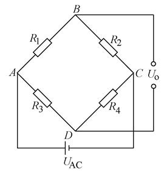

$$
K_仪\varepsilon_仪 = K(\varepsilon_1 - \varepsilon_2 - \varepsilon_3 + \varepsilon_4)
$$

其中，$K$ 为应变计的灵敏系数，$K_仪$ 为应变仪的灵敏系数

$\varepsilon_1, \varepsilon_2, \varepsilon_3, \varepsilon_4$ 是 $R_1, R_2, R_3, R_4$ 应变片的实际应变，$\varepsilon_仪$ 是应变仪的读数

若仅有一个桥臂感受电阻变化，则有

$$
\frac {dR} {R} = K\varepsilon = K_仪\varepsilon_仪
$$

### 广义胡克定律

**1.简单情况**

**1.1 轴向拉压变形**

$$
\sigma_x = E\varepsilon_x
$$

同时导致横向变形	

$$
\varepsilon_y = -\mu\varepsilon_x = -\mu \frac {\sigma_x} {E}
$$

**1.2 纯剪切**

$$
\tau = G \gamma
$$

**2.主应力单元体/非主应力单元体**

即对于各向同性材料，在小变形及线弹性范围内：

线应变只与正应力有关，而与剪应力无关；

剪应变只与剪应力有关，而与正应力无关；

则由叠加原理，主应力单元体/非主应力单元体的应力状态是轴向拉压变形和纯剪切的叠加：

$$
\begin{align*}
\varepsilon_x &= \frac {1} {E} [\sigma_x - \mu(\sigma_y + \sigma_z)] \\
\varepsilon_y &= \frac {1} {E} [\sigma_y - \mu(\sigma_z + \sigma_x)] \\
\varepsilon_z &= \frac {1} {E} [\sigma_z - \mu(\sigma_x + \sigma_y)] \\
\gamma_{xy} &= \frac {1} {G} \tau_{xy} \\
\gamma_{yz} &= \frac {1} {G} \tau_{yz} \\
\gamma_{zx} &= \frac {1} {G} \tau_{zx}
\end{align*}
$$

**平面应力状态分析**

$$
\begin{align*}
\sigma_\alpha &= \frac {\sigma_x + \sigma_y} {2} + \frac {\sigma_x - \sigma_y} {2} cos{2\alpha} - \tau_{xy} sin{2\alpha}  \\
\tau_\alpha &= \frac {\sigma_x - \sigma_y} {2} sin{2\alpha} - \tau_{xy} cos{2\alpha}
\end{align*}
$$

其中 $\alpha$ 为从x轴正方向逆时针转到面的法向的夹角

变形，得到平面应力状态分析公式的物理意义为一个应力圆：

$$
(\sigma_\alpha - \frac {\sigma_x + \sigma_y} {2})^2 + \tau_\alpha^2 = (\frac {\sigma_x - \sigma_y} {2})^2 + \tau_{xy}^2  
$$

### 应变计的贴法

1. 检查和分选应变计

    贴片前应对应变计进行外观检查和阻值测量。检查应变计的敏感栅有无锈斑、基底和覆盖层有无破损、引线是否牢固等。阻值测量的目的是检查应变计是否有断路、短路情况，并按阻值进行分选，以保证使用同一温度补偿片的一组应变计的阻值相差不超过 0.1Ω

2. 粘贴表面的准备

    首先，除去构件粘贴表面的油污、漆、锈斑、电镀层等，用砂布交叉打磨出细纹以增加粘结力，接着用浸有酒精(或丙酮)的纱布片或脱脂棉球擦洗，并用钢画针画出贴片定位线。最后，再进行一次擦洗，直至纱布片或棉球上不见污迹为止

3. 贴片

    在应变计的底面和处理过的粘贴表面上，各涂一层薄而均匀的胶，用镊子将应变计放上并调好位置，然后盖上氟塑料薄膜，用手指揉和滚压，挤出多余的胶，并排除应变计下面的气泡，使应变计和试件完全贴合。过适当时间后，从应变计无引线的一端开始向有引线的一端揭掉氟塑料薄膜，用力方向尽量与粘结表面平行

4. 固化

    贴片时最常用的是氰基丙稀酸酯粘结剂(如 502 胶水、501 胶水粘结剂)。用它贴片后，只要在室温下放置数小时即可充分固化，而具有较强的粘结能力。对于需要加温固化的粘结剂，应严格按规范进行。一般是用红外线灯烘烤，但加温速度不能太快，以免产生气泡

5. 测量导线的焊接与固定

    待粘结剂初步固化以后，即可焊接导线。常温静态应变测量时，导线可采用 ϕ0.1～ϕ0.3mm 的单丝纱包铜线或多股铜芯塑料软线

    导线与应变计引线之间连接最好使用接线端子片，如图 1 所示

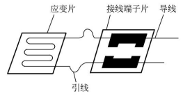

6. 检查

    对已充分固化并已接好导线的应变计，在正式使用前必须进行质量检查。除对应变计作外观检查外，还应检查应变计是否粘贴良好、贴片方位是否正确、有无短路和断路、绝缘电阻是否符合要求(一般不低于100MΩ)等

### 测量电桥原理

电桥输入恒定时，输出电压与桥臂电阻变化率之间的关系：

$$
U_o = \frac {U_AB} {4} (\frac {\Delta R_1} {R_1} - \frac {\Delta R_2} {R_2} - \frac {\Delta R_3} {R_3} + \frac {\Delta R_4} {R_4})/[1+\frac {1} {2} (\frac {\Delta R_1} {R_1} + \frac {\Delta R_2} {R_2} + \frac {\Delta R_3} {R_3} + \frac {\Delta R_4} {R_4})]
$$

应变计的电阻变化率 $\frac {\Delta R} {R}$ 一般远小于 1，因此可以略去上式分母中的电阻变化率，得到输出电压与桥臂电阻变化率之间的线性关系：

$$
U_o = \frac {U_AB} {4} (\frac {\Delta R_1} {R_1} - \frac {\Delta R_2} {R_2} - \frac {\Delta R_3} {R_3} + \frac {\Delta R_4} {R_4})
$$

由于略去电阻变化率产生的非线性相对误差：

$$
e=abs{\frac {1} {2} (\frac {\Delta R_1} {R_1} + \frac {\Delta R_2} {R_2} + \frac {\Delta R_3} {R_3} + \frac {\Delta R_4} {R_4})}
$$

应变计的应变变化与电阻应变率的关系：

$$
\frac {\Delta R} {R} = K \varepsilon
$$

其中， K 为应变计的灵敏系数

代入输出电压与桥臂电阻变化率之间的线性关系，得输出电压与应变片粘贴点的应变之间的线性关系：

$$
U_o=\frac {U_AB} {4} (\varepsilon_1-\varepsilon_2-\varepsilon_3+\varepsilon_4)
$$

同理得上式的非线性相对误差：

$$
e = abs{\frac {1} {2}(\varepsilon_1+\varepsilon_2+\varepsilon_3+\varepsilon_4)}
$$

### 电阻应变计在电桥中的接线方法

记应变仪的读数为：

$$
\varepsilon_d = \varepsilon_1 - \varepsilon_2 - \varepsilon_3 + \varepsilon_4
$$

固定电阻受温度和工作环境的影响很小，即 ，相应地有 。

电桥相对两臂接工作应变计，另相对两臂接温度补偿应变计，则有：

$$
\begin{align*}
\varepsilon_1 &= \varepsilon'_1 + \varepsilon_t  \\
\varepsilon_2 &= \varepsilon_t  \\
\varepsilon_3 &= \varepsilon_t  \\
\varepsilon_4 &= \varepsilon'_4 + \varepsilon_t
\end{align*}
$$

应变仪的读数应为：

$$
\varepsilon_d = \varepsilon'_1 + \varepsilon'_4
$$

#### 串联和并联式接线法：

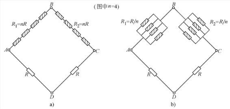

**1.串联接线法**

1. 串联接线后桥臂的应变为各个应变计应变值的算术平均值

2. 当每一桥臂中串联的各个应变计的应变相同时，即ε=ε=…=ε=ε′时，则

3. 串联后的桥臂电阻增大，在限定电流下，可以提高供桥电压，相应地使读数应变增大

**2.并联接线法**

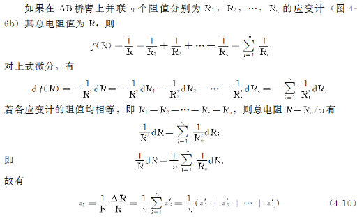

1. 并联接线后桥臂的应变为各个应变计应变值的算术平均值

2. 当同一桥臂中并联的所有应变计的电阻改变量都相同时，即ΔR=ΔR=…=ΔR=ΔR′，各个应变计的应变也均相同，设为ε′，则桥臂的应变为

3. 并联后的桥臂电阻减小，在通过应变计的电流不超过最大工作电流的条件下，电桥的输出电流可以相应地提高n倍，这对于直接用电流表或记录仪器是有利的

### 测量电桥的应用

1.半桥接线法的应用

2.全桥接线法的应用

#### 半桥接线法的应用

1.拉压应变的测量

2.扭转切应力的测量

3.弯曲应变的测量

4.弯曲切应力的测量

5.拉弯组合变形时的应变测量

#### 拉压应变的测量

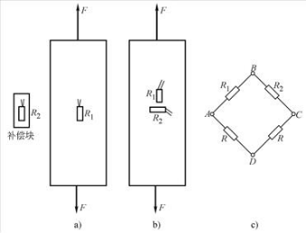

**1.单臂测量**

$R_1$ 沿构件轴向粘贴在构件表面 应力状态为轴向拉压变形

$R_2$ 粘贴在补偿块上

$R_3$、$R_4$ 为固定电阻

$$
\begin{align*}
\varepsilon_1 &= \varepsilon_F + \varepsilon_t  \\
\varepsilon_2 &= \varepsilon_t  \\
\varepsilon_3 &= 0  \\
\varepsilon_4 &= 0
\end{align*}
$$

应变仪的读数应为：

$$
\varepsilon_d = \varepsilon_F
$$

**2.半桥测量**

$R_1$ 沿构件轴向粘贴在构件表面 应力状态为轴向拉压变形

$R_2$ 沿构件横向粘贴在构件表面 应力状态为轴向拉压变形下的横向变形

$R_3$、$R_4$ 为固定电阻

$$
\begin{align*}
\varepsilon_1 &= \varepsilon_F + \varepsilon_t  \\
\varepsilon_2 &= -\mu \varepsilon_F + \varepsilon_t  \\
\varepsilon_3 &= 0  \\
\varepsilon_4 &= 0
\end{align*}
$$

应变仪的读数应为：

$$
\varepsilon_d = (1+\mu)\varepsilon_F
$$

#### 扭转切应力的测量

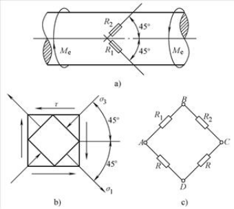

由于圆轴表面上任一点为纯剪切应力状态，所以对于任一一点都有

$$
\begin{align*}
\sigma_{0^\circ} &= \sigma_x = 0 \\
\sigma_{90^\circ} &= \sigma_y = 0 \\
\tau_{xy} &= \tau
\end{align*}
$$

在平面应力状态分析公式中代入 $\alpha = -45^\circ, 45^\circ$ 得

$$
\begin{align*}
\sigma_{-45^\circ} &= \tau_{xy} = \tau \\
\tau_{-45^\circ} &= 0  \\
\sigma_{45^\circ} &= -\tau_{xy} = -\tau \\
\tau_{45^\circ} &= 0
\end{align*}
$$

$R_1$ 与构件轴向成 -45 度粘贴在构件表面 应力状态为纯剪切 对应 $\sigma_{-45^\circ}$ 

$R_2$ 沿构件横向成 45 度粘贴在构件表面 应力状态为纯剪切 对应 $\sigma_{45^\circ}$

$R_3$、$R_4$ 为固定电阻

$$
\begin{align*}
\varepsilon_1 &= \varepsilon_n + \varepsilon_t  \\
\varepsilon_2 &= -\varepsilon_n + \varepsilon_t  \\
\varepsilon_3 &= 0  \\
\varepsilon_4 &= 0
\end{align*}
$$

应变仪的读数应为：

$$
\varepsilon_d = 2\varepsilon_n
$$

由广义胡克定律：

$$
\varepsilon_x = \frac {1} {E} [\sigma_x - \mu(\sigma_y + \sigma_z)]
$$

得：

$$
\varepsilon_n = \frac {1} {E} [\sigma_{-45^\circ} - \mu(\sigma_{45^\circ} + 0)]
$$

代入 $\sigma_{-45^\circ},\sigma_{45^\circ}$ 得：

$$
\varepsilon_n = \frac {1} {E}(1+\mu)\tau = \frac {\tau} {2G} = \frac {\gamma} {2}
$$

代入 $\varepsilon_n = \frac {1} {2} \varepsilon_d$，既可测切应力，也可以测剪切模量：

$$
\tau = G\varepsilon_d
$$

$$
\gamma = \varepsilon_d
$$

实际加载时：

$$
G = \frac {\tau} {\gamma} = \frac {T} {W\varepsilon_d}
$$

其中 W 为抗扭截面模量

#### 弯曲应变的测量

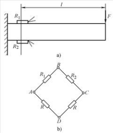

$R_1$ 粘贴在构件上表面 应力状态为轴向拉压变形 拉

$R_2$ 粘贴在构件下表面 应力状态为轴向拉压变形 压

$R_3$、$R_4$ 为固定电阻

$$
\begin{align*}
\varepsilon_1 &= \varepsilon_v + \varepsilon_t  \\
\varepsilon_2 &= -\varepsilon_v + \varepsilon_t  \\
\varepsilon_3 &= 0  \\
\varepsilon_4 &= 0
\end{align*}
$$

应变仪的读数应为：

$$
\varepsilon_d = 2\varepsilon_v
$$

#### 弯曲切应力的测量

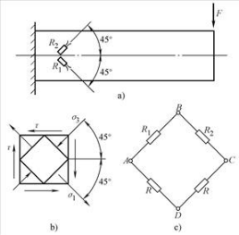

中性层上各点为纯切应力状态

与圆轴的扭转切应力的测量相似

#### 拉弯组合变形时的应变测量

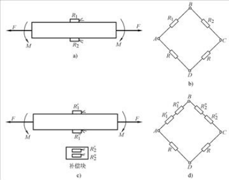

$R_1,R'_1$ 粘贴在构件上表面 应力状态为轴向拉压变形 F拉 M 拉

$R_2,R''_1$ 粘贴在构件下表面 应力状态为轴向拉压变形 F拉 M 压

$R'_2,R''_2$ 粘贴在补偿块上

$R_3$、$R_4$ 为固定电阻

$$
\begin{align*}
\varepsilon_1 &= \varepsilon'_1 = \varepsilon_F + \varepsilon_M + \varepsilon_t \\
\varepsilon_2 &= \varepsilon''_1 = \varepsilon_F - \varepsilon_M + \varepsilon_t \\
\varepsilon_2' &= \varepsilon_2'' = \varepsilon_t \\
\varepsilon_3 &= 0  \\
\varepsilon_4 &= 0
\end{align*}
$$

对于 $R_1,R_2,R,R$ 组桥，应变仪的读数应为：

$$
\begin{align*}
\varepsilon_d &= (\varepsilon_F + \varepsilon_M + \varepsilon_t) - (\varepsilon_F - \varepsilon_M + \varepsilon_t) + 0 - 0 \\
{} &= 2\varepsilon_M
\end{align*}
$$

对于 $R'_1,R''_1,R'_2,R''_2,R,R$ 组桥，应变仪的读数应为：

$$
\begin{align*}
\varepsilon_d &= (\varepsilon_F + \varepsilon_M + \varepsilon_t) + (\varepsilon_F - \varepsilon_M + \varepsilon_t) - \varepsilon_t - \varepsilon_t + 0 - 0 \\
{} &= 2\varepsilon_F
\end{align*}
$$

#### 全桥接线法的应用

1.拉弯扭组合变形时的扭转切应力测量

2.材料弹性模量 E 和泊松比 μ 的测量

#### 拉弯扭组合变形时的扭转切应力测量

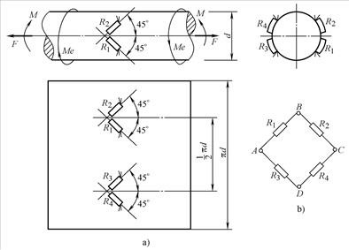

$R_2,R_4$ 与构件轴向成 45 度粘贴在构件中性面 应力状态为轴向拉压变形+纯剪 无弯矩影响

$R_1,R_3$ 与构件轴向成 -45 度粘贴在构件中性面 应力状态为轴向拉压变形+纯剪 无弯矩影响

$$
\begin{align*}
\varepsilon_1 &= \varepsilon_F + 0 + \varepsilon_n + \varepsilon_t  \\
\varepsilon_2 &= \varepsilon_F - 0 - \varepsilon_n + \varepsilon_t  \\
\varepsilon_3 &= \varepsilon_F + 0 - \varepsilon_n + \varepsilon_t  \\
\varepsilon_4 &= \varepsilon_F - 0 + \varepsilon_n + \varepsilon_t
\end{align*}
$$

应变仪的读数应为：

$$
\varepsilon_d = 4\varepsilon_n
$$

#### 材料弹性模量E和泊松比μ的测量

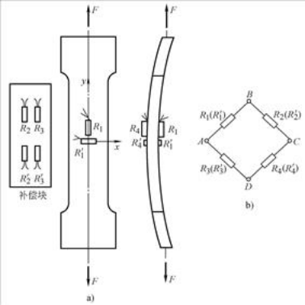

$R_1$ 沿构件轴向粘贴在构件上表面 应力状态为轴向拉压变形

$R'_1$ 沿构件横向粘贴在构件上表面 应力状态为轴向拉压变形下的横向变形

$R_4$ 沿构件轴向粘贴在构件上表面 应力状态为轴向拉压变形

$R'_1$ 沿构件横向粘贴在构件上表面 应力状态为轴向拉压变形下的横向变形

$R_2,R'_2,R_3,R'_3$ 粘贴在补偿片上

$$
\begin{align*}
\varepsilon_1 &= \varepsilon_4 = \varepsilon_F + \varepsilon_t \\
\varepsilon'_1 &= \varepsilon'_4 = -\mu \varepsilon_F + \varepsilon_t \\
\varepsilon_2 &= \varepsilon'_2 = \varepsilon_3 = \varepsilon'_3 = \varepsilon_t
\end{align*}
$$

$R_1,R_2,R_3,R_4$ 组桥，应变仪的读数应为：

$$
\begin{align*}
\varepsilon_d &= \varepsilon_F + \varepsilon_t - \varepsilon_t - \varepsilon_t + \varepsilon_F + \varepsilon_t \\
{} &= 2\varepsilon_F
\end{align*}
$$

$R'_1,R'_2,R'_3,R'_4$ 组桥，应变仪的读数应为：

$$
\begin{align*}
\varepsilon_d &= (-\mu \varepsilon_F + \varepsilon_t) - \varepsilon_t - \varepsilon_t + (-\mu \varepsilon_F + \varepsilon_t) \\
{} &= -2\mu \varepsilon_F
\end{align*}
$$

### 偏心拉伸

偏心拉伸试样包含两个方面的内力

1.拉伸

$$
\begin{align*}
\sigma_F &= E\varepsilon_F \\
\sigma_F &= \frac {F} {A} = \frac {F} {bh}
\end{align*}
$$

其中 E 为弹性模量，F 为拉伸载荷

b 为截面沿 z 轴方向的边的长度，h 为截面沿 y 轴方向的边的长度

2.弯曲

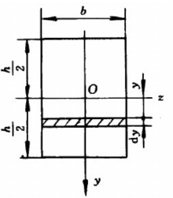

弯应力沿厚度方向线性分布：

$$
\sigma_M = \frac {M} {I_z} y = \frac {Fe} {I_z} y = \frac {12Fe} {bh^3} y
$$

b 为截面沿 z 轴方向的边的长度，h 为截面沿 y 轴方向的边的长度

在弯曲应力最大值的地方 y = h/2：

$$
\begin{align*}
\sigma_M &= E\varepsilon_M \\
\sigma_M &= \frac {M} {W_z} = \frac {Fe} {W_z} = \frac {6Fe} {bh^2}
\end{align*}
$$

其中 Wz 为抗弯截面模量，e 为偏心矩

> 有些地方把截面描述为 t 为试样截面的长边长度，b 为试样截面的短边长度
>
> 然后记 W_z = tb^2/6
> 
> 个人感觉这样不是很好……因为忽略了截面中的 z 轴和 y 轴的位置

## 光弹性法

### 光波的正弦表达式

$$
u = asin(\omega t + \varphi)
$$

其中 $a$ 为振幅

$\omega$ 为圆频率

$\varphi$ 为相位

代入 $\omega = \frac {2 \pi} {\lambda} \nu$, $\varphi = \frac {2 \pi} {\lambda} x$，得

$$
u = asin\frac {2 \pi} {\lambda}(\nu t + x)
$$

其中 $\lambda$ 为波长

$\nu$ 为速度

$x$ 为光程

### 相位差与光程差之间的关系

相位差

$$\delta = \frac {2 \pi} {\lambda}(\nu t + x_1) - \frac {2 \pi} {\lambda}(\nu t + x_2) = \frac {2 \pi} {\lambda}(x_1 - x_2)
$$

光程差

$$
\Delta = x_1 - x_2
$$

相位差与光程差之间的关系

$$
\delta = \frac {2 \pi} {\lambda} \Delta
$$

**3.光强**

$$
I = ka^2
$$

光强与振幅的平方成正比

### 光弹性实验装置

白光：多种有色光（多个波长）的混合光

单色光：单一波长的光

自然光：横波，沿任意方向振动

平面偏振光：光的横向振动在一个平面内

圆偏振光：以圆轨迹运动的偏振光

光轴：在晶体中的一个特殊的方向，沿该方向不会产生双折射现象

光的双折射现象：指一束光波以入射角为 i 的方向入射时，在进入具有各向异性的晶体以后，光在其中沿各个方向的折射率不同，因而传播速度不同，导致光线将分成两束以不同折射角 $\varphi_1$, $\varphi_2$ 方向传播，这两束传播方向不同的光波不仅具有不同的传播速度，而且具有不同的偏振方向——它们的偏振方向相互垂直

人工双折射：玻璃、塑料、环氧树脂等各向同性透明非晶体材料，自然状态下通常不产生双折射现象，但当有载荷作用时，其内部会产生应力分布，导致材料由原先的光学各向同性变为各向异性，出现类似晶体的双折射性质

起偏镜：将入射光转化为平面偏振光

四分之一波片：由于四分之一波长相当于二分之派的相位，入射的平面偏振光发生双折射转化为圆偏振光

检偏镜：取入射的圆偏振光在该镜偏振方向上的分量

暗场：当起偏轴和检偏轴正交时，平面偏振光被检偏镜挡住吸收，形成暗场

亮场：当起偏轴和检偏轴平行时，平面偏振光穿过检偏轴，形成亮场

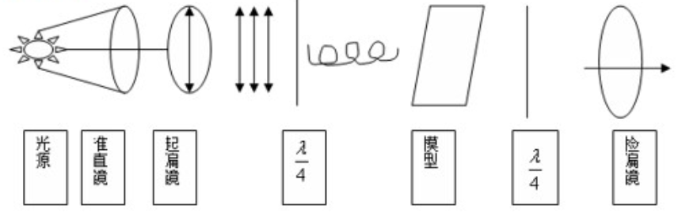

### 应力-光学定律

应力-光学定律的形式 1 通用

$$
\Delta = Ch(\sigma_1 - \sigma_2)
$$

$\Delta$ 为光程差 单位 m

$C$ 为模型材料的应力光学系数

$h$ 为模型厚度

$\sigma$ 为应力 单位 Pa

意义：当模型厚度 h 一定时，任一点光程差与该点的主应力差成正比

**1.平面偏振场**

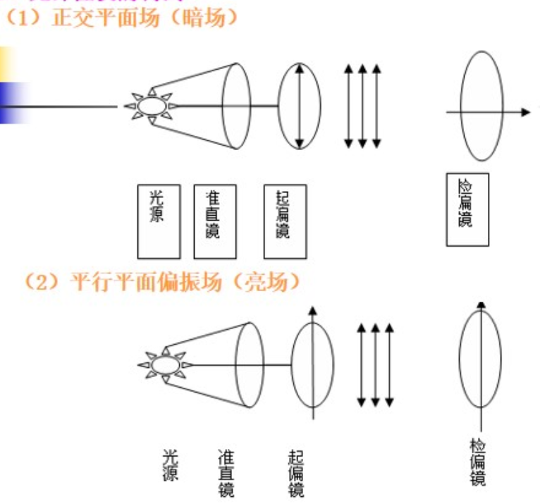

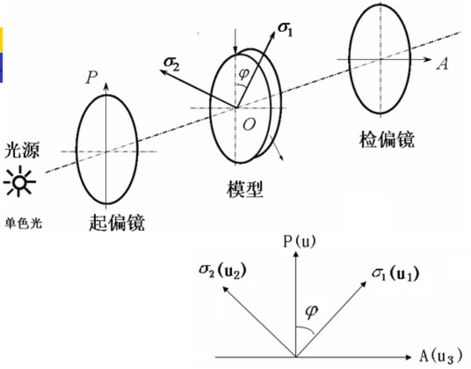

对于正交平面偏振光场，分析可得：

$$
I = k(asin2\varphi sin{\frac{\delta}{2}})^2
$$

代入相位差与光程差之间的关系 $\delta = \frac {2 \pi} {\lambda} \Delta$，得

$$
I = k(asin2\varphi sin{\frac {\pi \Delta} {\lambda}})^2
$$

可见，

1. 光强与光程差 $\Delta$ 有关

2. 光强与主应力与起偏镜之间的夹角 $\varphi$ 有关

研究 $I = 0$：

1. $sin2\varphi = 0 => \varphi = 0, \pi /2$

    + $\varphi = 0$ 时，$\sigma_1$ 与起偏镜的偏振方向重合

    + $\varphi = \pi /2$ 时，$\sigma_2$ 与起偏镜的偏振方向重合

    等倾线：模型上应力主轴与起偏镜偏振轴重合的诸点，在检偏镜之后，光均将消失而呈现为黑点，这些点的迹线形成干涉条纹，成为等倾线

    等倾线是具有相同主应力方向的点的轨迹，或者说等倾线上各点的主应力方向相同，且为偏振轴的方向

    同步转动起偏镜和检偏镜，可以得到不同方向的等倾线

2. $sin{\frac {\pi \Delta} {\lambda}} = 0 => \frac {\pi \Delta} {\lambda} = N \pi => \Delta = N \lambda, N = 0, 1, 2...$

    光程差 $\Delta$ 为入射的单色光的波长的整数倍时，在检偏镜之后，光均将消失而呈现为黑点，相同整数倍波长的点的迹线形成干涉条纹，成为等差线

    在应力-光学定律的形式 1：$\Delta = Ch(\sigma_1 - \sigma_2)$ 中代入 $\Delta = N \lambda$

    得 $Ch(\sigma_1 - \sigma_2) = N \lambda => \sigma_1 - \sigma_2 = \frac {N \lambda} {Ch} = f \frac {N} {h}$

    得应力-光学定律的形式 2：(只适用于等差线)
    
    $$
    \sigma_1 - \sigma_2 = f \frac {N} {h}
    $$ 

    其中 $f = \frac {\lambda}{C}$ 为材料条纹值，是与光源和材料有关的常数，物理意义为产生一级等差线所需的主应力差值

在单色光下，等倾线和等差线均为黑色条纹，如何将它们分开

1. 加四分之一波片

2. 同步转动起偏镜和检偏镜，等倾线会转动，等差线不动

> 正常的分析是
>
> 平面偏振场 亮场暗场
>
> 平面圆偏振场 亮场暗场
> 
> 现在的情况是，ppt 里面只有平面偏振场的暗场分析
>
> 我也懒得自己写hhh

**2.平面圆偏振场**

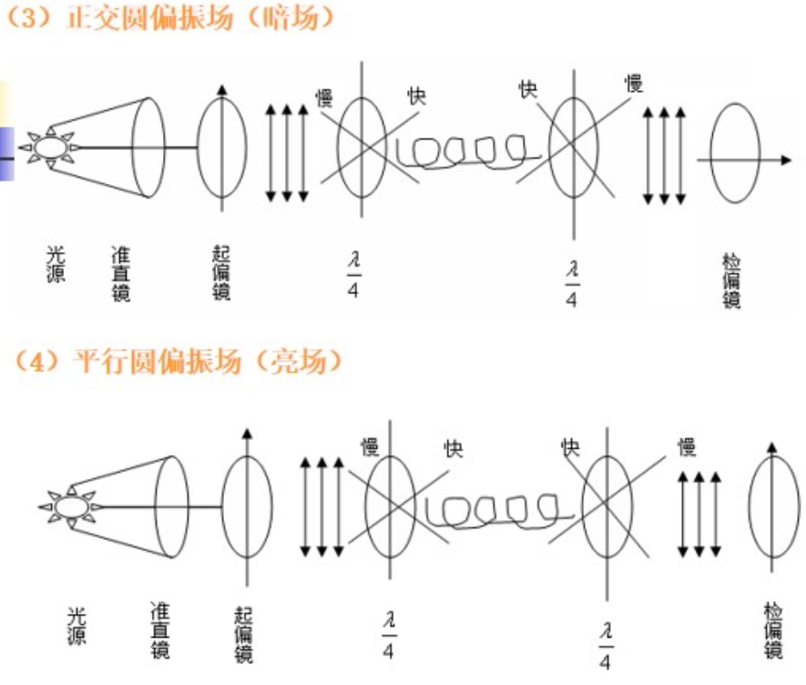

光强：

1. 暗场 $I = k(asin{\frac {\pi \Delta} {\lambda}})^2$ 

    要令 $I = 0$，有 $sin{\frac {\pi \Delta} {\lambda}} = 0 => \frac {\pi \Delta} {\lambda} = N \pi => \Delta = N \lambda, N = 0, 1, 2...$

    与 $\varphi$ 无关，所以没有等倾线

    与 $\lambda$ 有关，所以有等差线，出现在光程差等于偶数倍的入射光的波长的点

2. 亮场 $I = k(acos{\frac {\pi \Delta} {\lambda}})^2$ 

    要令 $I = 0$，有 $cos{\frac {\pi \Delta} {\lambda}} = 0 => \frac {\pi \Delta} {\lambda} = m \frac {\pi}{2} => \Delta = \frac {m}{2} \lambda, m = 1, 3, 5...$

    与 $\varphi$ 无关，所以没有等倾线

    与 $\lambda$ 有关，所以有等差线，出现在光程差等于奇数倍的入射光的半波长的点

综上，观察两种干涉条纹的实验条件为：

+ 等倾线 正交平面偏振光场 白光光源

+ 等差线 正交圆偏振光场 白光光源

### 白色光光源的等差线

以暗场为例，若以白光入射，则某点光程差等于某一色光的波长的整数倍时，该色光被消除，显示出该色光的互补色

因此光程差相同的点显示出相同颜色的条纹

光程差逐渐增大，消光的波长逐渐增大，从紫光到红光，直到等于紫光的新一级整数倍时，进入下一轮循环

亮场则为奇数倍半波长时消光

### 级数条纹 N 的确定

**1.零级条纹**

各向同性点：N = 0，光程差 $\Delta$ = 0

根据应力-光学定律的形式 1：$\Delta = Ch(\sigma_1 - \sigma_2)$

各向同性点 $\Delta = 0 => \sigma_1 - \sigma_2 = 0$ 为模型上主应力差为 0 的点

**1)永久性黑色条纹是零级条纹**

永久性黑色条纹：即无论载荷增加或减少，零级条纹的位置是不变的

暂时性黑点：当外载荷增加或减少时，这些点时而变黑、时而变亮，因而称为暂时性黑点

暂时性黑点并非真的零级条纹，而是高条纹点

隐没点：该点附近的条纹级数比附近区域的级数都低

发源点：该点附近的条纹级数比附近区域的级数都高

**2)模型上的自由方角均为零级条纹**

“自由”代表垂直于边界的方向上的应力为 0

“自由方角”进一步代表该点在两个相互垂直的方向的应力为 0

即 $\sigma_x, \sigma_y = 0$

又因为自由表面上 $\tau_{xy} = 0$

由平面应力分析公式得，应力圆的圆心和半径都为 0，因此该点在每个方向上的应力都为 0，也即主应力 = 0

故 $\sigma_1 - \sigma_2 = 0$

**3)拉、压应力的交界处（过渡区）必有零级条纹**

因各纵向纤维之间无挤压，所以各点均为单向应力状态

**2.色序**

以暗场为例，光程差增加时，与自然光波长的关系是：

黑色 0 ->

黄 -> 红 -> 蓝 -> 绿 的波长的一倍 ->

黄 -> 红 -> 蓝 -> 绿 的波长的两倍 -> ...

所以沿着条纹级数增加的方向，颜色的变化是循环的

所以两条等色线之间必有一条整数级条纹

亮场则为两条等色线之间必有一条奇数倍半波长条纹

**3.不同级数的等色线不会相交，反之，相交的条纹级数必相等**

**4.在白光下判断条纹级数，在单色光下进行拍照**

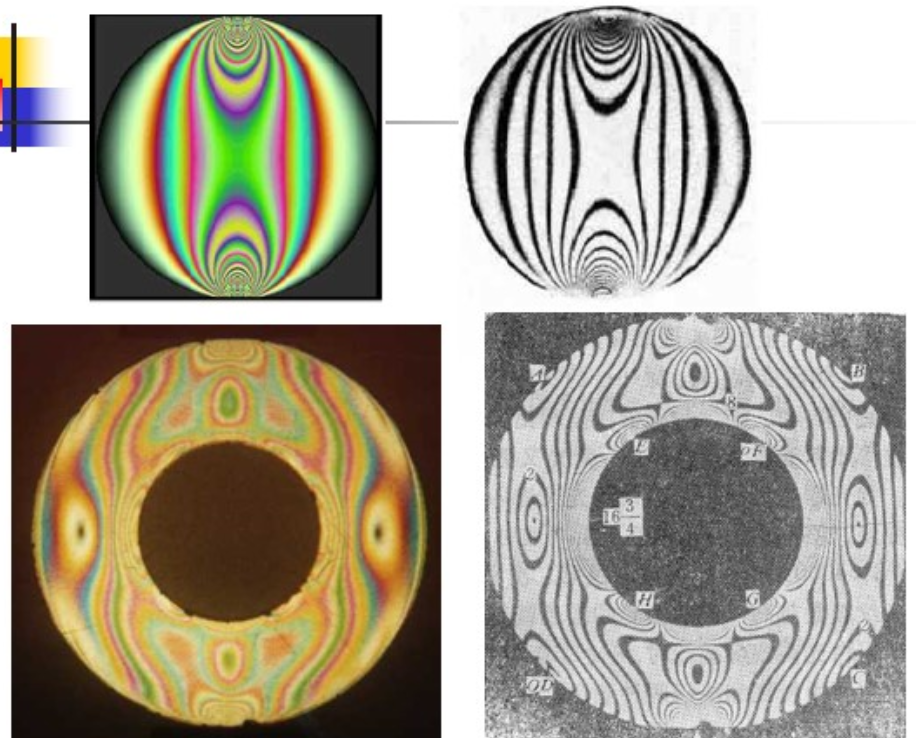

图 圆盘圆环对径受压的等差线

白光下，干涉条纹具有不同颜色，方便根据色序判断条纹级数

在单色光下，只有某点的光程差等于整数倍的入射光的波长/奇数倍的入射光的半波长时，才会消去该色光

因此等差线是黑色的，等差线以外的区域反射入射光，显示入射光的颜色

这样更容易确定等差线的详细位置

**5.在实验时若找不到各向同性点，如何确定其他条纹的级数？**

**1)连续加载法**

一边加载一边观察

最先出现的条纹为第一级条纹

随后出现的条纹级数增大

**2)柯可补偿法**

### 非整数级/半整数级条纹的确定

两级条纹之间的级数与距离的关系往往不是线性的，不能直接线性插值

**1.旋转检偏镜法**

以暗场为例

1. 确定模型上待测点的位置

2. 设置正交平面偏振光场，同步调整起偏镜和检偏镜，直到某一等倾线通过待测点。由等倾线的角度确定待测点的主应力方向

3. 保持起偏镜不动，加入四分之一波片，设置正交圆偏振光场，单独旋转检偏镜，使被测点附近的 N 级和 N -1 级等差线通过该点

    第 N 级等差线通过该点时，向被测点转过 $\theta_1$

    $N_0 = N - \theta_1/\pi$

    第 N - 1 级等差线通过该点时，向被测点转过 $theta_2$

    $N_0 = (N-1) + \theta_2/\pi$

    最终该点等差线级数取两次测量的平均值

### 等倾线

**1.等倾线的绘制**

以正交平面偏振光场为例

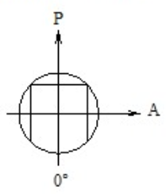

P 为起偏镜偏振轴

A 为检偏镜偏振轴

P 垂直，A 水平时为 $0^\circ$

为了保持正交平面偏振光场，所以要求 P 和 A 始终相互垂直

然后为了得到角度 $\theta$ 的等倾线，将 P 和 A 同步旋转角度 $\theta$

**2.等倾线图**

将各个不同角度的等倾线画在一张图上，这张图成为等倾线图

由前面的分析可知，正交平面偏振光场中同时存在等差线和等倾线

为了避免等差线和等倾线互相干扰，可以使用光学敏感性较低的材料——有机玻璃

其材料条纹值 f 很大，根据 $\sigma_1 - \sigma_2 = f \frac {N} {h}$ 可知，要出现条纹需要施加很大的载荷

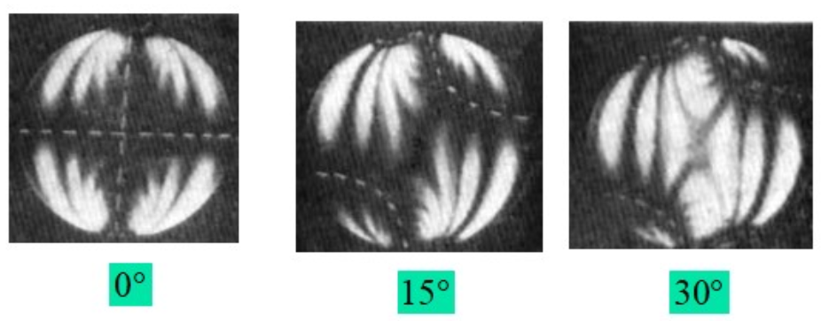

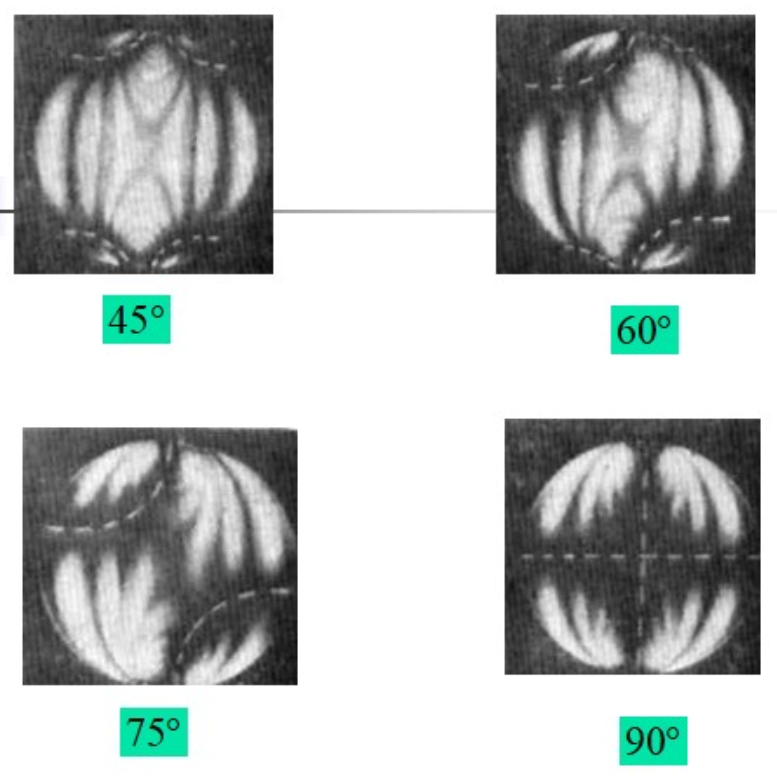

图 圆盘对径受压的等倾线

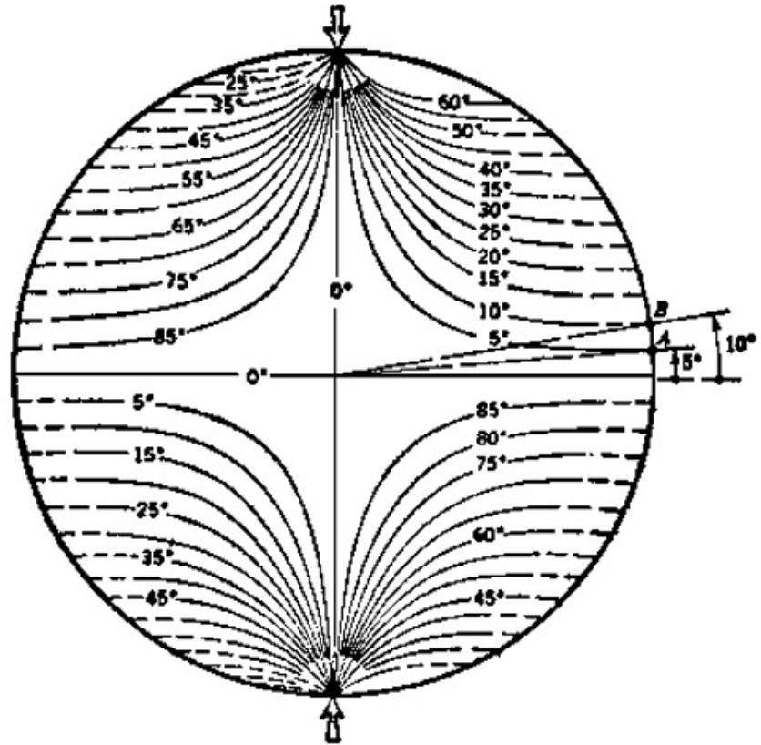

图 圆盘对径受压的等倾线图

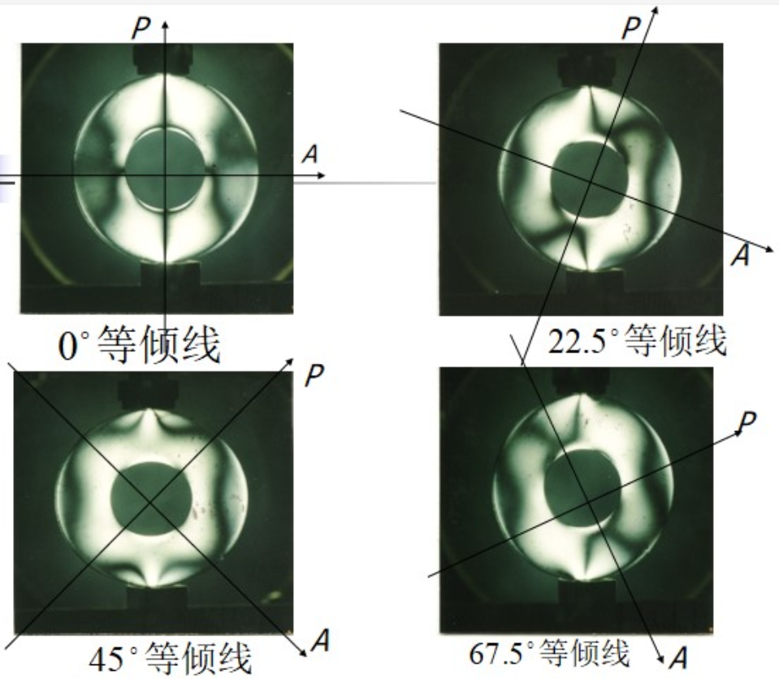

图 圆环对径受压的等倾线

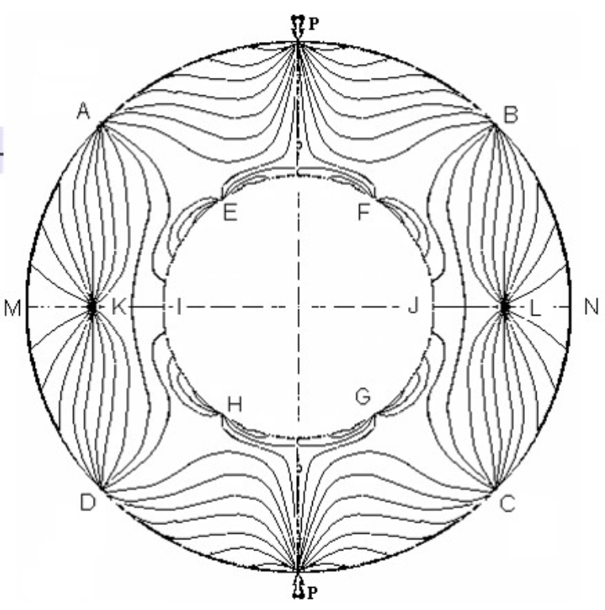

图 圆环对径受压的等倾线图

### 等倾线的特征

**1.自由曲线边界上**

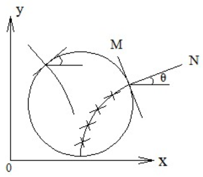

不受外载的模型边界称为自由边界

对于自由边界上的点，曲线的切线和法线方向就是此点的主应力方向

若某一等倾线与边界相交，且交点处模型边界的切线或法线与水平轴成 $\theta$ 角，那么由等倾线上各点主应力方向相同的定义，有：

该等倾线上的各点的主应力方向均与水平轴成  $\theta$ 或  $\pi/2 + \theta$ 角

**2.直线边界上**

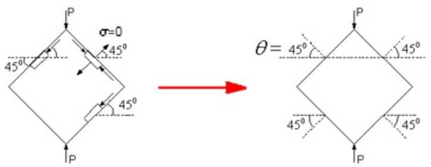

因为边界上无剪应力，所以边界线即为应力主线

所以边界线与等倾线重合

**3.对称轴上**

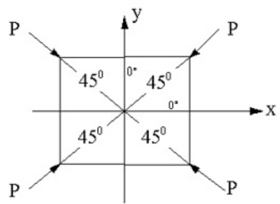

当模型的几何形状和载荷都以某轴线为对称时，则对称轴必为应力主轴，它就是一条等倾线

**4.各向同性点上**

在各向同性点上，$\sigma_1 - \sigma_2 = 0$，可得 $\sigma_1 = \sigma_2$

这意味着应力圆与 x 轴的两个交点重合，即应力圆是一个点

所以各向同性点上的任意方向都是主应力方向（感觉这才是各向同性点的名称来源吧）

所以不同角度的等倾线都必须通过各向同性点

**5.集中载荷作用点**

1. 从主应力方向的观点看，是一个各向同性点

2. 从主应力大小的观点看，是一个发源点

### 主应力方向 $\sigma_1, \sigma_2$ 的判别

等倾线图可以通过“同一线上主应力方向相同”的定义，先确定线上一点的主应力方向，再确定线上其他点的主应力方向

但是两个方向中哪个是 $\sigma_1$ 哪个是 $\sigma_2$ 无法判别

（或者说怎么判别哪个主应力是拉哪个是压）

（以拉应力为正）

**1.分析法**

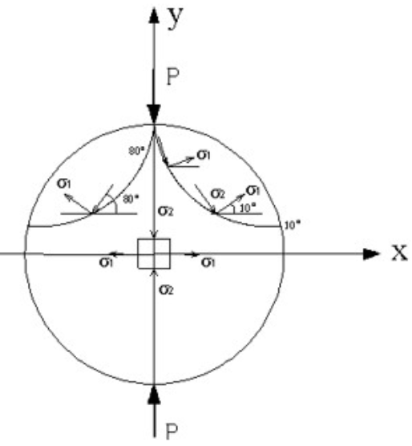

1. 从等倾线图中选择若干条等倾线

2. 力学分析：

    中心点的应力状态为：在 x 方向为拉应力，在 y 方向为压应力

3. 再根据应力变化的连续性，在等倾线上参考已知应力状态点，就可以确定两个主应力的正负

**2.钉压法**

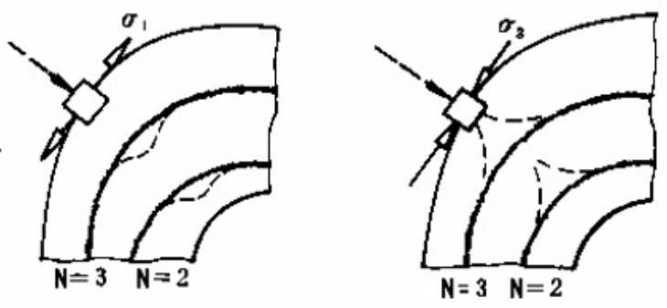

左图中单元体单向受拉，钉压后条纹级数增加 右图中单元体单向受压，钉压后条纹级数减小

1. 假设单元体单向受拉：

    原：$\sigma_1 > 0, \sigma_2 = 0$

    钉压：$\sigma_1 > 0, \sigma_2 < 0$

    同时 $\sigma_1$ 保持不变，则有 $\sigma_1 - \sigma_2$ 增大，条纹级数增加

2. 假设单元体单向受压：

    原：$\sigma_1 < 0, \sigma_2 = 0$

    钉压：$\sigma_1 < 0, \sigma_2 < 0$

    同时 $\sigma_1$ 保持不变，则有 $\sigma_1 - \sigma_2$ 减小，条纹级数减小

### 平面光弹性应力计算

#### 1.边界应力

#### 2.应力集中

#### 3.内部应力分离方法

**1.求主应力和法**

**2.斜射法**

**3.剪应力差法**

**4.材料条纹值的测定**

### 三维光弹性的冻结切片法

#### 1.三维光弹性的冻结切片法

1. 应力冻结

2. 切片

3. 平面应力分析

#### 2.次主应力

### 三维光弹性效应

#### 1.平面应力-光学定理

#### 2.模型切片的正射法

1. 切片在 XY 平面，光线沿 Z 方向垂直入射

2. 切片在 XZ 平面，光线沿 Y 方向垂直入射

3. 切片在 YZ 平面，光线沿 X 方向垂直入射

#### 3.模型切片的斜射法

