- [操作系统](#操作系统)

  - [第一章 计算机系统概述](#第一章-计算机系统概述)

    - [1.1 操作系统的基本概念](#11-操作系统的基本概念)

      - [1.1.1 操作系统的概念](#111-操作系统的概念)

      - [1.1.2 操作系统的特征](#112-操作系统的特征)

      - [1.1.3 操作系统的目标和功能](#113-操作系统的目标和功能)

    - [1.2 操作系统发展历程](#12-操作系统发展历程)

      - [1.2.1 手工操作阶段](#121-手工操作阶段)

      - [1.2.2 批处理阶段](#122-批处理阶段)

      - [1.2.3 分时操作系统](#123-分时操作系统)

      - [1.2.4 实时操作系统](#124-实时操作系统)

      - [1.2.5 网络操作系统和分布式计算机系统](#125-网络操作系统和分布式计算机系统)

      - [1.2.6 个人计算机操作系统](#126-个人计算机操作系统)

      - [1.2.7 其他](#127-其他)

    - [1.3 操作系统运行环境](#13-操作系统运行环境)

      - [1.3.1 处理器运行模式](#131-处理器运行模式)

      - [1.3.2 中断和异常的概念](#132-中断和异常的概念)

      - [1.3.3 系统调用](#133-系统调用)

    - [1.4 操作系统结构](#14-操作系统结构)

    - [1.5 操作系统引导](#15-操作系统引导)

    - [1.6 虚拟机](#16-虚拟机)

  - [第二章 进程与线程](#第二章-进程与线程)

    - [2.1 进程与线程](#21-进程与线程)

      - [2.1.1 进程的引入](#211-进程的引入)

      - [2.1.2 进程的概念和特征](#212-进程的概念和特征)

      - [2.1.3 进程的组成](#213-进程的组成)

      - [2.1.4 进程的状态与切换](#214-进程的状态与切换)

      - [2.1.5 进程控制](#215-进程控制)

      - [2.1.6 进程的通信](#216-进程的通信)

      - [2.1.7 线程和多线程模型](#217-线程和多线程模型)

    - [2.2 处理机调度](#22-处理机调度)

      - [2.2.1 调度的概念](#221-调度的概念)

      - [2.2.2 调度的目标](#222-调度的目标)

      - [2.2.3 调度的实现](#223-调度的实现)

      - [2.2.4 典型的调度算法](#224-典型的调度算法)

      - [2.2.5 进程切换](#225-进程切换)

    - [2.3 同步与互斥](#23-同步与互斥)

      - [2.3.1 同步与互斥的基本概念](#231-同步与互斥的基本概念)

      - [2.3.2 实现临界区互斥的基本方法](#232-实现临界区互斥的基本方法)

      - [2.3.3 互斥锁](#233-互斥锁)

      - [2.3.4 信号量](#234-信号量)

      - [2.3.5 管程](#235-管程)

      - [2.3.6 经典同步问题](#236-经典同步问题)

    - [2.4 死锁](#24-死锁)

      - [2.4.1 概念](#241-概念)

      - [2.4.3 死锁避免](#243-死锁避免)

      - [2.4.4 死锁检测和解除](#244-死锁检测和解除)

  - [第三章 内存管理](#第三章-内存管理)

    - [3.1 内存管理概念](#31-内存管理概念)

      - [3.1.1 进程运行的原理](#311-进程运行的原理)

      - [3.1.2 覆盖与交换](#312-覆盖与交换)

      - [3.1.3 连续分配管理方式](#313-连续分配管理方式)

      - [3.1.4 基本分页存储管理](#314-基本分页存储管理)

      - [3.1.5 基本分段存储管理](#315-基本分段存储管理)

      - [3.1.6 段页式管理](#316-段页式管理)

    - [3.2 虚拟内存管理](#32-虚拟内存管理)

      - [3.2.1 概念](#321-概念)

      - [3.2.2 请求分页管理方式](#322-请求分页管理方式)

      - [3.2.3 页框分配](#323-页框分配)

      - [3.2.4 页面置换算法](#324-页面置换算法)

      - [3.2.5 抖动和工作集](#325-抖动和工作集)

      - [3.2.6 内存映射文件](#326-内存映射文件)

      - [3.2.7 虚拟存储器性能影响因素](#327-虚拟存储器性能影响因素)

      - [3.2.8 地址翻译](#328-地址翻译)

  - [第四章 文件管理](#第四章-文件管理)

    - [4.1 文件系统基础](#41-文件系统基础)

      - [4.1.1 文件的基本概念](#411-文件的基本概念)

      - [4.1.2 文件控制块和索引结点](#412-文件控制块和索引结点)

      - [4.1.3 文件的操作](#413-文件的操作)

      - [4.1.4 文件保护](#414-文件保护)

      - [4.1.5 文件的逻辑结构](#415-文件的逻辑结构)

      - [4.1.6 文件的物理结构](#416-文件的物理结构)

    - [4.2 目录](#42-目录)

      - [4.2.1 目录的基本概念](#421-目录的基本概念)

      - [4.2.2 目录结构](#422-目录结构)

      - [4.2.3 目录的操作](#423-目录的操作)

      - [4.2.4 目录实现](#424-目录实现)

      - [4.2.5 文件共享](#425-文件共享)

    - [4.3 文件系统](#43-文件系统)

      - [4.3.1 文件系统结构](#431-文件系统结构)

      - [4.3.2 文件系统布局](#432-文件系统布局)

      - [4.3.3 外存空闲空间管理](#433-外存空闲空间管理)

      - [4.3.4 虚拟文件系统 VFS](#434-虚拟文件系统-vfs)

  - [第五章 IO 管理](#第五章-io-管理)

    - [5.1 IO 管理概述](#51-io-管理概述)

      - [5.1.1 IO 设备](#511-io-设备)

      - [5.1.2 IO 控制方式](#512-io-控制方式)

      - [5.1.3 IO 软件层次结构](#513-io-软件层次结构)

      - [5.1.4 应用程序 IO 接口](#514-应用程序-io-接口)

    - [5.2 设备独立性软件](#52-设备独立性软件)

      - [5.2.1 与设备无关的软件](#521-与设备无关的软件)

      - [5.2.2 高速缓存与缓冲区](#522-高速缓存与缓冲区)

      - [5.2.3 设备分配与回收](#523-设备分配与回收)

      - [5.2.4 SPOOLing 技术（假脱机技术）](#524-spooling-技术假脱机技术)

      - [5.2.5 设备驱动程序接口](#525-设备驱动程序接口)

    - [5.3 磁盘和固态硬盘](#53-磁盘和固态硬盘)

      - [5.3.1 磁盘](#531-磁盘)

      - [5.3.2 硬盘的管理](#532-硬盘的管理)

      - [5.3.3 磁盘调度算法](#533-磁盘调度算法)

      - [5.3.4 固态硬盘](#534-固态硬盘)

# 操作系统

## 第一章 计算机系统概述

### 1.1 操作系统的基本概念

#### 1.1.1 操作系统的概念

计算机系统的组成：

1. 硬件

2. 操作系统

3. 应用程序

4. 用户

#### 1.1.2 操作系统的特征

1. 并发

    并发：同一时间间隔

    并行：同一时刻

    最基本特征

2. 共享

    互斥共享

    同时访问

    最基本特征

3. 虚拟

    时分复用

    空分复用

4. 异步

#### 1.1.3 操作系统的目标和功能

1. 操作系统作为系统资源的管理者：

    1. 处理机管理

        处理机的分配和运行以进程为单位，因此处理机管理就是进程管理

        进程管理的主要功能：

        1. 进程控制

        2. 进程同步

        3. 进程通信

        4. 死锁处理

        5. 处理机调度

    2. 存储器管理

        提供运行环境

        1. 内存分配与回收

        2. 地址映射

        3. 内存保护与共享

        4. 内存扩充

    3. 文件管理

        1. 文件存储空间的管理

        2. 目录管理

        3. 文件读写管理和保护

    4. 设备管理

        完成用户的 IO 请求

        1. 缓冲管理

        2. 设备分配

        3. 设备处理

        4. 虚拟设备

            把**一个**物理设备变换成**多个**对应的逻辑设备

2. 操作系统作为用户与计算机硬件系统之间的接口：

    1. 命令接口

        1. 联机命令接口（交互式命令接口）

        2. 脱机命令接口

    2. 程序接口

        系统调用（广义指令）是操作系统为应用程序使用内核功能所提供的接口

        只能通过用户程序间接使用

3. 操作系统实现了对计算机资源的扩充

    裸机

    扩充机器（虚拟机）

### 1.2 操作系统发展历程

#### 1.2.1 手工操作阶段

#### 1.2.2 批处理阶段

**1.单道批处理系统**

1. 自动性

2. 顺序性

3. 单道性

技术问题：

1. 等待低速 IO 浪费资源

**2.多道批处理系统**

1. 多道

2. 宏观上并行

3. 微观上串行

技术问题：

1. 如何分配处理器

2. 多道程序的内存分配问题

3. IO 设备如何分配

4. 如何组织和存放大量的程序和数据

    以方便用户使用并保证其安全性与一致性

优点：CPU 保持忙碌，资源利用率高

缺点：不提供人机交互能力

#### 1.2.3 分时操作系统

**1.对比**

| 操作系统    | 特点                |
|:---:|:---:|
| 多道批处理系统 | 作业自动控制</br>无人工干预  |
| 分时操作系统  | 支持多道程序设计</br>人机交互 |

**2.特点**

1. 同时性

2. 交互性

3. 独立性

4. 及时性

    都是对于多终端而言

#### 1.2.4 实时操作系统

无需时间片排队

1. 硬实时

2. 软实时

#### 1.2.5 网络操作系统和分布式计算机系统

**1.网络操作系统**

网络中各种资源的共享及各台计算机之间的通信

**2.分布式计算机系统**

1. 分布性

2. 并行性

#### 1.2.6 个人计算机操作系统

#### 1.2.7 其他

嵌入式

服务器

智能手机...

### 1.3 操作系统运行环境

#### 1.3.1 处理器运行模式

| 运行模式 | 特点 |
|:---:|:---:|
| 用户态（目态）     | 只能用非特权指令       |
| 核心态（管态，内核态） | 可以使用特权指令和非特权指令 |

| 指令 | 内容 |
|:---:|:---:|
| 特权指令  | IO指令、置中断指令、</br>存取用于内存保护的寄存器、</br>送程序状态字到程序状态字寄存器等 |
| 非特权指令 | 仅限于访问用户的地址空间 |


内核：

1. 时钟管理

    时钟中断 -> 进程切换

2. 中断机制

    中断机制中只有一小部分功能属于内核

    <table>
        <tr>
            <td align = center>中断程序</td>
            <td align = center>运行模式</td>
        </tr>
        <tr>
            <td align = center>保护中断信息</td>
            <td align = center rowspan = 2>内核</td>
        </tr>
        <tr>
            <td align = center>跳转</td>
        </tr>
        <tr>
            <td align = center>用户程序</td>
            <td></td>
        </tr>
        <tr>
            <td align = center>恢复中断信息</td>
            <td align = center rowspan = 2>内核</td>
        </tr>
        <tr>
            <td align = center>返回</td>
        </tr>
    </table>

    这样可以减少中断的处理时间，提高系统的并行处理能力

3. 原语

    定义原语：关闭中断，让其所有动作不可分割地完成后开中断

    特点：

    1. 底层

    2. 原子性

    3. 时间短，运行频繁

4. 系统控制的数据结构及处理

    1. 进程管理

    2. 存储器管理

    3. 设备管理

#### 1.3.2 中断和异常的概念

**1.分类**

<body>
<table>
	<tr>
		<td colspan=2 align="center" valign=middle>中断</td>
		<td align="center" valign=middle>内容</td>
		<td align="center" valign=middle>可屏蔽性</td>
		<td align="center" valign=middle>软件硬件</td>
        <td align="center" valign=middle>响应（发生）时间</td>
        <td align="center" valign=middle>中断请求</td>
        <td align="center" valign=middle>与指令的关系</td>
	</tr>
	<tr>
		<td rowspan=3 align="center" valign=middle>内部异常</td>
		<td align="center" valign=middle>故障(Fault)/程序</td>
		<td align="center" valign=middle>非法操作码、缺页故障</br>除数为 0、运算溢出</td>
		<td rowspan=4 align="center" valign=middle>不可屏蔽</td>
		<td rowspan=2 align="center" valign=middle>软件中断</td>
        <td align="center" valign=middle>指令周期中</td>
        <td rowspan=3 align="center" valign=middle>由 CPU 自身完成</br>不必通过外部的信号通知</td>
        <td rowspan=2 align="center" valign=middle>由特定指令在执行过程中产生的</td>
	</tr>
	<tr>
		<td align="center" valign=middle>自陷(Tarp)/访管</td>
		<td align="center" valign=middle>只能在用户态执行</br>用户态下调用系统内核程序</td>
        <td align="center" valign=middle>指令周期结束时</td>
	</tr>
	<tr>
		<td align="center" valign=middle>终止(Abort)/硬件故障</td>
		<td align="center" valign=middle>CPU 无法继续执行的硬件错误<br>主存故障、控制器出错、存储器校验错</td>
		<td rowspan=3 align="center" valign=middle>硬件中断</td>
        <td align="center" valign=middle>指令周期中</td>
        <td align="center" valign=middle></br></td>
	</tr>
	<tr>
		<td rowspan=2 align="center" valign=middle>外部中断</td>
		<td align="center" valign=middle>不可屏蔽中断(NMI)</td>
		<td align="center" valign=middle>通过 NMI 线发出<br>如电源掉电</td>
        <td rowspan=2 align="center" valign=middle>指令周期结束时</td>
        <td rowspan=2 align="center" valign=middle>必须通过中断请求线获取中断源的信息</td>
        <td rowspan=2 align="center" valign=middle>不和任何指令相关联，也不阻止任何指令的完成</td>
	</tr>
	<tr>
		<td align="center" valign=middle>可屏蔽中断(INTR)</td>
		<td align="center" valign=middle>通过 INTR 线发出</td>
		<td align="center" valign=middle>可屏蔽</td>
	</tr>
</table>

**2.中断处理过程**

> 中断和异常的处理的基本过程：
> 
> 1. 中断请求
> 
> 2. 中断判优
> 
> 3. 中断响应
> 
> 4. 中断服务（也称中断处理）
> 
> 5. 中断返回
> 
> 王道计算机组成原理里面把下述第 1 步到第 3 步归为“中断响应”
>
> 又把下述所有步骤归为“中断处理”
>
> 又在阐述中断和异常的处理的基本过程时，把“中断响应”和“中断处理”
>
> 真是乱的要死

1. 关中断

    CPU 响应中断后，首先要保护程序的现场状态，在保护现场的过程中， CPU 不应响应更高级中断源的中断请求。否则，若现场保存不完整，在中断服务程序结束后，也就不能正确地恢复并继续执行现行程序

    通常通过设置中断允许触发器 IF 实现：IF = 1 表示开中断，否则表示关中断

2. 保存断点

    为保证中断服务程序执行完毕后能正确地返回到原来的程序，**中断隐指令**将原来的程序的断点（即程序计数器 PC ）保存到栈或者特定寄存器中。由**硬件**自动完成

3. 中断源识别，中断服务程序寻址

    其实质是取出中断服务程序的入口地址送入程序计数器 PC

    中断源识别的方法：

    + 硬件向量法

        每个中断都有一个唯一的类型号

        每个中断类型号都对应一个中断服务程序

        每个中断服务程序都有一个入口地址，这个入口地址叫中断向量

        集中存放中断向量的存储区叫做中断向量表

        CPU 响应中断后，识别中断源 -> 中断类型号 -> 中断向量的地址（向量地址）（中断向量地址） -> 取到中断向量，并送入 PC

    + 软件查询法

        CPU 设置一个异常状态寄存器，用于记录异常原因

        操作系统使用一个统一的异常或中断查询程序，按优先级顺序查询异常状态寄存器，以检测异常和中断类型，先查询到的先处理

    外部异常大多采用软件识别法，内部中断可以采用软件识别或者硬件向量法

4. 保存现场和屏蔽字

    进入中断服务程序后，首先要**操作系统**保存现场，现场信息一般是指程序状态字寄存器 PSWR 和某些通用寄存器的内容，即中断屏蔽字

5. 开中断

    在中断服务前开中断，可以允许更高级中断请求得到响应，即允许嵌套中断

6. 执行中断服务程序

    这是中断请求的目的。各中断向量统一存放在中断向量表中，该表由**操作系统**初始化，硬件找到该中断信号对应的中断向量，中断向量指明中断服务程序入口地址，然后根据其开始执行

7. 关中断

    保证在恢复现场和屏蔽字时不被中断

8. 恢复现场和屏蔽字

    将现场和屏蔽字恢复到原来的状态

9. 开中断、中断返回

    中断服务程序的最后一条指令通常是一条中断返回指令，使其返回到原程序的断点处，以便继续执行原程序

    第一步到第三步是 CPU 进入中断周期后，由硬件自动完成（中断隐指令），第四到九条是中断服务程序（软件）完成

> 现在是个什么情况：
> 
> 书 1 介绍过一遍知识点 A，详细解释了执行步骤
> 
> 书 2 在第四节简略地又介绍了一遍知识点 A，只讲了分类，只讲了粗略步骤，但是这个粗略步骤中的 a 是书 1 中没有的
> 
> 书 2 在第七节又讲了一遍知识点 A，又讲了一遍详细的步骤，但是和书 1 上有很多重复，又有一部分在第四节讲过，所以不写
> 
> 关键的是不同的书对同一个知识点的阐述还不太一样，你还要兼容
> 
> 我搁这玩拼图呢

#### 1.3.3 系统调用

系统中的各种共享资源都由操作系统统一掌管

1. 设备管理

2. 文件管理

3. 进程控制

4. 进程通信

5. 内存管理

层次|使用关系
:--:|:-----:
普通应用程序|可直接使用系统调用，也可以使用库函数</br>有的库函数涉及系统调用有些则不涉及
编程语言|向上提供库函数，有时会将系统调用封装为库函数</br>以隐藏系统调用细节，从而使上层系统调用更方便
操作系统|向上提供系统调用
裸机|无

[例题]

1.计算机区分核心态和用户态指令后，从核心态到用户态的切换是由操作系统程序执行后完成的，而用户态到核心态的转换则是由（）完成的

A.硬件

B.核心态程序

C.用户程序

D.中断处理程序

答案：A

转换前处于用户态，而 B D 处于核心态，故错

若用户程序可以完成用户态到核心态的转换，则用户程序就可以使用核心态指令，不符合设计，故错

2.下列选项中，不可能在用户态发生的事件是（）

A.系统调用

B.外部中断

C.进程切换

D.缺页

答案：C

A B D 在用户态和核心态都可能发生

C 只在核心态发生

在xx运行模式下发生 != 在xx运行模式下执行

3.中断处理和子程序调用都需要压栈以保护现场，中断处理一定会保存而子程序调用不需要保存其内容的是（）

A.程序计数器

B.程序状态字寄存器

C.通用数据寄存器

D.通用地址寄存器

答案：B

| 跳转    | 内容 |
|:---:|:---:|
| 中断处理  | 保存断点 PC</br>保存程序状态字寄存器 PSW|
| 子程序调用 | 保存断点 PC |

4.执行系统调用的过程包括如下主要操作： 

①返回用户态

②执行陷人(trap)指令

③传递系统调用参数

④执行相应的服务程序

正确的执行顺序是（）

A.②->③->①->④

B.②->④->③->①

C.③->②->④>①

D.③->④->②->①

答案：C

### 1.4 操作系统结构

1. 分层法

2. 模块化

3. 宏内核

4. 微内核

    定义：

    1. 足够小的内核
    
    2. 客户/服务器模式
    
    3. 机制与策略分离

    4. 面向对象

    功能：

    <table>
        <tr>
            <td align="center">基本功能</td>
            <td align="center">运行模式</td>
            <td align="center">内容</td>
        </tr>
        <tr>
            <td rowspan=2 align="center" valign=middle>进程（线程）管理</td>
            <td align="center">微内核</td>
            <td align="center">进程之间的通信、切换、调度<br>多处理机之间的同步</td>
        </tr>
        <tr>
            <td align="center">服务器</td>
            <td align="center">进程分类、优先级算法</td>
        </tr>
        <tr>
            <td rowspan=2 align="center" valign=middle>低级存储器管理</td>
            <td align="center">微内核</td>
            <td align="center">逻辑地址变换为物理地址的<br>页表机制和地址变换机制</td>
        </tr>
        <tr>
            <td align="center">服务器</td>
            <td align="center">页面置换算法<br>内存分配回收算法</td>
        </tr>
        <tr>
            <td rowspan=2 align="center" valign=middle>中断和陷入处理</td>
            <td align="center">微内核</td>
            <td align="center">捕获所发生的中断和陷入事件<br>并进行中断响应处理</td>
        </tr>
        <tr>
            <td align="center">服务器</td>
            <td align="center">其他中断服务</td>
        </tr>
    </table>

    优点：

    1. 扩展性和灵活性

    2. 可靠性和安全性

    3. 可移植性

    4. 分布式计算

    缺点：

    1. 速度不如宏内核

        不能称为“高效”
5. 外核

    | 克隆机器 | 磁盘分区 | 分配资源的方式|
    |:---:|:---:|:---:|
    | 虚拟机 | 机器 1：盘块 0...1023 机器 2：盘块 0...1023 | 重映射表 |
    | 外核 | 机器 1：盘块 0...1023 机器 2：盘块 1024...2047| 已分配资源的记录 |

### 1.5 操作系统引导


1. 激活 CPU

    充电， CS:IP 指向 FFFF0H

2. 执行 JMP 指令跳转到 BIOS （基本输入输出系统）

    BIOS 是一组固化到计算机内主板上一个 ROM 芯片上的程序，它保存着计算机最重要的基本输入输出的程序、开机后自检程序和系统自启动程序，它可从 CMOS 中读写系统设置的具体信息。其主要功能是为计算机提供最底层的、最直接的硬件设置和控制
    
    此外， BIOS 还向作业系统提供一些系统参数。系统硬件的变化是由 BIOS 隐藏，程序使用 BIOS 功能而不是直接控制硬件。现代作业系统会忽略 BIOS 提供的抽象层并直接控制硬件组件

3. 登记 BIOS 中断例程入口地址

    读取 ROM 中的 boot 程序，将指令寄存器置为 BIOS 的第一条指令，即开始执行 BIOS 的指令

4. 硬件自检，并识别已连接的外设

    检查硬件是否出现故障。如有故障，主板会发出不同含义的蜂鸣，启动中止。如无故障，屏幕会显示 CPU 、内存、硬盘等信息

5. 加载带有操作系统硬盘

    硬件自检后， BIOS 开始读取 Boot Sequence （通过 CMOS 里保存的启动顺序，或者通过与用户交互的方式），把控制权交给启动顺序排在第一位的存储设备，然后 CPU 将该存储设备引导扇区的内容加载到内存中

6. 在 ROM 中加载主引导记录 MBR

    硬盘以特定的标识符区分引导硬盘和非引导硬盘。如果发现一个存储设备不是可引导盘，就检查下一个存储设备。如无其他启动设备，就会死机。主引导记录 MBR 的作用是告诉 CPU 去硬盘的哪个主分区去找操作系统

7.  MBR 扫描硬盘分区表，加载硬盘活动分区

    MBR 包含硬盘分区表，硬盘分区表以特定的标识符区分活动分区和非活动分区。主引导记录扫描硬盘分区表，进而识别含有操作系统的硬盘分区（活动分区）。找到硬盘活动分区后，开始加载硬盘活动分区，将控制权交给活动分区

8.  MBR 加载分区引导记录 PBR

    即该分区的启动程序（操作系统引导扇区），读取活动分区的第一个扇区，这个扇区称为分区引导记录（ PBR ），其作用是寻找并激活分区根目录下用于引导操作系统的程序（启动管理器）

9. 加载启动管理器

    分区引导记录搜索活动分区中的启动管理器，加载启动管理器

10. 加载操作系统

### 1.6 虚拟机


虚拟机操作系统执行了一条内核态指令时，会陷入虚拟机管理程序，由虚拟机模拟内核态

虚拟机可以硬件实现也可以软件实现

软件和硬件的分界面是系统结构设计者的任务

[例题]

1.计算机操作系统的引导程序位于（）

A.主板 BIOS

B.片外 Cache

C.主存 ROM 区

D.硬盘

答案：D

| 引导程序 | 程序位置 |
|:---:|:---:|
| 启动设备 | 位于 ROM 的 BIOS |
| 引导操作系统 | 硬盘的活动分区的引导扇区 |

## 第二章 进程与线程

### 2.1 进程与线程

#### 2.1.1 进程的引入

**1.并发的后果**

|程序顺序执行|程序并发执行|
|:---:|:---:|
|顺序性|间断性|
|封闭性|失去封闭性|
|可再现性|不可再现性|

**2.并发时结果可再现的条件**

程序   p_1, p_2  

要读取的变量的集合 R

要写入的变量的集合 W

1.   R(p_1) ∩ W(p_2) = ∅   

1.   R(p_2) ∩ W(p_1) = ∅   

1.   W(p_1) ∩ W(p_2) = ∅   

#### 2.1.2 进程的概念和特征

**1.进程和程序**

||进程|程序|
|:---:|:---:|:---:|
|组成|进程映像(进程实体)</br>(程序+数据+PCB)</br>的运行过程|代码的集合|
|执行|程序的执行|无执行含义|
||一个进程可以执行多个程序</br>也可以创建多个进程|一个程序可以创建多个进程</br>但不能形成新的程序|
|性质|动态性|静态性|

**2.进程和作业**

||进程|作业|
|:---:|:---:|:---:|
|实体|完成用户任务的执行实体</br>向系统申请资源的基本单位|向计算机提交任务的任务实体|
|组成|一个进程不能组成多个作业|一个作业至少有一个进程</br>可以由多个进程组成|
|应用|多道程序系统|批处理系统|

**3.进程的特征**

1. 动态性

2. 并发性

3. 独立性

4. 异步性

#### 2.1.3 进程的组成

1. 进程控制块 PCB

    标识进程存在

    刻画瞬间执行特征

    创建（销毁）进程时创建（销毁） PCB

    PCB 的组成：

    |进程描述信息|进程控制和管理信息|资源分配清单|处理机相关信息|
    |:---:|:---:|:---:|:---:|
    |进程标识符 PID|进程当前状态|代码段指针|通用寄存器值|
    |用户标识符 UID|进程优先级|数据段指针|地址寄存器值|
    ||代码运行入口地址|堆栈段指针|控制寄存器值|
    ||程序外存地址|文件描述符|标志寄存器值|
    ||进入内存时间|键盘|状态字|
    ||处理机占用时间|鼠标||
    ||信号量使用|||

2. 程序段

3. 数据段

    原始数据

    中间数据

    结果数据

#### 2.1.4 进程的状态与切换

1. 运行态

2. 就绪态

    进程仅缺少处理器

    设置就绪队列

    时间片轮转机制中，时间片很短

    所以进程在运行时频繁切换到就绪态

3. 阻塞态（等待态）

    进程需要其他资源（除了处理器）或等待某一事件

    设置阻塞队列

4. 创建态

5. 结束态（终止态）


#### 2.1.5 进程控制

**1.创建**

1. 申请 UID，空白 PCB

    PCB 有限，可能创建失败

2. 分配资源

    资源有限，可能停留在创建态等待资源

3. 初始化 PCB

4. 如果就绪队列不满，则该进程的 PCB 插入就绪队列

父进程撤销，子进程也撤销

子进程可以继承父进程的资源，子进程撤销时归还从父进程获得的那部分资源

**2.终止**

引起终止的事件

1. 正常结束

2. 异常

    越界、非法指令、超时、算术运算错、IO故障等

3. 外界干预

    操作员/操作系统干预、父进程请求/终止

终止过程：

1. 根据 UID 找到 PCB，读状态

2. 若被终止进程处于执行状态，终止执行，将处理机资源分配给其他进程

3. 若被终止进程有子进程，终止其子进程

4. 全部资源归还给父进程或操作系统

5. 被终止进程的 PCB 从队列中删除

**3.阻塞和唤醒**

阻塞原语：

1. 根据 UID 找到 PCB

2. 若该进程为运行态，保护现场，将其转为阻塞态

3. 该进程的 PCB 插入相应事件的等待队列，处理机资源分配给其他进程

唤醒原语：

1. 在相应事件的等待队列中找出 PCB

2. 将该进程从等待队列中移出，置为就绪态

3. 该进程的 PCB 插入就绪队列

<table>
	<tr>
		<td align="center">主体</td>
		<td align="center">原为执行态的进程 p1</td>
		<td align="center">一个发现者进程 p2</td>
	</tr>
	<tr>
		<td align="center">原语</td>
		<td align="center">阻塞原语</td>
		<td align="center">唤醒原语</td>
	</tr>
	<tr>
		<td align="center">关系</td>
		<td colspan=2 align="center" valign=middle>合作并发</td>
		</tr>
</table>

#### 2.1.6 进程的通信

1. 低级通信

    1. PV 操作

2. 高级通信

    高速率传输

    1. 共享存储

        低级：基于数据结构的共享（不是指 PV）

        高级：基于存储区的共享

    2. 消息传递

        1. 直接通信

        2. 间接通信

    3. 管道通信

    半双工

#### 2.1.7 线程和多线程模型

**1.比较**

<table >
	<tr>
		<td align="center"><br></td>
		<td align="center">进程</td>
		<td align="center">线程</td>
	</tr>
	<tr>
		<td align="center">定义</td>
		<td align="center">程序的一个运行实例</td>
		<td align="center">进程的一部分<br>或者一个由调度器独立管理<br>的轻量级进程</td>
	</tr>
	<tr>
		<td align="center">单元</td>
		<td align="center">除 CPU 外的<br>系统资源的分配单元</td>
		<td align="center">处理机的分配单元<br>程序执行流的最小单元</td>
	</tr>
	<tr>
		<td align="center">对等实体之间的<br>数据段和代码段的共享</td>
		<td align="center">独立 即不共享内存</td>
		<td align="center">共享 即共享内存</td>
	</tr>
    <tr>
		<td align="center">对等实体之间的<br>通信</td>
		<td align="center">PV 操作<br>共享存储<br>消息传递<br>管道通信</td>
		<td align="center">任意读写另一个线程的数据</td>
	</tr>
	<tr>
		<td align="center">对等实体在<br>操作系统的地位</td>
		<td align="center">分别执行</td>
		<td align="center">视为单个任务</td>
	</tr>
	<tr>
		<td align="center">创建所需时间</td>
		<td rowspan=5 align="center" valign=middle>更多</td>
		<td rowspan=5 align="center" valign=middle>更少</td>
	</tr>
	<tr>
		<td align="center">终止所需时间</td>
		</tr>
	<tr>
		<td align="center">对等实体之间<br>通信所需时间</td>
		</tr>
	<tr>
		<td align="center">上下文切换时间</td>
		</tr>
	<tr>
		<td align="center">所占资源</td>
		</tr>
	<tr>
		<td align="center">对多处理机的支持</td>
		<td align="center">单线程进程<br>只能运行在一个处理机上</td>
		<td align="center">多线程进程<br>可以将多个线程<br>分配到多个处理机</td>
	</tr>
</table>

**2.状态与转换**

1. 执行状态

2. 就绪状态

3. 阻塞状态

**3.组织与控制**

1. 线程控制块 TCB

    |线程描述信息|线程控制和管理信息|资源分配清单|处理机相关信息|
    |:---:|:---:|:---:|:---:|
    |线程标识符 TID|线程当前状态|堆栈指针|通用寄存器值|
    ||线程优先级|线程专有存储区|状态寄存器值|
    ||||程序计数器|

    考研认为只有内核级线程才有 TCB

2. 线程的创建

3. 线程的终止

    线程终止后通常不立即释放资源，方便其他线程调用，重新恢复运行

    只有当进程中的其他线程执行了分离函数后，被终止线程才与资源分离

**4.实现方式**

a) b) 用户级线程和内核级线程

<table>
	<tr>
		<td align="center" valign=middle><br></td>
		<td align="center" valign=middle>用户级线程</td>
		<td align="center" valign=middle>内核级线程</td>
	</tr>
	<tr>
		</tr>
	<tr>
		<td align="center" valign=middle>实现</td>
		<td align="center" valign=middle>用户空间线程库<br>与操作系统无关</td>
		<td align="center" valign=middle>内核<br>与操作系统有关</td>
	</tr>
	<tr>
		<td align="center" valign=middle>线程调度</td>
		<td align="center" valign=middle>用户空间</td>
		<td align="center" valign=middle>用户态->内核态</td>
	</tr>
    <tr>
		<td align="center" valign=middle>线程切换速度</td>
		<td align="center" valign=middle>快</td>
		<td align="center" valign=middle>慢</td>
	</tr>
	<tr>
		<td align="center" valign=middle>对用户</td>
		<td colspan=2 align="center" valign=middle>不透明</td>
		</tr>
	<tr>
		<td align="center" valign=middle>对操作系统</td>
		<td align="center" valign=middle>透明</td>
		<td align="center" valign=middle>不透明</td>
	</tr>
	<tr>
		<td align="center" valign=middle>执行系统调用时</td>
		<td align="center" valign=middle>阻塞所属进程</td>
		<td align="center" valign=middle>不阻塞所属进程</td>
	</tr>
	<tr>
		<td align="center" valign=middle>多处理机</td>
		<td align="center" valign=middle>只有一个线程能执行</td>
		<td align="center" valign=middle>可多线程并行<br>内核也可采用多线程技术</td>
	</tr>
</table>

c) 组合方式

<table>
    <tr>
		<td align="center" valign=middle><br></td>
		<td align="center" valign=middle>多对一</td>
		<td align="center" valign=middle>一对一</td>
        <td align="center" valign=middle>多对多</td>
	</tr>
    <tr>
		<td align="center" valign=middle>线程调度切换</td>
		<td align="center" valign=middle>用户空间</td>
		<td align="center" valign=middle>一对一</td>
        <td align="center" valign=middle>多对多</td>
	</tr>
    <tr>
		<td align="center" valign=middle>执行系统调用时</td>
		<td align="center" valign=middle>阻塞所属进程</td>
		<td colspan = 2 align="center" valign=middle>调度另一个线程运行</td>
	</tr>
    <tr>
		<td align="center" valign=middle>用户级线程数量</br>/内核级线程数量</td>
		<td align="center" valign=middle>< 1 开销小</td>
		<td align="center" valign=middle>= 1 开销大</td>
        <td align="center" valign=middle>< 1 开销小</td>
	</tr>
    <tr>
		<td align="center" valign=middle>多处理机</td>
		<td align="center" valign=middle>只有一个线程能访问内核</td>
		<td colspan = 2 align="center" valign=middle>可多线程并行<br>内核也可采用多线程技术</td>
	</tr>
</table>


[例题]

1.在单处理器系统中，任何时刻都只有一个进程处于运行态（）

答案：x

系统发生死锁时有可能全部进程处于阻塞态，或系统无进程任务

**2.若一个进程实体由PCB、共享正文段、数据堆段和数据栈段组成，请指出下列C语言程序中的内容及相关数据结构各位于哪一段中。**

I. 全局赋值变量（）

II. 未赋值的局部变量（）

III. 函数调用实参传递值（）

IV. 用malloc()要求动态分配的存储区（）

V. 常量值（如1995、"string"）（）

VI. 进程的优先级（）

A. PCB

B. 正文段

C. 堆段

D. 栈段

正确答案：BDDCBA

C 语言编写的程序在使用内存时一般分为三个段，为：

正文段，含代码和赋值数据段、

数据堆段、

数据栈段

其中，二进制代码和常量存放在正文段，动态分配的存储区在数据堆段，局部变量在数据栈段

所以，全局赋值变量和常量值在正文段，未赋值的局部变量和函数参数的传递值在数据栈段，用 `malloc()` 动态分配的存储区在数据堆段，进程的优先级在 PCB 中

3.在以下捕述中，（）并不是多线程系统的特长。

A. 利用线程并行地执行矩阵乘法运算

B. Web 服务器利用线程响应 HTTP 请求

C. 键盘驱动程序为每一个正在运行的应用配备一个线程，用以响应该应用的键盘输入

D. 给予 GUI 的调试程序用不同的线程分别处理用户输入、计算和跟踪等操作

答案：C

整个系统只有一个键盘，而且键盘输入是人的操作，速度比较慢，完全可以使用一个线程来处理整个系统的键盘输入

4.下列选项中，导致创建新进程的操作是（ ）

Ⅰ.用户登录成功

Ⅱ.设备分配

Ⅲ.启动程序执行

A. 仅Ⅰ和Ⅱ

B. 仅Ⅱ和Ⅲ

C. 仅Ⅰ和Ⅲ

D. Ⅰ、Ⅱ、Ⅲ 

答案：C

用户登陆成功后，系统要为此创建一个用户管理的进程，包括用户桌面、环境等。所有用户进程都会在该进程下创建和管理

设备分配是通过在系统中设置相应的数据结构实现的，不需要创建进程

创建新进程的三种情况： 

1. 系统初始化 

2. 用户请求创建新的进程 

3. 正在执行的进程调用创建进程的 API 

### 2.2 处理机调度

#### 2.2.1 调度的概念

**2.调度的层次**

<table>
    <tr>
		<td align="center" valign=middle><br></td>
		<td align="center" valign=middle>高级调度</br>（作业调度）</td>
		<td align="center" valign=middle>中级调度</br>（内存调度）</td>
        <td align="center" valign=middle>低级调度</br>（进程调度）</td>
	</tr>
    <tr>
		<td align="center" valign=middle>频率</td>
		<td align="center" valign=middle>一个作业</br>只调入一次、调出一次</td>
		<td align="center" valign=middle>略多</td>
        <td align="center" valign=middle>最高</td>
	</tr>
    <tr>
		<td align="center" valign=middle>目的</td>
        <td align="center" valign=middle>从后备队列中选择合适的作业</br>将其调入内存，并为其创建进程</td>
		<td align="center" valign=middle>从挂起队列中选择合适的进程</br>将其数据调回内存</td>
		<td align="center" valign=middle>从就绪队列中选择一个进程</br>为其分配处理机</td>
	</tr>
    <tr>
		<td align="center" valign=middle>发生位置</td>
        <td align="center" valign=middle>外存 -> 内存</br>（面向作业）</td>
		<td align="center" valign=middle>外存 -> 内存</br>（面向进程）</td>
		<td align="center" valign=middle>内存 -> CPU</td>
	</tr>
    <tr>
		<td align="center" valign=middle>对进程状态的影响</td>
		<td align="center" valign=middle>无 -> 创建态 -> 就绪态</td>
		<td align="center" valign=middle>就绪挂起态 -> 就绪态</br>（阻塞挂起态 -> 阻塞态）</td>
        <td align="center" valign=middle>就绪态 -> 运行态</td>
	</tr>
</table>


#### 2.2.2 调度的目标

1. CPU 利用率 = CPU 有效工作时间/(CPU 有效工作时间 + CPU 空闲等待时间)

2. 系统吞吐量 = 单位时间内 CPU 完成作业的数量

3. 周转时间 = 作业完成时间 - 作业提交时间

    平均周转时间 = n 个作业的周转时间的平均值

    带权周转时间 = 作业周转时间/作业实际运行时间

    平均带权周转时间 = n 个作业的带权周转时间的平均值

4. 等待时间 = 进程处于等处理机的时间之和

5. 相应时间 = 从用户提交请求到系统首次产生相应所用的时间

#### 2.2.3 调度的实现

**1.调度程序**



调度程序位于内核

一次系统调用发生了两次上下文切换（用户态->内核态->用户态）

上下文切换时需要执行大量 load store 指令，以保存寄存器的内容，花费较多时间

为了减少上下文切换时间，采用两组寄存器，一组供内核使用，一组供用户使用

这样，上下文切换时只需改变指针

**2.调度的时机、切换与过程**

不能进行进程调度与切换的情况

1. 在处理中断的过程中

2. 进程在操作系统**内核**临界区中

    **内核**临界区 内核资源重要，要加速释放，不能切

    **普通**临界区 外设运行速度慢，要系统性能，能切

3. 其他需要完全屏蔽中断的原子操作中

应该进行进程调度与切换的情况

1. 发生引起调度条件且当前进程无法继续运行下去时

2. 中断处理结束或自陷处理结束后，

    返回被中断进程的用户态程序执行现场前，

    若置上请求调度标志

切换在调度之后立即发生

保存原进程的现场

恢复被调度进程的现场

**3.进程调度方式**

优先级更高的进程进入就绪队列时，该如何分配处理机

1. 非抢占调度方式 非剥夺

2. 抢占调度方式 剥夺

**4.闲逛进程**

**5.线程的调度**

||用户级线程调度|内核级线程调度|
|:---:|:---:|:---:|
|控制|对内核透明</br>由进程决定|由内核决定</br>不考虑线程属于某进程|
|所需操作|少量机器指令|完整的上下文切换</br>修改内存映像</br>使高速缓存失效</br>延迟更大|

#### 2.2.4 典型的调度算法

<table>
	<tr>
		<td align="center" valign=middle><br></td>
		<td align="center" valign=middle>内容</td>
		<td align="center" valign=middle>能否是可抢占</td>
		<td align="center" valign=middle>能否是不可抢占</td>
		<td align="center" valign=middle>优点</td>
		<td align="center" valign=middle>缺点</td>
		<td align="center" valign=middle>适用于</td>
		<td align="center" valign=middle>默认决策模式</td>
	</tr>
	<tr>
		<td align="center" valign=middle>先来先服务<br>FCFS</td>
		<td align="center" valign=middle>队列</td>
		<td align="center" valign=middle><font face="Liberation Sans">x</font></td>
		<td align="center" valign=middle>✓</td>
		<td align="center" valign=middle>公平，实现简单</td>
		<td align="center" valign=middle>不利于短作业</td>
		<td align="center" valign=middle><br></td>
		<td align="center" valign=middle>非抢占</td>
	</tr>
	<tr>
		<td align="center" valign=middle>短作业优先<br>SJF</td>
		<td align="center" valign=middle>估计运行时间<br>最短的优先</td>
		<td align="center" valign=middle>✓</td>
		<td align="center" valign=middle>✓</td>
		<td align="center" valign=middle>平均等待时间最少，效率最高</td>
		<td align="center" valign=middle>长作业会饥饿<br>估计时间不易确定</td>
		<td align="center" valign=middle>作业调度<br>批处理系统</td>
		<td align="center" valign=middle>非抢占</td>
	</tr>
	<tr>
		<td align="center" valign=middle>优先级调度</td>
		<td align="center" valign=middle>优先级可分静态和动态<br>系统进程&gt;用户进程<br>交互型进程&gt;非交互型进程<br>IO型进程&gt;计算型进程</td>
		<td align="center" valign=middle>✓</td>
		<td align="center" valign=middle>✓</td>
		<td align="center" valign=middle>照顾紧迫作业</td>
		<td align="center" valign=middle><br></td>
		<td align="center" valign=middle><br></td>
		<td align="center" valign=middle><br></td>
	</tr>
	<tr>
		<td align="center" valign=middle>高响应比优先</td>
		<td align="center" valign=middle>相应比 = (等待时间+要求服务时间)/要求服务时间</td>
		<td align="center" valign=middle>✓</td>
		<td align="center" valign=middle>✓</td>
		<td align="center" valign=middle>兼顾长短作业</td>
		<td align="center" valign=middle>计算响应比的开销大</td>
		<td align="center" valign=middle><br></td>
		<td align="center" valign=middle>非抢占</td>
	</tr>
	<tr>
		<td align="center" valign=middle>时间片轮转</td>
		<td align="center" valign=middle>每个进程一个时间片</td>
		<td align="center" valign=middle>✓</td>
		<td align="center" valign=middle><font face="Liberation Sans">x</font></td>
		<td align="center" valign=middle>兼顾长短作业</td>
		<td align="center" valign=middle>平均等待时间较长<br>上下文切换浪费时间</td>
		<td align="center" valign=middle>分时系统</td>
		<td align="center" valign=middle>抢占</td>
	</tr>
	<tr>
		<td align="center" valign=middle>多级队列</td>
		<td align="center" valign=middle>多个就绪队列<br>每个就绪队列不同的调度算法</td>
		<td align="center" valign=middle>不一定</td>
		<td align="center" valign=middle>不一定</td>
		<td align="center" valign=middle>照顾多种需求</td>
		<td align="center" valign=middle><br></td>
		<td align="center" valign=middle><br></td>
		<td align="center" valign=middle><br></td>
	</tr>
	<tr>
		<td align="center" valign=middle>多级反馈队列</td>
		<td align="center" valign=middle>多个就绪队列，每个队列不同优先级<br>每个队列不同时间片大小<br>前 n-1 个队列 FCFS，第 n 个队列时间片轮转<br>按队列优先级调度</td>
		<td align="center" valign=middle>不一定</td>
		<td align="center" valign=middle>不一定</td>
		<td align="center" valign=middle>兼顾长短作业<br>有较好的响应时间<br>可行性强</td>
		<td align="center" valign=middle><br></td>
		<td align="center" valign=middle>通用</td>
		<td align="center" valign=middle>抢占</td>
	</tr>
</table>

#### 2.2.5 进程切换

进程的创建、撤销、IO、切换都需要内核

因此可以说任何进程都是在内核支持下进行的

**1.上下文切换**

1. 挂起一个进程，保存 CPU 上下文，包括程序计数器和其他寄存器

2. 更新 PCB 信息

3. 把进程的 PCB 移入相应的队列，如就绪、在某事件阻塞等队列

4. 选择另一个进程执行，并更新其 PCB 

5. 跳转到新进程 PCB 中的程序计数器所指向的位置执行

6. 恢复处理机上下文

**2.上下文切换的开销**

开销大

若提供多个寄存器组，则可以简单改变指针，减少开销

**3.上下文切换与模式切换**

上下文切换 改变进程

模式切换 不改变进程

**4.进程调度与进程切换区别**

狭义的进程调度指的是从就绪队列中选中一个要运行的进程

（这个进程可以是刚刚被暂停执行的进程，也可能是另一个进程，后一种情况就需要进程切换）

进程切换是指一个进程让出处理机，由另一个进程占用处理机的过程

广义的进程调度包含了选择一个进程和进程切换两个步骤

调度是一个决策，而切换是一个实际行为

[例题]

1.下列说法中，正确的是（）

I. 分时系统的时间片固定，因此用户数越多，响应时间越长

II. UNIX 是一个强大的多用户、多任务操作系统，支持多种处理机架构，按照操作系统分类，属于分时操作系统

III. 中断向量地址是中断服务例行程序的入口地址

IV. 中断发生时，由硬件保护并更新程序计数器（PC），而不是由软件完成，主要是为了提高处理速度

A. I、II

B. II、III

C. III、IV

D. 仅 IV

答案：A

中断向量是中断服务例行程序的入口地址

中断向量地址是中断向量的地址

保护 PC 更新是为了程序可靠安全，提高处理速度不是主要原因

### 2.3 同步与互斥

#### 2.3.1 同步与互斥的基本概念

**1.临界资源**

一次只允许一个进程使用

**2.临界资源的访问**

1. 进入区

    设置正在访问临界区的标志

2. 临界区

3. 退出区

    清除正在访问临界区的标志

4. 剩余区

**3.同步**

**4.互斥**

同步准则

1. 空闲让进

2. 忙则等待

3. 有限等待

4. 让权等待

#### 2.3.2 实现临界区互斥的基本方法

**1.软件实现方法**

1)单标志法

```c++
public int turn = 0;

// P0 Process           // P1 Process
while(turn != 0);       while(turn != 1);
critical section;       critical section;
turn = 1;               turn = 0;
remainder section;      remainder section;
```

优点：可确保每次只进入一个进程

缺点：两个进程只能交替进入临界区

违反“空闲让进”

2)双标志法先检查

```c++
public bool flag[100];

// Pi Process						// Pj Process
while(flag[j]);						while(flag[i]);
flag[i] = true;						flag[j] = true;
critical section;					critical section;
flag[i] = false;					flag[j] = false;
remainder section;					remainder section;
```

优点：不用交替进入临界区

缺点：Pi 和 Pj 可能同时进入临界区

即一个进程通过 `while(flag[j]);` 后立即切换另一进程，通过 `while(flag[i]);`

违反“忙则等待”

3)双标志后检查

```c++
public bool flag[100];

// Pi Process						// Pj Process
flag[i] = true;						flag[j] = true;
while(flag[j]);						while(flag[i]);
critical section;					critical section;
flag[i] = false;					flag[j] = false;
remainder section;					remainder section;
```

优点：不用交替进入临界区

缺点：Pi 和 Pj 可能同时无法进入临界区，导致“饥饿”

即一个进程通过 `flag[i] = true;` 后立即切换另一进程，通过 `flag[j] = true;`

违反“空闲让进”、“有限等待”

4)Peterson's Algorithm

```c++
public int turn = 0;
public bool flag[100];

// Pi Process						// Pj Process
flag[i] = true;						flag[j] = true;
turn = j;							turn = i;
while(flag[j] && turn == j);		while(flag[i] && turn == i);
critical section;					critical section;
flag[i] = false;					flag[j] = false;
remainder section;					remainder section;
```

利用 flag 解决临界资源的互斥访问

利用 turn 解决“饥饿”

**2.硬件实现方法**

低级方法 元方法

1)中断屏蔽方法

```c++
// Pi Process
关中断;
临界区;
开中断;
```

限制了处理机交替执行程序的能力

对于用户程序并不安全

2)硬件指令方法

**2.1) TestAndSet**

```c++
// 原子操作
bool TestAndSet(bool *lock){
	bool old;
	old = *lock;
	*lock = true;
	return old;
}
```

```c++
public bool lock;

// Pi Process

// Main
while(TestAndSet(&lock));
critical section;
lock = false;
remainder section;
```

**2.2) Swap**

```c++
// 原子操作
void Swap(bool *a, bool *b){
	bool temp;
	temp = *a;
	*a = *b;
	*b = temp;
	return;
}
```

```c++
public bool lock;

// Pi Process

// Statement
private bool key;

// Main
key = true;
while(key != false)
	Swap(&lock, &key);
critical section;
lock = false;
remainder section;
```

硬件方法的优点：

1. 简单

2. 适用于任意数目的进程

3. 适用于任意数目的临界区（一个临界区一个布尔变量）

硬件方法的缺点：

1. 从等待进程中随机选择一个进入临界区，可能导致“饥饿”

#### 2.3.3 互斥锁

```c
// 原子操作
void acquire(){
	while(!available);
	available = false;
}

// 原子操作
void release(){
	available = true;
}
```

#### 2.3.4 信号量

**1.整型信号量**

```c
// 原子操作
void wait(int *S){
	while(*S <= 0);
	--*S;

}

// 原子操作
void signal(int *S){
	++*S;
}
```

**2.记录型信号量**

```c
typedef struct{
	int value;
	struct process *L;
}semaphore;
```

```c
// 申请资源
void wait(semaphore S){
	--S,value;

	if(S.value < 0){
		add this process to S.L;
		block(S.L);
	}
}
```

```c
// 释放资源
void signal(semaphore S){
	++S.value;
	if(S.value <= 0){
		remove a process P from S.L;
		wakeup(P);
	}
}
```

注 1：

软件方法、硬件方法、互斥锁、整型信号量都没有实现“让权等待”

不能进入临界区时都被 while 阻塞直至时间片结束

若用于多处理器系统，一个线程可以在一个处理器上等待，不影响其他线程

记录型信号量实现了“让权等待”

注 2：

使用时间片轮转方式调度进程时

如果进程在时间片结束的时候又在进行原子操作

那该不该中断这个原子操作

有的原子操作是指令级别的锁定，肯定跑完了再调度

乐观锁是一组可中断的原子操作，随时打断都行

一般的互斥锁实现取决于操作系统，一般可以被内核打断，但是不能被其他用户程序打断

**3.利用信号量实现同步**

```c++
public semaphore S = 0;

P1(){
	x;
	V(S);
}

P2(){
	P(S);
	y;
}
```

**4.利用信号量实现进程互斥**

```c++
public semaphore S = 1;

P1(){
	P(S);
	critical section;
	V(S);
}

P2(){
	P(S);
	critical section;
	V(S);
}
```

**5.利用信号量实现前驱关系**

`S1->S2`，则 `S1` 要 `V(a1)`，`S2` 要 `P(a1)`

#### 2.3.5 管程

**1.定义**

1. 局部于管程的共享数据结构（临界区）与其说明

2. 对该数据结构进行操作的一组过程或函数

3. 对局部于管程的共享数据设置初始值的语句

4. 管程名字

2.特征：

1. 局部于管程的数据只能被局部于管程的过程所访问

2. 一个进程只有通过调用管程内的过程才能进入管程访问共享数据

	（即管程中定义的共享数据结构只能被管程定义的函数所修改）

3. 每次仅允许一个进程在管程内执行某个内部过程

	（在一个时刻内一个函数只能被一个进程使用）

4. 管程是被进程调用的，管程是语法范围，无法创建和撤销。

**3.条件变量 x**

+ `x.wait`：当`x`对应的条件不满足时，正在调用管程的进程调用`x.wait`将自己插入`x`条件的等待队列，并释放管程。此时其他进程可以使用该管程。
+ `x.signal`：`x`对应的条件发生了变化，则调用`x.signal`，唤醒一个因`x`条件而阻塞的进程。

```c
monitor Demo {
  共享数据结构 S;
  condition x; //定义一个条件变量×
  init_code(){}
  take_away(){
    if(S<=0) x.wait();
    // 资源不够,在条件变量 × 上阻塞等待
    资源足够，分配资源，做一系列相应处理;
  }
  give_back(){
    归还资源，做一系列相应处理;
    if(有进程在等待) x.signal; //唤醒一个阻塞进程
  }
}
```

信号量机制中的 `V` 操作一定会 `++S;`

管程的 `x.signal` 针对某个条件变量，若不存在因此条件变量而阻塞的进程，则不会产生任何影响

#### 2.3.6 经典同步问题

**1.生产者-消费者问题**

系统中有一组生产者进程和一组消费者进程，生产者进程每次生产一个产品放入缓冲区，消费者进程每次从缓冲区中取出一个产品并使用。（这里的“产品”理解为某种数据）

生产者、消费者共享一个初始为空、大小为 n 的缓冲区

只有缓冲区没满时，生产者才能把产品放入缓冲区，否则必须等待

只有缓冲区不空时，消费者才能从中取出产品，否则必须等待

缓冲区是临界资源，各进程必须互斥地访问

```c
semaphore empty = n; // 只有缓冲区没满时，生产者才能把产品放入缓冲区，否则必须等待
semaphore full = 0; // 只有缓冲区不空时，消费者才能从中取出产品，否则必须等待
semaphore mutex = 1; // 缓冲区是临界资源，各进程必须互斥地访问

producer() {
  while(1){
    生产一个产品;
    P(empty);
    P(mutex);
    把产品放入缓冲区;
    V(mutex);
    V(full);
  }
}

consumer() {
  while (1){
    P(full);
    P(mutex);
    从缓冲区取出一个产品;
    V(mutex);
    V(empty);
    使用产品;
  }
}
```

每个进程 i 要让自己不满足某条件时等待，所以每个进程自己有一个信号量 `Si`，并在开头 `P(Si)`

每个进程 i 在完成任务时可以满足其他进程 j 的条件，所以在结尾 `V(Sj)`

**2.多生产者多消费者问题**

桌子上有一只盘子，每次只能向其中放入一个水果。爸爸专向盘子中放苹果，妈妈专向盘子中放橘子，儿子专等着吃盘子中的橘子，女儿专等着吃盘子中的苹果。只有盘子空时，爸爸或妈妈才可向盘子中放一个水果。仅当盘子中有自己需要的水果时，儿子或女儿可以从盘子中取出水果。用 PV 操作实现上述过程。

关系分析：

父母分别为两个生产者进程，子女分别为两个消费者进程

实体有三个，盘子、苹果、橘子

盘中是一个大小为 1，初始为空的缓冲区，对缓冲区盘子需要互斥使用

只有父亲放入苹果女儿才能取出，所以是同步关系

只有母亲放入橘子儿子才能取出，所以是同步关系

只有盘子空时，父亲或母亲才能放水果，所以也是同步关系

而儿子女儿之间没有同步和互斥关系，所以不用管

```
semaphore plate = 1;
semaphore apple = 0;
semaphore orange = 0;

father(){
	while(1){
		P(plate);
		向盘子里放入苹果;
		V(apple);
	}
}

mother(){
	while(1){
		P(plate);
		向盘子里放入橘子;
		V(orange);
	}
}

son(){
	while(1){
		P(orange);
		从盘子里拿走橘子;
		V(plate);		
	}
}

daughter(){
	while(1){
		P(apple);
		从盘子里放入苹果;
		V(plate);		
	}
}
```

本来也可以给四个进程的放和拿再夹一个 `P(mutex)` `V(mutex)`

但是由于 plate 的作用其实跟 mutex 差不多，所以就不用写了

**3.读者写者问题**

有读者和写者两组并发进程，共享一个文件，当两个或两个以上的读进程同时访问共享数据时不会产生副作用，但若某个写进程和其他进程（读进程或写进程）同时访问共享数据时则可能导致数据不一致的错误。因此要求:

允许多个读者可以同时对文件执行读操作

只允许一个写者往文件中写信息

任一写者在完成写操作之前不允许其他读者或写者工作写

写者执行写操作前，应让已有的读者和写者全部退出

```c
semaphore pen = 1;
int count = 0;
semaphore mutex = 1;

writer() {
  while(1){
    P(pen);
    写文件...
    V(pen);
  }
}

reader() {
  while(1){
    P(mutex);
    if(count == 0){
      P(pen);
    }
    count++;
    V(mutex);

    读文件...

    P(mutex);
    count--;
    if(count == 0){
      V(pen);
    }
    V(mutex);
  }
}
```

注 1：

这是不得不设置计数器的情况

设置了计数器，那么对计数器的操作就要用 mutex 互斥保护

感觉技术上也可以在 writer 中通过 count 来检测是否能有 pen

比如 while 中加锁检查 count,有则给 pen,然后进入加锁的写文件，没有则 continue

但是感觉不如 reader 中设置 pen 来得直观

注 2：

这个算法中读进程是优先的，（因为只要有读进程读写进程就永远无法写而读进程可以一直读），所以写进程可能饥饿

若希望写进程优先，则当读进程读共享文件时，有写进程访问就立刻禁止后续读进程的请求，当前所有读进程都执行完毕后立刻执行写进程，只有无写进程执行再执行读进程

```c
semaphore pen = 1;
int count = 0;
semaphore mutex = 1;
semaphore w = 1;

writer() {
  while(1){
	P(w);

    P(pen);
    写文件...
    V(pen);

	V(w);
  }
}

reader() {
  while(1){
	P(w);

    P(mutex);
    if(count == 0){
      P(pen);
    }
    count++;
    V(mutex);

	V(w); // 放哪没区别

    读文件...

    P(mutex);
    count--;
    if(count == 0){
      V(pen);
    }
    V(mutex);
  }
}
```

在读写进程中各放一个 P(w)，就能让读写进程排在 w 的阻塞队列里面，按照队列顺序放行进程

这实现了读写进程之间的公平

**4.哲学家进餐问题**

一张圆桌上坐着 5 名哲学家，每两个哲学家之间的桌上摆一根筷子，桌子的中间是一碗米饭。哲学家们倾注毕生的精力用于思考和进餐，哲学家在思考时，并不影响他人。只有当哲学家饥饿时，才试图拿起左、右两根筷子（一根一根地拿起）。如果筷子已在他人手上，则需等待。饥饿的哲学家只有同时拿起两根筷子才可以开始进餐，当进餐完毕后，放下筷子继续思考。

系统中有 5 个哲学家进程， 5 位哲学家与左右邻居对其中间筷子的访问是互斥关系。

这个问题中只有互斥关系，但与之前遇到的问题不同的是，每个哲学家进程需要同时持有两个临界资源才能开始吃饭。如何避免临界资源分配不当造成的死锁现象，是哲学家问题的精髓。

信号量设置。定义互斥信号量数组 `chopstick[5]={1,1,1,1,1}` 用于实现对 5 个筷子的互斥访问。并对哲学家按 0\sim4 编号，哲学家 i 左边的筷子编号为 i ，右边的筷子编号为 (i+1)\%5

若先拿一个筷子再拿一个筷子，则可能要拿的第二个筷子已被拿走，为了防止死锁：

1. 可以对哲学家进程施加一些限制条件，比如最多允许四个哲学家同时进餐。这样可以保证至少有一个哲学家是可以拿到左右两只筷子的

2. 要求奇数号哲学家先拿左边的筷子，然后再拿右边的筷子，而偶数号哲学家刚好相反。用这种方法可以保证如果相邻的两个奇偶号哲学家都想吃饭，那么只会有其中一个可以拿起第一只筷子，另一个会直接阻塞。这就避免了占有一支后再等待另一只的情况

3. 同时仅允许当一个哲学家左右两支筷子都可用时才允许他抓起筷子。（一个时刻只有一个哲学家才能尝试拿筷子）

使用第三种方法：

```cpp
semaphore chopstick[5]={1,1,1,1,1};
semaphore mutex = 1;

Pi() {
  while(1){
    P(mutex);
    P(chopstick[i]);
    P(chopstick[(i+1)%5]);
    V(mutex);
    吃饭...
    V(chopstick[i]);
    V(chopstick[(i+1)%5]);
    思考...
  }
}
```

哲学家进餐问题的关键在于解决进程死锁

这些进程之间只存在互斥关系，但是与之前接触到的互斥关系不同的是，每个进程都需要同时持有两个临界资源，因此就有“死锁”问题的隐患

如果在考试中遇到了一个进程需要同时持有多个临界资源的情况，应该参考哲学家问题的思想，分析题中给出的进程之间是否会发生循环等待，是否会发生死锁

**5.抽烟者问题**

假设一个系统有三个抽烟者进程和一个供应者进程。每个抽烟者不停地卷烟并抽掉它，但是要卷起并抽掉一支烟，抽烟者需要有三种材料：烟草、纸和胶水。三个抽烟者中，第一个拥有烟草、第二个拥有纸、第三个拥有胶水。供应者进程无限地提供三种材料，供应者每次将两种材料放桌子上，拥有剩下那种材料的抽烟者卷一根烟并抽掉它，并给供应者进程一个信号告诉完成了，供应者就会放另外两种材料再桌上，这个过程一直重复（让三个抽烟者轮流地抽烟）

桌子可以抽象为容量为 1 的缓冲区，要互斥访问

组合一：纸+胶水；组合二：烟草+胶水；组合三：烟草+纸

同步关系（从事件的角度来分析）：桌上有组合一 -> 第一个抽烟者取走东西；桌上有组合二 -> 第二个抽烟者取走东西；桌上有组合三 -> 第三个抽烟者取走东西；发出完成信号 -> 供应者将下一个组合放到桌上

抽烟者抽烟与供应者准备烟互斥，同理由于缓冲区为 1 ，所以互斥变量`mutex`可有可无，因为四个信号量同时只能有一个为 1 ，天然互斥

对于同步关系分别设置 `offer1=0`、`offer2=0`、`offer3=0`、`finish=0`

```c
semaphore offer1 = 0; // 桌上组合一的数量
semaphore offer2 = 0; // 桌上组合二的数量
semaphore offer3 = 0; // 桌上组合三的数量
semaphore finish = 0; // 抽烟是否完成
int i = 0; // 用于实现三个抽烟者轮流抽烟

provider() {
  while(1){
    // 根据i选择提供材料
    if(i==0){
      将组合一放桌上;
      V(offer1);
    }
    else if(i==1){
      将组合二放桌上;
      V(offer2);
    }
    else if(i==2){
      将组合三放桌上;
      V(offer3);
    }
    // 向下一个抽烟者提供
    i=(i+1)%3;
    // 等待抽烟者反馈
    P(finish);
  }
}

smoker1() {
  while(1){
    P(offer1); // 占有组合
    从桌上拿走组合一;
    卷烟;
    抽掉;
    // 反馈抽烟完成
    V(finish);
  }
}

smoker2() {
  while(1){
    P(offer2); // 占有组合
    从桌上拿走组合而;
    卷烟;
    抽掉;
    // 反馈抽烟完成
    V(finish);
  }
}

smoker3() {
  while(1){
    P(offer3); // 占有组合
    从桌上拿走组合三;
    卷烟;
    抽掉;
    // 反馈抽烟完成
    V(finish);
  }
}

```

吸烟者问题可以为我们解决“可以生产多个产品的单生产者”问题提供一个思路

值得吸取的精华是“轮流让各个吸烟者吸烟”必然需要“轮流的在桌上放上组合一、二、三”，注意体会我们是如何用一个整型变量 i 实现这个“轮流”过程的

若一个生产者要生产多种产品（或者说会引发多种前驱事件），那么各个 V 操作应该放在各自对应的“事件”发生之后的位置

|问题|特征|
|:---:|:---:|
|消费者生产者|P 限制自身，V 允许别人</br>PV 夹住互斥操作|
|读者写者|count 互斥计数|
|哲学家|P 多个信号量|
|吸烟则|V 多个信号量|

[例题]

1.进程 A 和进程 B 通过共享缓冲区协作完成数据处理，进程 A 负责产生数据并放入缓冲区，进程 B 从缓冲区读数据并输出。进程 A 和进程 B 之间的制约关系是（）

A. 互斥关系

B. 同步关系

C. 互斥和同步关系

D. 无制约关系

答案：C

一个放一个拿是同步

缓冲区共享是互斥

2.用 P,V 操作实现进程同步，信号量的初值为（）

A. -1

B. 0

C. 1

D. 由用户决定

答案：D

与互斥信号量初值一般置 1 不同

同步信号量应根据具体情况来确定

若期望的消息未产生，则初值为 0

若期望的消息已产生，则初值为非 0 的正整数

**3.进程 P1 和进程 P2 均包含并发执行的线程，部分伪代码描述如下**

```c
P1(){							P2(){
	int x = 0;						int x = 0;
	Thread1(){						Thread1(){
		int a;							int a;
		a = 1; x += 1;					a = x; x += 3;
	}								}
	Thread2(){						Thread2(){
		int a;							int b;
		a = 2; x += 2;					b = x; x += 4;
	}								}
}								}
```

下列选项中，需要互斥执行的操作是（）

A. a = 1 与 a = 2

B. a = x 与 b = x

C. x += 1 与 x += 2

D. x += 1 与 x += 3

答案：C

指令的执行不是瞬间完成的

所以 x += 1 与 x += 2 可以先后开始，同时两指令都没有完成

这样两指令取到的 x 就是相同的，都会返回错误的结果

4.若 x 是管程内的条件变量，则当进程执行 `x.wait()` 时所做的工作是（）

A. 实现对变量 x 的互斥访问

B. 唤醒一个在 x 上阻塞的进程

C. 根据 x 的值判断该进程是否进人阻塞状态

D. 阻塞该进程，并将之插入 x 的阻塞队列中

答案：D

管程的 `take_away()`, `give_back()` 中在 `x.wait()`,`x.signal()` 之前判断条件

`x.wait()`, `x.signal()` 自身不判断条件

### 2.4 死锁

#### 2.4.1 概念

**1.定义**

**2.原因**

1. 对不可剥夺资源的竞争

2. 进程推进顺序非法

	信号量使用不当

3. 死锁产生的必要条件

	1. 互斥条件

	2. 不剥夺条件

	3. 请求并保持条件

	4. 循环等待条件

		资源分配图含圈而系统又不一定有死锁的原因：同类资源数大于 1

**3.死锁的处理策略**

| |资源分配策略|各种可能模式|主要优点|主要缺点
:----:|:----------:|:----------:|:-------:|:-----:|
死锁预防|保守，宁可资源闲置|一次请求所有资源，资源剥夺，资源按序分配|适用于突发式处理的进程，不必进行剥夺|效率低，进程初始化时间延长；剥夺次数过多；不便灵活申请新资源
死锁避兔|是“预防”和“检测”的折中（在运行时判断是否可能死锁）|寻找可能的安全允许顺序|不必进行剥夺|必须知道将来的资源需求；进程不能被长时间阻塞
死锁检测|宽松，只要允许就分配资源|定期检查死锁是否已经发生|不延长进程初始化时间，允许对死锁进行现场处理|通过剥夺解除死锁，造成损失

#### 2.4.3 死锁避免

**1.安全序列与不安全状态**

所谓安全序列，就是指如果系统按照这种序列分配资源，则每个进程都能顺利完成。只要能找出一个安全序列，系统就是安全状态。当然，安全序列可能有多个

如果分配了资源之后，系统中找不出任何一个安全序列，系统就进入了不安全状态。这就意味着之后可能所有进程都无法顺利的执行下去。当然，如果有进程提前归还了一些资源，那系统也有可能重新回到安全状态，不过我们在分配资源之前总是要考虑到最坏的情况

如果系统处于安全状态，就一定不会发生死锁。如果系统进入不安全状态，就可能发生死锁（处于不安全状态未必就是发生了死锁，但发生死锁时一定是在不安全状态）

**2.银行家算法**

1)描述

某进程发出一个资源请求

当其要求的资源数不超过声明的最大值，且不超过可用值时，尝试分配给其要求的资源

使用安全性算法测试尝试分配后系统是否处于安全状态，处于安全则确认这次分配，否则不分配

2)安全性算法

已有若干个正在进行的进程，他们持有的资源，和他们完成所需的资源

尝试找到一个可行的进程序列，序列中各进程依次先获得完成所需资源，然后在完成时释放资源

能找到可行序列，则系统处于安全状态

否则不安全

#### 2.4.4 死锁检测和解除

**1.资源分配图**

+ 两种结点：
  + 进程结点（圆圈）：对应一个进程
  + 资源结点（方框）：对应一类资源，一类资源可能有多个
+ 两种边：
  + 进程结点 -> 资源结点（请求边）：表示进程想申请几个资源（每条边代表一个）
  + 资源节点 -> 进程结点（分配边）：表示已经为进程分配了几个资源（每条边代表一个）

**2.死锁定理**

系统中已有的空闲资源数量 = 系统资源总数 - 从该资源节点出发的分配边数

简化资源分配图：

若一个点请求的资源小于等于系统中已有的空闲资源数量

那么可以删去这个点，和这个点相连的请求边和分配边

S 死锁：S 的资源分配图不能完全简化

**3.死锁解除**

1. 资源剥夺法

2. 撤销进程法

3. 进程回退法

[例题]

1.某系统中有三个并发进程都需要四个同类资源，则该系统必然不会发生死锁的最少资源是（）

A. 9

B. 10

C. 11

D. 12

答案：B

3 个进程都分配 3 个资源，这是发生死锁时资源分配最多的情况

那么再加 1 个资源就可以让其中 1 个进程完成

2.三个进程共享四个同类资源，这些资源的分配与释放只能一次一个。已知每个进程最多需要两个该类资源，则该系统（）

A. 有些进程可能永远得不到该类资源

B. 必然有死锁

C. 进程请求该类资源必然能得到

D. 必然是死锁

答案：C

没死锁，所以 A 肯定错

C 所谓的必然能得到就是时间无限长时一定会有进程结束

3.有两个并发进程，对于如下这段程序的运行，正确的说法是（）

```c
int x,y,z,t,u;

P1(){						P2(){
	while(1){					while(1){
		x = 1;						x = 0;
		y = 0;						t = 0;
		if(x >= 1)					if(x <= 1)
			y += 1;						t += 2;
		z = y;						u = t;
	}							}
}							}
```

A. 程序能正确运行，结果唯一

B. 程序不能正确运行，可能有两种结果

C. 程序不能正确运行，结果不确定

D. 程序不能正确运行，可能会死锁

答案：

1) x = 1, y = 1, z = 1, t = 2, u = 2

2) x = 0, y = 0, z = 0, t = 2, u = 2

3) x = 0, y = 1, z = 1, t = 2, u = 2

P1 判断 `if(x >= 1)` 之后 P2 `x = 0`

4.若系统 S1 采用死锁避免方法，S2 采用死锁检测方法。下列叙述中，正确的是 （）。

Ⅰ．S1 会限制用户申请资源的顺序，而 S2 不会

Ⅱ．S1 需要进程运行所需资源总量信息，而 S2 不需要

Ⅲ．S1 不会给可能导致死锁的进程分配资源，而 S2 会

A. 仅Ⅰ、Ⅱ

B. 仅Ⅱ、Ⅲ

C. 仅Ⅰ、Ⅲ

D. Ⅰ、Ⅱ、Ⅲ

答案：B

死锁预防，采用破坏产生死锁的四个必要条件中的一个或几个，以防止发生死锁

其中之一的“破坏循环等待条件”，一般采用顺序资源分配法

首先给系统的资源编号，规定每个进程必须按编号递增的顺序请求资源

也就是限制了用户申请资源的顺序，故Ⅰ的前半句属于死锁预防的范畴

银行家算法是最著名的死锁避免算法，其中的最大需求矩阵 MAX 定义了每一个进程对 m 类资源的最大需求量，系统在执行安全性算法中都会检查此次资源试分配后，系统是否处于安全状态，若不安全则将本次的试探分配作废

在死锁的检测和解除中，在系统为进程分配资源时**不采取任何措施**，但提供死锁的检测和解除的手段，故Ⅱ、Ⅲ正确

5.在分配共享设备和独占设备时都可能引起进程死锁（）

答案：x

分配独占性设备时才能发生死锁

## 第三章 内存管理

### 3.1 内存管理概念

1. 内存空间的分配与回收

2. 地址转换

    逻辑地址 -> 物理地址

3. 内存空间的扩充

    虚拟内存

4. 内存共享

5. 存储保护

#### 3.1.1 进程运行的原理

**1.程序的链接与装入**

1. 编译

2. 链接

    地址变换机构将逻辑地址变为物理地址

    1. 静态链接

        修改各个模块的相对地址

        各个模块的外部调用符号也变换为相对地址

    2. 装入时动态链接

        便于修改和更新，便于模块共享

    3. 运行时动态链接

        没用到就不调入

        加快装入，节省内存

3. 装入

    1. 绝对装入

        只适用于单道程序环境

    2. 可重定位装入 静态重定位

    地址偏移量固定

    3. 动态运行时装入 动态重定位

    地址偏移量位于重定位寄存器

**2.逻辑地址与物理地址**

通过页表映射

**3.进程的内存映像**

1. 代码段

2. 数据段

    全局变量，静态变量

3. 进程控制块 PCB

4. 堆

    动态分配的变量

5. 栈

    临时变量，函数调用

与第二章中的说法一致

只是可以把代码段和正文段和起来叫作正文段

**4.内存保护**

1. 上下限寄存器，保存物理地址的上下限

2. 重定位寄存器（基地址寄存器）和界地址寄存器（限长寄存器）

    逻辑地址 < 界地址寄存器的值时，物理地址 = 逻辑地址 + 重定位寄存器的值

    修改重定位寄存器和界地址寄存器的值需要使用特权指令

**5.内存共享**

可重入代码（纯代码）：可以被多个进程同时访问但不允许修改

程序可以分为 代码区（纯代码） + 数据区

#### 3.1.2 覆盖与交换

**1.覆盖**

用户空间分为一个固定区和若干覆盖区

常用段放在固定区

其他段放外存，要用时放入覆盖区

代码量大于主存时仍然不能运行

对程序员不透明

成为历史，现在解决内存不足问题使用虚拟内存技术

**2.交换**

1. 思想

    处于等待状态的进程从内存移到辅存

    准备竞争 CPU 的进程从辅存移到内存

2. 位置

    把磁盘空间分为文件区和对换区两部分
    
    文件区主要用于存放文件，主要追求存储空间的利用率，因此对文件区空间的管理采用离散分配方式;
    
    对换区空间只占磁盘空间的小部分，被换出的进程数据就存放在对换区
    
    由于对换的速度直接影响到系统的整体速度，因此对换区空间的管理主要追求换入换出速度
    
    因此通常对换区采用连续分配方式
    
    对换区的 IO 速度比文件区的更快

3. 时机

    交换通常在许多进程运行且内存吃紧时进行，而系统负荷降低就暂停
    
    例如在发现许多进程运行时经常发生缺页，就说明内存紧张，此时可以换出一些进程；如果缺页率明显下降、就可以暂停换出

4. 交换进程的选择

    可优先换出阻塞进程

    可换出优先级低的进程

    为了防止优先级低的进程在被调入内存后很快又被换出，考虑进程在内存的驻留时间。

5. 注

    暂时换出外存等待的进程状态是挂起状态

    处理机调度的中级调度（内存调度）就是交换技术的实现。进程的 PCB 常驻内存

    覆盖用于同一个进程或程序中，交换用于不同进程或作业之间

#### 3.1.3 连续分配管理方式

**1.单一连续分配**

内存被分为系统区和用户区

系统区通常位于内存的低地址部分，用于存放操作系统相关数据；

用户区用于存放用户进程相关数据

内存中只能有一道用户程序，用户程序独占整个用户区空间

优点：

1. 实现简单

2. 无外部碎片

3. 可以采用覆盖技术扩充内存

3. 因为只有一道程序，所以肯定不会访问越界，不一定需要采取内存保护

缺点：

1. 只能用于单用户、单任务的操作系统中

2. 有内部碎片。即分配给某进程的内存区域中，如果有些区域没有用上的部分

3. 存储器利用率极低

**2.固定分区分配**

将整个用户空间划分为若干个固定大小的分区，在每个分区中只装入一道作业

分区的方式

1. 分区大小相等：缺乏灵活性，但是很适合用于用一台计算机控制多个相同对象的场合。

2. 分区大小不等：增加了灵活性，可以满足不同大小的进程需求。根据常在系统中运行的作业大小情况进行划分（比如划分多个小分区、适量中等分区、少量大分区）。
    
记录分区的方法：操作系统需要建立一个数据结构——分区说明表，来实现各个分区的分配与回收

每个表项对应一个分区，通常按分区大小排列。每个表项包括对应分区的天小、起始地址、状态（是否已分配）
    
分区分配过程：当某用户程序要装入内存时，由操作系统内核程序根据用户程序大小检索该表，从中找到一个能满足大小的、未分配的分区，将之分配给该程序，然后修改状态为“己分配”

优点：
    
1. 实现简单

2. 无外部碎片

缺点：
        
1. 当用户程序太大时，可能所有的分区都不能满足需求，此时不得不采用覆盖技术来解决，但这又会降低性能

2. 会产生内部碎片，内存利用率低

**3.动态分区分配 可变分区分配**

进程装入内存时根据进程的大小动态地建立分区，并使分区的大小正好适合进程的需要

记录分区的方法：
        
1. 空闲分区表：每空闲分区对应表项。表项中包含分区号、分区大小、分区起始地址、分区状态等信息
        
2. 空闲分区链：每个分区的起始部分和末尾部分分别设置前向指针和后向指针。起始部分处还可记录分区大小等信息
    
分配分区：
        
1. 当选择的分区分区大小大于分配空间，则分区大小相减，并修改起始地址

2. 当选择的分区分区大小等于分配空间，则删除该表项

回收分区：

1. 若回收区的后面或前面有相邻的空闲分区则合并为一个

2. 若回收区的后面或前面都没有一个相邻的空闲分区，则增加一个表项

缺点：

动态分区分配会导致外部碎片，可用通过紧凑（拼接）技术来移动进程位置合并空闲空间

动态分区分配算法：

<table>
	<tr>
		<td align="center" valign=middle><br></td>
		<td align="center" valign=middle>空闲分区排列</td>
		<td align="center" valign=middle>空闲分区顺序查找<br>第一个满足要求的分区<br>的起始位置</td>
        <td align="center" valign=middle>优点</td>
        <td align="center" valign=middle>缺点</td>
	</tr>
	<tr>
		<td align="center" valign=middle>首次适应算法<br>First Fit</td>
		<td rowspan=2 align="center" valign=middle>地址递增</td>
		<td align="center" valign=middle>从头</td>
        <td align="center" valign=middle>最简单最好最快</td>
        <td align="center" valign=middle>低地址碎片多，经过碎片增加开销</td>
	</tr>
	<tr>
		<td align="center" valign=middle>邻近适应算法<br>Next Fit<br>循环首次适应 </td>
		<td align="center" valign=middle>上次查找位置</td>
        <td align="center" valign=middle>减少了查找次数</td>
        <td align="center" valign=middle>高地址碎片多，不如首次适应</td>
	</tr>
	<tr>
		<td align="center" valign=middle>最佳适应<br>Best Fit</td>
		<td align="center" valign=middle>容量递增</td>
		<td rowspan=2 align="center" valign=middle>从头</td>
        <td align="center" valign=middle>容易保存大分区</td>
        <td align="center" valign=middle>内存碎片最多<br>排序开销大</td>
	</tr>
	<tr>
		<td align="center" valign=middle>最坏适应<br>Worst Fit</td>
		<td align="center" valign=middle>容量递减</td>
        <td align="center" valign=middle>减少难以利用的小碎片</td>
        <td align="center" valign=middle>很快没有大内存块<br>排序开销大</td>
	</tr>
</table>

#### 3.1.4 基本分页存储管理

**1.概念**

1)页面

<table>
	<tr>
		<td align="center" valign=middle colspan = 2>划分为大小相同且固定的块</td>
	</tr>
    <tr>
		<td align="center" valign=middle>进程</td>
		<td align="center" valign=middle>页 页面</td>
	</tr>
    <tr>
		<td align="center" valign=middle>内存</td>
		<td align="center" valign=middle>页框 页帧</td>
	</tr>
    <tr>
		<td align="center" valign=middle>外存</td>
		<td align="center" valign=middle>块 盘块</td>
	</tr>
</table>

2)地址结构

长度 32 位

逻辑地址 = (页号 20 位, 页内偏移量 12 位)

3)页表

每个进程有一个页表

页表一般放在内存中

（在多个进程并发执行时，所有进程的页表大多数驻留在内存中）

进程被分为 n 页，那么对于进程有索引从 0 到 n-1 页

进程的页表项的索引是从 0 到 n-1 的页表号，值是内存块号

**2.地址变换机构**


页面大小 L 是固定的

即逻辑地址和物理地址的页面大小 L 是相同的

块表和慢表是否能同时查找看题目要求

**3.两级页表**

页表过大，又要求连续内存，对内存要求高，需要压缩

第一级页表只占据一个页面

32 位空间，一个页面 4KB，一个页表项 4B

一个页面能容纳 4KB/4B = 1K = 2^10 个页表项

所以两级页表一共占 2*10 = 20 位，则页内偏移占 32 - 20 = 12 位

逻辑地址 = (一级页号 10 位, 二级页号 10 位, 页内偏移量 12 位)

#### 3.1.5 基本分段存储管理

分页 硬件实现 对用户透明

分段 对用户不透明

**1.分段**

按照用户进程中的**自然段**划分逻辑空间，段长不定

段内要求连续，段间不要求连续

**2.段表**

每个进程有一个段表

段表项 = (段长, 本段在主存的始址) 索引为段号

逻辑地址 = (段号, 段内偏移量)

**3.地址变换机构**


(这图的“页表”打错了……后面用 inkspace 改了好像没效果？不懂)

**4.段的共享与保护**

#### 3.1.6 段页式管理

进程首先按自然段划分逻辑空间，然后将每段分成若干大小固定的页

一个进程中，段表只有一个，而页表可能有多个

逻辑地址 = (段号, 页号, 页内偏移量)


[例题]

1.在虚拟内存系统中，只要磁盘空间无限大，作业就能拥有任意大的编址空间（）

答案：X

编址空间的大小取决于硬件的访存能力，一般由地址总线宽度决定

2.多进程在主存中彼此互不干扰的环境下运行，操作系统是通过（）实现的

A. 内存分配

B. 内存保护

C. 内存扩充

D. 地址映射

答案：B

强调的是地址越界保护

3.采用分页或分段管理后，提供给用户的物理地址空间（）

A. 分页支持更大的物理地址空间

B. 分段支持更大的物理地址空间

C. 不能确定

D. 一样大

答案：C

页表和段表同样存储在内存中

系统分配给有胡的物理地址空间为总空间 - 页表或段表的空间

页表或段表的长度不能确定

4.对于重定位存储管理方式，应（）

A. 在整个系统中设置一个重定位寄存器

B. 为每道程序设置一个重定位寄存器

C. 为每道程序设置两个重定位寄存器

D. 为每道程序和数据都设置一个重定位寄存器

答案：A

系统处理器在同一时刻只能执行一条指令或访问数据，所以为每道程序或数据设置一个寄存器没有必要

同时也不现实，因为寄存器很昂贵，程序道数也无法预估

5.一个分段存储管理系统中，地址长度为 32 位，其中段号占 8 位，则最大段长是（）

A. 2^8 B

B. 2^16 B

C. 2^24 B

D. 2^32 B

答案：C

虽然段长可能不同

但是段内偏移量的最大值决定了最大段长

6.下列选项中，属于多级页表优点的是 （）

A. 加快地址变换速度

B. 减少缺页中断次数

C. 减少页表项所占字节数

D. 减少页表所占的连续内存空间

答案：D

“减少页表项所占字节数”不是指“总页表项”

### 3.2 虚拟内存管理

#### 3.2.1 概念

**1.传统存储管理方式的特征**

1. 一次性

    作业一次性装入内存才开始工作

    多道程序度下降甚至无法运行的情况：

    1. 作业很大时

    2. 大量作业要求运行时

2. 驻留性

    作业被装入内存后，就一直驻留在内存中

    若该进程阻塞，则相当于长期白白占据内存

**2.局部性原理**

1. 时间局部性

2. 空间局部性

3,虚拟存储器的定义和特征

1. 多次性

    作业将需要运行的少数页面或段装入就可以运行

    访问的信息不在内存时，外存换入内存

2. 对换性

    作业暂时不用的内存换出到外存

3. 虚拟性

    逻辑上扩充内存容量

**4.虚拟内存技术的实现**

实现：

1. 请求分页

2. 请求分段

3. 请求段页

硬件支持：

1. 一定容量的内存和外存

2. 页表（或段表）

3. 中断机构（缺页中断）

4. 地址变换机构

大小：

1. 虚存 <= 内存 + 外存

2. 虚存 <= 计算机位数所能容纳的最大容量

#### 3.2.2 请求分页管理方式

**1.页表机制**

页表项 = (页号, 物理块号, 状态位 P, 访问字段 A, 修改位 M, 外存地址)

状态位 P 用于指示该页是否已调入内存

访问字段 A 该页在一段时间内被访问的次数

修改位 M 该页在调入内存后是否被修改过

**2.缺页中断机构**

请求将所缺页调入内存

内存有空闲就调入，没空闲就与内存中某页对换

然后修改相关页表项

与一般的中断的区别：

1. 在指令执行期间而非执行完时产生和处理中断信号

    属于内部异常

2. 一条指令在执行期间可能发生多次缺页中断

**3.地址变换机构**


#### 3.2.3 页框分配

**1.驻留集大小**

1. 分配给一个进程的页框越少，驻留在主存中的进程就越多

2. 分配给一个进程的页框越少，缺页率越高

3. 分配给一个进程的页框过多，对缺页率无明显影响

**2.内存分配策略**

<table>
	<tr>
		<td align="center" valign=middle><br></td>
		<td align="center" valign=middle>每个进程分配到的物理块</td>
		<td align="center" valign=middle>缺页时与所缺页对换的页面</td>
        <td align="center" valign=middle>优点</td>
        <td align="center" valign=middle>缺点</td>
	</tr>
    <tr>
		<td align="center" valign=middle>固定分配局部置换</td>
		<td align="center" valign=middle>不变</td>
		<td align="center" valign=middle>已分配给进程的页面</td>
        <td align="center" valign=middle></td>
        <td align="center" valign=middle>难以确定分配页面数</td>
	</tr>
    <tr>
		<td align="center" valign=middle>可变分配全局置换</td>
		<td align="center" valign=middle>可变</td>
		<td align="center" valign=middle>空闲物理块队列</td>
        <td align="center" valign=middle>分配灵活</td>
        <td align="center" valign=middle>盲目增加物理块</td>
	</tr>
    <tr>
		<td align="center" valign=middle>可变分配局部置换</td>
		<td align="center" valign=middle>可变</td>
		<td align="center" valign=middle>已分配给进程的页面</br>但缺页率高时可分配空闲物理块</br>缺页率低时交还物理块</td>
        <td align="center" valign=middle>分配灵活</td>
        <td align="center" valign=middle>不盲目，保持了并发能力</td>
	</tr>
</table>

**3.物理块调入算法**

1. 平均分配算法

2. 按比例分配算法

3. 优先权分配算法

**4.调入页面的时机**

1. 预调页策略

    运行前调入

2. 请求调页策略

    运行期间调入

**5.从何处调入页面**

[>> 3.1.2 覆盖与交换 外存组成](#312-覆盖与交换)

发生缺页时从何处调入页面

1. 对换区空间足够

    进程相关文件先从文件区复制到对换区

    然后从对换区调入所需页面

2. 对换区空间不足

    不会被修改的文件从文件区调入

    换出时因为未修改所以不用写回磁盘

    可能被修改的部分，换出到对换区，需要时从对换区换入

3. UNIX 方式

    由于与进程有关的文件都放在文件区，故凡是未运行过的页面，都应从文件区调入
    
    而对于曾经运行过但又被换出的页面，由于是被放在对换区，因此在下次调入时应从对换区调入。

    由于UNIX系统允许页面共享，因此，某进程所请求的页面有可能被其他进程调入内存，此时也就无需再从对换区调入

**6.如何调入页面**

[>> 3.2.2 地址变换机构 外存组成](#322-请求分页管理方式)

#### 3.2.4 页面置换算法

选择调出页面的算法

应调出以后不会再访问或以后较长时间内不会再访问的页面

**1.最佳置换算法 OPT**

调出最长时间内不再被访问的页面

**2.先进先出 FIFO**

调出最早进入内存的 = 驻留时间最久的页面

队列类算法，会产生分配的物理块数增大而页故障数不减反增的异常 —— Belady 异常

**3.最近最久未使用 LRU**

调出距离上一次访问时间最长的页面

堆栈类算法，无 Belady 异常

**4.时钟 CLOCK**

1)简单 CLOCK 最近未用 NRU

每一个页面设置一个访问位

内存中所有页面视为一个循环队列，有一个替换指针关联

当某一页换入内存时，置其访问位为 1，指针指向下一页

在选择一页换出时，在循环队列中检查指针当前指向的页面的访问位：

若为 1，置为 0，然后指针指向下一个页面;

若为 0，则该页被换出

2) 改进型 CLOCK

仍然排成一个循环队列，这是对指针的递增而言

而每一轮查找最多找 length 次

多轮查找：

1. 找第一个 A = 0, M = 0，若没找到，进入 2

2. 找第一个 A = 0, M = 1，同时将扫描过的页面的赋值 A = 0，若没找到，进入 3

3. 重复 1

#### 3.2.5 抖动和工作集

**1.抖动**

频繁的页面调度

**2.工作集**

某段时间间隔内，进程要访问的页面集合

用最近访问过的 n 个不同的页面确定工作集

工作集窗口大小 Δ 即工作集中页面数 n 的最大值

若分配给进程的物理块数目少于工作集大小 n，则可能发生抖动

若所有进程的工作集大小之和超过了可用物理块数之和，则暂停一个进程，调出其页面腾出物理块

#### 3.2.6 内存映射文件

磁盘文件内容与虚拟地址建立映射关系

解除映射时写回更改

可以多个进程内存映射同一个文件

内存共享可用内存映射实现，可用于进程通信

#### 3.2.7 虚拟存储器性能影响因素

1. [>> 3.2.5 抖动和工作集](#325-抖动和工作集)

2. 页框大小

    页面大 则缺页率低 内存碎片小 页表长 反之同理

3. [>> 3.2.3 页框分配 驻留集大小](#323-页框分配)

4. [>> 3.2.4 页面置换算法](#324-页面置换算法)

5. 写回磁盘的频率

    若每换出一个修改过的页面就要写回一次磁盘，效率低

    将被换出的修改过的页面挂在内存中一个链表上，达到一定数量后一起写回

    同时如果要再访问链表中的页面也不许外存调入

    减少磁盘 IO 次数

6. 程序的局部化程度

    例如，若存储按行存储，就避免按列访问

#### 3.2.8 地址翻译

TLB 即快表

<table>
	<tr>
		<td align="center" valign=middle rowspan = 2>虚拟地址 = </td>
		<td align="center" valign=middle>TLB 标记</td>
		<td align="center" valign=middle>TLB 组索引</td>
        <td align="center" valign=middle rowspan = 2>页内偏移</td>
	</tr>
    <tr>
		<td align="center" valign=middle colspan = 2>虚拟页号</td>
	</tr>
</table>

<table>
	<tr>
		<td align="center" valign=middle rowspan = 2>物理地址 = </td>
		<td align="center" valign=middle>Cache 标记</td>
		<td align="center" valign=middle>Cache 索引</td>
        <td align="center" valign=middle>偏移量</td>
	</tr>
    <tr>
		<td align="center" valign=middle>物理页号</td>
        <td align="center" valign=middle colspan = 2>页内偏移</td>
	</tr>
</table>

[例题]

1.导致 LRU 算法实现起来耗费高的原因是（）

A. 需要硬件的特殊支持

B. 需要特殊的中断处理程序

C. 需要在页表中标明特殊的页类型

D. 需要对所有的页进行排序

答案：D

LRU 需要找到最久未访问的页面，需要排序

A 即设置 LRU 位，D 需要排序是 A 设置 LRU 的原因

2.产生内存抖动的主要原因是（）

A. 内存空间太小

B. CPU 运行速度太慢

C. CPU 调度算法不合理

D. 页面置换算法不合理

答案：D

3.提供虚拟存储技术的存储管理方式有（）

A. 动态分区存储管理

B. 页式存储管理

C. 请求段式存储管理

D. 存储覆盖技术

答案：C

虽然虚拟存储技术是基于覆盖和交换的，但是管理方式是指需要请求机制支持的页或段的覆盖和交换

**4.某请求分页存储系统的页大小为 4 KB，按字节编址，系统给进程 P 分配 2 个固定的页框，并采用改进型 Clock 置换算法，进程 P 页表的部分内容见下表**

|页号|页框号|存在位|访问位|修改位|
|:---:|:---:|:---:|:---:|:---:|
|...|...|...|...|...|
|2|20H|0|0|0|
|3|60H|1|1|0|
|4|80H|1|1|1|
|...|...|...|...|...|

若 P 访问虚拟地址为 02A01H 的存储单元，则经地址变换后得到的物理地址是（）

A. 00A01H

B. 20A01H

C. 60A01H

D. 80A01H

答案：C

虚拟地址页号 02H，查表发现存在位为 0，则根据改进型 Clock 置换算法把 3 号页换出，把 2 号页换入 60H 页框

## 第四章 文件管理

### 4.1 文件系统基础

#### 4.1.1 文件的基本概念

文件的结构 数据项 -> 记录 -> 文件

1. 数据项

    基本数据项

    组合数据项

2. 记录

    一组相关的数据项的集合

3. 文件

    有结构文件 一组相关的记录的集合

    无结构文件 一个字符流

#### 4.1.2 文件控制块和索引结点

**1.文件的属性**

1. 名称

2. 类型

3. 创建者

4. 所有者

5. 位置

6. 大小

7. 保护

8. 创建时间

**2.文件控制块 FCB**

|基本信息|存取控制信息|使用信息|
|:---:|:---:|:---:|
|文件名|文件存取权限|建立时间|
|文件的**物理地址**||修改时间|
|文件的逻辑结构|||
|文件的物理结构|||

FCB 的有序集合称为文件目录，一个 FCB 就是一个文件目录项

一个文件目录也被视为一个文件，成为目录文件（也就是说目录可以嵌套，最终形成树型）

**3.索引结点**

检索文件目录时只需要加载文件名

因此可以将文件名和文件描述分开，使文件描述信息单独形成一个称为索引结点的数据结构

<table>
    <tr>
        <td align="center" valign=middle>文件名</td>
        <td align="center" valign=middle>索引结点编号</td>
    </tr>
    <tr>
        <td align="center" valign=middle>文件名 1</td>
        <td align="center" valign=middle></td>
    </tr>
    <tr>
        <td align="center" valign=middle>文件名 2</td>
        <td align="center" valign=middle></td>
    </tr>
    <tr>
        <td align="center" valign=middle>...</td>
        <td align="center" valign=middle></td>
    </tr>
    <tr>
        <td align="center" valign=middle>...</td>
        <td align="center" valign=middle></td>
    </tr>
</table>

1) 磁盘索引结点

存放在磁盘上的索引结点，每个文件有一个唯一的磁盘索引结点

1. 文件主标识符

2. 文件类型

3. 文件存取权限

4. 文件物理地址

5. 文件长度

6. 文件链接计数

7. 文件存取时间

2) 内存索引结点

文件被打开时，把文件的磁盘索引结点复制到内存

新增内容：

1. 索引结点编号

2. 状态

3. 访问计数

4. 逻辑设备号

5. 链接指针

    指向空闲链表和散列队列的指针

#### 4.1.3 文件的操作

**1.文件的基本操作**

1) 创建文件

    分配新的 FCB

    将新文件所在目录调入内存，更新新文件的相关信息，如文件名和 FCB

    然后再将该目录写回磁盘

2) 写文件

    首先要打开文件

    维护一个写位置的指针

3) 读文件

    首先要打开文件

    维护一个读位置的指针
    
4) 重新定位文件

    重定位而文件位置指针，与读写无关

5) 删除文件

    定位文件，释放空间，删除目录条目

6) 截断文件

    属性不变，内容删除，长度置 0，释放空间

**2.文件的打开与关闭**

1) 单个进程

    进程维护一个打开文件表，表项是已打开文件的属性，即已 `open()` 但未 `close()` 的文件

    用户获得表项的索引

2) 多个进程

    每个进程维护一个进程打开文件表，整个系统维护一个系统打开文件表

    系统打开文件表的表项是已打开文件的属性

    进程打开文件表的表项是进程对文件的使用信息，并指向系统打开文件表的相应条目

    用户获得进程打开文件表的表项的索引

通过索引（Windows：文件句柄，UNIX：文件描述符）在打开文件表中查到文件的属性，而不用再次查找目录

open() **按文件名**查找，返回索引

1. 首先搜索系统的打开文件表

    若已被使用，则在单个进程的打开文件表中创建一个条目，让其指向现有的系统的打开文件表的相应条目

2. 否则根据文件名在目录中搜索

    部分目录在内存中有缓存

3. 找到文件后将 FCB 复制到系统的打开文件表

    系统的打开文件表中也维护一个文件打开数量

    与 1 类似，在单个进程的打开文件表中创建一个条目，让其指向现有的系统的打开文件表的相应条目

write() read() 之类只需要使用这个索引，**不使用文件名**

close()

1. 删除单个进程打开文件表中的相应条目

2. 系统的打开文件表中相应条目的文件打开数量递减

    减至 0 时更新的元数据写回磁盘的目录结构

    删除系统的打开文件表中相应条目

文件名只用于查找 FCB，找到后就不需要，因此文件名不必是打开文件表的一部分

打开文件的关联信息：

1. 文件指针

    上次读写位置

2. 文件打开计数

3. 文件磁盘位置

4. 访问权限

#### 4.1.4 文件保护

**1.方法**

1. 口令保护

2. 加密保护

3. 访问控制

**2.访问类型**

低层：

1. 读

2. 写

3. 执行

4. 添加

    将新信息添加到文件末尾

5. 删除

6. 列表清单

    列出文件名和文件属性

高层：

保护在低层提供

高层使用低层系统调用实现

1. 重命名

2. 复制

3. 编辑

**3.访问控制**

由**用户访问权限**和**文件属性**共同限制

1. 普通 ACL

    每个文件和目录添加一个访问控制列表 ACL，规定每个用户名及其允许的访问类型

    优点：可以进行复杂的访问控制

    缺点：长度无法估计，可能导致复杂的空间管理

2. 精简 ACL

    用户类型：

    1. 拥有者

    2. 组

    3. 其他

**4.口令和密码**

<table>
    <tr>
        <td align="center" valign=middle></td>
        <td align="center" valign=middle>时间与空间的开销</td>
        <td align="center" valign=middle>保密性</td>
        <td align="center" valign=middle>访问</td>
    </tr>
    <tr>
        <td align="center" valign=middle>口令</td>
        <td align="center" valign=middle>小</td>
        <td align="center" valign=middle>弱</br>口令存在系统内</td>
        <td align="center" valign=middle rowspan = 2>没有控制用户对文件的访问类型</td>
    </tr>
    <tr>
        <td align="center" valign=middle>密码</td>
        <td align="center" valign=middle>需编码译码</br>大</td>
        <td align="center" valign=middle>强</td>
    </tr>
</table>

5.注

1. 现代常将普通 ACL 与精简 ACL 混合使用

2. 对于多级目录，普通文件保护机制和目录文件保护机制不同

#### 4.1.5 文件的逻辑结构

文件内部的数据逻辑

**1.无结构文件 流式文件**

以字节为单位

**2.有结构文件**

按记录的组织形式划分：

1. 顺序文件

    记录顺序排列，使用顺序或链式存储

    1. 串结构

        不按关键字顺序排序

    2. 顺序结构

        按关键字顺序排序 可采用折半查找

    对记录的操作

    1. 批量操作时性能最高

    2. 单个操作时性能差

    对于顺序存储设备，只有顺序文件才能有效工作

2. 索引文件

    记录顺序排列时，若记录都是定长的，则有随机存储的特性

    但若记录是变长的，要找到第 i 个记录 Ri 的地址只能从第 1 个记录开始遍历到 i，累加地址

    为此建立一个索引表:

    <table>
        <tr>
            <td align="center" valign=middle>索引号</td>
            <td align="center" valign=middle>长度 m</td>
            <td align="center" valign=middle>指针 ptr<b>（逻辑地址）</b></td>
        </tr>
        <tr>
            <td align="center" valign=middle>0</td>
            <td align="center" valign=middle>m0</td>
            <td align="center" valign=middle>&R0</td>
        </tr>
        <tr>
            <td align="center" valign=middle>1</td>
            <td align="center" valign=middle>m1</td>
            <td align="center" valign=middle>&R1</td>
        </tr>
        <tr>
            <td align="center" valign=middle>...</td>
            <td align="center" valign=middle>...</td>
            <td align="center" valign=middle>...</td>
        </tr>
        <tr>
            <td align="center" valign=middle>i</td>
            <td align="center" valign=middle>mi</td>
            <td align="center" valign=middle>&Ri</td>
        </tr>
        <tr>
            <td align="center" valign=middle>...</td>
            <td align="center" valign=middle>...</td>
            <td align="center" valign=middle>...</td>
        </tr>
    </table>

    逻辑文件：

    <table>
        <tr>
            <td align="center" valign=middle>R0</td>
        </tr>
        <tr>
            <td align="center" valign=middle>R1</td>
        </tr>
        <tr>
            <td align="center" valign=middle>...</td>
        </tr>
        <tr>
            <td align="center" valign=middle>Ri</td>
        </tr>
        <tr>
            <td align="center" valign=middle>...</td>
        </tr>
    </table>

    索引表本身是一个定长记录的顺序文件

    对变长记录顺序文件的检索 -> 对定长记录的顺序索引文件的随机检索

3. 索引顺序文件

    索引表：

    <table>
        <tr>
            <td align="center" valign=middle>键</td>
            <td align="center" valign=middle>指针 ptr<b>（逻辑地址）</b></td>
        </tr>
        <tr>
            <td align="center" valign=middle>key1</td>
            <td align="center" valign=middle>&R1</td>
        </tr>
        <tr>
            <td align="center" valign=middle>key2</td>
            <td align="center" valign=middle>&Ra</td>
        </tr>
        <tr>
            <td align="center" valign=middle>key3</td>
            <td align="center" valign=middle>&Rb</td>
        </tr>
        <tr>
            <td align="center" valign=middle>...</td>
            <td align="center" valign=middle>...</td>
        </tr>
    </table>

    逻辑文件：

    <table>
        <tr>
            <td align="center" valign=middle>字符串</td>
            <td align="center" valign=middle>其他属性</td>
        </tr>
        <tr>
            <td align="center" valign=middle>key1</td>
            <td align="center" valign=middle>...</td>
        </tr>
        <tr>
            <td align="center" valign=middle>...</td>
            <td align="center" valign=middle>...</td>
        </tr>
        <tr>
            <td align="center" valign=middle>key2</td>
            <td align="center" valign=middle>...</td>
        </tr>
        <tr>
            <td align="center" valign=middle>...</td>
            <td align="center" valign=middle>...</td>
        </tr>
        <tr>
            <td align="center" valign=middle>key3</td>
            <td align="center" valign=middle>...</td>
        </tr>
        <tr>
            <td align="center" valign=middle>...</td>
            <td align="center" valign=middle>...</td>
        </tr>
    </table>

    将顺序文件中的所有记录分为若干组

    索引表表项的关键字是某组第一个记录的关键字，指针指向该组第一个记录

    索引表本身是一个顺序文件

    查找时先在索引表顺序查找找到某组，然后再在该组中顺序查找

    假设分为   \sqrt{N}   组，则每组   \sqrt{N}   个记录

    则两次顺序查找的平均查找次数都为   \sqrt{N}/2  ，总共需   \sqrt{N}   次

    而单纯的顺序文件的平均查找次数为   N/2   

    还可以使用更多级的索引

4. 直接文件或散列文件

    addr = hash(key)

    没有顺序的特性

#### 4.1.6 文件的物理结构

文件的物理结构的描述

1. 文件的分配方式

    对磁盘非空闲块的管理

2. 文件存储空间管理

    对磁盘空闲块的管理

**1.连续分配**

文件目录的部分信息：

|文件|第一块的地址|该文件所分配区域的长度|
|:---:|:---:|:---:|
|file1|a1|l1|
|file2|a2|l2|
|...|...|...|

优点：简单，速度块

缺点：

1. 文件长度不宜动态增加，因为文件末尾之后的盘块可能已被分配给其他文件

    若需移动，则需移动大量盘块

2. 为保持文件有序，插入删除文件的某个记录时也需移动大量盘块

3. 有外部碎片

4. 很难确定文件的大小，只适用于固定大小的文件

**2.链接分配**

无外部碎片

1)隐式链接

文件目录的部分信息：

|文件|第一块的地址|最后一块的地址|
|:---:|:---:|:---:|
|file1|a1|b1|
|file2|a2|b2|
|...|...|...|

同时，每个盘块都含有指向文件下一个盘块的指针。这些指针对用户透明

缺点：

1. 只适合顺序访问

    要找到文件的第 i 块，只能从第一块开始找 i 次，效率低

2. 稳定性

    磁盘盘块中的指针可能损坏

几个盘块连成簇，按簇分配，可以减少查找时间，但增加了内部碎片

2)显式链接

每个盘块中指向文件下一个盘块的指针做成一个表 文件分配表 FAT

文件目录的部分信息：

|文件|第一块的地址|
|:---:|:---:|
|file1|a1|
|file2|a2|
|...|...|

FAT:

|盘块号|下一块|
|:---:|:---:|
|0|-2|
|1|-1|
|2|8|
|...|...|

约定 -1 表示最后一块 -2 表示空闲 也可有其他约定 （**因此也可以管理空闲块**）

FAT 在系统启动时读入内存，故查找在内存中进行，提高了查找速度，减少了 IO 次数

“FAT 支持随机访问”，意思是找文件的第 i 个物理块的时候不用访问 i-1 次物理块

（而访问 i-1 次 FAT 只是在内存中访问，比访问物理块快，属于不同概念，所以与“随机访问”不冲突）

缺点：

1. 链接分配不能有效支持随机访问（FAT 除外）

2. FAT 占用内存多

**3.索引分配**

对于链接分配，打开文件时只需要调入该文件相关的盘块编号，不需要整个 FAT

故将文件相关的盘块编号做成一个索引块（表），索引块的第 i 项即文件的第 i 个块

与 FAT 同理将索引块调入内存

优点：

1. 支持直接访问

2. 没有外部碎片

缺点：

1. 索引块占外存

对于大文件：

1. 链接方案

    一个磁盘盘块是一个索引块

    多个索引块链接

2. 多层索引

3. 混合索引

    |文件大小|物理结构|详细|
    |:---:|:---:|:---:|
    |小文件|直接寻址|FCB(盘块地址) -> 盘块|
    |中型文件|一次间址|FCB(索引表地址) -> 索引表 -> 盘块|
    |大型或特大型文件|两级或三级索引分配方式|FCB(第一级索引表地址) -> 第一级索引表 -> 第二级索引表 -> 盘块</br>...|

UNIX 索引结点

<table>
    <tr>
        <td align="center" valign=middle>模式</td>
    </tr>
    <tr>
        <td align="center" valign=middle>所有者(2)</td>
    </tr>
    <tr>
        <td align="center" valign=middle>时间戳(3)</td>
    </tr>
    <tr>
        <td align="center" valign=middle>块大小</td>
    </tr>
    <tr>
        <td align="center" valign=middle>计数</td>
    </tr>
    <tr>
        <td align="center" valign=middle>直接块</td>
    </tr>
    <tr>
        <td align="center" valign=middle>一级间址</td>
    </tr>
    <tr>
        <td align="center" valign=middle>二级间址</td>
    </tr>
    <tr>
        <td align="center" valign=middle>三级间址</td>
    </tr>
</table>

注：

单个文件的逻辑结构和物理结构无明显的关联和限制

但是如果物理结构选择不慎，也很难体现逻辑结构的特点

如逻辑结构是顺序结构，但物理结构是隐式链接，那么虽然逻辑上可以随机访问，但是实现上还是顺序找了 i-1 次

[例题]

1.UNIX 操作系统中，输入/输出设备视为（）

A. 普通文件

B. 目录文件

C. 索引文件

D. 特殊文件

答案：D

就叫这个名字

2.为了对文件系统中的文件进行安全管理，任何一个用户在进入系统时都必须进行注册，这一级安全管理是（）

A. 系统级

B. 目录级

C. 用户级

D. 文件级

答案：A

注册登陆就是系统级，就这个定义

**3...**

“完成修改”意即完成了写回

4.某文件系统中，针对每个文件，用户类别分为 4 类：安全管理员、文件主、文件主的伙伴、其他用户；访问权限分为 5 种：完全控制、执行、修改、读取、写入。若文件控制块中用二进制位串表示文件权限，为表示不同类别用户对一个文件的访问权限，则描述文件权限的位数至少为（）

A. 5

B. 9

C. 12

D. 20

答案：D

“不同类别用户对一个文件的访问权限”就是 4 种用户都需要有一个权限设置

“用二进制位串”就是 5 种权限对应 5 个符号位，而不是用 2 进制数 001 表示 1, 010 表示 2，011 表示 3...

所以是 4*5 = 20

### 4.2 目录

#### 4.2.1 目录的基本概念

目录管理的要求：

1. 按名存取

2. 控制访问

3. 允许不同用户对不同文件采用相同的名字

    （也就是不同用户的文件在不同目录下，而不是在同一目录下）
    
#### 4.2.2 目录结构

**1.单级目录结构**


整个系统只有一个目录表，每个文件占一个目录项

实现了“按名存取”

缺点：

1. 查找速度慢

2. 文件不利于重名

3. 不利于文件共享

**2.两级目录结构**


优点：

1. 提高了检索速度

2. 解决了多用户之间的文件重名问题（“允许不同用户对不同文件采用相同的名字”）

3. 可以在目录上实现访问控制

缺点：

1. 缺乏灵活性

2. 不能对文件分类

    （因为同一用户的文件都放在一起）

**3.树形目录结构**

优点：

1. 方便分类

2. 方便文件管理保护，访问控制

缺点：

1. 查找文件需要按路径访问中间结点，增加了磁盘访问次数

**4.无环图目录结构**


每个共享结点设置一个共享计数器

优点：

1. 方便共享

缺点：

1. 管理复杂

#### 4.2.3 目录的操作

1. 搜索

2. 创建文件

    先检索所有目录项，确保没有重名，然后增设一个目录项

3. 删除文件

    释放空间，删除目录项

4. 创建目录

5. 删除目录

    1. 不删除非空目录

    2. 删除非空目录

6. 移动目录

7. 显示目录

8. 修改目录

#### 4.2.4 目录实现

目录项的逻辑结构

为了减少 IO，当前使用的文件目录复制到内存

1. 线性列表

优点：

1. 实现简单

缺点：

1. 查找费时

采用链表结构可以减少删除文件的时间

**2.哈希表**

`addr = hash(filename)`

优点：

1. 查找迅速，插入删除简单

缺点：

1. 需要处理哈希冲突

#### 4.2.5 文件共享

1. 基于索引结点的共享方式（硬链接）

2. 利用符号链实现文件共享（软链接）

前面提到的文件目录都是 目录项（文件物理地址）-> 文件


现在用于文件共享的文件目录是 目录项 -> 索引结点（文件物理地址）-> 文件

应该是说的 UNIX 系统


什么时候用哪种结构我也分不清

[例题]

1.文件系统采用多级目录结构的目的是（）

A. 减少系统开销

B. 节省存储空间

C. 解决命名冲突

D. 缩短传送时间

答案：C

多级目录会增加系统访问时间，占据更多存储空间

文件的传送时间与文件系统采用何种结构无关

（说实话我不知道这个传送是在说什么……主存和内存之间？主存和外设之间？）

### 4.3 文件系统

#### 4.3.1 文件系统结构

设计问题：

1. 定义文件系统的用户接口

2. 定义算法和数据结构，映射逻辑文件系统到物理外存设备

一个可能的文件系统层级结构：


1. IO 控制

    1. 设备驱动程序

        将输入的命令翻译成底层硬件的特定指令

        硬件控制器利用这些指令使 IO 设备与系统交互

        告知 IO 控制器对设备的什么位置采取什么动作

    2. 中断处理程序

2. 基本文件系统

    向对应的设备驱动程序发送通用指令，以读取和写入磁盘盘块

    管理内存缓冲区

3. 文件组织模块

    逻辑地址 -> 物理地址

4. 逻辑文件模块

    管理目录结构（目录项就是文件控制块 FCB）

    文件保护

#### 4.3.2 文件系统布局

**1.文件系统在磁盘中的布局**

需要的信息：

1. 启动存储在那里的操作系统的方式

2. 总的块数

3. 空闲块的数量和位置

4. 目录结构

5. 各个具体文件

一个可能的文件系统布局：


1. 主引导记录 MBR

    位于磁盘的 0 号扇区

    MBR 后面是分区表，该表给出每个分区的起始和结束地址

    分区表中的一个分区标记为活动分区

    计算机启动时，BIOS 读入 MBR，MBR 确定活动分区，读入活动分区的第一块，即引导块

2. 引导块（Windows：分区引导扇区）

    引导块中的程序负责启动该磁盘分区中的操作系统

    每个分区都从一个引导块开始，即使该分区不含有操作系统，也不排除以后会在此分区安装操作系统

    从引导块之后开始，磁盘分区的布局随文件系统的不同而变化

3. 超级块

    文件系统的关键信息

    1. 分区的块的数量

    2. 块的大小

    3. 空闲块的数量和指针

    4. 空闲的 FCB 的数量

    5. FCB 指针

    [>> 4.3.3 外存空闲空间管理 成组链接法 超级块](#433-外存空闲空间管理)

4. 空闲块的信息可以用位示图或指针链接的形式给出

5. i 结点（UNIX inode 索引结点）

**2.文件系统在内存中的结构**

1. 安装表

    每个已安装文件系统分区的有关信息

2. 目录的缓存

    最近访问目录的信息

    对于 MBR，缓存中还包含一个指向分区表的指针

3. 整个系统的打开文件表

4. 每个进程的打开文件表

5. 超级块

    [>> 4.3.3 外存空闲空间管理 成组链接法 超级块](#433-外存空闲空间管理)

#### 4.3.3 外存空闲空间管理

每一个分区  可以有单独的文件系统，也可以没有文件系统

包含文件系统的分区成为卷

卷可以是磁盘的一部分，也可以是整个磁盘，还可以是多个磁盘的集合

卷中，存放文件的空间（文件区）和 FCB 的空间（目录区）是分离的

卷提供服务前，进行文件程序的初始化，划分目录区和文件区，建立空闲空间管理表格及存放卷信息的超级块

文件存储管理实际上是对空闲块的组织管理，包括组织、分配（创建文件）和回收（删除文件）等问题

<table>
    <tr>
        <td align = center colspan = 2>管理方法</td>
        <td align = center>组织</td>
        <td align = center>分配</td>
        <td align = center>回收</td>
        <td align = center>优点</td>
        <td align = center colspan = 2>缺点</td>
    </tr>
        <tr>
        <td align = center colspan = 2>空闲表法</td>
        <td align = center>表项 = (序号, 第一个空闲盘块号, 空闲盘块数)</td>
        <td align = center>与内存的动态分配类似</td>
        <td align = center>类似内存回收，注意合并</td>
        <td align = center></td>
        <td align = center rowspan = 3>不适用大型文件系统</td>
        <td align = center></td>
    </tr>
        <tr>
        <td align = center rowspan = 2>空闲链表法</td>
        <td align = center>以盘块为单位</td>
        <td align = center>链表</td>
        <td align = center>从链首开始摘下</td>
        <td align = center>追加到链尾</td>
        <td align = center>分配回收简单</td>
        <td align = center>分配时重复操作，效率低</br>链很长</td>
    </tr>
        <tr>
        <td align = center>以盘区为单位</td>
        <td align = center>链表</br>每个盘区包含若干个盘块</br>盘区除了 next 指针还应有指明盘区大小（盘块数）的信息</td>
        <td align = center>与内存的动态分配类似</td>
        <td align = center>类似内存回收，注意合并</td>
        <td align = center>效率高</br>链短</td>
        <td align = center>分配回收复杂</td>
    </tr>
        <tr>
        <td align = center colspan = 2>位示图法</td>
        <td align = center>二进制的一位表示一个盘块的使用情况</br>一般 i 和 j 从 1 开始编号</br>盘块号 b 从 1 开始编号</td>
        <td align = center>1.顺序扫描找一个或一组 0</br>2.b = (i-1)L+j</br>3.map[i,j] = 1</td>
        <td align = center>1.i = ⌊(b-1)/L⌋ + 1</br>j = (b-1)%L + 1</br>2.map[i,j] = 0</td>
        <td align = center></td>
        <td align = center colspan = 2></td>
    </tr>
    </tr>
        <tr>
        <td align = center colspan = 2>成组链接法</td>
        <td align = center>多级成组链块<br>第一个成组链块，目录区、文件区划分信息放在磁盘，一般在卷头</br>UNIX 中称为超级块</br>超级块需要预先读入内存，保持一致性</td>
        <td align = center>分配一块，成组链块指针下移一格</br>指针指向下一级成组链块时，将该成组链接读入内存，指针指向其第 1 个记录</td>
        <td align = center>分配的逆过程</td>
        <td align = center>效率高</br>链短</td>
        <td align = center colspan = 2></td>
    </tr>
</table>

FAT 也可以管理空闲块 [>> 4.1.6 文件的物理结构 链接分配 显式链接](#416-文件的物理结构)

与内存的动态分配类似即 [>> 3.1.3 连续分配管理方式 动态分区分配](#313-连续分配管理方式)

成组链接法：


#### 4.3.4 虚拟文件系统 VFS

提供文件系统操作的统一接口，屏蔽不同文件系统的差异

1. 超级块对象：表示已安装或挂载的特定文件系统

2. 索引结点对象：表示一个特定的文件

3. 目录项对象：表示特定的目录项

4. 文件对象：表示一个与进程相关的已打开文件

VFS 可以提高系统性能，只存在内存中，系统启动建立，关闭时消亡

## 第五章 IO 管理

### 5.1 IO 管理概述

#### 5.1.1 IO 设备

**1.设备的分类**

|信息交换的单位|传输速率|
|:---:|:---:|
|块设备|低速设备|
|字符设备|中速设备|
||高速设备|

2.IO 接口（设备控制器）


**1.组成**

1. 设备控制器与 CPU 的接口

2. 设备控制器与设备的接口

3. IO 逻辑

    CPU 启动设备时，通过控制线将启动命令发送给控制器，同时通过地址线把地址发送给控制器

    控制器的 IO 逻辑对命令和地址译码，对所选设备进行控制

**2.功能**

1. 接收和识别 CPU 发来的命令

    读、写、查找

2. 数据交换

    设备和控制器之间

    控制器和主存之间

3. 标识和报告设备的状态

4. 地址识别

5. 数据缓冲

6. 差错控制

**3.IO 端口**

设备控制器中可被 CPU 直接访问的寄存器

1. 数据寄存器

2. 状态寄存器

3. 控制寄存器

CPU 与 IO 端口进行通信的方法：

||独立编址|统一编址|
|:---:|:---:|:---:|
|地址分配|每个端口分配一个 IO 端口号，所有 IO 端口形成 IO 端口空间|每个端口被分配唯一的内存地址，且不会有内存被分配这一地址</br>通常分配给端口的地址靠近地址空间的顶端|
|内存地址空间与 IO 端口空间的关系|互相独立|IO 端口空间是内存地址空间的一部分|
|限制用户访问的方法|只有操作系统使用特殊的 IO 指令才能访问端口|控制寄存器的地址空间不放在用户的虚拟地址中|

#### 5.1.2 IO 控制方式


**1.程序直接控制方式**

CPU 绝大部分时间处于检查 IO 控制器的循环，利用率低

**2.中断驱动方式**

IO 控制器接受 CPU 的读命令，CPU 保存当前进程上下文，转入其他进程，IO 控制器从外部设备读数据

IO 将字读入数据寄存器之后，通过控制线给 CPU 发送中断信号，等待 CPU 相应

在每个指令周期的末尾，CPU 检查中断，当有来自 IO 控制器的中断时，CPU 保存当前进程上下文，转入中断处理程序

CPU 从 IO 控制器读一个字到寄存器，并存入主存。然后恢复中断前进程的上下文，继续运行

每个字仍然要经过 CPU，仍然要消耗较多的 CPU 时间

**3.DMA 方式**

特点：

1. 基本单位是数据块

2. 数据从设备送入内存，或者相反

3. 仅在传送一个或多个数据块的开始和结束时，才需 CPU 的干预

    整块数据的传送是在 DMA 控制器的控制下完成的


组成：

1. 命令/状态寄存器 CR

    接收从 CPU 发来的 IO 命令、有关控制信息，或设备的状态

2. 内存地址寄存器 MAR

    输入时，MAR 表示数据应放到内存中的什么位置
    
    输出时，MAR 表示要输出的数据放在内存中的什么位置

3. 数据计数器 DR

    暂存从设备到内存，或从内存到设备的数据

4. 数据计数器 DC

    表示剩余要读/写的字节数

读写流程：

1. CPU 向 I/O 模块发出读或写块的命令。CPU 指明此次要进行的操作，如读操作说明要读入多少数据、数据要存放在内存的什么位置、数据在外部设备上的地址

2. CPU 转向其他工作，DMA 控制器根据 CPU 所给参数完成工作

3. 完成工作后 DMA 控制器向 CPU 发送一个中断信号。CPU 处理中断

**4.通道控制方式**

对 DMA 方式的发展：

<table>
    <tr>
        <td align = center>IO 控制方式</td>
        <td align = center>中断驱动</td>
        <td align = center>DMA</td>
        <td align = center>通道</td>
    </tr>
    <tr>
        <td align = center>收到请求后的启动方式</td>
        <td align = center>CPU 中断</td>
        <td align = center>CPU 向 DMA 发出命令</br>设置 MAR 和 DC 初值</td>
        <td align = center>向 IO 通道发送一条 IO 指令</br>其中给出通道程序首地址和要访问的 IO 设备</td>
    </tr>
    <tr>
        <td align = center>是否与 CPU 并行</td>
        <td align = center>否</td>
        <td align = center colspan = 2>是</td>
    </tr>
    <tr>
        <td align = center>数据单位</td>
        <td align = center>字（或字节？）</td>
        <td align = center colspan = 2>一批数据</td>
    </tr>
    <tr>
        <td align = center>中断时机</td>
        <td align = center>每个数据</td>
        <td align = center colspan = 2>一批数据传送结束时</td>
    </tr>
    <tr>
        <td align = center>数据传送的控制者</td>
        <td align = center>CPU</td>
        <td align = center>DMA</td>
        <td align = center>通道</td>
    </tr>
    <tr>
        <td align = center>数据传送的方向、</br>存放数据的内存始址</br>及传送数据的长度</br>的控制者</td>
        <td align = center colspan = 2>CPU</td>
        <td align = center>通道</td>
    </tr>
    <tr>
        <td align = center>每个控制器所能控制的设备数</td>
        <td align = center colspan = 2>一台</td>
        <td align = center>多台</td>
    </tr>
</table>

+ 字节多路通道：用于连接大量低俗或中速设备

    它通常含有许多非分配型子通道，其数量可达几十到几百个

    每个通道连接一台 I/O 设备，并控制该设备的 I/O 操作

    这些子通道按时间片轮转方式共享主通道

    各个通道循环使用主通道，各个通道每次完成其 I/O 设备的一个字节的交换，然后让出主通道的使用权

    这样，只要字节多路通道扫描每个子通道的速率足够快，而连接到子通道上的设备的速率不太高时，便不至于丢失信息

+ IO 通道属于**特殊的处理器**，不属于软件，它与一般处理机的区别：

    通道指令的类型单一，没有自己的内存

    通道所执行的通道程序是放在主机的内存中的，也就是说通道和 CPU 共享内存

#### 5.1.3 IO 软件层次结构

I/O 软件结构层次：

||
|:---:|
|用户层软件|
|设备独立性软件|
|设备驱动程序|
|中断处理程序|
|硬件|

用户层软件在用户态，其他在内核态

**1.用户层软件**

与用户交互的接口，直接对设备进行操作

将用户请求翻译成格式化的 I/O 请求，并通过“系统调用”请求操作系统内核的服务

2.设备独立性软件（设备无关性软件）

与设备的硬件特性无关的功能几乎都在这一层实现

功能：

1. 向上层提供统一的调用接口（如 Read/Write 系统调用）

    **将系统调用参数翻译成设备操作命令**

2. 设备保护。原理类似与文件保护。设备被看做是一种特殊的文件，不同用户对各个文件的访问权限是不一样的，同理，对设备的访问权限也不一样

3. 差错处理

4. 设备的分配与回收

5. 数据缓冲区管理。可以通过缓冲技术屏蔽设备之间数据交换单位大小和传输速度的差异

6. 建立**逻辑设备名**到**物理设备名**的映射关系，根据设备类型选择调用相应的驱动程序（逻辑设备名）

    + I/O 系统调用需要逻辑设备名

        使用逻辑设备名的好处：

        1. 增加设备分配的灵活性

        2. 易于实现 IO 重定向

            即 IO 设备更换时应用程序不变

    + 设备独立性软件需要通过 逻辑设备表 LUT 来确定逻辑设备对应的物理设备，并找到该设备对应的设备驱动程序

        操作系统系统可以采用两种方式管理 LUT：

        1. 整个系统只设置一张 LUT
        
            这就意味着所有用户不能使用相同的逻辑设备名，因此这种方式只适用于单用户操作系统

        2. 为每个用户设置一张 LUT
        
            各个用户使用的逻辑设备名可以重复，适用于多用户操作系统
            
            系统会在用户登录时为其建立一个用户管理进程，而 LUT 就存放在用户管理进程的 PCB 中

**3.设备驱动程序**

**一个设备类型一个驱动**

主要负责对硬件设备的具体控制，将上层发出的一系列命令（如 Read/Write）转化成特定设备“能听得懂”的一系列操作。包括设置设备寄存器、检查设备状态等

不同的 I/O 设备有不同的硬件特性，具体细节只有设备的厂家才知道，因此厂家需要根据设备的硬件特性设计并提供相应的驱动程序

驱动程序一般会以一个独立进程的方式存在

**4.中断处理程序**

当 I/O 任务完成时， I/O 控制器会发送一个中断信号，系统会根据中断信号类型找到相应的中断处理程序并执行。中断处理程序的处理流程如下：

1. 从控制器读出设备状态

2. 如果正常结束则从设备中读入一个字的数据并由 CPU 放入内存缓冲区中。交给上一层处理

3. 如果异常结束则根据异常原语进行处理

可得中断处理层的任务：

1. 进行进程上下文的切换

2. 对处理中断信号源进行测试

3. 读取设备状态、修改进程状态

#### 5.1.4 应用程序 IO 接口

IO 系统与高层之间的接口

**1.字符设备接口**

存取传输以字符为单位

不可寻址

都属于独占设备，为此接口中还需要提供打开和关闭操作，以实现互斥共享

**2.块设备接口**

存取传输以数据块为单位

高速率，可寻址

磁盘设备的 IO 常使用 DMA

1. 隐藏了磁盘的二维结构，映射为线性序列

2. 将抽象命令映射为低层操作

3. 内存映射接口通过内存的字节数组来访问磁盘，而不提供读/写磁盘操作

**3.网络设备接口**

套接字

**4.阻塞/非阻塞 IO**

阻塞 IO：调用 IO 时阻塞进程，IO 完成时唤醒进程

非阻塞 IO：调用 IO 时不阻塞进程，若 IO 未完成则返回错误值。为了确认 IO 完成，可以轮询直到返回正确值

[例题]

1.将系统中的每台设备按某种原则统一进行编号，这些编号作为区分硬件和识别设备的代号，该编号成为设备的（）

A. 绝对号

B. 相对号

C. 类型号

D. 符号

答案：A

2.本地用户通过键盘登陆系统是，首先获得键盘输入信息的程序是（）

A. 命令解释程序

B. 中断处理程序

C. 系统调用服务程序

D. 用户登陆程序

答案：B

因为键盘的 IO 控制方式是中断 IO 方式

### 5.2 设备独立性软件

#### 5.2.1 与设备无关的软件

与下层的设备驱动程序之间的界限因操作系统和设备的不同而有所差异

是包括执行所有设备共有操作的软件

#### 5.2.2 高速缓存与缓冲区

**1.磁盘高速缓存 Disk Cache**

Disk Cache 不是 CPU 与内存之间的 Cache

而是指利用内存中的存储空间来暂存从磁盘中读出的一系列盘块中的信息

因此 Disk Cache 逻辑上属于磁盘，物理上是驻留在内存中的盘块

这就比直接访问磁盘更高效

**2.缓冲区 Buffer**

实现：

1. 专门的硬件寄存器

    使用硬件作为缓冲区的成本较高，容量也较小，一般仅用在对速度要求非常高的场合（如存储器管理中所用的联想寄存器，由于对页表的访问频率极高，因此使用速度很快的联想寄存器来存放页表项的副本）

2. 内存

    一般情况下，更多的是利用内存作为缓冲区，“设备独立性软件”的缓冲区管理就是要组织管理好这些缓冲区

缓冲区作用：

+ 缓和 CPU 与 I/O 设备之间速度不匹配的矛盾

+ 减少对 CPU 的中断频率，放宽对 CPU 中断相应时间的限制

+ 解决数据粒度不匹配的问题

+ 提高 CPU 与 I/O 设备之间的并行性

缓冲技术：

假设一个初始状态，然后计算到达下一个初始状态的时间

**1.单缓冲**

初始状态：工作区是满的，缓冲区是空的

输入 T：IO -> 缓冲区

传送 M：缓冲区 -> 工作区

处理 C

T 和 M 互斥

M 和 C 互斥


**2.双缓冲**

单缓冲下，CPU 在 M 内处于空闲状态

设置两个缓冲区，工作区一定交替取缓冲区

初始状态：工作区是空的，一个缓冲区是满的，另一个缓冲区是空的

设初始缓冲区 1 是满的


T > C+M 时，填一个缓冲区就用刚填好的缓冲区，处理完之后等待下一个缓冲区填好，所以受限于 T

T < C+M 时，不管何种情况，最终都会变为：在一轮的 C+M 中，M 刚结束时，T 开始，冲入 M 刚刚取完的缓冲区，C 同时开始；而当 T 结束时，新一轮的 C+M 还没结束。这样，T 就一定受限于 C+M。也就是说本质上是输入快于处理，所以处理每块数据的时间就是 C+M

多画了图是为了展示最终情况都是一样的

若两个相互通信的机器设置双缓冲区，则同一时刻可以实现双向的数据传输。否则单缓冲区只能单向数据传输

**3.循环缓冲**

将多个大小相等的缓冲区链接成一个循环队列

in 指针，指向下一个可以冲入数据的空缓冲区

out 指针，指向下一个可以取出数据的满缓冲区

**4.缓冲池**

适用于并发进程

缓冲池由系统中共用的缓冲区组成。这些缓冲区按使用状况可以分为：

+ 空缓冲队列

+ 装满输入数据的缓冲队列（输入队列）

+ 装满输出数据的缓冲队列（输出队列）

根据一个缓冲区在实际运算中扮演的功能不同，又设置了四种工作缓冲区：

+ 用于收容输入数据的工作缓冲区 hin

+ 用于提取输入数据的工作缓冲区 sin

+ 用于收容输出数据的工作缓冲区 hout

+ 用于提取输出数据的工作缓冲区 sout

输入进程请求输入数据：

1. 从空缓冲队列中取出一块作为收容输入数据的工作缓冲区 hin

2. 冲满数据后将缓冲区挂到输入队列队尾

计算进程想要一块输入数据：

1. 从输入队列中取得一块冲满输入数据的缓冲区作为提取输入数据的工作缓冲区 cin 

2. 缓冲区读空后挂到空缓冲区队列

计算进程将准备好的数据冲入缓冲区：

1. 从空缓冲队列中取出一块作为收容输出数据的工作缓冲区 hout

2. 数据冲满后将缓冲区挂到输出队列队尾

输出进程请求输出数据：

1. 从输出队列中取得一块冲满输出数据的缓冲区作为提取输出数据的工作缓冲区 sout

2. 缓冲区读空后挂到空缓冲区队列

高速缓存和缓冲区都介于高速设备和低速设备之间

||高速缓存|缓冲区|
|:---:|:---:|:---:|
存放数据|存放的是低速设备上的某些数据的复制数据，即高速缓存上有的，低速设备上面必然有|存放的是低速设备传递给高速设备的数据（或相反），而这些数据在低速设备（或高速设备）上却不一定有备份，这些数据再从缓冲区传送到高速设备（或低速设备）
目的|高速缓存存放的是高速设备经常要访问的数据，若高速设备要访问的数据不在高速缓存中，则高速设备就需要访问低速设备|高逑设备和低速设备的通信都要经过缓冲区，高速设备永远不会直接去访问低速设备

#### 5.2.3 设备分配与回收

**1.设备分配方法**

+ 静态分配：主要是独占设备的分配，在用户作业开始前，由系统一次性分配，直到作业完成才会取消占用，不会死锁

+ 动态分配：主要是共享设备的分配，进程执行期间进行，通过系统调用提出设备请求，可能死锁

+ SPOOLing 技术：主要是虚拟设备的分配，实现了虚拟设备，让设备可同时被分配给多个进程

**2.设备分配考虑因素**

+ 固有属性

  + 独占设备：同时只能被一个进程访问。如打印机、磁带机

  + 共享设备：同时能被多个进程访问，不会死锁。如磁盘。可寻址和可随机访问

  + 虚拟设备：将独占设备改造成共享的虚拟设备

+ 分配算法

  + 先请求先分配

  + 优先级高者优先

+ 安全性

  + 安全分配方式

    + 为进程分配一个设备后就将进程阻塞，本次 I/O 完成后才将进程唤醒。一个时段内每个进程只能使用一个设备

    + 优点：破坏了“请求和保持”条件，不会死锁

    + 缺点：对于一个进程来说， CPU 和 I/O 设备只能串行工作

  + 不安全分配方式：

    + 进程发出 I/O 请求后，系统为其分配 I/O 设备，进程可继续执行，之后还可以发出新的 I/O 请求。只有某个 I/O 请求得不到满足时才将进程阻塞。一个进程可以同时使用多个设备

    + 优点：进程的计算任务和 I/O 任务可以并行处理，使进程迅速推进

    + 缺点：有可能发生死锁（死锁避免、死锁的检测和解除）[>> 2.4 死锁](#24-死锁)

+ 独立性

一般不考虑及时性

**3.设备分配数据结构**

+ 一个通道可控制多个设备控制器，每个设备控制器可控制多个设备

+ 设备控制表 DCT，系统为每个设备配置一张 DCT，用于记录设备情况：

  + 设备类型：如打印机/扫描仪/键盘

  + 设备标识符：即物理设备名，系统中的每个设备的物理设备名唯一

  + 设备状态：忙碌/空闲/故障……

  + 指向控制器表的指针：每个设备由一个控制器控制，该指针可找到相应控制器的信息

  + 重复执行次数或时间：当重复执行多次 I/O 操作后仍不成功，才认为此次 I/O 失败

  + 设备队列的队首指针：指向正在等待该设备的进程队列 由进程 PCB 组成队列

+ 控制器控制表 COCT，每个设备控制器都会对应一张 COCT

  + 控制器标识符：各个控制器的唯一 ID

  + 控制器状态：忙碌/空闲/故障……

  + 指向通道表的指针：每个控制器由一个通道控制，该指针可找到相应通道的信息

  + 控制器队列的队首指针：指向正在等待该控制器的进程队列 由进程 PCB 组成队列

  + 控制器队列的队尾指针：指向控制器的队尾

+ 通道控制表 CHCT，每个通道都会对应一张 CHCT

  + 通道标识符：各个通道的唯一 ID

  + 通道状态：忙碌/空闲/故障……

  + 与通道连接的控制器表首址：可通过该指针找到该通道管理的所有控制器相关信息  COCT

  + 通道队列的队首指针：指向正在等待该通道的进程队列 由进程 PCB 组成队列

  + 通道队列的队尾指针：指向通道队列的队尾

+ 系统设备表 SDT，整个系统只有一张，记录了系统中全部设备的情况，每个设备对应一个表目：

  + 设备类型：打印机/扫描仪/键盘

  + 设备标识符：物理设备名

  + DCT 设备控制表

  + 驱动程序入口：对应设备驱动的程序地址

**4.设备名映射**

为了提高分配灵活性，使用了设备独立性，使用逻辑设备名来使用设备

所以系统中设置了一张逻辑设备表 LUT。包括设备逻辑名、物理逻辑名、设备驱动程序入口

有两种方式设置 LUT：

+ 系统只有一张，所以只适合单用户系统

+ 每个用户一张，当用户登录，系统就为用户创建一个进程并建立一张 LUT 并放入 PCB 中

优点：

+ 逻辑设备表（ LUT ）建立了逻辑设备名与物理设备名之间的映射关系

+ 某用户进程第一次使用设备时使用逻辑设备名向操作系统发出请求，操作系统根据用户进程指定的设备类型（逻辑设备名）查找系统设备表，找到一个空闲设备分配给进程，并在 LUT 中增加相应表项

+ 如果之后用户进程再次通过相同的逻辑设备名请求使用设备，则操作系统通过 LUT 表即可知道用户进程实际要使用的是哪个物理设备了，并且也能知道该设备的驱动程序入口地址

**5.设备分配过程**

1. 根据进程请求的物理设备名查找 SDT （物理设备名是进程请求分配设备时提供的参数）

2. 根据 SDT 找到 DCT，若设备忙碌则将进程 PCB 挂到设备等待队列中，不忙碌则将设备分配给进程

3. 根据 DCT 找到 COCT，若控制器忙碌则将进程 PCB 挂到控制器等待队列中，不忙碌则将控制器分配给进程

4. 根据 COCT 找到 CHCT，若通道忙碌则将进程 PCB 挂到通道等待队列中，不忙碌则将通道分配给进程

缺点:

1. 用户编程时必须使用“物理设备名”，底层细节对用户不透明，不方便编程

2. 若换了一个物理设备，则程序无法运行

3. 若进程请求的物理设备正在忙碌，则即使系统中还有同类型的设备，进程也必须阻塞等待这个名字设备

改进方法：建立逻辑设备名与物理设备名的映射机制，用户编程时只需提供逻辑设备名

1. 根据进程请求的逻辑设备名查找 SDT （用户编程时提供的逻辑设备名其实就是“设备类型”）

2. 查找 SDT，找到用户进程指定类型的、并且空闲的设备，将其分配给该进程。操作系统在逻辑设备表（ LUT ）中新增一个表项

3. 根据 DCT 找到 COCT，若控制器忙碌则将进程 PCB 挂到控制器等待队列中，不忙碌则将控制器分配给进程

4. 根据 COCT 找到 CHCT，若通道忙碌则将进程 PCB 挂到通道等待队列中，不忙碌则将通道分配给进程

改进前后都需要设备、控制器、通道三者都分配成功时，这次设备分配才算成功，之后便可后动 I/O 设备进行数据传送

#### 5.2.4 SPOOLing 技术（假脱机技术）

**1.脱机技术**

脱机处理是指在不受主机控制的外部设备上进行数据处理，或与实时控制系统、主机不直接相连的数据处理

常用于主机速度不高的数据处理中提高设备的利用率

**2.假脱机**

系统组成：

+ 输入井：在**磁盘**上，磁盘固定区域，模拟脱机输入时的磁带，用于收容 I/O 设备输入的数据

+ 输出井：在**磁盘**上，磁盘固定区域，模拟脱机输出时的磁带，用于收容用户进程输出的数据

+ 输入进程：在**内存**中，模拟脱机输入时的外围控制机

+ 输出进程，在**内存**中，模拟脱机输出时的外围控制机

+ 输入缓冲区与输出缓冲区：在**内存**中，用于暂存输入的数据转存到输入井中，或暂存输出的数据转存到输出井中

由预输入程序、井管理程序、缓输出程序管理

用户进程实际分配的是外存区，即虚拟设备

必要条件：

+ 大容量、高速度的外存作为输入井和输出井

+  SPOOLing 软件

由于需要对设备进行虚拟，所以需要独占设备

实例-打印机

当多个用户进程提出输出打印的请求时，系统会答应它们的请求，但是并不是真正把打印机分配给他们，而是由假脱机管理进程处理：

1. 在磁盘输出井中为进程申请一个空闲缓冲区（也就是说，这个缓冲区是在磁盘上的），并将要打印的数据送入其中

2. 为用户进程申请一张空白的打印请求表，并将用户的打印请求填入表中（其实就是用来说明用户的打印数据存放位置等信息的），再将该表挂到假脱机文件队列（打印任务队列）上

3. 当打印机空闲时，输出进程会从文件队列的队头取出一张打印请求表，并根据表中的要求将要打印的数据从输出井传送到输出缓冲区，再输出到打印机进行打印。用这种方式可依次处理完全部的打印任务

特点：

1. 提高了 IO 的速度

    将对低速 IO 设备执行的 IO 操作演变为对磁盘缓冲区中数据的读取

    缓和了 CPU 与低速设备之间速度不匹配的矛盾

2. 将独享设备改造成共享设备，提高设备利用率（主要目的）

    对每个进程而言，它们都认为自己独占了一个设备

#### 5.2.5 设备驱动程序接口

操作系统定义接口

||
|:---:|
|read()|
|write()|
|format()|

驱动程序包含接口的实现表

|||
|:---:|:---:|
|read()|实现 1|
|write()|实现 2|
|format()|实现 3|

操作系统要使用接口时查找驱动程序的实现表

设备无关性软件还要负责将符号化的设备名映射到适当的驱动程序

设备可以设置权限

[例题]

1.若 IO 所花费的时间比 CPU 的处理时间短得多，则缓冲区（）

A. 最有效

B. 几乎无效

C. 均衡

D. 以上答案都不对

答案：B

缓冲区本来就是为了解决 IO 慢的问题

就记录这题的意义在于我或许想到了双缓冲中 T < C+M 的情况

2.考虑单用户计算机上的下列 IO 操作，图形用户界面下使用鼠标需要使用缓冲技术（）

答案：✓

在鼠标移动时，若有高优先级的操作产生，为了记录鼠标活动的情况，必须使用缓冲技术

### 5.3 磁盘和固态硬盘

#### 5.3.1 磁盘

磁盘由空气过滤片、主轴、音圈马达、永磁铁、磁盘、磁头、磁头臂组成

磁盘的表面由一些磁性物质组成，可以用这些磁性物质来记录二进制数据

磁盘由多个盘片构成，盘片保存数据的一面就是盘面。一个盘片有一个或两个盘面

磁盘的盘面被划分成一个个磁道。这样的一个“圈”就是一个磁道

一个磁道又被划分成一个个扇区，每个扇区就是一个“磁盘块”。各个扇区存放的数据量相同

最内侧磁道上的扇区面积最小，因此数据密度最大。硬盘的存储能力也受限于最内侧的最大记录密度

磁头用于读写盘面数据，需要把磁头移动到想要读/写的扇区所在的磁道。磁盘会转起来，让目标扇区从磁头下面划过，才能完成对扇区的读/写操作

每个盘面对应一个磁头

所有磁头都是链接在一个磁臂上，所有磁头的移动方向都是一致的

所有盘面中相对位置相同的磁道组成柱面

可用（柱面号，盘面号，扇区号）来定位任意一个磁盘块

地址读取方式：

  1. 根据“柱面号”移动磁臂，让磁头指向指定柱面

  2. 激活指定盘面对应的磁头

  3. 磁盘旋转的过程中，指定的扇区会从磁头下面划过，这样就完成了对指定扇区的读/写

许多操作系统位改善磁盘访问时间，不以扇区为单位，而是以**簇**为单位近空间分配

磁盘的分类：

磁头可以移动的称为活动头磁盘。磁臂可以来回伸缩来带动磁头定位磁道

磁头不可移动的称为固定头磁盘。这种磁盘中每个磁道有一个磁头

盘片可以更换的称为可换盘磁品

盘片不可更换的称为固定盘磁品

#### 5.3.2 硬盘的管理

**1.磁盘初始化**

1. 进行低级格式化（物理格式化），将磁盘的各个磁道划分为扇区，用特殊的数据结构填充磁盘。一个扇区通常可分为头、数据区域（如 512B 大小）、尾三个部分组成。管理扇区所需要的各种数据结构一般存放在头、尾两个部分，包括扇区校验码（如奇偶校验、 CRC 循环冗余校验码等，校验码用于校验扇区中的数据是否发生错误）

2. 将磁盘分区，每个分区由若干柱面组成（即分为我们熟悉的 C 盘、 D 盘、 E 盘）。将每个分区的起始扇区和大小都记录在磁盘主引导记录 MBR 的分区表中

3. 进行高级格式化（逻辑格式化），**创建引导扇区，创建文件系统。包括创建文件系统的根目录、初始化存储空间管理所用的数据结构（如位示图、空闲分区表）。其中操作系统将相邻的多个扇区组合称为簇（Linux 为块），文件内容占用空间为簇的整数倍

**2.引导块**

+ 计算机开机时需要进行一系列初始化的工作，这些初始化工作是通过执行初始化程序（自举程序）完成的

+ 初始化程序可以放在 ROM （只读存储器）中。 ROM 中的数据在出厂时就写入了，并且以后不能再修改

+ 一般 ROM 因为无法修改所以只会存放很小的自举装入程序

+ 完整的自举程序放在磁盘的启动块（即引导块/启动分区）上，启动块位于磁盘的固定位置

+ 开机时计算机先运行自举装入程序，通过执行该程序就可找到引导块，并将完整的自举程序读入内存，完成初始化

+ 拥有启动分区的磁盘称为启动磁盘或系统磁盘（C 盘）

+ 引导控制块记录系统从该分区引导操作系统所需要的信息，若没有操作系统这块内容为空，一般为分区的第一块。 UFS 为引导块， NTFS 为分区引导扇区

+ 分区控制块包括分区详细信息。 UFS 为超级块，而 NTFS 称为主控文件表

**3.坏块管理**

+ 坏了、无法正常使用的扇区就是“坏块”。这属于硬件故障，操作系统是无法修复的。应该将坏块标记出来，以免错误地使用到它

+ 对于简单的磁盘，可以在逻辑格式化时（建立文件系统时）对整个磁盘进行坏块检查，标明哪些扇区是坏扇区，比如在 FAT 表上标明。在这种方式中，坏块对操作系统不透明

+ 对于复杂的磁盘，磁盘控制器（磁盘设备内部的一个硬件部件）会维护一个坏块链表

+ 在磁盘出厂前进行低级格式化（物理格式化）时就将坏块链进行初始化

+ 操作系统会保留一些“备用扇区”，用于替换坏块。这种方案称为扇区备用。且这种处理方式中，坏块对操作系统透明

#### 5.3.3 磁盘调度算法

**1.磁盘操作时间**

+ 寻找时间（寻道时间）$T_s=s+m\times n$：在读/写数据前，将磁头移动到指定磁道所花的时间：

    + 启动磁头臂是需要时间的。假设耗时为 s 

    + 移动磁头也是需要时间的。假设磁头匀速移动，每跨越一个磁道耗时为 m ，总共需要跨越 n 条磁道

+ 延迟时间 $T_r=\dfrac{1}{2}\times\dfrac{1}{r}=\dfrac{1}{2r}$：通过旋转磁盘，使磁头定位到目标扇区所需要的时间

    + 磁盘转速为 r（单位：转/秒，或转/分）

    + 1/r 就是转一圈需要的时间

    + 找到目标扇区平均需要转半圈，因此再乘以 1/2

+ 传输时间 $T_t=\dfrac{b}{rN}$：从磁盘读出或向磁盘写入数据所经历的时间

    + 假设磁盘转速为 r ，此次读/写的字节数为 b，每个磁道上的字节数为 N

    + 每个磁道要可存 N 字节的数据，因此 b 字节的数据需要 $\dfrac{b}{N}$ 个磁道才能存储。而读/写一个磁道所需的时间刚好又是转一圈所需要的时间 $\dfrac{1}{r}$，$T_t=\dfrac{1}{r}\times\dfrac{b}{N}$

    + 扇区数据的处理时间主要影响传输时间

+ 操作时间 = 寻道时间 $T_s$ +  延迟时间 $T_r$ + 传输时间 $T_t$

+ 延迟时间和传输时间都与磁盘转速相关，且为线性相关。而转速是硬件的固有属性，因此操作系统也无法优化延迟时间和传输时间，操作系统只能通过磁盘调度算法优化寻道时间

**2.磁盘调度算法**

磁盘调度算法用来优化寻道时间

||内容|优点|缺点|
|:---:|:---:|:---:|:---:|
|FCFS|First Come, First Served|公平</br>若请求访问的磁道比较集中，则性能较好|如果有大量进程竞争使用磁盘，请求访问的磁道很分散</br>则性能很差，寻道时间长|
|SSTF|Shortest Seek Time First|性能较好，平均寻道时间短|可能产生“饥饿”现象。产生饥饿的原因在磁头可能在一个小区域内来回来去地移动</br>对于全局而言未必最优|
|SCAN|只有磁头移动到最外侧磁道的时候才能往内移动</br>移动到最内侧磁道的时候才能往移动|性能较好，平均寻道时间较短</br>不会产生饥饿现象|只有到达最边上的磁道时才能改变磁头移动方向，事实上，处理了最大和最小的磁道的访问请求之后就不需要再往两边移动磁头了</br>对于各个位置磁道的响应频率不平均|
|LOOK|为了解决 SCAN 必须移动到两边磁道的问题</br>如果在磁头移动方向上已经没有别的请求，就可以立即改变磁头移动方向|不需要每次都移动到最外侧或最内侧才改变磁头方向</br>使寻道时间进一步缩短||
|C-SCAN|为了解决 SCAN 对每个位置磁道的响应频率不平均的问题</br>规定只有磁头朝某个特定方向移动时才处理磁道访问请求</br>而返回时直接快速移动至起始端而不处理任何请求|比起 SCAN，对于各个位置磁道的响应频率很平均|平均寻道时间更长</br>不需要到达最边上的磁道时才能改变磁头移动方向</br>移动至起始端时不需要返回到最边缘的磁道|
|C-SCAN|为了解决 C-SCAN 必须移动到两边磁道的问题</br>规定如果在磁头移动方向上已经没有别的请求</br>就可以立即改变磁头移动方向</br>且磁头只用返回到有磁道访问请求的位置即可|比起 C-SCAN，不需要每次都移动到最外侧或最内侧才改变磁头方向</br>使寻道时间进一步缩短|

N步扫描算法 NStepSCAN

在 SSTF ，SCAN 及 CSCAN 几种调度算法中，都可能会出现磁臂停留在某处不动的情况

例如，有一个或几个进程对某一磁道有较高的访问频率，即这个(些)进程反复请求对某一磁道的 I/O 操作，从而垄断了整个磁盘设备。我们把这一现象称为“磁臂粘着”（ Armstickiness ）

在高密度磁盘上容易出现此情况。 N 步 SCAN 算法是将磁盘请求队列分成若干个长度为 N 的子队列，磁盘调度将按 FCFS 算法依次处理这些子序列。而每处理一个队列时又是按 SCAN 算法，对一个队列处理完毕后，再处理其他队列。当正在处理某子序列时，如果又出现新的磁盘 I/O 请求，便将新请求进程放入其他队列，这样就可避免出现粘着现象

当 N 值取得很大时，会使 N 步扫描法的性能接近于 SCAN 算法的性能；当 N=1 时， N 步 SCAN 算法便蜕化为 FCFS 算法

分步扫描算法 FSCAN

实质上是 N 步 SCAN 算法的简化，即 FSCAN 只将磁盘请求队列分成两个子队列

一个是当前所有请求磁盘 I/O 的进程形成的队列，由磁盘调度按 SCAN 算法进行处理。在扫描期间，将新出现的所有请求磁盘 I/O 的进程，放入另一个等待处理的请求队列。这样，所有的新请求都将被推迟到下一次扫描时处理

**3.延迟时间处理**

磁头在读取一块内容后需要一段时间处理，由于盘片不断旋转，从而在处理本块内容时，回错过相邻扇区的处理，从而只能等待下次再旋转到此扇区进行读取，所以如果逻辑上相邻的扇区在物理上也相邻，则读入几个连续的逻辑扇区，可能需要很长的延迟时间

**4.磁盘地址结构设计**

为什么磁盘的物理地址是（柱面号，盘面号，扇区号）而不是（盘面号，柱面号，扇区号）

答案是减少磁头移动消耗的时间

（柱面号，盘面号，扇区号）若要连续读取物理地址 $(000,00,000)\sim(000,01,111)$ 的扇区,读取完 $(000,00,000)\sim(000,00,111)$ 由于柱面号/磁道号相同，只是盘面号不同，因此不需要移动磁头臂。只需要激活相邻盘面的磁头即可

若物理地址结构是（盘面号，柱面号，扇区号），且需要连续读取物理地址 $(00, 000,000)\sim(00,001,111)$  的扇区，则 $(00,000,000)\sim(00,000,111)$ 转两圈可读完，之后再读取物理地址相邻的区域，即 $(00,001,000)\sim(00,001,111)$，需要启动磁头臂，将磁头移动到下一个磁道，花费时间更多

**5.交替编号**

让逻辑上相邻的扇区在物理上有一定的间隔，可以使读取连续的逻辑扇区所需要的延迟时间更小

**6.错位命名**

若同一柱面相邻的盘面相对位置相同处扇区编号相同，则会出现不能连续读取的问题。所以使用错位命名，同一柱面不同盘面的扇区编号不同，从而有足够的时间来处理

#### 5.3.4 固态硬盘

固态硬盘 SSD 基于闪存技术，是一种容量更大的 U 盘

由一个或多个闪存芯片和闪存翻译层构成

闪存磨损速度很快，为了弥补寿命缺陷其磨损均衡技术分为两种：

  + 动态磨损均衡：自动选择较新块写入

  + 静态磨损均衡： SSD 自动检测并数据分配
